## Glaucoma

### 1. Definition and Clinical Framework

Glaucoma is an **optic neuropathy characterized by progressive, characteristic optic disc/optic nerve changes with irreversible visual-field defects**.

**IOP is a major modifiable risk factor, but glaucoma may occur with either elevated or normal IOP.**

Therefore:

> **Normal IOP does not exclude glaucoma.**

The three fundamental domains of glaucoma assessment are:

| Domain | What is assessed |
|---|---|
| **Pressure** | IOP and its measurement/trend |
| **Structure** | Optic nerve head, optic disc and retinal nerve fibre layer |
| **Function** | Characteristic visual-field loss |

Established structural and functional damage is **irreversible**.

#### Treatment goal

Reduce/maintain IOP sufficiently to:

**Prevent progression of visual-field damage while preserving quality of life.**

---

### 2. Physiology of Aqueous Humour

#### 2.1 Production

Aqueous humour is produced principally by the **ciliary processes**, especially the **non-pigmented ciliary epithelium**.

##### Mechanisms of formation

| Mechanism | Importance |
|---|---|
| **Active secretion** | Major contributor |
| Ultrafiltration | Minor |
| Diffusion | Minor |

Active secretion involves ATP-dependent ion transport, including sodium and potassium transport.

Rate of aqueous production:

**~2–3 µL/min**

> **Source-note association:** A hypersecretory form of glaucoma is described in the notes in association with **epidemic dropsy**.

#### 2.2 Circulation

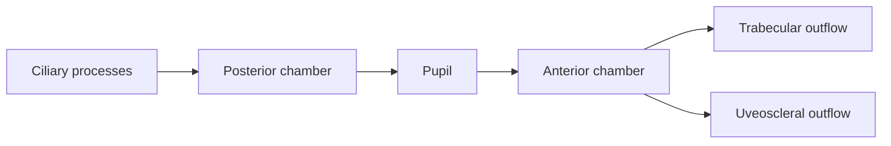

**Ciliary processes → posterior chamber → pupil → anterior chamber → outflow pathways**

---

#### 2.3 Aqueous Outflow

There are two major pathways.

| Feature | Trabecular / conventional | Uveoscleral / alternate |
|---|---|---|
| Contribution | **~80–90%**; source also quotes ~90% | **~10–20%**; source also quotes ~10% |
| Route | TM → Schlemm canal → collector/aqueous veins → episcleral veins | Ciliary body/supraciliary space → sclera |
| IOP dependence | Relatively pressure-dependent | Relatively pressure-independent |
| Major drug targets | Pilocarpine, ROCK inhibitors | Prostaglandin analogues |
| Laser | Trabeculoplasty | — |

##### Trabecular pathway

**Trabecular meshwork → Schlemm canal → aqueous/collector veins → episcleral veins**

The **iridocorneal angle** is the key anatomical site of conventional aqueous drainage.

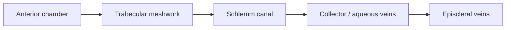

##### Uveoscleral pathway

**Anterior chamber → ciliary body/ciliary muscle → supraciliary/suprachoroidal space → sclera**

---

### 3. Autonomic Receptor Physiology Relevant to Glaucoma

For exam purposes, keep four receptor systems immediately associated with glaucoma pharmacology:

| Receptor | Major ocular location | Main effect |
|---|---|---|
| **α₁** | Iris dilator | **Mydriasis** |
| **α₂** | Ciliary epithelium/presynaptic sympathetic terminals | **↓ aqueous production + ↑ uveoscleral outflow** |
| **β₂** | Ciliary epithelium | **↑ aqueous production** |
| **M₃** | Iris sphincter + ciliary muscle | **Miosis + ↑ trabecular outflow** |

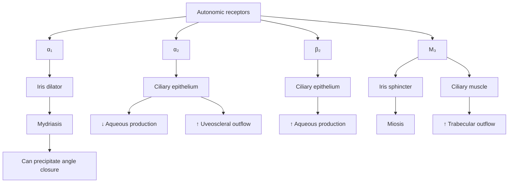

#### 3.1 α₁

**α₁ → iris dilator contraction → mydriasis**

Mydriasis can precipitate angle closure in predisposed eyes.

Important precipitating situations:

- Darkness
- Pharmacological mydriasis
- Sympathomimetics

#### 3.2 α₂

**α₂ stimulation → ↓ aqueous production**

Also:

**↑ uveoscleral outflow**

Important drugs:

- Brimonidine
- Apraclonidine

> **Source-note point:** Apraclonidine is described in the supplied notes as decreasing aqueous formation and increasing trabecular outflow. Standard teaching primarily emphasizes aqueous suppression, with additional outflow effects described variably.

#### 3.3 β₂

**β₂ stimulation → ↑ aqueous production**

Therefore:

**β-blockade → ↓ aqueous production → ↓ IOP**

Important drugs:

- Timolol
- Betaxolol
- Levobunolol

#### 3.4 M₃

M₃ stimulation produces:

**Iris sphincter contraction → miosis**

and:

**Ciliary-muscle contraction → traction on trabecular meshwork → ↑ trabecular outflow**

Important drug:

**Pilocarpine**

> **Key memory:**  
> **M₃ = miosis + drainage**  
> It does **not** increase aqueous production.

---

### 4. Pharmacological Logic of IOP Reduction

There are four major ways to lower IOP:

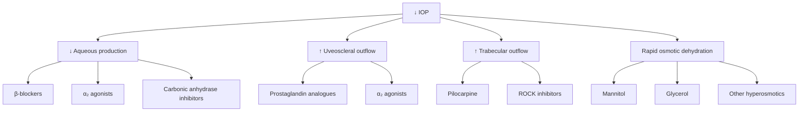

#### Pharmacological target map

| Strategy | Major agents |
|---|---|
| **↓ Aqueous formation** | β-blockers, α₂ agonists, CA inhibitors |
| **↑ Uveoscleral outflow** | Prostaglandin analogues, α₂ agonists |
| **↑ Trabecular outflow** | Pilocarpine, ROCK inhibitors |
| **Rapid vitreous dehydration** | Mannitol, glycerol, urea, isosorbide |

---

### 5. Epidemiology, Age and Risk Factors

#### 5.1 General risk factors

- Raised IOP
- Age >40 years
- Positive family history
- High myopia

#### 5.2 Angle-closure predisposition

- Small eye
- Hypermetropia
- Shallow anterior chamber
- Narrow angle
- Female sex
- Anteriorly placed lens–iris diaphragm

**Hypermetropia → small globe → shallow anterior chamber → narrow angle → increased risk of angle closure.**

---

### 6. Classification

#### 6.1 Broad classification

| Category | Types |
|---|---|
| **Congenital/developmental** | True congenital, infantile, juvenile |
| **Acquired** | Primary, secondary |
| **Primary** | Open-angle, angle-closure |
| **Secondary** | Open-angle, angle-closure |

#### 6.2 Developmental glaucoma

| Type | Approximate onset |
|---|---|
| **True congenital** | Present at birth |
| **Infantile** | ~3 months–3 years |
| **Juvenile** | ~3 years–adolescence |

**Buphthalmos** is characteristic of congenital/infantile glaucoma because infantile sclera can stretch with raised IOP.

#### 6.3 Primary vs secondary

**Primary glaucoma:** no identifiable secondary ocular/systemic cause.

**Secondary glaucoma:** glaucoma occurs due to another ocular/systemic mechanism.

#### 6.4 Open-angle vs angle-closure

| Feature | Open-angle | Angle-closure |
|---|---|---|
| Iridocorneal angle | Open | Narrow/closed |
| Main problem | Defective trabecular drainage | Iris obstructs angle |
| Anterior chamber | Generally deep | Shallow |
| Major laser principle | Trabeculoplasty | Iridotomy/iridoplasty |
| Typical acute presentation | Uncommon | Acute attacks may occur |

#### 6.5 Ocular hypertension, POAG and NTG

| Feature | Ocular hypertension | POAG | Normal-tension glaucoma |
|---|---|---|---|
| IOP | >21 mmHg | Elevated | Persistently <21 mmHg |
| Disc damage | Absent | Present | Present |
| Visual-field defect | Absent | Present | Present |
| Core concept | Pressure elevation without established damage | Glaucomatous optic neuropathy with elevated IOP | Glaucomatous damage despite normal-range IOP |

---

### 7. Pathophysiology of Glaucomatous Optic Neuropathy

Glaucoma produces progressive loss of neural tissue at the optic nerve head, particularly retinal ganglion cell axons.

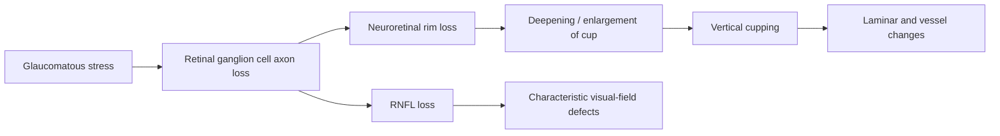

#### 7.1 Optic disc examination

Methods:

- **Direct ophthalmoscopy**
  - ~15× magnification
  - Central fundus visualized
  - No binocular depth perception
- **Slit-lamp biomicroscopy + +90 D lens**
- **Confocal scanning laser tomography**
- **Spectral-domain OCT**

#### 7.2 Glaucomatous cupping

| Structural finding | Significance |
|---|---|
| **Increased C/D ratio** | Normal ~0.3:1; suspicious >0.5:1 |
| **Inter-eye asymmetry** | >0.2 suspicious |
| Neuroretinal rim thinning/loss | Classically inferior rim emphasized |
| Deepening of cup | Nerve-fibre loss |
| Vertical oval cup | Early arcuate-fibre involvement |
| Laminar dot sign | Lamina cribrosa pores become visible |
| Nasal vessel shifting | Laminar/optic nerve head remodelling |
| Bayonetting | Sharp change/double angulation of disc vessel |
| Peripapillary atrophy | Alpha and beta zones |
| RNFL striation loss | Loss of retinal nerve fibres |
| Splinter haemorrhage | Disc-margin haemorrhage |

##### Laminar dot sign

Loss of neural tissue exposes the holes of the **lamina cribrosa**, producing multiple visible dots at the base of the cup.

##### Bayonetting sign

A retinal vessel shows a sharp change/double angulation or kink at the optic-disc margin.

##### Peripapillary atrophy

- **Alpha zone:** described in the source material as specific for glaucoma.
- **Beta zone:** also occurs in myopia and may appear as a temporal myopic crescent.

##### Lamina cribrosa remodelling

Contributes to:

- Deepening of the cup
- Nasal displacement of vessels
- Altered optic-disc architecture

---

### 8. Visual Field Physiology and Perimetry

#### 8.1 Normal visual field

The normal visual field is **horizontally oval with an inferonasal notch**.

| Direction | Approximate extent |
|---|---:|
| Temporal | **100°** |
| Inferior | **70°** |
| Nasal | **60°** |
| Superior | **50°** |

Other landmarks:

- Blind spot: approximately **10–20°** from fixation
- Fovea–blind-spot distance: approximately **2 disc diameters / 3 mm**

#### 8.2 Perimetry

Perimetry = examination of the visual field.

A visual field may be represented as a **2-D plot of a 3-D visual field**.

**Isopter** = contour connecting points of equal visual sensitivity.

| Type | Principle | Example |
|---|---|---|
| **Kinetic** | Moving target | Goldmann perimeter |
| **Static** | Stationary target; threshold testing | Humphrey, Octopus, Dicon |

**Humphrey automated perimetry** is emphasized in the source notes as the clinical gold standard.

---

### 9. Characteristic Glaucomatous Visual-Field Progression

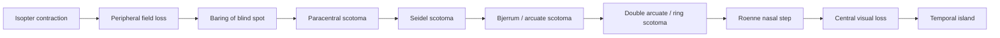

#### 9.1 Sequence

**Isopter contraction → peripheral field loss → baring of blind spot → paracentral scotoma → Seidel scotoma → Bjerrum/arcuate scotoma → double arcuate/ring scotoma → Roenne nasal step → central visual loss → temporal island**

#### 9.2 Important defects

| Defect | Characteristic |
|---|---|
| **Paracentral scotoma** | Earliest clinically visible/specific defect; Bjerrum area |
| **Seidel scotoma** | Comma/sickle-shaped; joins blind spot and extends into arcuate area |
| **Bjerrum/arcuate scotoma** | Arc-shaped defect following arcuate nerve fibres |
| **Double arcuate/ring scotoma** | Superior + inferior arcuate defects approach each other; central vision relatively preserved initially |
| **Roenne nasal step** | Step between superior/inferior arcs due to unequal field contraction |
| **Temporal island** | Last remaining field before complete field loss |

**Bjerrum area = central ~20–30°**

---

### 10. Examination of the Anterior Chamber Angle

#### 10.1 Angle structures

Posterior/deep → anterior/superficial:

**Iris root → ciliary body band → scleral spur → trabecular meshwork → Schwalbe line**

**Schwalbe line = peripheral termination of Descemet membrane.**

#### 10.2 Gonioscopy

**Best method for direct assessment of the anterior chamber angle.**

##### Principle

Normal cornea produces **total internal reflection**, preventing direct visualization of the angle.

A gonioscopy lens changes the optical interface and allows the angle to be seen.

Source-note critical angle:

**~46°**

Gonioscopy:

- Does not require pupil dilation.
- A dilated pupil is listed in the source material as a contraindication.

#### 10.3 Direct vs indirect gonioscopy

| Type | View | Setting | Examples |
|---|---|---|---|
| **Direct** | Direct | Patient lying down; useful during surgery | Richardson-Shaffer, Koeppe, Barkan, Swan-Jacob |
| **Indirect** | Mirrored/inverted | Slit lamp; routine outpatient | Goldmann, Zeiss, Posner, Sussman |

#### 10.4 Other angle investigations

- Van Herick method
- Oblique flashlight test
- UBM
- AS-OCT

##### Van Herick

Compares **peripheral anterior chamber depth (PACD)** with **corneal thickness (CT)**.

- **PACD = CT → open**
- **PACD <¼ CT → shallow/closed or closing**

##### Oblique flashlight test

Torch from temporal side:

- Nasal iris remains illuminated → open angle
- Nasal eclipse/shadow → closed angle

---

### 11. Intraocular Pressure and Tonometry

#### 11.1 IOP

Source notes use:

- **10–21 mmHg**
- Also **11–21 mmHg** in the tonometry section.

Diurnal variation may be up to approximately **5 mmHg**, with higher morning IOP associated in the source material with higher steroid levels.

---

#### 11.2 Tonometry principles

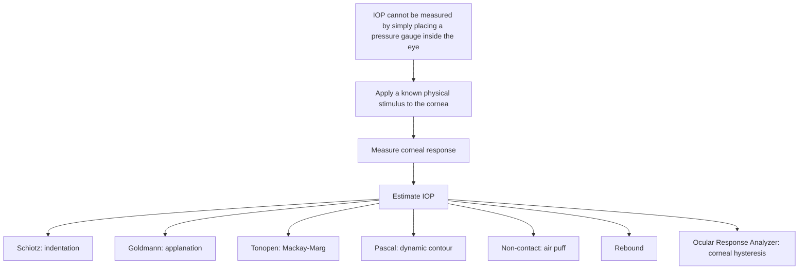

#### 11.3 Tonometry instruments

| Instrument | Principle / key use |
|---|---|
| **Schiotz** | Indentation; affected by scleral rigidity; less preferred |
| **Goldmann** | Applanation; **gold standard** |
| **Perkins** | Hand-held applanation; children/OT/anaesthesia |
| **Tono-Pen** | Portable; children/scarred/irregular cornea; Mackay-Marg |
| **Mackay-Marg** | Useful in irregular/oedematous cornea |
| **Pascal** | Dynamic contour; less dependent on CCT; useful post-LASIK |
| **Rebound** | Self-measurement/self-monitoring |
| **Non-contact** | Air-puff; screening/camps |
| **Transpalpebral** | Through eyelid; Diaton/Proview; uncommon |
| **Ocular Response Analyzer** | Non-contact; corneal hysteresis |

#### 11.4 Schiotz

- Indentation tonometer.
- Cornea is indented.
- Less preferred because of variability.
- Reading affected by scleral rigidity.

#### 11.5 Goldmann applanation tonometry

**Gold standard**

Based on **Imbert-Fick law**:

**Pressure = Force / area applanated**

- Fluorescein
- Cobalt-blue illumination
- Fixed applanation diameter: **3.06 mm**

Corneal thickness effect:

**Thin cornea → IOP underestimated**

**Thick cornea → IOP overestimated**

#### 11.6 Perkins

Hand-held applanation tonometer.

Useful in:

- Children
- Operating theatre
- Anaesthesia
- Patients unable to sit at a slit lamp

#### 11.7 Tono-Pen / Mackay-Marg

Portable applanation instrument.

Useful in:

- Children
- Scarred corneas
- Irregular corneas

Based on the **Mackay-Marg principle**.

#### 11.8 Pascal tonometer

**Dynamic contour tonometer**

- Reading is described in the notes as relatively independent of central corneal thickness.
- More reliable than Goldmann in the source comparison when CCT is abnormal.
- Particularly useful post-LASIK, where thin cornea may cause a falsely low Goldmann reading.

#### 11.9 Other tonometers

**Rebound:** self-monitoring.

**Non-contact:** air puff; screening.

**Transpalpebral:** through eyelid; Diaton and Proview; uncommon.

**Ocular Response Analyzer:** corneal hysteresis.

---

### 12. Clinical Presentations and Major Glaucoma Types

#### 12.1 Primary Open-Angle Glaucoma

POAG is a **chronic glaucoma with an open anterior chamber angle despite defective trabecular outflow**.

##### Typical profile

- Usually >50 years in the source notes.
- Positive family history may occur.
- Genes:
  - **WDR36**
  - **Optineurin**
  - **MYOC / myocilin**

##### Symptoms described in source notes

- Headache
- Delayed dark adaptation
- Frequent changes in presbyopic spectacles

##### IOP

- **>21 mmHg**
- Or inter-eye difference **>5 mmHg** highlighted in source material

##### Optic disc

- Inferior neuroretinal rim loss
- Vertical cupping
- C/D >0.5
- Bayonetting
- Laminar dot sign
- Peripapillary atrophy

##### Visual field

Follows characteristic glaucomatous progression:

**Paracentral → Seidel → arcuate/Bjerrum → double arcuate/ring → nasal step → advanced loss → temporal island**

---

#### 12.2 Normal-Tension Glaucoma

- IOP remains **constantly <21 mmHg** in the source notes.
- Glaucomatous optic-disc changes present.
- Visual-field defects present.
- Perfusion factors other than IOP are emphasized.

> **Core concept:** glaucomatous structural and functional damage despite normal-range measured IOP.

---

#### 12.3 Ocular Hypertension

- IOP **>21 mmHg**
- Optic disc/fundus normal
- No visual-field defect

> **Ocular hypertension = raised IOP without established glaucomatous optic neuropathy.**

---

### 13. Primary Angle-Closure Disease

#### 13.1 Pupillary-block mechanism

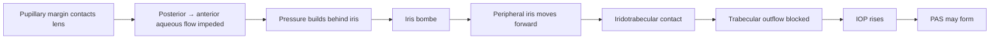

#### 13.2 Plateau iris

Plateau iris results from an anteriorly positioned/rotated ciliary body producing persistent peripheral iris crowding.

It may maintain angle closure even when simple pupillary block is absent or relieved.

---

#### 13.3 Primary angle-closure spectrum

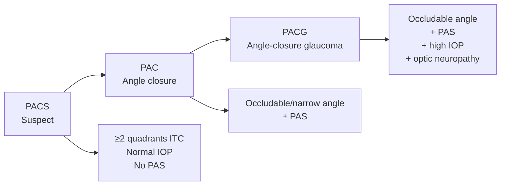

| Stage | Findings |
|---|---|
| **PACS** | Occludable angle involving **≥2 quadrants** of iridotrabecular contact; **no PAS; normal IOP** |
| **PAC** | Occludable/narrow angle; **PAS may be present** |
| **PACG** | Occludable angle + **PAS + high IOP + optic neuropathy** |

**Memory:**  
**PACS = suspect**  
**PAC = closure**  
**PACG = glaucoma**

---

### 14. Acute Primary Angle Closure

Acute angle closure is an **acute emergency caused by rapid angle obstruction and abrupt IOP elevation**.

#### 14.1 Predisposing factors

- Hypermetropia / small eye
- Female sex
- Anteriorly placed lens–iris diaphragm
- Shallow anterior chamber
- Narrow angle

#### 14.2 Precipitating factors

- Dark environment
- Prone position
- Mydriasis
- Emotional stress
- **Topiramate** via ciliary-body effusion mechanism described in the source notes
- Sympathomimetics

#### 14.3 IOP

Can rapidly rise to:

**40–60 mmHg**

Severe pain with IOP >40 mmHg is emphasized in the source.

#### 14.4 Symptoms

- Severe headache
- Severe eye pain
- Painful red eye
- Photophobia
- Blepharospasm
- Vomiting
- Distorted/hazy vision
- Halos around lights due to corneal oedema

#### 14.5 Signs

- Marked congestion/redness
- **Corneal oedema**
- Shallow anterior chamber
- Closed angle
- **Fixed, mid-dilated, vertically oval pupil**
- Rock-hard eye
- Eclipse sign on oblique flashlight testing
- Cupping may or may not yet be present
- PAS may form

---

### 15. Acute Angle-Closure Treatment

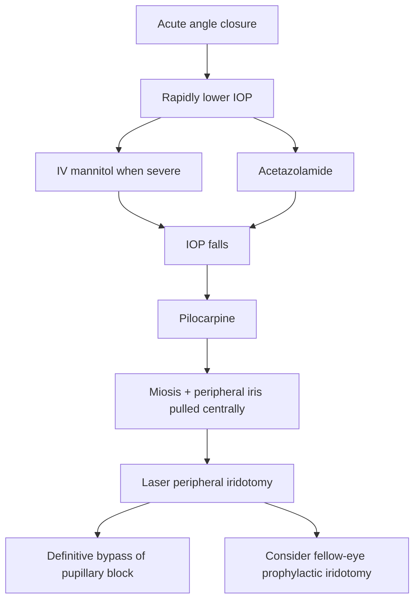

#### 15.1 Initial treatment

1. **Supine position**
2. **IV mannitol** — emergency osmotic treatment emphasized in source
3. **Systemic acetazolamide** as indicated
4. **Pilocarpine after IOP has fallen**
5. Topical corticosteroids
6. **10% topical glycerine** is listed in the source notes
7. Lens extraction when indicated

#### 15.2 Why is pilocarpine delayed?

At very high IOP the iris sphincter may be ischemic and poorly responsive.

Therefore:

**Lower IOP first → then pilocarpine**

#### 15.3 Definitive treatment

**Laser peripheral iridotomy**

- Usually **Nd:YAG**
- Creates peripheral iris opening
- Bypasses pupillary block
- Equalizes posterior/anterior chamber pressure
- Typically positioned approximately **11 o'clock–1 o'clock**
- Fellow-eye prophylactic iridotomy may be indicated
- Surgery is an alternative when required

#### 15.4 Vogt triad after acute angle closure

1. Fixed/mid-dilated pupil with sphincter damage
2. Iris atrophy
3. **Glaukomflecken** — anterior subcapsular lens opacity

---

### 16. Chronic Angle-Closure Glaucoma

- Can resemble open-angle glaucoma clinically.
- Gonioscopy demonstrates creeping/gradual angle closure.

#### Dark Room Prone Provocative Test

- Patient placed in dark room/prone position.
- IOP response compared between eyes.
- Especially described as useful after peripheral iridotomy.
- IOP rise may support **plateau iris**.

#### Absolute glaucoma

Advanced/end-stage glaucoma is described in the source material in association with cyclodestructive treatment when IOP must be controlled by reducing aqueous production.

---

### 17. Secondary Glaucomas

#### 17.1 Pigmentary glaucoma

**Secondary open-angle glaucoma**

##### Mechanism

**Iris pigment dispersion → pigment deposition in TM → trabecular obstruction → raised IOP**

##### Typical features

- **Young myopes**
- Exercise may increase pigment shedding
- Iris may rub against suspensory apparatus
- **Krukenberg spindle**
- **Sampaolesi line**

---

#### 17.2 Pseudoexfoliation glaucoma

Described in the source notes as the **most common secondary open-angle glaucoma**.

##### Findings

- Pseudoexfoliative material on anterior lens capsule
- Material at pupillary margin
- **Target sign** → anterior lens-capsule deposit
- **Fnocks** → pupillary-margin deposits
- May make mydriasis difficult
- **Sampaolesi line**
- Exfoliative material obstructs trabecular drainage

---

#### 17.3 Neovascular glaucoma


##### Major causes

- **Proliferative diabetic retinopathy**
- **Ischaemic CRVO**

##### Pathogenesis

1. Retinal ischaemia → angiogenic factors/VEGF
2. New vessels on iris → **rubeosis iridis**
3. Neovascularization extends into angle
4. Trabecular drainage impaired
5. Early stage may be open-angle
6. Fibrovascular contraction closes the angle

##### Management

- **Anti-VEGF**
- **Pan-retinal photocoagulation (PRP)** for underlying retinal ischaemia

---

#### 17.4 Lens-induced glaucoma

##### Phacomorphic glaucoma

**Intumescent/swollen lens → iris pushed forward → shallow AC → angle crowding/closure**

##### Phacolytic glaucoma

**Hypermature/Morgagnian cataract → lens-protein leakage through intact capsule → macrophages ingest protein → macrophages obstruct TM**

| Feature | Phacomorphic | Phacolytic |
|---|---|---|
| Lens | Swollen/intumescent | Shrunken/hypermature |
| AC | **Shallow** | **Deep** |
| Mechanism | Forward iris displacement/angle crowding | Protein + macrophage obstruction |
| Typical cataract | Intumescent | Morgagnian/hypermature |
| Capsule | Intact | Intact |

---

#### 17.5 Malignant glaucoma / ciliary block glaucoma

Usually occurs after **intraocular surgery**.


##### Management

1. **Atropine**
   - Relaxes/dilates ciliary ring
   - Helps reverse ciliary block/misdirection
2. If inadequate:
   - **Nd:YAG opening of anterior hyaloid**
3. If refractory:
   - **Pars plana vitrectomy**

##### Why Nd:YAG / vitrectomy?

The problem is posterior misdirection of aqueous with vitreous/lens-iris diaphragm displacement.

- **Nd:YAG anterior hyaloidotomy** → creates a passage through the anterior hyaloid for aqueous to move forward.
- **PPV** → removes the vitreous component responsible for the forward push and corrects the misdirection when laser treatment fails.

---

#### 17.6 Posner-Schlossman syndrome

Also called **glaucomatocyclitic crisis**.

##### Features

- Mild anterior uveitis
- Attacks of raised IOP
- Glaucoma component predominates
- **Open angle**
- Uveitis may promote trabecular obstruction

##### Associations listed

- Young males
- CMV
- H. pylori
- HLA association

##### Treatment

- Control IOP
- **Beta blocker** described as the drug of choice for IOP
- Topical steroids under antiglaucoma cover
- Prostaglandin analogues and pilocarpine are listed in the source as contraindicated because of inflammatory concerns

---

### 18. Congenital Glaucoma

Congenital glaucoma is a **developmental open-angle glaucoma caused by abnormal development of the trabecular outflow pathway**.

#### 18.1 Pathogenesis

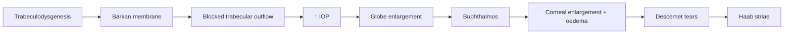

- **Trabeculodysgenesis**
- **Barkan membrane** replacing/obstructing normally developed trabecular meshwork
- Reduced aqueous outflow
- Aqueous accumulation
- Deepened AC
- Posterior lens displacement
- Enlarging globe → **buphthalmos**
- Megalocornea
- Corneal oedema
- Descemet membrane tears → **Haab striae**

#### 18.2 Clinical features

- **Buphthalmos** — enlarged globe/ox-eye appearance
- Deep anterior chamber
- Increased axial length → myopia
- Enlarged cornea
- Blue sclera
- **Corneal oedema/hazy cornea = earliest sign**
- **Haab striae = horizontal Descemet membrane tears**
- Blepharospasm
- Photophobia/photosensitivity
- Lacrimation

##### Corneal diameter

The source notes contain both:

- **>11.5 mm** for megalocornea in one description
- **>13 mm** in another description of enlarged cornea/buphthalmos

Both values are retained because they appear in the source material.

#### 18.3 Management

Congenital glaucoma is fundamentally **surgical**.

- Medical treatment is temporary/supportive.
- **Trabeculotomy + trabeculectomy** are listed as definitive procedures.
- **Goniotomy** is the treatment of choice when cornea is clear.
- Goniotomy uses a **goniotomy knife**.
- Functioning bleb indicates a functioning filtration pathway.

---

### 19. Pharmacological Treatment of Glaucoma

#### 19.1 Treatment target

**Target IOP = the IOP at which progression of visual-field defects is prevented without compromising quality of life.**

---

#### 19.2 Master drug table

| Class | Drug(s) | Main glaucoma/use | Mechanism | Contraindications / cautions | Major adverse effects | Special point |
|---|---|---|---|---|---|---|
| **Prostaglandin analogues** | **Latanoprost, travoprost, bimatoprost, tafluprost, unoprostone** | OAG/OHT; major first-line topical class; NTG emphasized | Mainly **↑ uveoscleral outflow**; FP-receptor pathway for classic FP agonists | Uveitis, postoperative CME, CME risk, herpes simplex reactivation concern | Hypertrichosis/eyelash growth, iris/periocular pigmentation, hyperaemia, CME, uveitis | Once daily; ~25–30% efficacy in source; flatten diurnal IOP fluctuation |
| **β-blockers** | **Timolol, betaxolol, levobunolol** | OAG; adjunctive IOP lowering | β-blockade → ↓ aqueous production | Heart block, bradycardia, asthma/COPD; diabetes caution | Bradycardia, hypotension, bronchospasm; masks hypoglycaemia; corneal anaesthesia, NLD blockage, blepharoconjunctivitis | Timolol/levobunolol non-selective; betaxolol relatively β₁-selective |
| **α₂ agonists** | **Brimonidine, apraclonidine** | OAG/OHT; adjunct; acute/post-laser IOP lowering | Mainly ↓ aqueous production; ↑ uveoscleral outflow; apraclonidine also described in source as ↑ trabecular outflow | Children; CNS depression; apraclonidine limited by allergy/tachyphylaxis | Brimonidine: drowsiness, depression, apnoea; apraclonidine: follicular conjunctivitis, eyelid retraction, mydriasis | Brimonidine crosses BBB; apraclonidine more useful short-term |
| **CA inhibitors** | **Acetazolamide, dorzolamide, brinzolamide** | OAG/OHT; acetazolamide important in acute severe IOP elevation | CA inhibition → ↓ bicarbonate-dependent aqueous formation | Sulfonamide allergy caution; systemic CAI: renal/metabolic problems | Paresthesias, GI upset, metabolic acidosis, electrolyte effects, renal stones with systemic therapy | Acetazolamide = systemic; dorzolamide/brinzolamide = topical |
| **Miotic / muscarinic agonist** | **Pilocarpine** | OAG; chronic angle closure; acute angle closure after IOP lowered | M₃ → miosis + ciliary-muscle contraction → **↑ trabecular outflow** | Uveitis; caution in high myopia/retinal-detachment risk | Brow ache, headache, accommodative spasm, induced myopia | In acute angle closure: **give after IOP falls** |
| **ROCK inhibitors** | **Netarsudil, ripasudil** | OAG/adjunct | ↑ trabecular outflow; netarsudil also lowers episcleral venous resistance | Ocular tolerance | Hyperaemia, **vortex keratopathy/corneal verticillata**, irritation | Trabecular pathway drug class |
| **Hyperosmotics** | **Mannitol, glycerol, urea, isosorbide** | Acute/severe IOP elevation | ↑ plasma osmolarity → water leaves vitreous → rapid ↓ IOP | Renal disease, cardiac compromise/volume overload | Fluid/electrolyte disturbance; cardiac/renal complications | Mannitol = IV; glycerol = oral |

---

### 20. Prostaglandin Analogues

#### 20.1 Latanoprost

**Latanoprost → FP receptor → ↑ uveoscleral outflow → ↓ IOP**

Important effects:

- Mainly increases uveoscleral outflow
- May also influence trabecular outflow
- Once daily
- Approximately **25–30% IOP reduction** in source notes
- Good compliance
- Fewer systemic effects
- Flattens diurnal IOP fluctuation
- Specifically emphasized for **normal-tension glaucoma**

##### Adverse effects

- Eyelash lengthening/hypertrichosis
- Iris pigmentation
- Periocular pigmentation
- Ocular hyperaemia
- Cystoid macular oedema
- Uveitis

##### Important cautions

- Uveitis
- Postoperative states
- CME
- Herpes simplex reactivation risk

---

### 21. β-Adrenergic Blockers

#### Timolol

- Non-selective β-blocker
- Blocks β₁ and β₂
- ↓ aqueous production

#### Betaxolol

- Relatively β₁-selective
- ↓ aqueous production
- Less β₂ pulmonary blockade than non-selective agents

#### Levobunolol

- Non-selective β-blocker
- ↓ aqueous production

##### Major precautions

- Asthma
- COPD
- Heart block
- Bradycardia/cardiac conduction disease
- Diabetes: may mask hypoglycaemia

##### Other adverse effects in source notes

- Corneal anaesthesia
- Nasolacrimal duct blockage
- Blepharoconjunctivitis

---

### 22. α₂-Adrenergic Agonists

#### Brimonidine

**α₂ → ↓ aqueous production + ↑ uveoscleral outflow**

Important:

- Crosses BBB
- Drowsiness
- Depression
- Apnoea/CNS depression
- Children are listed in source notes as contraindicated because of risk of CNS/respiratory/cardiac suppression

#### Apraclonidine

**α₂ agonist**

Main effect:

**↓ aqueous formation**

Source notes additionally state:

**↑ trabecular outflow**

Important limitation:

**Tachyphylaxis**

Adverse effects:

- Eyelid retraction
- Mydriasis
- Follicular conjunctivitis
- Allergy

Therefore especially useful for:

- Short-term IOP reduction
- Acute/post-laser IOP spikes

---

### 23. Carbonic Anhydrase Inhibitors

#### Mechanism

**CA inhibition → ↓ bicarbonate-dependent secretion → ↓ aqueous formation → ↓ IOP**

#### Acetazolamide

- Systemic/oral; IV also used clinically in acute settings
- Important in acute angle closure and marked IOP elevation
- Used as adjunct in resistant glaucoma

Adverse effects:

- Paresthesias
- GI upset
- Polyuria
- Fatigue
- Metabolic acidosis
- Electrolyte disturbances
- Renal stones

Cautions:

- Sulfonamide hypersensitivity
- Significant renal disease
- Metabolic/electrolyte problems

#### Dorzolamide

Topical CA inhibitor.

**↓ aqueous formation**

Used mainly in:

- OAG
- OHT

#### Brinzolamide

Topical CA inhibitor.

**↓ aqueous formation**

Used mainly in:

- OAG
- OHT

---

### 24. Pilocarpine

**Pilocarpine = M₃ agonist**

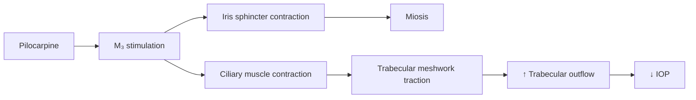

##### Adverse effects

- Brow ache
- Headache
- Accommodative spasm
- Induced myopia
- Reduced night vision

##### Cautions

- Uveitis
- High myopia/retinal-detachment concern

##### Acute angle closure

**Pilocarpine is used after IOP has been reduced.**

---

### 25. Rho-Kinase Inhibitors

Drugs:

- **Netarsudil**
- **Ripasudil**

Main action:

**ROCK inhibition → ↑ trabecular outflow**

Netarsudil also lowers episcleral venous pressure.

Important adverse effect:

**Vortex keratopathy / corneal verticillata**

Other causes of vortex keratopathy listed in the source:

- Chloroquine
- Amiodarone
- Tamoxifen
- Indomethacin
- Fabry disease

---

### 26. Hyperosmotic Agents

#### Mechanism

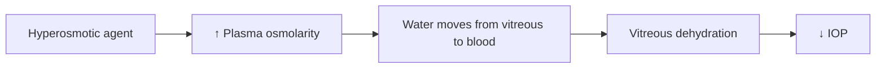

Drugs:

- **Mannitol — IV**
- **Glycerol — oral**
- Urea
- Isosorbide

Important precautions:

- Renal disease
- Compromised cardiac function

**Mannitol** is emphasized as the emergency osmotic drug in acute angle closure.

---

### 27. Drug Selection by Clinical Situation

| Situation | Preferred/important treatment |
|---|---|
| **Chronic open-angle glaucoma** | Prostaglandin analogue first-line class; add β-blocker, α₂ agonist, CAI or ROCK inhibitor as needed |
| **Normal-tension glaucoma** | Prostaglandin analogue emphasized, especially for IOP/fluctuation control |
| **Acute angle closure** | Rapid IOP reduction with acetazolamide ± IV mannitol → pilocarpine after IOP falls → definitive LPI |
| **Chronic angle closure** | IOP-lowering therapy + treatment of underlying mechanism; LPI when pupillary block |
| **Posner-Schlossman** | β-blocker for IOP + topical corticosteroid under antiglaucoma cover |
| **Malignant glaucoma** | Atropine → Nd:YAG anterior hyaloid opening if necessary → PPV if refractory |
| **Congenital glaucoma** | Medical therapy temporary; definitive management surgical |
| **Neovascular glaucoma** | IOP lowering + anti-VEGF + PRP |
| **Refractory/absolute glaucoma** | Multiple medications, cyclodestruction and/or glaucoma surgery as appropriate |

---

### 28. Laser Treatment

#### 28.1 Principle

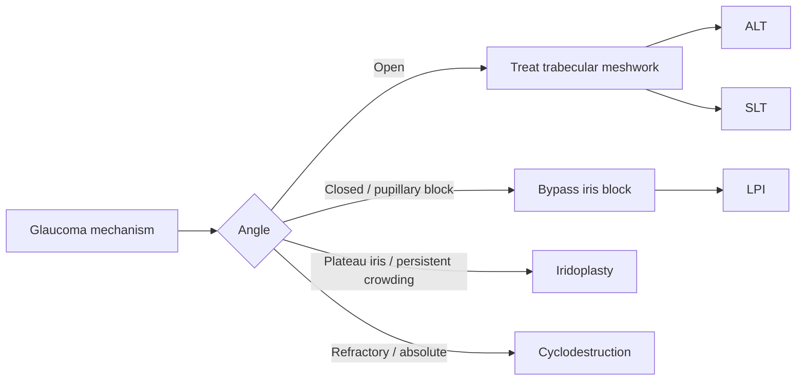

#### 28.2 Laser peripheral iridotomy

Usually:

**Nd:YAG laser**

Creates a peripheral iris hole.

Mechanism:

**Posterior chamber → iridotomy → anterior chamber**

Thus bypasses pupillary block.

Indication:

**Angle-closure glaucoma due to pupillary block**

Typical position:

**~11 o'clock–1 o'clock**

May also be used prophylactically in the fellow eye.

#### 28.3 Laser iridoplasty

Indication:

**Plateau iris / persistent angle crowding**

#### 28.4 Laser trabeculoplasty

Indication:

**Open-angle glaucoma**

Mechanism:

Treat trabecular meshwork → improve trabecular outflow.

Types:

- **ALT — argon laser trabeculoplasty**
- **SLT — selective laser trabeculoplasty**
  - Frequency-doubled Nd:YAG/yellow laser
- Diode laser techniques also listed

#### 28.5 Cyclodestructive laser

Used particularly for:

- Absolute glaucoma
- Refractory glaucoma
- Situations requiring reduction of aqueous production

Mechanism:

**Ciliary process destruction → ↓ aqueous formation**

Methods:

- Cyclophotocoagulation
- Transscleral
- Endoscopic
- Cryotherapy
- Laser photocoagulation
- Diode laser photocoagulation (**DLCP**)

---

### 29. Surgical Treatment

#### 29.1 Trabeculectomy

Described in the source as the **best surgery** in the surgical section.

Creates:

**Anterior chamber → controlled fistula → subconjunctival space → filtration bleb**

Antimetabolites:

- **Mitomycin C**
- **5-fluorouracil**

**Functioning bleb → functioning filtration pathway**

#### 29.2 Non-penetrating surgery

- Deep sclerectomy
- Viscocanalostomy

#### 29.3 Glaucoma drainage devices / setons

Used particularly for **resistant glaucoma**.

Examples:

- Express mini-shunt
- Molteno
- Ahmed glaucoma valve

#### 29.4 MIGS

**Minimally invasive glaucoma surgery**

Example:

- **iStent**

---

### 30. Clinical Comparison Tables

#### 30.1 Ocular hypertension vs POAG vs NTG

| Feature | Ocular hypertension | POAG | NTG |
|---|---|---|---|
| IOP | >21 | Elevated | <21 |
| Disc damage | No | Yes | Yes |
| Field defect | No | Yes | Yes |
| Core idea | High pressure without established damage | Glaucomatous optic neuropathy with elevated IOP | Glaucomatous optic neuropathy despite normal-range IOP |

#### 30.2 Open-angle vs angle-closure

| Feature | Open-angle | Angle-closure |
|---|---|---|
| Angle | Open | Narrow/closed |
| Main obstruction | Trabecular dysfunction | Iris apposition/displacement |
| AC | Deep | Shallow |
| Laser | Trabeculoplasty | Iridotomy ± iridoplasty |

#### 30.3 Phacomorphic vs phacolytic

| Feature | Phacomorphic | Phacolytic |
|---|---|---|
| Lens | Swollen | Shrunken/hypermature |
| AC | Shallow | Deep |
| Mechanism | Forward iris displacement | Protein + macrophage obstruction |
| Cataract | Intumescent | Morgagnian/hypermature |

#### 30.4 Pseudoexfoliation vs pigmentary

| Feature | Pseudoexfoliation | Pigmentary |
|---|---|---|
| Mechanism | Exfoliative material blocks TM | Pigment blocks TM |
| Key sign | Target sign + Fnocks | Krukenberg spindle |
| Angle sign | Sampaolesi line | Sampaolesi line |
| Demographic clue | Secondary OAG | Young myopes |

#### 30.5 Acute angle closure vs malignant glaucoma

| Feature | Acute angle closure | Malignant glaucoma |
|---|---|---|
| Mechanism | Pupillary block → iris bombe | Aqueous misdirection/ciliary block |
| AC | Shallow | Very shallow |
| Setting | Predisposed eye + precipitant | Often post-intraocular surgery |
| Key treatment | Mannitol/acetazolamide → pilocarpine after IOP falls → LPI | Atropine → Nd:YAG hyaloid opening → PPV if refractory |

---

### 31. Diagnosis: Practical Framework

Glaucoma diagnosis requires integration of:

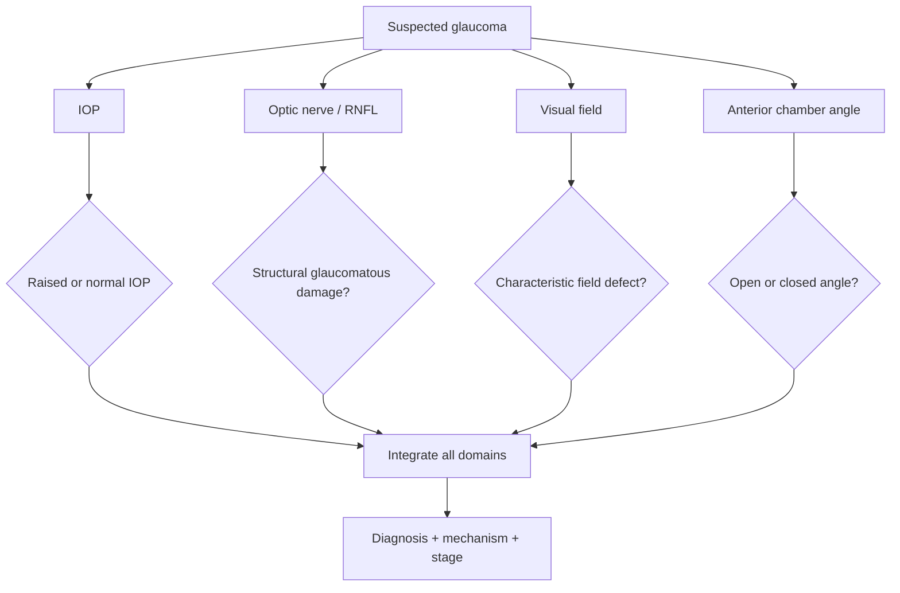

#### Structural domain

Assess:

- C/D ratio
- Inter-eye asymmetry
- Neuroretinal rim
- RNFL
- Laminar changes
- Vessel changes
- Peripapillary atrophy

#### Functional domain

Assess:

- Paracentral scotoma
- Seidel scotoma
- Arcuate/Bjerrum defects
- Double arcuate/ring defects
- Nasal step
- Central loss
- Temporal island

#### Pressure domain

Assess:

- Absolute IOP
- Inter-eye asymmetry
- Diurnal fluctuation
- Corneal-thickness context

#### Angle domain

**Gonioscopy = key examination**

Determines:

- Open vs closed
- Extent of angle closure
- PAS
- Mechanism

---

### 32. Management by Mechanism

#### 32.1 Open-angle glaucoma

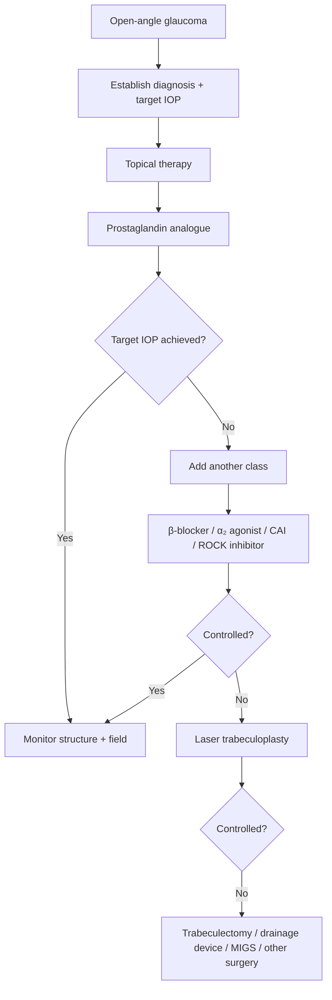

Main medical options:

- Prostaglandin analogues
- β-blockers
- α₂ agonists
- CA inhibitors
- Pilocarpine
- ROCK inhibitors

If uncontrolled:

- Laser trabeculoplasty
- Trabeculectomy
- Deep sclerectomy
- Viscocanalostomy
- Drainage devices
- MIGS

---

#### 32.2 Angle-closure glaucoma

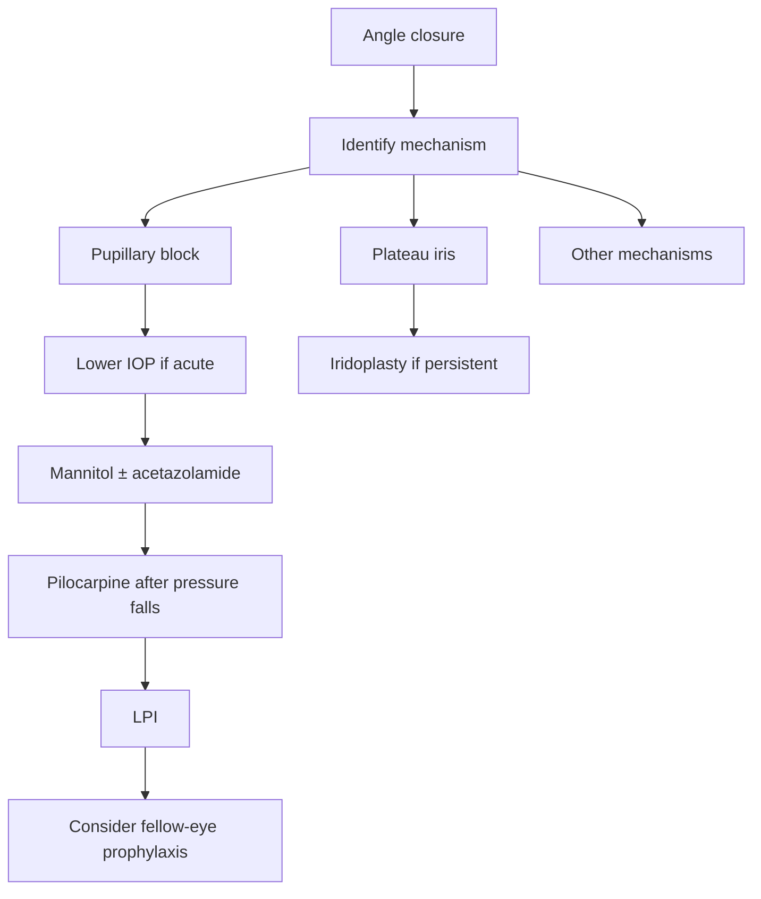

---

#### 32.3 Congenital glaucoma

**Definitive treatment = surgery**

Important procedures:

- Trabeculotomy
- Trabeculectomy
- Goniotomy when cornea is clear

---

### 33. Progression and Follow-up

Monitor the same three domains that define the disease:

#### IOP

- Absolute value
- Trend
- Fluctuation
- Response to treatment

#### Structural progression

Monitor:

- Increasing C/D ratio
- Rim thinning/loss
- Increasing vertical cupping
- Laminar changes
- Vessel displacement/bayonetting
- Peripapillary changes
- RNFL abnormalities

#### Functional progression

Monitor:

**Paracentral → Seidel → arcuate → double arcuate/ring → nasal step → central loss → temporal island**

#### Ultimate endpoint

**Preserve useful visual field and quality of life while preventing further progression.**

---

### 34. High-Yield Numbers

| Parameter | Value |
|---|---:|
| Normal IOP | **10–21 mmHg**; source also uses 11–21 |
| Raised IOP threshold in notes | **>21 mmHg** |
| Diurnal variation | **Up to ~5 mmHg** |
| Acute angle-closure IOP | **40–60 mmHg** |
| Normal C/D | **~0.3** |
| Suspicious C/D | **>0.5** |
| Suspicious inter-eye asymmetry | **>0.2** |
| Goldmann applanation diameter | **3.06 mm** |
| Corneal critical angle | **~46°** |
| Aqueous production | **2–3 µL/min** |
| Trabecular outflow | **~80–90%** |
| Uveoscleral outflow | **~10–20%** |
| Bjerrum area | **20–30°** |
| Temporal visual field | **100°** |
| Inferior | **70°** |
| Nasal | **60°** |
| Superior | **50°** |
| Blind spot from fixation | **~10–20°** |
| Fovea → blind spot | **~2 DD / 3 mm** |
| LPI position in source notes | **~11 o'clock–1 o'clock** |

---

### 35. High-Yield Associations

| Finding | Diagnosis / association |
|---|---|
| **Normal IOP + glaucomatous disc + field loss** | Normal-tension glaucoma |
| **High IOP + normal disc/field** | Ocular hypertension |
| **C/D >0.5** | Suspicious glaucoma |
| **C/D asymmetry >0.2** | Suspicious |
| **Krukenberg spindle** | Pigmentary glaucoma |
| **Sampaolesi line** | Pigmentary/pseudoexfoliation |
| **Target sign** | Pseudoexfoliation |
| **Fnocks** | Pseudoexfoliation |
| **Rubeosis iridis** | Neovascular glaucoma |
| **Swollen intumescent lens + shallow AC** | Phacomorphic glaucoma |
| **Shrunken hypermature lens + deep AC** | Phacolytic glaucoma |
| **Postoperative aqueous misdirection + very shallow AC** | Malignant glaucoma |
| **Mild uveitis + high IOP + open angle** | Posner-Schlossman |
| **Buphthalmos + hazy cornea + Haab striae** | Congenital glaucoma |
| **Fixed mid-dilated pupil + corneal oedema + severe pain** | Acute angle closure |
| **Paracentral scotoma** | Early characteristic glaucomatous field defect |
| **Seidel** | Comma/sickle-shaped scotoma |
| **Bjerrum** | Arcuate scotoma |
| **Roenne** | Nasal step |
| **Temporal island** | Last remaining visual field |

---

### 36. High-Yield Drug Associations

| Question | Answer |
|---|---|
| First-line topical class emphasized | **Prostaglandin analogues** |
| Classic first-line drug | **Latanoprost** |
| Latanoprost pathway | **Uveoscleral outflow** |
| Key β receptor | **β₂** |
| β-blocker action | **↓ aqueous production** |
| α₂ agonist action | **↓ aqueous production + ↑ uveoscleral outflow** |
| M₃ agonist | **Pilocarpine** |
| M₃ effects | **Miosis + ↑ trabecular outflow** |
| Systemic CA inhibitor | **Acetazolamide** |
| Topical CAIs | **Dorzolamide, brinzolamide** |
| ROCK inhibitors | **Netarsudil, ripasudil** |
| ROCK pathway | **↑ trabecular outflow** |
| Emergency osmotic drug | **IV mannitol** |
| Oral hyperosmotic | **Glycerol** |
| Acute angle closure: pilocarpine timing | **After IOP falls** |
| Definitive pupillary-block treatment | **Laser peripheral iridotomy** |
| Plateau iris | **Laser iridoplasty** |
| Open angle laser | **Trabeculoplasty** |
| Malignant glaucoma drug | **Atropine** |
| Congenital glaucoma | **Surgery** |

---

### 37. Core Mental Model

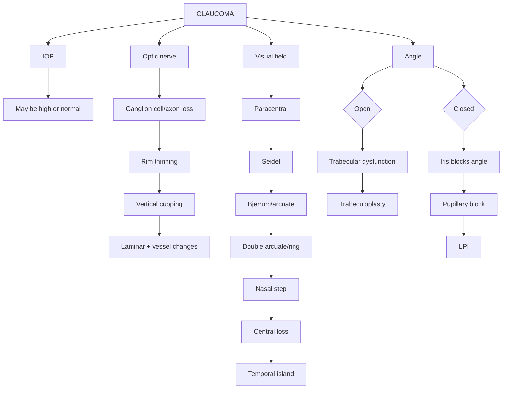

### 38. One-Minute Pharmacology Map

```text
AQUEOUS PRODUCTION
        ↓
Ciliary processes
        ↓
Non-pigmented ciliary epithelium
        │
        ├── β₂ → ↑ aqueous
        │       └── β-blocker → ↓ aqueous
        │
        ├── α₂ → ↓ aqueous
        │       └── Brimonidine / Apraclonidine
        │
        └── Carbonic anhydrase
                └── CAI → ↓ aqueous
                    Acetazolamide
                    Dorzolamide
                    Brinzolamide


OUTFLOW
   │
   ├── TRABECULAR ~80–90%
   │       │
   │       ├── M₃
   │       │    └── Pilocarpine
   │       │         → miosis
   │       │         → ↑ ciliary contraction
   │       │         → ↑ trabecular outflow
   │       │
   │       └── ROCK
   │            └── Netarsudil / Ripasudil
   │                 → ↑ trabecular outflow
   │
   └── UVEOSCLERAL ~10–20%
           │
           ├── Prostaglandin analogues
           │    └── Latanoprost etc.
           │         → ↑ uveoscleral outflow
           │
           └── α₂ agonists
                └── ↑ uveoscleral component


ACUTE ANGLE CLOSURE
        ↓
↓ IOP urgently
        ↓
Acetazolamide ± IV mannitol
        ↓
IOP falls
        ↓
Pilocarpine
        ↓
Nd:YAG peripheral iridotomy
        ↓
BYPASS PUPILLARY BLOCK
```

### 39. Final Exam Framework

**Glaucoma = optic neuropathy + irreversible characteristic field loss.**

**IOP may be high or normal.**

**Aqueous pathway:**

**Ciliary processes → posterior chamber → pupil → anterior chamber → trabecular/uveoscleral outflow**

**Open angle:**

**Trabecular dysfunction → ↑ outflow resistance → treat with IOP-lowering drugs, trabeculoplasty or surgery**

**Closed angle:**

**Pupillary block → iris bombe → iridotrabecular contact → IOP rise → relieve block with LPI**

**Optic nerve:**

**Axon loss → rim thinning → vertical cupping → laminar/vessel changes**

**Visual field:**

**Paracentral → Seidel → Bjerrum/arcuate → double arcuate/ring → nasal step → central loss → temporal island**

**Acute angle closure:**

**High IOP + corneal oedema + painful red eye + headache/vomiting + fixed mid-dilated pupil**

→ **mannitol/acetazolamide → pilocarpine after IOP falls → LPI**

**Congenital glaucoma:**

**Trabeculodysgenesis → buphthalmos + corneal oedema + Haab striae → surgery**

**Secondary glaucoma clues:**

- Target sign/Fnocks → pseudoexfoliation
- Krukenberg spindle → pigmentary glaucoma
- Rubeosis → neovascular glaucoma
- Swollen lens → phacomorphic
- Shrunken hypermature lens + macrophages → phacolytic
- Postoperative aqueous misdirection → malignant glaucoma
- Mild uveitis + high IOP + open angle → Posner-Schlossman

**Pharmacology in one line:**

> **Make less aqueous, drain more through uveoscleral/trabecular pathways, or pull water out of the vitreous.**
