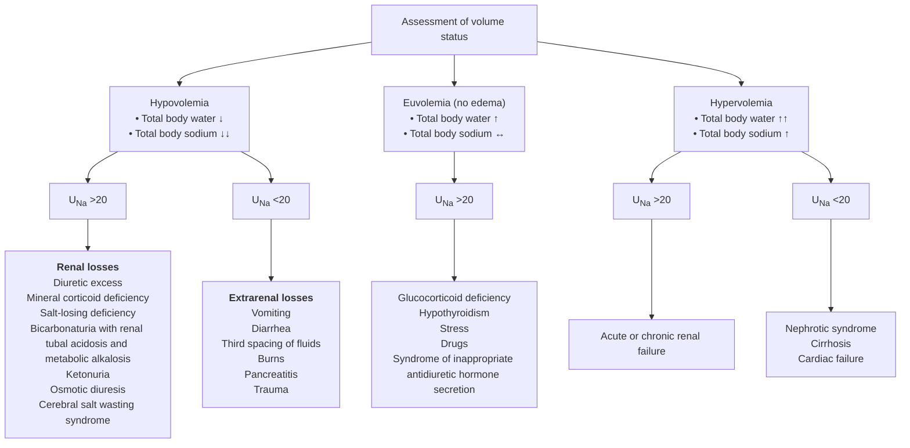

---
tags:
  - hyponatremia
  - harrison
  - study-notes
  - medicine
  - nephrology
  - metabolism
  - Harrison
---

# Hyponatremia

>[!abstract] Definition & Overview
> **Hyponatremia** is defined as a plasma $[Na^+] < 135 \text{ mM}$. It occurs in up to 22% of hospitalized patients.
> - **Primary Mechanism:** Elevated circulating **Arginine Vasopressin (AVP)** and/or increased renal sensitivity to AVP, combined with free water intake.
> - **Exception:** Low solute intake states (e.g., Beer Potomania).

> ADH (Anti-Diuretic Hormone) = Vasopressin = AVP

---

## Diagnostic Subtypes & Etiologies

### 1. Hypovolemic Hyponatremia
> Classic Dehydration

Hypovolemia causes neurohumoral activation, increasing AVP to preserve blood pressure (via $V_{1A}$ receptors) and retain water (via $V_2$ receptors).

#### **Nonrenal ($U_{Na} < 20 \text{ mM}$):**

>Since Kidney is working fine here, Kidney will be able to preserve sodium due to action of RAAS system. Meanwhile, ADH will continue to try to preserve water using aquaporins.

 1. GI losses (vomiting, diarrhea, tube drainage), 
 2. sweating, 
 3. burns.
  * Clinical Pearl: Infusing normal saline rapidly plummets AVP levels, inducing brisk free-water diuresis.

#### **Renal ($U_{Na} > 20 \text{ mM}$):**
  * **Primary Adrenal Insufficiency:** 
	  * Aldosterone deficiency causing 
		  1. hyponatremia, 
		  2. hyperkalemia, 
		  3. hypotension, and 
		  4. high $U_{Na}$.
  * **Salt-Losing Nephropathies:** 
	  * Reflux, 
	  * interstitial nephropathies, 
	  * post-obstructive uropathy, 
	  * medullary cystic disease, 
	  * recovery phase of ATN.
  * **Diuretics:** 
    * *Thiazides:* Impair urinary dilution while preserving concentrating mechanisms (AVP retains full effect).
    * *Loop Diuretics:* Inhibit $Na^+$-$K^+$-$2Cl^-$ transport in the TALH, blunting countercurrent multiplication (less prone to causing hyponatremia).
  * **Osmotic Diuresis:** 
	  * Glycosuria, 
	  * ketonuria (starvation, DKA, AKA), 
	  * bicarbonaturia (RTA, metabolic alkalosis).
  
#### **Cerebral Salt Wasting (CSW):**
  > [!caution] Warning
> The following content is deliberately lengthened. It was much shorter in harrison.

> **CSW = renal sodium loss → water loss → hyponatremia + hypovolemia**, usually following a CNS insult.

##### Causes / Associations

Seen mainly with **neurological diseases**, especially:
- Subarachnoid hemorrhage (SAH)
- Traumatic brain injury (TBI)
- Brain surgery
- CNS infections — meningitis, encephalitis
- Brain tumors

**CNS insult**
→ ↑ **Natriuretic peptides** (ANP, BNP) + ↓ sympathetic renal activity  
→ ↓ renal Na⁺ reabsorption  
→ **↑ urinary Na⁺ excretion (natriuresis)**  
→ Na⁺ loss → water follows  
→ **Hypovolemia + hyponatremia**

##### Diagnosis
Can be difficult to differentiate from SIADH
Both can produce:
**Hyponatremia + ↓ serum osmolality + ↑ urine Na⁺ + inappropriately concentrated urine**

The major distinction is **volume status**:

|                   | **CSW**                     | **SIADH**                                                         |
| ----------------- | --------------------------- | ----------------------------------------------------------------- |
| Primary problem   | **Na⁺ loss**                | **Water retention**                                               |
| ==Volume status== | ==↓ **Hypovolemic**==       | ==**Euvolemic**==                                                 |
| Urinary Na⁺       | ↑                           | ↑                                                                 |
| Urine osmolality  | ↑                           | ↑                                                                 |
| ==Urine output==  | ==Often ↑== due to Na⁺ loss | ==Usually normal/↓== due to water retention                       |
| Treatment         | **Na⁺ + fluid replacement** | <mark style="background: #FFB8EBA6;">**Fluid restriction**</mark> |

> **Why difficult to distinguish?**  
> Both occur frequently in patients with CNS disease and produce very similar biochemical findings. **Clinical assessment of volume status is the key distinction**, although it can be difficult to assess accurately.

---

##### Treatment

**Replace what is being lost:**
- Isotonic saline for volume + Na⁺ replacement
- Hypertonic saline for severe/symptomatic hyponatremia
- Oral salt supplementation when appropriate
- **Fludrocortisone** may be used in persistent/severe salt wasting

⚠️ Correct serum Na⁺ carefully to avoid **osmotic demyelination syndrome (ODS)**.

##### Prognosis

Usually **transient**, resolving as the underlying CNS disease improves.

Duration can range from **days to weeks**, but persistent salt wasting can occur depending on the underlying neurological insult.

---

### 2. Hypervolemic Hyponatremia
Increased total-body $Na^+$ accompanied by a proportionately greater increase in total-body water.

* **Renal Failure ($U_{Na} > 20 \text{ mM}$):** 
	* Acute or chronic renal impairment.
	> So we can say that in renal failure, kidney is excreting salt, but not water
* **Sodium-Avid States ($U_{Na} < 10 \text{ mM}$):** 
	* Congestive heart failure (CHF), 
	* cirrhosis, 
	* nephrotic syndrome.
  * Reduced arterial filling drives AVP secretion.
  * The degree of hyponatremia directly mirrors neurohumoral activation and overall prognosis.

---

### 3. Euvolemic Hyponatremia

#### **Endocrine Causes:** 
  * **Severe Hypothyroidism:** Reversible upon achieving a euthyroid state.
  * **Secondary Adrenal Insufficiency:** Glucocorticoid deficiency removes negative feedback on pituitary AVP release. Hydrocortisone replacement rapidly normalizes AVP levels.
#### <mark style="background: #FF5582A6;">Syndrome of Inappropriate Antidiuresis (SIAD):</mark>
  * Subclinically volume-expanded due to AVP retention, limited by "AVP escape" mechanisms.
  * Characterized by a downward-shifted osmotic threshold for thirst.
  * **4 AVP Secretory Patterns:**
    1. Unregulated/erratic secretion (~33% of patients).
    2. Incomplete suppression at lower serum osmolalities.
    3. Reset osmostat (left-shifted osmotic response curve).
    4. Undetectable circulating AVP due to gain-of-function $V_2$ receptor mutations (*Nephrogenic SIAD*).
  * **Etiologies:** CNS disorders, pulmonary conditions, drugs (SSRIs), and malignancies—most commonly **small-cell lung carcinoma** (75% of malignancy SIAD; ~10% present with $[Na^+] < 130 \text{ mM}$).

---

### 4. Low Solute Intake (Beer Potomania & Extreme Diets)
* Occurs in heavy beer drinkers or extreme vegetarians with severely restricted solute intake.
* Limited urinary solute excretion ($U_{osm} < 100\text{-}200 \text{ mOsm/kg}$, $U_{Na} < 10\text{-}20 \text{ mM}$) restricts free water excretion capacity, causing hyponatremia even with modest fluid intake.
* Warning: Rapidly overcorrects upon saline administration or normal diet resumption.

---

## Clinical Features & Pathophysiology

>[!warning] Acute vs. Chronic Hyponatremia
> - **Acute (<48 hours):** Water movement into brain cells $\rightarrow$ cerebral edema $\rightarrow$ headache, nausea, vomiting, seizures, brainstem herniation, coma, noncardiogenic neurogenic pulmonary edema.
> 	  - *High-risk groups:* Premenopausal women, postoperative hypotonic IV fluids, marathon runners, Ecstasy/MDMA users.
> - **Chronic (>48 hours):** Brain cells extrude organic osmolytes (*creatine, betaine, glutamate, myoinositol, taurine*) over 48h to adapt.
>   - *Symptoms:* Gait instability, cognitive defects, increased risk of falls and bone fractures.

>[!danger] Osmotic Demyelination Syndrome (ODS)
> Caused by **overly rapid correction** of chronic hyponatremia ($>8\text{-}10 \text{ mM}$ in 24h or $>18 \text{ mM}$ in 48h). Hypertonic stress leads to astrocyte damage, ubiquitination, ER stress, and blood-brain barrier disruption.
> - **Central Pontine Myelinolysis (CPM):** Quadriparesis, dysarthria, dysphagia, diplopia, locked-in syndrome.
> - **Extrapontine Myelinolysis:** Cerebellum, thalamus, putamen, cerebral cortex (ataxia, mutism, parkinsonism, dystonia, catatonia).
> - **High-Risk Patients:** Alcoholism, malnutrition, hypokalemia, liver transplant recipients, beer potomania.

---

## Diagnostic Evaluation

1. **Rule out Pseudohyponatremia:** 
   $$\text{Effective Osmolality (Tonicity)} = Osm_{\text{measured}} - \frac{[\text{BUN}]}{2.8} < 275 \text{ mOsm/kg}$$
   *Pseudohyponatremia* occurs in severe hyperlipidemia or hyperproteinemia due to automated dilution artifacts.
2. **Hyperglycemia Adjustment:** 
   Add $1.6 \text{ to } 2.4 \text{ mM}$ to $[Na^+]$ for every $100 \text{ mg/dL}$ increase in blood glucose above normal.
3. **Serum Uric Acid:**
   * **$<4 \text{ mg/dL}$ (Hypouricemia):** Indicates SIAD (suppressed proximal tubular transport).
   * **Hyperuricemia:** Points toward hypovolemia (shared activation of proximal $Na^+$ and urate transport).
4. **Urine Electrolytes & Osmolality:**
   * $U_{Na} < 20\text{-}30 \text{ mM}$: Hypovolemia or edematous/Na-avid states.
   * $U_{Na} > 30 \text{ mM}$: SIAD (defer SIAD diagnosis for 1–2 weeks if patient is on thiazides).
   * $U_{osm} < 100 \text{ mOsm/kg}$: Primary polydipsia or Beer Potomania.

---

## Management Guidelines

### SIAD Fluid Restriction Guide
Guided by the Urine-to-Plasma Electrolyte Ratio:

$$\text{Electrolyte Ratio} = \frac{U_{Na} + U_{K}}{P_{Na}}$$

| Electrolyte Ratio | Recommended Fluid Restriction |
| :--- | :--- |
| **$> 1.0$** | $< 500 \text{ mL/day}$ |
| **$\approx 1.0$** | $500 - 700 \text{ mL/day}$ |
| **$< 1.0$** | $< 1000 \text{ mL/day}$ |

---

### Pharmacotherapy & Treatment Scenarios

| Scenario                    | Management Strategy                                                                                         | Key Considerations & Risk Warnings                                                                                                                                                                   |
| :-------------------------- | :---------------------------------------------------------------------------------------------------------- | :--------------------------------------------------------------------------------------------------------------------------------------------------------------------------------------------------- |
| **Hypovolemic**             | Isotonic 0.9% Normal Saline                                                                                 | Suppresses AVP, causing water diuresis. Monitor closely for overcorrection.                                                                                                                          |
| **SIAD (Medical)**          | • Oral Furosemide (20 mg BID) + Salt Tablets • Oral Urea • Demeclocycline • Tolvaptan / Conivaptan | • **Demeclocycline:** Nephrotoxic; avoid in liver cirrhosis. • **Tolvaptan:** Limit to $<1\text{-}2$ months due to hepatotoxicity. • **Potassium Replacement:** Can rapidly increase $[Na^+]$. |
| **Acute Symptomatic**       | Hypertonic (3%) Saline: 100 mL IV bolus or infusion                                                         | Raise $[Na^+]$ by $1\text{-}2 \text{ mM/h}$ up to a total of $4\text{-}6 \text{ mM}$ to relieve acute symptoms. Provide oxygen and ventilation.                                                      |
| **Managing Overcorrection** | Relower $[Na^+]$ with **Desmopressin (DDAVP)** and/or **IV $D_5W$**                                         | **Proactive approach:** Administer DDAVP twice daily to clamp AVP bioactivity while slowly increasing $[Na^+]$ with 3% saline.                                                                       |

>[!important] Correction Speed Limits in Chronic Hyponatremia
> - **First 24 hours:** $< 6 \text{ to } 8 \text{ mM}$
> - **Subsequent 24 hours:** $< 6 \text{ mM}$
> - Lower target rates should be used for patients at high risk for Osmotic Demyelination Syndrome.
