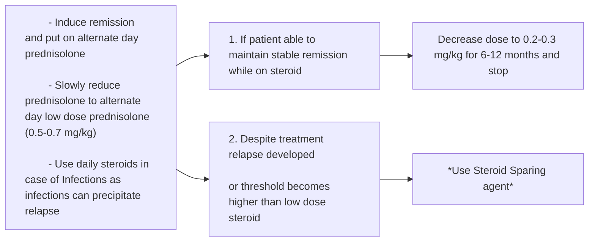
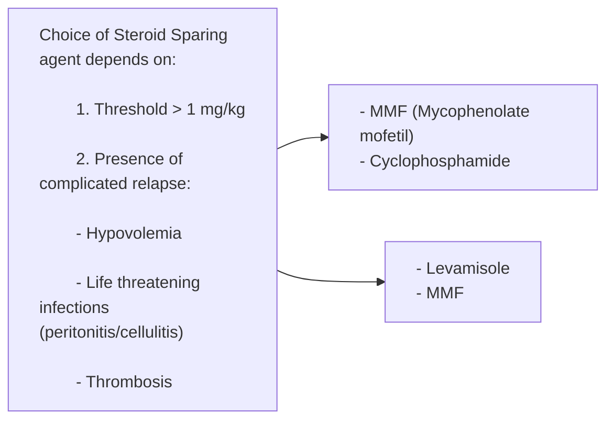

# Nephrotic and Nephritic Syndromes

> [!info] Source
> Based on KDIGO 2021 Clinical Practice Guideline for the Management of Glomerular Diseases, KDIGO 2024 ANCA‑Associated Vasculitis Guideline, and KDIGO 2024 Lupus Nephritis Guideline.

## 1. Definitions & Diagnostic Criteria

### Nephrotic Syndrome
Non‑inflammatory glomerular injury → increased glomerular permeability to proteins.

> [!important] Diagnostic Triad
> Nephrotic‑range proteinuria **PLUS** hypoalbuminaemia **OR** oedema.

#### Nephrotic‑Range Proteinuria Thresholds

| Age Group             | Gold Standard                                      | Alternative                           |
| --------------------- | -------------------------------------------------- | ------------------------------------- |
| **Adults**            | 24‑hour urine ≥ 3.5 g/24 h                         | First morning void UPCR ≥ 300 mg/mmol |
| **Children (1–18 y)** | Any of: 24‑h urine ≥ 40 mg/m²/h (often inaccurate) | —                                     |
|                       | UPCR ≥ 200 mg/mmol                                 |                                       |
|                       | urine dipstick ≥ 3+                                |                                       |
|                       | urine protein concentration ≥ 300 mg/dL            |                                       |

#### Hypoalbuminaemia Threshold
Serum albumin < 30 g/L (< 3.0 g/dL)

### Nephritic Syndrome
Inflammatory glomerular injury → capillary rupture and cellular damage.

> [!important] Defined by
> - **Haematuria** (RBCs in urine)
> - **RBC casts** on urine microscopy (intact RBCs in Tamm‑Horsfall matrix)
> - **Proteinuria** – typically sub‑nephrotic (0.5–3 g/day), but nephrotic‑range (≥3.5 g/day) can occur

---

## 2. Etiology & High‑Yield Associations

| Predominantly Nephrotic                                                                                                                                                       | Predominantly Nephritic                                                                                                                                                                                 | Mixed / Variable                                                                                                                                                                                                    |
| ----------------------------------------------------------------------------------------------------------------------------------------------------------------------------- | ------------------------------------------------------------------------------------------------------------------------------------------------------------------------------------------------------- | ------------------------------------------------------------------------------------------------------------------------------------------------------------------------------------------------------------------- |
| **Primary:**  • Minimal Change Disease (MCD),  • Membranous Nephropathy,  • Primary FSGS  **Secondary:**  • Diabetic Nephropathy,  • Amyloid Nephropathy | **Primary/Autoimmune:**  • Anti‑GBM Disease,  • ANCA‑Associated Vasculitis,  • IgA Nephropathy (Berger’s),  • IgA Vasculitis (HSP),  • Post‑Streptococcal GN (PSGN) / Post‑infectious GN | **Lupus Nephritis:**  • Class III & IV → nephritic;  • Class V → nephrotic.  **Cryoglobulinaemia:**  typically nephritic, often mixed.  **Multiple Myeloma:**  both (nephrotic more common) |

> [!tip] Key Epidemiological Facts
> - Most common primary glomerular disease worldwide: **IgA Nephropathy**
> - Most common cause of nephrotic syndrome in children: **Minimal Change Disease**
> - Most common cause of nephrotic syndrome in adults: **FSGS** > Membranous Nephropathy

### High‑Yield Clinical Syndromes

> [!warning] Rapidly Progressive Glomerulonephritis (RPGN)
> Rapid loss of renal function (days–weeks) due to necrotising crescentic GN.
> - **Pauci‑immune:** ANCA‑associated vasculitis
> - **Immune‑complex mediated:** IgA nephropathy/vasculitis, PSGN, Lupus Nephritis
> - **Anti‑GBM mediated:** Anti‑GBM disease

> [!warning] Lung‑Renal Syndrome
> Pulmonary haemorrhage + RPGN. Classic causes:
> - Anti‑GBM disease
> - ANCA‑associated vasculitis
> - Systemic Lupus Erythematosus (SLE)

---

## 3. Pathophysiology & Clinical Manifestations

### Nephrotic Syndrome Complications & Mechanisms

| Mechanism | Clinical Manifestation |
|-----------|------------------------|
| ↑ Protein permeability | Frothy / foamy urine |
| Hypoalbuminaemia → ↓ oncotic pressure | Periorbital oedema (morning), peripheral oedema, weight gain, scrotal/vulval oedema, ascites, pleural effusion, anasarca |
| ↑ Urinary loss of anticoagulants (AT‑III, Protein C/S) + ↑ hepatic clotting factor production | **Thrombosis:** Venous (common): renal vein thrombosis (classic for membranous), DVT, PE, IVC thrombosis, cerebral venous sinus thrombosis. Arterial (uncommon): stroke, MI, acute limb ischaemia, mesenteric ischaemia |
| ↑ Urinary loss of immunoglobulins | **Infections:** *S. pneumoniae* (pneumonia), *N. meningitidis* (meningitis), Varicella zoster, Spontaneous Bacterial Peritonitis, cellulitis |
| Compensatory hepatic synthesis | **Hyperlipidaemia & Lipiduria:** ↑ total cholesterol, LDL (most prominent), triglycerides. Oval fat bodies / Maltese cross birefringence. Also anaemia (transferrin loss), vitamin D deficiency (DBP loss) |

### Nephritic Syndrome Manifestations
- Prominent haematuria (microscopic or macroscopic “cola‑colored”)
- Hypertension (Na⁺/water retention)
- Oedema (usually mild/moderate, less severe than nephrotic)
- Oliguria or AKI (elevated creatinine, reduced eGFR)

---

## 4. Initial Diagnostic & Laboratory Investigations

| Investigation | Nephrotic Finding | Nephritic Finding |
|---------------|-------------------|-------------------|
| **Urinalysis** | Protein +ve only | RBCs + protein +ve |
| **Urine Microscopy** | Lipiduria: oval fat bodies / Maltese cross | RBC casts (highly specific for glomerular origin); dysmorphic RBCs |
| **Proteinuria Quantification** | ≥ 3.5 g/day (or UPCR ≥ 300 mg/mmol) | Sub‑nephrotic (0.5–3 g/day) |
| **Serum Albumin** | Low (< 30 g/L) | Normal or mildly reduced |
| **Serum Creatinine / eGFR** | Usually normal initially | Frequently elevated creatinine / reduced eGFR |

### Etiological Targeted Work‑Up

> [!note] Antibody Screen
> - **Anti‑GBM** → Anti‑GBM disease
> - **Anti‑PLA2R** → Primary membranous nephropathy
> - **ANCA (MPO/PR3)** → ANCA‑associated vasculitis
> - **ANA & anti‑dsDNA** → SLE
> - **Anti‑streptolysin O & anti‑DNAse B** → PSGN

> [!note] Complement Levels (C3, C4)
> Low in:
> - Post‑streptococcal GN → ↓C3
> - Cryoglobulinaemia → ↓C4
> - SLE → ↓C3 and ↓C4 (+ ↑ESR, normal CRP)

**Other tests as indicated:** lipid profile, glucose, cryoglobulins, serum protein electrophoresis, serum free light chains, viral serology (Hep B/C, HIV).

### Kidney Biopsy – Gold Standard
- Analyse with: light microscopy, immunofluorescence (IgG, IgA, IgM, C3, C4, C1q, fibrin, kappa/lambda), electron microscopy.
- **Biopsy NOT required:**
  - Children with steroid‑sensitive nephrotic syndrome (presumed MCD)
  - Children with typical PSGN
- **Biopsy mandatory:**
  - MCD / PSGN in adults
  - IgA nephropathy (no validated biomarker)
  - Membranous nephropathy **if anti‑PLA2R negative or eGFR declining** (if anti‑PLA2R +ve and stable eGFR, biopsy not needed)
  - Most other glomerular diseases for definitive diagnosis

---

## 5. Management Principles of Glomerular Disease

### Supportive Care (All Patients)

| Aspect                 | Nephrotic‑Syndrome Related                                                                                                                                                 | Nephritic‑Syndrome Related                      |
| ---------------------- | -------------------------------------------------------------------------------------------------------------------------------------------------------------------------- | ----------------------------------------------- |
| **Lifestyle**          | Sodium restriction <2 g/day; protein intake 0.8–1.0 g/kg/day (add 1 g per 1 g urinary loss, max +5 g/day); low‑fat diet; exercise; smoking cessation; weight normalisation | Same general principles                         |
| **Proteinuria / HTN**  | **1st line: ACE inhibitor / ARB** – but **avoid starting in acute nephrotic syndrome** (risk of AKI); start once stable                                                    | ACEi/ARB if proteinuria/HTN                     |
| **Oedema**             | **1st line: loop diuretics**; add thiazide‑like or amiloride if ineffective; IV albumin if diuretic‑resistant and albumin <20 g/L                                          | Loop diuretics as needed                        |
| **Hypercoagulability** | **Do NOT routinely anticoagulate.** Consider prophylaxis only if serum albumin <20–25 g/L plus other risk factors. Warfarin or heparin.                                    | Less significant; manage as per VTE prophylaxis |
| **Infection risk**     | Vaccinations:  pneumococcal,  influenza (annual),  shingles.  Consider PCP prophylaxis (**co‑trimoxazole**) with high‑dose steroids/immunosuppression.         | Same vaccination recommendations                |

> [!tip] Conditions where treatment can start without biopsy (serology +ve)
> 1. ANCA vasculitis, 
> 2. Anti‑GBM disease, 
> 3. SLE, 
> 4. Membranous nephropathy with anti‑PLA2R +ve.
> 5. Genetic conditions: 
> 	1. Alport disease, 
> 	2. Fabry disease, 
> 	3. familial FSGS with known mutations.

---

## 6. Nephrotic Syndrome Causes (Detailed)

### 6.1 Minimal Change Disease (MCD)

| Feature                   | Details                                                                                                                                                                                                                                                                                                    |
| ------------------------- | ---------------------------------------------------------------------------------------------------------------------------------------------------------------------------------------------------------------------------------------------------------------------------------------------------------- |
| **Epidemiology**          | Most common cause of nephrotic syndrome in children (>90%); 10–25% of adult nephrotic syndrome                                                                                                                                                                                                             |
| **Aetiology**             | Mostly idiopathic. Secondary: Hodgkin’s lymphoma, lithium, NSAIDs                                                                                                                                                                                                                                          |
| **Clinical**              | Abrupt nephrotic syndrome.  **Children**: renal function preserved.  **Adults**: ==AKI== common during active disease                                                                                                                                                                                |
| **Investigations**        | Urine/bloods: nephrotic.  **Biopsy:** LM – normal; EM – diffuse podocyte foot process effacement, no deposits; IF – negative. **EM is diagnostic.**                                                                                                                                                     |
| **Diagnosis in children** | Presumptive MCD if steroid‑sensitive, no biopsy                                                                                                                                                                                                                                                            |
| **Management**            | - **1st line:** high‑dose oral prednisolone.  - **2nd line (steroid‑resistant/dependent/relapsing):** levamisole, cyclophosphamide, calcineurin inhibitor, mycophenolate mofetil, rituximab.  - Supportive care.  - Avoid ACEi/ARB in acute phase.  - PCP prophylaxis with high‑dose steroids. |
| **Prognosis**             | - Children: excellent; relapses common (80–90% in 1st year), often resolves after puberty.  - Adults: excellent if steroid‑sensitive; worse if steroid‑resistant. Monitoring: proteinuria, renal function, BP.                                                                                          |
#### Pediatric protocols
**Definitions for Treatment and Response**
- **Remission:**
	- Child responded by 
		- reduced protein excretion ($<\ 4\ mg/m^2/day$)
		- *OR* Urine PCR < 0.2 
		- *OR* Urine Dipstick nil or trace for 3 consecutive spot tests
- **Relapse:** 
	- Massive Proteinuria > $40\ mg/m^2/hour$ 
	- Urine PCR > 2
	- Urine Dipstick 3+/4+ for 3 consecutive spot tests
	*Occurs till 2nd decade of life*
- **Frequently Relapsing Nephrotic Syndrome (FRNS):**
	- $\ge 2$ Relapses in ==1st 6 months==
	- *OR* $\ge 3$ relapses in ==any 6 months==
	- *OR* $\ge 4$ relapses in 1 year
- **Steroid Dependent Nephrotic Syndrome (SDNS)**
	- Develop $\ge 2$ consecutive relapses 
		- on alternate day steroid treatment 
		- *OR* Post 14 days after stopping steroid treatment
- **Steroid Resistant Nephrotic Syndrome**
	- No response to steroid even after using daily steroid for 6 weeks

**Treatment Schedule**: 
- Oral Prednisolone:
	- For 6 weeks: ==Daily== 2 mg/kg or $60\ mg/m^2$
	- For next 6 weeks: ==Alternate Day== $1.5\ mg/kg/day$ (Max dose = 40 mg/day)
- In case of **Relapse**:
	- ==Till Remission==: Daily Steroids
	- ==Next 4 weeks==: Alternate Day Steroid
- In case of Steroid **Resistant** NS:
	- First do Renal Biopsy (Because chances are it is not Minimal Change Disease)
	- Then start Tacrolimus > Cyclosporine (*Tacrolimus to be avoided in Seizure and hypoglycemia*)
- In case of Steroid **Dependent** NS:

HOW TO CHOOSE STEROID SPARING AGENT:

 
 
### 6.2 Membranous Nephropathy (MN)

| Feature            | Details                                                                                                                                                                                                                                                                                                                                                                                        |
| ------------------ | ---------------------------------------------------------------------------------------------------------------------------------------------------------------------------------------------------------------------------------------------------------------------------------------------------------------------------------------------------------------------------------------------- |
| **Epidemiology**   | Adults; ==2nd most common cause of nephrotic syndrome in adults==                                                                                                                                                                                                                                                                                                                              |
| **Aetiology**      | **Primary (80%)**: anti‑PLA2R antibodies.  **Secondary:**  1. malignancy,  2. infections (Hep B/C, syphilis),  3. drugs (NSAIDs, gold, penicillamine),  4. Class V lupus nephritis *Remeber: Lupus III & IV has nephritic presentation*                                                                                                                                         |
| **Clinical**       | Nephrotic syndrome.  **High risk of thrombosis** – renal vein thrombosis classic; DVT/PE common                                                                                                                                                                                                                                                                                             |
| **Investigations** | **1st line:** anti‑PLA2R serology (99% specific).  If +ve & eGFR stable → *no biopsy needed.*  If ‑ve or eGFR declining → *biopsy.*   **Biopsy:**  LM – diffuse capillary wall thickening, “==spike and dome==” on silver stain;  EM – ==subepithelial electron‑dense deposits==;  IF – ==granular IgG & C3==.   Screen for secondary causes (cancer, HBV/HCV, ANA) |
| **Management**     | All patients: supportive care ≥6 months.  Immunosuppression in moderate/high/very high risk.  **Risk‑stratified:** see table below. Monitor anti‑PLA2R titres.                                                                                                                                                                                                                           |
| **Prognosis**      | Rule of thirds: ⅓ remission, ⅓ stable, ⅓ progress.  **Poor factors:** high anti‑PLA2R, albumin <25 g/L, eGFR <60, proteinuria >8 g/d                                                                                                                                                                                                                                                        |

**Membranous Nephropathy Risk‑Stratified Management**

> [!important] This section is not important
> But it shows that it has high chance of being steroid resistant

| Risk Category      | Criteria                                                                                                                         | Management                                                                       |
| ------------------ | -------------------------------------------------------------------------------------------------------------------------------- | -------------------------------------------------------------------------------- |
| **Low risk**       | Normal eGFR,  proteinuria <3.5 g/d,  albumin >30 g/L                                                                       | Supportive care only                                                             |
| **Moderate risk**  | Normal eGFR,  proteinuria >3.5 g/d,  no 50% decrease after 6 months conservative therapy                                   | Supportive care ± rituximab or CNI                                               |
| **High risk**      | eGFR <60, OR  proteinuria >8 g/d for >6 months, OR  proteinuria >3.5 g/d with anti‑ PLA2R >50 RU/ml or  albumin <25 g/L | Rituximab (preferred), or cyclophosphamide + glucocorticoids, or rituximab + CNI |
| **Very high risk** | Life‑threatening nephrotic syndrome or rapid renal deterioration                                                                 | Cyclophosphamide + glucocorticoids; rituximab if cyclophosphamide not tolerated  |

### 6.3 Focal Segmental Glomerulosclerosis (FSGS)

| Feature            | Details                                                                                                                                                                                                                                                                                                                                                             |
| ------------------ | ------------------------------------------------------------------------------------------------------------------------------------------------------------------------------------------------------------------------------------------------------------------------------------------------------------------------------------------------------------------- |
| **Epidemiology**   | ==Most common cause of nephrotic syndrome in adults (10–25%)==                                                                                                                                                                                                                                                                                                      |
| **Aetiology**      | **Secondary:**  viral (*HIV, CMV, EBV*, SARS‑CoV‑2, *Hep C*, parvovirus B19),  drugs (CNI, mTOR inhibitors, interferon, lithium, NSAIDs, anabolic steroids, heroin),  adaptive (renal agenesis, r*eflux nephropathy*, obesity, *sickle cell*, *HTN, diabetes*),  genetic (podocyte genes, APOL1).   **Primary:** circulating permeability factors |
| **Clinical**       | ~50–60% adults **present with proteinuria without full nephrotic syndrome.**  Primary: abrupt nephrotic syndrome.  Secondary: proteinuria without hypoalbuminaemia/oedema                                                                                                                                                                                     |
| **Investigations** | **Biopsy:**  LM – ==focal & segmental sclerosis ± hyalinosis==;  EM – diffuse (primary) or segmental (secondary) ==foot process effacement==;  IF – usually negative.   Evaluate for secondary causes if no nephrotic syndrome                                                                                                                       |
| **Management**     | Supportive care.  **Primary FSGS:** immunosuppression – 1st line high‑dose steroids; ==2nd line CNI.== *This again means there is a high chance of it being steroid resistant* **Secondary FSGS:** treat underlying cause; no immunosuppression                                                                                                               |
| **Prognosis**      | Most critical factor: proteinuria.  Nephrotic‑range: 10‑yr kidney survival ~57%;  non‑nephrotic: >90%.  Relapse common.  Steroid resistance → poor                                                                                                                                                                                                      |

---

## 7. Nephritic Syndrome Causes (Detailed)

### 7.1 Anti‑GBM Disease (Goodpasture Disease)

| Feature            | Details                                                                                                                                                                                                                                                                                                                                                                                                                                                                                       |
| ------------------ | --------------------------------------------------------------------------------------------------------------------------------------------------------------------------------------------------------------------------------------------------------------------------------------------------------------------------------------------------------------------------------------------------------------------------------------------------------------------------------------------- |
| **Epidemiology**   | Very rare. Bimodal: 3rd and 6th–7th decades                                                                                                                                                                                                                                                                                                                                                                                                                                                   |
| **Aetiology**      | ==Anti‑GBM antibodies against type IV collagen (kidney & lung==).  Triggers: smoking, lung irritants, hydrocarbons                                                                                                                                                                                                                                                                                                                                                                         |
| **Clinical**       | **Lung‑renal syndrome:**  ==pulmonary haemorrhage== (haemoptysis, dyspnoea) + ==RPGN== (oliguria/anuria, haematuria).  Isolated kidney disease common; lung‑renal in 40–60%                                                                                                                                                                                                                                                                                                             |
| **Investigations** | **1st line:** anti‑GBM serology (90% sensitive).  +ve → treat immediately.  ‑ve → biopsy.   **Biopsy:**  LM – ==necrotising crescentic GN==  IF –  ==linear IgG along GBM (diagnostic)==;  EM – ==no deposits==  Lung imaging: **CXR** bilateral perihilar opacities, **HRCT** ground‑glass.  **Always test ANCA** (double positivity in ⅓)                                                                                                                        |
| **Management**     | **Emergency – start treatment if suspected.**  **Induction:** plasmapheresis + cyclophosphamide (2–3 months) + high‑dose glucocorticoids (pulse methylprednisolone then oral for 6 months).  **Do NOT withhold unless ALL:** dialysis‑dependent + biopsy shows irreversible damage (100% crescents or >50% global sclerosis) + no lung involvement.  **Chronic:** isolated anti‑GBM → no maintenance; double‑positive → treat as ANCA vasculitis (rituximab/azathioprine ± steroids) |
| **Prognosis**      | Patient ==survival >90% with treatment; 96% mortality without==.  Kidney: ~50% recover at 5 years.  Lungs recover.  Relapse uncommon (0–6%); higher if double‑positive.  Transplant recurrence <3% if antibodies undetectable ≥6 months                                                                                                                                                                                                                                           |

### 7.2 ANCA‑Associated Vasculitis

==**Definition:** Small‑vessel vasculitis – GPA, MPA, EGPA.==

**Kidney biopsy hallmark of ANCA vasculitis:** ==pauci‑immune necrotising crescentic GN (no immune deposits on IF).==

| Feature          | Details                                                                                                                                                                                                                                                                                                                                                                                                                                                                                        |
| ---------------- | ---------------------------------------------------------------------------------------------------------------------------------------------------------------------------------------------------------------------------------------------------------------------------------------------------------------------------------------------------------------------------------------------------------------------------------------------------------------------------------------------- |
| **Epidemiology** | Onset 38–75 y.  GPA common in European ancestry;  MPA predominant in East Asia                                                                                                                                                                                                                                                                                                                                                                                                           |
| **Aetiology**    | Loss of tolerance to PR3 or MPO → ANCA activates neutrophils → vasculitis.  Triggers: silica, chronic nasal *S. aureus*, family history                                                                                                                                                                                                                                                                                                                                                     |
| **Management**   | **Emergency (RPGN/==lung‑renal==).** So basically it has almost same presentation as Anti-GBM Disease If ANCA +ve → treat without biopsy;  if ‑ve → urgent biopsy.  **Induction:** steroids + rituximab OR cyclophosphamide.  **Plasmapheresis only in:** creatinine >300 µmol/L or rapidly rising, diffuse alveolar haemorrhage with hypoxaemia, double‑positive anti‑GBM/ANCA, refractory disease.  **Maintenance:** rituximab (1st line) or azathioprine ± low‑dose steroids |
| **Prognosis**    | Diffuse alveolar haemorrhage → poor. Relapse common (PR3/cANCA higher). Transplant recurrence low if antibodies undetectable ≥6 months                                                                                                                                                                                                                                                                                                                                                         |

**ANCA‑Associated Vasculitis – Condition‑Specific Details**

| Condition | Clinical Features | Serology | Other Tests | Biopsy |
|-----------|-------------------|----------|-------------|--------|
| **GPA** | Classic triad: URT (sinusitis, saddle nose, otitis), LRT (haemoptysis, dyspnoea), kidney (RPGN). Eye (uveitis, proptosis), skin (purpura, ulcers) | cANCA (PR3) +ve | CXR/CT: nodules, cavitation; sinus CT bone destruction | Necrotising vasculitis **with granulomas**; multinucleated giant cells |
| **MPA** | LRT + kidney (RPGN). URT classically absent. Fever, malaise | pANCA (MPO) +ve | CXR/CT: ground‑glass opacities (fibrosis) | Necrotising vasculitis **without granulomas** |
| **EGPA** | Severe allergic asthma + sinusitis/rhinitis before vasculitis. Mononeuritis multiplex, eosinophilic myocarditis | pANCA (MPO) +ve in ~50%; often ANCA ‑ve | Blood eosinophilia >10%; cardiac imaging | Eosinophil‑rich vasculitis **with granulomas** |

### 7.3 IgA Nephropathy (Berger Disease)
> Including IgA vas

| Feature            | Details                                                                                                                                                                                                                                                                                                                                         |
| ------------------ | ----------------------------------------------------------------------------------------------------------------------------------------------------------------------------------------------------------------------------------------------------------------------------------------------------------------------------------------------- |
| **Epidemiology**   | ==Most common primary glomerular disease worldwide==.  Young adults; East Asians > Caucasians; rare in Africans                                                                                                                                                                                                                              |
| **Aetiology**      | Predominant IgA deposition.  **Primary (idiopathic) most common.**  **Secondary**: <mark style="background: #FF5582A6;">IgA vasculitis (HSP)</mark>, liver cirrhosis, IBD, HIV/<mark style="background: #ADCCFFA6;">Hep B/C</mark>, bacterial infections, schistosomiasis                                                                 |
| **Clinical**       | <mark style="background: #FF5582A6;">**Asymptomatic (most common):**</mark> incidental microscopic haematuria / proteinuria.  ==**Symptomatic:** visible haematuria following URTI (cardinal). May be part of IgA vasculitis or RPGN.== AKI possible                                                                                         |
| **Investigations** | **Diagnosis only by biopsy** (no biomarker).  LM: ==mesangial hypercellularity;==  EM: ==mesangial deposits==;  IF: dominant ==IgA in mesangium ± C3==.  Urine/bloods: nephritic                                                                                                                                                    |
| **Management**     | **1st line: supportive care ≥3 months.** Monitor proteinuria, BP, eGFR, haematuria. <mark style="background: #FF5582A6;">**Steroids NOT routine**</mark> – consider only if proteinuria >0.75–1 g/day despite 3 months supportive care (KDIGO warns uncertain benefit, toxicity esp. eGFR <50)                                                  |
| **Prognosis**      | Slow progression; 25–30% develop kidney failure in 20–25 years.  Poor factors:  - sustained proteinuria >1 g/day (most powerful),  - persistent haematuria,  - uncontrolled HTN,  - reduced eGFR at diagnosis,  - biopsy showing tubular atrophy/interstitial fibrosis,  - crescents,  - endocapillary hypercellularity |

### 7.4 Post‑Streptococcal Glomerulonephritis (PSGN)

| Feature            | Details                                                                                                                                                                                                                                                                                                                                                                                                                            |
| ------------------ | ---------------------------------------------------------------------------------------------------------------------------------------------------------------------------------------------------------------------------------------------------------------------------------------------------------------------------------------------------------------------------------------------------------------------------------- |
| **Epidemiology**   | Children and elderly                                                                                                                                                                                                                                                                                                                                                                                                               |
| **Aetiology**      | ==Type III hypersensitivity== to streptococcal infection (pharyngitis or impetigo).  Immune complex deposition.  PSGN is subset of post‑infectious GN (S. aureus, Gram‑negative also)                                                                                                                                                                                                                                        |
| **Clinical**       | Preceding infection: pharyngitis 1–2 weeks, impetigo 4–6 weeks.  Acute nephritic syndrome: haematuria (cardinal), oedema, hypertension                                                                                                                                                                                                                                                                                          |
| **Investigations** | **Children <12 y:** clinical diagnosis; biopsy only if C3 low >3 months.  **Adults:** ==biopsy mandatory==.  Urine: nephritic.  Streptococcal markers: ==ASO (pharyngitis), anti‑DNAse B & anti‑hyaluronidase (impetigo==).  Complement: low C3, normal C4.   **Biopsy:**  LM – ==diffuse endocapillary hypercellularity==;  EM – ==subepithelial “humps”==;  IF – ==granular (“starry sky”) C3 & IgG== |
| **Management**     | Supportive care.  Antibiotics if active infection (+ve culture) – penicillin V or amoxicillin (treat infection, prevent spread; **does not alter PSGN course**).  - <mark style="background: #FF5582A6;">Immunosuppression not indicated.</mark>  Monitor C3/C4, urine, BP, renal function                                                                                                                                |
| **Prognosis**      | **Children**: excellent.  **Adults/elderly**: may have persistent albuminuria or low eGFR; elderly with persistent albuminuria mortality up to 20%                                                                                                                                                                                                                                                                              |

---

## 8. Mixed Nephrotic / Nephritic Syndrome Causes

### 8.1 Lupus Nephritis

| Feature | Details |
|---------|---------|
| **Epidemiology** | 20–60% lifetime incidence in SLE. More common in Asian, African/Caribbean, Hispanic descent. More severe in childhood‑onset SLE |
| **Aetiology** | Type III hypersensitivity – immune complex deposition |
| **Clinical** | Depends on class: asymptomatic (I/II), nephritic (III/IV), nephrotic (V) |
| **Investigations** | Urine: nephrotic or nephritic. Serology: ANA, anti‑dsDNA (rising titres = activity), low C3 & C4. **Gold standard: kidney biopsy (all patients)** for ISN/RPS classification |
| **ISN/RPS Classification** | |
| Class | Name | Clinical & Histologic Characteristics |
| I | Minimal mesangial | Normal function, low proteinuria; LM normal, mesangial deposits on IF |
| II | Mesangial proliferative | Low proteinuria or microscopic haematuria; mesangial hypercellularity |
| III | Focal proliferative | Nephritic syndrome, impaired renal function (RPGN); lesions <50% glomeruli |
| IV | Diffuse proliferative | Severe nephritic, RPGN; lesions >50% glomeruli; **most common & most severe** |
| V | Membranous | Full nephrotic syndrome; subepithelial deposits ± class III/IV |
| VI | Advanced sclerosing | >90% globally sclerosed, no active inflammation |
| **Management** | **All patients: hydroxychloroquine.** Class I/II – usually no additional treatment. Class III/IV – aggressive immunosuppression: induction (MPA + steroids, or cyclophosphamide + steroids, or belimumab + MPA/cyclophosphamide, or MPA + voclosporin/tacrolimus); maintenance (MPA or azathioprine). Class V – sub‑nephrotic: ACEi/ARB + BP control; nephrotic: glucocorticoid + immunosuppressant. Class VI – supportive CKD care |

### 8.2 Cryoglobulinaemic Vasculitis

| Feature            | Details                                                                                                                                                                                                                                                                                                                              |
| ------------------ | ------------------------------------------------------------------------------------------------------------------------------------------------------------------------------------------------------------------------------------------------------------------------------------------------------------------------------------ |
| **Aetiology**      | Cryoglobulins precipitate at <37°C.  **Type II/III (mixed) – 90%:**  - Hep C (most common),  - Hep B,  - bacterial endocarditis,  - autoimmune (SLE, Sjögren’s, RA). ** Type I:** *monoclonal gammopathies* (myeloma, CLL, NHL, Waldenström)                                                                       |
| **Clinical**       | **Renal:**  - mixed nephrotic/nephritic syndrome,  - impaired function,  - HTN,  - proteinuria (often nephrotic‑range) + haematuria,  - oedema.  **Extra‑renal:**  - palpable purpura,  - necrosis,  - arthralgia/myalgia,  - chronic liver disease,  - polyneuropathy,  - pulmonary haemorrhage |
| **Investigations** | **Serology:**  - cryoglobulin quantification (>5% significant),  - low C4 (± low C3),  - RF +ve in type II.  **Biopsy:** membranoproliferative GN;  - IF: granular IgM, IgG, C3.  Screen for underlying cause                                                                                                      |
| **Management**     | Supportive care. Treat underlying cause (e.g., DAAs for Hep C). Severe/life‑threatening: rituximab + glucocorticoids ± plasmapheresis                                                                                                                                                                                                |

---

## References
- KDIGO 2021 Clinical Practice Guideline for the Management of Glomerular Diseases
- KDIGO 2024 Clinical Practice Guideline for the Management of ANCA‑Associated Vasculitis
- KDIGO 2024 Clinical Practice Guideline for the Management of Lupus Nephritis