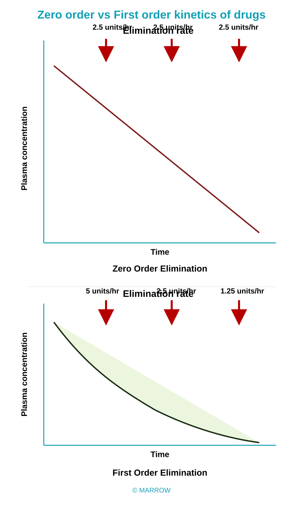

# Zero order vs First order kinetics of drugs

**Pearl ID:** `PM2378`

#review/Pharmacology/Marrow-Pearls/General-Pharmacology-ANS

What are the key facts in the Marrow Pearl **"Zero order vs First order kinetics of drugs"** (PM2378)?
?

| Zero order | First order |
|---|---|
| Constant **amount** of drug is eliminated per unit time | Constant **fraction** of drug is eliminated per unit time |
| Rate of elimination is **independent** of plasma concentration | Rate of elimination is **proportional** to the plasma concentration |
| Clearance is **more at low** concentration and **less at high** concentration | Clearance remains **constant** |
| Half-life is **less at low** concentration and **more at high** concentration | Half-life remains **constant** |
| Very few drugs follow zero-order kinetics, e.g. **WATT Power**: Warfarin; Alcohol, Aspirin; Tolbutamide; Theophylline; Phenytoin | Most of the drugs follow first order kinetics |

