# Forensic Medicine

## World of Revision

### Instructions

- Notes are to be used in conjunction with Marrow videos.

> **Please note:**
> - The information in this book has been printed based on the transcript of the Marrow videos. This book has to be used in conjunction with the Marrow videos and not as a standalone material.
> - The information contained in this book is for educational purposes only. The content provided is not intended to substitute for professional medical advice, diagnosis or treatment.
> - This book cannot be sold separately. It has been made available to only select eligible users who have an active subscription to Marrow videos.
> - The text, images, slides, and other materials used in this book have been contributed by the faculty, who are subject matter experts. We have merely reproduced them as video transcripts in this book.
> - The notes have been consciously designed in a way that is concise and revisable. To ensure this, we have intentionally added only the most relevant modules and images that are needed for you.
> - The notes contain blank spaces primarily for labelling diagrams, completing cycles and more to promote active engagement and reinforce learning.
> - Red icons, wherever present, serve as cues to faculty-emphasised sections, intended to guide focused learning.
> - Reasonable care has been taken to ensure the accuracy of the information provided in this book. Neither the faculty nor Marrow takes any responsibility for any liability or damages resulting from applying the information provided in this book.

**All Rights Reserved**

No part of this publication shall be reproduced, copied, transmitted, adapted, modified or stored in any form or by any means, electronic, photocopying, recording or otherwise.

## Contents

### Forensic Medicine
#### Part 1
- [[#Traumatology]]
  - Abrasion
  - Contusion/bruise
  - Laceration, incision & stab wound
  - Chop wound & defence injuries
  - Regional injuries
  - Intracranial hemorrhages (ICH)
  - Transportation injuries
  - Thermal injuries
  - Burns
  - Electrical & lightning injuries
  - Torture methods
  - Explosion injuries
- [[#Forensic Ballistics]]]
  - Basics of firearm
  - Ammunition
  - Gun ranges
  - Bullet fingerprinting & atypical bullets
  - Gunshot wound on the skull
- [[#Medical Jurisprudence]]
  - Inquest
  - Indian legal system
  - Evidence & witness
  - Summons
  - Court proceedings
  - Medical ethics
  - Medical negligence/professional malpractices
  - Consent
- [[#Autopsy Techniques & Thanatology]]
  - Autopsy : Types
  - Autopsy : Sequence, incision, techniques
  - Thanatology
  - Early changes
  - Late changes (Putrefaction)
  - Viscera preservation for chemical analysis
- [[#Human Identification]]
  - Identification of race, sex and age
  - Ossification centres
  - Dentition
  - Stature
  - Dactylography and other methods

#### [Part 2](<Forensic Medicine Part 2.md>)
- **Asphyxial Deaths**
  - Hanging
  - Strangulation
  - Suffocation
  - Drowning
- **Sexual Jurisprudence and Trace Evidence**
  - Hymen & terminologies related to pregnancy
  - Surrogacy regulation act
  - Medical termination of pregnancy (Amendment) act 2021
  - Infant death
  - Child abuse
  - Sudden infant death syndrome (SIDS)/cot death/crib death
  - Sexual offences
  - Evidence collection
- **Toxicology**
  - Identification of poisons
  - Duties of a doctor in poisoning cases
  - Antidotes
  - Corrosives
  - Metallic irritants
  - Non-metallic irritants
  - Plant toxins
  - Inebriants
  - Spinal and cardiac poisons
  - Asphyxiants
  - Adulterated toxins
  - Snake venom
  - Scorpion & spanish fly
  - Organophosphorous (OP) poisoning
- **Forensic Psychiatry and Legal Sections**
  - Symptoms of psychiatric disorders
  - Civil & criminal responsibilities of insane
  - BNS (Bharatiya nyaya sanhita)
  - Transplantation of human organs act 1994 (2014)
  - Protection of children from sexual offences (POCSO) act 2012

---

# Traumatology

## Mechanical injuries

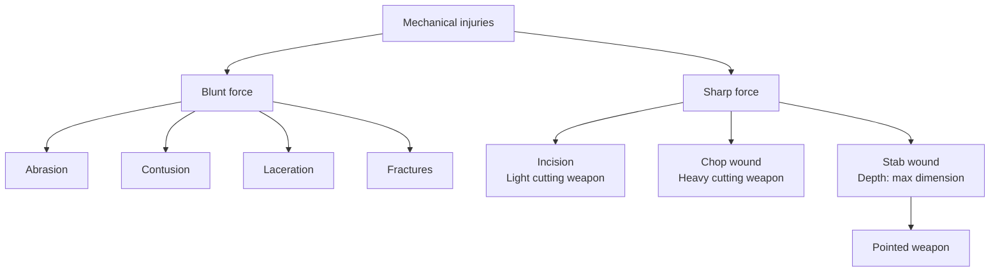

## Abrasion

**00:01:14**

- Medicolegally significant.
- Superficial injury → no bleeding/scarring.
- Heals in : 1 week.

### Types

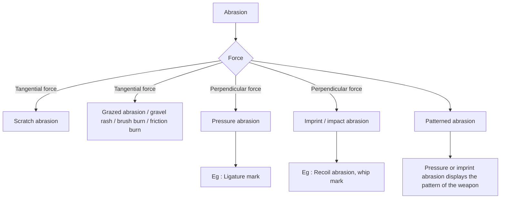

### Scratch abrasion

- Caused by tangential force.

### Grazed abrasion / gravel rash / brush burn / friction burn

- D/t friction b/w skin & rough surface.
- M/c abrasion : A/w RTA.
- Multiple scratches over a wide area.

### Pressure abrasion

- D/t sustained pressure.
- Eg : Ligature mark.

### Imprint/impact abrasion

- D/t momentary impact.
- Eg : Recoil abrasion, whip mark.

### Patterned abrasion

- Either pressure or imprint abrasion displays the pattern of the weapon.

## Epithelial Tag

- Epithelium is scraped off & heaped.
- Indicates tail end of the abrasion.
- Determines direction of force.

## Aging of Abrasion

**Colour of swab → Gives time since injury (TSI).**

Mnemonic : **R₃B₃**

| Colour | Time since injury |
|---|---|
| Raw | < 12 hours |
| Reddish | > 12 hours |
| Reddish brown | 2 - 3 days |
| Brown | 4 - 5 days |
| Black | 6 - 7 days |

## Antemortem vs. Postmortem Wound

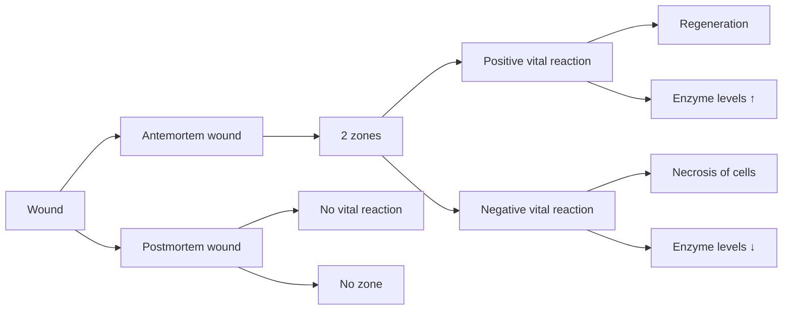

## Contusion / Bruise

**00:05:44**

**Blunt force trauma** → **Rupture of dermal vessels** → **Extravasation of blood**

### Contusion vs Hypostasis

| Feature | Contusion | Hypostasis |
|---|---|---|
| Blanching | − | + |
| Extravasation | + | − |
| Colour changes | + | − |
| Margins | Ill-defined | Well-defined |
| Sites | Anywhere on body | Dependent areas |

## Types of bruise

- **Intradermal bruise:** Superficial.
- **Deep bruise.**
- **Ectopic bruise (Migratory/percolated bruise):**
  - Away from the impact site.
  - Examples:
    - Black eye.
    - Battle sign : Ecchymosis in mastoid region d/t fracture of middle cranial fossa.
- **Patterned bruise:**
  - Shows pattern of striking surface of weapon.
  - Examples:
    - **Six penny bruise:** Coin shaped bruise d/t pressure of finger tips on the skin. Seen in : Throttling.
    - **Butterfly bruise:** Seen in child abuse d/t pinching.
    - **Tramline/railway line bruise:** D/t blow with a rod/lathi/stick.


### True Bruise vs Artificial Bruise

| Feature | True bruise | Artificial bruise |
|---|---|---|
| Cause | Trauma | Irritant plant extract (Plumbago, semicarpus, calotropis) |
| Site | Anywhere on body | Accessible parts of body |
| Vesication/blisters | Absent | Present (D/t inflammatory reaction) |
| Content | Blood | Inflammatory fluid – Acrid serum |
| Itching | Absent | Present |

### Factors Affecting Bruising

| More bruising | Less bruising |
|---|---|
| ↑ Laxity/vascularity : eyelids, scrotum, face | Good muscle tone (Adults/athletes) |
| Delicate subcutaneous tissue : females | Firm fibrous tone : palms/soles |
| Extremes of age : children, elderly |  |
| Preexisting disease |  |

## Aging of Contusion

### Methods used

- Colour of bruise (**most commonly used**)
- Histology
- Spectrophotometry
- Perl’s stain reaction

### Colour of the bruise

| Type of hemoglobin | Colour | Age of bruise |
|---|---|---|
| Oxyhemoglobin | Red | Fresh |
| Deoxyhemoglobin | Blue | Few hrs to 3 days |
| Hemosiderin | Brown | 4 days |
| Biliverdin | Green | 5-6 days |
| Bilirubin | Yellow | 7-12 days |

> Multiple bruises of different colour → Sign of child abuse (Battered baby syndrome).

## Laceration, Incision & Stab Wound

**00:12:43**

### Laceration vs. Incision

| Feature | Laceration (Tear) | Incision (Cut) |
|---|---|---|
| Margins | Irregular | Clean cut |
| Feature | Swallow tails | Tailing (Direction of force can be assessed) |
| Tissue bridges | + | − |
| Floor (Hair bulb, vessels & nerves) | Crushed | Cut |


## Types of Lacerations

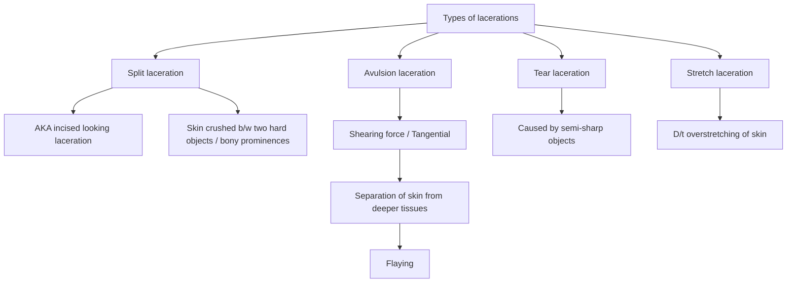

### Split laceration

- AKA incised looking laceration.
- Mechanism : Skin crushed b/w two hard objects i.e. bony prominences.


### Avulsion laceration

- Shearing force (Tangential) : Separation of skin from deeper tissues → Flaying.
- E.g. : Degloving injury, scalping injury.


### Tear laceration

- Caused by semi-sharp objects.

### Stretch laceration

- D/t overstretching of skin.

## Incised wounds

### Lacerated looking incision

- Seen in areas with skin folds (Scrotum, axilla).
- Injury with knife having serrated edges.

### Hesitation cuts

- AKA Tentative cut/intentional cut/feeler’s strokes/trial cuts.
- Multiple, superficial, linear cuts.
- Site : Accessible parts of the body.
- Indicates suicidal attempt.


### Bevelling

- Blade enters obliquely into the skin → Undermined edges.
- Indicates homicide.

## Stab wound

### Types

- **Punctured wound:** Stab injury into tissue.
- **Penetrating wound:** Only entry wound seen (Into body cavity).
- **Perforating wound:** Entry & exit wounds seen.

### Type of weapon based on shape of stab wound

| Shape of wound | Weapon |
|---|---|
| Wedge/triangle/pear shape; fish tailing | Single edge knife |
| Elliptical shape | Double edge knife |


### Hilt mark

- Patterned abrasion/bruise.
- Seen in : Complete penetration.
- Helps determine :
  - Direction of force.
  - Type of weapon.


### Lines of Langer / cleavage lines

- Represent the arrangement of collagen fibers.
- Determine the extent of gaping.

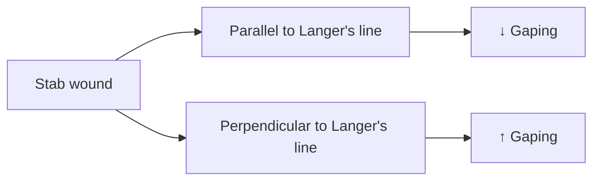


### Hara-kiri / seppuku

- Suicidal stab wound of the abdomen.
- Cause of death : Evisceration → Circulatory collapse.

### Concealed punctured wounds

Seen in:

- Axilla.
- Nostrils.
- Fontanelles.
- Nape of the neck.

### Stab injury to the heart

Fatality of stab injury: **RA > LV**


after considering **thickness of heart chamber**.

## Chop Wound & Defence injuries

**00:24:43**

### Chop wounds

- Deep gaping wound caused by heavy sharp weapon.
- Margins : Regular.
- Floor : Crushing + fracture of bone.
- Usually suggestive of homicide.


### Defence cuts

- Indicates homicide.

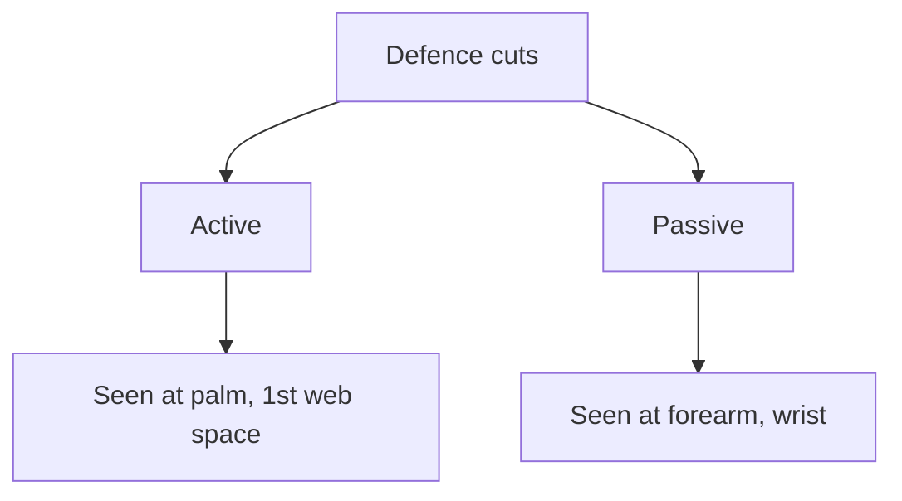

## Regional injuries

### Skull vault fractures

| Fracture | Image / key point |
|---|---|
| Fissure fracture | M/c type of skull fracture; caused d/t weapon with broad striking surface |


### Skull base fractures

| Type | Weapon / mechanism | Characteristics |
|---|---|---|
| Ring fracture | 1. Fall from height: lands on feet; lands on buttock. 2. Heavy weight on the head | Fracture in base of skull around foramen magnum |
| Type I hinge fracture | — | Fracture line from temporal region reaches opposite side; AKA Motorcyclist fracture (Type I hinge) |

Other skull fractures:

| Fracture | Key points |
|---|---|
| Depressed fracture | Caused due to weapon with smaller striking surface (Hammer); also known as signature fracture (Weapon can be identified) |
| Pond fracture | Variant of depressed fracture; AKA indented fracture/ping pong fracture; seen in infants/newborn/child (< 4 years), soft skull |
| Gutter fracture | Associated with oblique bullet |
| Comminuted fracture | AKA spiderweb/mosaic fracture; multiple fractured segments without displacement |
| Diastatic fracture | AKA sutural fractures as the fracture line is along the sutures of the skull |


## Puppe’s Rule

- The new fracture line will never cross previous fracture line.
- Sequencing the fracture lines due to blows.

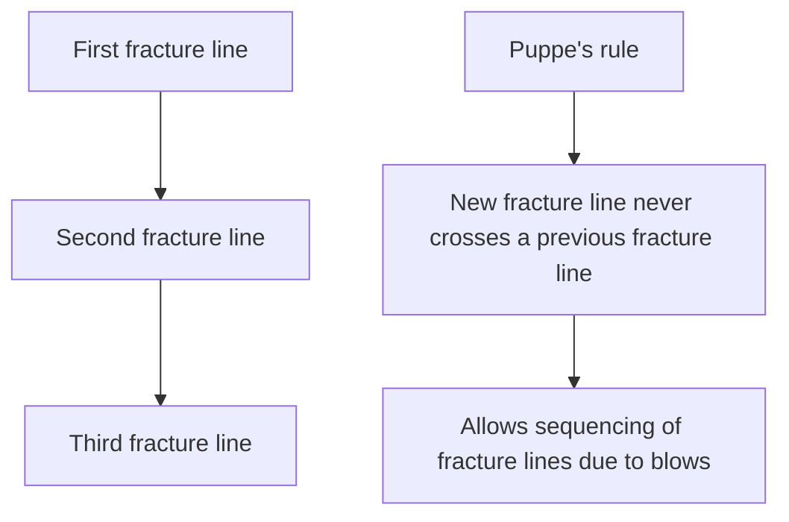

## Coup & Contrecoup injuries

| Feature | Coup injury | Contrecoup injury |
|---|---|---|
| Location | Injury at site of impact | Injury opposite to site of impact |
| Severity | Mild/nil | Severe |
| Occipital impact | Occipital lobe contusion | Frontal lobe contusion (M/c site of contrecoup injury) |
| Frontal impact | Frontal lobe contusion | Nil |
| Temporal impact | Temporal lobe of one side | Temporal lobe of opposite side; contralateral surface of ipsilateral lobe |

## Intracranial Hemorrhages (ICH)

**00:33:40**

| Feature | Extradural hemorrhage (EDH) | Subdural hemorrhage (SDH) | Subarachnoid hemorrhage (SAH) |
|---|---|---|---|
| Features | Least common ICH; trauma to temporo-parietal region/pterion (Type of coup injury); fracture of temporal bone; rupture of middle meningeal artery; bleed in the extradural space; brainstem compression; death d/t respiratory failure; Min. 35 mL blood | Rupture of bridging veins/dural venous sinuses; risk factors: **ABC** — Aged person with minor trauma, Boxers, Child abuse (Shaken baby syndrome); does not cross suture lines | M/c ICH; causes: mnemonic **BATS** — Berry aneurysm rupture, AV malformation rupture, Trauma, Stroke; impending rupture → thunderclap headache; aneurysm rupture → seizures/coma; lumbar puncture → xanthochromia |
| Suture lines | Does not cross suture lines | Crosses suture lines | Crosses suture lines |

### Lucid interval

- Period of consciousness b/w 2 periods of unconsciousness.
- Seen in EDH > SDH.
- Medicolegal importance :
  - Patient can provide valid evidence, will & is criminally liable.
  - Death d/t failure in diagnosing lucid interval : Medical negligence.

### Note

- M/c intracranial lesion : Cerebral contusion.

### Imaging / autopsy findings

| | Extradural hemorrhage (EDH) | Subdural hemorrhage (SDH) | Subarachnoid hemorrhage (SAH) |
|---|---|---|---|
| Imaging | Biconvex opacity | Crescentic (Concavo-convex opacity) | — |
| Autopsy finding | Hemorrhage clears after pouring water | Hemorrhage remains intact after pouring water | Hemorrhage remains intact after pouring water |

> Punishable under 106(1) BNS.


## Transportation Injuries

**00:39:29**

### Injury to pedestrians

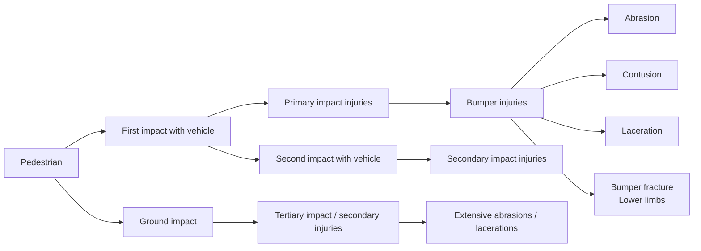

### Injury to vehicle occupants

| S. No. | Impact | Injuries |
|---:|---|---|
| 1 | Windshield | **Sparrow foot injuries:** Multiple cut lacerations to exposed body part d/t broken glass |
| 2 | Whiplash | Hyperextension (More dangerous) f/b hyperflexion or vice versa of neck |
| 3 | Seat belt | Seat belt bruise; Organ injury: Mesentery > Small intestine; Chance fracture: Transverse vertebral fracture (D/t sudden hyperflexion) |
| 4 | Dashboard | Dashboard fracture: Posterior dislocation of hip |
| 5 | Steering wheel | Patterned bruise; Fractures (Sternum); Aortic injury (Ladder-rung tears) |
| 6 | Car pedals | Ankle fracture |

Injuries sustained by:

- Driver only
- Front seat passenger only
- Both


## Thermal Injuries

**00:44:44**

|  | Cold injury | Heat injury |
|---|---|---|
| General effects | Hypothermia | Heat-related syndromes |
| Local effects | 1. Dry cold: Frost bite  2. Moist cold: Trench foot/immersion foot | 1. Dry heat: Burns  2. Moist heat: Scalds |

### Concussion

- Temporary stoppage of functions.

### Beck’s triad

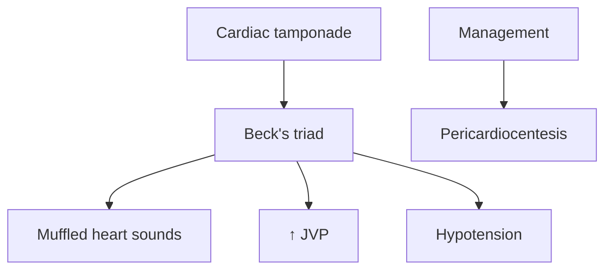

Other terms:

- Heart : Commotio cordis.
- Spinal cord : Railway spine.
- Retina : Berlin’s edema.

### Hypothermia

- Body core temperature < 35°C.
- Commonly affects elderly, newborns, alcoholics, hypothyroid patients.
- < 32°C : Shivering stops.
- < 30°C : Hypothalamus stops functioning.
- Severe hypothermia:
  - Paradoxical undressing.
  - Hide & die syndrome/terminal burrowing.

#### Autopsy findings

- Pink hypostasis.
- Wischnewski’s bleeding spot in stomach.

#### Treatment

- Rewarming.

### Frost bite

- D/t exposure to freezing temperature.
- Site : Periphery (Finger, feet, tip of nose/ear lobes).
- Rx : Rewarming 37° - 40°C.


## Heat Related Syndromes

| Syndrome | Pathology / C/F | Thermo-regulation | Core body temperature |
|---|---|---|---|
| Heat cramps | Sweating causes loss of sodium → Muscle cramps | Intact | Normal |
| Heat syncope | ↑Sweating (Moist skin) → Loss of sodium and water → Cerebral hypoperfusion → Hypotension & syncope | Intact | Normal |
| Heat stroke (Fatal) | Core body temperature > 40.5°C; CNS dysfunction; Skin dry & hot; Sweating usually absent; Autopsy: Post mortem caloricity | Impaired | ↑↑↑ (> 40.5°C / 105°F) |

## Burns

**00:49:52**

- Min. 44°C for 5 - 6 hrs → Burns (↑Temperature ↓Duration).

### Burns vs Scalds

|  | Burns | Scalds |
|---|---|---|
| Charring & singeing | + | − |
| Soddened & bleached skin | − | + |
| Ulceration | − | − |
| Lines of blisters | − | + |
| Splashing | − | + |
| Clothings | Burnt | Intact |

### Chemical burns

- Ulceration +.
- Blisters −.

### Estimation of Burnt Surface Area

1. Rule of Wallace / Rule of 9.
2. Lund & Browders chart : Best for children.
3. Rule of palm : Size of burnt area = Size of palm = Approximately 1%.

## Rule of Wallace

### Adults

- Lower limb : 9 + 9% (Front & back)
- Head & neck : 4.5% + 4.5% (Front & back)
- Upper limb : 4.5% + 4.5% (Front & back)
- Arm : 2%
- Forearm : 1.5%
- Palm : 1%
- Perineum : 1%
- Front & back of chest : 9 + 9%
- Front & back of abdomen : 9 + 9%
- Neck : 1%
- Face : 3.5%
- Buttocks : 5% (Both sides)
- Thigh : 5%
- Leg : 3%
- Foot : 1%

### Children

- Head & neck : 18%
- Lower limb : 13.5%

## Autopsy Findings in Antemortem Burns

### Non-specific findings (Heat artefacts)

| Finding | Pathogenesis | Features |
|---|---|---|
| Heat stiffening | Muscle exposed to heat > 65°C → Protein coagulation → Stiffening | AKA Boxer’s attitude/pugilistic attitude/fencer’s attitude/defence attitude |
| Heat rupture | Skin exposed to heat → Cracking & splitting of skin | Difference from incised wound: large & irregular; intact vessels & nerves; pale |
| Heat hematoma | Blood clot in the extradural space | Chocolate brown; honey comb appearance |
| Heat fracture | Fracture of long bone/skull bones | Long bone fracture; Street & avenue fracture; skull bone fracture; Spiderweb fracture (Sides of skull) |


## Specific signs: Features of antemortem burns

### External signs

1. Crow feet sign.
2. Fluid in blisters.
3. Inflammation signs : Indicate healing.
4. Redness/redline.
5. Enzymes↑↑.

Mnemonic : **FIRE**

### Internal signs: 4 Cs

- Carbon deposition (Soot) in airway.
- ↑Cyanide & ↑CarboxyHb (> 10 g%) in blood.
- Curling ulcer.


## Electrical & Lightning Injuries

### Electrocution

Factors affecting:

- Type of current : AC more harmful than DC.
- Voltage.
- Amperage : Hold on effect (15 - 20 mA) → Tetanoid/hold-on spasms → Death.
- Resistance:
  - Inversely proportional to magnitude of injury.
  - Dry skin (Maximum) > bone > moist skin (No entry wound).

Cause of death:

- Cardiac arrhythmias (M/c).
- Respiratory failure.

### Electrical Injury Burns

| Burns of low voltage current | Burns of high voltage current |
|---|---|
| Firm contact | Flash burn : Diffuse burn |
| Joule burn/endogenous burn: central depressed area; peripheral raised margins | Crocodile burn : Multiple punctate lesions |
| Metallisation : Deposition of metallic ions in the entry wound |  |

## Lightning Injuries

### Filigree burns

- Burns d/t lightning injury.
- Also known as:
  - Lichtenberg marking.
  - Arborescent burns.
  - Ferning.
  - Keraunographic markings.

## Torture Methods

- **Telefona:** Repeated slapping over the ears.
- **Falanga/bastinado:** Beating over the soles.
- **Saw horse:** Forced straddling.
- **Dunking:** Forced immersion of whole body under water.
- **Dry submarine:** Plastic bag asphyxiation.
- **Wet submarine:** Forced immersion of head under water.
- **Hog tying:** Tying wrist & ankle together in prone position.
- **El planton:** Prolonged standing.
- **Cattle’s prod:** Electric shock to genitalia.
- **Water boarding:** Water is poured over a cloth covering the face → Asphyxiation.

## Further Torture Methods

- **Murcielago:** Suspension by ankle.
- **Black slave:** Inserting hot metal rod into anus.
- **Bellary:** Putting chilly powder into anus.
- **Belana:** Rolling a heavy stick over the thighs/legs.
- **Strappado/la bandera/palestinian hanging:** Suspension of victim by wrist.
- **Parrot’s perch:** Tying upper & lower limb with suspension of body.


## Explosion Injuries

**01:06:37**

### Types

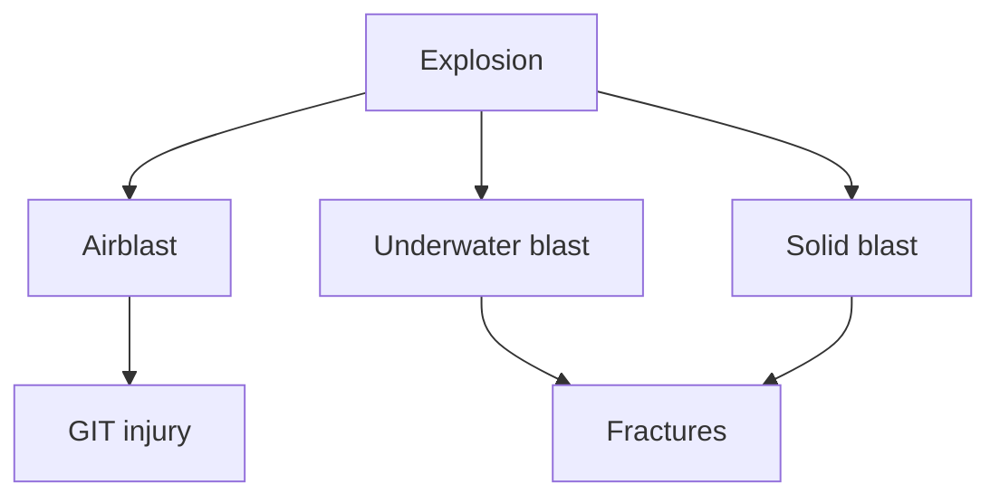

| Blast injury | Cause | Organ injured |
|---|---|---|
| Primary | Blast wave | Ear (M/c), Lung (Most fatal): Blast lung |
| Secondary (M/c injury) | Flying missiles/projectiles | Marshal’s triad: 1. Abrasion 2. Contusion 3. Laceration (Punctate) |
| Tertiary | Wind/victim displacement | — |
| Quaternary | Miscellaneous | Traumatic asphyxia; Burns |


---

# Forensic Ballistics

## Basics of Firearm

**00:00:10**

### Types of Ballistics

```mermaid
flowchart LR
    A[Firearm] --> B[Proximal<br/>(Internal) ballistics]
    A --> C[Intermediate<br/>(External) ballistics]
    A --> D[Terminal ballistics]
    B --> B1[Study of structure of firearms]
    C --> C1[Muzzle velocity]
    C --> C2[Study of motion of bullet in air after being fired]
    D --> D1[Study of effects of the bullet in the target]
    D1 --> D2[Wound ballistics]
```

### Parts of a firearm

1. Stock/handle.
2. Breech.
3. Barrel.
4. Muzzle : Outer end of the barrel.

### Classification

Based on the inner surface of the barrel → visualized by **helixometer**.

|  | Rifled gun (Military rifle, pistol, revolver) | Smooth-bored gun / Shotgun |
|---|---|---|
| Inner surface of barrel | Rifling + (Spiral grooves in the inner surface) | Smooth |


## Rifled gun vs Smooth-bored gun / Shotgun

| | Rifled gun | Smooth-bored gun / Shotgun |
|---|---|---|
| Mechanism | Rifling spins the bullet → ↑ Stability | Dispersion of lead shots → Poor precision |
| Projectile | Bullets | Lead shots |

## Choking

Narrowing the terminal end of the barrel of smooth-bored guns → ↓ Dispersion.

### Grades

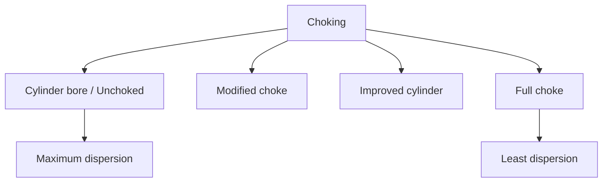

- **Paradox gun:** Smooth bored gun with terminal rifling.

## Internal Diameter of Firearms

| Type of gun | Measurement name | Measurement |
|---|---|---|
| Rifled guns | Caliber | Between 2 diametrically opposite lands |
| Smooth-bored guns | Gauge | No. of spherical lead balls made from 1 pound of lead that precisely fit the barrel |

## Ammunition

**00:05:57**

### Structure

#### Shotgun cartridge

- **Wad:**
  - Travels around 2 - 5 meters.
  - Produces minor bruises.
  - Functions:
    - Lubrication of the barrel.
    - Separation b/w gun powder & lead shots.
    - Obturation (Seals air pressure).

#### Rifle bullet

- Wad : Absent.
- Single bullet directly placed over gun powder.

### Primer

Mnemonic : **BLAST**

- Barium nitrate.
- Lead peroxide.
- Antimony sulphide.
- Styphnate (Lead).
- Tetrazine.

### Types of gunpowder

| Feature | Black gunpowder | Semi-smokeless | Smokeless gunpowder |
|---|---|---|---|
| Energy produced | Low (1gM 3 - 4 litres energy) | — | High (1gM 12 - 13 litres energy) |
| Smoke | High | — | Low |
| Components | Potassium nitrate (75%); Charcoal (15%); Sulphur (10%) | Black gunpowder (80%) + Smokeless gunpowder (20%) | Nitrocellulose; Nitroglycerine; Nitroguanidine |

## Types of smokeless gunpowder

- **Single base:** Nitrocellulose.
- **Double base:** Nitrocellulose + nitroglycerine.
- **Triple base:** Nitrocellulose + nitroguanidine + nitroglycerine.

## Fineness of gunpowder

**FG < FFG < FFFG < FFFFG**

↑ Fineness of gunpowder → ↑ ability to burn.

## Discharges from a Gun

In order of emission from the gun:

| S. No. | Discharge | Effect |
|---:|---|---|
| 1 | Flame | Burns & charring of skin / Scorching |
| 2 | Smoke | Blackening / Smudging; can be wiped with a wet cloth |
| 3 | Unburnt gun powder | Tattooing / Peppering / Stippling (Ante-mortem phenomenon); can’t be wiped with a wet cloth |
| 4 | Bullet | Entry wound; grease collar / bullet wipe / dirt collar (inner collar): diagnostic of entry wound; abrasion collar (outer collar): d/t gyroscopic action of bullet |

### Range

| Discharge | Rifle | Shotgun |
|---|---:|---:|
| Flame | 7 cm | 15 cm |
| Smoke | 30 cm | 45 cm |
| Gunpowder | 50 - 60 cm | 60 - 90 cm |

### Bullet entry wound

- **Abrasion collar:** Shape gives information on trajectory of bullet.
- **Grease collar:** Also called bullet wipe / dirt collar; inner collar.
- **Burning**
- **Blackening**
- **Tattooing**


## Gun Ranges

**00:16:52**

### Rifle gun ranges

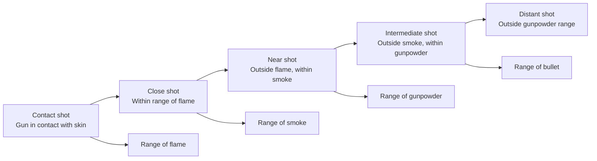

#### Contact shot

- Gun in contact with skin.
- Tight contact:
  - Recoil abrasion / muzzle impression (impact abrasion).
  - All seen inside the track of wound.
- Tight contact on a bony prominence (Skull):
  - ↑↑ gas produced.
  - Gas escapes → lacerates skin.
  - Blast effect / blowback phenomenon.
  - Stellate (Cruciate) wound.

#### Wound characteristics in other rifle shots

| Characteristic | Close shot | Near shot | Intermediate shot | Distant shot |
|---|---:|---:|---:|---:|
| Burning | + | − | − | − |
| Blackening | + | + | − | − |
| Tattooing | + | + | + | − |
| Bullet wound, grease collar & abrasion collar | + | + | + | + |

## Entry vs Exit wound

| Feature | Entry wound | Exit wound |
|---|---|---|
| Margins | Inverted | Everted |
| Burning, blackening, tattooing | Present | Absent |
| Grease collar & abrasion collar | Present | Absent |
| Bleeding | Less | More bleeding and spattering |
| Tissue protrusion | — | Tissue protrusion |

### Entry wound with everted margin (Exception)

- Contact shot on bony prominence.

## Short gun ranges

| Range | Wound characteristics |
|---|---|
| Contact | Stellate or cruciate margin; burning/blackening/tattooing seen inside wound |
| Close | All lead shots enter as a single mass; tattooing ± blackening ± burning: + |
| Near | Central single hole with lead shots as single mass; scalloping of margins + |
| Intermediate | Dispersion has started; central hole with satellite holes; satellite holes: independent pellet holes seen around the wound |
| Distant | Complete dispersion; every pellet seen as independent hole |

## Atypical dispersion of lead shots

| Pattern | Key point |
|---|---|
| Balling / Welding of shots | Conversion of shots into compact mass; oval large entry wound; several small circular puncture wounds surrounding; mimics use of 2 weapons — rifle & shotgun |
| Billiard ball ricochet effect | Ricochet of pellets from an intermediate object; wound mimics distant shot; in reality close range shot |

## Bullet Fingerprinting & Atypical Bullets

**00:30:01**

### Bullet fingerprinting

Identifying gun from the bullet markings.

### Markings on a gun

1. **Primary marking:** Macroscopic markings.
   - Marks produced on a bullet by rifling in the barrel.
   - Give information about make/model of gun.
2. **Secondary marking / Fingerprint of a gun:** Microscopic findings.
   - Produced by irregularities of the barrel (Individual characteristics: vary from gun to gun).
   - Unique to each gun.

### Comparison microscope

Compare **test bullet** (New bullet fired from suspected gun) & **crime bullet**.

## Handling of bullet

- Rubber-tipped tweezers.
  - Toothed forceps cause additional markings.
- Gloved hands.

## Gunshot Residue (GSR) Test

- To find out if accused has used the gun.
- GSR test can be done by: mnemonic **HANDS**.
  - Harrison Gilroy test.
  - Atomic absorption spectrometry.
  - Neutron activation analysis.
  - Dermal nitrate test.
  - SEM - EDXA (Specific test).

### Areas of maximum GSR deposition

- Swabs collected & tested.

## Atypical Bullets

| Type of bullet | Features |
|---|---|
| Tandem / Piggy-back | 2 bullets coming out back to back |
| Semi-jacketed / Dum-dum / Expanding | Tip of lead core is exposed to outside → Mushrooms on entering skin & cause greater damage |
| Yawning | Irregular bullet path |
| Tumbling | Bullet rotates end to end |
| Frangible | Fragments on impact |
| Souvenir | Retained bullet inside the body (Surrounded by fibrosis); chronic complication: Plumbism |
| Ricochet | Bullet stops spinning on hitting intermediate surface; no abrasion collar; no effects of flame, smoke, or gunpowder on the entry wound; atypical shape entry wound (Keyhole shaped) |
| Tracer | Luminous metal at the base (Phosphorous); glows; can trace the path of the bullet |
| Kennedy phenomenon | Iatrogenic alteration of gunshot wound; difficulty in range determination |
| Poisoned | Carries curare/ricin/aflatoxin |


## Gunshot Wound on the Skull

**00:37:42**

**Bevelling:** Differentiates entry wound from exit wound.

- Bevelling in inner table → Entry wound.
- Bevelling in outer table → Exit wound.


---

# Medical Jurisprudence

## Offences

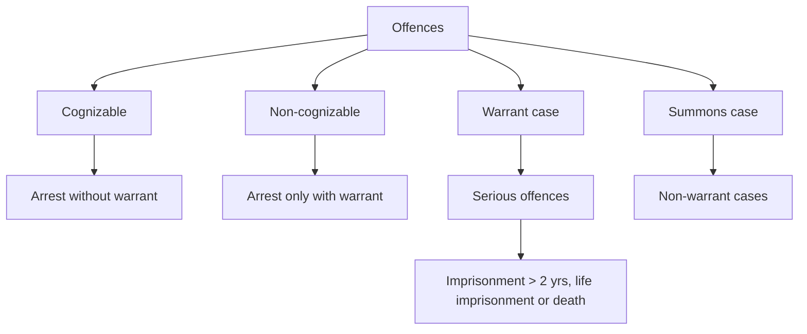

## Inquest

**00:00:56**

### Types

```mermaid
flowchart TD
    A[Inquest] --> B[Police inquest<br/>(M/c): 194 BNSS]
    A --> C[Magistrate inquest<br/>(Superior): 196 BNSS]
    A --> D[Coroner's inquest]
    A --> E[Medical examiner system<br/>(Best)]
```

### Police vs. Magistrate inquest

| Police inquest | Magistrate inquest |
|---|---|
| Minimum rank of IO: Head constable. | Custodial death/rape. |
| Power to summon witness (195 BNSS). | Dowry death. |
| Enquiry report: Panchanama. | Exhumation. |

**IO:** Investigating officer.

**Custodial death:** Death while under police/judicial custody.

## Indian Legal System

**00:03:43**

### Hierarchy

```mermaid
flowchart TD
    A[Supreme Court<br/>(Nation)] --> B[High Court<br/>(State)]
    B --> C[Sessions court, additional sessions & fast track court<br/>(District)]
    C --> D[Assistant sessions]
    C --> E[Chief judicial magistrate]
    C --> F[First class magistrate]
    C --> G[Second class magistrate]
```

- Supreme court:
  - Apex courts.
  - Any sentence (Death sentence also).
- Assistant sessions: 10 years punishment, no limit.
- Chief judicial magistrate: 7 years punishment, no limit.
- First class magistrate: 3 years punishment, 50k fine.
- Second class magistrate: 1 year punishment, 10k fine.
- Commutation of punishment : Higher court.
- Lowest court to give death sentence : District courts.
- Lowest court to confirm/commute/cancel death sentence : High court.
- Death sentence by supreme court can be commuted by : President/Governor.
- Death sentence in pregnant female → High court → Commute Death to life imprisonment : 456 BNSS.

### Juvenile Court

```mermaid
flowchart LR
    A[Juvenile Court] --> B[First class judicial magistrate<br/>(Preferably female)]
    A --> C[2 social workers<br/>(1 female)]
```

## Evidence & Witness

**00:07:44**

### Evidence

Statement/fact produced in court to prove/disprove something.

### Types of evidence

```mermaid
flowchart TD
    A[Evidence] --> B[Direct]
    A --> C[Indirect]
    B --> B1[Directly proving fact<br/>(Eye witness)]
    B --> B2[More valid]
    C --> C1[Not directly proving fact]
    C --> C2[Circumstantial]
    C --> C3[Hearsay]
    A --> D[Oral statement]
    A --> E[Documentary]
    D --> D1[Superior]
    D --> D2[Can be cross-examined]
```

### Witness

| | Common / Occurrence / Facts witness | Expert witness |
|---|---|---|
| By virtue of | Any person who has perceived the fact | Knowledge/skill; experience; training |
| Eligibility | No age limit | — |

**First hand knowledge rule:** `+` for common/occurrence/facts witness; `−` for expert witness.

**Doctor:** Can be both common & expert witness.

## Summons

**00:10:53**

- AKA Subpoena (Under penalty for civil/criminal court).
- Legal document issued by the presiding officer of the court.
- Compelling the attendance of witness.
- If ignored : Wilful disobedience (Punishable).

### Types

- **Subpoena ad testificandum:** Give oral statement.
- **Subpoena duces tecum:** Produce documentation.

### Order of attendance in case of multiple summons

1. Higher court > Lower court.
2. Criminal court > Civil court.
3. Equal status of courts : 1st one to summon.

### Conduct/Diet money (Common & expert)

- Paid to witness for traveling expenses (While serving summon in civil cases).
- Paid by parties in the civil case.
- Amount fixed by court.

## Court Proceedings

**00:13:49**

### Recording of Evidence in the Court

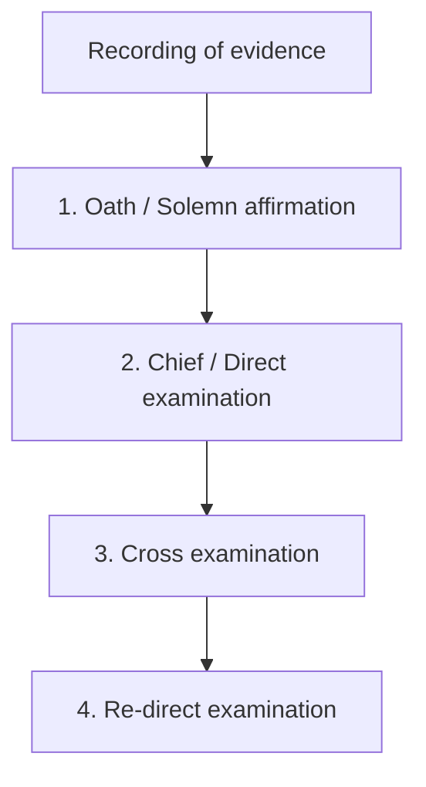

1. **Oath/Solemn affirmation:**
   - Compulsory, on refusal → Punishable.
   - Child < 12 years exempted.
2. **Chief/Direct examination.**
3. **Cross examination.**
4. **Re-direct examination.**

### Note

- Perjury (False evidence under oath) : 227 BNS.
- Punishment for perjury : 229 BNS.

### Difference in direct vs. cross vs. redirect examination

|  | Chief/Direct examination | Cross examination | Redirect examination |
|---|---|---|---|
| Done by | Same side lawyer | Opposite side lawyer | Same side |
| Prosecution witness | PP | DL | PP |
| Defense witness | DL | PP | DL |
| Leading questions | Not permitted | Permitted | Not permitted |
| Significance | To place all facts before the court | To test accuracy & discredit the witness | To clear any doubts/misinterpretations |

**PP:** Public prosecutor.

**DL:** Defence lawyer.

### Extra powers of a judge

- Questions can be asked at any stage of trial.
- Can re-call/re-examine witnesses.

### Hostile witness

- AKA Adverse witness/Unfavourable witness.
- Conceals the truth.
- Contradicting his previous statement.
- Same side lawyer can ask leading questions.

## Dying Declaration vs. Dying Deposition

|  | Dying declaration | Dying deposition |
|---|---|---|
| Recorded by | Anyone; ideally: Magistrate | Only magistrate/judge (Superior) |
| Oath | − | + |
| Presence of accused/lawyer | − |  |
| Cross examination & leading questions | − | + |
| If patient dies | Valid | Valid |
| If patient survives | Less value (Corroborative) | Valid |
| India | + | − |

## Medical Ethics

**00:20:58**

### Medical ethics vs. Etiquette

| Medical ethics | Medical etiquette |
|---|---|
| Compulsory & punishable. | Not compulsory. |
| Guiding moral principles for: doctor-doctor, doctor-patient, doctor-state relationships. | Dealing with colleagues. |
|  | Not punishable. |

### Infamous/Unethical Conduct/Professional Misconduct

Warning notice is given to all doctors informing about:

- Addiction.
- Alcohol — practicing under influence.
- Adultery.
- Conducting criminal abortion.
- Association with unqualified person.
- Advertisements (Inappropriate).
- Bribery.
- Covering: assisting/employing unqualified person.
- Dichotomy: fee splitting.
- Euthanasia: active is crime.
- False certificate issue.
- Gifts from pharmaceutical companies.

### Disciplinary action taken by

- State Medical Council (SMC).
- Ethics & Medical Registration Board (EMRB).
- Warning.
- Remove name from state medical register (Penal erasure):
  - Temporary.
  - Permanent (Professional death sentence).

## Appeal

If punished, one can appeal to higher body:

```mermaid
flowchart LR
    A[SMC] --> B[EMRB]
    B --> C[NMC<br/>(National Medical Commission)]
```

## Professional Secrecy

- Implied contract.
- B/w doctor & patient to maintain confidentiality.

### Privileged communication

Exceptions for professional secrecy:

```mermaid
flowchart TD
    A[Privileged communication] --> B[Notifiable diseases]
    A --> C[Crime]
    C --> D[Mandatory Police intimation<br/>(33 BNSS)]
    B --> B1[Eg. Communicable diseases, snake bite]
```

### Declarations

| Declaration | Guidelines about |
|---|---|
| Tokyo | Torture |
| Istanbul protocol | Documentation & investigation of torture victims |
| Helsinki | Human experimentation |
| Geneva | Medical ethics (Modified Hippocratic Oath) |
| Oslo | Therapeutic abortion |
| Sydney | Death declaration |
| Venice | Terminal illness |
| Lisbon | Patient rights |
| Malta | Hunger strike |
| Washington | Biological weapon |

## Basic Ethical Principles

```mermaid
flowchart LR
    A[Basic Ethical Principles] --> B[Autonomy<br/>Right of patient to choose treatment]
    A --> C[Beneficence<br/>For the benefit of patient]
    A --> D[Justice<br/>Treat all patients same, without discrimination]
    A --> E[Non-maleficence<br/>Do no harm]
```

## Medical Negligence / Professional Malpractices

**00:28:24**

### Factors comprising negligence

```mermaid
flowchart LR
    A[Duty of care] --> B[Dereliction of duty]
    B --> C[Direct causation]
    C --> D[Damage]
    B --> B1[Deficiency in duty]
    B1 --> B2[Absence of reasonable skill or care / wilful negligence]
    D --> D1[Monetary loss]
    D --> D2[Suffering from pain]
    D --> D3[Disability]
    D --> D4[Death]
```

## Types of Negligence

| | Civil | Criminal |
|---|---|---|
| Court | Civil/Consumer | Criminal |
| Parties | Patient vs. Doctor | State vs. Doctor |
| Burden of proof (Plaintiff: Person filing case) | Patient | Prosecution |
| Punishment | Monetary compensation | Jail/Fine |

### Doctrines

#### Res ipsa loquitur (Fact speaks for itself)

- Gross negligent act by doctor.
- No expert opinion needed.
- Burden of proof of innocence → Doctor.
- Applies to both civil & criminal negligence.

#### Respondeat superior / Captain of ship doctrine

- Superior is liable for negligent act of the third party.
- Employer is responsible for the negligence of the employee (Vicarious liability).
- Only applicable for civil cases.

### Defences

- No duty.
- Duty given as per standard protocol: No dereliction of duty.
- Therapeutic misadventure: Accidental damage → Doctor not liable.
- Error of judgement.
- Novus actus interveniens: New unrelated intervening act leading to damage.
- Res indicata (Time limitation period): Case should be filed within 2 years of knowing.
- Res judicata (Things already decided): Patient cannot file case again if unsatisfied (Only appeal).
- Contributory negligence: Patient contributed negligence.
  - Partial defense (To reduce monetary compensation).
  - Applicable only for civil cases.
- Product’s liability: Poor quality drugs/instruments → Manufacturer liable for patient damage.
- Calculated risk doctrine: Doctor → Calculated risk for patient benefit → Not liable.

## Consent

**00:36:51**

Treatment without consent → **Assault.**

### Types

```mermaid
flowchart TD
    A[Consent] --> B[Implied]
    A --> C[Expressed]
    A --> D[Blanket]
    A --> E[Substituted]
    B --> B1[Patient gestures]
    B --> B2[For routine examination only]
    B --> B3[Emergency situations]
    C --> C1[Verbal]
    C --> C2[Written (Best)]
    D --> D1[One consent during admission for all procedures]
    D --> D2[Not valid in India]
    E --> E1[Consent given by guardian]
```

### Informed consent

- Doctor explains all the benefits & risks of the procedure to obtain consent.

#### Doctrine of full disclosure

- Disclose all the information.

#### Doctrine of partial disclosure / Therapeutic privilege

Exception for full disclosure:

- Doctor decides information disclosed to patient.
- For patient’s benefit.

### Exceptions

- Emergency situations (30 BNS).
- Accused of rape — medicolegal examination.
- Therapeutic waiver: Patient waives off his right to consent.
- Mass autopsy.
- Immunization.

### Minimum Age & Validity of Consent

| Situation | Consent |
|---|---|
| MTP | > 18 years |
| Major procedure | > 18 years |
| Physical examination | > 12 years |
| Child < 12 yrs, insanity, influence, intoxication | Invalid |
| Children < 12 years (Residential school/Trip) | Loco parentis (Person in charge) |

---

# Autopsy Techniques & Thanatology

## Autopsy : Types

**00:00:12**

### Medicolegal vs. Pathological Autopsy

| Feature | Medicolegal autopsy (M/c) | Pathological autopsy |
|---|---|---|
| Type of death | Unnatural death | Natural death |
| Authorization | Investigating officer | Consent of relatives: Mandatory |
| Body handover | — | Relatives |
| Examination | Complete autopsy | Partial autopsy |

## Psychological Autopsy

- To confirm suicidal death.
- Objective : To assess mental state of the deceased.
- Procedure : Interview family & relatives.

## Virtual Autopsy / Virtopsy

- Complete imaging of body (CT/MRI).

## Obscure Autopsy vs. Negative Autopsy

| | Obscure autopsy | Negative autopsy |
|---|---|---|
| Examination findings | Insignificant | No findings |
| Opinion on cause of death | After additional tests | Negative (2 - 5% of all autopsies) |

## Autopsy : Sequence, Incision, Techniques

**00:03:03**

### Sequence of dissection

| Cause | Cavity dissected first | Significance |
|---|---|---|
| Poisoning | Cranial | To detect smell of poison |
| Asphyxial death | Cranial | For bloodless dissection of neck (Dissected last); avoid Prinsloo-Gordon artefacts |
| Pneumothorax | Thorax | To demonstrate air in pleural cavity |
| Newborn | Head → Abdomen → Thorax | Level of diaphragm: respiration + → lower; respiration − → higher |

## Types of Incisions

```mermaid
flowchart TD
    A[Types of incisions] --> B[I shaped incision (M/c)]
    A --> C[Y shaped incision]
    A --> D[Modified Y shaped incision]
    A --> E[X incision]
    B --> B1[Chin → Pubic symphysis]
    C --> C1[B/L acromion process → Chest → Pubic symphysis]
    C --> C2[In females<br/>Cosmetic purpose]
    D --> D1[B/L mastoid process → Neck → Chest → Pubic symphysis]
    D --> D2[Detailed neck examination]
    E --> E1[Iliac crest<br/>Custodial deaths]
```

- **I shaped incision (M/c):** Simplest incision.
- **Y shaped incision:** In females (Cosmetic purpose).
- **Modified Y shaped incision:** Detailed neck examination.
- **X incision:** Custodial deaths.

## Techniques of Organ Removal

| Technique | Removal of organ | Features |
|---|---|---|
| Virchow’s technique | Organ by organ | Most common |
| Letulle’s technique | En masse | Rapid removal; study inter-organ relationship |
| Ghon’s technique | Blocks: cervico-thoracic / abdominal / urogenital block | — |
| Rokitansky technique | In-situ dissection | In infections (HIV) |

## Organ Dissection Techniques

| Structure | Dissection methods | Key points |
|---|---|---|
| Scalp | Bimastoid incision | 2 flaps |
| Skull vault | Adults: Stryker saw; fetus: scissors | Beneke’s technique; Barr’s technique (M/c) |
| Brain | Fresh dissection (M/c); formalin fixation (Ideal) | — |
| Spinal cord | Anterior approach; posterior approach (M/c) | Not routinely done; exception: death d/t whiplash injury, strychnine poisoning |
| Heart | Inflow outflow method | RA → RV; LA → LV; cardiac end: double ligation → cut in b/w 2 ligatures |
| Stomach | Incision along greater curvature | Pyloric end; lesser curvature (Magenstrasse): area of maximum damage |

### Exhumation

- AKA disinterment.
- Lawful digging out of already buried body.
- Authorization : Magistrate (Section 196 BNSS).
- Time limit : No time limit in India.
- Preservation of soil samples.
- Importance : To differentiate from PM imbibition (M/c: Arsenic > Endrin).

## Thanatology

**00:12:39**

- Thanatology : Study of death.
- Taphonomy : Study of post-mortem resorption of body.
- Tripod of life : Circulation, respiration, brain function.

## Supravital Period

- Period between:
  - Clinical/somatic death — stoppage of circulation, respiration & brain function.
  - Molecular death — cellular death.
- Significance:
  - Organ harvesting.
  - Max. time limit variable for different tissues (E.g. : Cornea → 6 hours).
- **Zasko’s phenomenon:**
  - Mechanical stimulation of muscle → Tendon reaction.
  - M/c : Quadriceps contraction.
  - Seen 2 - 3 hrs after death.
- Electrical excitability of skeletal muscle +.

## Post-mortem Changes

| Immediate | Early | Late (Decomposition) |
|---|---|---|
| Loss of voluntary movement | Eye changes | Autolysis: Lysosomal enzymes |
| Irreversible stoppage of circulation & respiration | Algor mortis (Cooling) | Putrefaction: bacterial enzymes (Lecithinase), *Clostridium welchii* |
|  | Livor mortis (Staining) |  |
|  | Rigor mortis (Rigidity) |  |

## Early Changes

### Eye changes

| Structure / sign | Features | Time since death (TSD) |
|---|---|---|
| Retina — Kevorkian sign / cattle trucking sign | Fragmentation of retinal vessels | Few minutes → 1 hour |
| Sclera — Tache noire sclerotica | Triangular opacities on either sides of cornea | 3 - 6 hours |

> Most reliable sample for TSD in decomposed body : **Vitreous humor (↑K+) > Blood.**

## Algor Mortis / Post-mortem Cooling

- ↓ Body core temperature (BCT).
- Instrument : Thanatometer/chemical thermometer.
- Site : Rectum (M/c except in sodomy cases), subhepatic space, nose, tympanic membrane, lower end of esophagus.

### Post-mortem caloricity

- Body remains warm after death.
- Causes : D/t high BCT at time of death.
  - Heat stroke.
  - Pontine hemorrhage.
  - Septicemia.
  - Tetanus/strychnine poisoning.
- Not seen in burns.

### Sigmoid / inverted S curve

```mermaid
flowchart LR
    A[1st phase<br/>Slow] --> B[2nd phase<br/>Rapid]
    B --> C[3rd phase<br/>Slow]
    C --> D[Time]
```

- 3 phases of fall of BCT.

## Livor Mortis

- AKA cadaveric or post-mortem lividity / PM staining / PM hypostasis / suggilation / cogitation.
- Hypostasis of blood.

### Distribution by body position

| Position | Distribution |
|---|---|
| Supine position | Back of head, chest, abdomen, legs |
| Prone position | Front of head, chest, abdomen, legs |
| Vertical position | Glove & stocking distribution |

- Hypostasis absent in:
  - Body is in a flowing river.
  - Severe anemia/shock.

### Features

- Onset : 30 mins.
- Visible : Within 1 - 4 hours.
- Max. : 6 - 12 hours.
- Merges with putrefaction colour.
- **Blanching +:** Not fixed.

### Fixation

- Happens at 6 - 12 hours.
- Blanching − : Fixed.
- Movement of body before fixation : Primary lividity → Secondary lividity.

### Contact pallor

- Areas in tight contact → Pallor.

### Colour of lividity

| Colour | Cause |
|---|---|
| Cherry red | Carbon monoxide |
| Bright red | Cyanide |
| Brown | Phosphorus; Aniline; Nitrate |
| Black | Opium |
| Bluish green | Hydrogen sulfide |

## Rigor Mortis

- AKA cadaveric stiffening/rigidity.
- Primary flaccidity → 1 hr → Muscle stiffness → 1 - 2 days → Secondary flaccidity.
- Sphincter relaxation +.
- ATP depletion → Rigor mortis.
- Sequence : Involuntary (1st in myocardium) → Voluntary muscles.
- Externally : Nysten’s rule (Head to toe).

```mermaid
flowchart LR
    A[Eyelid] --> B[Neck]
    B --> C[Jaw]
    C --> D[Face]
    D --> E[Thorax]
    E --> F[Upper limb]
    F --> G[Fingers & toes]
    G --> H[Abdomen]
    H --> I[Lower limb]
```

## Rule of 12

```mermaid
flowchart LR
    A[Death] --> B[1 hour]
    B --> C[Appears]
    C --> D[Peak]
    D --> E[Decline]
    E --> F[Disappears]
    G[12 hours] --- C
    G --- F
```

- Myocardium : 1st site.

## Cadaveric spasm / instantaneous rigor / cataleptic rigidity

- No primary relaxation.
- Spasm of groups of voluntary muscles.
- Always antemortem.
- Drowning, electrocution, suicidal gunshot.

## Late Changes (Putrefaction)

**00:30:51**

- Colour change.
- Gas production.
- Tissue liquefaction (5 - 10 days after death).

### Colour change

- 1st site : Aorta → reddish-brown discolouration.
- 1st external site : Rt. iliac fossa → greenish discolouration.
- Time since death:
  - Summer : 12 - 18 hrs.
  - Winter : 1 - 2 days.

### Marbling

- Green > Brown.
- D/t sulfhemoglobin deposition.
- TSD : 36 - 72 hours.

### Gas production

- Hydrogen sulphide.
- TSD : 2 - 3 days.
- Abdomen distension.
- Gas stiffening.

### Post-mortem blisters and purge

| | Post-mortem blister | Antemortem blister |
|---|---|---|
| Content | Gas | Inflammatory fluid |
| Base | Pale | Reddish |

## Liquefaction

### Sequence

| Stage | Structures |
|---|---|
| Earliest | Larynx; Trachea |
| Early — mnemonic **SISter Lilly’s Brittle Heart** | Stomach; Intestine; Spleen; Liver; Brain; Heart |
| Late | Prostate (Males); Uterus (Females): Non-gravid; Skin |
| Last | Bone; Teeth |

## Poisons and putrefaction

### Delay putrefaction

- Strychnine.
- Metals.
- Carbolic acid.

### Produced during putrefaction

- Alcohol (Trace).

## Casper’s Dictum

Rate of putrefaction : **Air (Fastest) > Water > Earth (Slowest).**

```mermaid
flowchart LR
    A[Air<br/>Fastest] --> B[Water]
    B --> C[Earth<br/>Slowest]
```

## Entomology

- Study of insects.
- Identify:
  - Time since death (Stage of insect).
  - Poison.
  - Place of disposal (Based on insect species).

## Modified Forms of Putrefaction

| | Adipocere / saponification / grave wax | Mummification |
|---|---|---|
| Conditions required | Warm climate; moisture; *Clostridium welchii* (Anaerobe); still air | Hot & dry climate; free air movement; arsenic & antimony poisoning |
| Mechanism | Fat (Starts in subcutaneous layer) → Hydrolysis & hydrogenation → Fatty acids → Greyish white waxy substance | Drying and dehydration → Shrunken body (Dry, brown & brittle) |
| Smell | Sweet rancid odour | Odourless |
| Duration | 3 weeks - 3 months | 3 - 12 months |
| Fetus | + (> 7 months IUL) | + |

## Embalming

- Thanatopraxia.
- Embalming fluid : Ethanol not used.
- Injection technique : High pressure, low volume.
- Ideal time : < 6 hours of death.
- Poisoning case: Embalming prior to autopsy → Punishable (238 BNS : Disappearance of evidence).

## Viscera Preservation for Chemical Analysis

**00:40:53**

For poison detection.

### Routinely sent samples

| Specimen | Quantity / arrangement |
|---|---|
| Blood (Most reliable) | Peripheral vein |
| Stomach & its contents + small intestine | Both in one bottle |
| Liver | 500 gms |
| Kidney | Half of each; liver + kidney samples in another bottle |

### Samples sent for specific poisons

| Poison | Specimen |
|---|---|
| Strychnine | Spinal cord (Full length) |
| Gelsemium | Spinal cord (Full length) |
| Digitalis | Heart |
| Organophosphates | Brain |
| Alcohol | Brain |
| Morphine | Brain |
| Pesticides | Adipose tissue |
| Metals | Bone, hair, nail |
| Gas | Lungs |
| Alcohol | CSF |
| CO/cyanide | Spleen |

### Preservatives

- **Saturated sodium chloride solution (M/c):**
  - Avoided in:
    - Aconite poisoning.
    - Corrosives except carbolic acid.
- **Rectified spirit (Ideal):**
  - Avoided in:
    - Formalin poisoning.
    - Phosphorus poisoning.
    - Alcohol poisoning.

| Specimen | Preservative |
|---|---|
| Blood | Sodium fluoride + potassium oxalate |
| Urine | Sodium fluoride |
| Vitreous | Sodium fluoride |
| CSF | Sodium fluoride |
| Virology | 50% glycerol |

## Samples Sent for DNA Analysis

- Blood — EDTA preservative.
- Muscle.
- Bone.
- Hair.
- Teeth:
  - Dental pulp → DNA.

### Note

**Blood stained cells → Air dried → Sent in paper envelope.**

---

# Human Identification

## Human Identification

**Corpus delicti:** Body of offense/essence of crime.

### Types of identification

```mermaid
flowchart TD
    A[Identification] --> B[Presumptive]
    A --> C[Definitive]
    B --> B1[Race]
    B --> B2[Sex]
    B --> B3[Age]
    B --> B4[Stature]
    C --> C1[Dactylography >> DNA fingerprinting]
    C --> C2[Can differentiate b/w identical twins]
    C --> C3[Scars]
    C --> C4[Tattoo marks]
    C --> C5[Superimposition]
```

## Identification of Race, Sex and Age

**00:00:56**

## Race

### Indices for race determination

Mnemonic : **BCCI**

- Brachial index : From upper limb.
- Cephalic index : From cranium (Best).
- Crural index : From lower limb.
- Intermembral index : Compare upper & lower limb.

### Cephalic index

- Cephalic index = \(\dfrac{\text{max breadth of skull} \times 100}{\text{max length of skull}}\)
- 70 - 74.9 : **Dolicocephalic** — Aryans/Africans.
- 75 - 79.9 : **Mesaticephalic** — Indian/Chinese/Europeans (Mnemonic : ICE).
- 80 - 85 : **Brachycephalic** — Japanese.

### Dental features

| Race | Negroid | Caucasoid | Mongoloid |
|---|---|---|---|
| Dental features | ↑ Tooth size; ↑ Cusps | Carabelli’s cusp | Mnemonic **PASTE**: Pointed canines; Absence of 3rd molar; Shovel incisors; Taurodontism; Enamel pearl (Premolars) |


## Sex

### Concealed sex

- Wearing clothes of opposite sex → Hiding sex for a motive (Revealed O/e).

### Note

**Transvestism:** Wearing clothes of opposite sex → Sexual gratification.

### Sex determination

| Feature | Male | Female |
|---|---|---|
| Muscle markings | More prominent | Less prominent. Exceptions: frontal and parietal eminence (Skull); pre-auricular sulcus (Pelvis) |
| Skull (Orbits, chin) — Shape | Square | Rounded |
| Obturator foramen | Large and oval | Small and triangular |
| Forehead | Sloping | Vertical |
| Pelvic inlet | Heart shaped | Circular |
| Acetabulum and sacroiliac articulation | Larger | Smaller |
| Mandibular angle | Less obtuse: < 125° | More obtuse: > 125° |
| Subpubic angle | < 90° | > 90° |
| Ischial tuberosity | Inverted | Everted |
| Greater sciatic notch (Best) | Deep and narrow | Wide and shallow |
| Higher index | Corporobasal index; Sciatic index (Best); Ischiopubic/Washburn index; Sternal index | — |
| Sacrum — shape | Long and narrow | Short and wide |
| Sacrum — promontory | More prominent | Less prominent |
| Sternal length (Manubrium + body) — Ashley’s rule of 149 | > 149 mm | < 149 mm |
| Hyrtl’s law | Body > 2× length of manubrium | Body < 2× length of manubrium |

## Accuracy of sex determination from bones / Krogman’s accuracy

- Pelvis : **95% (Best), even in children/fetus**.
- Skull : 90 - 92%.
- Long bones : 80%.
- Pelvis + skull : 98%.
- Pelvis + long bones : 98%.
- Complete set : 100%.

### Bony landmarks used in sex determination

- Manubrium.
- Body.
- Xiphoid process.
- Pre-auricular sulcus:
  - Deeper in females.

## Age Estimation

### Types

```mermaid
flowchart TD
    A[Age estimation] --> B[Fetus]
    A --> C[Prepuberty]
    A --> D[Adult]
    B --> B1[Crown to heel length]
    B --> B2[Ossification]
    C --> C1[Teeth]
    C --> C2[Ossification]
    C1 --> C3[Eruption]
    C1 --> C4[Mineralization<br/>(Most reliable)]
    D --> D1[Teeth: Secondary changes]
    D --> D2[Skull sutures: Closures]
    D --> D3[Pubic symphyseal surface change<br/>(Reliable) — Todd's method]
```

### Crown to heel length (CHL)

#### Rule of Hasse

- < 5 months of gestation.
- GA = CHL.

#### Rule of Morrison

- > 5 months of gestation.
- GA = CHL/5.

**CHL = Crown rump length (CRL) × 1.5.**

## Ossification Centres

**00:17:31**

### Ankle joint

| Centre | Age of appearance |
|---|---|
| Calcaneum | 5th month IUL (Before viability) |
| Talus | 7th month IUL |
| Femur (Lower end) | 36 weeks IUL |
| Tibia (Upper end) | 38 weeks IUL |
| Cuboid | At birth |

### Mandible

- 2 halves fuse at 1 - 2 yrs.

### Medial end of clavicle

- Appear at : 18 - 19 yrs.
- Fuses at : 21 - 22 yrs.
- 18 - 22 yrs.

### Humerus

| Centre | Age of appearance | Age of fusion |
|---|---:|---:|
| Head | 1 yr | 17 - 18 yrs |
| Greater tubercle | 3 yrs | 17 - 18 yrs |
| Lesser tubercle | 5 yrs | 17 - 18 yrs |
| Tip of acromion | 14 - 15 yrs | 17 - 18 yrs |

> The source groups the humeral fusion information around **17 - 18 yrs** and notes **> 17 yrs** for the later stages shown in the diagram.

### Elbow joint: Mnemonic CRITOE

| Centre | Age of appearance |
|---|---:|
| Capitulum | 1 yr |
| Radius head | 5 yrs |
| Medial epicondyle (i) | 6 yrs |
| Trochlea | 9 yrs |
| Tip of olecranon | 9 yrs |
| Lateral epicondyle (e) | 11 yrs |

- Age of fusion: **16 - 17 yrs**.
- All 6 centres appeared.
- Not fused.
- 11 - 17 years.
- > 16 yrs (All centres appeared & fused).

## Wrist joint

- Best way to find if adult (> 18 years).

| Centre | Age of appearance | Age of fusion |
|---|---:|---:|
| Lower end of radius | 2 yrs | 18 - 19 yrs |
| Lower end of ulna | 5 yrs | 17 - 18 yrs |

- > 18 y (Lower end of radius fused).
- 3 yrs - 4 yrs: Capitate, hamate, triquetral radial end appeared.

### Order of appearance of carpal bones

```mermaid
flowchart LR
    A[Capitate<br/>(2 months)] --> B[Hamate<br/>(3 m - 1 yr)]
    B --> C[Triquetral<br/>(3 y)]
    C --> D[Lunate<br/>(4 y)]
    D --> E[Scaphoid<br/>(5 y)]
    E --> F[Trapezium / trapezoid<br/>(Twin bones; 5 - 6 y)]
    F --> G[Pisiform<br/>(9 - 12 y)]
```

## Skull

- Posterior fontanelle (Lambda) : 3 - 6 months.
- Anterior fontanelle (Bregma) : 18 months.
- Metopic suture : 2 - 4 years.

### Suture closure ages

| Suture | Approximate closure pattern / age shown |
|---|---|
| Frontal suture | Upper 1/2: 50 years; lower 1/2: 40 years |
| Coronal suture | Anterior 1/3rd: 40 years; middle 1/3rd: 50 years; posterior 1/3rd: 30 years |
| Sagittal suture | Lower 1/2: 50 years; upper 1/2: 60 years |
| Lambdoid suture | Lower 1/2: 50 years; upper 1/2: 60 years |

- Endocranial suture (More reliable) > Ectocranial suture.
- Fuses 5 - 10 years earlier.
- Spheno-occipital suture (Basiphenoid & basiocciput) : 18 - 22 years.

## Sacrum and Sternum

### Sacrum

- Sacrum : 22 - 25 years.

### Sternum

- Fusion : 15 - 25 yrs.
- Old age → 40 y.
- Ossification centres shown in source:
  - Manubrium (M).
  - Xiphisternum (X).
  - Body of sternum.

### Note

- Child under guardianship of court → Major at 21 years.

## Dentition

**00:30:10**

### Types of teeth

#### Primary / milk teeth / deciduous teeth

- Temporary : 20.

### Order of eruption: mnemonic IMCM

- **I:** 6 months (First: Lower C.I.).
- **M1:** 12 months.
- **C:** 18 months.
- **m2:** 24 months.

| Abbreviation | Meaning |
|---|---|
| C.I. | Central incisor |
| L.I. | Lateral incisor |
| C | Canine |
| Pm | Premolar |
| M | Molar |

#### Secondary

- Permanent : 32.

### Order of eruption

- M1 : 6 years (First).
- C.I. : 7 years.
- L.I. : 8 years.
- PM1 : 9 years.
- PM2 : 10 years.
- C : 11 years.
- M2 : 12 - 14 years.
- M3 : 17 - 25 years (Wisdom tooth).

- Time gap for spacing of jaw.
- Failure : Impacted tooth (M3 : M/c).

## Successional and Super added teeth

- **Successional teeth (20):** Ones replacing temporary set.
- **Super added teeth (12):** Additional ones (All permanent molars).

## Period of Mixed Dentition

- Period with both temporary & permanent teeth.
- 6 - 11 years.
- Total number constant = 24.

## Methods of Estimation

### Gustafson’s method

After 25 years.

Mnemonic : **APSRTC**

- Attrition (Wear and tear).
- Paradentosis (Gum changes).
- Secondary dentin (2nd reliable).
- Root resorption.
- Transparency of root (Most reliable).
- Cementum apposition.

```mermaid
flowchart LR
    A[Anterior] --> B[Posterior]
    A1[C.I. most reliable] --- A
    B1[M3 least reliable] --- B
    A --> C[Reliability ↓ posteriorly]
```

Microscopic changes.

### Stack’s method

- From the height and weight of the tooth.

### Boyde’s method

- Counting microscopic incremental lines in teeth.
- First line (Neonatal line) : Day 2 or 3 (Sign of live birth).
- Every day, one line.

## Dental Charting

### Universal Method

- Oldest method.
- Continuous numbering 1 - 32.
- Starting right upper and clockwise.

### Palmer’s notation

- Count medial → lateral.
- With symbol for quadrants.

## FDI method

- 2 digit system.
- Permanent teeth prefix : 1, 2, 3, 4 each for specific quadrant in clockwise.
- Temporary teeth prefix : 5, 6, 7, 8.
- Counting teeth 1 - 8, medial → lateral.
- Worldwide mostly used.

## Haderup’s notation

- + : Maxillary teeth (Upper jaw).
- − : Mandibular teeth (Lower jaw).

## Stature

**00:42:37**

### Estimation

1. Regression formulae:
   - Karl-Pearson formula (Commonly used).
2. Percentile:
   - Femur : 27% of height (Best).
   - Tibia : 22%.
   - Humerus : 20%.
   - Spine : 35%.
3. Multiplication factor:
   - Length of bone × Multiplication factor = Height.
   - Mnemonic : **FeTHUR**.
   - Femur : 3.7.
   - Tibia : 4.5.
   - Humerus : 5.3.
   - Ulna : 6.1.
   - Radius : 6.5.

**Hepburn osteometric board:** Used to measure length of long bones.

## Dactylography and Other Methods

**00:44:49**

### Bertillon’s method

Oldest method for identification.

- Anthropometric measurements (11 key body dimensions).
- Descriptive information (E.g. : Eye colour, hair colour).
- Photographs.
- Personal details.

### Dactylography

- Galton’s system.
- Develop in intrauterine life:
  - Starts : 12 - 16th week (3 - 4 m).
  - Completed : 20 - 24th week (5 - 6 m).

### Patterns

```mermaid
flowchart LR
    A[Fingerprint patterns] --> B[Loop]
    A --> C[Whorl]
    A --> D[Arch]
    A --> E[Composite]
    B --> B1[1 core, 1 delta]
    B1 --> B2[Starts, go to top, end same side, m/c]
    C --> C1[1 core, 2 delta]
    C1 --> C2[Concentric circles]
    D --> D1[1 core, 0 delta]
    D1 --> D2[Start & end in opposite sides]
    E --> E1[Mixed pattern (L/c)]
```

### Core and delta

| Pattern | Core | Delta |
|---|---:|---:|
| Arch | 0 | 0 |
| Loop | 1 | 1 |
| Whorl | 1 | 2 |

### Fingerprint abnormalities

| Abnormality | Features |
|---|---|
| Complete absence | Adermatoglyphia |
| Atrophy | Celiac disease (Complete); Dermatitis (Partial) |
| Permanent alteration | Leprosy; Electrocution; Radiation |
| Space b/w ridges ↑ | Mnemonic **AIR**: Acromegaly; Infantile paralysis; Rickets |

## Comparison of fingerprints

- Patterns not used.
- Compare:
  - Minutiae (Ridges) → Ridgeology.
  - Microscopic pattern from edge of ridges → Edgeoscopy.

## Other Methods

### Poroscopy

- Arrangement of sweat pores.
- Locard’s poroscopy.

### Cheiloscopy

- Suzuki classification used.
- Study of lip prints.

### Rugoscopy (Study of rugae) / palatoscopy

- Anterior hard palate is evaluated.

| Rugae | Size |
|---|---|
| Primary | 5 - 10 mm |
| Secondary | 3 - 5 mm |
| Tertiary | < 3 mm |

### Aging of scar

- Angry, red scar → 5 - 6 days.
- Pale, tender → 2 weeks.
- White, soft, ↓ tenderness → 2 - 6 months.
- Non-tender and firm → After 6 months.

### Tattoo marks

Faint tattoo visualized by:

- Magnifying glass.
- Infrared photography.
- UV light.
- Regional LN examination (Pigment).

### Podogram

- Study of footprints.

## Superimposition

- Matching the skull & antemortem photograph of missing person.

### Look and match

- Inner, outer canthus.
- Nasion.

### Negative value tests

- Helps with exclusion.


