# Asphyxial Deaths

## Asphyxial Triad

The **asphyxial triad** is non-specific:

- Peripheral cyanosis
- Visceral congestion
- Petechial hemorrhages / Tardieu spots
  - Rupture of venules
  - Pinpoint hemorrhages

## Types Based on Mechanism

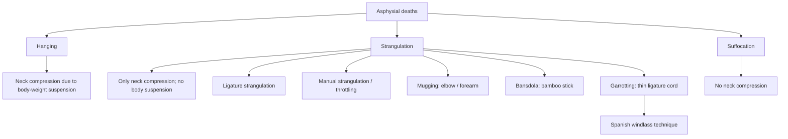

## Hyoid Bone Fractures

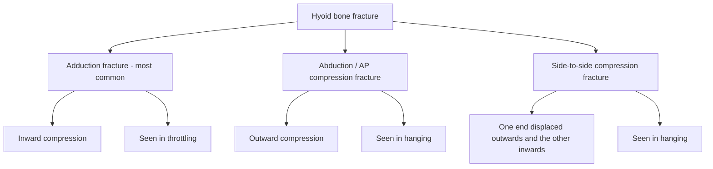

## Hanging

### Types Based on Knot Position

- **Typical hanging:** Knot in occiput.
- **Atypical hanging:** Knot anywhere other than occiput (judicial hanging).

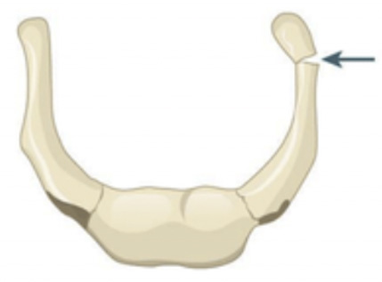

### Types Based on Suspension

| Feature | Complete hanging | Partial hanging (incomplete hanging) |
|---|---|---|
| Suspension | Whole body suspended | Partial body suspended |
| Contact with ground | No body part touches ground | Body part is touching the ground, e.g. leg or knee |
| Constricting force | Whole weight of the body | Partial weight of the body |
| Death | Faster | Slower (suicidal) |

### Autopsy Findings

#### Order of Autopsy

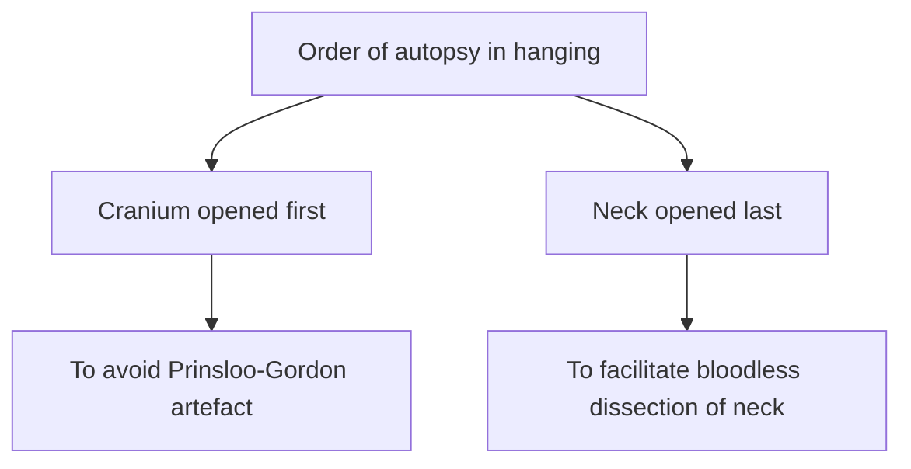

#### Hypostasis

- **Glove and stocking pattern**.
- Implies body was in vertical position.
- Does **not** imply hanging.

#### Face

- Dribbling of saliva.
- La facie sympathique.

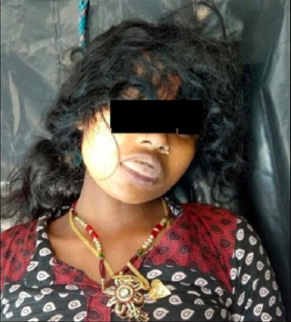

#### Dribbling of Saliva

- Surest sign of antemortem hanging.
- Opposite to knot side.

#### La facie sympathique

- Pressure on cervical sympathetic chain.
- Sign of antemortem hanging.
- I/L opening of eyelids + I/L pupillary dilatation.

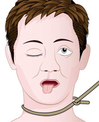

#### Ligature Mark

- Oblique.
- Incomplete.
- Above thyroid cartilage.

**Transverse ligature mark** is seen in:

- Partial hanging (due to low point of suspension).
- Slip knot with running noose.

### Internal Findings

1. **Hyoid bone fracture**
   - Seen in 15–20% of hanging cases.
   - More common in age >40 years.
2. **Carotid artery:** Amussat sign (transverse intimal tear).
3. **Vertebra:**
   - C2 fracture (Hangman’s fracture) — cause of death in judicial hanging.
   - Simon’s hemorrhage (intervertebral disc hemorrhage).

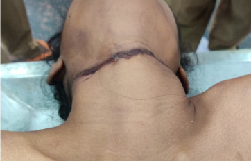

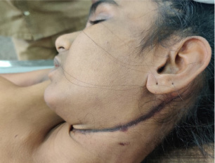

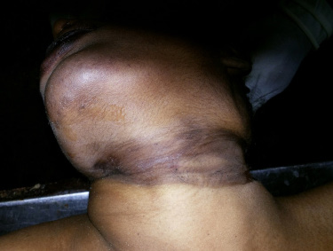

### Manner of Hanging

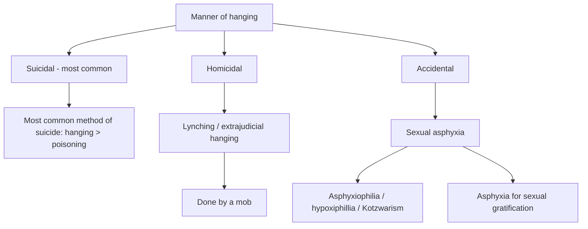

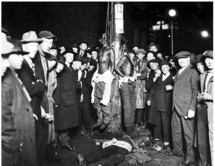

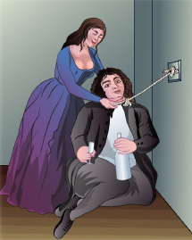

## Strangulation

### Ligature Strangulation

**Ligature mark:**

- Transverse.
- Complete.
- Below thyroid cartilage.
- Underlying skin shows extensive extravasation of blood.
- Bruising around ligature mark +.
- Hyoid/cricoid fracture: −.

### Throttling

- Homicidal.

#### External Findings

- Nail marks.
- Six penny bruises.

#### Internal Findings

- Extensive soft tissue contusion.
- Adduction fracture of hyoid.
- Cricoid cartilage fracture.

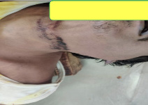

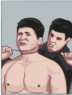

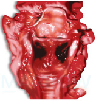

### Other Forms of Strangulation

- **Bansdola:** Bamboo sticks used.
- **Spanish windlass:** Garroting variant.
- **Mugging.**

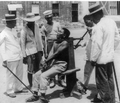

## Suffocation

### Smothering

Closure of mouth and nostrils together:

1. Accidental.
2. Homicidal:
   - Intentionally smothering with pillow/hands.
   - If hands are used:
     - Perioral injuries (abrasion/bruises).
     - Lip injuries.

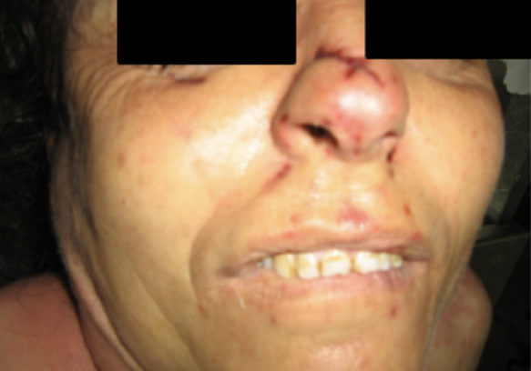

## Gagging

Thrusting cloth/pad into mouth → obstruction of pharynx → asphyxia.

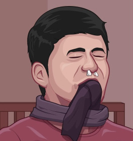

## Choking

### Mechanism

Entry of foreign body into airway → respiratory distress (air hunger, gasping) → asphyxia.

### Management

**Heimlich maneuver.**

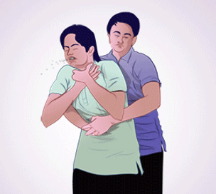

## Cafe Coronary Syndrome

- Entry of food bolus into airway → sudden collapse & death.
- Mimics myocardial infarction.
- Risk factor: intoxication.
- Cause of death: vagal inhibition of heart.

## Traumatic and Positional Asphyxia

### Traumatic Asphyxia / Crush Asphyxia / Perthes Syndrome

- Due to heavy weight on person’s chest.
- **Masque ecchymotique:** Pale chest with cyanosed face.
- **Burking (homicidal):** Smothering + traumatic asphyxia.
- **Overlaying (accidental).**

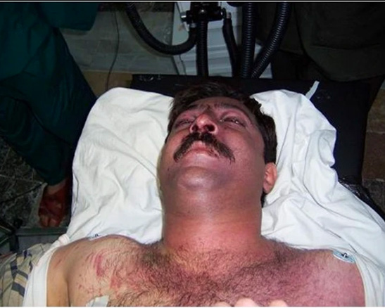

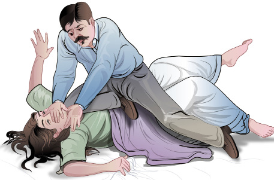

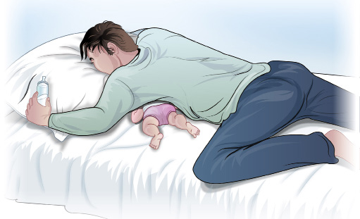

### Positional Asphyxia

- Due to abnormal position.
- Types:
  - Jack-knife position.
  - Inverted crucifixion.

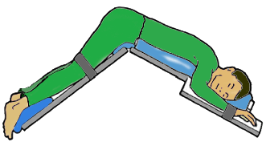

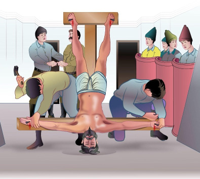

## Drowning

### General Points

- Most deaths: accidental.

### Types

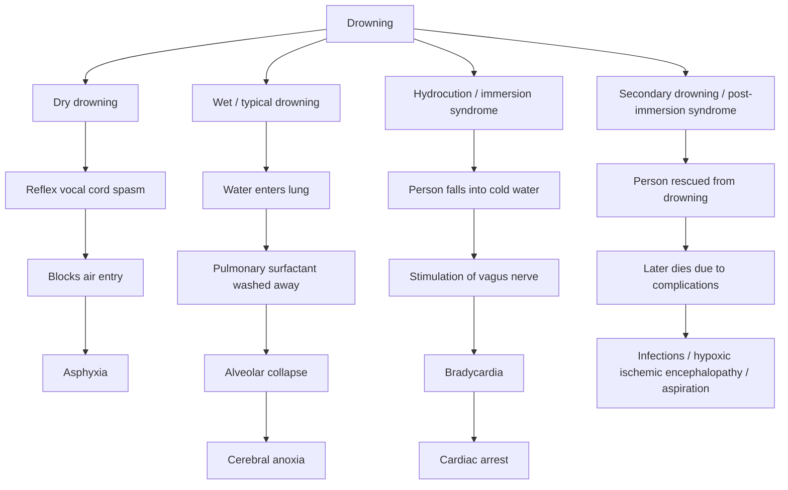

### Hydrocution / Immersion Syndrome

- Person falls into cold water (about 5°C below body temperature).
- Vagal stimulation → bradycardia → cardiac arrest.

### Secondary Drowning / Post-Immersion Syndrome

A person rescued from drowning may subsequently die due to:

- Infections.
- Hypoxic ischemic encephalopathy.
- Aspiration.

### Fresh Water vs Salt Water Drowning

| Feature | Fresh water (hypotonic) drowning | Salt water (hypertonic) drowning |
|---|---|---|
| Main effect | Hemodilution (↓Na, ↓Cl) | Hemoconcentration |
| RBCs | Swelling → rupture (hemolysis) | Crenated RBCs |
| Electrolytes | K+ release → hyperkalemia | ↑Na+, ↑Cl− |
| Other findings | Hypervolemia → cardiac overload → arrhythmia → pulmonary edema → respiratory failure | ↑Mg2+ (Moritz test), ↑strontium, ↑hemoglobin |
| Fatal period | 4–5 min | 8–10 min |

### Autopsy Findings in Antemortem Drowning

#### Specific Findings

1. **Cadaveric spasm**
   - Presence of grass tightly clenched in the hands of the victim.
   - Surest sign of antemortem drowning.
2. **Froth in nostril/mouth**
   - Seen only in violent respiratory struggle.
   - Due to mixing of air, water & surfactant.
   - Fine.
   - Tenacious.
   - Persistent, even after wiping.

**Absence of froth:**

- Dry drowning.
- Hydrocution.
- Unconscious person.

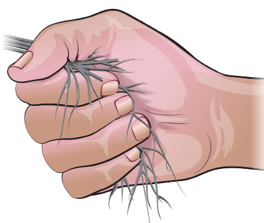

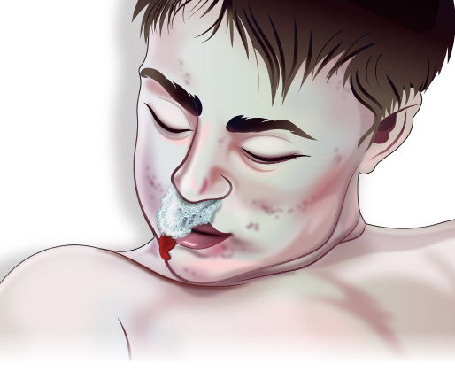

#### Non-Specific Findings

1. **Cutis anserina.**
2. **Washerwoman’s hand/feet:** Imbibition of water into skin.
   - Wrinkling.
   - Peeling of cuticle.
   - Bleaching.
   - Soddening.
   - Indicates only time since immersion.
   - Starts in fingers (3–4 h); by 24 h, whole hand.

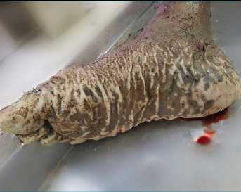

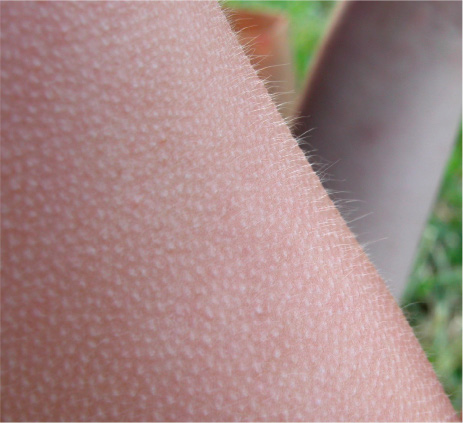

#### Lung Changes

**Emphysema aquosum: conscious drowning**

- Voluminous.
- Crepitant.
- Ballooning out.
- Mud particles in lower airway.
- Paltauf hemorrhages.
- Frothing +.

**Oedema aquosum: unconscious drowning**

- Lung edema +++.
- ↓ Frothing.

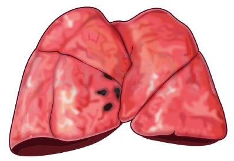

#### Other Findings

1. Presence of water in:
   - Stomach/intestine.
   - Sinuses.
   - Middle ear.
2. Middle ear hemorrhages.
3. Shrunken spleen: Sabinsky’s sign.

### Tests for Drowning

#### Gettler’s Test

**Principle:** Compare Cl− concentration of blood in right and left heart chambers.

| Cl− concentration | Effect | Drowning type |
|---|---|---|
| Normal: left = right | — | Normal |
| Rt > Lt | Hemodilution | Freshwater |
| Lt > Rt | Hemoconcentration | Salt water |

**Wet drowning:** >25% difference between left and right side.

#### Diatom Test

Features of diatom:

- Unicellular algae.
- Outer wall has silica.
- Resistant to acid/alkali & putrefaction.

**Microscopy:**

- Presence of diatoms in spleen, bone marrow (best site), brain & liver.
- Suggestive of antemortem drowning because diatoms entered due to intact circulation.

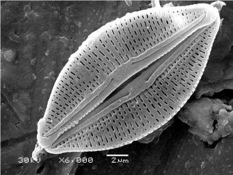

#### Paltauf Hemorrhages vs Petechial Hemorrhages

| Feature | Paltauf hemorrhages | Petechial hemorrhages |
|---|---|---|
| Specificity | Specific to drowning | Non-specific asphyxial sign |
| Location | Only lung | Multiple organs |
| Cause | Rupture of alveoli | Rupture of venules |

# Sexual Jurisprudence and Trace Evidence

## Terminology

| Sex | Term | Definition |
|---|---|---|
| Male | Impotency | Inability to achieve & maintain penile erection (most common cause: anxiety) |
| Male | Satyriasis | Excessive sexual desire |
| Male | Impotence quoad hanc | Impotence towards one particular woman (psychological) |
| Female | Frigidity | Sexual coldness |
| Female | Nymphomania | Excessive sexual desire |

**Fecundation ab extra:** Conception in a female without penile penetration.

## Hymen and Terminologies Related to Pregnancy

### Hymen

Types:

- Semilunar (most common).
- Cribriform.
- Imperforate.
- Annular.
- Septate.
- Fimbriate — mistaken for tear.

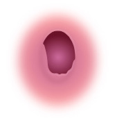

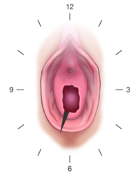

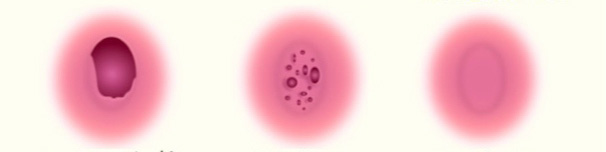

### Hymen Tear

- Posterolateral: penile penetration.
- Anterior: digital/foreign body.

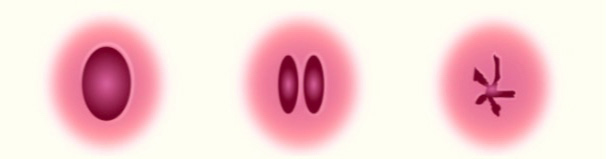

### Intact Hymen After Intercourse

- **False virgin:** too elastic/loose/thick.
- **Female child:** deep seated.

## Terminologies Related to Pregnancy

### Phantom / Spurious Pregnancy / Pseudocyesis

- Female believes she’s pregnant.
- Presentation:
  - Amenorrhea.
  - Abdominal distension.
  - Morning sickness.
- No confirmatory signs.
- On USG:
  - No fetal parts/heart sound.
  - Empty uterus.
- Treatment: counseling.

### Superfecundation vs Superfetation

| Feature | Superfecundation | Superfetation (rare) |
|---|---|---|
| Fertilisation | 2 ova | 2 ova |
| Ovulatory cycle | Same cycle | Different |
| Acts of coitus | 2 | 2 |
| Partner | 1 or 2 | — |
| Fetal growth | Equal / fetus compressus / fetus papyraceous | Unequal |

### Other Terms

- **Supposititious / fictitious / substituted / forged child:** Female may feign pregnancy & claim some other child as her own.
- **Atavism:** Child resembling grandparents.
- **Posthumous:** Child born after the death of father.
- **Affiliation case:** Female alleges a man to be the father of her child; for fixing paternity.
- **Lochia:** Sign of recent delivery; lochia rubra → lochia serosa → lochia alba.

## Surrogacy Regulation Act

**Surrogacy:** Surrogate woman bears and hands over the child post-delivery to an intending couple.

### Types of Surrogacy

| Feature | Altruistic surrogacy | Commercial surrogacy |
|---|---|---|
| Compensation | No monetary compensation to surrogate mother | Monetary compensation given to surrogate mother |
| Covered costs | Only medical expenses and insurance | — |
| Permitted under surrogacy act | Yes | No |

### Eligibility Criteria

| Intending couple | Intending woman | Surrogate woman |
|---|---|---|
| Married (>5 years) | Widow or divorcee | Married |
| Male age: 26–55 years | Age: 35–45 years | Age: 23–35 years |
| Female age: 23–50 years | — | At least one child of her own |
| No surviving child | — | Eligible only once in lifetime (maximum 3 attempts) |
| Essentiality & eligibility certificate | — | Health insurance (3 years) provided by intending couple |

**Not eligible:**

- Unmarried person/couple.
- Foreign nationals.
- At least one gamete from biological parent.

## Medical Termination of Pregnancy (Amendment) Act 2021

### Indications

- Eugenic: fetal abnormalities.
- Therapeutic: maternal disease.
- Social: failure of contraception.
- Humanitarian: rape.

### Duration and Approval

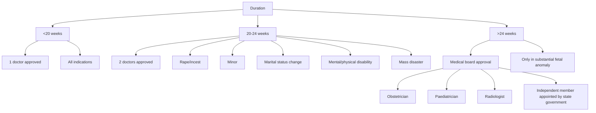

### Consent for MTP

- Minimum age >18 years.
- <18 years / mentally ill: consent of guardian.

### MTP Records

- Preserve for 5 years.
- To be forwarded monthly to district CMO.
- Strictly confidential: violation punishable.

### Criminal Abortion / Voluntary Miscarriage

- **88 BNS:** With consent of female.
- **89 BNS:** Without consent of female.
- **90 BNS:** With/without consent, resulting in death of female.

## Infant Death

- Under **103 BNS**: amounts to murder.
- Killing of:
  - Infant (<1 yr): infanticide.
  - Fetus by parents: filicide.

### Maceration

- Sign of intrauterine death.
- Aseptic autolysis.
- Skin reddening/slippage (earliest sign: 12 h).
- Hypermobile joints.

### Radiological Signs

- **Robert sign:** Gas shadow in great vessels (12 h).
- **Ball’s sign:** Hyperflexion of spine.
- **Spalding sign:** Seen in 4–7 days; overriding of cranial vault bones.

### Postmortem Examination

| Method | Parameter | Not respired | Respired |
|---|---|---:|---:|
| Diaphragm | Check level | 3rd–4th rib | 6th–7th rib |
| Fodere’s test / static test | Lung weight | 30 g | 60 g |
| Ploucquet’s test | Lung weight / baby weight | 1:70 | 1:35 |
| Wreden’s test | Middle ear content | Gelatinous tissue | Clear |
| Breslau’s second life test | Stomach perforated in water | No air bubble | Air bubble |
| Raygat’s / hydrostatic test / lung floatation test | Lung cut in pieces and put in water | Sink | Floats |
| Specific gravity | Residual air | 1.040 | 0.940 |

**Notes:**

1. Cry of baby in the vagina: **Vagitus vaginalis**.
2. Cry of baby in the uterus: **Vagitus uterinus**.

## Child Abuse

### Battered Baby Syndrome / Caffey Syndrome

- AKA Caffey-Kempe syndrome / non-accidental violence.
- Child abuse → repetitive physical injuries.
- By parents or guardian.

### Features

- Discrepancy between nature of injuries & history given.
- Delay between injury and medical attention.
- Multiple, repetitive injuries of various ages.

### Common Injuries

- Laceration of oral mucosa + frenulum of lower lip (characteristic).
- Egg-shell fracture (skull).
- Bucket-handle fracture (long bones).
- Knob fracture / string of beads appearance (CXR).

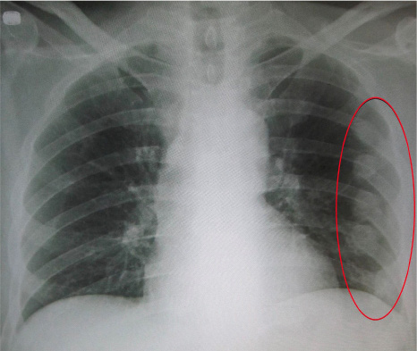

### Munchausen’s Syndrome by Proxy

- Type of abuse.
- Parent fabricates illness in child → brings child to hospital to gain attention.

## Sudden Infant Death Syndrome (SIDS) / Cot Death / Crib Death

- Sudden unexpected death of a seemingly healthy infant.
- Death remains unexplained even after thorough investigations.

### Probable Causes

1. Prolonged sleep apnea.
2. Respiratory infection.
3. Hypersensitivity to cow’s milk.

### Autopsy Findings

- Usually negative.
- Constant finding: petechial hemorrhages on heart, lung, thymus.

## Sexual Offences

### Rape

- **63 BNS:** Definition of rape.
- **Statutory rape:** victim age <18 years (with/without consent).
- **64 BNS:** punishment of rape, 10 years to life imprisonment.
- **64(2) BNS:** punishment of custodial rape.
- **67 BNS:** punishment for forceful sexual intercourse with wife during separation.
- **70 BNS:** punishment for gang rape.
- **366(2) BNSS:** in-camera trial (closed court proceedings).
- **397 BNSS:**
  - All doctors must treat victims of rape/vitriolage/POCSO.
  - Immediately.
  - Free of cost.
  - Police intimation mandatory.
  - Violation punishable under 200 BNS.

### Medical Examination

| | Accused | Victim |
|---|---|---|
| Section | 52 BNSS | 184 BNSS |
| Consent | Not mandatory | Mandatory |
| If patient denies examination | — | Informed refusal taken → treatment for injuries, STD, pregnancy |
| Tests | Lugol’s iodine test: detects vaginal epithelial cells; swab from penis shaft exposed to iodine vapour → brown colour; up to 4 days | Toluidine blue test: recent microinjuries; motile sperm (6–12 h): recent rape |

### Preservation of Samples (Vaginal Swab)

- Sperm: 3 days.
- Semen: 4 days.

### Unnatural Sexual Offences

Not punishable if between 2 consensual adults.

| Incest | Lesbianism / Tribadism / Sapphism | Sodomy / Greek love / Buggery | Buccal coitus / Oral sex / Sin of Gomorrah |
|---|---|---|---|
| Sex between family members | Between females | Penile anal sex | Oral stimulation |
| Oedipus complex: mother & son | Active partner: Dyke | If an adult male with elderly: gerontophilia | Penis: fellatio |
| Electra complex: father & daughter | Passive partner: Femme | If an adult male with child (catamite): pederasty | Vagina: cunnilingus |
| Pharaon complex: brother & sister | | | |

- **Bestiality:** intercourse with lower animals.

## Sexual Perversions

Sexual gratification without intercourse.

| Paraphilia | Mode of sexual gratification |
|---|---|
| Sadism / Algolagnia | By inflicting pain/physical cruelty |
| Masochism / passive algolagnia | By receiving painful stimulus from opposite partner |
| Lust murder | By killing victim |
| Bondage | Sadist + masochist |
| Transvestism / Eonism | By wearing dress of opposite sex |
| Exhibitionism | Recurrent, intense sexual urge to expose genitalia to an unsuspecting stranger |
| Voyeurism / Scoptophilia | Watching private acts of unsuspecting female (peeping tom) |
| Fetishism | With inanimate objects/non-living things |
| Frotteurism | Rubbing genitalia against non-consenting person in public |
| Scatologia | Talking obscenity |
| Klismaphilia | Taking enema |
| Urophilia / Undinism / Urolagnia | Sight/smell/thought of urine |
| Coprophilia | Sight/smell/thought of feces |
| Ecouterism | Listening to sounds associated with sexual intercourse |
| Necrophilia | Intercourse with dead body |
| Necrophagia | Eating dead body |
| Troilism | Observing wife having sexual intercourse with another man |
| Narratophilia | By telling obscene stories |

**Legal points in source:**

- Exhibitionism punishable under **296 BNS**.
  - Streaking: publicly runs nude.
  - Mooning: shows gluteal region.
  - Flashing: suddenly undressing & exposing private parts.
- Voyeurism punishable under **77 BNS**.
- Frotteurism punishable under **75 BNS**.
- Necrophilia punishable under **301 BNS**.

## Evidence Collection

### Test for Blood Stains

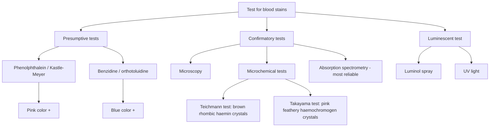

- Luminol can detect blood even if it has been washed off.

### Species Identification

- **Precipitin test.**

### Tests for Seminal Stains

| Test | Finding |
|---|---|
| Teichmann test | Dark brown rhombic crystals |
| Takayama test | Yellow needle-shaped crystals |
| Antigen tests | P30 (PSA), seminal vesicle specific antigen (SVSA), Mab4eb |
| Enzymatic tests | Acid phosphatase (gives time since intercourse); creatine phosphokinase (CPK) >400 U = seminal stain |
| UV light | Bluish-white fluorescence |
| Microscopy (confirmatory) | Spermatozoa (at least 1, intact) |
| Crystal / microchemical tests | Florence test: choline iodide crystals; Barberio’s test: spermine picrate crystals |

### Hair

| Feature | Human hair | Animal hair |
|---|---|---|
| Medulla | Fragmented, narrow, absent in few places | Wider/thicker, continuous |
| Medullary index | <0.3 | >0.5 |

# Toxicology

## Toxicology and Toxinology

- **Toxicology:** Study of poisons.
- **Toxinology:** Study of toxins (biological substance).

## Identification of Poisons

### Based on Smell

Autopsy is performed by opening the cranial cavity first to help identify poison by smell.

| Smell | Poison |
|---|---|
| Garlic | Arsenic / phosphorus / aluminium phosphide / organophosphorous compounds (OPC) |
| Bitter almond | Cyanide |
| Burnt rope | Cannabis |
| Acrid pear | Paraldehyde; chloral hydrate (Mickey’s Finn / knockout drops), stupefying agent |
| Fruity | Alcohol |
| Rotten egg | Hydrogen sulphide |
| Kerosene | OPC |
| Hospital | Phenol (carbolic acid) |
| Mousy | Conium maculatum (hemlock), causes ascending paralysis |
| Fishy | Zinc phosphide |

### Based on Appearance of Stomach Mucosa

| Colour / nature | Poison |
|---|---|
| Black necrotic | Sulphuric acid (H₂SO₄) / oil of vitriol |
| Yellow | Nitric acid |
| Buffy white leathery | Phenol |
| Bluish green | Copper sulphate (CuSO₄); sodium amytal; bluish green vomitus with copper sulphate |
| Slate grey | Mercury |
| Red velvety | Arsenic |

## Duties of a Doctor in Poisoning Cases

### Legal Duties

- Compulsory duty.
- Preserve the evidence.
- Police intimation (33 BNSS).
- Punishments:
  - Disappearance of evidence: [P] 238 BNS.
  - Failure to inform police.
  - False information provided.

**Note:** BNS 286: [P] negligent conduct with respect to poisons.

### Medical Duty

Medical duties are done first and then legal duties are taken up.

#### 1. Stabilization

#### 2. Removal of Unabsorbed Poisons / Decontamination

- Gastric lavage: for oral poisons.
- Done using:
  - Lavacuator.
  - Ewald’s tube.
  - Ryle’s tube.
- Ideal position: left lateral position.
- Ideal time: <1 h.
- Activated charcoal added → adsorption of poison.
- Absolute contraindication:
  - Corrosives → perforation (except carbolic acid: leathery mucosa).
- Relative contraindications:
  - Coma.
  - Volatile (kerosene, hydrocarbon) → aspiration pneumonitis.
  - Convulsant (Strychnos) → precipitate convulsion.

**Note:** Most rapid route of absorption of poison = inhalation.

#### 3. Removal of Absorbed Poisons

- Dialysis (hemodialysis > peritoneal).
- Increase urinary excretion of poisons:
  - **Alkalization** (IV NaHCO₃): for acidic drugs (salicylates/barbiturates).
  - **Acidification** (rare): for alkaline drugs.
- Multidose activated charcoal.

## Antidotes

| Poison | Antidote |
|---|---|
| Arsenic | BAL (dimercaprol), DMSA |
| Copper | D-penicillamine, DMSA |
| Iron | Desferrioxamine |
| Lead — mild-moderate | EDTA |
| Lead — severe (encephalopathy +) | EDTA + BAL/DMSA |
| Mercury | DMSA, BAL |
| Cadmium | DMSA |
| Cocaine | Amyl nitrite |
| Beta blocker | Glucagon |
| Carbon monoxide — moderate | High-flow oxygen |
| Carbon monoxide — severe | Hyperbaric oxygen (causes barotrauma) |
| Cyanide | Hydroxocobalamin (DOC), nitrites (induces methHb) |
| Digitalis | Digibind |
| Morphine | Naloxone sodium |
| Methanol | Fomepizole + ethanol; inhibits alcohol dehydrogenase |
| Benzodiazepine | Flumazenil |
| Acetaminophen | N-acetyl cysteine |
| OPC | Atropine + oxime |
| Carbamates | Atropine |
| Organochlorine (Endrin, DDT) | Only supportive |
| Pyrethroids | Only supportive |
| Oxalic acid (↓Ca²⁺) | IV calcium gluconate |
| Hydrofluoric acid (↓Ca²⁺, ↓Mg²⁺, ↑K⁺) | IV calcium gluconate |
| Ethylene glycol (↓Ca²⁺) | IV calcium gluconate |

### Contraindications of BAL

Mnemonic **IOC**:

- Iron.
- Organic mercury.
- Cadmium.

### Eli Lilly’s Kit

For cyanide poisoning:

- Amyl nitrite.
- Sodium nitrite.
- Sodium thiosulphate.

### Morphine Poisoning Features

- Coma.
- Pinpoint pupil.
- Respiratory depression.

### OP Poisoning Note

- Oximes can only be given with atropine (worsen poisoning if given alone).
- Atropinisation: airway secretions are dried & clear → stop atropine.

### Barium Carbonate (Rat Poison)

- White, odourless.
- ↓K⁺.

## Corrosives

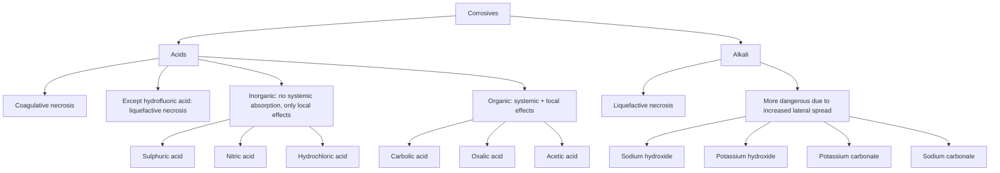

### Sulphuric Acid

- Carbonization: black necrotic tongue, stomach mucosa, black charred skin.
- Hygroscopic action: chalky white teeth.

### Nitric Acid

- Nitric acid + tissue → picric acid (xanthoproteic reaction).
- Yellow discoloration of skin, teeth, mucosa.

### Carbolic Acid / Phenol

- Absorbed by all routes.
- Disinfectant: delay in putrefaction.
- Ingestion → leathery/buff-white stomach mucosa.
- Liver metabolises → pyrocatechol → hydroquinone.
- CNS depression, constricted pupil.
- Urine: carboluria (olive green).
- Black tissue deposits: ochronosis.

### Oxalic Acid

- Acid of sugar.
- Seen in ink/stain remover.
- Oxalic acid + calcium in blood → hypocalcemia → tetany.
- Calcium oxalate crystals.
- Oxaluria (casts in urine).
- Dumbbell/postal-envelope shaped casts.

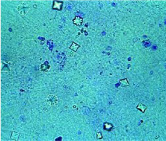

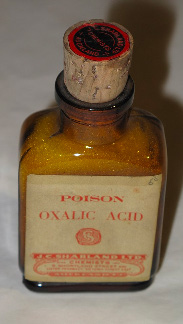

## Metallic Irritants

- Most common acute heavy metal poisoning: **arsenic**.
- Most common chronic heavy metal poisoning: **lead**.

### Lead Poisoning Route

- Children: oral.
- Adults: occupational inhalation.

### Arsenic

- Metalloid.
- Most toxic:
  - Form: arsine (gas).
  - Salt: arsenic trioxide (colourless, odourless, tasteless, water soluble).

#### Types of Poisoning

**Acute:**

- Gastroenteritis (resembles cholera).
- Throat pain → vomiting → purging.
- Red velvety stomach mucosa.

**Chronic:**

- Arsenicosis.
- Hydroarsenicism.
- Aldrich-Mees lines.
- Alopecia.
- Raindrop pigmentation.
- Skin eruption: hyperkeratosis in palms & soles.
- Neuropathy:
  - Symmetrical.
  - Peripheral.
  - Sensorimotor polyneuropathy.
  - Resembles Guillain–Barré syndrome.
- Ischemia of periphery → gangrene (black foot disease).
- Carcinogenic.
- Pancytopenia: bone marrow suppression.

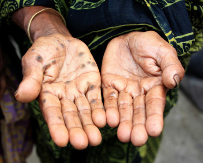

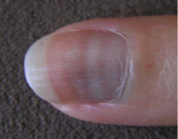

### Samples for Arsenic

- Acute poisoning: urine (reliable) > blood.
- Chronic poisoning: bone, nail, hair.
- Can be detected in exhumed bodies, cremated remains, decomposed bodies.

### Tests for Arsenic

- March test.
- Reinsch test.
- Neutron activation analysis (NAA).
- Atomic absorption spectrometry (AAS).

**Note:** Poison can be detected in decomposed bodies even without consumption of alcohol.

### Mercury

**Occupations:** Hatters, glassblowers.

#### Types

- **Elemental:**
  - Not orally absorbed.
  - Vapour: toxic.
- **Compound:**
  - Toxicity: organic (methyl Hg) > inorganic (mercuric > mercurous salts).

#### Chronic Toxicity / Hydrargyrism

Mnemonic **METAL**:

- **M**inamata disease: fish consumption (methyl Hg).
- **E**rethism: neuropsychiatric (mad hatter syndrome).
- **T**remors: coarse intentional tremors (glassblowers/hatters shakes).
- **A**crodynia: pink disease (calomel / swift fever disease).
- **L**entis: anterior lens capsule deposit.

Acrodynia features:

- Pink, peeling.
- Painful puffy peripheries.
- Pruritic.
- Usually paediatric.

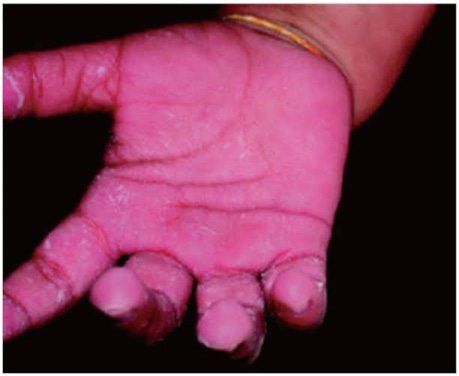

### Lead

#### Toxicity

**Organic:**

- Tetraethyl lead → can cross BBB → encephalopathy.

**Inorganic:**

- Lead tetroxide (most toxic).
- Lead sulphide (least toxic).
- Lead carbonate (paints).

## Chronic Lead Poisoning / Saturnism / Plumbism

Mnemonic **ABCDEFG**:

- **A**nemia:
  - ↓ heme synthesis → microcytic hypochromic anemia.
  - ↓ ALA dehydratase.
  - ↓ coproporphyrinogen oxidase.
  - ↓ ferrochelatase.
- **B**asophilic stippling of RBCs: ↓5-pyrimidine nucleotidase.
- **B**urtonian lines: bluish deposition in gums of carious teeth.
- **B**one line (calcium deposition): metaphyseal dense opacity.
- **C**olics, constipation: painter’s colic / saturnine colic / dry belly ache.
- **C**abot ring: inclusion body.
- **D**rop: wrist drop, foot drop.
- **E**ncephalopathy.
- **F**acial pallor: most consistent finding.
- **G**out: saturnine gout.

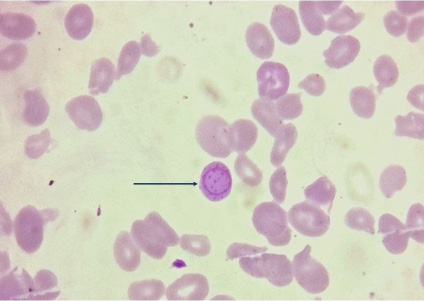

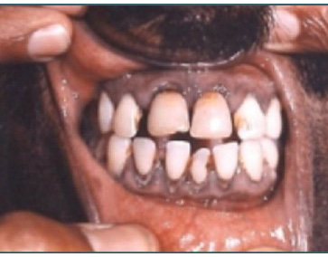

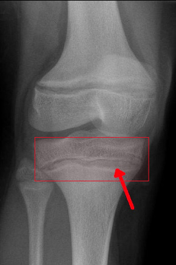

### Investigations

**Blood:**

- Lead level.
- Free erythrocyte protoporphyrin (FEP).
- Zinc protoporphyrin.

**Urine:**

- Lead level.
- ALA level ↑↑ (screening for workers).
- Urine porphyrin level.

**Bluish deposition in gums is also seen in:** mnemonic **Blue SIM Card**

- Bismuth.
- Silver.
- Iron.
- Mercury.
- Copper.

## Cadmium

### Itai-itai / Ouch-ouch Disease

- Yellow ring in teeth.
- Cadmium replaces Ca²⁺ from bones → bone deformities.
- Pathological fractures.
- ↑↑ bone pain.

## Thallium

Mnemonic **All Nerves Burn**:

- Alopecia with madarosis.
- Aldrich-Mees line.
- Sensorimotor polyneuropathy.
- Behavioural changes.
- Seen only in thallium poisoning (not in arsenic).

**Treatment:** Prussian blue.

## Non-Metallic Irritants

### White Phosphorus

- Toxic.
- Luminous.
- Emits fumes: spontaneous combustion.
- Deep burns on contact; treatment in source: topical CuSO₄.

**Red phosphorus:** non-toxic.

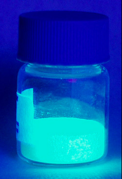

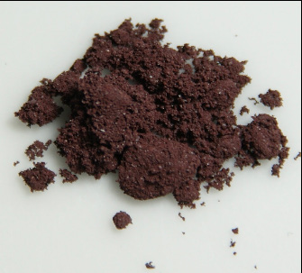

### Acute Poisoning

- **Stage 1: Gastroenteritis**
  - Vomitus & stool luminescent.
  - Smoky stool syndrome.
- **Stage 2: Asymptomatic.**
- **Stage 3: Hepatic failure / multiorgan failure.**

### Chronic Poisoning

- Phossy jaw / glass jaw / Lucifer jaw.
- Occupational inhalational disease.
- Osteomyelitis / osteonecrosis of jaw:
  - Painful.
  - Swelling.
  - Multiple discharging sinuses.
  - Garlicky odor.
- Source note: patient discharged & dies later → medical negligence.

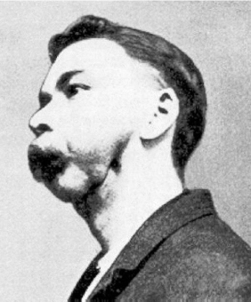

### Aluminium Phosphide

- Rat poison (Celphos).
- Available as tablets → release phosphine gas on contact with HCl in stomach.
- Investigations:
  - Silver nitrate breath test.
  - Silver nitrate test.
- Treatment:
  - No specific antidote.
  - Supportive management.
  - MgSO₄ for ↓Mg.

## Plant Toxins

### Toxic Seeds

| Plant / seed | Active principle | Features |
|---|---|---|
| *Ricinus communis* (castor / arandi) | Ricin (↓protein synthesis) | Crushed seeds: oil not toxic; residue toxic; bloody diarrhea |
| *Abrus precatorius* (gunchi / rati / rosary / crab’s eye) | Abrin, abralin, abrine, abric acid | Powdered seeds: sui needles; ideal cattle poison (resembles viperine bite) |
| *Semecarpus anacardium* (bhilawa / marking nut / dhobi’s nut) | Semecarpol, bhilawanol | Crushed seed: black juice; used for malingering: artificial bruise / blisters |
| *Croton tiglium* (Jamal gota) | Crotin, crotonoside, crotonic acid | Crushed seed: oil & residue both toxic |
| *Calotropis* (Madar / Akdo) | Calotropin, calotoxin, calactin | All parts toxic |
| *Capsicum annuum* | Capsicin, capsaicin | Hunan’s hand syndrome: contact dermatitis (occupational) |

## Somniferous Poisons

### Papaver somniferum (Opium)

- AKA afim / madak.
- Milky exudate.
- Capsule → crude opium → opioids (morphine, codeine).
- Seeds are non-toxic.

### Heroin

- AKA smack / junk / brown sugar / tar.
- Constituent: diacetyl morphine.
- Semisynthetic derivative of morphine.
- Highly addictive.
- Routes of abuse:
  - Inhaling vapour: chasing the dragon.
  - Inject into vein: main lining.
  - Inject to skin: skin popping.

### Deliriants

Mnemonic **CCD**:

- Cocaine.
- Cannabis.
- Datura.

### Datura

- Muttering delirium.
- Active principles:
  - Hyoscine.
  - Hyoscyamine.
  - Atropine.
- Anticholinergic symptoms:
  - Dilated pupil.
  - Dried secretions.
  - Delirium.
- Roots & seeds most toxic.
- Stupefying agents:
  - Railway poison.
  - Roadside poison.
- Antidote: physostigmine.

## Cannabis

- AKA grass / rope / hash / joint / weed / marijuana.
- Active principle: tetrahydrocannabinol (THC).

### Chronic Cannabis Abuse

Mnemonic **AIR**:

- **A**motivational syndrome.
- **I**nsanity: hashish/hemp insanity.
- **R**un amok: homicidal impulse.
- Koro phenomenon / genitalia retraction syndrome (delusion).
- Flashback phenomenon: effects without drug intake (also seen with LSD).

| Part of plant | Preparation | Active principal |
|---|---|---:|
| Dried leaves | Bhang | <15% |
| Dried flower (female plant) | Ganja (joint/reefer) | 15–25% |
| Dried resin | Charas/hashish | 25–40% |
| Resin | Hash oil | 60–70% |

**Note:** Not criminally liable: 22 BNS.

## Cocaine

- AKA coke / snow / white lady / she / crack.
- Most common route of abuse: snorting.
- **Speedball:** cocaine (CNS stimulant) + heroin (CNS depressant).
- Acute poisoning: body packer syndrome.

### Body Packer Syndrome

- Plain X-ray abdomen / CT abdomen.
- Packs intact/asymptomatic → whole bowel irrigation with polyethylene glycol (PEG).
- Packs ruptured → acute poisoning (antidote: amyl nitrite).
- Intestinal obstruction → surgical management.

### Chronic Cocaine Abuse

- AKA cocainism / cocainomania / cocainophagia.
- Sympathomimetic actions:
  - ↑HR.
  - Chest pain / arrhythmia.
  - Extreme agitation.
  - Delirium / seizures / stroke.
  - Hyperthermia (crack fever).
  - Vasoconstriction.
  - ↑ sweating.
  - Dilated pupils.
  - Peripheral gangrene.
  - ↑ BP.
- Peripheral gangrene.
- Black staining of tongue/teeth.
- Septal perforation if snorting.
- Tactile hallucinations: cocaine bugs / Magnan syndrome / formication.

**Note:** 123 BNS: causing hurt using poison with the intent to commit crime.

## Inebriants

**Order of toxicity:** Isopropyl alcohol > methanol > ethanol.

### Ethanol

- CNS depressant.
- Alcoholic gaze nystagmus: 80–100 mg% blood alcohol concentration (BAC).

### Stages of Alcohol Effect

1. Stage of excitement.
2. Stage of motor incoordination (↑ incidence of RTA).
3. Stage of coma.

### Commercial Preparations and Alcohol Content

- Beer: 6–10%.
- Wine.
- Whiskey/brandy: 42–45%.
- Rum: 50%.
- Vodka: 50–60%.

### Absorption

- 20% stomach.
- 80% small intestine.

**Increased absorption:**

- Empty stomach.
- Warm water.
- Carbonated drinks.

**Decreased absorption:**

- High-protein meal.
- Cold water/ice.
- Full stomach.

### Distribution

- Effect of alcohol: females (smaller water compartment) > males.
- Levels in different compartments:
  - Blood : urine = 1:1.3.
  - Blood : CSF = 1:1.1.
  - Blood : vitreous = 1:1.2.
  - Blood : alveolar air = 1:2100 (used in breath analyzers).

### Issue of Drunkenness Certificate

- Legal limit: 30 mg% BAC.
- >30 mg% → drunk & driving [P], Section 185 of Motor Vehicle Act.

| Smell of alcohol | Motor coordination | Opinion |
|---|---|---|
| − | Normal | Not consumed alcohol |
| + | Normal | Consumed alcohol but no influence |
| + | Abnormal | Consumed alcohol and under influence |

### Alcohol Withdrawal Syndromes

| Time since stoppage | Syndrome | Symptoms |
|---|---|---|
| 6–12 h | Abstinence syndrome | Tremors (most common) |
| 12–24 h | Hallucinosis | — |
| 24–48 h | Rum fits | — |
| 2–5 days | Delirium tremens | Clouding of consciousness; altered sensorium; hallucinations |

**Note:** If crime committed during delirium tremens: not liable under 22 BNS.

## Complications of Alcohol

Thiamine deficiency:

### Korsakoff’s Syndrome

- Memory impairment.
- Confabulation.

### Wernicke’s Encephalopathy

- Global confusion.
- Ophthalmoplegia.
- Ataxia.

Mnemonic: **GOA**.

## Methanol

### Sources

- Illicit liquor.
- Mass poisoning: hooch tragedy.

### Symptoms

- Blurring of vision.
- Blindness.
- High anion gap metabolic acidosis (HAGMA).

### Metabolism

## Ethylene Glycol

- Antifreeze solution.
- Ethylene glycol → glycolic acid → oxalic acid → hypocalcemia.
- Urine casts (oxaluria).

## Spinal and Cardiac Poisons

### Spinal Poisons

- *Strychnos nux vomica*.
- Gelsemium.

### Strychnos nux vomica

- AKA Kuchila / dog’s button.
- Even 1 crushed seed is fatal.
- Active principles:
  - Strychnine (most potent).
  - Brucine.
  - Loganin.
- Acts on anterior horn cell → muscle convulsions (resembles tetanus) due to ↓ glycine.

#### Presentation

- Risus sardonicus.
- **Opisthotonus (most common):** backward hyperextended spine (A).
- **Emprosthotonus:** forward hyperflexed spine (B).
- **Pleurosthotonus:** lateral flexion of spine (C).

### Cardiac Poisons

Mnemonic **Car DONA**:

- Digitalis.
- Oleander.
- Nicotine.
- Aconite.

### Aconite

- AKA blue rocket / Mita zaher / Devil’s helmet / Monk’s hood.
- Active principle: aconitine.
- All parts toxic; most toxic: root.
- Perioral paraesthesia.
- Cardiac arrhythmias.
- Hippus: alternating constriction & dilatation of pupil.

### Nerium odorum / Pink Oleander

Active principles:

- Neriodorin.
- Karabin.
- Folinerin.
- Roeganin.

Autopsy:

- Rigor mortis early onset.
- Post-mortem caloricity.
- Delay in putrefaction.
- Abnormal posture.
- Risus sardonicus.

### Cerbera thevetia / Yellow Oleander

Active principles:

- Cerberin.
- Nerifolin.
- Thevetin.
- Thevetoxin.
- Peruvoside.
- Ruvoside.

### Cerbera odollam

- Confused with mango → accidental poisoning.
- Active principles:
  - Cerberin.
  - Cerberoside.
  - Odollin.
  - Odollotoxin.

### Digitalis / Foxglove

- Treatment: Digibind.

## Asphyxiants

### Classification

| Type | Examples |
|---|---|
| Simple (inert) | CO₂, nitrogen, noble gases |
| Chemical | CO, cyanide, H₂S (sewer gas) |
| Irritants | Ammonia, methyl isocyanate (most common) |

## Carbon Monoxide

- Odourless.
- Colourless.
- Lighter than air.

### Sources

- Gas heaters (accidental poisoning).
- Fire inside closed space.
- Garage death (suicide by running vehicle in closed garage).
- Coal grills at home in a closed space.

### Mechanism of Action

Carbon monoxide has **210 times more affinity for hemoglobin than O₂**.

### Clinical Features by CarboxyHb Level

| CarboxyHb | Symptoms |
|---|---|
| 0–10% | No symptoms |
| 10–20% | Mild headache |
| 20–30% | Throbbing headache; emotional instability |
| 40–50% | ↑ confusion; ataxia; motor incoordination; mimics drunkenness; cherry-red skin colour |
| 50–70% | Coma |
| >80% | Rapid death from respiratory arrest |

### Postmortem Findings

- Cherry-red hypostasis.
- Cutaneous blisters.
- Bilateral symmetrical necrosis of lenticular nucleus.

### Treatment

- High-flow O₂.
- Hyperbaric O₂.

**Note:** Cutaneous blisters at autopsy are seen in:

- CO poisoning.
- Barbiturate poisoning.

## Cyanide and H₂S

| Feature | Cyanide | H₂S |
|---|---|---|
| Odour | Bitter almond | Rotten egg |
| Pathology | Cytochrome oxidase inhibition → histotoxic anoxia; ↑ lactic acid; lactic acidosis | Similar mechanism of histotoxic anoxia |
| Treatment | Hydroxocobalamin; Eli Lilly’s kit; high-flow O₂; nitrites (induces MetHb) | — |
| Colour of hypostasis | Brick (bright) red | Bluish green |

# Snake Venom

## Terminology

- **Ophiology:** Study of snakes.
- **Ophitoxemia:** Envenomation (by snake venom).

## Venomous vs Non-Venomous Snake

| Feature | Venomous | Non-venomous |
|---|---|---|
| Head scales | Usually small (except cobra & krait) | Usually large |
| Belly scales | Large & cover entire breadth of belly | Small & never cover entire breadth |
| Tail | Compressed | Not markedly compressed |
| Bite | 2 fang marks | Small teeth marks in a row |
| Lives | Nocturnal | Diurnal |

## Large-Scaled Venomous Snakes

- Cobra: 3rd supralabial scale largest.
- Krait: 4th infralabial scale largest.

## Venomous Snakes

| Family / type | Main venom effect | Clinical pattern |
|---|---|---|
| Elapidae | Neurotoxic | Neuromuscular paralysis |
| Viperidae | Haemotoxic | Disseminated intravascular coagulation |
| Hydrophidae | Myotoxic | Myonecrosis / renal failure; hyperkalemia (tall T wave) |

### Important Species

- *Naja naja*: common cobra.
- *Ophiophagus hannah*: king cobra (longest).
- *Daboia russeli*: Russell’s viper; diamond-shaped marks, one on top and two on the sides.
- *Echis carinatus*: saw-scaled viper.
- *Bungarus caeruleus* (bungarotoxin): common krait.

## Snake Bite

### Clinical Presentation

- Fear: most common.

### Tests

- **Single breath count test** (bedside test; done in elapid bite): progressive decline in numbers counted per breath → impending respiratory failure.
- **20-min whole-blood clotting test (Viperidae):**
  - Collect 2 mL blood in a test tube.
  - Normal: clot within 20 min.
  - Viper bite: no clot even after 20 min.

### Venomous Snake Bite

| Type | Features |
|---|---|
| Ophitoxemia | Envenomation |
| Neurotoxic signs (elapid) | Ptosis (early), descending paralysis, respiratory failure (cause of death) |
| Hemotoxic signs (viper) | DIC, spontaneous bleeding, shock, renal failure |
| Local signs (viper > elapid) | Pain, swelling, bleeding, necrosis, compartment syndrome, gangrene |

### Management of Snake Bite

#### First Aid — Mnemonic RIGHT

- Never use ligation/incision/tourniquet.

#### At Hospital

- Observation.
- Anti-snake venom:
  - Only if ophitoxemia.
  - IV 8–10 vials.
  - Effective for “Big 4”:
    - Common cobra.
    - Krait.
    - Russell’s viper.
    - Saw-scaled viper.
- IV neostigmine + atropine → reversal of neuroparalysis (cobra bite).

## Scorpion and Spanish Fly

### Scorpion

- Indian red scorpion & black scorpion.
- Venom similar to snake venom.
- ↓ chance of death due to ↓ poison injected.
- Bite: only 1 punctured mark.

### Features

**Pain:** most common clinical feature.

#### Autonomic Storm

**Cholinergic:**

- Sweating, salivation.
- Priapism.
- Hypotension.
- Cold extremities.

**Adrenergic:**

- Hypertension.
- Tachycardia → myocardial dysfunction.
- Pulmonary edema.

### Treatment

- Prazosin.
- Anti-scorpion venom.

### Spanish Fly (Cantharides)

- Powdered form: aphrodisiac.
- Active principle: cantharidin.
- Skin: locally irritant:
  - Redness.
  - Burning sensation.
  - Blisters.
- Nephrotoxicity.

### On Oral Consumption

- Haematemesis.
- Burning sensation & pain throughout GIT.
- Dull pain in loin.
- Hematuria.
- Priapism in males.

## Organophosphorous (OP) Poisoning

- Irreversible AChE inhibition.

### Investigations

- RBC cholinesterase (specific).
- Pseudocholinesterase (sensitive & easy to perform).

### Cholinergic Syndrome (<1 day): Acute Poisoning

#### Muscarinic — Treatment: Atropine

Mnemonic **DUMBELS**:

- Diarrhea.
- Urination.
- Miosis.
- Bradycardia.
- Bronchorrhea.
- Emesis.
- Lacrimation (red tears).
- Salivation.

#### Nicotinic — Treatment: Oximes

- Irritability.
- Confusion.
- Convulsion.
- Muscle paralysis.

### Intermediate Syndrome (1–4 days)

- Proximal muscle weakness.
- Cranial nerve palsy.

### Delayed Syndrome (1–4 weeks)

- Distal neuropathies.

# Forensic Psychiatry and Legal Sections

## Application of Psychiatry in Administration of Justice

## Symptoms of Psychiatric Disorders

### Delusion

| Type | Characteristics |
|---|---|
| Grandeur | Imagination of being rich & powerful |
| Persecution / paranoid | Belief that someone is about to cause harm |
| Reference | Belief that everyone is referring to them |
| Influence / control | Belief that one’s actions and thoughts are influenced/controlled by some external power |
| Infidelity / Othello syndrome | Belief that spouse is not loyal |
| Nihilistic | Does not believe in one’s own existence or world; commonly seen in depression |
| Hypochondriacal | Belief of having illness; medically fit; frequent visits to hospital |
| Erotomania / De Clerambault syndrome | Females > males; person thinks a person of superior status is in love with them |
| Capgras syndrome | Belief that a double has replaced a close member |
| Fregoli’s syndrome | Belief that a familiar person disguises as different people |

### Other Symptoms

| Symptom | Features | Types / Examples |
|---|---|---|
| Hallucination | False sense of perception; no external stimuli | Visual, auditory, gustatory, tactile: Magnan’s syndrome (cocaine abuse) |
| Illusion | False interpretation of stimuli | — |
| Impulse | Sudden and irresistible force; compels person to do a conscious act; no motive/forethought | Kleptomania, pyromania, trichotillomania, dipsomania, oniomania |
| Phobia | Excessive/irrational fear of a particular object/situation | Acrophobia—height; agoraphobia—crowd; claustrophobia—closed spaces; nyctophobia—darkness; mysophobia—germs |

## Lucid Interval

**Period of sanity between episodes of mental illness.**

## Civil and Criminal Responsibilities of Insane

### Civil Responsibilities

#### Testamentary Capacity

- Capacity of a person to make a valid will.
- Holographic will: will handwritten by self.

### Criminal Responsibilities

- Law presumes everyone is sane.
- Onus of proof of mental illness: on accused.
- Complete psychiatric evaluation to be done: **367 BNSS**.
- Procedure to deal with accused persons of unsound mind: **368 and 369 BNSS**.

An accused person with unsound mind is not criminally responsible if, at the time of committing an act:

| Rule / doctrine | Test |
|---|---|
| American Law Institute (ALI) Act | Lacks adequate capacity to appreciate the criminality of act |
| Irresistible impulse act (New Hampshire doctrine) | In spite of knowing the nature of act, incapable of restraining himself |
| Section 22 BNS | Incapable of knowing nature of the act **OR** did not know it is wrong or contrary to law |
| Curren’s rule | Did not have capacity to regulate conduct to requirements of law |
| Mc Naughten’s rule / right-wrong test / legal test | Unaware of nature & quality of act |
| Durham’s rule | Act is a product of mental disease/defect |

# BNS (Bharatiya Nyaya Sanhita)

## BNS Explanations

| Topic | Section | Explanation |
|---|---|---|
| Injury | 2(14) [D] | Any harm done to body, mind, property, reputation |
| Criminal responsibility | 20 | Crime by person <7 years: not liable |
| Criminal responsibility | 21 | Crime by person 7–12 years: punishable if mentally mature |
| Criminal responsibility | 22 | Crime by insane person: not liable |
| Criminal responsibility | 23 | Crime under involuntary drunkenness: not liable |
| Criminal responsibility | 24 | Crime under voluntary drunkenness: liable |
| Consent | 30 | Emergency life-saving situations: consent not mandatory |
| Rape victim | 200 [P] | Non-treatment of victims of rape/vitriolage |
| Rape victim | 72 [P] | Prohibits disclosure of identity of rape victim |
| Rape victim | 184 BNSS | Medical examination of rape victim |
| Rape victim | 397 BNSS | Treatment of victim of rape/POCSO/vitriolage |
| Male offences | 74 [P] | Indecent assault (act outraging modesty of a woman) |
| Male offences | 75 [D & P] | Sexual harassment of a woman |
| Male offences | 76 [D & P] | Using force to disrobe a woman |
| Male offences | 77 [D & P] | Voyeurism |
| Male offences | 78 [D & P] | Stalking |
| Male offences | 80 [P] | Dowry death (within 7 years of marriage) |
| Homicide | 100 [D] | Culpable homicide |
| Homicide | 101 [D] | Culpable homicide: amounting to murder / not amounting to murder |
| Homicide | 103 [P] | Murder |
| Homicide | 106(1) [P] | Patient dies due to medical negligence |
| Homicide | 108 [P] | Abetment of suicide |
| Evidence preservation | 238 [P] | Intentional disappearance of evidence |
| Hurt | 114 [D] | Hurt |
| Hurt | 115 [P] | Voluntarily causing hurt |
| Hurt | 116 [D] | Grievous hurt |
| Hurt | 117 [P] | Voluntarily causing grievous hurt |
| Hurt | 118(1) [P] | Voluntarily causing hurt with dangerous weapon/means |
| Hurt | 118(2) [P] | Voluntarily causing grievous hurt with dangerous weapon/means |
| Hurt | 124 [P] | Vitriolage (acid attack) |
| Medical negligence | 271 [P] | Negligent act resulting in spread of fatal infection |
| Medical negligence | 272 [P] | Malignant act resulting in spread of fatal infection (intentional) |

**Key:** [P] = punishment; [D] = definition.

## Grievous Hurt

1. Emasculation.
2. Sight of either eye — permanent privation.
3. Hearing of either ear — permanent privation.
4. Member or joint.
5. Permanent impairing of power of any member/joint.
6. Permanent disfiguration of head/face.
7. Fracture/dislocation of bone/teeth.
8. Hurt which:
   - Endangers life.
   - Causes severe bodily pain or inability to follow ordinary pursuits for 15 days.

# Transplantation of Human Organs Act 1994 (2014)

- Regulates removal, storage & transplantation of human organs for therapeutic purposes.
- Done at registered hospitals (exception: eye donation).

## Authorization for Organ Harvesting

### Types of Organ Harvesting

- Live donation.
- Cadaveric donation (after brainstem death).

## Brainstem Death

### Declaration by Medical Board

- Treating doctor.
- Hospital in-charge (RMP).
- Independent RMP specialist.
- Neurologist/neurosurgeon.
  - If not available: anaesthetist/intensivist.
- **Transplant surgeon:** never a part of the team.

### Criteria

- Test within 6 h.
- Rule out reversible causes:
  - Hypothermia.
  - Electrolyte imbalance.
  - Poisoning.
- Confirm irreversible coma.
- Absence of cranial reflexes.
- Apnea test.

## Violation

Doctor involved → penal erasure (by state medical council).

# Protection of Children from Sexual Offences (POCSO) Act 2012

- Child <18 years, irrespective of gender.

## Types of Offences

| Penetrative sexual assault (PSA) | Sexual assault (SA) | Sexual harassment | Pornography |
|---|---|---|---|
| Penetration of penis, any object or applying mouth to vagina, mouth, urethra or anus of a child | With sexual intent: touching private parts; physical contact without penetration; hormones given to children for early sexual maturity | With sexual intent: utter any word/sound; make gestures; exhibit any object; expose body part; make child exhibit body; showing pornography | Use of child for pornographic purposes |

## Aggravated Act — Mnemonic TRAIT

Aggravated act if PSA/SA is done by:

- **T**rusted person (parent/guardian/police officer/staff in educational institute).
- **R**epeat offender.
- **A**ge <12 years of victim.
- **I**nsane victim.
- **T**wo or more people (gang).

## Legal Responsibilities

- **Police intimation:** mandatory; failure to report is punishable.
- **Medical examination:** 184 BNSS.
  - In presence of parent/guardian/any person of trust.
  - If girl child, only female doctor can examine.
