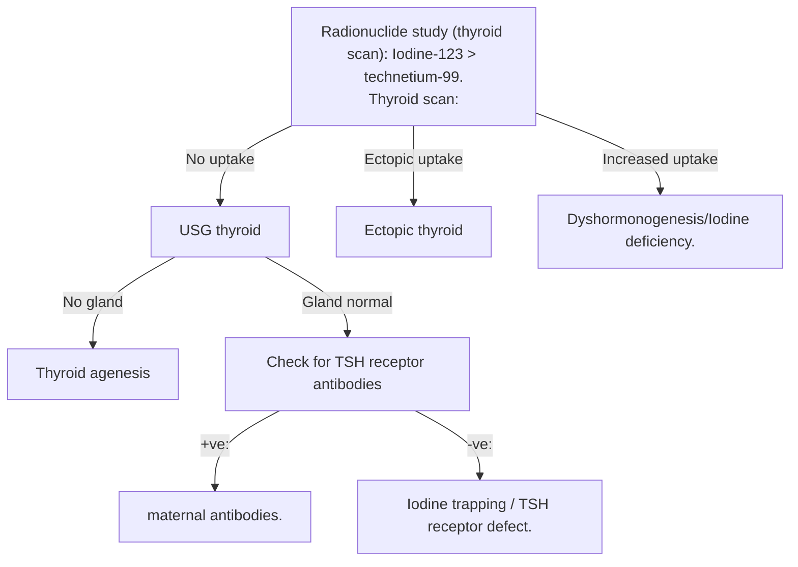

# Growth Hormone Deficiency and Hypothyroidism

## Growth Hormone Deficiency

1. **Isolated:** Only GH deficient.
2. **Hypopituitarism:** GH deficient along with other pituitary hormones.

### Causes
<mark style="background:#d3f8b6">- Overall m/c cause: Idiopathic GH deficiency.</mark>
- m/c etiology: ==<mark style="background:#ff4d4f">Idiopathic</mark>
3. **<mark style="background:#ff4d4f">Congenital</mark>:**
   - → Developmental:
     - Septo-optic dysplasia.
     - Ectopic pituitary.
   - → Genetic mutations:
     - GH/GHRH (Growth hormone releasing hormone) genes.
3. **<mark style="background:#ff4d4f">Acquired</mark>:** *anything that damaged pituitary*
   - Trauma
   - Tumors: Craniopharyngioma, germinoma
   - Infiltration of pituitary: Histiocytosis, sarcoidosis.
   - Irradiation: Radiation induced pituitary necrosis.

### Clinical Features
- Child appears normal at birth as *GH has role only after birth*.
- ==Presentation starts in infancy==.
- <mark style="background: #FF5582A6;">Proportionate short stature </mark>(==upper and lower segment ratio normal for age==), <mark style="background:#fdbfff">bone age decreased, delayed dentition.</mark>
- **Appearance:** 
	- Doll-like facies (fullness of cheeks), - *also in [von gierke disease*](<Glycogen Storage Disease>)
	- overweight/obese (Low GH → No lipolysis → Fat deposition in cheeks and body).

#### If GH Is Deficient as a Part of Hypopituitarism
- micropenis: Low gonadotropins
- Hypoglycemia: Low ACTH
- Congenital hyperbilirubinemia jaundice
	- Hypopituitarism → ↓ TSH + ↓ ACTH → hypothyroidism + cortisol deficiency → impaired bile flow → cholestasis → conjugated 
	- Thyroid Hormones are involved in metabolism, i.e., they are involved in increased translation into proteins and enzymes
	- Glucocorticoids increase the number of transport proteins on hepatocytes

### Investigations in GH Deficiency
1. **Screening test:**
	- IGF I levels (Insulin Like Growth Factor I).
	- IGF BP 3 (Binding protein) levels:
		- Less sensitive.
		- Preferred in children with malnutrition (IGF levels altered by nutritional aspects).

2. **Confirmatory test:**
	- Serum GH levels:
		- Unreliable if checked randomly, as GH is secreted in a pulsatile manner from Pituitary.
	- GH stimulatory test/GH provocative test:
		- Stimulate pituitary → GH released → Estimate.
		- Substance used for this test: Insulin, Arginine, Clonidine.
	- ***GH < 10 ng/mL: Confirmatory for GH deficiency.***

### Treatment of GH Deficiency
- Recombinant GH (rGH): Given as S/C injection.
- Given till child reaches desirable levels.

**Indications of rGH:**
- mnemonic: GTCS in Prader Willi syndrome
	- GH deficiency.
	- Turner's Syndrome.
	- CKD associated short stature.
	- SGA (> 2 years); SHOX gene mutations.
	- Idiopathic short stature.
	- Noonan syndrome.
	- Prader Willi syndrome.

### Laron's Dwarfism
- Defect: GH receptor defect (resistance to GH action).
- Short stature.
- GH levels increased.
- Diagnosis: IGF levels decreased.
- Treatment: mecasermin (rIGF - IGF I replacement).

## Hypothyroidism

### Congenital Hypothyroidism
- Very common.
- In India, 4 in 1000 patients affected. Most common preventable cause of intellectual disability in children.

#### Etiology
1. **Anomaly in thyroid gland (thyroid dysgenesis):**
   - Ectopia of thyroid gland; m/c location of ectopic thyroid: Lingual thyroid.
   - Aplasia of thyroid gland.
   - Hypoplasia of thyroid gland.
   - Sporadic in nature.
   - No associated goiter.
2. **Thyroid dyshormonogenesis:**
   - m/c defective step: Defect in organification (Thyroid peroxidase deficiency).
   - Inherited condition: Autosomal Recessive.
   - Diffuse goiter seen. Soft in consistency.
3. **Iodine deficiency (Endemic goiter):**
   - Uncommon in India now.
   - Underdeveloped countries: Still seen.
4. **Maternal autoantibodies (TSH receptor blocking antibodies):**
   - Transplacental transfer.
   - Transient condition.
5. **Pendred syndrome:**
   - Autosomal recessive.
   - ==Defect in chromosome 1 → **Pendrin gene** → $Cl^-$ transporter in kidney, $I^-$ transporter in Thyroid.==
   - ==Sensorineural hearing loss (Pendrin gene also in cochlea).==

[**READ ABOUT THYROID FUNCTION AND PENDRIN HERE**](<Pituitary hormones.pdf#page=6>)

#### Features of Congenital Hypothyroidism
- First week after birth → most babies asymptomatic (mother's thyroxine protection).
- After 1st week:
  - Decreased activity/lethargic.
  - Hypothermia/cold skin.
  - Delayed passage of meconium (constipation).
  - Coarse facies.
  - Hoarse cry.
  - Macroglossia.
  - Umbilical hernia.
  - Prolonged jaundice (> 2 weeks after birth).
  - *No goiter is seen.*

#### Investigations in Hypothyroidism
- TFT: Decreased T3, T4; Increased TSH.
- Newborn screening of hypothyroidism: Increased levels of TSH.
- ==TSH invariably high in all babies when done immediately after birth.==
- ==Therefore, done between days 2-5 (day 3).==
- **X-ray:**
  - Delayed osseous maturation → **Delayed bone age.**
  - Epiphyseal dysgenesis/stippled epiphysis (f**ragmented epiphysis**).
  - Skull: **Intra-sutural bones**/wormian bones.

#### Diagnostic Approach to Congenital Hypothyroidism
- Radionuclide study (thyroid scan): **Iodine-123 > technetium-99.**
- Thyroid scan:
  - No uptake → USG thyroid
    - No gland → Thyroid agenesis
    - Gland normal → Check for TSH receptor antibodies
      - +ve: maternal antibodies.
      - -ve: Iodine trapping / TSH receptor defect.
  - Ectopic uptake → Ectopic thyroid
  - Increased uptake → Dyshormonogenesis/Iodine deficiency.

#### Treatment of Hypothyroidism
- Oral thyroxine supplementation (T4):
  - Start at the earliest (prevent any brain abnormalities).
  - Starting dose: 10-15 micrograms/kg/day.
  - Response: Increase in T4 by 1 week, normalization of TSH by 1 month.
  - Adjust the dose.
  - Lifelong necessity.

#### Endemic Cretinism
- Severe iodine deficiency.
- Common in underdeveloped countries.
- It is of two types:
  1. **Neurological type:**
     - Most severe.
     - Very low IQ.
     - Goiter seen.
     - Spasticity.
     - Deaf mutism (sensorineural hearing loss).
  2. **Myxedematous type:**
     - Facial puffiness.
     - Periorbital puffiness.
     - Low IQ.
     - Loss of lateral 1/3rd of the eyebrow
     - ==Goiter not noted.==

### Acquired Hypothyroidism
- Autoimmune condition: Hashimoto's thyroiditis (anti-TPO antibodies).
- Age group: Adolescent females.
- Features:
  - <u>Decrease in growth velocity (short) - first sign.</u>
  - Constipation.
  - Dry skin.
  - Weight gain despite poor appetite.
  - Goiter: *Firm and nodular.*
  - Delayed puberty.
- Treatment:
  - Oral T4 supplementation: 10-15 micrograms/kg/day.