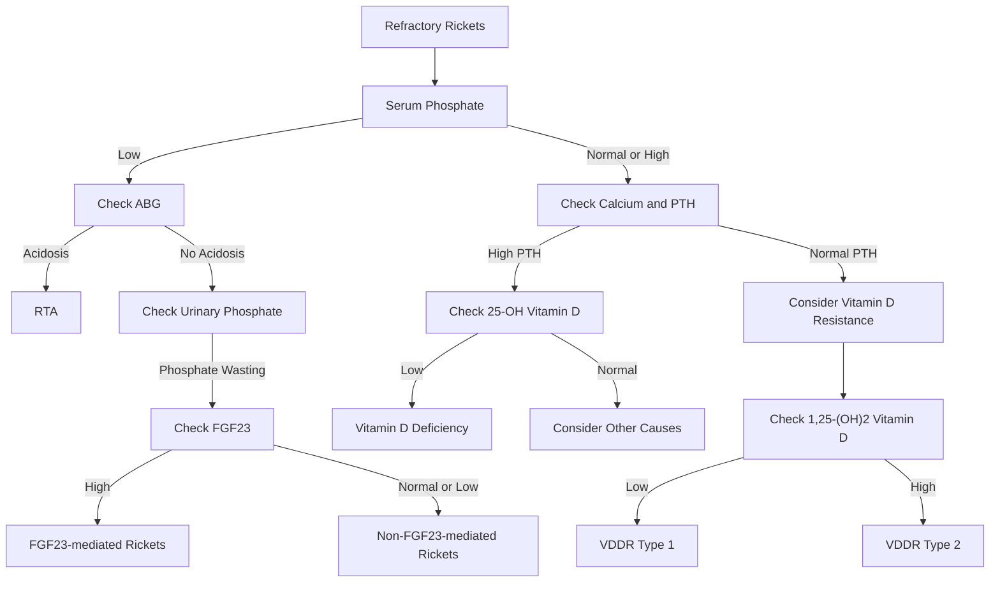

# Pediatrics Question Paper — Scanned PDF Transcription

**Source:** `DocScanner 19 Sept 2026 10-16 am.pdf`  
**Pages:** 12  
**Questions:** 1–72

> **Transcription note:** The searchable text layer was cross-checked against the scanned page images and OCR. Line breaks were normalized for Markdown readability, while the original question wording, terminology, abbreviations, option order, and visible spelling were retained as far as they can be read from the supplied scan. Obvious scanner/OCR artifacts that are not part of the printed question were omitted.
>
> **Image note:** The four visible standalone figures are preserved as cropped image assets at Questions 8, 24, 57, and 62. Question 46 refers to a chest X-ray, but the referenced X-ray image is not visibly present in the supplied 12-page scan, so it has not been reconstructed or invented.

---

## Page 1 — Questions 1–9

### 1. Growth — birth length

A child has a birth length of 50 cm. At what ages is the child's length expected to reach 1.5 times and 2 times their birth length, respectively?

- a. 1 year, 3 years
- b. 2 year, 4 years
- c. 3 years, 5 years
- d. 1 year, 4 years

#### Discussion ^Growth

`Incomplete Notes`

| Age      | Increase in weight | Weight | Increase in length | Length |
| -------- | ------------------ | ------ | ------------------ | ------ |
| Birth    | 1 x                | ~ 3 kg | 1 x                |        |
| 5 months | 2x                 | 6 kg   |                    |        |
| 1 year   | 3 x                | 9 kg   |                    |        |
| 2 year   | 4 x                | 12 kg  |                    |        |
| 3 year   | 5x                 | 15 kg  |                    |        |
| 5 year   | 6 x                | 18 kg  |                    |        |
| 7 year   | 7 x                | 21 kg  |                    |        |

- Weight doubles by 5 months of age triples by 1 year
- Height doubles by 4 years, triples by 12 year
- A child reaches healf the adult height by:
	- Adult height= ~170 cm
	- Half is 85 cm 
	- 2 years of age
##### Head Circumference
- at birth 33-35 cm **(Don't immediately measure within 1st 24-48 hours of life. Because there can be subcuttaneous edema which will give wrong reading**
- First 3 months: 2cm/moonth = 6 cm 
- 4-6 months 1 cm/month = 3 cm
- 7-12 months 0.5 cm/month = 3 cm
- This becomes 12 cm increase in 1st year of life

| age    | measure |
| ------ | ------- |
| Birth  | 34 cm   |
| 1 year | 46 cm   |
| 2 year | 48 cm   |
| 	Adult | 53 cm   |

- A child reaches 90 % of adult head cuircumference by 2 years
- **Macrocephaly:** +2 SD
- **Microcephaly:** - 3 SD (One of the few exceptions of normal distribution curve)
##### Various Growth Curves
![[Growth_curves.excalidraw]]
A) Brain
B) somatic
C) Gonads
D) Thymus and lymphoid tissue

### 2. Growth

Which of the following statements related to growth is incorrect?

- a. Maximum somatic growth occurs in first year of life.
- b. Gonadal growth peaks in puberty
- c. Head circumference and brain growth peaks in puberty.
- d. Gonadal and somatic growth occur concurrently in puberty.

### 3. Fine motor milestone

An infant is observed to transfer a toy from one hand to the other. What is the most likely age of this child?

- a. 4 months
- b. 7 months
- c. 9 months
- d. 12 months

#### Discussion ^Development
Milestones:
1. Gross motor
2. Fine Motor
3. Language
4. Social

##### Gross Motor
> refer marrow here for once

| time         | Milestones                                                                                                                           |
| ------------ | ------------------------------------------------------------------------------------------------------------------------------------ |
| 3 Months     | Head control                                                                                            |
| 5 months     | Trunk control, roll over                                                                                                             |
| 6 months     | *Sit with support*                                                                                      |
| 8 months     | Crawling: abdomen touching groung                                                                       |
| 9 months     | *Stand with support*                                                                                    |
| 10 months    | Cruising, Creeping: abdomen not on ground                                                               |
| 11-12 months | Stand without Support                                                                                                                |
| 12 months    | *Walk with Support*                                                                                     |
| 15 months    | Walk without support                                                                                                                 |
| 18 months    | Run                                                                                                                                  |
| 2 years      | (fly) Stair but 2 feet per step (==both up and down==)                                                                               |
| 3 years      | Downstair: 2 feet per step; But upstair 1 feet per step tricycle  *Remember: Going downstairs is difficult developmentally* |
| 4 years      | ==both up & down the stairs==                                                                                                        |
| 5 years      | Skips                                                                                                                                |
![[Gross_Motor.excalidraw]]

##### Fine motor

| Age       | Fine Motor                                                                                                                            |
| --------- | ------------------------------------------------------------------------------------------------------------------------------------- |
| 3 months  | - Bring hands into midline                                                                                                         |
| 4 months  | - Bidextrous Grasp (==but with overshooting==)                                                                                        |
| 5 months  | No overshooting, i.e., Visuomotor coordination                                                                                        |
| 6 months  | Unidextrous Ulnar Grasp                                                                                                               |
| 7 months  | Unidexrous **Radial** grasp: Transfer of Objects (6-8 months) - Child is trying ro compare object by placing it in different hands |
| 9 months  | Immature pincer grasp: Using sides of thumb and index finger and support of middle finger                                             |
| 12 months | Mature Pincer Grasp                                                                                                                   |
| 15 months | Scribbling                                                                                                                            |
##### Drawing Skill

| Age       | Milestone                          |
| --------- | ---------------------------------- |
| 2 yeaers  | Line                               |
| 3 years   | Circle (there is circle in 3)      |
| 4 years   | Cross (there is cross in letter 4) |
| 4.5 years | Square/retangle                    |
| 5 years   | Triangle                           |
| 6 years   | Diamond                            |
| 9 years   | cylinder                           |
| 11 years  | cube                               |

##### Cube tower

| Age       | # of cubes |
| --------- | ---------- |
| 15 months | 2          |
| 18 months | 3          |
| 2 years   | 6          |
| 3 years   | 9          |
Train: 4 2 years
Wiht chimney  2 years

Bridge: 3 cube: 4 years
Gate: 5 cube: 5 years

Steps using cube: 6 years

##### Dressing and Undressing
1. Undressing with help = 2 years
2. Dress with Help = 3 years
3. Unbutton Without help = 3 years
4. Button without help = 4 years
5. Fully Dress without help = 5 years

##### Social Milestones

| Age       | Social Milestone                                                                                                                                                                                                                                           |
| --------- | ---------------------------------------------------------------------------------------------------------------------------------------------------------------------------------------------------------------------------------------------------------- |
| 2 months  | Social Smile                                                                                                                                                                                                                                               |
| 3 months  | Mother Regard (Just like Hand Regard)                                                                                                                                                                                                                      |
| 6 months  | Mirror play (*mirror has 6 letter*)                                                                                                                                                                                                                        |
| 7 months  | Stranger Anxiety (*anxiety has 7 letters*)                                                                                                                                                                                                                 |
| 9 months  | bye bye wave,  **Object permanence:** Child will try to follow object if we take it away from its line of sight and will not cry because baby now knows that it exists. Earlier the child would have thought the object have disappeared from the world |
| 10 months | Peek-A-Boo (Child is able to enjoy it now because there is object permanence)                                                                                                                                                                              |
| 1 year    | Simple ball game                                                                                                                                                                                                                                           |
| 15 months | **2P:** 1. Point to Objects 2. Point to wet pants                                                                                                                                                                                                    |
| 18 monts  | **2D:** 1. Dry at day (bladder control) 2. Domestic Mimicry                                                                                                                                                                                          |
| 2 years   | Parallel Play (parallel has two lines)                                                                                                                                                                                                                     |
| 3 years   | - Cooperative play - Sharing of toys                                                                                                                                                                                                                    |
| 4 years   | Role Play, Group play (ghar ghar, chor police)                                                                                                                                                                                                             |
##### Language Milistones

| Age       | Milestones                                                                         |
| --------- | ---------------------------------------------------------------------------------- |
| 2 months  | Vocalisation                                                                       |
| 3 months  | Coo (*3 letter*)                                                                   |
| 4 months  | ha-ha (laugh out loud) *4 letter*                                               |
| 6 months  | Monosyllabic Babbling                                                              |
| 9 months  | Bisyllabic Babbling                                                                |
| 12 months | 1 word withmeaning (1-2)                                                           |
| 14 months | 4-6 words  jargon speech                                                        |
| 18 months | 8-10 words Picture naming                                                       |
| 24 months | 2 word sentences In which he will obviously use pronouns                        |
| 3 years   | - **Child knows 3 things:** Name, Age, Gender - Also asks questions             |
| 4 years   | Poem/Story telling Story telling means child will be able to use **past tense** |
| 5 years   | Future tense  Ask meaning of words 8-10 word sentences                       |
- Right to left differences: 4 years
- Handedness: 3 years
- Number of objects child can count
	- Age in years upto 5 yeras
- Number of colors: Age - 1

### 4. Gross motor milestone

At what age is a child expected to start climbing stairs with one foot per step (alternating feet) while going up?

- a. 18 months
- b. 2 years
- c. 3 years
- d. 4 years

[[#^Development]]

### 5. Gross motor milestone

A 9-month-old infant should be able to perform which of the following gross motor milestones?

- a. Walk independently
- b. Stand without support
- c. Stand with support
- d. Run

[[#Discussion Development]]
### 6. Fine motor milestone

Which fine motor milestone is characteristic of a 3-year-old child?

- a. Copies a square
- b. Copies a circle
- c. Copies a triangle
- d. Copies a diamond

[[#Discussion Development]]
### 7. Developmental milestone

A child can speak in sentences of 3 words, knows their name and gender, and can ride a tricycle. What is the most likely age?

- a. 2 years
- b. 3 years
- c. 4 years
- d. 5 years

[[#Discussion Development]]
### 8. Developmental milestone — image question

The following milestone is seen at what age?

- a. 6 Months
- b. 8 months
- c. 4 months
- d. 9 months

[[#Discussion Development]] (Sit with support)

### 9. Developmental regression / X-linked disorder

A 4-year-old girl is brought to the clinic by her mother with complaints of difficulty walking, repeated fallings, writhing hand movements and unable to form sentences with altered cognition. She had achieved her developmental milestones in the past followed by loss of the same.

Genetic testing revealed a mutation in a gene on the X chromosome. Which of the following is the mechanism of action of a new drug approved for this condition?

- a. SMN1 Analogue
- b. IGF-1 Analogue
- c. DMD1 Analogue
- d. Anti-oxidant

#### Discussion
##### Rett Syndrome
- Occurs due to mutation in gene *MECP2 on chromosome X* in Dominant fashion
- Seen exclusively in Girls
- Because if this occurs in boys, the boy will die at age of 1-2 months before even manifesting this disease
**Clinical Features:**
- Girl child
- Developmental Regression
- *Hands:* Writhing stereotypical Movements/Handwashing movement
- Intent eye gaze
**Treatment:**
- Trofenititde
	- It is a tripeptide
	- IGF-1 analogue
	- Decreases neuroinflammation

> [!note] Laron Dwarfism
> **IGF-1  analogue Mecasermin is used**
>- Used in Laron Dwarfism 
>- Defect in GH receptor
>- **Clinical Features**
>	- Short Stature unresponsive to GH
>	- Midline Defects

---

## Page 2 — Questions 10–16

### 10. MUAC

According to WHO criteria, a Mid-Upper Arm Circumference (MUAC) value of more than 12.5 cm in a child aged 6–59 months indicates:

- a. Normal nutritional status
- b. Moderate Acute Malnutrition (MAM)
- c. Severe Acute Malnutrition (SAM)
- d. Risk of obesity

#### Discussion^Growth-assessment
##### Assessment of Growth

| Age Dependent Parameters      | Age Independent Parameters                                               |
| ----------------------------- | ------------------------------------------------------------------------ |
| 1. Weight for age             | 1. Mid Upper arm Circumference                                           |
| 2. Height for Age             | 2. Skin Fold Thickness                                                   |
| 3. Head Circumference for Age | 3. Weight for Length (*And we don't look at age while looking at length) |
##### Height v/s Length
Height is standing and is for >2 years --> Stadiometer
Length is for < 2 year --> infantometer

##### MUAC
- measured between midpoint of acromian and olecranon 
- **>12.5 cm : Normal**
- 11.5 cm - 12.5 cm: Borderline | Moderate malnutrition/Acute
- < 11.5 cm: SAM

##### Skin fold thickness
- Herpenden Calliper
- Most common site: Triceps > Biceps
- > 10 mm: normal
- < 6 mm: Malnourished

### 11. MUAC measurement

When measuring MUAC, the measurement should be taken at the midpoint between which two anatomical landmarks?

- a. The olecranon process and the ulnar styloid
- b. The acromion process and the olecranon process
- c. The coracoid process and the medial epicondyle
- d. The clavicle and the antecubital fossa

### 12. Skinfold thickness

Which of the following is considered the most common site for measuring skinfold thickness to estimate total body fat in clinical settings?

- a. Subscapular
- b. Suprailiac
- c. Triceps
- d. Abdominal

### 13. Harpenden Calliper

The Harpenden Calliper is specifically designed to measure which of the following?

- a. Bone density
- b. Muscle mass index
- c. Skinfold thickness
- d. Head circumference

### 14. Anthropometry

A 4-year-old child has come to OPD with following parameters:

- W/A -2.7 SD
- H/A -2.9 SD
- W/L -1.2 SD

Child has

- a. Wasting
- b. Acute Malnutrition
- c. Chronic Malnutrition
- d. SAM

### 15. Severe acute malnutrition

A 3-year-old child comes to you with sever muscle wasting and loss of buccal pad of fat. MUAC is 10 cm and W/L is -3.2 SD. He is diagnosed as having SAM. Which of the following is not a common complication of SAM?

- a. Hypokalemia
- b. Hypomagnesemia
- c. Fever
- d. Hypoglycemia

### 16. Vitamin C deficiency / scurvy

An 18-month-old irritable infant is brought to the outpatient department with painful, swollen lower limbs, pseudoparalysis, and generalized petechiae. The child has been fed exclusively on boiled cow's milk since birth. A knee X-ray reveals a dense provisional zone of calcification and a prominent radiolucent zone immediately proximal to it. What is the primary underlying defect?

- a. Impaired mineralization of the osteoid matrix
- b. Defective hydroxylation of collagen
- c. Decreased osteoclast differentiation and activity
- d. Enhanced parathyroid hormone-mediated bone resorption
#### Explanation
C- Osteopetrosis
D- Hyperparathyroidism
#### Discussion^water-soluble-vitamins

| Vitamin                 | Funciton                                                                                                                                                                                                             | Deficiency                                                                                                                                                                                                                                                                                                                                                                                                          |
| ----------------------- | -------------------------------------------------------------------------------------------------------------------------------------------------------------------------------------------------------------------- | ------------------------------------------------------------------------------------------------------------------------------------------------------------------------------------------------------------------------------------------------------------------------------------------------------------------------------------------------------------------------------------------------------------------- |
| B1 (thiamine)           | Part of TCA cycle Enzymes: A- `Incomplete` T-  P-                                                                                                                                                        | `incomplete`                                                                                                                                                                                                                                                                                                                                                                                                        |
| B2 (Riboflavin)         | Component of FAD Enzymes: - Succinate Dehydrogenase - Glutathione Reductase                                                                                                                                 | Angular cheilitis Corneal neovascularisation                                                                                                                                                                                                                                                                                                                                                                     |
| B3 (Niacin)             | Component of NAD/NADH Niacin can be synthesised from Tryptophan  $60\ mg\ tryptophan \rightarrow 1\ mg\ Niacin$  Pathway: Kyneurinine                                                                       | **Pellagra:** 3D's  1. Dimentia 2. Dermatitis  -(only in sun exposed areas) - Caste's necklace is dermatitis on neck 3. Diarrhoea                                                                                                                                                                                                                                                                 |
| B5 pantothenic acid     | Component of CoA                                                                                                                                                                                                     | Alopecia Dermatitis: Burning Foot Syndrome Enteritis                                                                                                                                                                                                                                                                                                                                                          |
| B6 Pyridoxine           | Tryptophan --> Serotonin DOPA --> Dopamine  1. Decarboxylases 2. Synthesis of HEME 3. Glycogen Phosphorylase 4. ALT/AST                                                                            | 1. Peripheral neuropathy 2. Newborn: Refractory Neonatal Seizure 3. Sideroblastic anemia  - (ALA Synthase) - Prussian Blue                                                                                                                                                                                                                                                                              |
| B7 Vitamin H/ Biotin | Carboxylase                                                                                                                                                                                                          | Diet rich in RAW WHITE Eggs (which contains avidin) or taking Valproate  Alopecia +_ dermatitis                                                                                                                                                                                                                                                                                                            |
| Folate and Cobalamin    | DNA synthesis and maturation  Vitamin B12 also a cofactor for - Methyl Malonyl CoA Mutase  $Methyl\ Malonyl\ CoA\ \rightarrow Propionyl\ CoA$                                                         | Megaloblastic Anemia - Pancytopenia - Macrocytic anemia, $\uparrow$ MCV - Hypersegmented Neutrophils $\ge$ 6 lobes  Vitamin B12 deficiency - Methyl Malonic Aciduria - Methyl Malonyl is toxic to neurons - So CNS changes + Anemia - Knucle Hyperpigmentation  *Vitamin B12 is found only in animal Sources* Vegan mothers have severe deficiency of B12, Vitamin K, Vitamin D |
| Vitamin C               | Humans lack Enzyme Gulono Lactone oxidase which is responsible for synthesiszing it in body 1. Hydroxylation of Lysine/Pyridoxine in Collagen 2. Anti Oxidant of (iron absorption) 3. Synthsis of Carnitine | Deficiency: Scurvy: intake of BOILED Cow milk (which destroys natural vitamin c of cow milkk) 1. Bleeding Gums 2. Joints Painful: Psurdoparalysis 3. Skin Petechiae 4. Bleeding under periosteum: Scorbitic Rosary which is tender                                                                                                                                                                   |
|                         |                                                                                                                                                                                                                      |                                                                                                                                                                                                                                                                                                                                                                                                                     |
##### Pantothenic acid
###### Niacin Deficiency (Pellagra)
1. Hartnup Disease
	1. AR
	2. Defect in Neutral amino acid transporter in gut and kidney
2. Maize Rich Diet
	1. Tryptophan deficient
	2. High in Leucine
	3. Leucine inhibits Kynurinase pathway
3. Serotonin Syndrome
	1. Tryptophan is also used to make serotonin which have higher priority in body than niacin
	2. The available tryptophan is diverted to serotonin rather than niacin
4. Drugs
	1. Isoniazid inhibits viatmin b6

###### Excess Niacin
- Increased Uric acid / gout
- Flushing

##### Scurvy Xray
- Generalised Osteopenia
- Ring Epiphysis or Wimberger Ring Sign
- White Line of Frankel/Dense Zone of Provisional Calcification
- Just above that a zone of total Blackness: Scorbitic Zone/Trummerfield Zone

---

## Page 3 — Questions 17–22

### 17. Pellagra / Hartnup syndrome

A 6-year-old child is brought to the pediatrics clinic with a recurrent, symmetric, hyperpigmented, and scaly rash over the face, neck, and dorsal aspects of the hands, which worsens significantly during the summer months. Urinalysis reveals a massive increase in the excretion of neutral amino acids (alanine, valine, isoleucine, and tryptophan), while the excretion of dibasic amino acids is normal. What is the primary mechanism behind this child's dermatological symptoms?

- a. Shunting of tryptophan to make serotonin.
- b. Decreased availability of tryptophan for the de novo synthesis of NAD+
- c. Autoimmune destruction of melanocytes secondary to solar radiation
- d. Direct inhibition of the enzyme kynureninase by an endogenous product.
#### Explanation
This is Hartnup Disease. Answer is B
Option A is not hartnup
Option C is vitiligo
Option D is for Maize rich Diet

### 18. Rickets — image-referenced question

A child came with poor growth and short stature. X Ray of the wrist revealed the following. Which of the following statements is incorrect about the given condition?

- a. Calcium levels can be normal
- b. 1,25 OH Vit D levels are used for confirmation
- c. PTH is raised
- d. Child can have bow legs.

#### Discussion
$7-DehydroCholesterol\ \rightarrow 320\ nm\ \rightarrow CholeCalciferol$

$Cholecalciferol\ \rightarrow Goes\ into\ liver\ for\ storage\ 25-Hydroxylase\ \rightarrow 25-OH\ CholeCalciferol$

$25-OH\ Cholecalciferol\ \rightarrow Goes\ to\ kidney\ \rightarrow 1 \alpha Hydorxylase\ \rightarrow Calcitriol$

1. Gut $\rightarrow$ Calcium phosphate Absorption
2. Bone $\rightarrow$ Calcium phosphate depostion
##### PTH
Released on decreased calcium in blood
1. BoneL: Osteoclase activation $\rightarrow$ Increase blood calcium
2. Kidney: 
	1. 1å hydroxylase $\rightarrow$ activate Vitamin D
	2. FGF 23 activation: 
		1. Renal Phosphate Excretion
		And a little later
		2. Increase activation of 24 Hydroxylase which forms 24, 25 OH vitamin D which is inactive
		3. Inhibit 1å hydroxylase
	All this ensures PTH increases Vitamin D for a short time
	

##### Rickets
Defective mineralisation of bone
1. Vitamin D deficiency
2. CKD
3. Miscellaneous
	1. X linked Hypophosphatemic Rickets

**Clinical Features:**
1. Craniotabes: 
	1. 1st Sign, 
	2. Ping pong skull: depressions like ping pong ball
2. Delayed Dentition
3. Chest
	1. Harrison Sulcus: ribs will cave inward due to diaphragmatgic contraction
	2. Rachitic Rosary: Expansion of Costochondral junction cartilage
		Body will make more cartilage to make more bone but it will never mineralise
		And since it is normal cartilage $\rightarrow$ Non Painful
	3. **Pigeon Chest/Pectus Carinatum**: increase in AV diameter
4. Lower Limb
	1. Only seen beyond 12 months when child starts standing
		1. Knock Knees (Genu valgum: gum - knees stick together)
		2. Bow Legs
		3. Wind Swept Deformity

**Investigations:**
1. Calcium: $\downarrow$ or normal
2. PTH: $\uparrow$
3. Phosphate: $\downarrow$
4. ALP: $\uparrow$ due to $\uparrow$ed osteoclast activity
5. 25-OH Vitamin D $\rightarrow$ ==Not 1,25-OH Vitamin D== 
	1. We investigate the storage form
	2. Calcitriol is actively being made from the stores which can still be normal due to high activity of PTH
**Xray**
6. **1st sign:** Loss of Provisional zone of Calcification (basically less white bone)
7. **Classic signs:**
	1. Cupping
	2. Fraying: patchy calcification at end may cause irregular looking bone end
	3. Splaying: sideways growth

**Treatment**
Calcidiol (25-OH vitamin D): 
- we want to fill up the store, not the active form
- That's why not calcitriol

1. Stoss/High Dose: 
	1. 60,000 IU Vitamin D per week for 6-10 week
	2. Preferred due to high compliance
2. Low Dose: 
	1. 3000-6000 IU/day x 3-4 months
	2. Better physiologically

**Response:**
After 4 weeks $\rightarrow$ Do Xray of wrist/hand $\rightarrow$ If no calcification $\rightarrow$ **Refractory Rickets** 

**Refractory Rickets**

1. **VDDR type 1:**
	1. AR inheritence
	2. Defect of 1å Hydrogenase
	3. **Prognosis:** Excellent
	4. **Treatment:** Calcitriol vitamin d3
2. **VDDR Type II:**
	1. Defect at vitamin D receptor
	2. **INheritence:** AR
	3. **Syndromic Disease:** Ectodermal Defects like
		1. Alopecia
		2. Milia
		3. Oligodontia
	4. Poor prognosis
	5. **Investigations:** High 1,25OH Vitamin D
	6. **Treatment:** High Dose Calcium
3. **Hypophosphatemic Rikets**
	1. **Inheritence:** X linked Dominant
	2. Mutation: ==PHEX==
	3. PHEX gene coses for ==endopeptidases== which are responsible for inactivating FGF 23
	4. Thus activity of FGF 23 will increase
	5. Leading to Very low Phosphate Levels
	6. But Calcium is normal with almost no phosphate
	7. PTH: normal
	8. **Treatment**
		1. High Phosphate: Joulie Solution
		2. Burosumab 

### 19. Hypophosphatemic rickets

A 3-year-old boy is brought to the pediatric outpatient clinic by his parents due to progressive bowing of both legs and noticeable short stature. He began walking at 18 months. Physical examination reveals bilateral genu varum (bowed legs). Laboratory investigations show:

- Serum Calcium: 9.5 mg/dL (Normal: 8.5–10.5)
- Serum Inorganic Phosphorus: 1.2 (Low: 4.5–6.5 for age)
- Serum Alkaline Phosphatase: Markedly elevated
- Serum 25-Hydroxyvitamin D: Normal
- Serum Parathyroid Hormone (PTH): Normal
- Tubular Reabsorption of Phosphate (TRP): Decreased (renal phosphate wasting)

Which of the following is the primary underlying molecular defect responsible for this patient's condition?

- A. Mutation in the VDR (Vitamin D Receptor) gene
- B. Mutation in the PHEX gene
- C. Mutation in the SLC6A19 gene
- D. Mutation in the SLC39A4 gene

#### Explanation
SLCA19: Hartnup Disease [[#Discussion water-soluble-vitamins]]
SLC39a4: 

### 20. Marasmus

Marasmus is characterised by presence of

- a. Lethargy
- b. Poorer prognosis as compared to Kwashiorkor
- c. Good appetite
- d. Flag sign on hair.

### 21. Kwashiorkor

Which of the following is incorrect with respect to Kwashiorkor?

- a. Fatty liver is seen
- b. Child would be crying
- c. Flag sign is seen.
- d. Loss of visceral protein instead of somatic.

### 22. Severe acute malnutrition

All children below can be diagnosed with SAM except

- a. 2-year-old child with Kwashiorkor
- b. 4-year-old child with W/H - 3.0 SD
- c. 6-month-old child with MUAC 11.4 cm
- d. 2-year-old child with W/A - 3.2 SD

---

## Page 4 — Questions 23–29

### 23. Turner syndrome

A 16-year-old girl presents with primary amenorrhea, short stature, and a low posterior hairline. On examination, she has a wide carrying angle (cubitus valgus). Which of the following is the most common cardiac anomaly associated with this condition?

- a. Pulmonary stenosis
- b. Bicuspid aortic valve
- c. Ventricular septal defect
- d. Coarctation of Aorta

### 24. Congenital anomaly — image question

A newborn was born with microcephaly, murmur on auscultation and has the following upper limb abnormality. Which lower limb abnormality is likely to be seen in this newborn?

- a. Genu Valgus
- b. CTEV
- c. Coxa Vara
- d. Rocker Bottom feet

### 25. Noonan syndrome

Noonan syndrome is often referred to as 'Male Turner Syndrome' due to phenotypic similarities. However, which clinical feature typically distinguishes Noonan from Turner syndrome?

- a. Short stature
- b. Wide carrying angle
- c. Presence of webbed neck
- d. Normal Karyotype

### 26. DiGeorge syndrome

DiGeorge syndrome occurs due to deletion of __________ and results in __________ deficiency?

- a. 21q11, B cell
- b. 22q11, T cell
- c. 21q11, T cell
- d. 22q12, T cell

### 27. Congenital syphilis

Which of the following is not included in the triad of congenital Syphilis?

- a. Hearing loss
- b. Teeth abnormalities
- c. Conjunctival inflammation
- d. Corneal abnormalities

### 28. Congenital CMV

Which of the following statements is correct about congenital CMV?

- a. Most cases are symptomatic
- b. Major cause of non-syndromic SNHL in childhood.
- c. Lower risk of transmission if primary infection occurs in pregnancy vs occurring prior to pregnancy.
- d. Acyclovir is the drug of choice.

### 29. Early-onset neonatal sepsis

A 38-week, 2.8 kg male neonate is born via normal vaginal delivery to a primigravida mother with a history of prolonged rupture of membranes (PROM) lasting 24 hours. At 18 hours of life, the nursing staff notes that the neonate has developed poor sucking, temperature instability (hypothermia, 36.1°C), and subtle grunting. A conventional sepsis screen is ordered to determine whether to initiate empirical antibiotics. Which of the following laboratory findings, when appearing together, would constitute a positive sepsis screen according to standard neonatal protocols?

- a. Total Leukocyte Count (TLC) of 32,000/mm, I:T ratio of 0.12, and C-Reactive Protein (CRP) of 0.4 mg/dL
- b. Absolute Neutrophil Count (ANC) of 1,200/mm, I:T ratio of 0.25, and C-Reactive Protein (CRP) of 1.4 mg/dL
- c. Absolute Neutrophil Count (ANC) of 4,500/mm3, Micro-ESR of 12 mm in the first hour, and I:T ratio of 0.25
- d. Platelet count of 120,000/mm, Micro-ESR of 8 mm in the first hour, and TLC of 12,000/mm

---

## Page 5 — Questions 30–35

### 30. Neonatal sepsis

Most common cause of Neonatal Sepsis in India is

- a. Group B Streptococci
- b. Kleibsella
- c. E. Coli
- d. Staph. Aureus

### 31. Early-onset neonatal sepsis risk factors

Which of the following is not a risk factor for EONS?

1. Poor hygiene  
2. Poor nursery environment  
3. Spontaneous Prematurity  
4. Chorioamnionitis

- a. 1
- b. 1,2
- c. 1,2,3
- d. 1,2,3,4

### 32. Apnea of prematurity

What is the most common drug used to treat Apnea of prematurity (AoP) and its mechanism of action for AoP?

- a. Theophylline, Phosphodiesterase inhibition
- b. Caffeine citrate, Phosphodiesterase inhibition
- c. Caffeine citrate, Adenosine inhibition
- d. Salbutamol, Beta agonist

#### Explanation 
B and C are both mechanism of Caffeine but what works here is C

### 33. Antenatal corticosteroids

Which of the following drug if given antenatally to the mother improves lung maturity and prevents Neonatal respiratory distress syndrome (RDS) in preterm babies?

1. Dexamethasone  
2. Hydrocortisone  
3. Betamethasone  
4. Clobetasol

- a. 1,2
- b. 1,2,3
- c. 1,3
- d. 1,3,4

### 34. Silverman Anderson score

Which of the following is a component of the Silverman Anderson score?

1. Grunt  
2. Respiratory rate  
3. Nasal flare  
4. Retractions

- a. 1,2,3
- b. 1,3,4
- c. 1,2,3,4
- d. 1,2

### 35. Transient tachypnea of the newborn

A 39-week male neonate is born via elective lower segment Caesarean section (LSCS) to a 28-year-old primigravida. The delivery was uncomplicated, and APGAR scores were 8 and 9 at 1 and 5 minutes, respectively. At 90 minutes of life, the neonate develops progressive tachypnoea with a respiratory rate of 84 breaths/min, mild subcostal retractions, and intermittent grunting. On examination, the neonate is pink on 1 L/min of nasal oxygen with an oxygen saturation of 97%. A chest X-ray reveals hyperinflated lung fields, prominent perihilar vascular markings ("sunburst appearance"), and a visible fluid line in the horizontal fissure.

Which of the following statements regarding the underlying pathophysiology, clinical course, or management of this condition is **CORRECT**?

- a. Intravenous Furosemide administration is indicated to accelerate the clearance of interstitial lung fluid.
- b. The primary mechanism is a structural deficiency of surfactant proteins B, requiring early rescue surfactant therapy.
- c. Maternal labour pains trigger a catecholamine surge that switches the fetal respiratory epithelium from fluid secretion to ENaC mediated sodium absorption.
- d. Symptoms typically peak at 72 hours of life and carry a high risk of progression to chronic lung disease of infancy.

---

## Page 6 — Questions 36–38

### 36. Neonatal hypoglycaemia

A 2-hour-old term male infant, born to a mother with gestational diabetes, is noted to be jittery and lethargic. A point-of-care capillary blood glucose test confirms a value of 20 mg/dL. Which of the following is the most appropriate immediate management step?

- a. Start an immediate intramuscular injection of glucagon without checking further laboratory parameters.
- b. Initiate immediate oral feeding with standard infant formula and recheck blood glucose in 6 hours.
- c. Administer an immediate intravenous bolus of Dextrose at 2 ml/kg followed by continuous infusion.
- d. Administer an intravenous bolus of Dextrose at 5 ml/kg to rapidly correct the blood sugar.

### 37. Maintenance fluids — Holiday-Segar

A 6-year-old child weighing 22 kg is admitted to the Pediatric ward for observation following a stable upper extremity fracture. The patient is kept nil per os (NPO) awaiting a minor surgical intervention. Using the standard Holiday-Segar methodology, what is the calculated total maintenance fluid volume required by this child over a 24 hour period?

- a. 2200 ml
- b. 1600 ml
- c. 1540 ml
- d. 1640 ml

### 38. Acute diarrhoea — dehydration

An 11-month-old infant is brought to the emergency department with a 2-day history of acute watery diarrhoea. On examination, the infant is irritable and restless, the eyes appear noticeably sunken, a skin pinch retracts slowly (taking just under 2 seconds), and the infant drinks an oral rehydration solution (ORS) eagerly and thirstily. According to WHO/IMNCI classification criteria, what is the estimated fluid deficit for this patient?

- a. 120 ml/kg
- b. 30 ml/kg
- c. 75 ml/kg
- d. 200 ml/kg

---

## Page 7 — Questions 39–46

### 39. Pyloric stenosis — ABG

A 4-week-old first-born male infant presents with non-bilious, projectile vomiting after every feed. Physical examination reveals a palpable, firm, olive-shaped mass in the right upper quadrant. Which of the following arterial blood gas (ABG) and electrolyte panels is most characteristic of this clinical condition?

- a. pH 7.2, pCO2 58, K 3.1, HCO3 25
- b. pH 7.4, pCO2 35, K 3.6, HCO3 22
- c. pH 7.5, pCO2 46, K 3.0, HCO3 28
- d. pH 7.5, pCO2 46, K 5.0, HCO3 28

### 40. Maintenance fluid in children

Ideal maintenance fluid in children is

- a. NS with 5% dextrose
- b. N/2 with 5% dextrose
- c. Ringer lactate
- d. 3% NS

### 41. Cystic fibrosis

Cystic fibrosis is characterised by which of the following features?

1. Metabolic Acidosis  
2. Azoospermia  
3. Meconium Ileus  
4. Biliary atresia  
5. Bleeding  
6. Nasal Polyps  
7. Psuedomonas airway colonisation

- a. 1,2,3,4,5,6,7
- b. 1,2,3,5,6,7
- c. 2,3,4,5,6,7
- d. 2,3,5,6,7
#### DIscussion
[[Cystic Fibrosis]]
Bleeding is due to vitamion deficiency
Answer is D. There is no biliary atresia
### 42. IMNCI pneumonia classification

A 10-month-old infant presents with cough and fever for 3 days. On examination, the respiratory rate is 56/min, there is no chest indrawing, and no danger signs are present. According to IMNCI guidelines, how should this child be classified and managed?

- a. Severe pneumonia – Admit and start injectable antibiotics
- b. Pneumonia – Start oral antibiotics and home management
- c. No pneumonia – Give home care and counsel mother
- d. Very severe disease – Admit and urgent referral

### 43. Cystic fibrosis

Most common cause of Pneumonia in children with Cystic Fibrosis is

- a. Staph. Aureus
- b. Pseudomonas
- c. Burkholderia
- d. Streptococcus.

### 44. Congenital infections / heart disease

Find the incorrect match amongst the following.

- a. Maternal Lupus – Neonatal bradycardia
- b. Rubella – PDA
- c. Patau – AVSD
- d. Infant of Diabetic mother – VSD

### 45. Holt-Oram type presentation

A newborn has triphalangeal thumb, hypoplastic radius, and echocardiography reveals ostium secundum ASD. Which gene mutation is most likely?

- a. TBX5
- b. FBN1
- c. GATA4
- d. NKX2-5

### 46. Cyanotic spells — image referenced in source

The mother of a 6-month-old infant brings her child to the clinic following complaints of excessive crying followed by bluish discoloration of the skin. She adds that such episodes happen 2–3 times per day. A chest X-ray was done and showed the following: What is the most likely diagnosis?

> **Source-scan note:** The question refers to a chest X-ray, but the referenced X-ray is not visibly present in the supplied 12-page scan. The question text and answer options are preserved without attempting to reconstruct the missing image.

- a. Tricuspid atresia
- b. Ebstein anomaly
- c. Transposition of great vessels
- d. Tetralogy of Fallot

---

## Page 8 — Questions 47–52

### 47. Tetralogy of Fallot

A 2-year-old boy has come with history of blue lips and blue skin. Auscultation revealed an ejection systolic murmur at pulmonary area. Echo done next day revealed TOF. Severity of cyanosis in Tetralogy of Fallot is dependent upon which of the following?

- a. RVH
- b. Over-riding of Aorta
- c. ASD
- d. PS

### 48. NADA's Criteria

Which of the following is not a minor Nada’s criteria?

- a. Abnormal BP
- b. Abnormal CXR
- c. Low grade diastolic murmur
- d. Low grade systolic murmur

### 49. Absence seizure

A 7-year-old girl is brought to the clinic because her teacher noticed she frequently "zones out" during class. These episodes last about 5–10 seconds, during which she stops talking and stares blankly. She does not fall, and there is no tongue biting. Immediately after the episode, she resumes her previous activity without any confusion. Her neurological exam is normal. During the OPD visit, the pediatrician asks her to blow on a paper pinwheel for two minutes, which triggers a similar staring spell. What is the most likely finding on this patient's EEG?

- a. 4–6 Hz polyspike-and-wave discharges.
- b. Generalized 3 Hz spike-and-wave discharges.
- c. Hypsarrhythmia.
- d. Temporal lobe spikes.

### 50. Juvenile myoclonic epilepsy (JME)

A 15-year-old female is diagnosed with JME. Which of the following statements regarding her condition is TRUE?

- a. She will likely outgrow her seizures by age 20.
- b. Carbamazepine is an excellent choice for her myoclonic jerks.
- c. Absence seizures occur in approximately 1/3 of patients with this syndrome.
- d. Her EEG will likely show focal slowing in the frontal lobes.

### 51. Diabetic ketoacidosis

A 10 year old child weighing 30 kg presents with a history of loose stools for 2 days. On examination, there is severe dehydration. Laboratory investigations are as follows:

- RBS – 550 mg/dL
- pH 7.01
- Urine ketone/glucose – 3+

What is the initial management as per ISPAI

- a. Manage ABC, NS 20 ml/kg and start insulin after 1 hour
- b. Manage ABC, NS 20 ml/kg along with insulin 0.1 IU/Kg/hr
- c. Manage ABC, NS 10 ml/kg with insulin 0.1 IU/Kg/hr
- d. Manage ABC, NS 10 ml/kg and start insulin after 1 hour

### 52. Angelman syndrome

A 20-month-old male infant presents with severe global developmental delay, absolute absence of speech, microcephaly, and a markedly flat occiput. The parents note that the child exhibits a persistently cheerful demeanor with frequent, unprovoked paroxysms of laughter. On examination, the child is unable to stand independently and displays jerky, tremulous, wide-based 'puppet-like' movements when supported. Which of the following cytogenetic or molecular mechanisms is responsible for the majority of cases presenting with this phenotype?

- a. Paternal uniparental disomy (UPD) of chromosome 7.
- b. Maternal uniparental disomy (UPD) of chromosome 7.
- c. De novo paternal deletion of the 15q11.2-q13 chromosomal region.
- d. De novo maternal deletion of the 15q11.2-q13 chromosomal region.

---

## Page 9 — Questions 53–58

### 53. Downe’s score

Downe’s score is used for assessing respiratory distress in term neonates. Which of the following is a component of Downe’s score?

- a. Nasal Flaring
- b. Heart Rate
- c. Respiratory rate
- d. Wheezing

### 54. Dermatological manifestations / nutritional deficiencies

Which of the following dermatological manifestations is incorrectly matched with associated disorders?

1. Flag sign – Marasmus  
2. Knuckle Hyperpigmentation – Niac.  
3. Alopecia – Vitamin H deficiency  
4. Perianal rash – Zinc deficiency

- a. 1,2
- b. 1,2,3
- c. 1 ONLY
- d. 4 ONLY

### 55. EXIT procedure

The primary objective of the EXIT procedure in congenital diaphragmatic hernia is to:

- a. Repair the diaphragmatic defect
- b. Improve lung growth antenatally
- c. Establish airway and cardiopulmonary support while on placental circulation
- d. Prevent pulmonary hypertension

### 56. Apgar score

Which of the following is not a component of the Apgar score?

- a. Muscle tone
- b. Pulse
- c. Colour of the baby
- d. Respiratory rate

### 57. Congenital infection — image question

The following deformity is seen in

- a. Congenital CMV
- b. Congenital Syphilis
- c. Congenital Herpes
- d. Congenital TB.

### 58. Refeeding syndrome

Which of the following is the hallmark of refeeding syndrome?

- a. Hypercalcemia
- b. Hypophosphatemia
- c. Hypokalemia
- d. Hypocalcemia

---

## Page 10 — Questions 59–65

### 59. Head circumference

Head circumference increases at the rate of X cm/month for the first 3 months of Life. If HC > + Y SD – it is called as Macrocephaly and if it is less than – Z SD, it is called as Microcephaly. X, Y, Z respectively are

- a. 2,2,2
- b. 1,2,2
- c. 2,2,3
- d. 2,3,3

[[#Discussion Growth]]

### 60. Nephrotic syndrome

Which of the following statements about Nephrotic syndrome is incorrect?

1. Most common cause is Minimal change disease
2. Steroid resistance most commonly seen with FSGS
3. Drug of choice is Dexamethasone  
4. Requires proteinuria more than 2+
5. Low cholesterol is commonly seen  
6. SBP – spontaneous bacterial peritonitis can occur during steroid therapy

- a. 2,3,5,6
- b. 3,4,5
- c. 3,5
- d. 3,4,5,6

### 61. Parvovirus B19

Which of the following is not a manifestation of Parvovirus B19?

- a. Transient aplastic crisis
- b. Erosive arthropathy
- c. Hydrops fetalis
- d. Purpuric glove and stocking syndrome

### 62. Syndrome / facial manifestation — image question

The following manifestation can be seen in which disorder?

- a. Edward Syndrome
- b. Patau syndrome.
- c. Down syndrome
- d. Lissencephaly

### 63. Cystic fibrosis vs Kartagener syndrome

Cystic fibrosis and Kartagener syndrome – both can have male infertility – the difference however is that CF has __________ while Kartagener has __________.

- a. Asthenozoospermia, azoospermia
- b. Oligozoospermia, azoospermia
- c. Obstructive azoospermia, Non obstructive azoospermia,
- d. Azoospermia, Asthenozoospermia

### 64. Klinefelter vs Turner syndrome

Klinefelter syndrome has __________ in contrast with Turner syndrome which has __________.

- a. Low IQ, normal IQ respectively
- b. Normal IQ, Low IQ respectively
- c. Infertility, subfertility respectively
- d. Short stature, tall stature respectively.

### 65. Marfan syndrome

A 17-year-old male is brought to the cardiology clinic for a routine evaluation of a heart murmur. He is exceptionally tall and thin with disproportionately long limbs, long slender fingers (arachnodactyly), and arm span significantly greater than his height. Physical examination reveals joint hypermobility, pectus excavatum, and a high-arched palate. An echocardiogram demonstrates mitral valve prolapse with moderate regurgitation and dilation of the aortic root. Slit-lamp examination reveals bilateral superior-temporal lens dislocation (ectopia lentis). Family history is significant for his father passing away suddenly at age 38 due to an aortic dissection. Mutations in which of the following structural genes are responsible for this patient's underlying condition?

- a. COL4A5
- b. FBN1
- c. DMD
- d. TCOF
#### Discussion
A: Alport 
C: Duchene dystrophy
D: Trachear Collin Syndrome

---

## Page 11 — Questions 66–69

### 66. Measles — vitamin A

A 14-month-old unimmunized child presents with a high-grade fever, severe coryza, hacking cough, and prominent photophobia. On examination, a maculopapular rash is noted behind the ears and along the hairline, showing early signs of coalescing. Examination of the oral cavity reveals microscopic, bluish-white spots surrounded by an erythematous halo on the buccal mucosa opposite the lower molars. According to WHO and National Guidelines, which of the following adjunctive nutritional interventions should be initiated immediately for this child?

- a. Initiate high-dose oral Vitamin E (400 IU/day) for 5 consecutive days to protect mucosal membranes.
- b. Administer 200,000 IU of oral Vitamin A immediately, followed by a second identical dose on the next day.
- c. Administer a single intramuscular injection of 100,000 IU of Vitamin A combined with oral Zinc.
- d. Administer 50,000 IU of oral Vitamin A weekly for a duration of one month following rash resolution.

### 67. SSPE

An 11-year-old boy is brought to the pediatric neurology clinic by his parents due to a 4-month history of progressive behavioral problems, emotional lability, and a significant drop in his academic performance. Over the past three weeks, the parents have noted sudden, involuntary, brief muscle jerks occurring multiple times an hour, which occasionally cause him to drop objects or stumble. His past medical history is significant for a severe febrile illness accompanied by a generalized maculopapular rash, cough, and severe conjunctivitis at 8 months of age while living in a rural area with limited access to healthcare. What is the most likely diagnosis?

- a. Progressive Multifocal Leukoencephalopathy (PML)
- b. Subacute Sclerosing Panencephalitis (SSPE)
- c. Creutzfeldt-Jakob Disease (CJD)
- d. Acute Disseminated Encephalomyelitis (ADEM)

### 68. Silverman Anderson score

A newborn presents with see saw movements, significant chest and xiphoid retraction and audible grunt with minimal nasal flaring. The Silverman Anderson score is

- a. 8
- b. 9
- c. 10
- d. 7

### 69. Infantile spasms

A 6-month-old infant is brought to the pediatric neurology clinic by her parents. They report that for the past two weeks, the baby has been having sudden, brief episodes where she bends her head forward and stiffens her arms and legs. These episodes happen in clusters, mostly when she wakes up. An EEG shows a chaotic, high-voltage, uncoordinated background with multifocal spikes. Which of the following is the most appropriate first-line medical treatment for this patient?

- a. Phenobarbital
- b. Sodium Valproate
- c. ACTH
- d. Ethosuximide

---

## Page 12 — Questions 70–72

### 70. Eisenmenger syndrome

A 5-year-old child with a large, uncorrected congenital ventricular septal defect (VSD) is evaluated in the Pediatric cardiology clinic. Over the past year, the parents noticed, child now exhibits progressive cyanosis and clubbing during mild physical exertion. Physical examination reveals a loud pulmonary component of the second heart sound P2 and a right ventricular heave, but the characteristic pansystolic murmur is no longer prominent. Which of the following best describes the underlying pathophysiological mechanism responsible for this clinical progression?

- a. Spontaneous fibrosis and closure of the interventricular communication
- b. Development of sub-pulmonary stenosis protecting the pulmonary circulation
- c. Irreversible pulmonary vascular obstructive disease and pulmonary hypertension causing right-to-left shunt reversal
- d. Progression to acute left ventricular failure leading to decreased systemic flow

### 71. Anthropometry

A 4-year-old child has come to OPD with following parameters:

- W/A -2.7 SD
- H/A -1.7 SD
- W/L -2.7 SD

Child has

- a. Wasting
- b. Severe Acute Malnutrition
- c. Chronic Malnutrition
- d. Severe Stunting

### 72. Anthropometry

A 4-year-old child has come to OPD with following parameters:

- W/A -2.7 SD
- H/A -2.7 SD
- W/L -2.7 SD

Child has

- a. Normal Child
- b. Severe Acute Malnutrition
- c. Acute on Chronic Malnutrition
- d. Severe Stunting

---

## End of transcription
