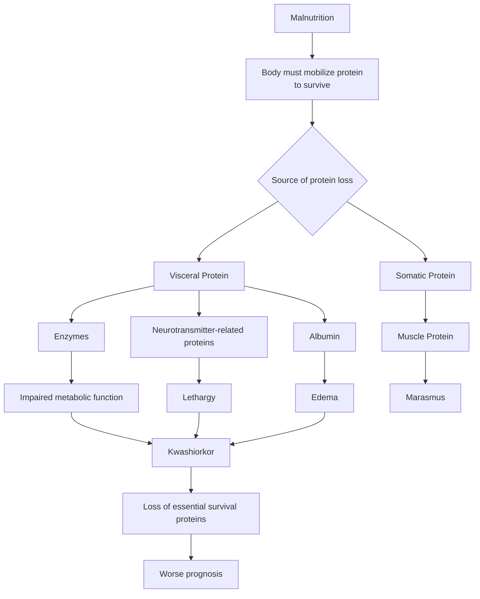

# Micronutrient
## Zinc
### Function
- Cell mediated immunity
- Epithelial integrity
	- Skin Dematitis
	- Gut diarrhea
- Reproduction
- Antioxidant
### Acrodermatitis Enteropathica
Acute Dermatitis
Diarrhia
mutation in SLC39A4 which is zinc transporter  

``incomplete notes`

## Selenium
Component of Selenocystein
21st amino acid
Example: 
1. Glutathione Peroxidase
2. De iodinase
3. Thioredoxine reductase
Deficiency leads to keshan's cardiomyopathy

# Malnutrition

|                  | Acute Malnutrition = Wasting           | Chronic Malnutrition = Stunting        |
| ---------------- | -------------------------------------- | -------------------------------------- |
| Best assessed by | Weight for length                   | Height for Age                         |
| Severity         | < - 2 SD: Moderate < - 3 SD: Severe | < - 2 SD: moderate < - 3 SD: Severe |
Weight For Age can be low/used in both:
	- acute
	- Chronic
- If weight for Age is Low (< -2 SD): **Underweight**
	- Moderate (< -2 SD)
	- Severe (< - 3 SD)

> Weight for length will probably not decrease in chronic malnutrition because both weight and length would be affected in chronic malnutrition and hence the ratio will not change much

Example Questions: 
[[Pediatrics TND#14. Anthropometry|Chronic Malnutrition]]
[[Pediatrics TND#71. Anthropometry|Wasting]]
[[Pediatrics TND#72. Anthropometry|Acute on Chronic Malnutrition]]

**Example Question: Child with following anthro
W/A - 3 SD
H/A -3.2 SD
W/L -1.7 SD**
A) Wasting
B) Stunting
C) SAM
D) Moderate Malnutrition

**Answer: Not SAM**

## Protein Energy Malnutrition
In case of malnutrition body has to lose Protein to survive
Now body can lose from two places.
	- Visceral: Enzymes, Neurotransmitter (lethargic), albumin(edema) --> Kwashiorkar --> loss of essential survival protein--> worse prognosis
	- Somatic: Muscle --> Marasmus

![[IMG_1136.webp]]![[IMG_1137.jpeg]]

|                     | Kwashiorkar                                      | Marasmus |
| ------------------- | ------------------------------------------------ | -------- |
| Wasting             | Visceral                                         | Somatic  |
| onset               | > 1 year                                         | < 1 year |
| Appetite            | Poor                                             |          |
| Appearance          | Lethargic Moon Facies                         |          |
| Prognosis           | Poor                                             |          |
| Deficit             | Protein                                          |          |
| Additional Features | Fatty liver Skin/Hair changes (**Flag Sign**) |          |
[[Pediatrics TND#20. Marasmus|Marasmus]]
[[Pediatrics TND#21. Kwashiorkor|Kwashiorkar]]

## Severe Acute Malnutrition
> [!important] Definition
> Any 1 of the following
> 1. W/L < -3 SD
> 2. MUAC < 11.5 cm
> 3. Bipedal Nutritional edema 
>     - (Kwashiorkar which can have normal above two characters)
> 4. Visible Severe Muscle Wasting

| Complicated | Uncomplicated   |                       |
| ----------- | --------------- | --------------------- |
| poor        | Good            | Appetite              |
| yes         | No              | Medical Complications |
| yes         | No              | Edema                 |
| Admission   | Home management | Management            |
> [!info] Home management
> done by ASHA/anganwadi worker
> 1. Ready to use Therapeautic food: Nutritional Rehabilitation
> 2. 4A:
> 	1. Oral Amox x 5 days
> 	2. Vitamin A 0, 1, 14 days
> 	3. Albendazole
> 	4. Age appropriate vaccination

#### Hospital Management of Complicated SAM
> [!info] Our first goal Is not to manage complications
> But to make sure that child doesn't die because of complications
> Thus the Stabilization Phase

Triad of Complicate SAM:
1. Hypoglycemia
2. Hypothermia
3. Sepsis
> If one exist, we always assume other two are there

|                                             |                                | Stabilisation 0-7 Days | Rehabilitation       |
| ------------------------------------------- | ------------------------------ | ------------------------- | -------------------- |
| RBS < 54 mg/dl                              | **Hypoglycemia**               | 3 Days                    |                      |
| Rectal < 35.5º C Oral < 35º C            | **Hypothermia**                | 3                         |                      |
| ReSOMAL                                     | **Dehydrration**               | 3                         |                      |
| IV ampicillin and genta                     | **Infection**                  | 7 days                    |                      |
| K and Mg                                    | **Electrolyte imbalanve**      | Throughout admission      | Even after discharge |
| Cause production of ROS which causes damage | **Iron**                       | No iron                | iron given           |
| We Don't want refeeding Syndrome            | **Cautions refeeding**         | F-75                      | F-100                |
|                                             | **Catch Up Growth**            |                           | 200 kcal/kg/day      |
|                                             | **Sensory Neural Stimulation** |                           |                      |
|                                             | **Follow Up**                  |                           |                      |
**Refeeding Syndrome:**
Sudden carbohydrate intake after long period --> big Insulin Spike
- Insulin causes influx of Potassium, Phosphate and Magnesium
[[Pediatrics TND#15. Severe acute malnutrition]]
[[Pediatrics TND#22. Severe acute malnutrition|SAM]]
[[Pediatrics TND#54. Dermatological manifestations / nutritional deficiencies]]

