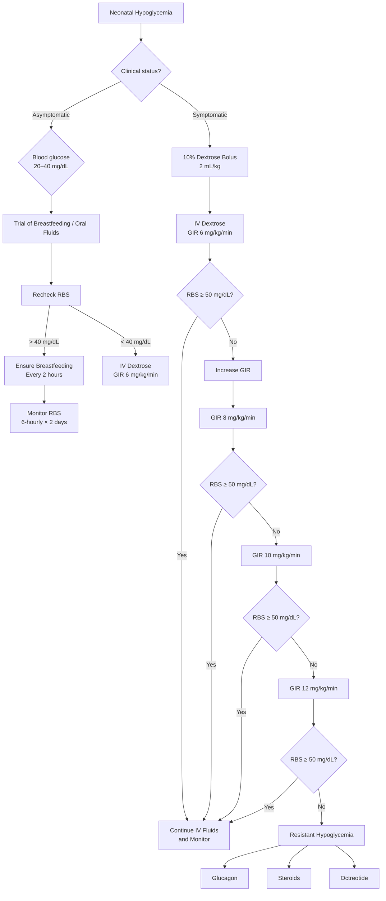

> [!note] Definition
> RBS < 40

If there are Symptoms: You have to give Bolus + IV

```mermaid
flowchart TD
    A[Neonatal Hypoglycemia] --> B{Clinical status?}

    B -->|Asymptomatic| C{Blood glucose<br>20–40 mg/dL}
    B -->|Symptomatic| S[10% Dextrose Bolus<br>2 mL/kg]

    %% ASYMPTOMATIC
    C --> D[Trial of Breastfeeding / Oral Fluids]
    D --> E[Recheck RBS]

    E -->|> 40 mg/dL| F[Ensure Breastfeeding<br>Every 2 hours]
    F --> G[Monitor RBS<br>6-hourly × 2 days]

    E -->|< 40 mg/dL| H[IV Dextrose<br>GIR 6 mg/kg/min]

    %% SYMPTOMATIC
    S --> T[IV Dextrose<br>GIR 6 mg/kg/min]
    T --> U{RBS ≥ 50 mg/dL?}

    U -->|Yes| V[Continue IV Fluids<br>and Monitor]
    U -->|No| W[Increase GIR]

    W --> X[GIR 8 mg/kg/min]
    X --> Y{RBS ≥ 50 mg/dL?}

    Y -->|Yes| V
    Y -->|No| Z[GIR 10 mg/kg/min]

    Z --> AA{RBS ≥ 50 mg/dL?}
    AA -->|Yes| V
    AA -->|No| AB[GIR 12 mg/kg/min]

    AB --> AC{RBS ≥ 50 mg/dL?}
    AC -->|Yes| V
    AC -->|No| AD[Resistant Hypoglycemia]

    AD --> AE[Glucagon]
    AD --> AF[Steroids]
    AD --> AG[Octreotide]
```

[[Pediatrics TND#36. Neonatal hypoglycaemia]] C