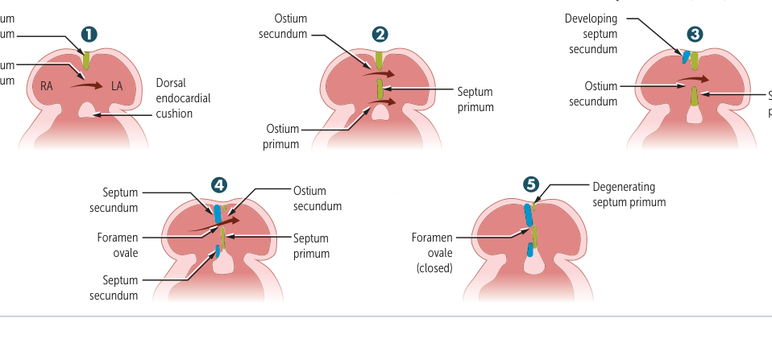
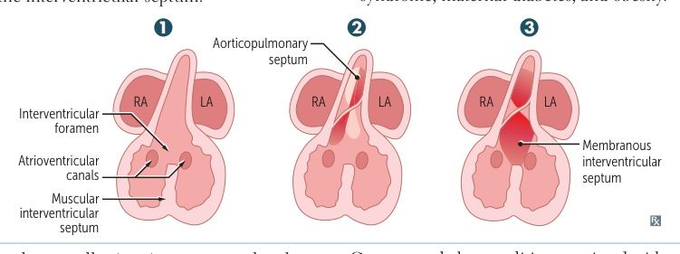
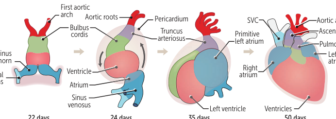
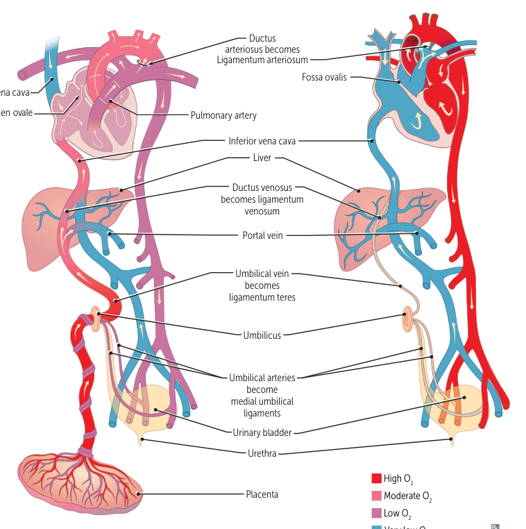

### Heart morphogenesis

- The heart is the first functional organ in the embryo and begins spontaneous activity around week 4.
- **Cardiac looping** begins in week 4 and establishes left–right cardiac orientation.
- Abnormal left–right signaling, including defects affecting dynein-mediated asymmetry, can produce **dextrocardia**, as seen in Kartagener syndrome.

### Atrial septation

- **Septum primum** grows toward the endocardial cushions, progressively narrowing the **ostium primum**.
- Cell loss in the septum primum creates the **ostium secundum**.
- **Septum secundum** develops to the right of septum primum and leaves the **foramen ovale**.
- The remaining septum primum functions as the flap valve of the foramen ovale.
- After birth, increased left-atrial pressure and reduced right-atrial pressure press the two septa together, functionally closing the foramen ovale.
- Fusion of the septa occurs during infancy/early childhood.
- **Patent foramen ovale (PFO):** failure of postnatal fusion; common and usually silent, but can permit paradoxical embolization when right-to-left flow occurs.

  
  
<em>First Aid for the USMLE Step 1 (2025) — PDF p. 305</em>

### Ventricular septation

- A muscular interventricular septum first forms, leaving an **interventricular foramen**.
- The outflow/aorticopulmonary septum joins the muscular septum to create the **membranous interventricular septum**, closing the opening.
- Endocardial cushions separate atria from ventricles and contribute to the membranous septum and AV/semilunar valves.
- **Ventricular septal defect (VSD):** most common congenital cardiac anomaly; commonly involves the membranous septum.
- **Atrioventricular septal defect (AVSD):** endocardial-cushion/AV-canal defect with a common AV valve; partial forms have ASD, while complete forms have both ASD and VSD. Associated particularly with Down syndrome, maternal diabetes, and maternal obesity.

  
  
<em>First Aid for the USMLE Step 1 (2025) — PDF p. 306</em>

### Outflow tract development

- Neural crest cells form the truncal and bulbar ridges.
- These ridges spiral and fuse into the **aorticopulmonary septum**, separating the ascending aorta from the pulmonary trunk.
- Neural-crest migration failure is associated with:
  - Transposition of the great arteries
  - Tetralogy of Fallot
  - Persistent truncus arteriosus

### Valve development

- **Aortic and pulmonary valves:** arise from endocardial cushions of the outflow tract.
- **Mitral and tricuspid valves:** arise from fused endocardial cushions of the AV canal.
- Abnormal valve development can produce stenosis, regurgitation, atresia, or displacement such as Ebstein anomaly.

### Embryonic cardiovascular derivatives

| Embryonic structure | Main postnatal derivative |
|---|---|
| Right common + right anterior cardinal veins | Superior vena cava |
| Posterior, subcardinal, supracardinal venous systems | Inferior vena cava |
| Right horn of sinus venosus | Smooth right atrium (sinus venarum) |
| Left horn of sinus venosus | Coronary sinus |
| Primitive pulmonary vein | Smooth left atrium |
| Primitive atrium | Trabeculated portions of both atria |
| Endocardial cushions | Atrial septum, membranous IV septum, AV valves, semilunar valves |
| Primitive ventricle | Trabeculated ventricular myocardium |
| Bulbus cordis | Smooth ventricular outflow tracts |
| Truncus arteriosus | Ascending aorta + pulmonary trunk |

  
  
<em>First Aid for the USMLE Step 1 (2025) — PDF p. 307</em>

### Fetal-to-postnatal derivatives

| Fetal structure | Adult remnant |
|---|---|
| Ductus arteriosus | Ligamentum arteriosum |
| Ductus venosus | Ligamentum venosum |
| Foramen ovale | Fossa ovalis |
| Allantois/urachus | Median umbilical ligament |
| Umbilical arteries | Medial umbilical ligaments |
| Umbilical vein | Ligamentum teres hepatis |

### Fetal circulation

Three major bypass pathways:

1. **Umbilical vein → ductus venosus → IVC**: largely bypasses hepatic circulation.
2. Oxygen-rich IVC blood preferentially crosses the **foramen ovale → LA**.
3. SVC blood enters the right heart and is directed toward the pulmonary artery; because fetal pulmonary vascular resistance is high, much of it passes through the **ductus arteriosus → descending aorta**.

  
  
<em>First Aid for the USMLE Step 1 (2025) — PDF p. 308</em>

### Transition at birth

- Lung expansion lowers pulmonary vascular resistance.
- Increased pulmonary venous return raises LA pressure relative to RA pressure, producing functional closure of the **foramen ovale**.
- Removal of placental circulation lowers prostaglandin levels, while increased oxygen tension promotes **ductus arteriosus constriction**.
- **Prostaglandin E1/E2** maintains ductal patency.
- **Indomethacin, ibuprofen, and acetaminophen** can promote closure of a patent ductus arteriosus.
