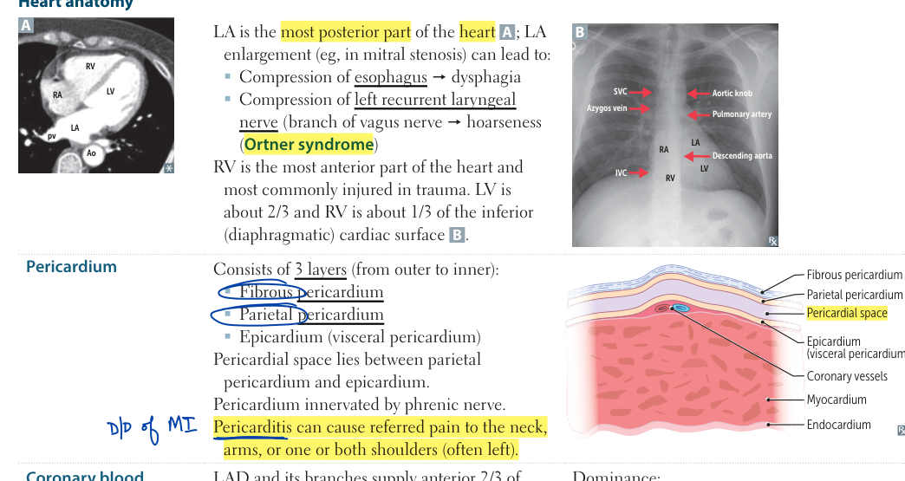
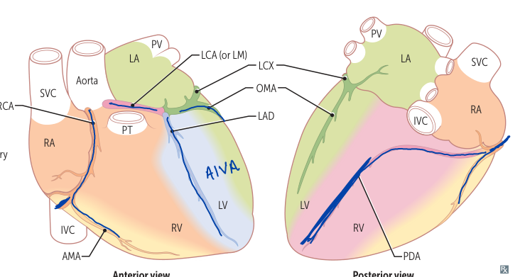

### Heart anatomy

- The **left atrium** is the most posterior cardiac chamber.
  - Enlargement can compress the esophagus → dysphagia.
  - It can also compress the left recurrent laryngeal nerve → hoarseness (**Ortner syndrome**).
- The **right ventricle** is the most anterior chamber and is therefore vulnerable in chest trauma.
- Of the inferior/diaphragmatic cardiac surface, approximately two-thirds is contributed by the LV and one-third by the RV.

### Pericardium

Layers from superficial to deep:

1. Fibrous pericardium
2. Parietal serous pericardium
3. Epicardium (visceral serous pericardium)

- The **pericardial space** lies between parietal pericardium and epicardium.
- The pericardium is supplied by the **phrenic nerve**.
- Pericardial inflammation can therefore produce referred pain to the neck and shoulder/arm, often on the left.

  
  
<em>First Aid for the USMLE Step 1 (2025) — PDF p. 309</em>

### Coronary blood supply

| Vessel | Major territory / clinical point |
|---|---|
| **LAD** | Anterior 2/3 of IV septum, anterior LV, anterolateral papillary muscle; most commonly occluded coronary vessel |
| **PDA** | Posterior 1/3 of IV septum, posterior ventricular walls, posteromedial papillary muscle; may supply SA/AV nodes depending on dominance |
| **Right marginal artery** | Right ventricle |
| **Coronary sinus** | Drains into right atrium |

  
  
<em>First Aid for the USMLE Step 1 (2025) — PDF p. 309</em>

### Coronary dominance

- **Right dominant:** PDA arises from RCA; most common.
- **Left dominant:** PDA arises from LCX.
- **Codominant:** PDA receives supply from both RCA and LCX.

### High-yield coronary physiology

- Blood flow to the LV myocardium and IV septum is greatest during **early diastole**.
- Ischemia/infarction involving nodal arterial supply can produce **bradycardia or heart block**.
