### Cardiac output variables

#### Stroke volume

- **SV = EDV − ESV**
- SV increases with:
  - Increased contractility
  - Increased preload
  - Reduced afterload
- Stroke work is proportional to **SV × MAP**.

#### Contractility

Contractility increases with:
- β1-adrenergic stimulation → cAMP/PKA signaling
- Increased Ca²⁺ entry and sarcoplasmic-reticulum Ca²⁺ availability
- Digoxin, through Na⁺/K⁺-ATPase inhibition and secondary reduction of Na⁺/Ca²⁺ exchange

Contractility decreases with:
- β1 blockade
- Systolic HF
- Acidosis
- Hypoxemia/hypercapnia
- Nondihydropyridine Ca²⁺-channel blockers

#### Preload

- Best approximated by **ventricular EDV**.
- Determined by venous return, circulating volume, and venous tone.
- Venodilators such as nitroglycerin decrease preload.

#### Afterload

- Approximated clinically by **MAP**.
- Higher arterial pressure raises wall tension via Laplace's relationship.
- Chronic pressure overload promotes LV hypertrophy.
- Arteriolar vasodilators reduce afterload.
- ACE inhibitors and ARBs reduce both preload and afterload.

#### Myocardial oxygen demand

O₂ consumption increases with:
- Contractility
- Afterload/arterial pressure
- Heart rate
- Ventricular radius

**Laplace relationships**

- Wall tension ∝ pressure × radius
- Wall stress ∝ pressure × radius / (2 × wall thickness)

  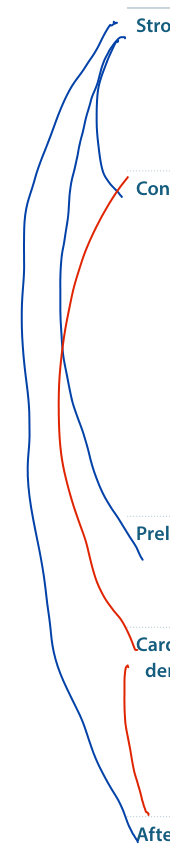
  
<em>First Aid for the USMLE Step 1 (2025) — PDF p. 310</em>

### Cardiac output equations

| Variable | Equation / relationship |
|---|---|
| Stroke volume | `SV = EDV − ESV` |
| Ejection fraction | `EF = SV / EDV` |
| Cardiac output | `CO = SV × HR` |
| Fick principle | `CO = O₂ consumption / (arterial O₂ content − venous O₂ content)` |
| Pulse pressure | `PP = SBP − DBP` |
| MAP at resting HR | `MAP ≈ DBP + 1/3(PP)` |
| General MAP relationship | `MAP = CO × TPR` |

- Normal EF is approximately **50–70%**.
- EF falls in systolic HF; it is usually preserved in isolated diastolic dysfunction.
- With exercise, early increases in CO involve both HR and SV; later, SV plateaus and further CO increase relies mainly on HR.
- Very rapid HR shortens diastolic filling time → reduced SV → reduced CO.

  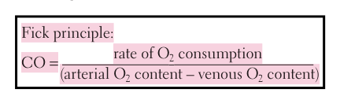
  
<em>First Aid for the USMLE Step 1 (2025) — PDF p. 311</em>

### Pulse pressure

Increased PP:
- Aortic regurgitation
- Reduced arterial compliance/age-related arterial stiffening
- High-output states such as anemia or hyperthyroidism
- Exercise and increased sympathetic activity

Reduced PP:
- Aortic stenosis
- Cardiogenic shock
- Cardiac tamponade
- Advanced HF

### Frank-Starling relationship

- Within physiologic limits, greater preload increases force of contraction and SV.
- Positive inotropes shift cardiac performance upward.
- Loss of functioning myocardium shifts performance downward.
- Important positive inotropes include catecholamines, dobutamine, milrinone, and digoxin.

  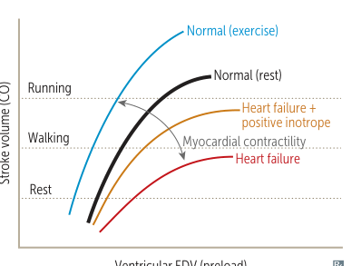
  
<em>First Aid for the USMLE Step 1 (2025) — PDF p. 311</em>

### Resistance, pressure, and flow

- Flow depends on velocity and vessel cross-sectional area.
- **Poiseuille relationship:** resistance is inversely proportional to radius⁴.
- Therefore, small changes in arteriolar radius produce large changes in resistance.
- Vessels in series: resistances add directly.
- Vessels in parallel: reciprocals of resistance add.
- Pressure gradients drive flow from high to low pressure.
- **Arterioles** provide most systemic vascular resistance.
- **Veins** provide most blood-storage capacity.
- **Capillaries** have the largest total cross-sectional area and consequently the lowest flow velocity.
- Viscosity is strongly affected by hematocrit:
  - Increased in polycythemia and hyperproteinemia
  - Decreased in anemia

  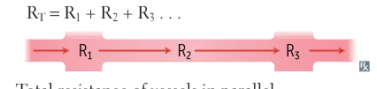
  
<em>First Aid for the USMLE Step 1 (2025) — PDF p. 312</em>

  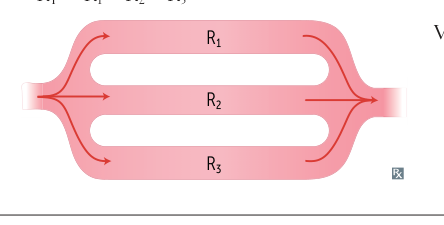
  
<em>First Aid for the USMLE Step 1 (2025) — PDF p. 312</em>

### Cardiac and vascular function curves

- The operating point is the intersection of the **cardiac function curve** and **vascular function/venous-return curve**.
- Changes in inotropy alter cardiac output and right-atrial pressure.
- Changes in circulating volume or venous tone alter venous return and preload.
- Changes in TPR alter cardiac output; the effect on right-atrial pressure is less predictable.
- Exercise typically combines increased inotropy with reduced TPR to raise CO.
- HF may be accompanied by compensatory volume retention that increases preload.

  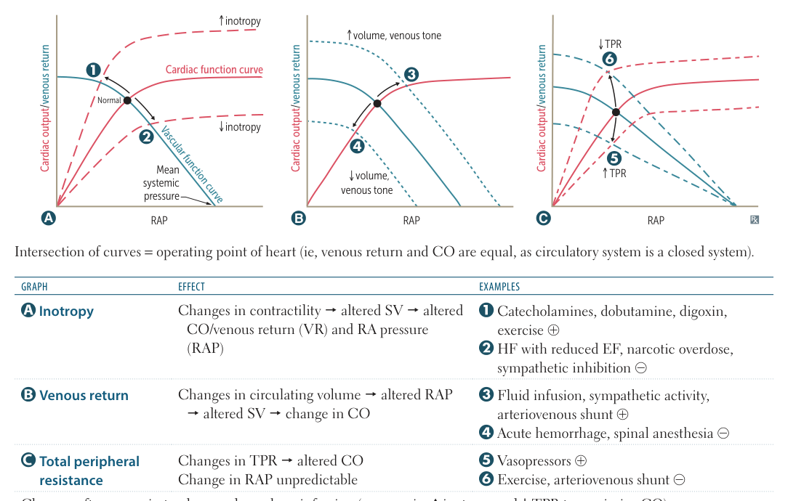
  
<em>First Aid for the USMLE Step 1 (2025) — PDF p. 312</em>

### Pressure-volume loops and cardiac cycle

#### LV cycle

1. **Atrial systole**
2. **Isovolumetric contraction**
3. **Rapid ejection**
4. **Reduced ejection**
5. **Isovolumetric relaxation**
6. **Rapid filling**
7. **Reduced filling**

- **Isovolumetric contraction:** mitral valve closed, aortic valve not yet open.
- **Systolic ejection:** aortic valve open.
- **Isovolumetric relaxation:** both valves closed after aortic valve closure.
- **Rapid filling:** follows mitral valve opening.

#### Heart sounds

| Sound | Mechanism / association |
|---|---|
| **S1** | Closure of mitral + tricuspid valves; loudest near apex |
| **S2** | Closure of aortic + pulmonic valves; loudest at upper sternal border |
| **S3** | Early diastolic rapid filling; increased filling pressures/volume overload; can be physiologic in children, young adults, athletes, and pregnancy |
| **S4** | Late diastolic filling into a stiff/noncompliant ventricle; associated with hypertrophy |

  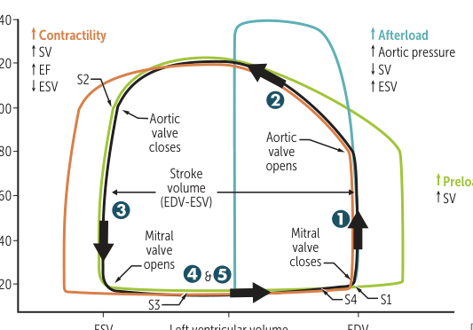
  
<em>First Aid for the USMLE Step 1 (2025) — PDF p. 313</em>

  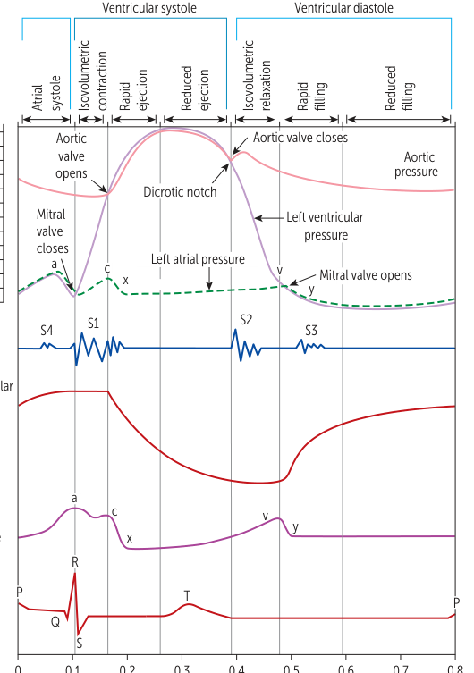
  
<em>First Aid for the USMLE Step 1 (2025) — PDF p. 313</em>

### JVP

- **a wave:** atrial contraction; absent in AF; prominent with AV dissociation/cannon a waves and increased RV end-diastolic pressure.
- **c wave:** RV contraction with tricuspid valve bulging into the atrium.
- **x descent:** atrial relaxation/downward tricuspid displacement; reduced with tricuspid regurgitation.
- **v wave:** increased RA pressure during ventricular systole while the tricuspid valve is closed.
- **y descent:** RA emptying into RV; prominent in constrictive pericarditis and absent in tamponade.

  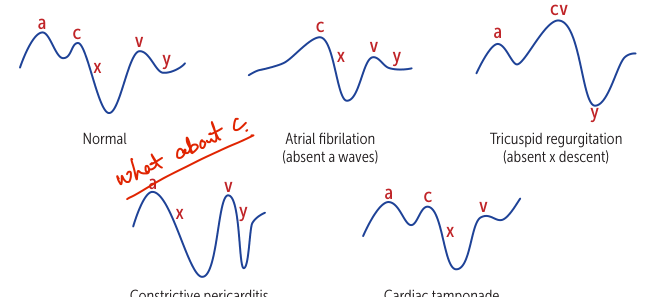
  
<em>First Aid for the USMLE Step 1 (2025) — PDF p. 314</em>

### Valvular pressure-volume loop patterns

- **Aortic stenosis:** increased LV pressure, increased ESV, reduced SV; chronic pressure overload causes hypertrophy and reduced compliance.
- **Aortic regurgitation:** no true isovolumetric phases; increased EDV and SV; wide pulse pressure and loss of the dicrotic notch.
- **Mitral stenosis:** increased LA pressure with impaired LV filling; reduced EDV, ESV, and SV.
- **Mitral regurgitation:** no true isovolumetric phases; increased EDV with reduced ESV and increased total SV; prominent V wave.

  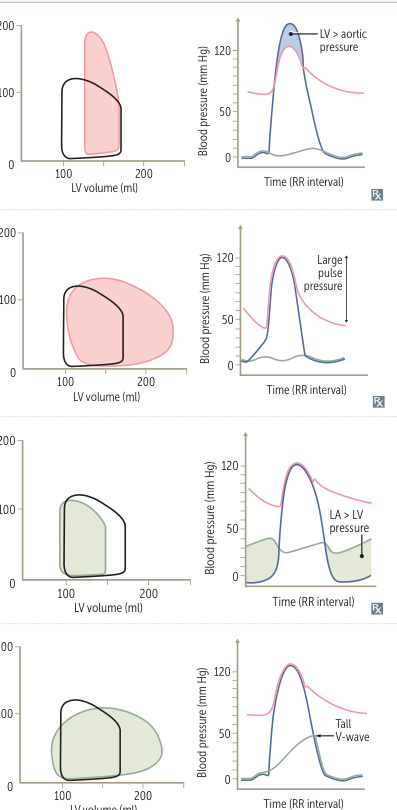
  
<em>First Aid for the USMLE Step 1 (2025) — PDF p. 314</em>

### Splitting of S2

- **Physiologic:** inspiration delays P2 because RV filling/ejection time increases.
- **Wide:** delayed RV emptying, e.g. pulmonic stenosis or RBBB.
- **Fixed:** ASD; increased right-sided flow is relatively independent of respiration.
- **Paradoxical:** delayed A2, e.g. aortic stenosis or LBBB; split is more apparent on expiration and narrows with inspiration.

### Cardiac auscultation and maneuvers

#### Listening areas

- **Aortic:** systolic ejection murmurs such as aortic stenosis.
- **Pulmonic:** pulmonic stenosis and flow murmurs.
- **Tricuspid:** tricuspid regurgitation and VSD.
- **Mitral/apex:** mitral regurgitation, mitral stenosis, MVP.
- **Left sternal border:** hypertrophic cardiomyopathy and aortic/pulmonic regurgitation.

#### Dynamic maneuvers

| Maneuver | Main physiologic change | Murmurs that increase |
|---|---|---|
| Standing / Valsalva strain | ↓ preload and LV volume | HCM, MVP |
| Passive leg raise | ↑ preload | Most flow-dependent murmurs |
| Squatting | ↑ preload and ↓ afterload | Most murmurs; decreases HCM/MVP |
| Hand grip | ↑ afterload | AR, MR, VSD |
| Inspiration | ↑ right-sided venous return | Right-sided murmurs |

- Aortic stenosis becomes softer with hand grip.
- In MVP, decreased LV volume moves the click earlier; increased volume moves it later.
- HCM becomes louder when LV volume falls.

  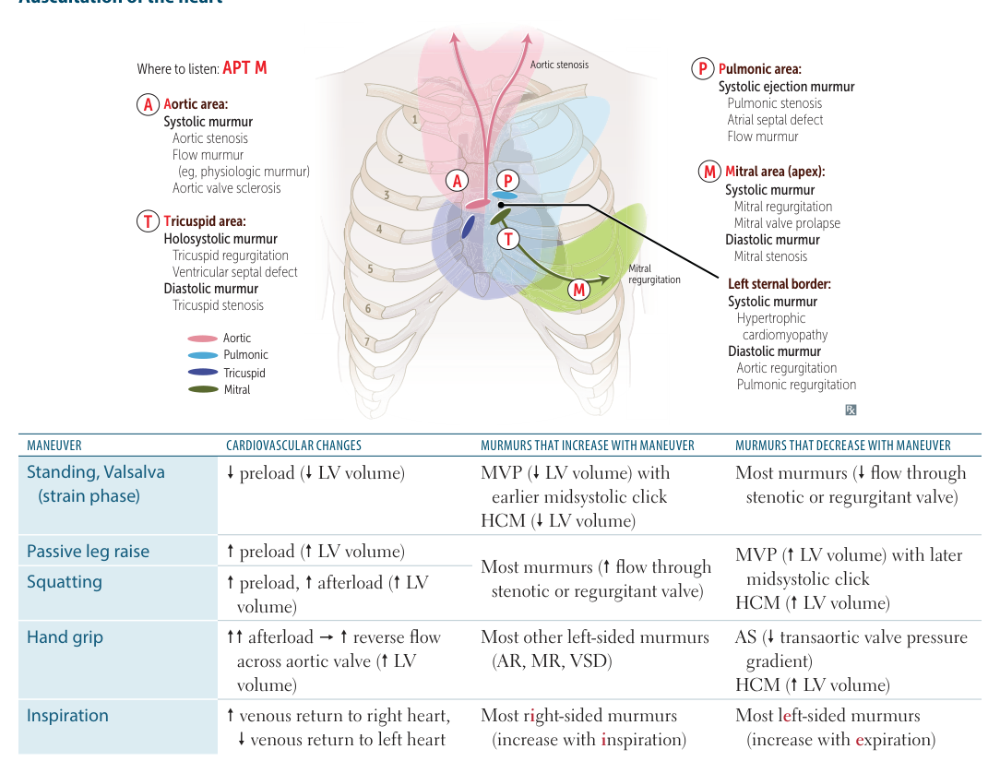
  
<em>First Aid for the USMLE Step 1 (2025) — PDF p. 316</em>

### High-yield murmurs

#### Aortic stenosis
- Crescendo-decrescendo systolic ejection murmur.
- Best at the base; radiates to carotids.
- Classically associated with syncope, angina, and exertional dyspnea.
- Reduced/soft S2 can occur.

#### Mitral and tricuspid regurgitation
- Holosystolic, blowing murmur.
- MR is loudest at apex and may radiate to axilla.
- TR is loudest at tricuspid area.

#### Mitral valve prolapse
- Late systolic crescendo with midsystolic click.
- Typically best at the apex.
- Can be associated with connective-tissue disease, rheumatic disease, or chordal pathology.

#### VSD
- Harsh holosystolic murmur.
- Larger defects can paradoxically generate a quieter murmur because the pressure gradient is smaller.

#### Aortic regurgitation
- Early diastolic, decrescendo, high-pitched murmur.
- Wide pulse pressure; severe chronic disease can produce hyperdynamic peripheral signs.
- Causes include bicuspid valve, endocarditis, aortic-root dilation, and rheumatic disease.

#### Mitral stenosis
- Opening snap followed by a low-pitched diastolic rumble.
- Rheumatic heart disease is the classic cause.
- Chronic disease can cause LA enlargement, pulmonary congestion, AF, and right HF.

#### PDA
- Continuous machine-like murmur, classically near the left infraclavicular region.

  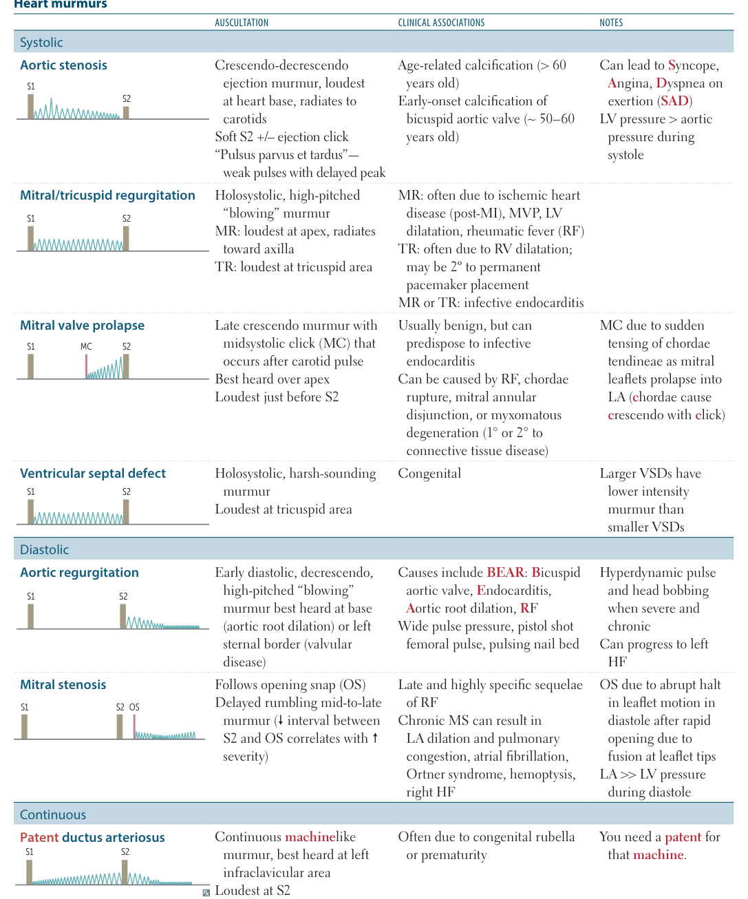
  
<em>First Aid for the USMLE Step 1 (2025) — PDF p. 317</em>

### Myocardial action potentials

#### Ventricular myocyte

| Phase | Main event |
|---|---|
| 0 | Fast Na⁺ influx → rapid depolarization |
| 1 | Na⁺ channel inactivation + transient K⁺ efflux |
| 2 | Ca²⁺ influx balances K⁺ efflux → plateau |
| 3 | K⁺ efflux → repolarization |
| 4 | Resting potential dominated by K⁺ permeability |

- Ca²⁺ entry during the plateau triggers Ca²⁺ release from the SR (**calcium-induced calcium release**).
- Cardiac myocytes communicate electrically through gap junctions.
- The prolonged plateau contributes to a long effective refractory period.

#### SA/AV nodal cells

- No true phases 1 and 2.
- **Phase 4:** spontaneous slow depolarization driven by the funny current (`If`, HCN channels carrying Na⁺/K⁺ current).
- Sympathetic stimulation increases the slope of phase 4 → increased HR.
- ACh and adenosine reduce spontaneous depolarization → reduced HR.
- **Phase 0:** mainly Ca²⁺ influx, explaining relatively slow AV-nodal conduction.

  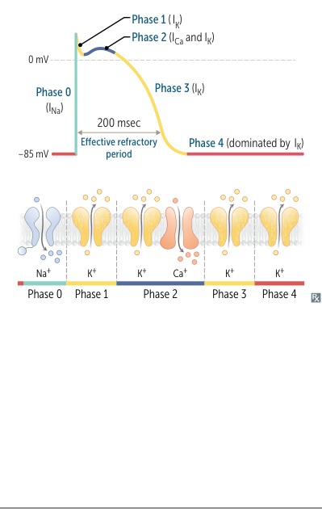
  
<em>First Aid for the USMLE Step 1 (2025) — PDF p. 318</em>

  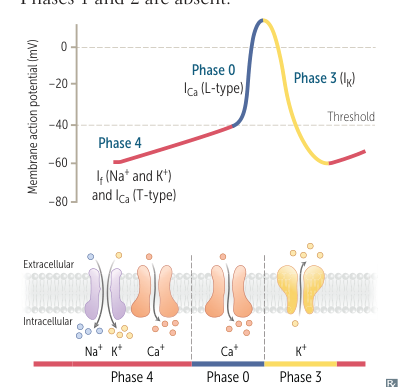
  
<em>First Aid for the USMLE Step 1 (2025) — PDF p. 318</em>

### ECG

#### Conduction pathway
SA node → atria → AV node → bundle of His → right and left bundle branches → Purkinje fibers → ventricles.

- The left bundle divides into anterior and posterior fascicles.
- SA node lies near the SVC in the upper crista terminalis.
- AV node lies in the interatrial septum near the coronary sinus opening.
- AV nodal delay is roughly 100 ms, allowing ventricular filling.

#### ECG intervals and waves

| Component | Meaning |
|---|---|
| P wave | Atrial depolarization |
| PR interval | Start of atrial depolarization to start of ventricular depolarization; normally 120–200 ms |
| QRS | Ventricular depolarization; normally ≤100 ms |
| QT interval | Ventricular depolarization + contraction + repolarization |
| T wave | Ventricular repolarization |
| J point | End of QRS / beginning of ST segment |
| ST segment | Ventricles are depolarized; normally isoelectric |
| U wave | Can become prominent in hypokalemia and bradycardia |

  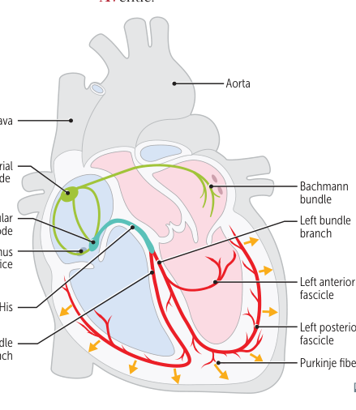
  
<em>First Aid for the USMLE Step 1 (2025) — PDF p. 319</em>

  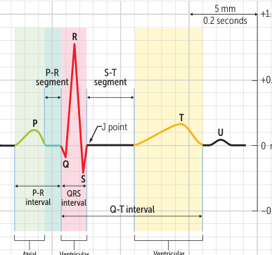
  
<em>First Aid for the USMLE Step 1 (2025) — PDF p. 319</em>

### Natriuretic peptides

#### ANP
- Produced by atrial myocytes in response to increased atrial stretch/volume.
- Acts through cGMP.
- Promotes vasodilation, natriuresis, and diuresis.

#### BNP
- Produced mainly by ventricular myocytes in response to increased wall stress.
- Similar physiologic effects to ANP.
- Useful clinically as a marker for HF; a low value has strong rule-out value.

  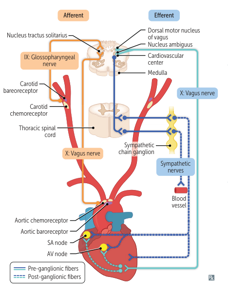
  
<em>First Aid for the USMLE Step 1 (2025) — PDF p. 320</em>

### Baroreceptors and chemoreceptors

#### Baroreceptors
- **Carotid sinus → CN IX → nucleus tractus solitarius.**
- **Aortic arch → CN X → nucleus tractus solitarius.**
- Hypotension → reduced baroreceptor firing → increased sympathetic and reduced parasympathetic activity → vasoconstriction, tachycardia, and increased contractility.
- Carotid sinus hypersensitivity can be triggered by neck pressure/massage and may cause bradycardia, vasodilation, presyncope, or syncope.
- The Cushing reflex combines hypertension, bradycardia, and respiratory depression in raised intracranial pressure.

#### Chemoreceptors
- Peripheral carotid/aortic bodies respond to increased CO₂, increased H⁺, and low O₂, especially PaO₂ <60 mm Hg.
- Central chemoreceptors respond to CO₂-related pH changes in brain extracellular fluid and do not directly sense O₂.
- Chronic hypercapnia reduces central chemoreceptor responsiveness.

### Resting cardiac pressures

- Pulmonary capillary wedge pressure approximates left-atrial pressure in most settings.
- In mitral stenosis, PCWP reflects elevated LA pressure and may exceed LV end-diastolic pressure.
- PCWP is obtained using a pulmonary artery catheter.

  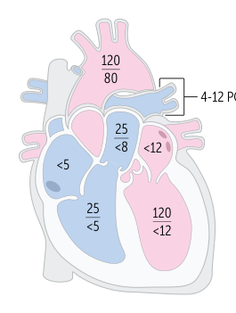
  
<em>First Aid for the USMLE Step 1 (2025) — PDF p. 321</em>

### Autoregulation

| Organ | Major local regulator |
|---|---|
| Lungs | Alveolar hypoxia → vasoconstriction |
| Heart | Local metabolites; ↓O₂, ↑CO₂, NO |
| Brain | CO₂/H⁺ |
| Kidney | Myogenic response + tubuloglomerular feedback |
| Skeletal muscle | Exercise-related metabolites: CO₂, H⁺, adenosine, lactate, K⁺ |
| Skin | Sympathetic vasoconstriction is important for thermoregulation |

**Key distinction:** hypoxia generally causes systemic vasodilation, but **pulmonary hypoxia causes vasoconstriction**.

### Capillary fluid exchange

Starling forces:

- **Pc:** capillary hydrostatic pressure → pushes fluid outward.
- **Pi:** interstitial hydrostatic pressure → pushes fluid inward.
- **πc:** plasma oncotic pressure → pulls fluid inward.
- **πi:** interstitial oncotic pressure → pulls fluid outward.

Net fluid movement:

`Jv = Kf[(Pc − Pi) − σ(πc − πi)]`

- `Kf` = permeability to fluid.
- `σ` = reflection coefficient for protein.

Common mechanisms of edema:
- Increased capillary hydrostatic pressure, e.g. HF
- Increased permeability, e.g. burns/inflammation
- Increased interstitial oncotic pressure, e.g. lymphatic obstruction
- Reduced plasma oncotic pressure, e.g. nephrotic syndrome, liver failure, severe protein malnutrition

  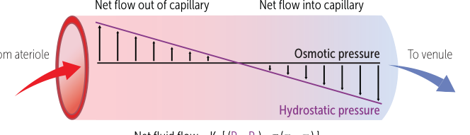
  
<em>First Aid for the USMLE Step 1 (2025) — PDF p. 322</em>

