### Congenital heart disease

#### Right-to-left shunts

Often cause **early cyanosis**.

High-yield group:
- Persistent truncus arteriosus
- Transposition of the great arteries
- Tricuspid atresia
- Tetralogy of Fallot
- Total anomalous pulmonary venous return

##### Persistent truncus arteriosus
- Failure of separation of the common outflow tract into aorta and pulmonary trunk.
- VSD is commonly present.

##### D-transposition of the great arteries
- Aorta arises from RV; pulmonary trunk arises from LV.
- Produces parallel rather than serial circulation.
- Survival requires a site of mixing such as ASD/PFO, VSD, or PDA.
- Failure of normal spiraling of the aorticopulmonary septum.
- Classic radiograph description: narrow superior mediastinum/“egg-on-string” appearance.

##### Tricuspid atresia
- Absent tricuspid valve with hypoplastic RV.
- Requires interatrial and/or interventricular/ductal communication for adequate circulation.
- ECG can show right-atrial enlargement and LV-dominant changes.

##### Tetralogy of Fallot
Four components:
1. VSD
2. RV outflow/pulmonary stenosis
3. Overriding aorta
4. RV hypertrophy

- Caused by anterosuperior displacement of the infundibular septum.
- Pulmonary obstruction is the major determinant of severity.
- Can produce episodic cyanosis (“tet spells”).
- Squatting increases SVR and reduces right-to-left shunting.
- Associated with 22q11 deletion syndromes.
- CXR may show a boot-shaped heart.

  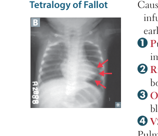
  
<em>First Aid for the USMLE Step 1 (2025) — PDF p. 323</em>

  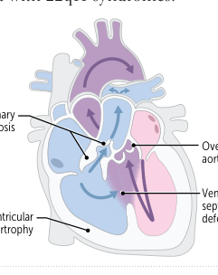
  
<em>First Aid for the USMLE Step 1 (2025) — PDF p. 323</em>

##### TAPVR
- All pulmonary veins drain into the right-sided circulation instead of the LA.
- Requires an ASD and sometimes a PDA for adequate mixing.

##### Ebstein anomaly
- Downward displacement of the tricuspid valve into the RV → “atrialization” of part of the ventricle.
- Associated with tricuspid regurgitation, accessory conduction pathways, and right HF.
- Classically associated with prenatal lithium exposure.

  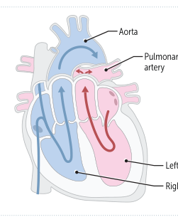
  
<em>First Aid for the USMLE Step 1 (2025) — PDF p. 323</em>

  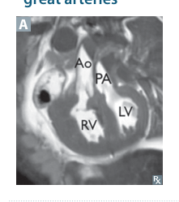
  
<em>First Aid for the USMLE Step 1 (2025) — PDF p. 323</em>

#### Left-to-right shunts

Usually **acyanotic initially**; chronic pulmonary vascular disease can reverse the shunt.

##### VSD
- Often silent at birth.
- Small defects may close spontaneously.
- Large defects increase pulmonary blood flow and LV volume load.
- Chronic disease can evolve into Eisenmenger physiology.

##### ASD
- Most common form is ostium secundum.
- Produces systolic ejection murmur with **fixed, wide S2 splitting**.
- Distinguished from PFO because ASD is an actual structural defect.
- Can permit paradoxical embolization if transient/right-to-left pressure reversal occurs.
- Associated with Down syndrome.

##### PDA
- Normal fetal connection between pulmonary artery and aorta.
- After birth, falling pulmonary vascular resistance makes the shunt **left-to-right**.
- Continuous machine-like murmur.
- Patency is promoted by prostaglandins and low oxygen tension.
- Chronic PDA may produce differential cyanosis affecting the lower extremities.

##### Eisenmenger syndrome
- Chronic left-to-right shunt → pulmonary vascular remodeling → pulmonary hypertension → RV pressure overload → eventual right-to-left shunt.
- Causes late cyanosis, clubbing, and secondary erythrocytosis/polycythemia.

  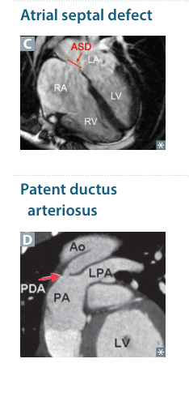
  
<em>First Aid for the USMLE Step 1 (2025) — PDF p. 324</em>

  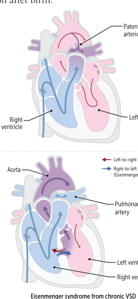
  
<em>First Aid for the USMLE Step 1 (2025) — PDF p. 324</em>

### Coarctation and neonatal pulmonary hypertension

#### Coarctation of the aorta
- Usually juxtaductal.
- Associations: bicuspid aortic valve, other congenital heart lesions, Turner syndrome.
- Produces upper-extremity hypertension with diminished/delayed lower-extremity pulses.
- Collateral intercostal arteries can enlarge and produce rib notching.
- Complications include HF, intracranial aneurysm/hemorrhage, aortic rupture, and endocarditis.

  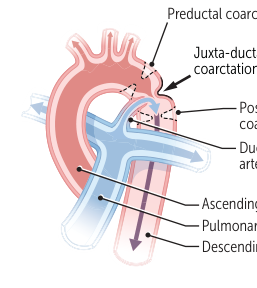
  
<em>First Aid for the USMLE Step 1 (2025) — PDF p. 325</em>

  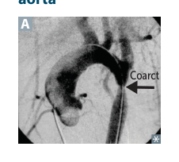
  
<em>First Aid for the USMLE Step 1 (2025) — PDF p. 325</em>

#### Persistent pulmonary hypertension of the newborn
- Failure of pulmonary vascular resistance to fall after birth.
- Risk factors include meconium aspiration and neonatal pneumonia.
- Right-to-left flow can persist through the foramen ovale and ductus arteriosus.
- Often causes respiratory distress and differential cyanosis.
- Preductal oxygen saturation can exceed postductal saturation.

### Congenital associations

| Association | Typical cardiac defects |
|---|---|
| Fetal alcohol exposure | VSD, PDA, ASD, TOF |
| Congenital rubella | PDA, pulmonary artery stenosis, septal defects |
| Down syndrome | AVSD, VSD, ASD |
| Maternal diabetes | TGA, truncus, tricuspid atresia, VSD |
| Marfan syndrome | MVP, thoracic aortic aneurysm/dissection, AR |
| Prenatal lithium | Ebstein anomaly |
| Turner syndrome | Bicuspid aortic valve, coarctation/dissection |
| Williams syndrome | Supravalvular aortic stenosis |
| 22q11 deletion | Truncus arteriosus, TOF |

### Hypertension

- Defined here as persistent **SBP ≥130 mm Hg and/or DBP ≥80 mm Hg**.
- Risk factors include increasing age, obesity, diabetes, inactivity, high sodium intake, excess alcohol, tobacco use, and family history.
- Most hypertension is primary/essential.
- Secondary causes include renal/renovascular disease, fibromuscular dysplasia, atherosclerotic renal artery stenosis, primary hyperaldosteronism, and OSA.
- Fibromuscular dysplasia can produce a “string-of-beads” renal artery appearance.
- **Hypertensive urgency:** severe BP elevation without acute end-organ injury.
- **Hypertensive emergency:** severe BP elevation with acute end-organ injury.
- Chronic effects include CAD, concentric LVH, HF, AF, aortic disease, stroke, CKD, and retinopathy.

  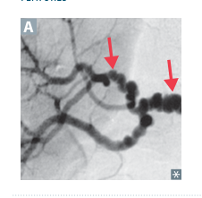
  
<em>First Aid for the USMLE Step 1 (2025) — PDF p. 325</em>

### Hyperlipidemia and atherosclerosis

#### Physical signs of hyperlipidemia
- **Xanthomas/xanthelasma:** lipid-laden histiocytes in skin, including eyelids.
- **Tendinous xanthomas:** especially Achilles and extensor tendons; classically linked to familial hypercholesterolemia.
- **Corneal arcus:** corneal lipid deposition; premature appearance suggests hypercholesterolemia.

  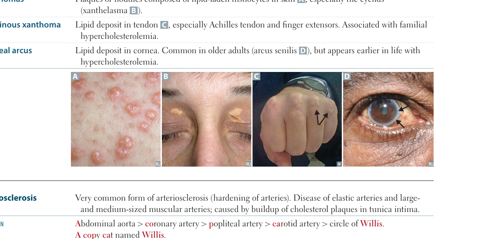
  
<em>First Aid for the USMLE Step 1 (2025) — PDF p. 326</em>

#### Atherosclerosis
- Disease of the intima of large and medium elastic/muscular arteries.
- Commonly affected sites include abdominal aorta, coronary arteries, popliteal arteries, carotid arteries, and cerebral circulation.
- Major modifiable risks: hypertension, smoking, high LDL/low HDL, diabetes.
- Nonmodifiable risks: age, male sex, postmenopausal status, family history.
- Pathogenesis:
  1. Endothelial dysfunction
  2. LDL accumulation and macrophage recruitment
  3. Foam cells/fatty streak
  4. Smooth-muscle migration and proliferation
  5. Extracellular matrix deposition → fibrous plaque
  6. Calcification/complicated atheroma
- Complications: ischemia, infarction, aneurysm, thrombosis, embolism, peripheral arterial disease, renovascular hypertension, and other vascular syndromes.

  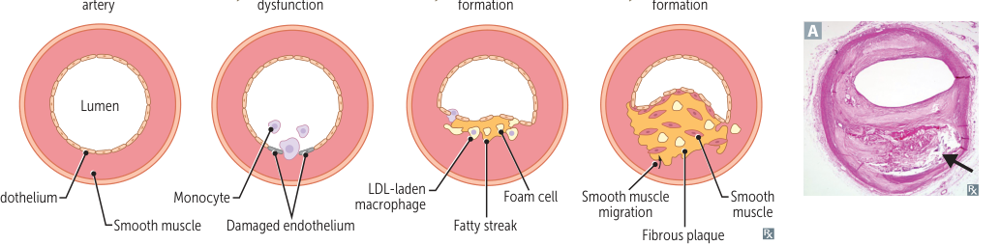
  
<em>First Aid for the USMLE Step 1 (2025) — PDF p. 326</em>

### Cholesterol embolization

- Small cholesterol crystals can embolize from aortic/large-artery plaques.
- Causes end-organ ischemia and inflammatory injury.
- Features can include livedo reticularis, blue-toe syndrome, AKI, gut ischemia, and neurologic events.
- Peripheral pulses may remain present because larger arteries are patent.
- Can follow vascular instrumentation.

### Arteriolosclerosis

- **Hyaline type:** wall thickening from protein/plasma leakage; commonly associated with hypertension and diabetes.
- **Hyperplastic type:** concentric “onion-skin” smooth-muscle proliferation, classically with severe hypertension.

  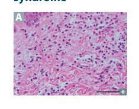
  
<em>First Aid for the USMLE Step 1 (2025) — PDF p. 327</em>

  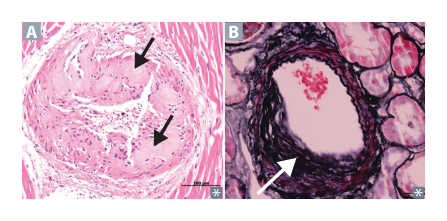
  
<em>First Aid for the USMLE Step 1 (2025) — PDF p. 327</em>

### Aortic aneurysms

#### Thoracic aortic aneurysm
- Associated with cystic medial degeneration, hypertension, bicuspid aortic valve, connective-tissue disorders such as Marfan syndrome, and tertiary syphilis.
- Aortic root dilation may cause aortic regurgitation.

#### Abdominal aortic aneurysm
- Involves all layers with inflammatory/extracellular-matrix degradation.
- Major risk: tobacco smoking; also associated with age, male sex, and family history.
- Often infrarenal.
- Classic rupture presentation: pulsatile abdominal mass, acute abdominal/back pain, and refractory hypotension.

  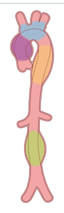
  
<em>First Aid for the USMLE Step 1 (2025) — PDF p. 327</em>

  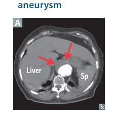
  
<em>First Aid for the USMLE Step 1 (2025) — PDF p. 327</em>

### Traumatic aortic rupture

- Usually follows severe deceleration trauma.
- Common location: aortic isthmus just distal to the left subclavian artery.
- Chest radiography may reveal mediastinal widening.

### Aortic dissection

- Intimal tear creates a false lumen.
- Strongest risk factor is hypertension.
- Other associations: bicuspid aortic valve and inherited connective-tissue disease, especially Marfan syndrome.
- Sudden tearing chest pain radiating to the back is classic.

**Stanford classification**
- **Type A:** ascending aorta involved → surgical emergency; may cause AR or tamponade.
- **Type B:** confined to descending aorta distal to the left subclavian → medical BP/impulse control is typical.

  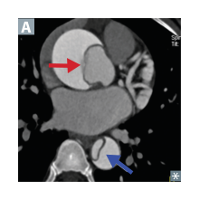
  
<em>First Aid for the USMLE Step 1 (2025) — PDF p. 328</em>

  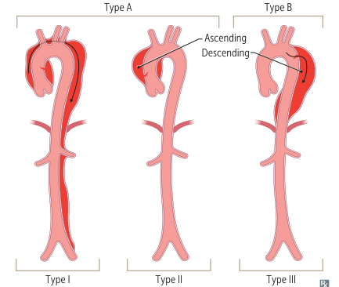
  
<em>First Aid for the USMLE Step 1 (2025) — PDF p. 328</em>

### Subclavian steal syndrome

- Proximal subclavian stenosis before the vertebral artery origin.
- Blood reverses through the ipsilateral vertebral artery during arm demand.
- Can cause arm ischemia plus vertebrobasilar symptoms.
- A systolic BP difference >15 mm Hg between arms supports the diagnosis.
- Common association: atherosclerosis.

  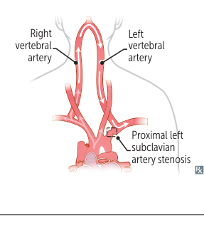
  
<em>First Aid for the USMLE Step 1 (2025) — PDF p. 328</em>

### Coronary artery disease

#### Angina

- **Stable:** fixed atherosclerotic narrowing; exertional pain relieved by rest or nitroglycerin.
- **Unstable:** plaque disruption/thrombosis with worsening symptoms or pain at rest but no biomarker-defined infarction.
- **Vasospastic:** episodic coronary spasm, usually at rest, with transient ischemic ECG changes; associated with smoking and stimulants.

  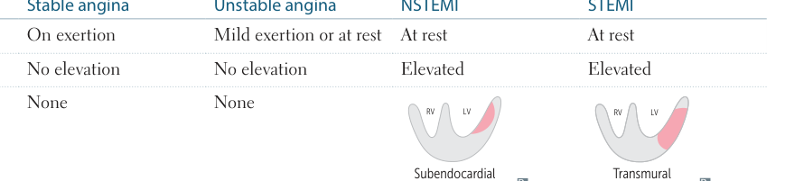
  
<em>First Aid for the USMLE Step 1 (2025) — PDF p. 329</em>

#### Myocardial infarction

Most commonly results from plaque rupture → acute thrombus formation, but prolonged oxygen supply-demand mismatch can also elevate troponin without plaque rupture.

| Feature | Stable angina | Unstable angina | NSTEMI | STEMI |
|---|---|---|---|---|
| Typical pain | Exertional | Rest/worsening | Often rest | Often rest |
| Troponin | Normal | Normal | Elevated | Elevated |
| Necrosis | None | None | Subendocardial | Transmural |
| ECG | May show ST-T changes | May show ST-T changes | ST depression/T-wave inversion | ST elevation ± Q waves |

### Coronary steal

- In chronically stenosed territories, distal arterioles may already be maximally dilated.
- Pharmacologic vasodilators preferentially dilate normal coronary beds, diverting blood away from the ischemic territory.
- This mechanism is exploited in pharmacologic stress testing.

### Sudden cardiac death

- Unexpected cardiac death, usually due to a lethal ventricular arrhythmia.
- Common substrates include CAD, HCM, DCM, myocarditis, coronary anomalies, and inherited channelopathies.
- ICD therapy is used in appropriate high-risk settings.

### Chronic ischemic heart disease

- Chronic ischemia may lead to progressive exertional symptoms and HF.
- **Myocardial hibernation:** chronic ischemic LV dysfunction that may improve after reperfusion.
- **Myocardial stunning:** transient reversible LV dysfunction after brief acute ischemia.

### Myocardial infarction evolution

- Commonly involved coronary arteries: **LAD > RCA > LCX**.

| Time | Major tissue changes | Major complications |
|---|---|---|
| 0–24 h | Wavy fibers → early coagulative necrosis; edema; reperfusion-related oxidative injury | Ventricular arrhythmias, HF, cardiogenic shock |
| 1–3 d | Extensive coagulative necrosis with neutrophilic inflammation | Fibrinous pericarditis |
| 3–14 d | Macrophage cleanup and granulation tissue | Free-wall, septal, or papillary-muscle rupture; pseudoaneurysm |
| 2 wk–months | Dense scar formation | True aneurysm, HF, arrhythmias, mural thrombus, Dressler/postcardiac injury syndrome |

  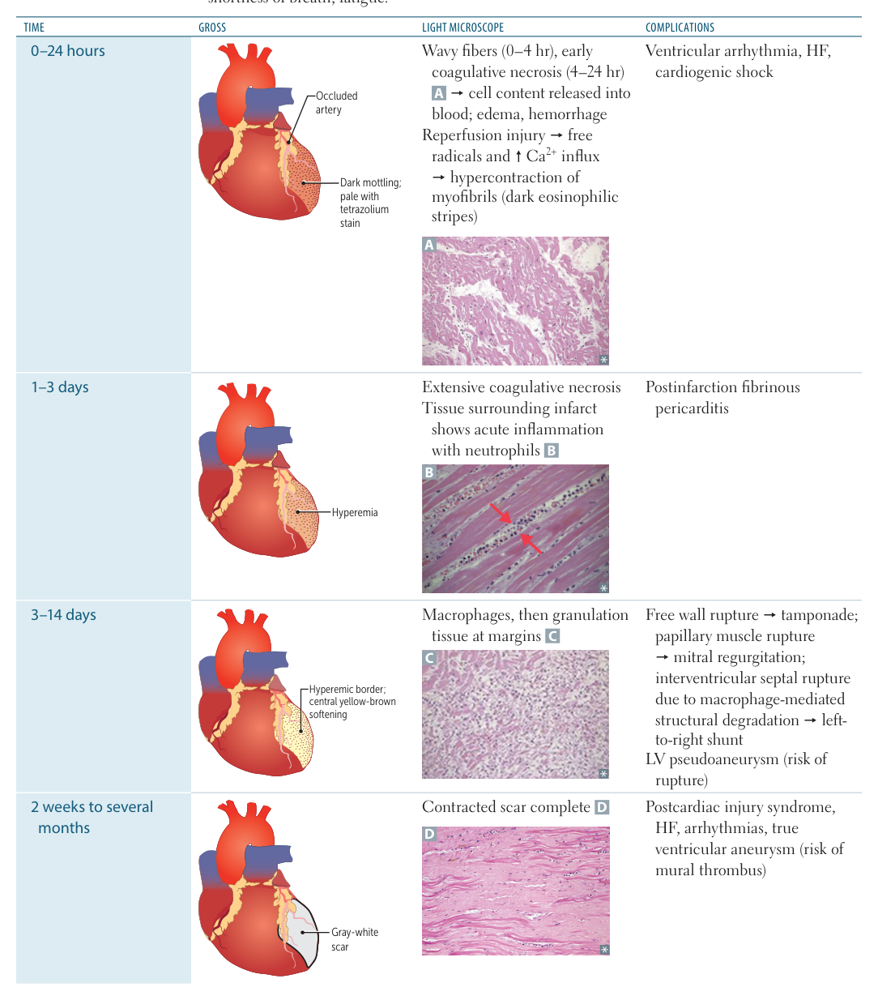
  
<em>First Aid for the USMLE Step 1 (2025) — PDF p. 330</em>

### MI diagnosis and ECG localization

- ECG is especially important early in suspected MI.
- **Troponin I:** rises after several hours, peaks around 24 h, remains elevated for about a week or longer.
- **CK-MB:** rises later and normalizes sooner; useful when assessing possible reinfarction.

Typical STEMI localization:
- V1–V2: anteroseptal
- V3–V4: anteroapical
- I, aVL: lateral
- II, III, aVF: inferior
- V7–V9 or reciprocal anterior changes: posterior
- V5–V6: anterolateral

  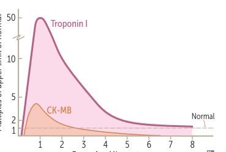
  
<em>First Aid for the USMLE Step 1 (2025) — PDF p. 331</em>

  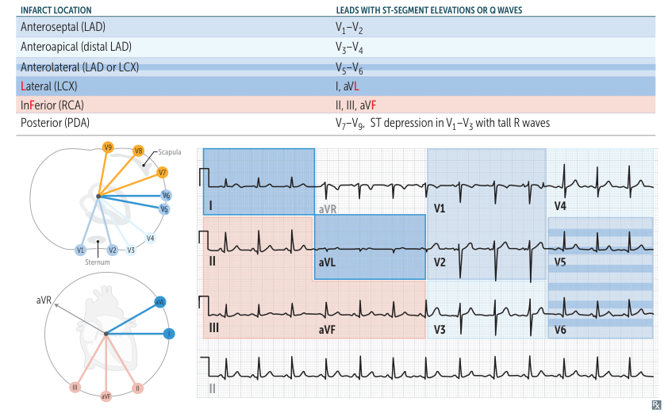
  
<em>First Aid for the USMLE Step 1 (2025) — PDF p. 331</em>

### Narrow-complex tachyarrhythmias

#### Atrial fibrillation
- Irregularly irregular rhythm with absent discrete P waves.
- Often arises near pulmonary-vein ostia.
- Risks: hypertension, CAD, older age, atrial dilation.
- Major complication: thromboembolism/stroke; LA appendage is a common thrombus site.
- Rate control drugs include β-blockers, nondihydropyridine CCBs, and digoxin; rhythm control/cardioversion is used in selected patients.

  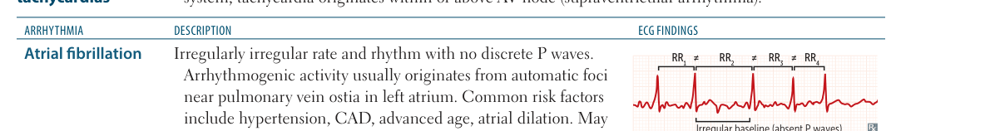
  
<em>First Aid for the USMLE Step 1 (2025) — PDF p. 332</em>

#### Multifocal atrial tachycardia
- Irregular rhythm with at least three distinct P-wave morphologies.
- Associated with COPD, pneumonia, and HF.

  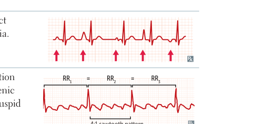
  
<em>First Aid for the USMLE Step 1 (2025) — PDF p. 332</em>

#### Atrial flutter
- Rapid repetitive atrial depolarization with “sawtooth” flutter waves.
- Typically involves a reentry circuit around the tricuspid annulus.

#### Paroxysmal SVT
- Usually reentry involving the AV node.
- Sudden-onset palpitations are typical.
- Vagal maneuvers and adenosine can terminate AV-node-dependent SVT.
- Catheter ablation provides definitive therapy for recurrent cases.

  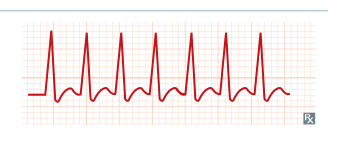
  
<em>First Aid for the USMLE Step 1 (2025) — PDF p. 332</em>

#### Wolff-Parkinson-White syndrome
- Accessory pathway (bundle of Kent) bypasses the AV node.
- Short PR, delta wave, and widened QRS.
- May produce reentrant SVT.
- Certain AV-nodal blockers should be avoided in AF with WPW.
- Antiarrhythmic options include procainamide or ibutilide in appropriate acute settings.

  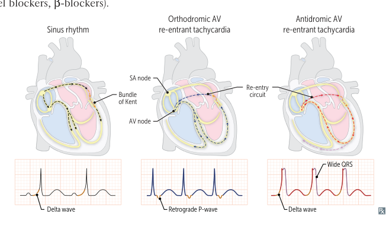
  
<em>First Aid for the USMLE Step 1 (2025) — PDF p. 332</em>

### Wide-complex tachyarrhythmias

#### Ventricular tachycardia
- Usually regular, with rate >100/min.
- Often associated with structural heart disease or post-MI scar.
- Risk of sudden cardiac death.

  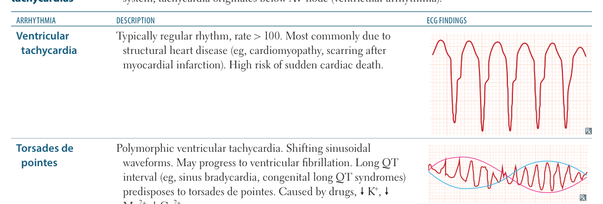
  
<em>First Aid for the USMLE Step 1 (2025) — PDF p. 333</em>

#### Torsades de pointes
- Polymorphic VT associated with prolonged QT.
- Risk factors include bradycardia, low K⁺/Mg²⁺/Ca²⁺, congenital long-QT syndromes, and QT-prolonging drugs.
- Treat unstable cases with defibrillation; magnesium is key therapy.

QT-prolonging drug groups include antiarrhythmics, some antibiotics, antipsychotics, TCAs, thiazides via electrolyte loss, antiemetics such as ondansetron, certain antifungals, protease inhibitors, and methadone.

#### Ventricular fibrillation
- Chaotic ventricular electrical activity without an organized waveform.
- Requires immediate CPR and defibrillation.

  
  
<em>First Aid for the USMLE Step 1 (2025) — PDF p. 333</em>

### Inherited channelopathies

- **Brugada syndrome:** commonly loss-of-function Na⁺-channel mutation; characteristic right-precordial ST elevation/pseudo-RBBB; ICD reduces sudden-death risk in appropriate patients.
- **Long-QT syndromes:** often involve K⁺-channel dysfunction.
  - Romano-Ward: AD, cardiac phenotype.
  - Jervell-Lange-Nielsen: AR with sensorineural deafness.
- **Sick sinus syndrome:** age-related SA-node dysfunction with pauses, arrests, bradycardia, and possible junctional escape.

  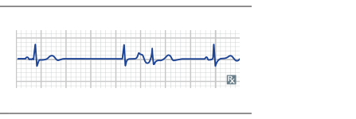
  
<em>First Aid for the USMLE Step 1 (2025) — PDF p. 333</em>

### AV conduction blocks

- **First degree:** PR >200 ms; generally benign/asymptomatic.
- **Second degree Mobitz I:** progressive PR prolongation followed by a dropped QRS.
- **Second degree Mobitz II:** unexpected dropped beats without progressive PR prolongation; can progress to complete block; pacing is often required.
- **Third degree:** AV dissociation with independent atrial and ventricular rhythms; pacemaker treatment.
- **Bundle branch block:** delayed ventricular conduction through one bundle, giving a widened QRS pattern.

  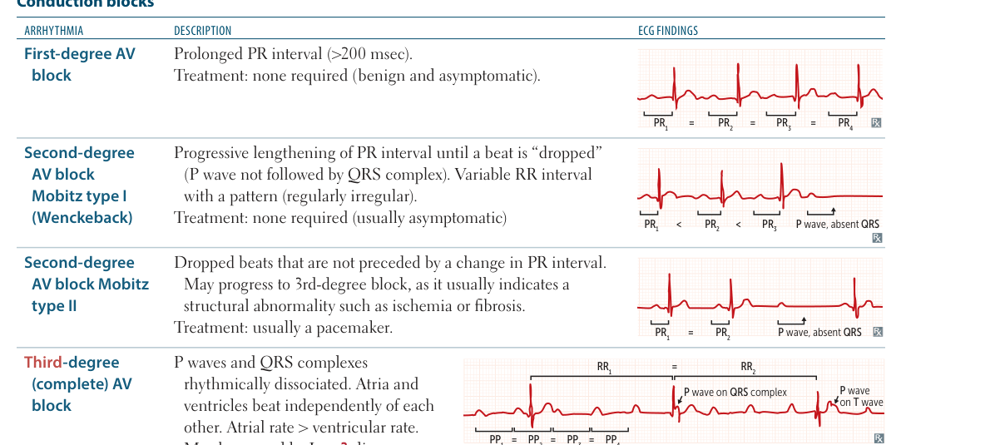
  
<em>First Aid for the USMLE Step 1 (2025) — PDF p. 334</em>

  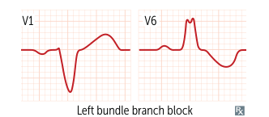
  
<em>First Aid for the USMLE Step 1 (2025) — PDF p. 334</em>

### Premature beats

- **PAC:** early atrial ectopic beat; narrow QRS with preceding abnormal P wave.
- **PVC:** early ventricular ectopic beat; wide QRS without preceding P wave.

  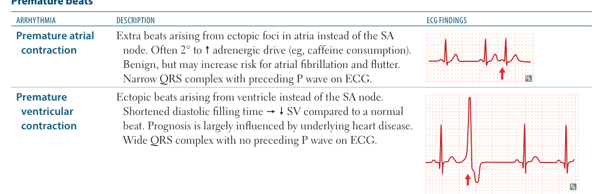
  
<em>First Aid for the USMLE Step 1 (2025) — PDF p. 334</em>

### Post-MI complications

- Arrhythmias: early and common.
- Pericarditis: typically within the first few days.
- Papillary muscle rupture: several days after MI → acute severe MR and cardiogenic shock; posteromedial muscle is more vulnerable because it often has a single arterial supply.
- Ventricular septal rupture: several days after infarction → acute VSD and possible shock.
- **Pseudoaneurysm:** contained free-wall rupture; higher rupture risk because it lacks normal myocardial/endocardial layers.
- **Free-wall rupture:** causes hemopericardium and tamponade and may be fatal.
- **True aneurysm:** fibrotic, dyskinetic ventricular bulge; lower rupture risk than pseudoaneurysm.
- **Dressler/postcardiac injury syndrome:** delayed autoimmune pericarditis after myocardial injury.

  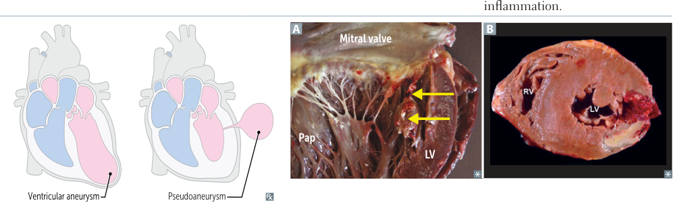
  
<em>First Aid for the USMLE Step 1 (2025) — PDF p. 335</em>

### Acute coronary syndrome treatment

- Unstable angina/NSTEMI: antiplatelet therapy, anticoagulation, β-blocker therapy when appropriate, ACE inhibitor, statin, and symptom control with nitrates ± morphine.
- STEMI: add urgent reperfusion; PCI is generally preferred when available.
- In **RV infarction**, maintain preload and avoid preload-reducing drugs such as nitrates.

### Cardiomyopathies

#### Dilated cardiomyopathy
- Most common cardiomyopathy.
- Causes include genetic/familial disease, alcohol, cocaine, doxorubicin, viral myocarditis, Chagas disease, ischemia, hemochromatosis, sarcoidosis, thyrotoxicosis, wet beriberi, and peripartum disease.
- Eccentric hypertrophy with systolic dysfunction.
- Findings: HF, S3, regurgitant systolic murmur, dilated ventricles.
- Takotsubo/stress cardiomyopathy can produce apical ballooning after major sympathetic stress.

#### Hypertrophic cardiomyopathy
- Often AD due to sarcomeric-protein mutations.
- Concentric hypertrophy, frequently asymmetric septal thickening.
- Diastolic dysfunction; may produce dynamic LV outflow obstruction.
- Exercise-related syncope and sudden death risk.
- S4 and systolic murmur; may cause MR from systolic anterior movement of the mitral valve.
- β-blockers or nondihydropyridine CCBs are used; avoid major preload reduction.

#### Restrictive/infiltrative cardiomyopathy
Causes include:
- Post-radiation fibrosis
- Löffler endocarditis
- Endocardial fibroelastosis
- Amyloidosis
- Sarcoidosis
- Hemochromatosis

Predominantly causes diastolic dysfunction; amyloidosis can produce a low-voltage ECG despite thick myocardium.

  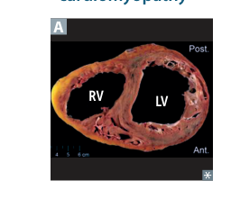
  
<em>First Aid for the USMLE Step 1 (2025) — PDF p. 336</em>

  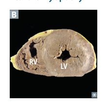
  
<em>First Aid for the USMLE Step 1 (2025) — PDF p. 336</em>

### Heart failure

- Syndrome of impaired cardiac pumping with congestion and/or low perfusion.
- Typical symptoms/signs: dyspnea, orthopnea, fatigue, S3, rales, JVD, edema.

#### HFrEF
- Reduced contractility and reduced EF.
- Often due to ischemic injury or DCM.

  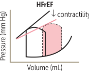
  
<em>First Aid for the USMLE Step 1 (2025) — PDF p. 337</em>

#### HFpEF
- Preserved EF with reduced ventricular compliance and increased filling pressures.
- Often associated with hypertrophy.

  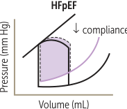
  
<em>First Aid for the USMLE Step 1 (2025) — PDF p. 337</em>

#### Right-sided HF
- Commonly secondary to left-sided HF.
- **Cor pulmonale** = right HF caused by pulmonary disease.

Therapies associated with reduced mortality in HFrEF include ACE inhibitors/ARBs/ARNI, evidence-based β-blockers, and mineralocorticoid receptor antagonists. Diuretics mainly relieve congestion; selected patients benefit from hydralazine/nitrate therapy and SGLT2 inhibition.

#### Left HF findings
- Orthopnea
- Paroxysmal nocturnal dyspnea
- Pulmonary edema
- Pulmonary hemosiderin-laden macrophages (“HF cells”)

#### Right HF findings
- Hepatic congestion / nutmeg liver
- JVD
- Peripheral edema

  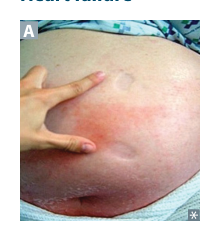
  
<em>First Aid for the USMLE Step 1 (2025) — PDF p. 337</em>

  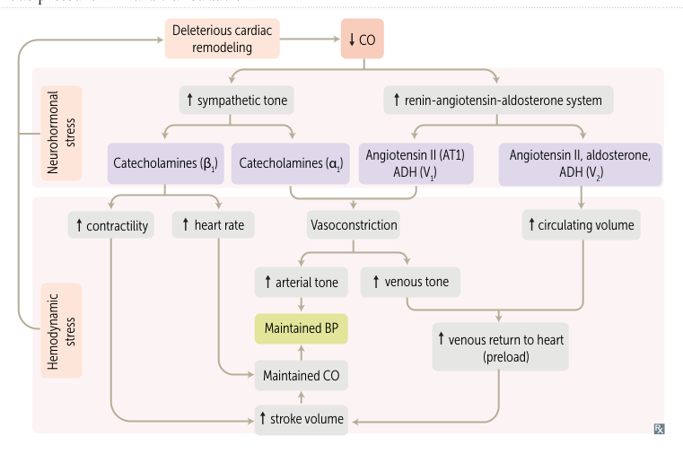
  
<em>First Aid for the USMLE Step 1 (2025) — PDF p. 337</em>

### High-output HF

- Cardiac output is elevated but systemic vascular resistance is abnormally low.
- Causes include severe obesity, cirrhosis, severe anemia, hyperthyroidism, wet beriberi, and Paget disease.

### Shock

| Type | Typical cause | CO | SVR | Filling pressures |
|---|---|---:|---:|---|
| Hypovolemic | Hemorrhage, dehydration, burns | ↓ | ↑ | ↓ |
| Cardiogenic | MI, severe HF, valvular disease, arrhythmia | ↓ | ↑ | ↑ |
| Obstructive | PE, tension pneumothorax, tamponade | ↓ | ↑ | Variable |
| Distributive | Sepsis, anaphylaxis | ↑/normal early | ↓ | Often ↓ |

  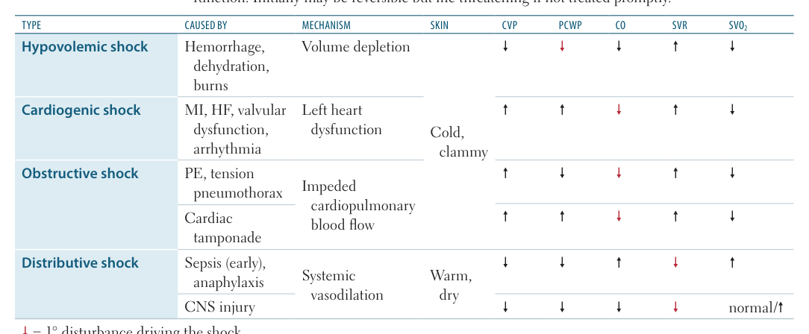
  
<em>First Aid for the USMLE Step 1 (2025) — PDF p. 338</em>

### Cardiac tamponade

- Pericardial fluid/blood compresses the heart and limits filling.
- Diastolic pressures tend to equalize.
- Findings:
  - Hypotension
  - Elevated JVP
  - Muffled heart sounds
  - Tachycardia
  - Pulsus paradoxus
- ECG may show low voltage and electrical alternans.
- Echocardiography may demonstrate effusion, RA systolic collapse, RV diastolic collapse, and IVC plethora.
- Treatment: urgent pericardial drainage.

  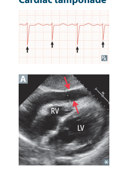
  
<em>First Aid for the USMLE Step 1 (2025) — PDF p. 338</em>

### Pulsus paradoxus

- Inspiratory decline in systolic BP >10 mm Hg.
- Reduced LV filling during inspiration results from ventricular interdependence when the pericardium cannot expand normally.
- Seen in tamponade, severe obstructive lung disease, and constrictive pericarditis.

### Syncope

- Transient LOC due to reduced cerebral perfusion.

Main categories:
- **Reflex:** vasovagal, situational, carotid sinus hypersensitivity.
- **Orthostatic:** hypovolemia, medications, autonomic dysfunction.
- **Cardiac:** arrhythmias or structural lesions such as AS/HCM.

Orthostatic hypotension is defined by a fall in SBP ≥20 mm Hg and/or DBP ≥10 mm Hg within 3 minutes of standing.

### Infective endocarditis

- Infection of the endocardium, usually involving one or more valves.
- Bacteria are much more common than fungi.

#### Acute IE
- Classically **S. aureus**.
- Highly virulent; can involve previously normal valves.
- Large destructive vegetations and rapid presentation.

#### Subacute IE
- Classically **viridans streptococci**.
- Lower virulence; often occurs on previously abnormal valves and can follow dental manipulation.

Clinical findings:
- Fever
- New murmur
- Vascular phenomena: septic emboli, petechiae, splinter hemorrhages, Janeway lesions
- Immunologic phenomena: glomerulonephritis, Osler nodes, Roth spots

Associations:
- Prosthetic valves → S. epidermidis
- GI/GU procedures → Enterococcus
- Colon cancer → S. gallolyticus
- HACEK organisms → culture-negative/fastidious gram-negative association
- Culture-negative disease → Coxiella/Bartonella
- Injection drug use → S. aureus, Pseudomonas, Candida

Diagnosis requires blood cultures plus echocardiography.

  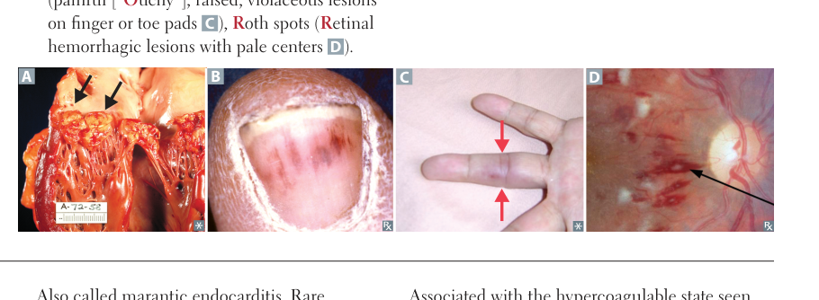
  
<em>First Aid for the USMLE Step 1 (2025) — PDF p. 339</em>

### Nonbacterial thrombotic endocarditis

- Sterile platelet-rich vegetations, often on mitral/aortic valves.
- Easily embolize.
- Associated with advanced malignancy, especially pancreatic adenocarcinoma, and SLE.
- Libman-Sacks endocarditis is the SLE-associated form.

### Rheumatic fever and rheumatic heart disease

- Delayed immune complication of group A streptococcal pharyngitis.
- Molecular mimicry involving streptococcal M protein.
- Major manifestations include:
  - Migratory polyarthritis
  - Pancarditis
  - Subcutaneous nodules
  - Erythema marginatum
  - Sydenham chorea
- Histology: Aschoff bodies and Anitschkow cells.
- Late valve disease classically affects mitral > aortic > tricuspid.
- Early disease produces regurgitation; late disease can cause stenosis.
- ASO and anti-DNase B titers may be elevated.
- Penicillin is used for treatment/prophylaxis.

### Syphilitic aortic disease

- Tertiary syphilis damages the vasa vasorum.
- Weakening/dilation of the aortic wall may produce a characteristic “tree-bark” appearance.
- Can cause aneurysm and aortic regurgitation.

### Acute pericarditis

- Sharp pleuritic chest pain relieved by sitting forward.
- Pericardial friction rub is characteristic.
- ECG may show diffuse ST elevation and PR depression.
- Causes include viral infection, malignancy, surgery, radiation, MI, autoimmune disease, and uremia.
- Treatment depends on cause; anti-inflammatory therapy is commonly used.

  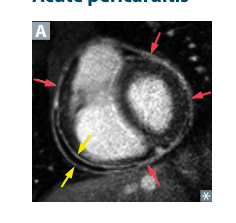
  
<em>First Aid for the USMLE Step 1 (2025) — PDF p. 340</em>

### Constrictive pericarditis

- Chronic pericardial inflammation → fibrosis ± calcification → impaired ventricular filling.
- Causes include idiopathic disease, infection, surgery, and late radiation injury.
- TB is an important cause in resource-limited settings.
- Findings: dyspnea, edema, JVD, Kussmaul sign, pulsus paradoxus, and pericardial knock.

### Kussmaul sign

- Paradoxical **increase** in JVP during inspiration.
- Reflects impaired RV filling.
- Seen in constrictive pericarditis, restrictive cardiomyopathy, right HF, massive PE, and some right-sided cardiac tumors.

### Myocarditis

- Myocardial inflammation; important cause of sudden cardiac death in younger adults.
- Presentation may include dyspnea, chest pain, fever, tachycardia, arrhythmias, and heart block.
- Causes:
  - Viral: adenovirus, coxsackie B, parvovirus B19, HIV, HHV-6, COVID-19
  - Parasitic: Trypanosoma cruzi, Toxoplasma
  - Bacterial: Borrelia, Mycoplasma, Corynebacterium
  - Toxins: carbon monoxide, black widow venom
  - Drugs: doxorubicin, cocaine
  - Autoimmune/inflammatory: Kawasaki disease, sarcoidosis, SLE, inflammatory myopathies
- Viral disease classically shows lymphocytic inflammation with focal myocyte necrosis.
- Complications: sudden death, arrhythmias, heart block, DCM, HF, and mural thromboembolism.

### Hereditary hemorrhagic telangiectasia

- AD vascular disorder.
- Mucocutaneous telangiectasias, recurrent epistaxis, GI bleeding, hematuria, and visceral AVMs.
- AVMs can produce high-output HF.
- Intracranial hemorrhage can occur in affected children.

  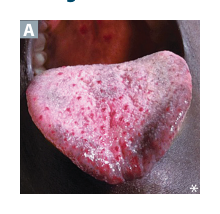
  
<em>First Aid for the USMLE Step 1 (2025) — PDF p. 341</em>

### Cardiac tumors

- Metastases are more common than primary cardiac tumors.

#### Myxoma
- Most common primary cardiac tumor in adults.
- Usually arises in the atrium, especially the left atrium.
- Can obstruct the mitral orifice and mimic mitral stenosis.
- May cause episodic syncope and constitutional symptoms through IL-6 production.
- May produce a diastolic “tumor plop”.
- Histology includes myxoma cells in a glycosaminoglycan-rich matrix.

  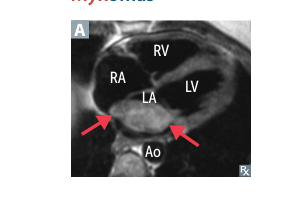
  
<em>First Aid for the USMLE Step 1 (2025) — PDF p. 341</em>

#### Rhabdomyoma
- Most common primary cardiac tumor in children.
- Strong association with tuberous sclerosis.
- Often ventricular and hamartomatous.
