### Deep venous thrombosis

#### Virchow triad
- **Stasis:** postoperative state, prolonged travel/immobility
- **Hypercoagulability:** inherited/acquired thrombophilia, pregnancy, estrogen exposure
- **Endothelial injury**

- Proximal lower-extremity DVT is the major source of clinically important emboli.
- D-dimer is useful for exclusion in appropriate low/intermediate-risk patients because of high sensitivity but limited specificity.
- Compression ultrasonography with Doppler is the principal imaging test.
- Acute management/prophylaxis may use unfractionated heparin or LMWH.
- Direct oral anticoagulants such as rivaroxaban and apixaban are commonly used for treatment and secondary prevention.

  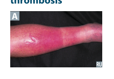
  
<em>First Aid for the USMLE Step 1 (2025) — PDF p. 342</em>

### Antihypertensive drug selection

| Clinical setting | Commonly emphasized choices / cautions |
|---|---|
| Primary HTN | Thiazides, ACE inhibitors, ARBs, CCBs |
| HTN + HF | ACEI/ARB/ARNI strategy, β-blocker in compensated HF, aldosterone antagonist, diuretics for congestion |
| HTN + diabetes | ACEI/ARB, CCB, thiazide; β-blockers may mask hypoglycemia; ACEI/ARB renal-protective |
| HTN + asthma | ARB, CCB, thiazide; if needed, cardioselective β-blocker rather than nonselective β-blocker |
| HTN + pregnancy | Hydralazine, methyldopa, labetalol, nifedipine |
| HTN + gout | CCBs, ACEI/ARBs; losartan is particularly useful; avoid thiazide/loop diuretic–related hyperuricemia |
| HTN + osteoporosis | Thiazides favored because they reduce urinary Ca²⁺ loss |
| Pheochromocytoma | α-blockade first (phenoxybenzamine/phentolamine), then β-blockade |

### Vascular smooth-muscle signaling

Major vasodilator pathways highlighted in this section:

- **Nitrate/NO pathway:** NO → soluble guanylate cyclase → ↑cGMP → smooth-muscle relaxation.
- **Natriuretic peptide pathway:** ANP/BNP receptor → cGMP-mediated relaxation/natriuresis.
- **PDE-5 inhibition:** sildenafil prevents cGMP breakdown and augments NO-mediated relaxation.
- **PDE-3 inhibition:** milrinone raises cAMP in cardiac/vascular tissue.
- **L-type Ca²⁺-channel blockade:** reduces Ca²⁺ entry into smooth muscle/cardiac tissue.
- **D1 agonism:** fenoldopam increases renal/peripheral vasodilation.

  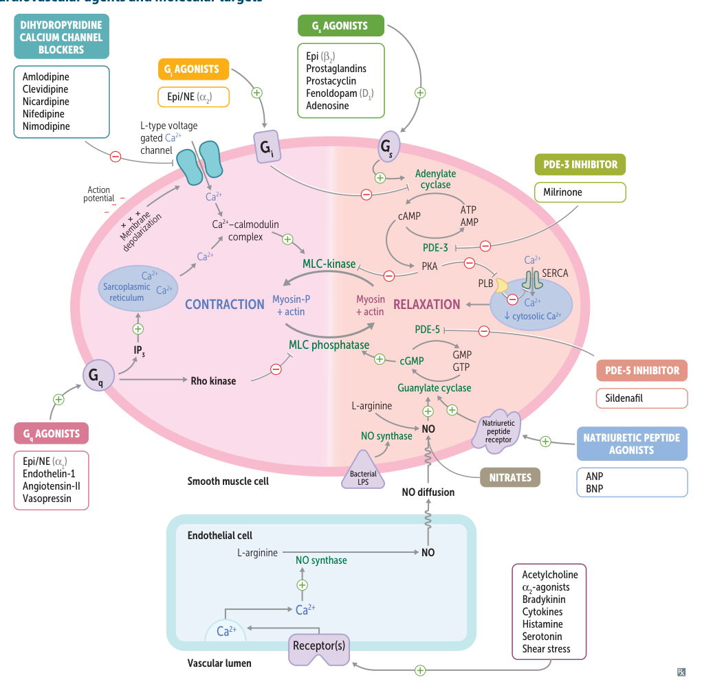
  
<em>First Aid for the USMLE Step 1 (2025) — PDF p. 343</em>

### Nitrates

Examples:
- Nitroglycerin
- Isosorbide dinitrate
- Isosorbide mononitrate

#### Mechanism
- Increase NO signaling → increase cGMP → smooth-muscle relaxation.
- Preferentially dilate **veins more than arteries** → reduced preload.

#### Uses
- Angina
- Acute coronary syndromes
- Pulmonary edema

#### Adverse effects
- Reflex tachycardia
- Headache
- Flushing
- Hypotension
- Methemoglobinemia
- Tolerance with chronic exposure
- Occupational nitrate exposure can produce a pattern of tolerance followed by symptoms on re-exposure after time away.

#### Important contraindications
- Right-ventricular infarction
- Hypertrophic obstructive cardiomyopathy
- Concurrent PDE-5 inhibitor use

### Calcium-channel blockers

#### Dihydropyridines
- Amlodipine
- Clevidipine
- Nicardipine
- Nifedipine
- Nimodipine

Main action: **vascular smooth muscle**.

#### Nondihydropyridines
- Diltiazem
- Verapamil

Main action: **cardiac tissue/AV node**.

#### Mechanism
- Block voltage-gated **L-type Ca²⁺ channels**.
- Reduce smooth-muscle contraction and, for nondihydropyridines, cardiac conduction/contractility.

#### Relative vascular vs cardiac activity
- Vascular: amlodipine ≈ nifedipine > diltiazem > verapamil
- Cardiac: verapamil > diltiazem > dihydropyridines

#### Uses
- Dihydropyridines: HTN, angina, vasospastic angina, Raynaud phenomenon.
- Nimodipine: prevention of delayed ischemic complications after subarachnoid hemorrhage.
- Nicardipine/clevidipine: hypertensive urgency/emergency.
- Diltiazem/verapamil: rate control in AF/flutter and selected nodal arrhythmias.

#### Adverse effects
- Dihydropyridines: peripheral edema, flushing, dizziness, gingival hyperplasia.
- Nondihydropyridines: bradycardia/cardiac depression, AV block, constipation; verapamil can increase prolactin.

### Hydralazine

#### Mechanism
- Direct arteriolar vasodilator → reduces afterload.
- Increases cGMP-related smooth-muscle relaxation.

#### Uses
- Severe hypertension
- Pregnancy
- HF in combination with an organic nitrate

#### Adverse effects
- Reflex tachycardia
- Fluid retention
- Headache
- Angina
- Drug-induced lupus

### Hypertensive emergency agents

Common IV options listed:
- Labetalol
- Clevidipine
- Fenoldopam
- Nicardipine
- Nitroprusside

#### Nitroprusside
- Potent, short-acting arterial and venous dilator.
- Releases NO → ↑cGMP.
- Toxicity concern: **cyanide**.

#### Fenoldopam
- Dopamine **D1-receptor agonist**.
- Causes renal, coronary, peripheral, and splanchnic vasodilation.
- Increases natriuresis.
- Adverse effects: hypotension, tachycardia, flushing, headache, nausea.

### Antianginal therapy

Main goal: decrease myocardial O₂ consumption by reducing one or more of:
- End-diastolic volume
- Blood pressure
- Heart rate
- Contractility

| Drug class | EDV | BP | Contractility | HR | Overall MVO₂ |
|---|---:|---:|---:|---:|---:|
| Nitrates | ↓ | ↓ | Reflex ↑/little direct effect | Reflex ↑ | ↓ |
| β-blockers | No major change/↓ | ↓ | ↓ | ↓ | ↓ |
| Combination | ↓ | ↓ | Minimal direct change | Little change/↓ | Larger reduction |

- Nondihydropyridine CCBs behave broadly like β-blockers for myocardial demand.

  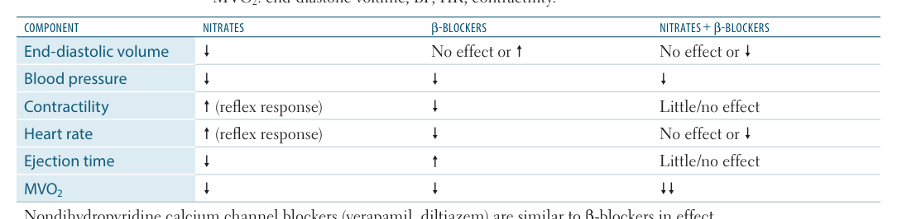
  
<em>First Aid for the USMLE Step 1 (2025) — PDF p. 344</em>

### Ranolazine

- Inhibits the late inward Na⁺ current.
- Reduces diastolic wall tension and myocardial oxygen use.
- Minimal effect on HR and BP.
- Used for refractory/chronic angina.
- Adverse effects include constipation, dizziness, headache, nausea, and **QT prolongation**.

### Sacubitril/valsartan

#### Mechanism
- **Sacubitril:** inhibits neprilysin → increases natriuretic peptides and other vasoactive peptides.
- **Valsartan:** blocks AT1 receptors.
- Combined effect promotes vasodilation and reduces extracellular volume.

#### Use
- HFrEF.

#### Adverse effects / precautions
- Hypotension
- Hyperkalemia
- Cough
- Dizziness
- Do not combine directly with an ACE inhibitor because of increased **angioedema** risk from bradykinin accumulation.

  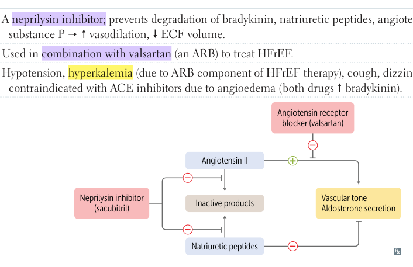
  
<em>First Aid for the USMLE Step 1 (2025) — PDF p. 345</em>

### Lipid-lowering agents

| Class | Main effect | Core mechanism | Important adverse effects |
|---|---|---|---|
| **Statins** | Large ↓LDL | HMG-CoA reductase inhibition → ↑hepatic LDL receptors | Hepatotoxicity, myopathy |
| **Bile-acid resins** | ↓LDL | Interrupt enterohepatic bile-acid recycling → increased hepatic cholesterol use | GI effects, reduced absorption of other drugs/vitamins |
| **Ezetimibe** | ↓LDL | Blocks intestinal cholesterol absorption | Diarrhea; occasional ↑LFTs |
| **Fibrates** | Major ↓TG, ↑HDL | PPAR-α activation → ↑LPL activity and TG clearance | Myopathy, especially with statins; gallstones |
| **Niacin** | ↓TG/LDL, ↑HDL | Decreases adipose lipolysis and hepatic VLDL synthesis | Flushing, hyperglycemia, hyperuricemia |
| **PCSK9 inhibitors** | Very large ↓LDL | Reduce LDL-receptor degradation | Myalgias and neurocognitive complaints |
| **Omega-3/fish oil** | Lower TG, small lipid effects otherwise | Reduces hepatic TG/VLDL production | Nausea/fishy taste |

  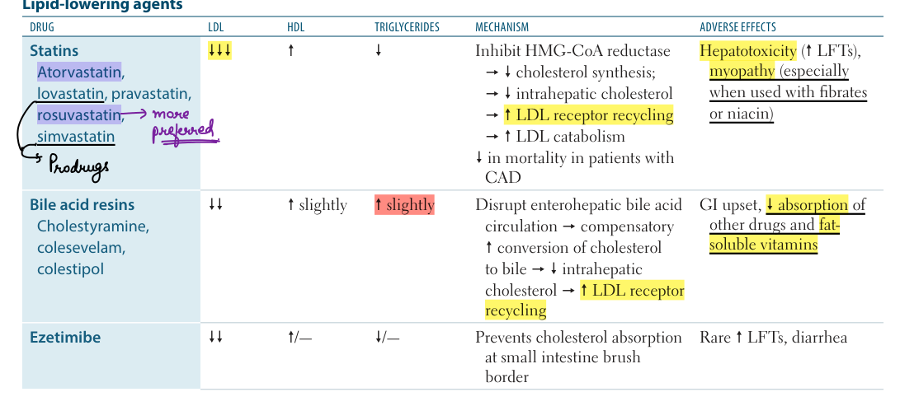
  
<em>First Aid for the USMLE Step 1 (2025) — PDF p. 345</em>

  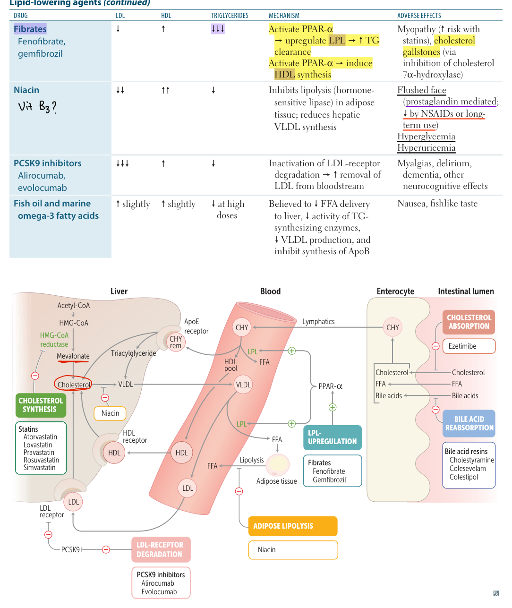
  
<em>First Aid for the USMLE Step 1 (2025) — PDF p. 346</em>

### Digoxin

#### Mechanism
- Inhibits **Na⁺/K⁺-ATPase**.
- Intracellular Na⁺ rises → Na⁺/Ca²⁺ exchange falls → intracellular Ca²⁺ rises → positive inotropy.
- Increases vagal activity → slows AV-node conduction and reduces HR.

#### Uses
- Selected HF patients
- Ventricular-rate control in AF

#### Toxicity
- GI/cholinergic effects: nausea, vomiting, diarrhea
- Visual disturbance with yellow-color perception
- Arrhythmias
- Hyperkalemia can accompany severe toxicity

Risk increases with:
- Renal failure
- Hypokalemia
- Drug interactions that increase digoxin exposure, including certain CCBs/antiarrhythmics

#### Treatment
- Anti-digoxin Fab fragments are the specific antidote.
- Correct important electrolyte abnormalities and manage arrhythmias/support circulation.

  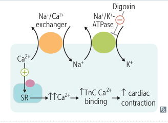
  
<em>First Aid for the USMLE Step 1 (2025) — PDF p. 347</em>

### Antiarrhythmics

#### Class I — Na⁺-channel blockers

General principle:
- Reduce conduction velocity by decreasing the slope of phase 0.
- Effects are more pronounced at faster heart rates and in depolarized tissue.
- Relative binding strength: **IC > IA > IB**.

##### Class IA
Drugs:
- Quinidine
- Procainamide
- Disopyramide

Effects:
- Moderate Na⁺ blockade
- Increased action-potential duration, ERP, and QT

Uses:
- Atrial and ventricular arrhythmias, especially reentrant rhythms

Adverse effects:
- Quinidine → cinchonism
- Procainamide → drug-induced lupus-like syndrome
- Disopyramide → negative inotropy/HF risk
- QT prolongation → torsades risk
- Thrombocytopenia can occur

  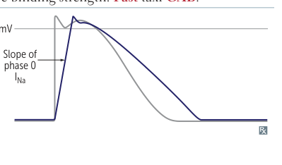
  
<em>First Aid for the USMLE Step 1 (2025) — PDF p. 347</em>

##### Class IB
Drugs:
- Lidocaine
- Mexiletine

Effects:
- Weak Na⁺ blockade
- Shortens AP duration
- Preferentially affects ischemic/depolarized ventricular/Purkinje tissue

Uses:
- Acute ventricular arrhythmias, especially post-MI
- Some digoxin-associated ventricular arrhythmias

Adverse effects:
- CNS toxicity/stimulation or depression
- Cardiovascular depression

  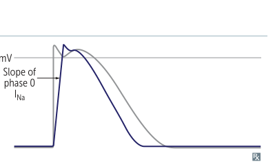
  
<em>First Aid for the USMLE Step 1 (2025) — PDF p. 347</em>

##### Class IC
Drugs:
- Flecainide
- Propafenone

Effects:
- Strong Na⁺ blockade
- Markedly slows conduction
- Little effect on overall AP duration

Uses:
- Selected SVTs/AF

Important caution:
- **Avoid in structural or ischemic heart disease/post-MI** because of proarrhythmic risk.

  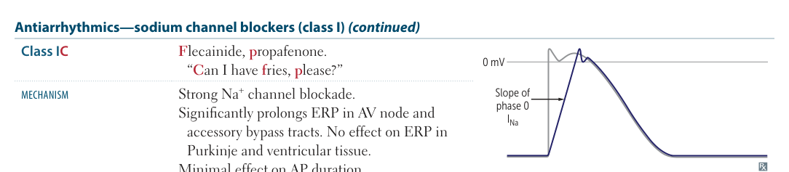
  
<em>First Aid for the USMLE Step 1 (2025) — PDF p. 348</em>

### Class II — β-blockers

Examples:
- Metoprolol
- Propranolol
- Esmolol
- Atenolol
- Timolol
- Carvedilol

#### Mechanism
- ↓cAMP → ↓Ca²⁺ currents.
- Reduce SA-node activity and slow AV-node conduction.
- Flatten phase 4 in pacemaker cells.
- Increase PR interval.

#### Uses
- SVT
- Ventricular-rate control in AF/flutter
- Prevention of post-MI ventricular arrhythmias

#### Adverse effects
- Bradycardia
- AV block
- HF worsening in the wrong clinical setting
- Bronchospasm with nonselective agents
- CNS effects
- Can mask hypoglycemia
- Sexual dysfunction

- Esmolol is very short acting.
- β-blocker overdose management includes supportive therapy with **glucagon** plus standard resuscitative measures.

  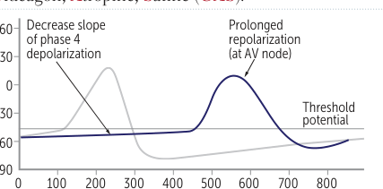
  
<em>First Aid for the USMLE Step 1 (2025) — PDF p. 348</em>

### Class III — K⁺-channel blockers

Drugs:
- Amiodarone
- Ibutilide
- Dofetilide
- Sotalol

Effects:
- Prolong repolarization, AP duration, ERP, and QT.

Uses:
- AF/flutter
- Ventricular tachycardia (especially amiodarone and sotalol)

#### Key toxicities

**Sotalol**
- Torsades de pointes
- β-blockade effects

**Ibutilide**
- Torsades de pointes

**Amiodarone**
- Pulmonary fibrosis
- Hepatotoxicity
- Hypothyroidism or hyperthyroidism
- Corneal deposits
- Photosensitive blue/gray skin change
- Neurologic effects
- Bradycardia/heart block/HF
- Long tissue half-life because of lipophilicity
- Possesses class I, II, III, and IV effects

Monitoring commonly includes **pulmonary, liver, and thyroid function**.

  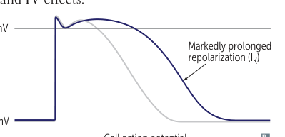
  
<em>First Aid for the USMLE Step 1 (2025) — PDF p. 349</em>

  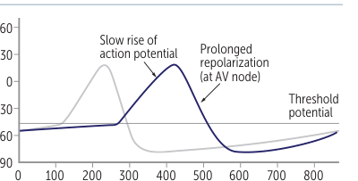
  
<em>First Aid for the USMLE Step 1 (2025) — PDF p. 349</em>

### Class IV — Ca²⁺-channel blockers

Drugs:
- Verapamil
- Diltiazem

Effects:
- Slow AV nodal conduction
- Increase AV nodal ERP
- Prolong PR

Uses:
- Ventricular-rate control in AF/flutter
- Prevention/termination of selected AV-nodal arrhythmias

Adverse effects:
- Constipation
- Flushing/edema
- Bradycardia
- AV block
- HF worsening
- Sinus-node suppression

### Other antiarrhythmics

#### Adenosine
- Increases K⁺ efflux and reduces inward Ca²⁺ current in AV nodal tissue.
- Hyperpolarizes the cell and transiently blocks AV-node conduction.
- Very short acting.
- Drug of choice for terminating many AV-node-dependent SVTs and useful diagnostically.
- Caffeine and theophylline blunt its effects.

Adverse effects:
- Flushing
- Hypotension
- Chest discomfort
- Sense of impending doom
- Bronchospasm

#### Magnesium
- Effective for torsades de pointes.
- Also used in significant digoxin toxicity.

#### Ivabradine
- Selectively inhibits the **If funny current**.
- Slows spontaneous phase-4 depolarization and heart rate.
- Used in chronic HFrEF in selected patients.
- Adverse effects: luminous visual phenomena, bradycardia, hypertension.
