# 1. Viral structure, genetics & genome rules

> **Source scope:** supplied First Aid 2025 Virology pages 159–173. Obvious OCR artifacts from the extracted text (e.g. broken symbols in influenza, ± signs and arrows) have been normalized against the supplied PDF visuals.

## Viral structure

### Core components

#### Capsid
- Protein shell surrounding the viral nucleic acid.
- May be **icosahedral** or **helical**.

#### Envelope
- Lipid bilayer with viral surface proteins/spikes.
- Most enveloped viruses acquire the envelope from the **plasma membrane** during exit.
- **Herpesviruses** are an exception: envelope acquired from the **nuclear membrane**.

#### Bacteriophage architecture
- Head/capsid
- Nucleic acid
- Collar
- Helical sheath + core
- Base plate
- Tail fibers/spikes

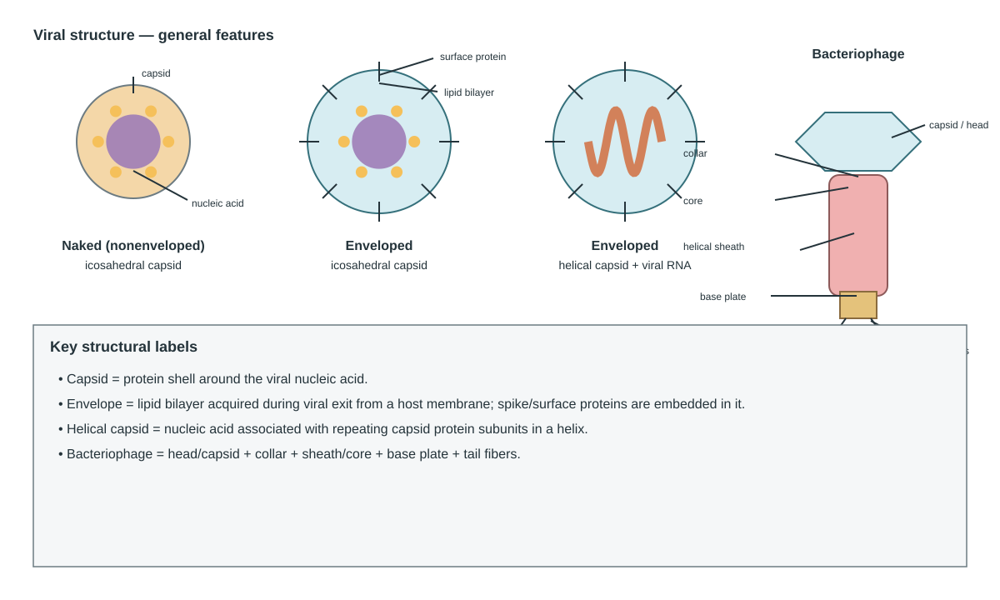

## Viral genetics

### Recombination
#### Definition
Exchange of genes between 2 chromosomes by crossing over within regions of significant base-sequence homology.

### Reassortment
#### Definition
Exchange of genome segments between viruses with **segmented genomes**.

#### High-yield example
The 2009 novel H1N1 influenza A pandemic arose through complex reassortment of genes from human, swine and avian influenza viruses.

### Complementation
#### Mechanism
One of 2 infecting viruses carries a mutation producing a nonfunctional protein. The nonmutated virus supplies a functional protein that serves both viruses.

#### Example
**HDV** requires replicating **HBV** to supply HBsAg, its envelope protein.

### Phenotypic mixing
#### Mechanism
During simultaneous infection with 2 viruses, the genome of virus A can be coated partly or completely with surface proteins from virus B, creating a pseudovirion.

#### Consequence
- The type-B protein coat determines the temporary tropism/infectivity of the hybrid progeny.
- After infection by that progeny, subsequent virions have the coat encoded by the progeny genome (type A).

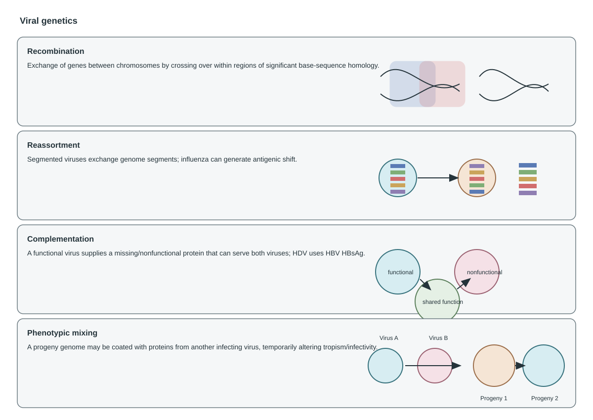

## Viral genomes

### DNA viruses
#### Genome pattern
- All have **dsDNA** except **Parvoviridae**, which has **ssDNA**.
- All are **linear** except:
  - Papillomaviruses — circular
  - Polyomaviruses — circular
  - Hepadnaviruses — circular

### RNA viruses
#### Genome pattern
- All have **ssRNA** except **Reoviridae**, which has **dsRNA**.

#### Positive-sense ssRNA (≈ mRNA)
- Retroviruses
- Togaviruses
- Flaviviruses
- Coronaviruses
- Hepevirus
- Caliciviruses
- Picornaviruses

#### Negative-sense ssRNA
- Arenaviruses
- Bunyaviruses
- Paramyxoviruses
- Orthomyxoviruses
- Filoviruses
- Rhabdoviruses

#### Segmented RNA viruses
- Bunyaviruses
- Orthomyxoviruses
- Arenaviruses
- Reoviruses

### Infectious naked nucleic acid
#### Infectious genomes
- Naked nucleic acids of most **dsDNA viruses** are infectious except **poxvirus and HBV**.
- Naked nucleic acids of **positive-sense ssRNA viruses** are infectious.

#### Noninfectious genomes
- Naked **negative-sense ssRNA** and **dsRNA** genomes are not infectious because the required polymerases are absent.
- Negative-sense ssRNA virions therefore carry **RNA-dependent RNA polymerase** to transcribe negative-sense RNA → positive-sense RNA.

## Viral replication location

### DNA viruses
All are described as **icosahedral** and replicate in the **nucleus**, except **poxvirus**.

#### Mnemonic
> **“Pox is out of the box.”** → Pox replicates outside the nucleus.

### RNA viruses
Most RNA viruses replicate in the **cytoplasm** except:
- **Retroviruses**
- **Influenza viruses**

#### Mnemonic
> **“Retro flu is outta cyt.”**

# 2. DNA viruses

## DNA virus overview

### High-yield family table

| Viral family | Envelope | DNA structure | Major medical importance |
|---|---|---|---|
| **Herpesviruses** | Yes | ds, linear | See Herpesviruses section |
| **Poxvirus** | Yes | ds, linear; largest DNA virus | Smallpox eradicated; cowpox; molluscum contagiosum |
| **Hepadnavirus** | Yes | partially ds, circular | HBV; acute/chronic hepatitis; reverse transcriptase |
| **Adenovirus** | No | ds, linear | Pharyngitis, cystitis, pneumonia, conjunctivitis, gastroenteritis, myocarditis |
| **Papillomavirus** | No | ds, circular | Warts; cervical, anal, penile and oropharyngeal cancer |
| **Polyomavirus** | No | ds, circular | JC → PML; BK → kidney/transplant disease |
| **Parvovirus** | No | ss, linear | B19; aplastic crises, fifth disease, fetal hydrops, pure RBC aplasia |

## DNA virus families

### Poxvirus

### Structure & replication
- Enveloped **dsDNA** virus.
- Linear genome.
- **Largest DNA virus**.
- Replicates outside the nucleus.

### Clinical associations
#### Smallpox
- Eradicated worldwide using the live-attenuated vaccine.

#### Cowpox
- “Milkmaid blisters.”

#### Molluscum contagiosum
- Flesh-colored papules with **central umbilication**.
- Keratinocytes contain **molluscum bodies**.

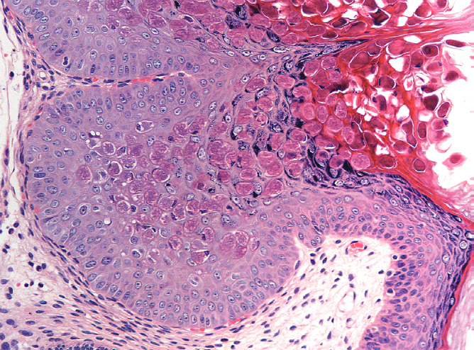

### Hepadnavirus (HBV)

### Key facts
- Enveloped DNA virus.
- **Partially dsDNA**, circular.
- Causes **acute or chronic hepatitis**.
- **Not a retrovirus**, but it has **reverse transcriptase**.

### Adenovirus

### Genome
- Nonenveloped **dsDNA**, linear.

### Clinical associations
- Febrile pharyngitis / sore throat
- Acute hemorrhagic cystitis
- Pneumonia
- Conjunctivitis (“pink eye”)
- Gastroenteritis
- Myocarditis

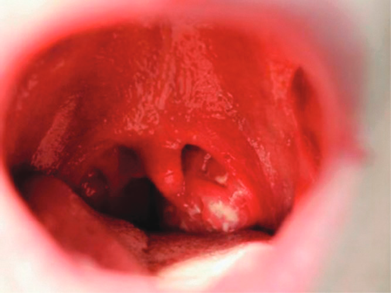

### Papillomavirus

### Genome & disease
- Nonenveloped **dsDNA**, circular.
- HPV causes **warts and cancer**.

### High-yield serotypes
#### Warts
- Types **1, 2, 6, 11**

#### Cancer
- Types **16, 18**
- Cervical, anal, penile and oropharyngeal cancer associations.

### Polyomavirus

### JC virus
- Causes **progressive multifocal leukoencephalopathy (PML)** in immunocompromised patients, especially HIV.

### BK virus
- Important in transplant patients.
- Commonly targets the **kidney**.

#### Mnemonic
- **JC = Junky Cerebrum**
- **BK = Bad Kidney**

### Parvovirus B19

### Genome
- Smallest DNA virus.
- **ssDNA**, linear.
- *Parvus* = small.

### Clinical associations
- Aplastic crises in **sickle cell disease**.
- **Erythema infectiosum (fifth disease)** with “slapped cheek” rash.
- Infects **RBC precursors** and endothelial cells.

### Consequences in the fetus
- RBC destruction
- Hydrops fetalis
- Fetal death

### Adult manifestations
- Pure RBC aplasia
- Rheumatoid arthritis–like symptoms

# 3. Herpesviruses & selected RNA viruses

## Herpesvirus family overview

### Shared properties
- Enveloped
- dsDNA
- Linear genome

> The source notes that both HSV-1 and HSV-2 can affect genital and extragenital sites.

## Alpha-herpesviruses

### Herpes simplex virus 1

### Transmission
- Respiratory secretions
- Saliva

### Clinical disease
#### Mucocutaneous
- Gingivostomatitis
- Keratoconjunctivitis
- Herpes labialis (“cold sores”)
- Herpetic whitlow

#### CNS / visceral
- Temporal lobe encephalitis
- Esophagitis
- Erythema multiforme

#### Latency
- Most commonly latent in the **trigeminal ganglia**.

### Encephalitis pearl
- Most common cause of **sporadic encephalitis**.
- May present with altered mental status, seizures and/or aphasia.

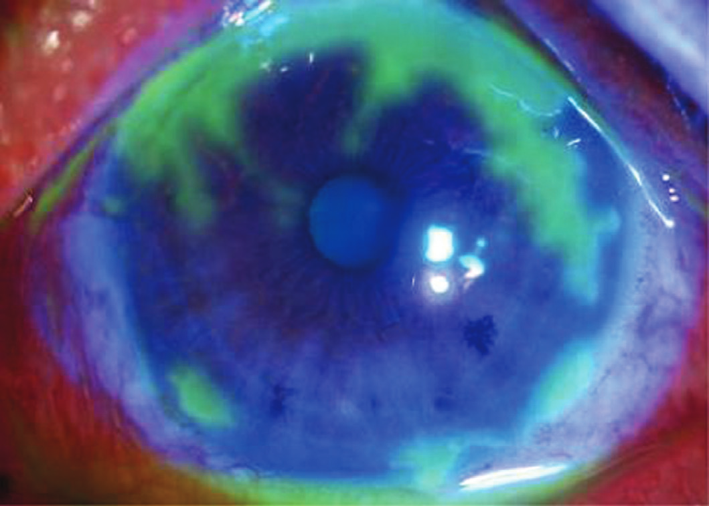

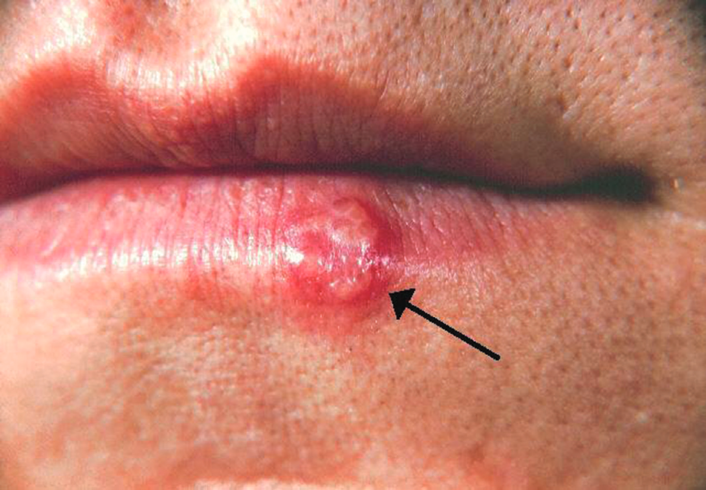

### Herpes simplex virus 2

### Transmission
- Sexual contact
- Perinatal

### Clinical disease
- Herpes genitalis
- Neonatal herpes
- Viral meningitis is more common with **HSV-2** than HSV-1.

### Latency
- Most commonly latent in **sacral ganglia**.

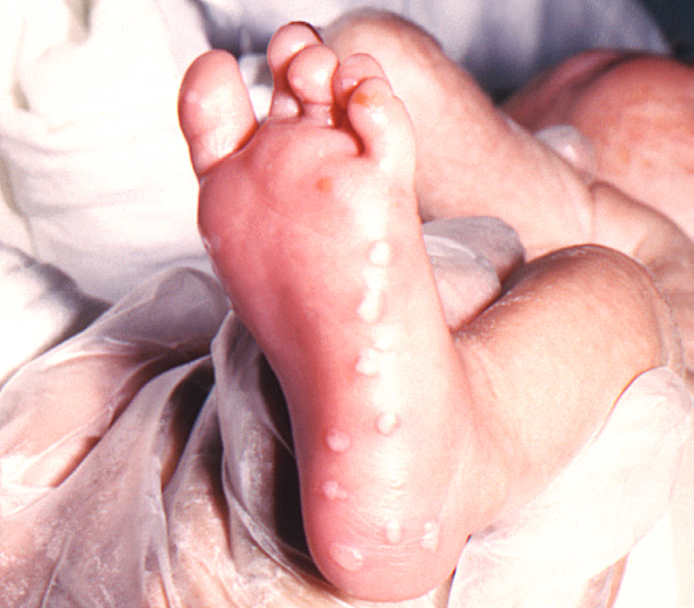

### Varicella-zoster virus (HHV-3)

### Transmission
- Respiratory secretions
- Contact with vesicular fluid

### Clinical disease
- Chickenpox (varicella)
- Shingles (herpes zoster)
- Encephalitis
- Pneumonia

### Latency
- Dorsal root or trigeminal ganglia.
- CN V1 involvement can cause **herpes zoster ophthalmicus**.

### Complication
- Most common complication of shingles = **postherpetic neuralgia**.

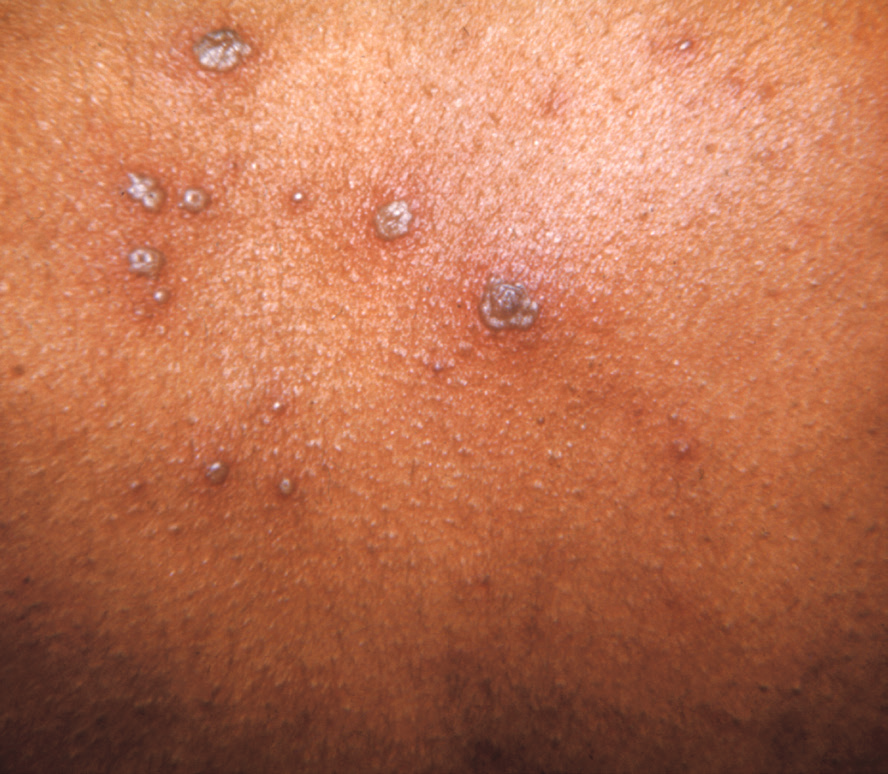

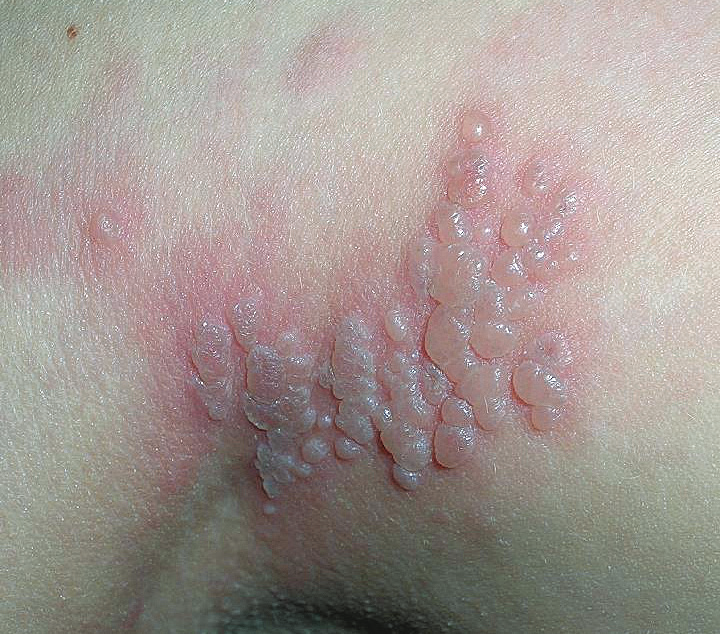

## Beta/Gamma herpesviruses

### Epstein-Barr virus (HHV-4)

### Transmission
- Respiratory secretions and saliva.
- “Kissing disease,” commonly in teens and young adults.

### Infectious mononucleosis
#### Core findings
- Fever
- Hepatosplenomegaly
- Pharyngitis
- Lymphadenopathy, especially **posterior cervical nodes**

#### Major caution
Avoid contact sports until resolution because of **splenic rupture risk**.

### Oncologic associations
- Endemic Burkitt lymphoma
- Nasopharyngeal carcinoma
- Lymphoproliferative disease in transplant patients

### Mechanism / laboratory clues
- Infects B cells through **CD21**.
- Atypical lymphocytes on peripheral smear are **reactive cytotoxic T cells**, not infected B cells.
- Monospot detects **heterophile antibodies** by agglutination of sheep or horse RBCs.
- Amoxicillin given for presumed streptococcal pharyngitis can cause a **maculopapular rash**.

#### Mnemonic
> **“Must be 21 to drink Beer in a Barr.”**

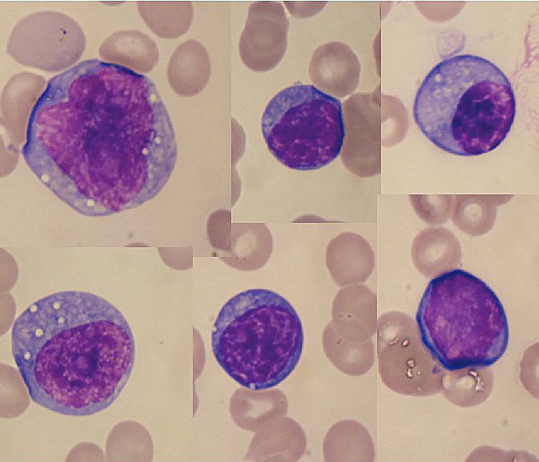

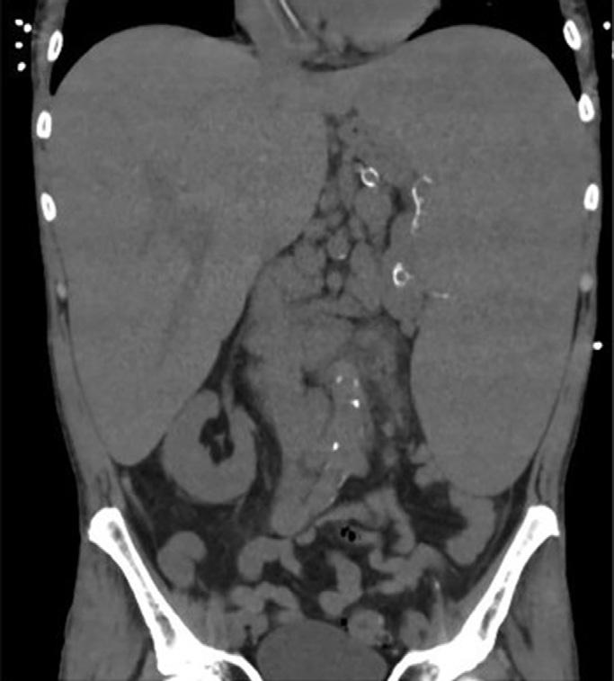

### Cytomegalovirus (HHV-5)

### Transmission
- Congenital
- Transfusion
- Sexual contact
- Saliva
- Urine
- Transplant

### Clinical disease
#### Immunocompetent patients
- Mononucleosis with **negative Monospot**.

#### Immunocompromised patients
- Pneumonia, especially in transplant patients
- Esophagitis
- Colitis
- AIDS retinitis with hemorrhage, cotton-wool exudates and vision loss

### Congenital CMV
- Infected cells show characteristic **“owl-eye” intranuclear inclusions**.

### Latency
- Mononuclear cells.

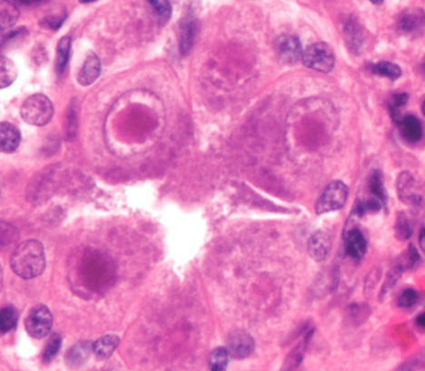

### HHV-6 and HHV-7

### Transmission
- Saliva

### Roseola infantum
- High fever for several days; may cause seizures.
- Fever is followed by a diffuse macular rash.
- Rash starts on the **trunk** and spreads to the extremities.
- Usually seen in children **<2 years**.
- Self-limited.
- HHV-7 is a less common cause.

#### Mnemonic
> **“Roseola: fever first, rosy rash later.”**

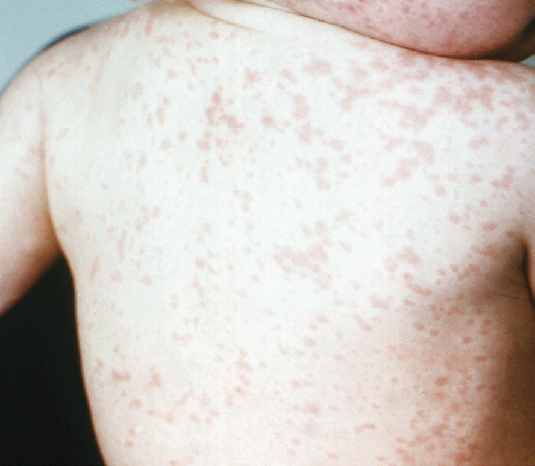

### HHV-8

### Transmission
- Sexual contact

### Kaposi sarcoma
- Neoplasm of endothelial cells.
- Seen in HIV/AIDS and transplant patients.
- Dark/violaceous plaques or nodules.
- Represents vascular proliferation.
- Can involve GI tract and lungs.

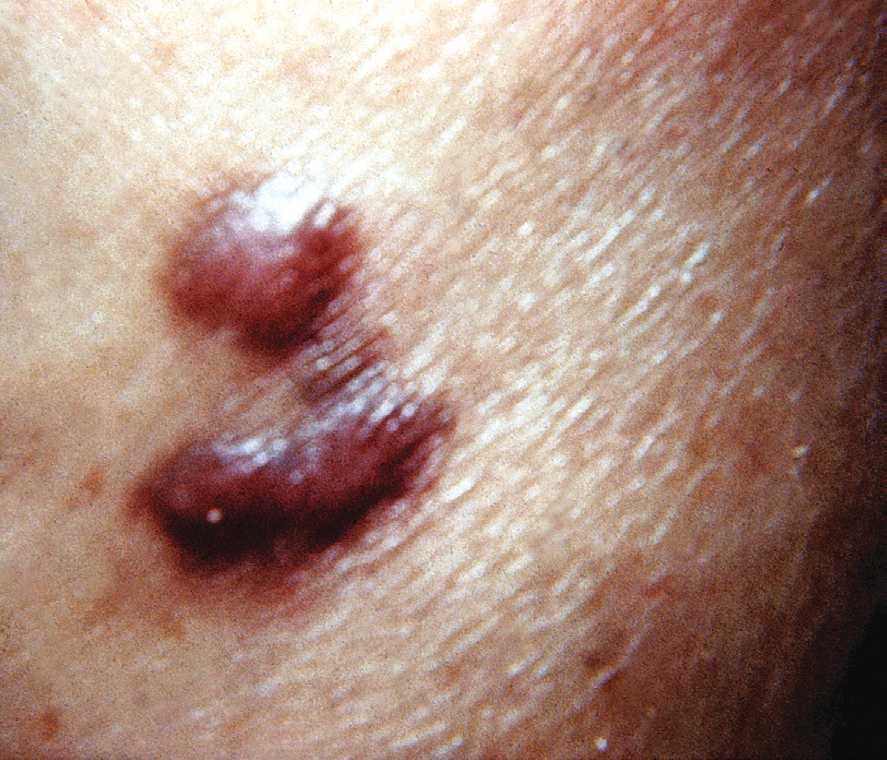

## HSV identification & receptors

### HSV identification

### Tests
- **PCR of skin lesions** = test of choice.
- **CSF PCR** for herpes encephalitis.
- **Tzanck test** is outdated; smear of opened vesicle looking for multinucleated giant cells.
- Intranuclear eosinophilic **Cowdry A inclusions** can be seen in HSV-1, HSV-2 and VZV.

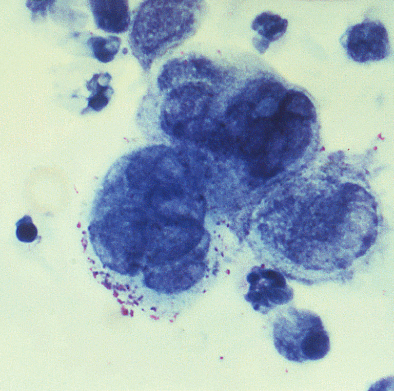

### Viral receptors

| Virus | Receptor(s) |
|---|---|
| **CMV** | Integrins (heparan sulfate) |
| **EBV** | CD21 |
| **HIV** | CD4, CXCR4, CCR5 |
| **Parvovirus B19** | P antigen on RBCs |
| **Rabies** | Nicotinic AChR |
| **Rhinovirus** | ICAM-1 |
| **SARS-CoV-2** | ACE2 |

#### Memory cues
- Rhinovirus → **ICAM-1** (“I came to see the rhino”)
- Parvovirus B19 → **P antigen**

## RNA virus family map

| Family | Envelope | RNA structure | High-yield associations |
|---|---|---|---|
| **Reoviruses** | No | ds, linear, multisegmented | Rotavirus |
| **Picornaviruses** | No | ss, +, linear | Polio, echovirus, rhinovirus, coxsackievirus, HAV |
| **Hepevirus** | No | ss, +, linear | HEV |
| **Caliciviruses** | No | ss, +, linear | Norovirus |
| **Flaviviruses** | Yes | ss, +, linear | HCV, yellow fever, dengue, West Nile, Zika |
| **Togaviruses** | Yes | ss, +, linear | Chikungunya; former classification of rubella; EEE/WEE |
| **Matonaviruses** | Yes | ss, +, linear | Rubella |
| **Retroviruses** | Yes | ss, +, linear | Reverse transcriptase; HTLV; HIV |
| **Coronaviruses** | Yes | ss, +, linear | Common cold, SARS, COVID-19, MERS |
| **Orthomyxoviruses** | Yes | ss, −, linear, multisegmented | Influenza |
| **Paramyxoviruses** | Yes | ss, −, linear | Parainfluenza, RSV, measles, mumps |
| **Pneumoviruses** | Yes | ss, −, linear | RSV |
| **Rhabdoviruses** | Yes | ss, −, linear | Rabies |
| **Filoviruses** | Yes | ss, −, linear | Ebola, Marburg |
| **Arenaviruses** | Yes | ss, ±, circular, multisegmented | LCMV, Lassa |
| **Bunyaviruses** | Yes | ss, −, circular, multisegmented | California encephalitis, Rift Valley, Crimean-Congo, Hantavirus |
| **Delta virus** | Yes | ss, −, circular | HDV; requires HBV |

#### Arbovirus marker
Superscript “a” in the source denotes **arbovirus = arthropod borne**, particularly mosquitoes and ticks.

# 4. Important RNA viruses

## Enteric / gut-associated RNA viruses

### Picornaviruses

### Family members
- Poliovirus
- Echovirus
- Rhinovirus
- Coxsackievirus
- HAV

### Replication strategy
RNA is translated into **one large polypeptide**, then cleaved by virus-encoded proteases into functional viral proteins.

### Enteroviruses
Poliovirus, echovirus and coxsackievirus are enteroviruses and can cause **aseptic meningitis**.

#### Mnemonic
> **PicoRNAvirus = small RNA virus.**

> **PERCH** on a “peak” (pico): **P**olio, **E**chovirus, **R**hinovirus, **C**oxsackievirus, **H**AV.

### Rhinovirus

### Key points
- Picornavirus
- Nonenveloped RNA virus
- Common cold
- >100 serologic types
- **Acid labile** → destroyed by gastric acid
- Therefore does not infect the GI tract unlike other picornaviruses.

#### Mnemonic
> **Rhino has a runny nose.**

### Rotavirus

### Virology
- Segmented **dsRNA** virus.
- Reovirus.

### Clinical disease
- Major cause of **infantile gastroenteritis** worldwide.
- Winter diarrhea, including in day-care/kindergarten settings.
- Villous destruction and atrophy → reduced Na⁺ reabsorption and K⁺ loss.

### Vaccination
Routine infant vaccination is recommended except with:
- Previous **intussusception**
- **SCID**

#### Mnemonic
> **Rotavirus = right out the anus.**

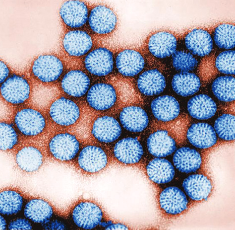

## Influenza viruses

### Family & genome
- Orthomyxoviruses
- Enveloped
- **−ssRNA**
- **Segmented** genome

### Surface antigens
#### Hemagglutinin (HA)
- Binds **sialic acid**.
- Promotes viral entry.

#### Neuraminidase (NA)
- Promotes progeny virion release.

#### Mnemonic
> **Hemagglutinin: lets the virus in.**
>
> **Neuraminidase: sends the virus away.**

### Complication
Patients are at risk for fatal bacterial superinfection, especially:
- *Staphylococcus aureus*
- *Streptococcus pneumoniae*
- *Haemophilus influenzae*

### Treatment
- Supportive care
- ± neuraminidase inhibitor:
  - Oseltamivir
  - Zanamivir

### Vaccines
#### Inactivated vaccine
- Most frequently used.

#### Live attenuated vaccine
- Temperature-sensitive mutant.
- Replicates in the nose but not lungs.
- Intranasal.

### Antigenic shift
#### Mechanism
- Coinfection of 1 cell by 2 different segmented influenza viruses.
- RNA segment **reassortment**.
- Produces a dramatically different virus.
- Can produce **pandemics**.

### Antigenic drift
#### Mechanism
- Random mutations in HA or NA genes.
- Minor changes in HA/NA occur frequently.
- Associated with **seasonal epidemics**.

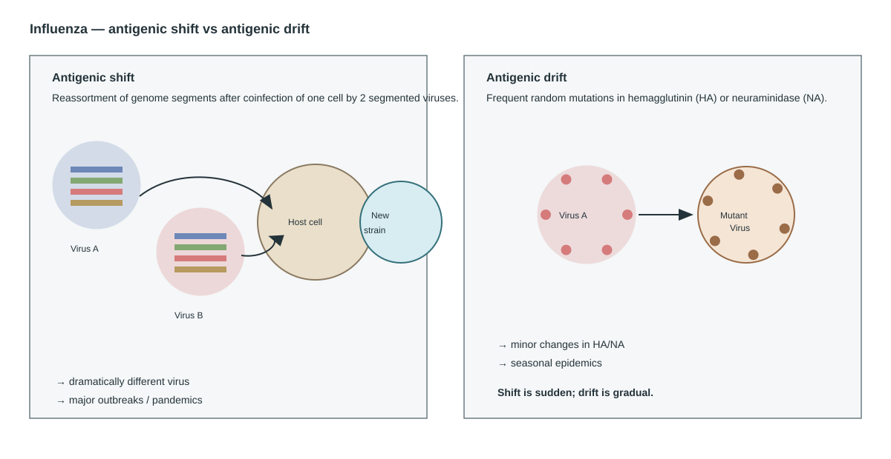

## Rubella virus

### Classification
- Matonavirus.
- Formerly classified as a togavirus.

### Clinical disease
- Rubella (“German measles”)
- Fever
- Postauricular and other lymphadenopathy
- Arthralgias
- Fine maculopapular rash that starts on face and spreads centrifugally to trunk and extremities

### Congenital rubella
Rubella is a **TORCH infection** and may cause:
- Sensorineural deafness
- Cataracts
- Patent ductus arteriosus
- “Blueberry muffin” appearance from dermal extramedullary hematopoiesis

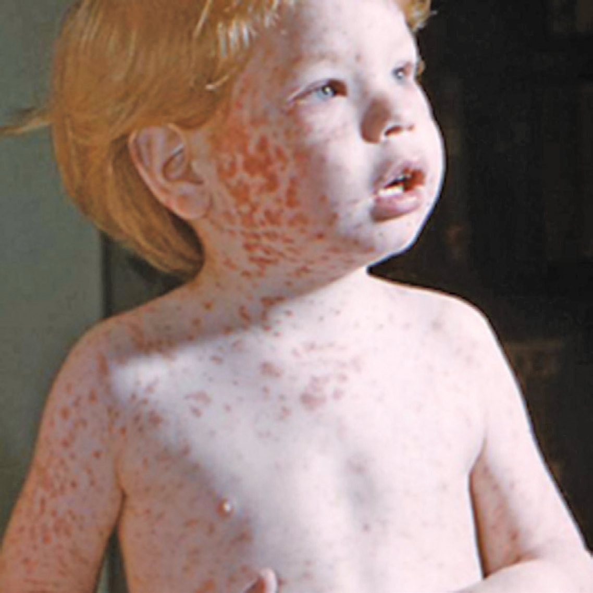

## Paramyxoviruses & pneumoviruses

### Common clinical group
Source groups the pediatric respiratory viruses together as paramyxoviruses/pneumoviruses, including:
- Parainfluenza
- Mumps
- Measles
- RSV
- Human metapneumovirus

### Fusion protein
- Surface **F (fusion) protein** causes respiratory epithelial cells to fuse.
- Produces multinucleated cells.

### RSV prophylaxis
**Palivizumab** is a monoclonal antibody against the F protein used to prevent RSV pneumonia in premature infants.

### Croup — acute laryngotracheobronchitis

### Cause
- Parainfluenza viruses.

### Clinical features
- “Seal-like” barking cough
- Inspiratory stridor
- Narrowing of upper trachea/subglottis
- Characteristic **steeple sign** on X-ray

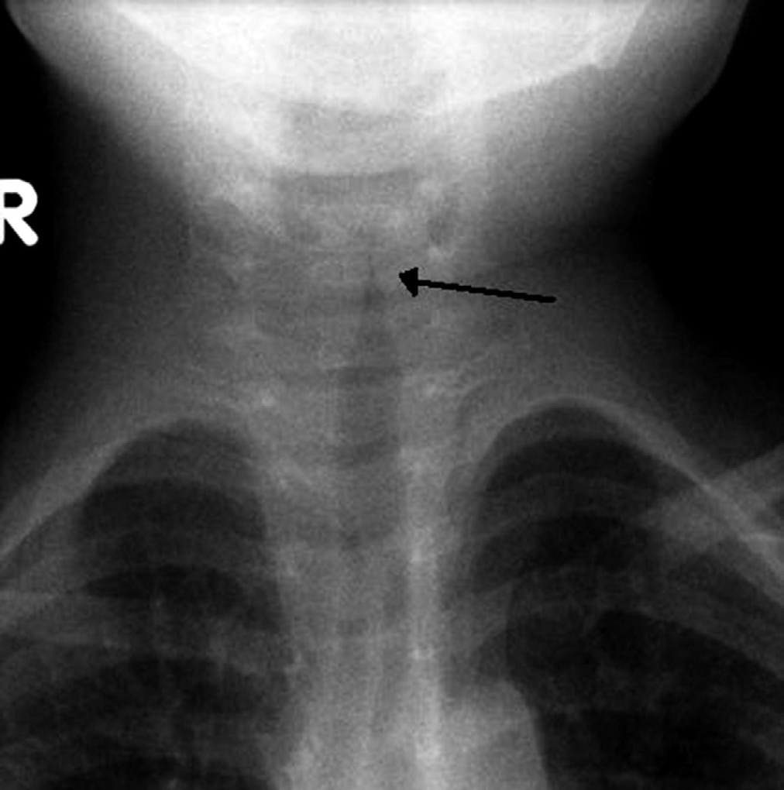

### Measles (rubeola)

### Classic presentation
#### Prodrome
- Fever
- **Cough**
- **Coryza**
- **Conjunctivitis**

#### Enanthem
- **Koplik spots**: bright red spots with blue-white centers on buccal mucosa.

#### Rash
- Maculopapular rash starts at **head/neck** and spreads downward.
- Appears 1–2 days after Koplik spots.

### Histology / pathology
- Lymphadenitis with **Warthin-Finkeldey giant cells**.
- Fused lymphocytes with paracortical hyperplasia.

### Complications
#### SSPE
- Subacute sclerosing panencephalitis
- Personality changes
- Dementia
- Autonomic dysfunction
- Death
- Occurs years later.

#### Encephalitis
- About 1:1000.
- Appears within days of rash.

#### Giant cell pneumonia
- Rare except in immunosuppressed patients.

### Mnemonic: 4 C’s
1. Cough
2. Coryza
3. Conjunctivitis
4. “C”oplik spots

### Vitamin A
Vitamin A supplementation can reduce morbidity and mortality, especially in malnourished children.

### Mortality pearl
Pneumonia is the most common cause of measles-associated death in children.

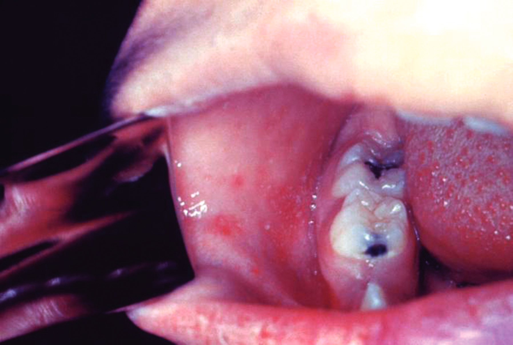

### Mumps virus

### Key points
Less common because of MMR vaccination.

### Clinical features
- **Parotitis**
- Orchitis
- Aseptic meningitis
- Pancreatitis
- Can cause sterility, especially after puberty.

#### Mnemonic
> **POM-Poms** → Parotitis, Orchitis, Meningitis, Pancreatitis.

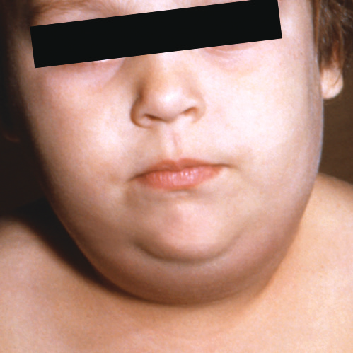

## Aedes arboviruses

### Chikungunya vs dengue

| Feature | Chikungunya | Dengue |
|---|---|---|
| Family/type | Alphavirus / togavirus | Flavivirus |
| Fever/rash | High fever, maculopapular rash | Fever, rash |
| Pain | Arthralgias more common; **joint swelling highly specific** | Myalgias, arthralgias, retro-orbital pain |
| Hematology | Thrombocytopenia, leukopenia and hemorrhage less common | Thrombocytopenia and hemorrhagic manifestations more important |
| Severe disease | Chronic inflammatory arthritis may occur | Dengue hemorrhagic fever → plasma leakage; dengue shock syndrome |
| Diagnosis | RT-PCR, serology | RT-PCR, serology |
| Treatment | Supportive; steroids/DMARDs for chronic arthritis | Supportive; volume repletion or transfusion for severe shock |
| Prevention | Minimize mosquito exposure; source states no vaccine currently available | Live recombinant vaccine described in source |

### Dengue hemorrhagic fever
- Dengue fever + bleeding and plasma leakage.
- More common after infection with a **different serotype** because of antibody-dependent enhancement.
- May progress to **dengue shock syndrome** → plasma leakage → circulatory collapse.

#### Yellow fever
#### Classification
- Flavivirus
- Arbovirus
- Aedes transmission
- Monkey or human reservoir

#### Clinical features
- High fever
- Black vomitus
- Jaundice
- Hemorrhage
- Backache

#### Pathology / prevention
- **Councilman bodies** may be seen on liver biopsy.
- Live attenuated vaccine recommended for travelers to endemic countries.

#### Zika virus
#### Transmission
- Most commonly Aedes mosquitoes.
- Sexual transmission also occurs.
- Vertical transmission occurs.

#### Clinical features
- Conjunctivitis
- Low-grade fever
- Itchy rash
- Guillain-Barré syndrome may complicate disease.

#### Pregnancy
May cause miscarriage or **congenital Zika syndrome**:
- Ventriculomegaly
- Subcortical calcifications
- Microcephaly
- Ocular anomalies
- Motor abnormalities, spasticity, seizures

#### Diagnosis / treatment
- RT-PCR or serology
- Supportive care; no definitive treatment described in the source.

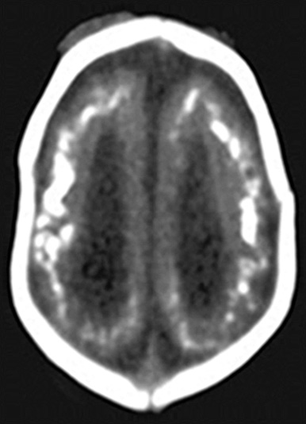

## Rabies, Ebola & SARS-CoV-2

### Rabies virus

### Virology
- **Bullet-shaped** virus.

### Pathology
- **Negri bodies** = cytoplasmic inclusions.
- Commonly found in Purkinje cells of cerebellum and hippocampal neurons.

### Neuroinvasion
- Binds **ACh receptors**.
- Travels retrograde up axons via **dynein motors** to the CNS.

### Incubation
- Long: weeks to months.

### Disease progression
Fever, malaise → agitation, photophobia, hydrophobia, hypersalivation → paralysis, coma → death.

### Postexposure prophylaxis
- Wound cleaning
- Killed vaccine
- Rabies immunoglobulin

#### Immunologic principle
This is an example of **passive-active immunity**.

### Reservoir / exposure
In the US, infection is more commonly from bat, raccoon and skunk bites than dog bites. Aerosol transmission can occur in settings such as bat caves.

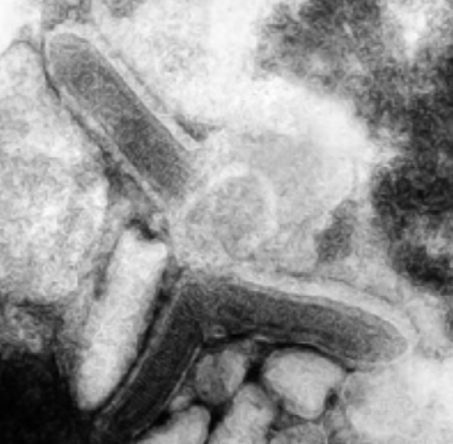

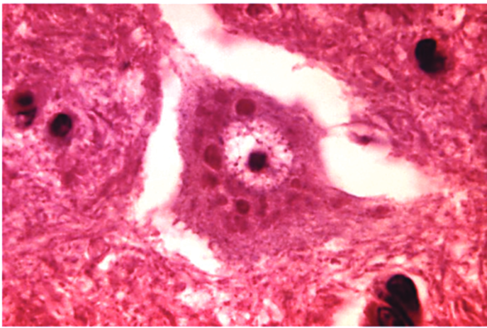

### Ebola virus

### Virology
- Filovirus.

### Clinical disease
After incubation up to 21 days:
- Abrupt flu-like illness
- Diarrhea/vomiting
- High fever
- Myalgia
- Can progress to DIC, diffuse hemorrhage and shock

### Diagnosis
- RT-PCR within 48 hours of symptom onset.

### Transmission
- Direct contact with bodily fluids
- Fomites, including dead bodies
- Infected bats or primates (apes/monkeys)
- High healthcare-associated risk

### Prevention / management
- Supportive care
- No definitive treatment stated in the source
- Vaccination of contacts
- Strict isolation
- Barrier practices for healthcare workers

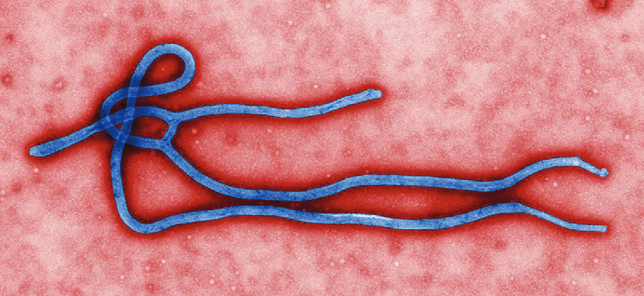

### SARS-CoV-2

### Virology
- Positive-sense **ssRNA coronavirus**.
- Cause of COVID-19.

### Transmission
- Respiratory droplets
- Aerosols
- Fomites

### Clinical features
- Fever
- Myalgia
- Headache
- Nasal congestion
- Sneezing
- Cough
- Sore throat
- Nausea
- Diarrhea
- Anosmia
- Dysgeusia

### Severe complications
- Pneumonia
- Hypercoagulability: DVT, PE, stroke
- Myocardial injury
- Neurologic sequelae
- Shock
- Organ failure
- Death

### Diagnosis
- **NAAT (RT-PCR) — preferred sensitive laboratory method in the source**
- Viral antigen test (RAT) — rapid and accessible, less sensitive than NAAT

### Cell entry
- Viral spike protein binds **ACE2**.
- ACE2 is highly expressed in lungs, intestines, heart and kidneys.

### Vaccines
- mRNA and viral-vector vaccines present the spike protein to the immune system → anti-spike antibodies.

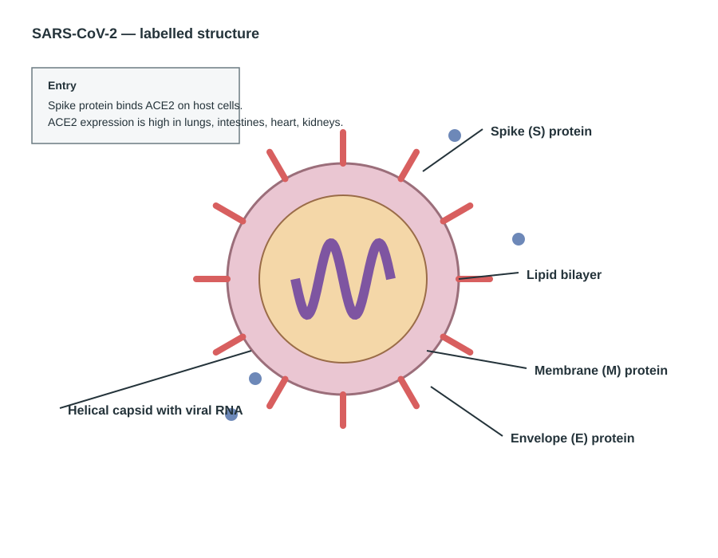

# 5. Hepatitis viruses

## Hepatitis virus overview

### Shared clinical pattern
Episodes of:
- Fever
- Jaundice
- ↑ ALT / AST

### Enteric naked viruses
**HAV and HEV** are nonenveloped and survive passage through the gut.

#### Mnemonic
> **“The vowels hit your bowels.”** → HAV + HEV are naked.

## HAV

### Family / transmission
- RNA picornavirus
- Fecal-oral
- Shellfish, travelers, day-care exposure

### Incubation / course
- Short (weeks)
- Acute and self-limiting in adults
- Asymptomatic in children in the source table

### Prognosis / chronicity
- Good prognosis
- No carrier state

### Liver biopsy
- Hepatocyte swelling
- Monocyte infiltration
- **Councilman bodies**

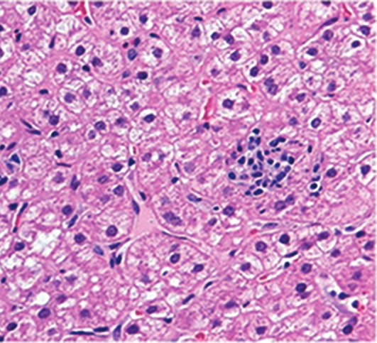

## HBV

### Family / transmission
- DNA hepadnavirus
- Parenteral blood exposure
- Sexual transmission
- Perinatal transmission

### Incubation / course
- Long incubation (months)
- Initially serum-sickness-like illness: fever, arthralgia, rash
- May progress to carcinoma

### Prognosis
- Adults → mostly full resolution
- Neonates → worse prognosis
- Carrier state common

### Liver biopsy
- Granular eosinophilic **“ground-glass”** hepatocytes due to accumulation of surface antigen.
- Cytotoxic T cells mediate damage.

### HBV polymerase
#### Entry into nucleus
- Viral polymerase completes the partial dsDNA.

#### Transcription
- Host RNA polymerase makes mRNA from viral DNA.

#### Genome formation in progeny
- Viral DNA polymerase reverse transcribes viral RNA → DNA for progeny virions.

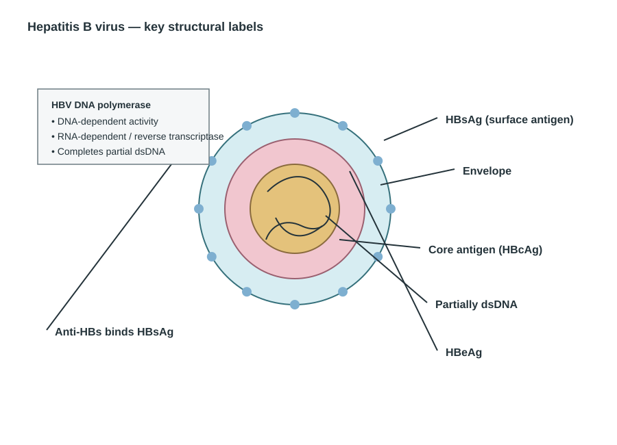

## HCV

### Family / transmission
- RNA flavivirus
- Primarily blood
- Injection drug use and posttransfusion exposure are emphasized in the source.

### Incubation / course
- Long incubation.
- May progress to cirrhosis or carcinoma.
- Majority develop stable **chronic hepatitis C**.
- Carrier state very common.

### Molecular pearl
HCV lacks **3′→5′ exonuclease** proofreading activity → antigenic variation of envelope proteins.

### Liver biopsy
- Lymphoid aggregates
- Focal macrovesicular steatosis

## HDV & HEV

### HDV

### Family / transmission
- RNA deltavirus
- Parenteral, sexual and perinatal transmission

### Replication dependency
- **Defective virus**.
- Requires **HBV HBsAg coat** for entry into hepatocytes and therefore requires HBV.

### Coinfection vs superinfection
- **Coinfection (HDV + HBV)** → long incubation.
- **Superinfection (HDV after HBV)** → short incubation and worse prognosis.

### HCC risk
Yes, in the source table.

### HEV

### Family / transmission
- RNA hepevirus
- Fecal-oral, especially waterborne

### Course / prognosis
- Short incubation.
- Fulminant hepatitis in **pregnant patients**.
- High mortality in pregnant patients.
- No carrier state.
- Enteric/epidemic, including parts of Asia, Africa and the Middle East.

## Hepatitis comparison, extrahepatic disease & serology

### Hepatitis comparison table

| Feature | HAV | HBV | HCV | HDV | HEV |
|---|---|---|---|---|---|
| Family | RNA picornavirus | DNA hepadnavirus | RNA flavivirus | RNA deltavirus | RNA hepevirus |
| Envelope | No | Yes | Yes | Uses HBV HBsAg | No |
| Transmission | Fecal-oral | Blood, sexual, perinatal | Primarily blood | Parenteral, sexual, perinatal | Fecal-oral, waterborne |
| Incubation | Short | Long | Long | Superinfection short; coinfection long | Short |
| Chronicity / carrier state | No | Common | Very common | Depends on HBV | No |
| HCC risk | No | Yes | Yes | Yes | No |

### Extrahepatic manifestations of HBV and HCV

| System | Hepatitis B | Hepatitis C |
|---|---|---|
| **Hematologic** | Aplastic anemia | Essential mixed cryoglobulinemia; ↑ B-cell NHL risk; ITP; autoimmune hemolytic anemia |
| **Renal** | Membranous GN > membranoproliferative GN | Membranoproliferative GN > membranous GN |
| **Vascular** | Polyarteritis nodosa | Leukocytoclastic vasculitis |
| **Dermatologic** | — | Sporadic porphyria cutanea tarda; lichen planus |
| **Endocrine** | — | ↑ diabetes mellitus risk; autoimmune hypothyroidism |

### Hepatitis serologic markers

### Anti-HAV (IgM)
- IgM antibody to HAV.
- Best test to detect **acute hepatitis A**.

### Anti-HAV (IgG)
- Indicates prior HAV infection and/or prior vaccination.
- Protects against reinfection.

### HBsAg
- Surface antigen of HBV.
- Indicates **hepatitis B infection**.

### Anti-HBs
- Antibody to HBsAg.
- Indicates immunity due to vaccination or recovery from infection.

### HBcAg
- Antigen associated with the **core** of HBV.

### Anti-HBc
- Antibody to HBcAg.
- **IgM** → acute/recent infection.
- **IgG** → prior exposure or chronic infection.
- IgM anti-HBc may be the **sole positive marker during the window period**.

### HBeAg
- Secreted by infected hepatocytes into circulation.
- Not part of the mature virion.
- Indicates active viral replication, high transmissibility and poorer prognosis.

### Anti-HBe
- Antibody to HBeAg.
- Indicates lower transmissibility.

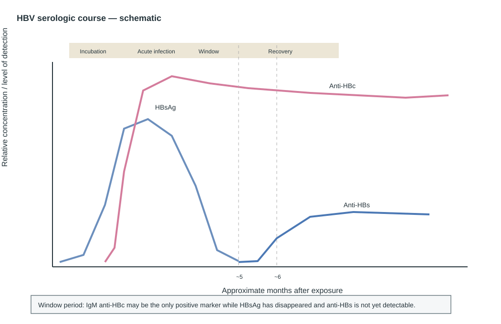

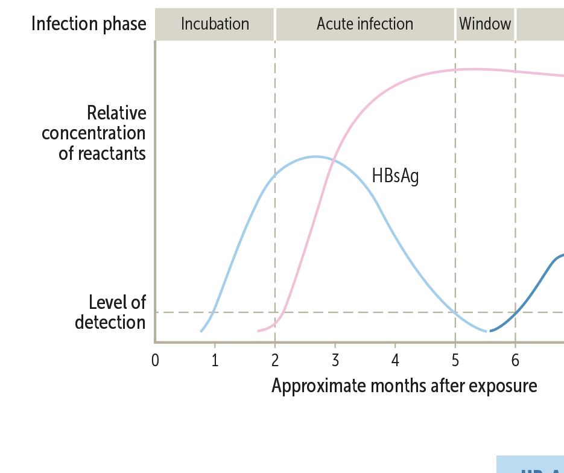

# 6. HIV & HIV-associated infections

## HIV structure

### Genome
- **Diploid genome:** 2 molecules of ssRNA.

### Structural genes
#### env
##### Products & functions
- Produces gp160 precursor.
- Cleaved into **gp120 + gp41**.
###### gp120
- Attachment to CD4+ T cells.
###### gp41
- Fusion and entry.
#### gag
- Produces **p24 capsid** and **p17 matrix** proteins.
#### pol
- Reverse transcriptase
- Integrase
- Protease
##### Mnemonic
> **RIP “Pol” (Paul)** → Reverse transcriptase, Integrase, Protease.

### Reverse transcription & integration
- Reverse transcriptase synthesizes dsDNA from genomic RNA.
- dsDNA integrates into the host genome.

### Coreceptors
- **CCR5** on macrophages → emphasized in early infection.
- **CXCR4** on T cells → emphasized in late infection.

### CCR5 mutation pearl
- Homozygous CCR5 mutation → immunity in the source.
- Heterozygous CCR5 mutation → slower course.
![[Virology 2026-10-02 15.40.37.excalidraw]]

## HIV diagnosis

### Initial test
**HIV-1/2 Ag/Ab combination immunoassay** detects:
- Viral p24 antigen
- IgG and/or IgM against HIV-1/2

#### Performance / role
- Very high sensitivity and specificity.
- Can miss early disease if tested within the first ~2 weeks.
- Positive screening test → HIV-1/HIV-2 differentiation immunoassay.

### Differentiation immunoassay
#### Outcomes
- HIV-1 infection
- HIV-2 infection
- HIV-1 and HIV-2 infection
- HIV-1 negative / indeterminate patterns prompting NAT

### HIV-1 NAT
- Used after a negative/indeterminate differentiation result.
- Positive → **acute HIV-1 infection**.
- Negative → negative for HIV-1.

### HIV RNA tests
#### NAAT
- Qualitative.
- Sensitive for HIV viremia in antibody-negative patients.

#### Viral load (RT-PCR)
- Quantitative.
- Measures plasma HIV RNA.
- Used to monitor treatment response and transmissibility.

### Tests no longer recommended in the source
- **Western blot** is no longer recommended by the CDC for confirmatory testing.

### Infants with suspected HIV
- HIV-1/2 Ag/Ab testing is not recommended because maternal antibody can confound results.
- Use **HIV viral load** testing.

### AIDS diagnosis
- CD4+ count **≤200 cells/mm³**, or
- HIV positivity with an AIDS-defining condition such as *Pneumocystis* pneumonia.

## Common diseases in HIV-positive adults

### General pattern with falling CD4 count
Lower CD4 count → reactivation of past infections (e.g. TB, HSV, shingles), dissemination of bacterial and fungal infections (e.g. coccidioidomycosis), and non-Hodgkin lymphomas.

### CD4+ <500/mm³

| Pathogen | Presentation | Findings |
|---|---|---|
| **Candida albicans** | Oral thrush | Scrapable white plaque; pseudohyphae on microscopy |
| **EBV** | Oral hairy leukoplakia | Unscrapable white plaque on lateral tongue |
| **HHV-8** | Localized Kaposi sarcoma | Perivascular spindle cells forming vascular tumors on histology |
| **HPV** | Squamous cell carcinoma at sexually exposed sites | Commonly anus, cervix, oropharynx |
| **Mycobacterium tuberculosis** | Reactivation of latent TB | Increased reactivation risk |

### CD4+ <200/mm³

| Pathogen | Presentation | Findings |
|---|---|---|
| **Histoplasma capsulatum** | Fever, weight loss, fatigue, cough, dyspnea, nausea/vomiting, diarrhea | Oval yeast cells within macrophages |
| **HIV** | Dementia; HIV-associated nephropathy | Cerebral atrophy on neuroimaging |
| **JC virus (reactivation)** | PML | Nonenhancing demyelination on MRI |
| **HHV-8** | Disseminated Kaposi sarcoma | Pulmonary, GI, lymphatic involvement |
| **Pneumocystis jirovecii** | Pneumocystis pneumonia | “Ground-glass” opacities on chest imaging |

### CD4+ <100/mm³

| Pathogen | Presentation | Findings |
|---|---|---|
| **Bartonella spp.** | Bacillary angiomatosis | Multiple red-purple papules/nodules; neutrophilic inflammation on biopsy |
| **Candida albicans** | Esophagitis | White plaques on endoscopy; yeast and pseudohyphae on biopsy |
| **CMV** | Colitis, retinitis, esophagitis, encephalitis, pneumonitis (**CREEP**) | Linear ulcers, cotton-wool spots; owl-eye inclusions on biopsy |
| **Cryptococcus neoformans** | Meningitis | Encapsulated yeast on India ink or positive capsular antigen |
| **Cryptosporidium spp.** | Chronic watery diarrhea | Acid-fast oocysts in stool |
| **EBV** | B-cell lymphoma, including CNS lymphoma | CNS lymphoma may be ring-enhancing and may be solitary |
| **Mycobacterium avium–intracellulare / MAC** | Systemic symptoms or superficial lymphadenitis | Most common if CD4+ <50/mm³ |
| **Toxoplasma gondii** | Brain abscesses | Multiple ring-enhancing lesions on MRI |

## High-yield CD4 threshold map

### <500/mm³
- Oral candidiasis
- Oral hairy leukoplakia
- Localized Kaposi sarcoma
- HPV-related squamous cell carcinoma
- TB reactivation risk

### <200/mm³
- Histoplasmosis
- PML
- Disseminated Kaposi sarcoma
- Pneumocystis pneumonia

### <100/mm³
- Bacillary angiomatosis
- Candida esophagitis
- CMV disease
- Cryptococcosis
- Cryptosporidiosis
- CNS lymphoma
- MAC
- Toxoplasmosis

---

