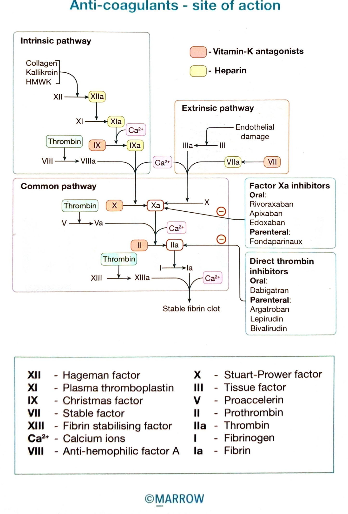

  # Classification of Anticoagulants

  Pearl ID: PM0609

  #flashcards

  **What are the key facts in the Marrow Pearl "Classification of Anticoagulants" (PM0609)?**

  ?

  

  The figure classifies anticoagulants by site of action in the coagulation cascade.

  **Agents explicitly shown in the figure:**

  - **Vitamin-K antagonists** - shown acting in the common/extrinsic pathway.
  - **Heparin** - shown at multiple thrombin/coagulation-factor sites.
  - **Factor Xa inhibitors**
    - Oral: rivaroxaban, apixaban, edoxaban
    - Parenteral: fondaparinux
  - **Direct thrombin inhibitors**
    - Oral: dabigatran
    - Parenteral: argatroban, lepirudin, bivalirudin
