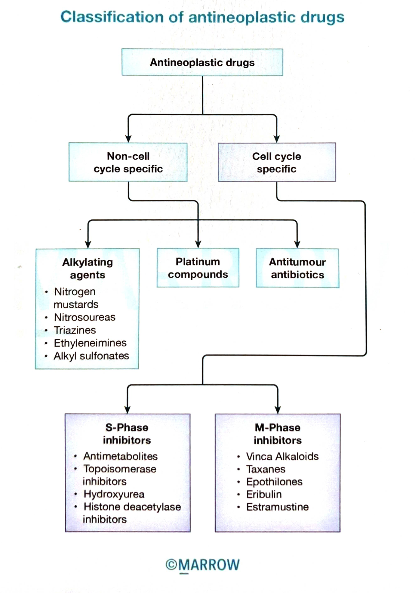

  # Classification of antineoplastic drugs

  Pearl ID: PM1353

  #flashcards

  **What are the key facts in the Marrow Pearl "Classification of antineoplastic drugs" (PM1353)?**

  ?

  

  ### Non-cell-cycle-specific

  - **Alkylating agents:** nitrogen mustards, nitrosoureas, triazines, ethyleneimines, alkyl sulfonates
  - **Platinum compounds**
  - **Antitumour antibiotics**

  ### Cell-cycle-specific

  **S-phase inhibitors**

  - Antimetabolites
  - Topoisomerase inhibitors
  - Hydroxyurea
  - Histone deacetylase inhibitors

  **M-phase inhibitors**

  - Vinca alkaloids
  - Taxanes
  - Epothilones
  - Eribulin
  - Estramustine
