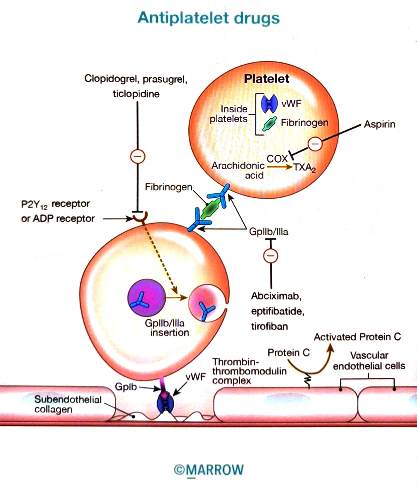

  # Classification of anti-platelet drugs

  Pearl ID: PM2398

  #flashcards

  **What are the key facts in the Marrow Pearl "Classification of anti-platelet drugs" (PM2398)?**

  ?

  

  | Class | Drugs |
  |---|---|
  | Cyclooxygenase-1 inhibitors | Aspirin |
  | Irreversible P2Y₁₂ inhibitors | Ticlopidine, Clopidogrel, Prasugrel |
  | Reversible P2Y₁₂ inhibitors | Ticagrelor, Cangrelor |
  | GPIIb/IIIa inhibitors | Abciximab, Eptifibatide, Tirofiban |
  | Thrombin (PAR-1) receptor antagonist | Vorapaxar |
  | Phosphodiesterase inhibitors | Dipyridamole |

  The figure also shows platelet targets involving the P2Y₁₂/ADP receptor, GPIb, GPIIb/IIIa, COX/TXA₂, and the thrombin-thrombomodulin/protein C pathway.
