# Forensic Medicine Test - 27 September 2026

## OMR Marking Note

The **Marked answer** under each question is transcribed from the supplied OMR sheet. **Not marked** means no option bubble was visibly filled. The handwritten last five digits of the mobile number were intentionally ignored.

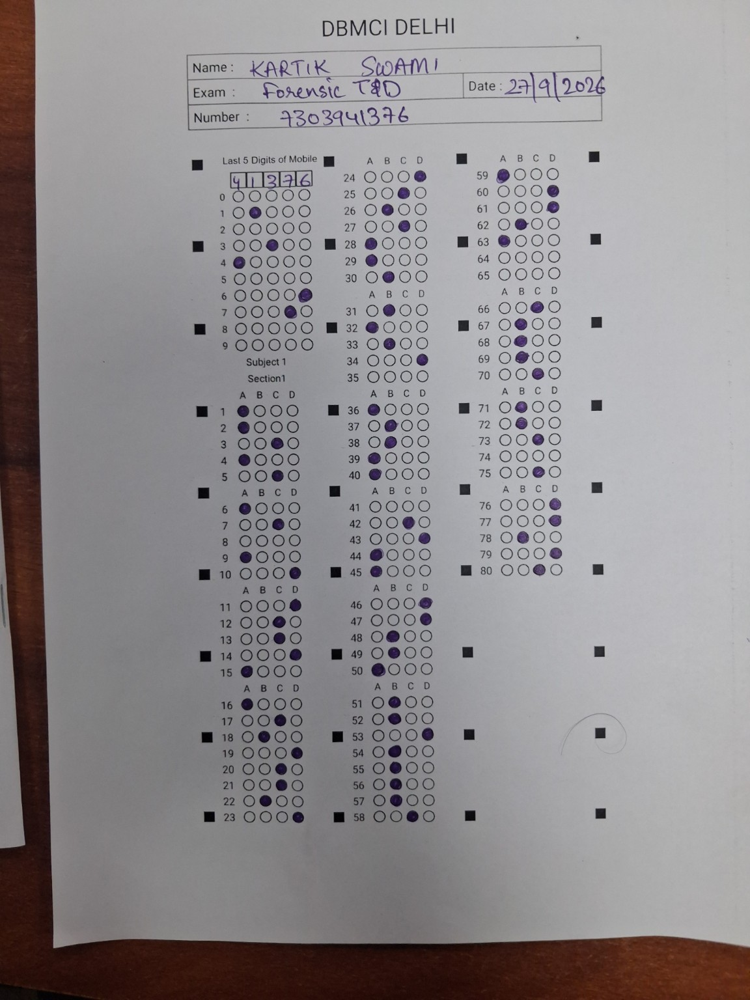

## Marked Answer Index

1: A | 2: A | 3: C | 4: A | 5: C | 6: A | 7: C | 8: Not marked | 9: Not marked | 10: D
11: D | 12: C | 13: C | 14: D | 15: A | 16: A | 17: C | 18: B | 19: D | 20: C
21: C | 22: B | 23: D | 24: D | 25: C | 26: B | 27: C | 28: A | 29: A | 30: B
31: B | 32: A | 33: B | 34: D | 35: Not marked | 36: A | 37: B | 38: B | 39: A | 40: A
41: Not marked | 42: C | 43: D | 44: A | 45: A | 46: D | 47: D | 48: B | 49: B | 50: A
51: B | 52: B | 53: D | 54: B | 55: B | 56: B | 57: B | 58: C | 59: A | 60: D
61: D | 62: B | 63: A | 64: Not marked | 65: Not marked | 66: C | 67: B | 68: B | 69: B | 70: C
71: B | 72: B | 73: C | 74: Not marked | 75: C | 76: D | 77: D | 78: B | 79: D | 80: C

## 1. Snakebite with muscle injury - most crucial monitoring

A 21-year-old boy was brought to the emergency department after being bitten by a snake. The Dr notices involuntary contractions, aches & swelling of muscles. Passage of dark brown urine, compartment syndrome, cardiac arrhythmias & acute kidney injury was also noted. The monitoring which is most crucial in this patient is:

**Options:**

- **A.** Single breath count - number of digits counted in one exhalation - >30 normal
- **B.** Breath holding time - breath held in inspiration - normal >45 sec
- **C.** 20WBCT
- **D.** Creatine phosphokinase

**Answer marked:** A

## 2. Burnt body after building collapse - identification of injuries

Death of a person occurred due to building collapse and burnt body was found. Injuries and fractures in the body can be identified by which of the following

**Options:**

- **A.** Virtual autopsy
- **B.** Photography
- **C.** Psychological autopsy
- **D.** DNA analysis

**Answer marked:** A

## 3. Impotence limited to the wife

A man is unable to achieve an erection with his wife but is fully potent with other women. This condition is known as

**Options:**

- **A.** Impotence coeundi
- **B.** Impotence generandi
- **C.** Impotence quad hoac
- **D.** Functional impotence

**Answer marked:** C

## 4. Rodenticide poisoning with hypokalaemia

A 40-year-old female consumed white color rodenticide powder and present with K+ level as 2.5 meq. O/E irregular pulse present with muscle paralysis. ECG showed multiple ventricular ectopic. Suspected poison is

**Options:**

- **A.** Aluminium phosphide
- **B.** Zinc phosphide
- **C.** Warfarin toxicity
- **D.** Barium carbonate

**Answer marked:** A

## 5. BNS protection in emergency act for a child

X is in a house which is on fire, with Z, a child. People below hold out a blanket. X drops the child from the house top, knowing it to be likely that the fall may kill the child, but not intending to kill the child, and intending, in good faith, the child’s benefit. Here, even if the child is killed by the fall, X has committed no offence in law. Which section of the Bharatiya Nyaya Sanhita (BNS) protects X in this scenario?

**Options:**

- **A.** Section 20
- **B.** Section 22
- **C.** Section 30
- **D.** Section 106

**Answer marked:** C

## 6. Fingerprint pattern

Identify the fingerprint pattern shown in image

**Options:**

- **A.** Loop
- **B.** Whorl
- **C.** Arch
- **D.** Composite

**Answer marked:** A

## 7. Doctor receiving two court summons

A Dr received two summons - first to appear in court as expert witness for rape & murder case and another to provide expert medical opinion in a negligence case related to leg amputation, which of the following should be followed by the Dr

**Options:**

- **A.** Appear to provide expert medical opinion in negligence
- **B.** Appear as expert witness in rape & murder case
- **C.** Summon received earlier
- **D.** Depends on Dr opinion

**Answer marked:** C

## 8. Presumption of death and inheritance

A male was abducted from his house and couldn't be found for long time & so was presumed dead by his son. His son thereafter made claim on his paternal property. As per section 111 Bharatiya sakshya adhiniyam (BSA), after when will the son be able to claim inheritance of paternal property

**Options:**

- **A.** 5 years
- **B.** 7 years
- **C.** 9 years
- **D.** 30 years

**Answer marked:** Not marked

## 9. Sequence of gunshots - rule

During autopsy of a gunshot case, the Dr. notices this finding as shown and tells the policeman about sequence of shots fired by applying which rule

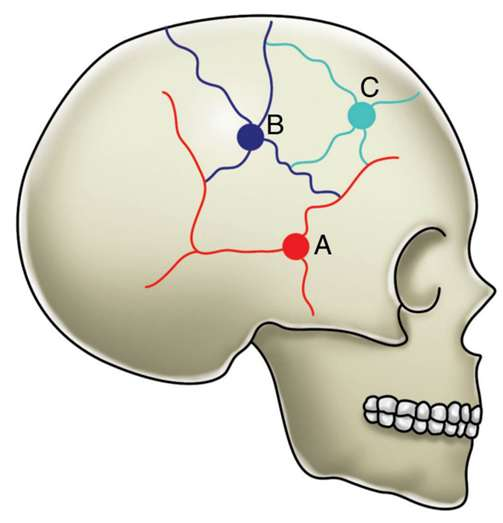

**Options:**

- **A.** Kennedy rule
- **B.** Currens rule
- **C.** Puppes rule
- **D.** Ashleys rule

**Answer marked:** Not marked

## 10. Odor after advanced decomposition

A dead body was recovered from after few months since missing complaint was made by relatives and brought for autopsy. Odor in such case will be

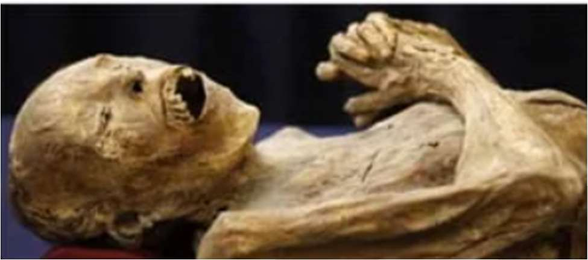

**Options:**

- **A.** Ammoniacal
- **B.** Bitter almond
- **C.** Burnt rope
- **D.** Odorless

**Answer marked:** D

## 11. Identification using long bones

Police recover beheaded skull bone, and many intact long bones & relatives of a missing person give the photograph of missing person to police. The long bone samples can be utilized for identification with which technique.

**Options:**

- **A.** Fingerprint
- **B.** Precipitin test
- **C.** Superimposition
- **D.** Anthropometry

**Answer marked:** D

## 12. Postmortem caloricity graph

An intern was creating graph of PM caloricity in relation to temperature vs time, which was taken every hour for 24 hours. What is correct about this?

**Options:**

- **A.** Parabola
- **B.** Sigmoid
- **C.** Reverse sigmoid
- **D.** Continuous decreasing

**Answer marked:** C

## 13. Court order to record evidence

A public witness was ordered by court to come & record his evidence in court. What is correct about this order?

**Options:**

- **A.** Oral evidence
- **B.** Hearsay evidence
- **C.** Subpoena
- **D.** Circumstantial evidence

**Answer marked:** C

## 14. Gunshot entry wound with tattooing - range

A gunshot case brought for autopsy shows a round entry wound with inverted margins & surrounded by tattooing. Burning & singeing of hairs is not noted. What is the range.

**Options:**

- **A.** Contact shot.
- **B.** Close shot.
- **C.** Distant shot.
- **D.** Intermediate shot.

**Answer marked:** D

## 15. Lucid interval

Lucid interval is associated with

**Options:**

- **A.** EDH
- **B.** SDH
- **C.** Insanity
- **D.** All three above - a, b, c

**Answer marked:** A

## 16. Burning plastic fumes - antidote

A 3-year-old child develops severe respiratory distress due to chest & throat constriction after inhalation of fumes arising from burning plastic. The child is started on supportive ventilation. Which one of the following antidotes needs to be given?

**Options:**

- **A.** Hydroxy cobalamin
- **B.** Methionine
- **C.** Sodium thiosulfate
- **D.** N-acetyl cysteine

**Answer marked:** A

## 17. Autopsy dissection technique in known HIV case

A known HIV+ case, after unnatural death was brought for autopsy. The dissection technique used is.

**Options:**

- **A.** Virchows
- **B.** Ghons en bloc
- **C.** Rokitansky in situ
- **D.** Letulle’s en mass

**Answer marked:** C

## 18. Juvenile court age threshold in the question

A person has committed a criminal offence, caught by police & later brought to a criminal court but the court directs police to transfer the case to juvenile courts if it was proved that accused is of _________ year age

**Options:**

- **A.** 06
- **B.** 16
- **C.** 21
- **D.** 26

**Answer marked:** B

## 19. Drowning - postmortem finding not seen

Dead body of a child was recovered within 10 minutes from near a river with froth over mouth which comes back even after wiping. Which of the following post-mortem findings is not seen?

**Options:**

- **A.** Ballooning of lungs
- **B.** Cadaveric spasm with mud in closed fist
- **C.** Paltauf’s haemorrhage
- **D.** Washerwoman hand & feet

**Answer marked:** D

## 20. Dental charting method

The following Image depicts which method of dental charting

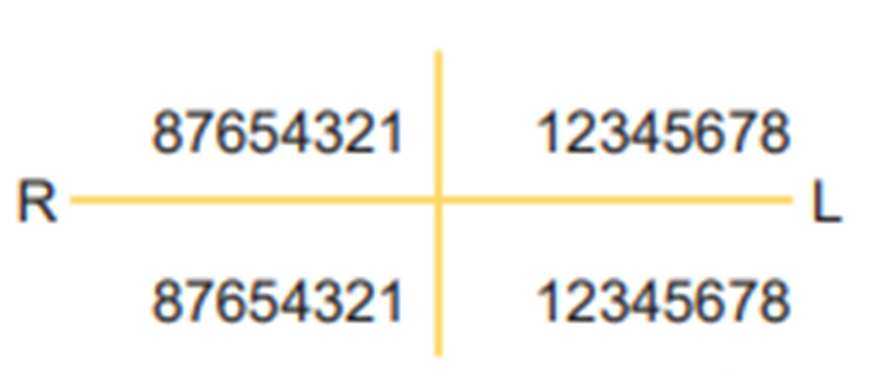

**Options:**

- **A.** Palmers
- **B.** Hader-up
- **C.** Universal
- **D.** FDI

**Answer marked:** C

## 21. Mechanism of scalp laceration

A 48-year-old male comes with injuries in hospital OPD. The examining doctor notices a lacerated wound of size 4 × 0.5 cm bone deep with blood clots over scalp which was looking like an incised wound along with linear abrasion of size 2×0.5 cm below nipple. What caused the lacerated injury over the scalp?

**Options:**

- **A.** Overstretching of skin and subcutaneous tissue
- **B.** Shearing force
- **C.** Soft tissue is sandwiched between the weapon and underlying bone
- **D.** Impact by semi sharp object with heavy force

**Answer marked:** C

## 22. BNS 89 - criminal abortion

BNS 89 in relation to criminal abortion deals with which of the following.

**Options:**

- **A.** Abortion with consent
- **B.** Abortion without consent
- **C.** Death of female during abortion
- **D.** Causing death of quick unborn child while trying to kill mother.

**Answer marked:** B

## 23. Methanol poisoning - metabolites

Many people have consumed contaminated alcohol and present with abdominal pain, confusion, decreased vision. Methyl alcohol concentration was detected as 20 mg %. On assessment which metabolites will be found in body

**Options:**

- **A.** Formic acid & Glyoxylic acid
- **B.** Glycolic acid & oxalic acid
- **C.** Oxalic acid & formic acid
- **D.** Formic acid & lactic acid

**Answer marked:** D

## 24. Gunshot wound on the back while lying in a bathtub

A man is shot once in the chest while lying in the bathtub on his back. How should this gunshot wound defect on his back be classified?

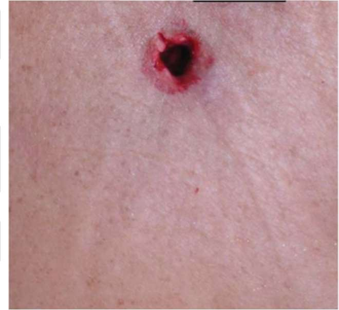

**Options:**

- **A.** Distant entrance gunshot wound
- **B.** Intermediate entrance gunshot wound
- **C.** Close entrance gunshot wound
- **D.** Shored exit wound

**Answer marked:** D

## 25. Urinary crystals in poisoning

A patient presents with paresthesia, tetany, muscle twitches and muscle cramps with urinary crystals as shown in image. These are typical symptoms of poisoning with

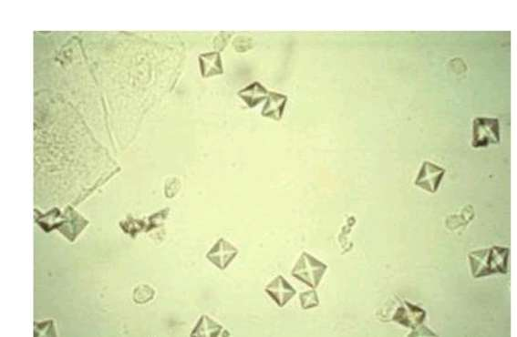

**Options:**

- **A.** Sulphuric acid
- **B.** Nitric acid
- **C.** Carbolic acid
- **D.** Ethylene glycol

**Answer marked:** C

## 26. Glass industry worker - antidote

A 35-year-old male working in glass industry presents with colic, tremors, muscle & joint pain, optic neuritis, psychosis, mees line on nails & finding as shown. Antidote of choice is

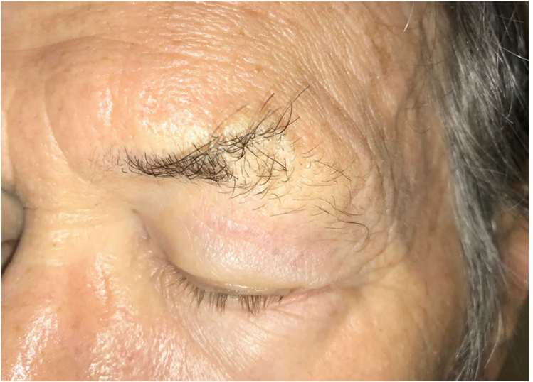

**Options:**

- **A.** Dimercaprol
- **B.** i.m BAL
- **C.** D-penicillamine
- **D.** Prussian blue

**Answer marked:** B

## 27. Hydrostatic (floatation) test

Hydrostatic (floatation) test (video) during autopsy shows that both the lung and liver specimens do not float in water. What is the correct interpretation?

**Options:**

- **A.** Respiration present::decomposition absent
- **B.** Respiration absent:: decomposition present
- **C.** Respiration absent::decomposition absent
- **D.** Respiration present::decomposition present

**Answer marked:** C

## 28. Motile spermatozoa - time since sexual assault

A woman with a history of alleged rape undergoes forensic examination. A microscopic video of a vaginal wet mount is shown, demonstrating motile spermatozoa. Based on this finding, the most likely time elapsed since the alleged sexual assault is

**Options:**

- **A.** 12-24 hrs
- **B.** 24-48 hours
- **C.** 48-72 hours
- **D.** More than 72 hours

**Answer marked:** A

## 29. Sexual assault in a 16-year-old with 16-week pregnancy - except

A 16-year-old girl was sexually assaulted & raped by 22-year-old neighbor. She now comes to hospital with 16 weeks pregnancy. All the following needs to be done by Dr except

**Options:**

- **A.** Fetal tissues for DNA to be preserved
- **B.** Inform the police
- **C.** MTP if needed can be conducted by one doctor opinion
- **D.** Parents’ consent for medicolegal examination

**Answer marked:** A

## 30. Order of opening cavities in fetal death autopsy

During autopsy of fetal death case, what is the correct order of opening cavities to ascertain whether fetus was live birth or not

A. Thorax
B. Abdomen
C. Cranium
Select the correct answer from the given code below:

**Options:**

- **A.** A>C>B
- **B.** C>B>A
- **C.** C>A>B
- **D.** B>C>A

**Answer marked:** B

## 31. Injury and type of asphyxial death

Identify the injury & type of asphyxial death

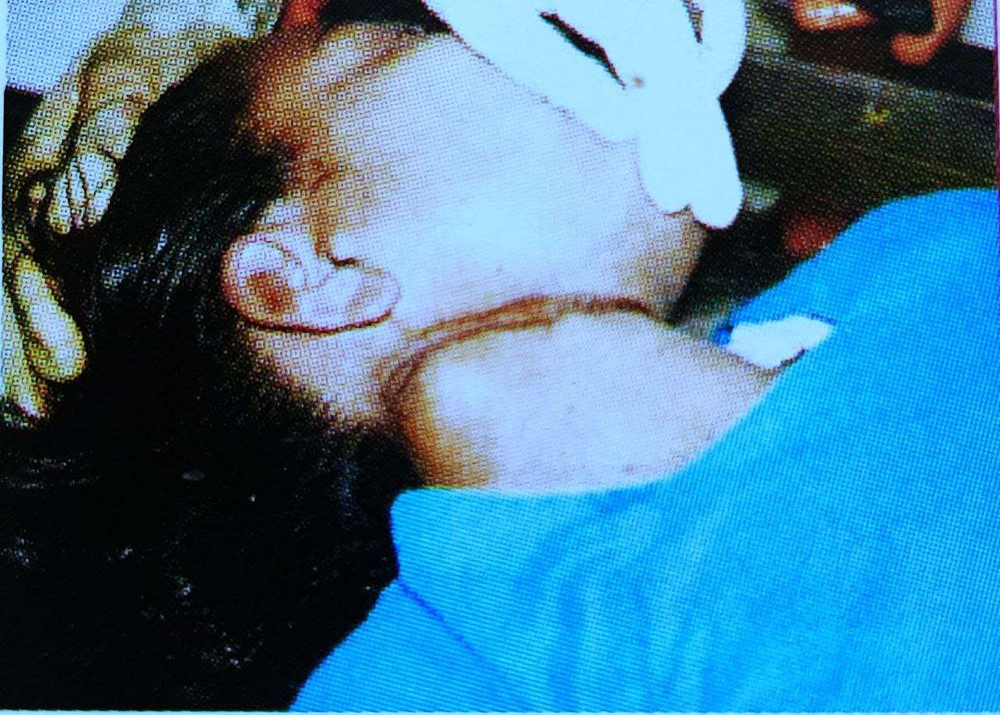

**Options:**

- **A.** Ligature mark & Hanging
- **B.** Ligature mark & Strangulation
- **C.** Pressure abrasion & Hanging
- **D.** Pressure abrasion & Strangulation

**Answer marked:** B

## 32. Features absent in a female skull

Female skull brought by police was analysed in Forensic department. To consider this as female skull bone which features should be absent:

i. Prominent Frontal & Parietal eminence
ii. Lower & broader nasal aperture
iii. Prominent supraorbital ridges
iv. square orbits
v. Prominent cheek
vi. square chin

**Options:**

- **A.** 1,2,4,6
- **B.** 2,3,5,6
- **C.** 2,3,4,5
- **D.** 3,4,5,6

**Answer marked:** A

## 33. Disclosure of HIV-positive status to spouse

A HIV+ husband comes with wife to a doctor. Doctor discloses this information of husband being HIV+ to wife as per which of the following

**Options:**

- **A.** Professional secrecy
- **B.** Privileged communication
- **C.** Contributory affair
- **D.** Such disclosure is an offence in india

**Answer marked:** B

## 34. Stab wound with one acute and one blunt angle

A person sustains a stab injury, as shown in the image. The wound is longer than its width, deep with clean-cut margins, and has one acute angle and one blunt angle. Which of the following is the most likely weapon responsible for this injury?

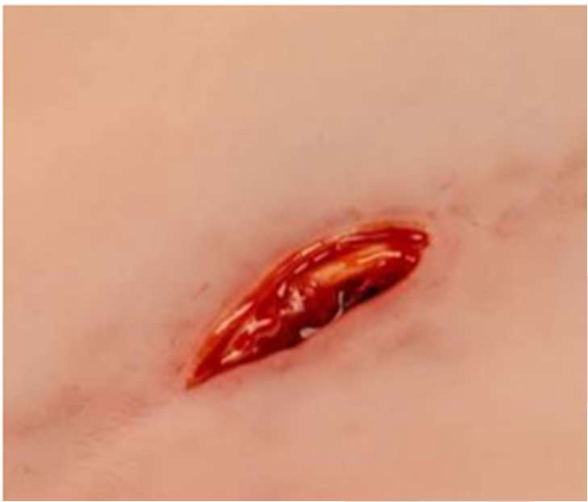

**Options:**

- **A.** Screwdriver
- **B.** Broken glass piece
- **C.** Double-edged knife
- **D.** Single-edged knife

**Answer marked:** D

## 35. Burns to face and chest in blast injury

Burns to face and chest is seen in which type of blast injury

**Options:**

- **A.** Primary blast injury
- **B.** Secondary
- **C.** Tertiary
- **D.** Quaternary

**Answer marked:** Not marked

## 36. Substance in stomach - body packing/stuffing

A 47 yrs old male from Afghanistan, came to India and died mysteriously in hotel room. Autopsy show stomach filled with substance as shown. What is correct about it

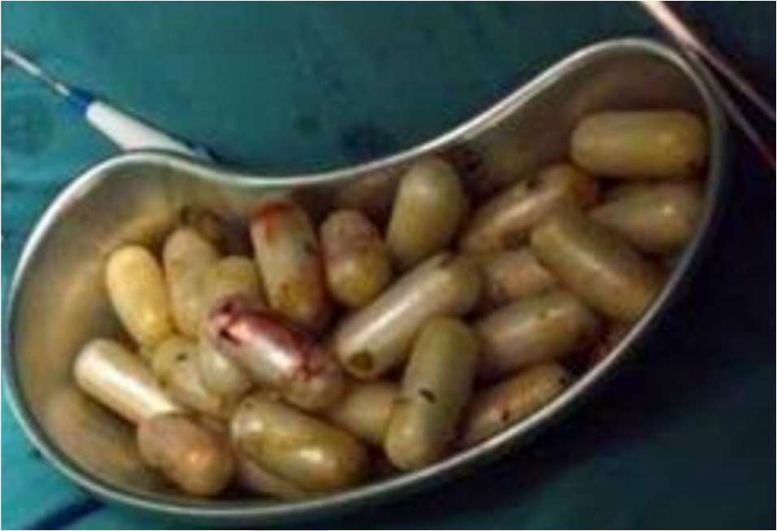

**Options:**

- **A.** Body packing
- **B.** Body stuffing
- **C.** Body storage
- **D.** Body smuggles

**Answer marked:** A

## 37. Cholinergic poisoning - treatment of choice

A man in emergency comes with pinpoint pupil, bradycardia, respiratory depression, excessive salivation, sweating, lacrimation, after drinking some liquid. Treatment of choice

**Options:**

- **A.** Paralidoxime
- **B.** Atropine
- **C.** Flumazenil
- **D.** Naloxone

**Answer marked:** B

## 38. Poison-associated neuropathy and symptoms

Match the following columns of conditions with associated neuropathy & symptoms

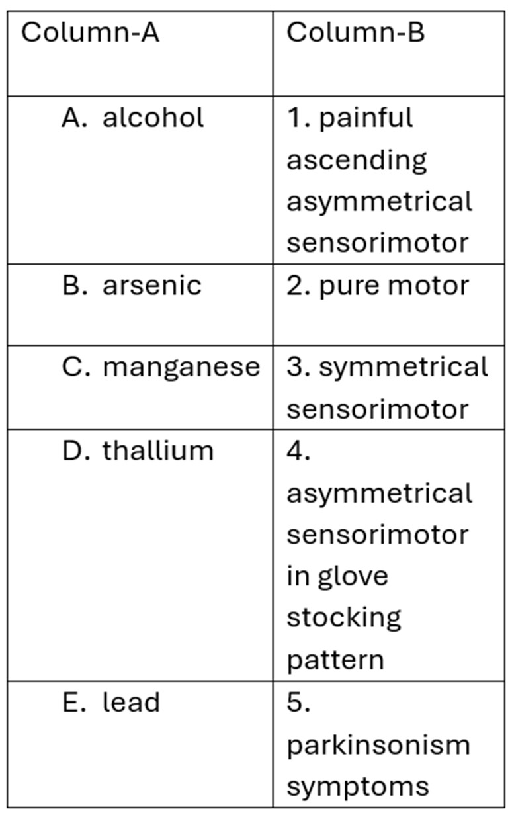

The source table shows: A. alcohol; B. arsenic; C. manganese; D. thallium; E. lead. Column-B: 1. painful ascending asymmetrical sensorimotor; 2. pure motor; 3. symmetrical sensorimotor; 4. asymmetrical in glove stocking pattern; 5. parkinsonism symptoms.

**Options:**

- **A.** A-1, B-2, C-3, D-4, E-5
- **B.** A-3, B-4, C-5, D-1, E-2
- **C.** A-3, B-1, C-5, D-2, E-4
- **D.** A-1, B-4, C-3, D-2, E-5

**Answer marked:** B

## 39. Twin paternity - superfecundation

A woman presented newborn twins. She alleges a male to be their father, which was denied by the male. On paternity testing, he was found to be the father of one newborn. This is suggestive of

**Options:**

- **A.** Superfecundation
- **B.** Superfetation
- **C.** Posthumous child
- **D.** Suppositious child

**Answer marked:** A

## 40. Poisoning with garlicky odor and multisystem toxicity

A 25-year-old married woman consumed an unknown poison and was brought to casualty with nausea, vomiting, retrosternal pain, dyspnea, and headache. She was noted to have profound hypotension, bleeding diathesis, cardiovascular, hepatic, and central nervous system involvement, with a garlicky odor over her mouth and nose. Gastric lavage and adsorbents were administered. As no specific antidote was available, the doctor initiated a lifesaving approach to reduce organ toxicity. Which of the following should be used

**Options:**

- **A.** Liquid paraffin & antacids
- **B.** Low dose dopamine infusion
- **C.** Intravenous hydrocortisone
- **D.** Intravenous magnesium sulfate

**Answer marked:** A

## 41. Zasko’s phenomenon

What is Zasko's phenomenon?

**Options:**

- **A.** Tendon reaction seen after death
- **B.** Blood clotting seen after death
- **C.** Gaping of wounds along skin tension lines
- **D.** Seepage of blood through wounds after death

**Answer marked:** Not marked

## 42. Poisoning with rice-water diarrhoea and garlicky odor

A patient consumed an unknown substance and was brought to the emergency department with abdominal pain and diarrhea, which later became rice-water-like and blood-stained. The patient also reported throat pain before vomiting, followed by purging. The vomitus contained blood and bile, and a garlicky odor was noted from the airways. What is the most likely cause of poisoning?

**Options:**

- **A.** Acute aluminium phosphide
- **B.** Acute phosphorus
- **C.** Acute arsenic
- **D.** Seeds of Croton tiglium

**Answer marked:** C

## 43. Match poisons with site of action

Match the following columns

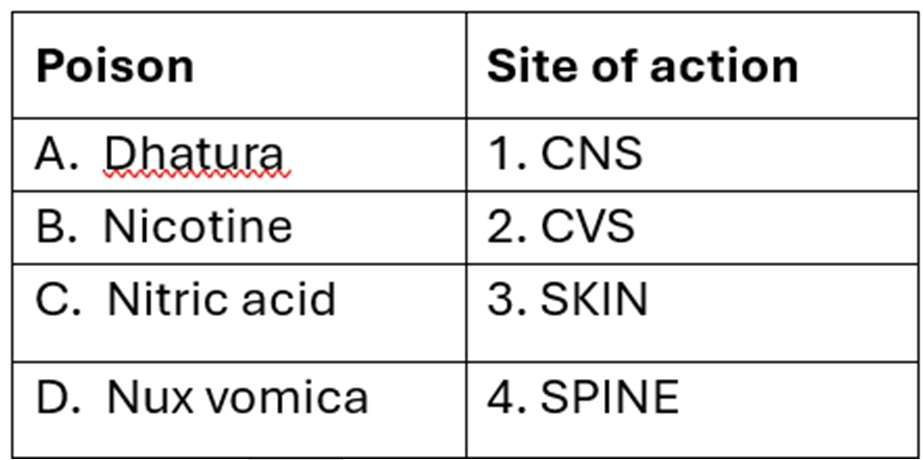

The source table shows: A. Datura, B. Nicotine, C. Nitric acid, D. Nux vomica. Sites of action: 1. CNS; 2. CVS; 3. SKIN; 4. SPINE.

**Options:**

- **A.** A-1, B-3, C-2, D-4
- **B.** A-4, B-3, C-2, D-1
- **C.** A-1, B-2, C-4, D-3
- **D.** A-1, B-2, C-3, D-4

**Answer marked:** D

## 44. Scorpion sting - management

A village kid goes to temple with his grandmother. Something bit him & he started crying due to a burning sensation at bite site. The kid was brought to hospital. His BP & heart rate was high, priapism, sweating, cold periphery was present with pulmonary edema. Management of choice in this case is

**Options:**

- **A.** Prazosin
- **B.** Dopamine
- **C.** Furosemide
- **D.** Scorpion antivenom

**Answer marked:** A

## 45. 20 paracetamol tablets - drug to start

Woman comes to ER with history of intake of 20 PCM tablets. According to Doctor on duty which drug should be started out of the following.

**Options:**

- **A.** Methionine
- **B.** Naloxone
- **C.** Naltrexone
- **D.** Chlorpromazine

**Answer marked:** A

## 46. Adipocere

A 30-year-old male dead body was brought for autopsy. The Dr notices greyish white waxy material with preserved facial features. Which is true of following change

**Options:**

- **A.** High temperature needed
- **B.** Hot & dry environment needed
- **C.** Starts very early after death
- **D.** It is a form of body preservation by saponification of fats

**Answer marked:** D

## 47. Asphyxia scene

This is seen in which type of asphyxia condition

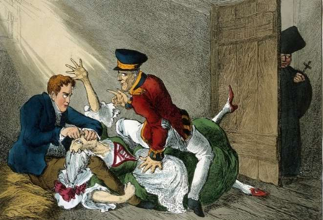

**Options:**

- **A.** Throttling
- **B.** Smothering
- **C.** Traumatic asphyxia
- **D.** Burking

**Answer marked:** D

## 48. Alcoholism with ophthalmoplegia, ataxia and confusion

A 35-year-old man with history of alcoholism presents with ophthalmoplegia, ataxia and global confusion. The initial treatment of choice for this patient is:

**Options:**

- **A.** I.V. Glucose
- **B.** I.V. Thiamine
- **C.** I.V. Mannitol
- **D.** I.V. Immunoglobulin

**Answer marked:** B

## 49. In camera trial

A sexual assault case trial in fast-track court is being done. “In camera” trial here means

**Options:**

- **A.** Closed court proceedings
- **B.** Recording of proceedings
- **C.** Open court proceedings
- **D.** Proceeding occurring in different place under high security.

**Answer marked:** B

## 50. Diatoms in drowning

The electron microscopic image of organism was analyzed in a drowning case. Which is correct about them

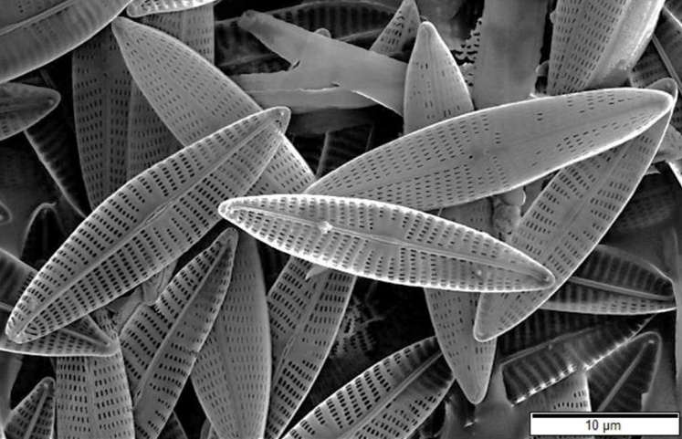

**Options:**

- **A.** Contains silica & chlorophyll
- **B.** Are microscopic unicellular bacteria
- **C.** Present only in bone marrow
- **D.** Are not resistant to acids & heat

**Answer marked:** A

## 51. Snakebite with persistent ptosis after atropine-neostigmine

A person was brought to OPD with history of snake bite two hours ago. Patient was noted to be in respiratory depression & low heart rate & drooping of eyelids was noted bilaterally. 10 vials PASV was administered. Dr also started atropine & neostigmine (AN) therapy under close observation, but ptosis didn’t improve in next 1 hour & even after 3 doses of AN. What can be done next?

**Options:**

- **A.** Give more doses of AN, till ptosis improves
- **B.** Give injection calcium gluconate 10 ml i.v
- **C.** i.v hydrocortisone
- **D.** Inj Epinephrine

**Answer marked:** B

## 52. Sexual pleasure obtained by infliction of pain

Sexual pleasure obtained by infliction of pain is called as

**Options:**

- **A.** Masochism
- **B.** Sadism
- **C.** Transvestism
- **D.** Exhibitionism

**Answer marked:** B

## 53. Alcohol withdrawal with cirrhosis

A 45-year-old female with history of alcoholism for about 10 years develops liver cirrhosis. Now she suddenly leaves alcohol and within 2-3 days presents in casualty with withdrawal symptoms like agitation, seizures, clouding of consciousness. Preferred treatment given is.

**Options:**

- **A.** Diazepam
- **B.** Alprazolam
- **C.** Lorazepam
- **D.** Clonazepam

**Answer marked:** D

## 54. Mechanical injury identification

Identify the mechanical injury shown in image

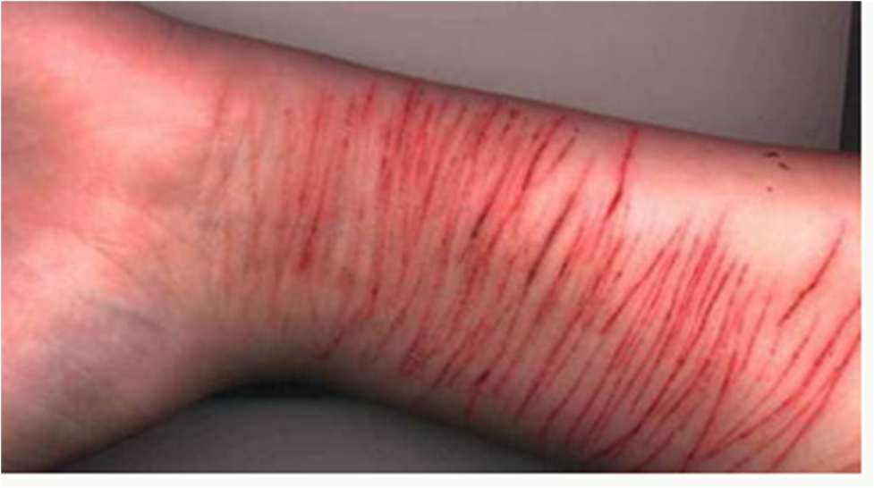

**Options:**

- **A.** Grazed abrasion
- **B.** Tentative cuts
- **C.** Pressure abrasion
- **D.** Imprint abrasion

**Answer marked:** B

## 55. Aspirin poisoning vs heat stroke

A 40-year-old male is brought to casualty with complaints of burning pain in throat & abdomen with GI bleeding episodes. The patient was hyperthermic with temp around 42* c. Features of delirium, tinnitus, vertigo was noted with hypotension, tachycardia, and tachypnea. On further analysis, metabolic acidosis, hyponatremia, hypokalemia & ketonuria were noted. Suspected diagnosis

**Options:**

- **A.** Acetaminophen poisoning
- **B.** Aspirin poisoning
- **C.** Classical heat stroke
- **D.** Sulphonamide poisoning

**Answer marked:** B

## 56. Who can perform MTP by medical methods?

A 20-year-old & 8-week pregnant female come to a RMP for MTP on grounds of failure of contraception by husband. Which of the following Dr can do MTP by medical methods as per MTP act 2021?

1. Obs/gyne- MD/DGO
2. RMP with 6-month House Surgeonship experience or 1-year exp in Obs/gynae dept.
3. RMP with 25 MTP experience & 5 done independently.
4. RMP with 3 or more than 3-month exp in Obs/gynae dept. or 10 MTP experience

**Options:**

- **A.** Only 1
- **B.** Only 1,2,3
- **C.** Only 1,2
- **D.** Any of four 1,2,3,4

**Answer marked:** B

## 57. Opioid withdrawal

A 45-year-old patient presents in casualty with lacrimation, diarrhoea, yawning, congested eyes, tachycardia & hypertension. Which of the following should be suspected?

**Options:**

- **A.** Cocaine withdrawal
- **B.** Cannabis withdrawal
- **C.** Heroin withdrawal
- **D.** Datura poisoning

**Answer marked:** B

## 58. Open eye in hanging

A case of hanging has come to forensic department for autopsy. The autopsy Dr. notices a ligature mark covering about one-third of neck, protruded tongue, salivary stains, opened right eye, closed left eye, both pupils dilated. What is the probable reason for open right eye

**Options:**

- **A.** Compression of IJV
- **B.** Compression of ICA
- **C.** Compression of Cervical sympathetic chain
- **D.** Compression of Vagus

**Answer marked:** C

## 59. Soddened burn with blisters and line of demarcation

A patient comes to OPD with soddened burn injury over his right thigh with erythema, blisters & line of demarcation. Which of the following is true of this case

**Options:**

- **A.** Moist burn
- **B.** Chemical burn
- **C.** Dry burn
- **D.** Electric burn

**Answer marked:** A

## 60. Schizophrenia and criminal responsibility

Under paranoid delusions a factory worker, believes that his co-worker is planning to kill him. He kills the co-worker because of his belief that he will poison him & later he was diagnosed as a case of schizophrenia. He was taken to court. What is the best interpretation

**Options:**

- **A.** Criminal responsibility of killer remains valid
- **B.** Psychiatric referral to be done
- **C.** Medical insanity rules out criminal responsibility of the person
- **D.** Legal insanity makes the killer non-liable for his action

**Answer marked:** D

## 61. Crocodile-like skin

Crocodile-like skin is seen in

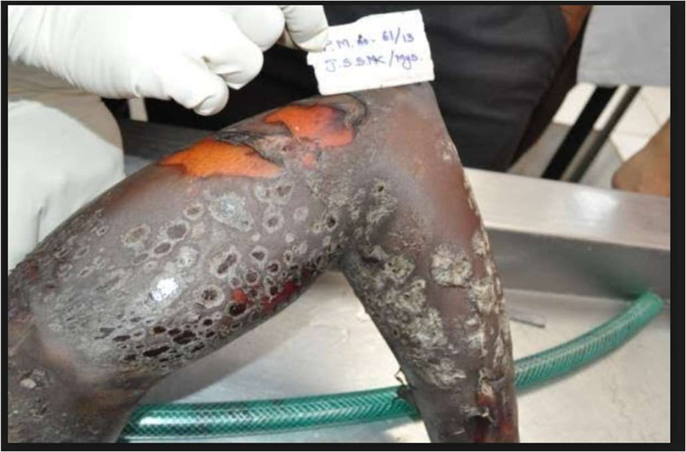

**Options:**

- **A.** Arsenic poisoning
- **B.** High voltage shock
- **C.** Moist burns
- **D.** Chemical burns

**Answer marked:** D

## 62. MTP - number of doctors' opinions

In a medically aborted fetus, crown rump length was noted as 26 cm. How many doctors’ opinions are required for medical abortion as per MTP act 2021

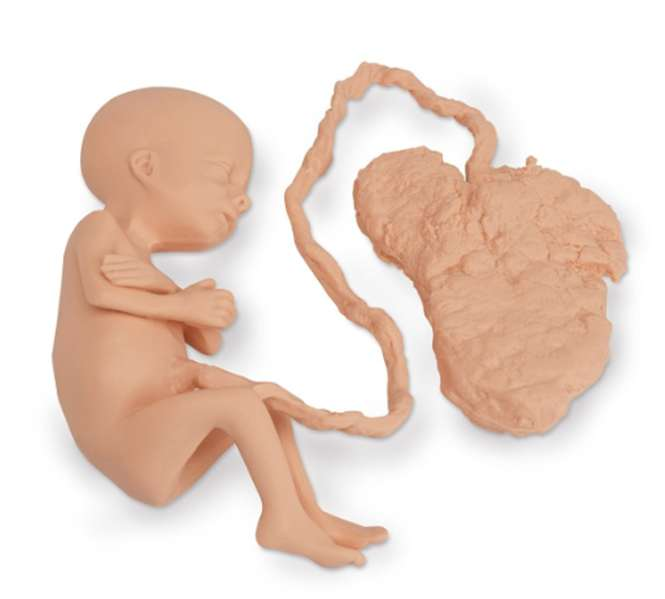

**Options:**

- **A.** One Doctor
- **B.** Two Doctor
- **C.** Medical board
- **D.** Four Doctor

**Answer marked:** B

## 63. Test on perianal swab

A child was a victim of sexual assault, test was done using perianal swab, what's the name of this test:

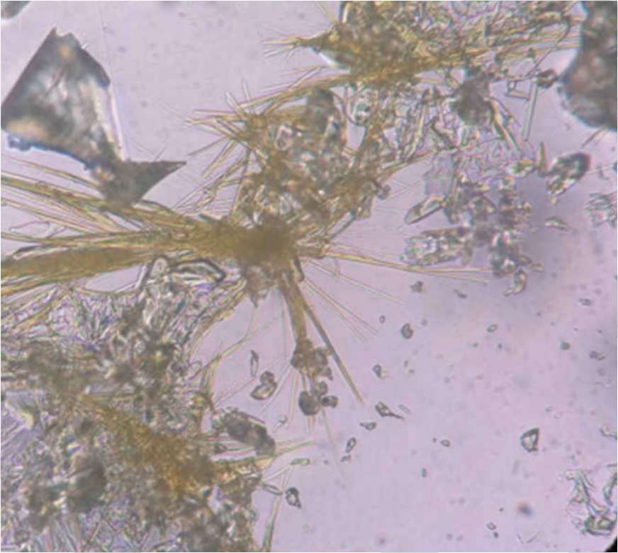

**Options:**

- **A.** Barberio test
- **B.** Teichman test
- **C.** Takayama test
- **D.** Florence test

**Answer marked:** A

## 64. Standard for medical negligence

The standard used to determine whether a doctor acted negligently is called the

**Options:**

- **A.** Durham rule
- **B.** Bolam test
- **C.** Mc Naughten rule
- **D.** Hasse’s rule

**Answer marked:** Not marked

## 65. Bluish fluorescence in rape crime scene

During crime scene investigation of a homicidal rape case, some test was applied in dark room to screen the white stains on body of victim & bluish fluorescence was noted as shown. Which test was applied

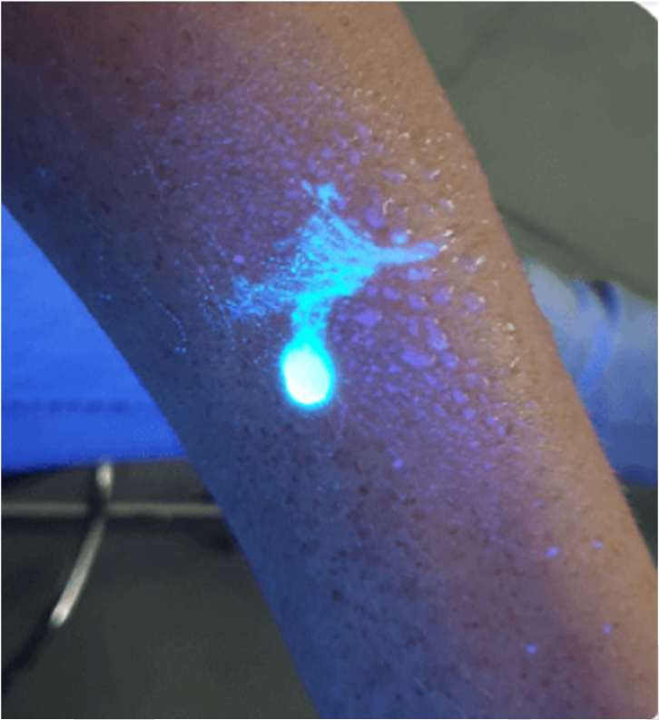

**Options:**

- **A.** Takayama hemochromogen
- **B.** Florence
- **C.** UV light
- **D.** Luminol spray test

**Answer marked:** Not marked

## 66. Poison - corresponding effect

Match the following poisons to their corresponding effect:

Select the correct answer from the given below code:

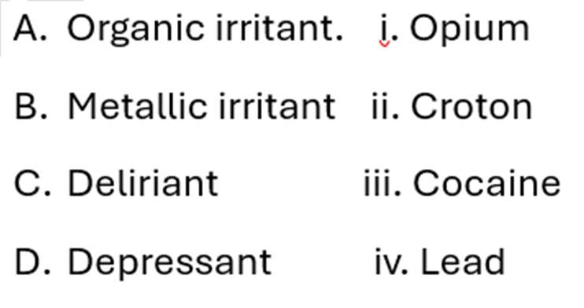

The source table shows: A. Organic irritant, B. Metallic irritant, C. Deliriant, D. Depressant; i. Opium, ii. Croton, iii. Cocaine, iv. Lead.

**Options:**

- **A.** A-i, B-ii, C-iii, D-iv
- **B.** A-ii, B-iv, C-i, D-iii
- **C.** A-ii, B-iv, C-iii, D-I
- **D.** A-iv, B-iii, C-ii, D-i

**Answer marked:** C

## 67. Percentage of burns

Calculate the % of burns with involvement of front of face with singeing of eyebrows, chest & both upper limbs

**Options:**

- **A.** 27 to 30 %
- **B.** 35 to 40%
- **C.** 40 to 45%
- **D.** 45 to 47%

**Answer marked:** B

## 68. Thermometer factory worker with pink lesions

A factory worker works to make thermometer & come to hospital with pink lesions. Which other finding will be noted in the patient

**Options:**

- **A.** Burtonian lines
- **B.** Coarse tremors, psychosis & mad hatter syndrome
- **C.** Basophilic stippling
- **D.** Neuropathy

**Answer marked:** B

## 69. Cyanide and carbon monoxide toxicity

Toxicity of cyanide & Carbon monoxide is exerted by affecting which of the following

**Options:**

- **A.** Myoglobin
- **B.** Cytochrome oxidase
- **C.** Carbonic anhydrase
- **D.** Superoxide dismutase

**Answer marked:** B

## 70. X-ray assessment for age over 18 years

A 40-year-old lady comes with her daughter to hospital with recent history of rape offence with her daughter. Mother is claiming her daughter to be < 18 years, but doctor does not agree. Which X rays Dr will recommend proving the age be > 18 year.

**Options:**

- **A.** Pelvis, sternum
- **B.** Pelvis, skull
- **C.** Wrist, medial end of clavicle & pelvis
- **D.** Elbow, shoulder

**Answer marked:** C

## 71. Incorrect statement about snakebite

Pick the incorrect statement with respect to cases of snakebite

**Options:**

- **A.** Viper bite is vasculotoxic & administer PASV in systemic envenomation
- **B.** Cobra bites are myotoxic
- **C.** Cobras belong to Elapidae family
- **D.** Hyaluronidase enzyme is found in all snake venom

**Answer marked:** B

## 72. Visceral poison detection after putrefaction

A person died suddenly when his family was abroad. Viscera was preserved during the autopsy of putrefied body. All the following can be detected normally in visceral organs even on non-consumption before his death in this situation except

**Options:**

- **A.** Carbon monoxide
- **B.** Cyanide
- **C.** Arsenic
- **D.** Ethyl alcohol

**Answer marked:** B

## 73. Torture technique

Identify the torture technique shown

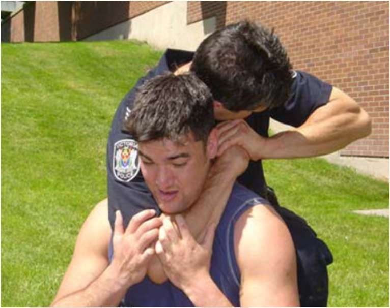

**Options:**

- **A.** Mugging
- **B.** In-choke hold
- **C.** Carotid sleeper hold
- **D.** Hog tying

**Answer marked:** C

## 74. Preservative not used in phosphorus poisoning

In a case of phosphorus poisoning, visceral organs are preserved with blood and urine during autopsy utilizing all these preservatives except

**Options:**

- **A.** Sodium fluoride
- **B.** Rectified spirit
- **C.** Saturated solution of Sodium chloride
- **D.** Thymol

**Answer marked:** Not marked

## 75. Sequence of toxins in poisonous seeds

Arrange the toxin sequentially, extracted from the poisonous seed in image from A-D in clockwise manner in image starting from top left corner

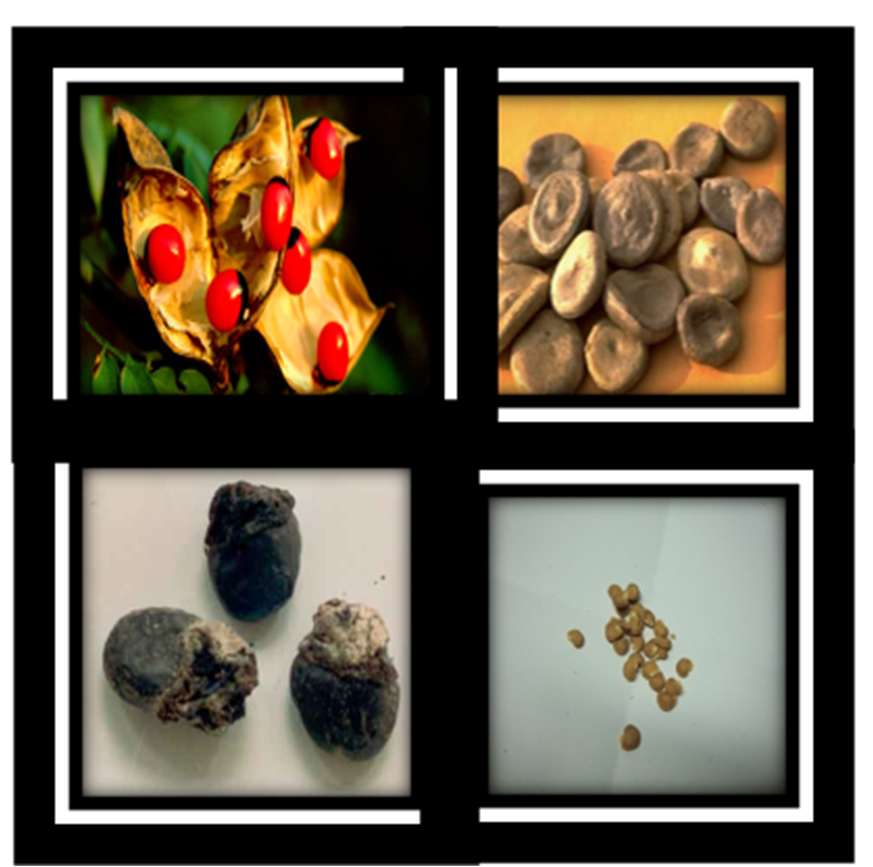

**Options:**

- **A.** Abrin- bhilawanol-brucine-hyoscine
- **B.** Abrin–brucine-bhilawanol--Hyoscine
- **C.** Brucine-abrin-hyoscine-bhilawanol
- **D.** Bhilawanol-brucine-hyoscine-abrin

**Answer marked:** C

## 76. Hinge fracture of base of skull

During autopsy, the fracture of base of skull was noted as shown. This fracture is known as

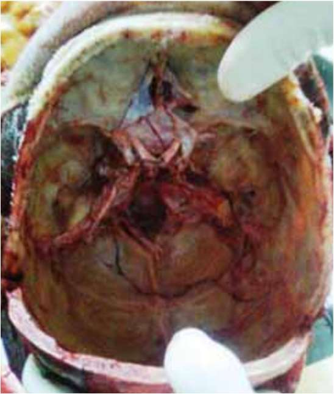

**Options:**

- **A.** Type 1 hinge
- **B.** Type 2 hinge
- **C.** Type 3 hinge
- **D.** Ring

**Answer marked:** D

## 77. Power of judges under BNSS - false statement

Pick the false statement with respect to power of judges as per BNSS

**Options:**

- **A.** Assistant session - Unlimited fine power, death sentence power
- **B.** 2nd class judicial magistrate- 10000 rs fine power, one-year imprisonment
- **C.** 1st class judicial magistrate- 50000 rs fine power, three-year imprisonment
- **D.** Chief judicial magistrate- Unlimited fine power, seven-year imprisonment

**Answer marked:** D

## 78. Seawater drowning abnormalities

In a case of seawater drowning, which of the following abnormalities are noted?
I. Hyponatremia
II. Hypercalcaemia
III. Hyperkalemia
IV. Hypernatremia
V. Myocardial anoxia
VI. Damage of type II alveolar cells

**Options:**

- **A.** 1,3,5,6
- **B.** 2,4,5,6
- **C.** 2,3,4,5,6
- **D.** 2,3,4,5

**Answer marked:** B

## 79. Heat stroke - least likely finding

A daily wage laborer who was working in field in hot weather conditions collapses with loss of consciousness. The patient was brought to hospital, and the attending doctor measured his body temperature to be about 106*F. Which of the following is least likely to be present

**Options:**

- **A.** Hypotension
- **B.** Tachycardia
- **C.** Hot skin
- **D.** Sweating

**Answer marked:** D

## 80. Mixed dentition in an 8-year-old

On dental examination in a 8-year-old kid, the Dr found both temporary (T) & permanent (P) teeth in his jaw. Pick the true statement

**Options:**

- **A.** 12 T & 12 P
- **B.** 8 T & 16 P
- **C.** 16 T & 8 P
- **D.** 4 T & 20 P

**Answer marked:** C
