# Anatomy of the Eye — Integrated Exam Notes

## 1. Big-picture organization of the eye

### 1.1 Eyeball: general features

- **Shape:** aspherical / oblate spheroid.
- **Volume of eyeball:** **6 mL**.
- **Volume of orbit:** **30 mL**.
- The eyeball lies within the **orbit**, a four-walled bony cavity.
- **Thinnest orbital wall:** medial wall.
- **Weakest orbital wall:** floor.
- **Most common orbital fracture:** blow-out fracture.
- **Orbital base:** quadrangular.
- **Orbital apex:** triangular / conical.

> **Figure 1. Cross-section of the eyeball.** Cornea, iris and pupil, lens, zonules, ciliary body with pars plicata and pars plana, sclera, choroid/uvea, retina, vitreous, aqueous, fovea, optic disc and optic nerve, optic cup and neuroretinal rim, and central retinal vessels.
> ![[IMG_1228.webp]] 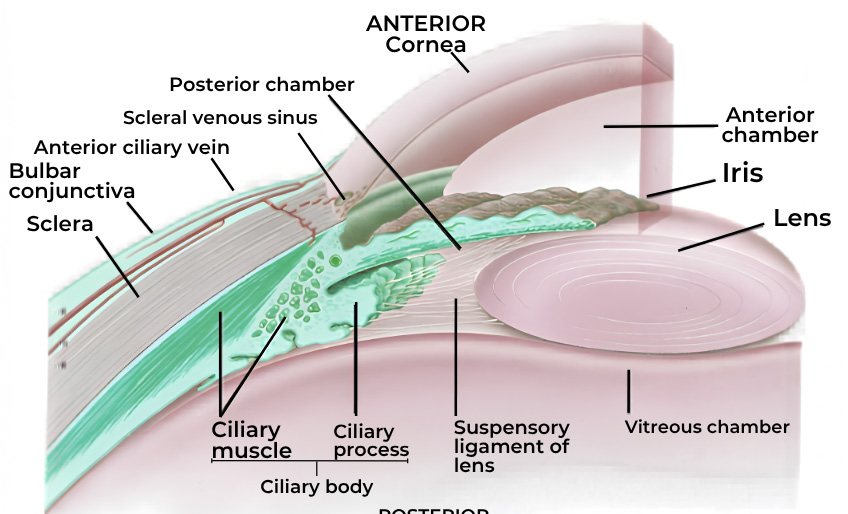
> **Figure 13. Basic anterior/posterior segment and aqueous outflow anatomy.**
> **Diagram omitted:** Basic ocular anatomy.
### 1.2 Three coats (tunics) of the eyeball

| Coat | Position/type | Components | Key details |
|---|---|---|---|
| **Fibrous tunic** | Outer | **Cornea + sclera**; junction = **limbus** | Cornea forms anterior **1/6**, sclera posterior **5/6** |
| **Vascular tunic (uvea)** | Middle | **Iris + ciliary body + choroid** | Vascular coat |
| **Nervous tunic** | Inner | **Retina** | Retina is derived from **neuroectoderm** |

The limbus is the **corneoscleral junction** and contains the **limbal stem-cell population**.

### 1.3 Anterior and posterior segments

- **Anterior segment:** cornea, iris, ciliary body, lens, anterior chamber and posterior chamber.
- **Posterior segment:** vitreous chamber, retina, choroid, optic nerve head and posterior ocular wall.
- **Anterior chamber:** between **cornea and iris**.
- **Posterior chamber:** between **posterior iris and anterior lens**.
- **Vitreous chamber:** between **posterior lens and retina**.
- The anterior and posterior chambers contain **aqueous humour**; the vitreous chamber contains **vitreous humour**.
- The cornea supplies most of the eye’s refractive power.
- The cornea and lens are **avascular**.

### 1.4 Key spatial landmarks

- **Limbus:** corneoscleral junction; limbal stem-cell zone.
- **Angle of the anterior chamber:** anatomical landmark **below the limbus**; this is the drainage angle.
- **Pars plana:** posterior, relatively **avascular** portion of the ciliary body and a preferred entry site into the vitreous/posterior segment.
- **Ora serrata:** anterior termination of the retina.
- **Optic disc:** blind spot because it has **no photoreceptors**.
- **Fovea:** area with maximum number of cones and centre of visual field; best image formation.

---

## 2. Fibrous tunic

### 2.1 Cornea

### 2.1.1 General anatomy and properties

- **Anterior 1/6** of the fibrous tunic.
- **Transparent**; viewed through the pupil, the cornea can appear dark.
- **Convex / converging** surface.
- **Corneal refractive power:** approximately **+43 D**.
- **Refractive index:** approximately **1.376**.
- **Curvature ∝ power.**
- **Avascular**, except for the peripheral limbal vascular supply.
- Nourishment comes from the **aqueous humour, tear film and limbal circulation**.
- ==The endothelial pump maintains **corneal deturgescence and transparency**, including active ion transport via the **Na⁺/K⁺-ATPase system==**.

> **Figure 2. Corneal layers and thicknesses.**
> .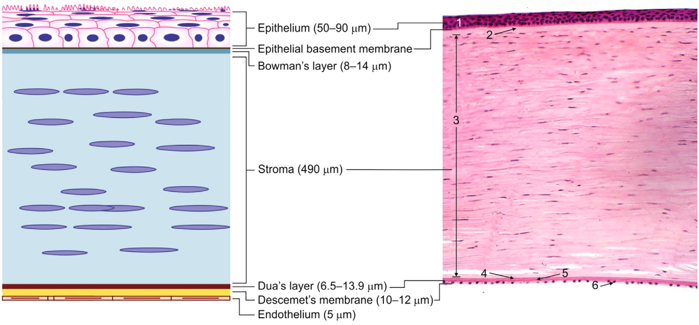
### 2.1.2 Layers of the cornea — anterior → posterior

| Layer | Key details |
|---|---|
| **1. Epithelium** | **Non-keratinized stratified squamous epithelium.** Superficial cells are squamous, with microvilli involved in adhesion of the tear film. Basal cells are columnar, with mitosis and regeneration. The epithelium is approximately **50 µm** thick centrally. |
| **2. Bowman’s layer** | **False basement membrane**, **PAS-negative**, **acellular**. Bowman’s layer **does not regenerate**; significant injury heals with scarring and may produce corneal opacity. Figure thickness approximately **8–14 µm**. |
| **3. Stroma** | Made mainly of **collagen (mostly type I)** and **GAGs (mostly keratan sulphate)**. It is the **thickest corneal layer** and provides most of the cornea’s structural strength and refractive function. Figure thickness about **490 µm**. |
| **4. Dua’s layer (pre-Descemet layer)** | Strong, almost acellular layer between the posterior stroma and Descemet’s membrane. Approximately **6–16 µm** thick. |
| **5. Descemet’s membrane (DM)** | Basement membrane of the endothelium; it can **repair/regenerate** after injury. **Schwalbe’s line** is its peripheral termination. Figure thickness approximately **10–12 µm**. |
| **6. Endothelium** | Single-cell layer; maintains **corneal transparency and deturgescence**. Cell loss is compensated mainly by enlargement and migration of surviving cells rather than meaningful proliferative regeneration. Counted by **specular microscopy**. Figure thickness about **5 µm**. |

#### Regeneration-related details

- **Epithelium:** regenerates from limbal stem cells and basal epithelial cells.
- **Bowman’s layer:** does not regenerate; significant injury heals with scarring.
- **Stroma:** heals mainly by fibrotic repair after significant injury.
- **Descemet’s membrane:** can repair/regenerate.
- **Endothelium:** has very limited proliferative capacity; clinically important cell loss is compensated mainly by enlargement and migration of surviving cells.

### 2.1.3 Corneal endothelial cell density

- Adult corneal endothelial cell density is approximately **2500 cells/mm²** and declines with age.
- The endothelium has **limited proliferative capacity**.
- A critical density is approximately **400–500 cells/mm²**; below this, the endothelial pump may fail, producing **corneal edema and decompensation**.

### 2.1.4 Corneal innervation and blink reflex

- Sensory supply: **Trigeminal → ophthalmic division → nasociliary nerve**.
- Corneal sensation can be tested with a **cotton wisp**:
 - afferent limb: **CN V**
 - brainstem integration
 - efferent limb: **CN VII** to **orbicularis oculi**.
- Normal corneal sensation therefore produces **blinking**.
- With **corneal anaesthesia**, the blink response is reduced or absent. **Herpetic corneal disease** is an important cause.

### 2.1.5 Limbus

- **Corneoscleral junction.**
- Contains limbal stem cells.
- Contains limbal epithelial stem cells.
- Markers: **ABCG2** (specific) and **CD34** (universal).
- The stem-cell niche includes the **Palisades of Vogt**.
- Limbal stem-cell deficiency allows **conjunctivalization of the cornea**, as in pterygium.
- Normally, conjunctiva covers the sclera and does not extend over the corneal surface.

#### 2.1.6 Corneal clinical-anatomical measurements and landmarks

- Normal central corneal thickness by pachymetry: approximately **540 µm / 0.54 mm**.
- Keratometry measures corneal curvature.
- Topography examines the corneal surface with a **Placido disc**.

---

#### 2.2 Sclera

- Forms the **posterior 5/6** of the fibrous tunic.
- **Opaque and white**.
- Covered externally by **conjunctiva**.
- The **lamina cribrosa** is the posterior scleral region through which retinal nerve fibres pass to form the optic nerve.
- The sclera is derived predominantly from neural crest, with a mesodermal contribution to the temporal scleral region.

---

## 3. Vascular tunic (uvea)

The **uvea** is the middle vascular coat and consists of:

1. **Iris**
2. **Ciliary body**
3. **Choroid**

### 3.1 Iris

- Anterior component of the uvea.
- Contains the two intrinsic pupillary muscles:
 - **Sphincter pupillae:** circular muscle → **miosis**; parasympathetic supply.
 - **Dilator pupillae:** radial muscle → **mydriasis**; sympathetic supply.
- The pupil is the central aperture through which light passes into the posterior eye.

> **Figure 8. Pupillary muscle organization.** Circular and radial iris muscles produce pupillary constriction and dilation.
> 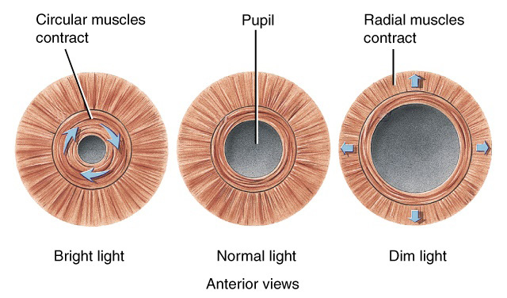
### 3.2 Ciliary body

The ciliary body is divided into:

#### 3.2.1 Pars plicata

- **Anterior** part.
- Contains **ciliary processes/projections**.
- Ciliary processes **secrete aqueous humour**.
- gives a count of roughly **70–75 ciliary processes per eye**.

#### 3.2.2 Pars plana

- **Posterior** part of ciliary body.
- **Pars plana:** posterior, relatively **avascular** part of the ciliary body.
- It is the preferred entry site for vitreous/posterior-segment procedures.
- It is repeatedly identified as an important **site for entry into the vitreous**.

### 3.3 Ciliary muscle and accommodation

- The ciliary muscle is an **intrinsic ocular muscle** within the ciliary body.
- The description it as a **circular muscle** that changes lens shape during accommodation.

| Parameter | Near vision | Far vision |
|---|---|---|
| Ciliary muscle | **Contracts**; circle constricts | **Relaxes**; circle expands |
| Zonules (suspensory ligaments) | Become **lax**; tension decreases | Become **taut**; tension increases |
| Lens | Becomes **thicker, rounder, more convex** | Becomes **thinner/flatter** |
| Pupil | Constricts | Dilates |

High-yield sequence for near accommodation: **ciliary muscle contracts → ciliary ring narrows → zonules become lax → lens becomes thicker/more convex → refractive power increases**.

### 3.4 Choroid

- **Posteriormost** component of the uvea.
- Highly **vascular**.
- On fundus examination, the **choroid appears red-orange** beneath the retina.
- Supplies the retinal pigment epithelium, which in turn supports rods and cones.

---

## 4. Anterior chamber and drainage angle

### 4.1 Chambers

- **Anterior chamber:** cornea ↔ iris.
- **Posterior chamber:** iris ↔ lens.
- Both together form the aqueous-containing **anterior segment**.

### 4.2 Angle of the anterior chamber

- The **drainage angle** is located below the limbus.
- The mnemonic for gonioscopy is:

> **“I Can See Till Schwalbe’s Line”** — structures from deepest to most superficial:
> **I** → Iris root
> **Can** → Ciliary body band
> **S** → Scleral spur
> **T** → Trabecular meshwork
> **S** → Schwalbe’s line

| Angle configuration | Structures visible on gonioscopy |
|---|---|
| **Open angle** | Iris root → ciliary body band → scleral spur → trabecular meshwork → Schwalbe’s line |
| **Angle closure** | Only Schwalbe’s line ± part of trabecular meshwork may be visible because the iris is pushed close to the cornea and hides deeper structures |

> **Figure 4. Anterior chamber angle anatomy.** The cornea, anterior chamber, iris, lens, posterior chamber, ciliary body, trabecular meshwork and scleral venous sinus/canal are shown.
> 
### 4.3 Aqueous production and outflow

- Aqueous is produced mainly by the **non-pigmented ciliary epithelium**.
- - Aqueous humour is produced mainly by the **ciliary processes**, with active secretion and contributions from ultrafiltration/diffusion.
- Production is approximately **2–3 µL/min**.
- Two major outflow routes:
 - **Trabecular/conventional:** about **90%**.
 - **Uveoscleral/unconventional:** about **10%**.

---

## 5. Lens and zonular apparatus

### 5.1 General anatomy

- **Biconvex** lens.
- The **anterior surface is flatter** than the posterior surface.
- Transparent.
- Located behind the iris and suspended by **zonules** from the ciliary body.
- **Lens refractive power:** approximately **+15 to +20 D** in the unaccommodated eye.
- **Average refractive index:** approximately **1.39**, with a gradient from the cortex toward the nucleus.

> **Figure 3. Lens anatomy.** Capsule, anterior epithelium, equatorial proliferative zone, cortex, nucleus, lens fibres and regional capsule measurements.
> 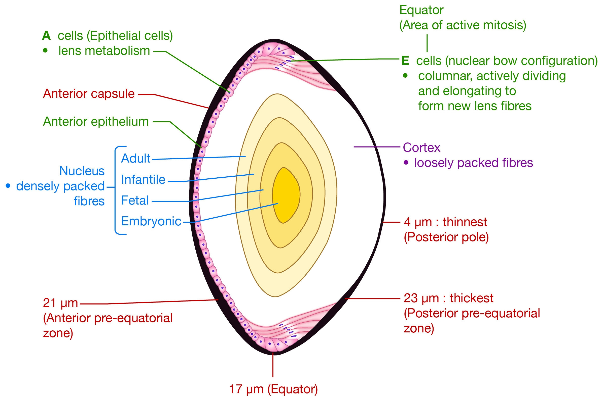
### 5.2 Lens structure

From anterior to posterior:

1. **Capsule**
2. **Anterior lens epithelium**
3. **Cortex**
4. **Nucleus**

Important anatomical points:

- The lens epithelium is a **single layer** on the anterior surface.
- **Equatorial cells** are actively proliferating and elongate to form new lens fibres.
- **Lens fibres are formed throughout life** from equatorial lens epithelial cells.
- **Oldest fibres** are in the nucleus; newer/younger fibres are in the cortex.
- The lens is **avascular**.
- The lens capsule is **elastic**.
- The lens is derived from **surface ectoderm**.

### 5.3 Lens embryology and sutures

- Early eye development begins during the **4th week of embryogenesis**.
- The lens develops after the optic vesicle contacts surface ectoderm and induces the **lens placode**.
- The optic vesicle contacts surface ectoderm → **lens placode → lens pit → lens vesicle → lens**.
- The mature lens lies inside the eye but develops from **surface ectoderm**.
- The embryonic/fetal lens nucleus and the characteristic sutures are identified:
 - **Anterior suture:** Y-shaped.
 - **Posterior suture:** inverted Y-shaped.

### 5.4 Lens capsule measurements shown in the figure

The lens diagram labels approximately:

- **Posterior pole:** **4 µm** (thinnest).
- **Anterior pre-equatorial zone:** **21 µm**.
- **Posterior pre-equatorial zone:** **23 µm**.
- **Equator:** **17 µm**.

These measurements are shown directly on the figure.

### 5.5 Lens proteins and metabolism — anatomy-linked details

The includes the following lens biochemical/anatomical details:

- Approximately **80% water-soluble** proteins and **20% water-insoluble** proteins.
- **α-crystallins:** largest, approximately **600 kDa**; located in the lens epithelium; function as heat-shock proteins.
- **β-crystallins:** major component, about **55%**.
- **γ-crystallins** are also present.
- Urea-soluble cytoskeletal proteins include **vimentin, filensin and phakinin**.
- Urea-insoluble **MIP26 / Aquaporin O** is linked to maintenance of transparency.
- Most lens glucose reaches the lens from the **aqueous humour**, with a smaller contribution from the vitreous.
- >80% of glucose is metabolized by **anaerobic glycolysis**; additional pathways include Krebs/HMP metabolism; a small fraction enters the sorbitol pathway.
- The sorbitol pathway becomes more active in **hyperglycaemia**.

---

## 6. Vitreous body

- Occupies the **posterior segment** behind the lens.
- classifies vitreous into three developmental/anatomical components:

### 6.1 Primary vitreous

- **Embryonic** vitreous.
- Contains hyaloid blood vessels and mesodermal tissue.
- It contains mesenchymal/mesodermal tissue.

### 6.2 Secondary vitreous

- Adult vitreous.
- Mainly composed of **hyaluronic acid + type II collagen**.

### 6.3 Tertiary vitreous

- Associated with the formation of **ciliary zonules / suspensory ligaments**.

### 6.4 Vitreoretinal attachment

- Strongest vitreoretinal attachment is the **vitreous base at the ora serrata**.
- Vitreous has a high **ascorbate concentration**, approximately **9-fold that of plasma**.
- **Bergmeister papilla** is a remnant of hyaloid tissue.
- **Persistent hyperplastic primary vitreous** represents persistent hyaloid/primary vitreous tissue.

> **Figure 15. Vitreous and hyaloid anatomy.**
> **Diagram omitted:** Vitreous and hyaloid attachment.
---

# 7. Retina

## 7.1 Gross anatomy

- Retina is the **inner/nervous tunic** of the eye.
- It is **neurosensory** and converts sensory input into neural signals.
- It terminates anteriorly at the **ora serrata**.
- The fundus contains the vitreous, retina and a red-appearing choroid.

## 7.2 Retinal landmarks

- **Optic disc:** approximately **1.5 mm** diameter and **vertically oval**; it contains a central optic cup and peripheral neuroretinal rim.
- **Optic disc = blind spot:** no rods or cones/photoreceptors.
- **Optic cup:** central portion of the disc.
- **Neuroretinal rim:** peripheral portion surrounding the cup.
- gives a normal **cup:disc ratio of 0.3**.
- **Macula:** temporal to the optic disc; appears relatively avascular on the fundus diagram.
- **Fovea:** maximum cones, centre of visual field and best image; foveal fixation develops by **3–4 months**.
- **Macula:** 5.5 mm diameter.
- **Fovea:** 1.5 mm diameter.
- **Foveola:** 350 µm.
- **Umbo:** 150 µm, at the centre of the fovea.
- **Foveal avascular zone:** approximately 500 µm.
- **Ora serrata:** anterior termination of retina; also uses it as a landmark for intravitreal entry, anterior to the ora serrata or approximately **3–4 mm posterior to limbus**, through sclera and pars plana.

> **Figure 6. Fundus anatomy.** Optic disc, retinal vessels and macular region.
> 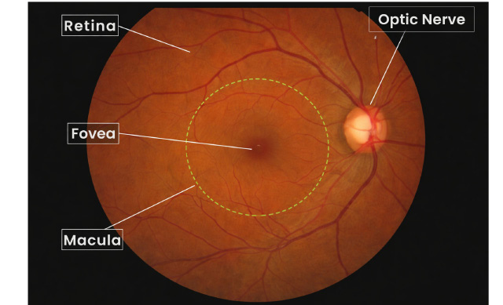
## 7.3 Retinal layers — inside → outside

The combined descriptions identify the following sequence:

1. **Internal limiting membrane (ILM)**
2. **Nerve fibre layer** — fibres collect to form the optic nerve
3. **Ganglion cell layer** — ganglion cells
4. **Inner plexiform layer (IPL)** — synaptic layer between ganglion and inner nuclear layers
5. **Inner nuclear layer (INL)** — includes bipolar cells, with horizontal and amacrine cells also identified in
6. **Outer plexiform layer (OPL)**
7. **Outer nuclear layer (ONL)** — nuclei of rods and cones
8. **External limiting membrane (ELM)** — states it is **not visualized** on routine representation
9. **Photoreceptors** — rods and cones
10. **Retinal pigment epithelium (RPE)** — outermost retinal layer

**ING (IOP)2** is the mnemonic for the inner-to-outer retinal layers.

- **Subretinal space:** between the inner retinal layers and the retinal pigment epithelium.
- Light passes through the retinal layers to the photoreceptor region, where **rods and cones convert the light stimulus into an electrical signal**.

> **Figure 5. Retinal histology.** The diagram shows retinal layers and the path of light toward the photoreceptors.
> 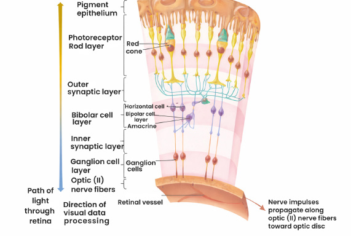
## 7.4 Retinal nuclear and plexiform organization

 groups the retina into **three nuclear layers**:

- **Outer nuclear layer:** nuclei of rods and cones.
- **Inner nuclear layer:** nuclei of intraretinal cells — horizontal cells, bipolar cells and amacrine cells.
- **Ganglion cell layer:** ganglion cells; innermost of the three nuclear layers.

Between the nuclear layers are the plexiform layers:

- **Outer plexiform layer:** between outer and inner nuclear layers.
- **Inner plexiform layer:** between inner nuclear and ganglion-cell layers.

Histological orientation is emphasized: from **choroid/sclera externally**, the first nuclear layer encountered is the **outer nuclear layer**.

## 7.5 Neuronal order

The neuronal order is:

- **Photoreceptors:** 1st-order neurons.
- **Bipolar cells:** 2nd-order neurons.
- **Ganglion cells:** 3rd-order neurons.
- Ganglion-cell axons collect in the nerve fibre layer and form the **optic nerve**.

## 7.6 Retinal pigment epithelium

- Forms the **outer blood-retinal barrier** .
- Takes nutrition from the **choroid**.
- Supplies/maintains rods and cones.
- emphasizes that loss of the RPE results in inability of rods and cones to survive.
- embryology: retina is derived from **neuroectoderm**.

### 7.7 Rods and cones — anatomy

> **Figure 7. Rod and cone anatomy.** The illustration shows pigment-containing discs in the outer segment and organelles in the inner segment.
> 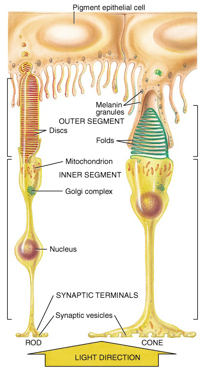
- **Outer segment:** discs containing photopigments and site of phototransduction.
 - Rods: **rhodopsin**.
 - Cones: **photopsin/iodopsin**
- **Inner segment:** nucleus, Golgi complex and mitochondria.
- Light passes through the retinal layers to the photoreceptor region, where **rods and cones convert the light stimulus into an electrical signal**.

### 7.8 Retinal blood vessels and barriers

The distinguishes two broad vascular arrangements:

- Vessels in the **outer plexiform/inner nuclear region** run perpendicular to this plane; hemorrhage here is typically **dot/blot**.
- Vessels in the **nerve fibre layer** run parallel to the retinal surface; hemorrhage here is **flame-shaped**.
- The retinal barriers include:
- **Outer blood-retinal barrier:** retinal pigment epithelium.
- **Inner blood-retinal barrier:** tight junctions between retinal vascular endothelial cells.
- **Bruch’s membrane:** innermost layer of the choroid, between **choroid and RPE**.

### 7.9 Vessel ratio on the fundus

- The fundus artery:vein ratio is approximately **2:3**; veins are thicker and carry darker blood.

---

### 8. Optic nerve and visual pathway — anatomical organization

#### 8.1 Optic nerve

- Optic nerve is formed by the **axons of retinal ganglion cells**.
- Optic-nerve length is roughly **3.5–5 cm**; the **intraorbital part** is approximately **25–30 mm**.
- Retinal nerve fibres leave the eye through the **optic disc/lamina cribrosa**.

#### 8.2 Core pathway

**Retinal ganglion cell → optic nerve → optic chiasma → optic tract → lateral geniculate body (LGB) → optic radiation → visual cortex.**

- The same nerve fibre runs from the retinal ganglion cell to the **LGB without a synapse before the LGB**; the optic nerve consists of ganglion-cell axons.

#### 8.3 Optic chiasma fiber organization

- **Nasal retinal fibres** cross at the optic chiasma; temporal retinal fibres remain uncrossed.
- Temporal fibres remain on the same side.

At the optic-nerve/optic-chiasma junction, the **anterior knee of von Willebrand** has the following fibre arrangement:

- **Superonasal fibres** cross into the opposite optic nerve.
- **Inferonasal fibres** loop into the contralateral optic nerve before entering inferiorly into the contralateral optic tract.
- This organization explains the **junctional scotoma** pattern.

#### 8.4 Lateral geniculate body

- The LGB is the **first relay** in the visual pathway.
- It has **6 layers**.
- organization:
 - **Layers 1, 4, 6:** receive fibres from the **contralateral nasal retina**.
 - **Layers 2, 3, 5:** receive fibres from the **ipsilateral temporal retina**.
- **Magnocellular pathway:** large cells, layers **1–2**; associated with gross movement/motion.
- **Parvocellular pathway:** layers **3–6**; associated with colour vision.
- **Koniocellular** cells/layers are associated with **blue colour**.

#### 8.5 Optic radiations

Two main optic-radiation bundles:

- **Meyer’s loop:** inferior optic radiation fibres pass through the **temporal lobe**; a lesion produces contralateral superior homonymous quadrantanopia — **“pie in the sky.”**
- **Baum’s loop:** superior optic radiation fibres pass through the **parietal lobe**; a lesion produces contralateral inferior homonymous quadrantanopia — **“pie on the floor.”**

#### 8.6 Visual cortex

- Majority of visual cortex is supplied by the **posterior cerebral artery (PCA)**.
- A small tip of occipital cortex is supplied by the **middle cerebral artery (MCA)**.
- The tip of the occipital lobe represents the **macular visual field**.
- **PCA involvement:** affects most visual fibres but can spare macular representation.
- **MCA involvement at the occipital tip:** can produce macular blindness.

---

### 9. Blood supply of the eye

Ocular arterial supply begins with the **internal carotid artery → ophthalmic artery**.

#### 9.1 Main arterial branches relevant to ocular anatomy

| Branch | Supply / relationship |
|---|---|
| **Central retinal artery** | Supplies the **inner retinal layers** and enters the eye with the optic nerve |
| **Short posterior ciliary arteries** | Supply **sclera, choroid and outer 4 layers of retina**; travel near the optic nerve |
| **Long posterior ciliary arteries** | Supply **ciliary body, iris and sclera**; travel away from the optic nerve; form/contribute to the **anterior ciliary arteries** |
| **Muscular branches** | Contribute to the **anterior ciliary arteries** |

- A **cilioretinal artery** may supply part of the retina and provide an additional blood supply in individuals in whom it is present.

---

# 10. Extraocular and intrinsic ocular muscles

## 10.1 Numbers

- **Extrinsic muscles:** **7 total** → **6** move the eyeball + **1** moves the upper lid (levator palpebrae superioris).
- **Intrinsic muscles:** **3 total** → **2 iris muscles + 1 ciliary muscle**.

## 10.2 Eyeball movements

| Muscle | Primary action | Secondary action | Tertiary action | Nerve |
|---|---|---|---|---|
| **Medial rectus** | Adduction | — | — | **CN III** |
| **Lateral rectus** | Abduction | — | — | **CN VI** |
| **Superior rectus** | Elevation | Intorsion | Adduction | **CN III** |
| **Inferior rectus** | Depression | Extorsion | Adduction | **CN III** |
| **Superior oblique** | Intorsion | Depression | Abduction | **CN IV** |
| **Inferior oblique** | Extorsion | Elevation | Abduction | **CN III** |

rule: **LR = CN VI, SO = CN IV, all remaining extraocular muscles = CN III**.

## 10.3 Levator palpebrae superioris

- **Levator palpebrae superioris** is the uppermost muscle in the external ocular anatomy.
- Elevates the **upper eyelid**.
- Supplied by **CN III (oculomotor nerve)**.

---

## 11. Orbit

### 11.1 General architecture

- Orbit is a **four-walled** bony cavity formed by **7 bones**.
- **Base:** quadrangular.
- **Apex:** conical/triangular.
- Volume: approximately **30 mL**

### 11.2 Orbital walls

- **Medial wall:** thinnest; the **lamina papyracea of the ethmoid** is its major thin bony component.
- **Lateral wall:** the strongest of the four orbital walls.
- **Floor:** weakest and the classic site of an **orbital blow-out fracture**.
- Medial wall bones include the **maxilla, lacrimal, ethmoid and sphenoid**.

- In dacryocystorhinostomy (**DCR**), the **maxillary and lacrimal bones** form the bony lacrimal-fossa region.

### 11.3 Cone of muscles and Annulus of Zinn

- Extraocular muscles form a **cone of muscle** within the orbit.
- **Annulus of Zinn** = **common tendinous ring** and origin of the extraocular muscles.

> **Figure 12. Orbital cone / Annulus of Zinn.** Conical arrangement of the extraocular muscles and orbital walls.
> 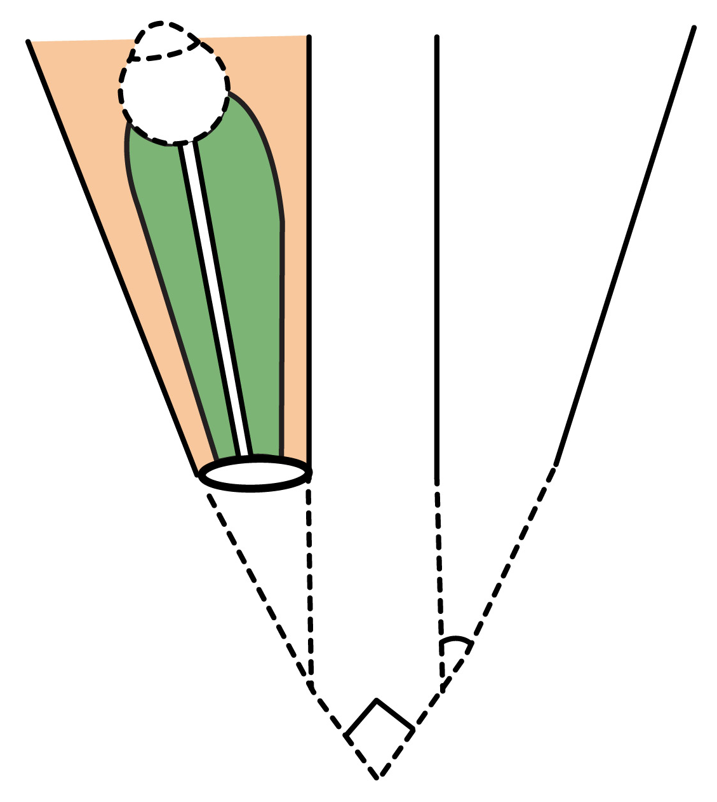
### 11.4 Intraconal and extraconal spaces

- **Retrobulbar local anaesthesia:** **intraconal** space.
- **Peribulbar local anaesthesia:** **extraconal** space and generally has fewer complications.

### 11.5 Blow-out fracture

- The orbital **floor** is the weakest wall.
- A blow-out fracture is produced when increased orbital pressure results in fracture of the floor.
- Herniation toward the **maxillary sinus** can produce the **tear-drop sign** on imaging.

---

## 12. Eyelids

### 12.1 Eyelid lamellae

The eyelid is divided into **anterior** and **posterior laminae** by the **grey line**.

| Lamina | Structures |
|---|---|
| **Anterior lamina** | Skin, subcutaneous tissue, muscles |
| **Posterior lamina** | Tarsal plate, palpebral conjunctiva, glands |

### 12.2 Tarsal plates

- Present in the **upper and lower lids**.
- Provide **structural support**.
- The tarsal plate is **fibrous tissue, not cartilage**.

### 12.3 Eyelid muscles and glands

| Structure | Supply | Main action / role |
|---|---|---|
| **Levator palpebrae superioris** | CN III | Elevates upper eyelid |
| **Müller’s muscle** | Sympathetic fibres | Assists upper-lid elevation |
| **Orbicularis oculi** | CN VII | Closes eyelids |

Posterior lamina contains:

- **Tarsal plate**
- **Palpebral conjunctiva**
- **Meibomian glands**
- **Zeis glands**
- **Moll glands** (modified sweat glands).

### 12.4 Orbital septum

- Extends from **tarsal plate to bone** in both lids.
- Divides the orbital region into:
 - **Preseptal space** → infection = preseptal cellulitis.
 - **Postseptal space** → infection = orbital cellulitis.

> **Figure 9. External anatomy of the eye and eyelid/orbit.** The illustration shows the eyelid, orbital structures and associated muscles and soft tissues.
> 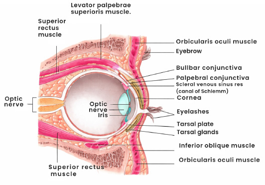
---

## 13. Conjunctiva

### 13.1 General organization

The conjunctiva covers the **outer surface of the sclera** and the **inner surface of the eyelids**.

Three anatomical regions:

1. **Bulbar conjunctiva** — lines/covers the sclera.
2. **Palpebral conjunctiva** — lines the eyelids.
3. **Forniceal conjunctiva** — lies between bulbar and palpebral conjunctiva.

### 13.2 Goblet cells and tear film

- Goblet cells are present in the conjunctival epithelium.
- They secrete **mucin**.
- This mucin forms the **innermost layer of the tear film**.

### 13.3 Lymphatic drainage

- **Medial conjunctiva:** submandibular lymph nodes.
- **Lateral conjunctiva:** preauricular lymph nodes.
- Conjunctival lymphatics drain **medially to submandibular nodes** and **laterally to preauricular nodes**.

### 13.4 Relationship to limbus/cornea

- Normally, conjunctiva covers the **sclera**, not the cornea.
- In **pterygium**, conjunctiva grows over the cornea, associated with **limbal stem-cell deficiency**.

---

### 14. Lacrimal apparatus

#### 14.1 Functional components and positions

- **Lacrimal gland:** produces tears; located **superolaterally**.
- **Lacrimal sac:** collects tears for drainage; located **inferomedially**.
- The explicitly warns that **lacrimal gland ≠ lacrimal sac**.

#### 14.2 Tear drainage pathway

**Lacrimal gland → tear film across eye surface → upper and lower lacrimal puncta → lacrimal canaliculi → lacrimal sac → nasolacrimal duct → inferior meatus of the nose.**

> **Figure 10. Lacrimal apparatus — anterior view.** Lacrimal gland, puncta and canaliculi.
> 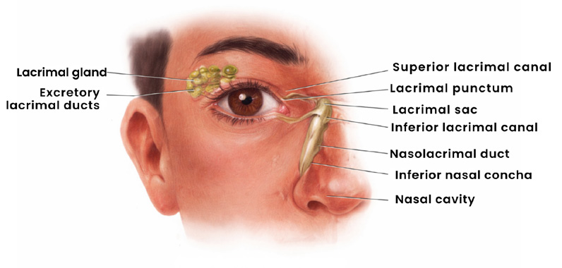
> **Figure 11. Lacrimal drainage measurements.** Canalicular measurements and drainage pathway.
> 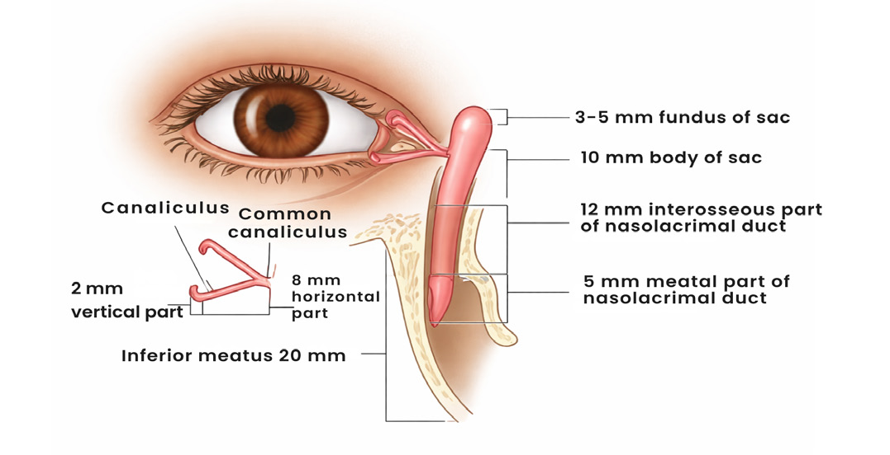
#### 14.3 Canalicular dimensions

| Component | Length |
|---|---:|
| Vertical part | **2 mm** |
| Horizontal part | **8 mm** |
| Total canaliculus | **10 mm (1 cm)** |

---

### 15. Ocular developmental anatomy / embryology

#### 15.1 Early eye development

- The eye develops as an outgrowth of the **forebrain**.
- **PAX6** is a key developmental transcription factor.
- Early eye development begins during the **4th week of embryogenesis**.
- The **optic vesicle** contacts surface ectoderm and initiates lens development.
- The sequence is:

**Lens placode → lens pit → lens vesicle → lens.**

- Lens development begins when the optic vesicle contacts surface ectoderm and induces the **lens placode**.
- The **choroid fissure** closes during the **6th–7th week**; failure of closure produces **coloboma**.

> **Figure 14. Eye embryology.** Forebrain/optic grooves, optic vesicle, lens placode, lens pit, lens vesicle and choroid fissure.
> **Diagram omitted:** Eye embryology.
#### 15.2 Tissue derivatives — classification

##### Surface ectoderm

Surface ectoderm derivatives include:

- Skin appendages
- Lens
- Epithelial lining of conjunctiva
- Epithelial lining of cornea

##### Neuroectoderm — mnemonic: **STORME**

- **Secondary vitreous**
- **Tertiary vitreous**
- **Optic nerve**
- **Retina**
- **Muscles of pupil:** sphincter + dilator
- **Epithelium of iris and ciliary body**

##### Neural crest

- **Sclera** (with a mesodermal contribution to the temporal scleral region).
- **Choroid**.
- **Corneal stroma and endothelium**.
- **Trabecular meshwork**.
- **Ciliary muscle**.

##### Mesoderm — mnemonic: **PSME**

- **Primary vitreous**.
- **Temporal sclera**.
- **Extraocular muscles**.
- **Endothelial lining of blood vessels**.

---

#### 16. Integrated spatial flow of the eye

A useful continuous anatomical sequence from anterior to posterior is:

**Cornea → anterior chamber (aqueous) → iris/pupil → posterior chamber (aqueous) → lens → vitreous → retina → choroid → sclera → optic disc/lamina cribrosa → optic nerve.**

The middle coat, **uvea**, runs as **iris → ciliary body → choroid**. The anterior fibrous coat is **cornea**, the posterior fibrous coat is **sclera**, and the junction is **limbus**.

Within the retina, the anatomical sequence is:

**ILM → nerve fibre layer → ganglion cell layer → inner plexiform → inner nuclear → outer plexiform → outer nuclear → external limiting membrane → rods/cones → RPE.**

The neuronal flow is:

**Rods/cones → bipolar cells → ganglion cells → optic nerve → optic chiasma → optic tract → LGB → optic radiation → visual cortex.**

Aqueous flow in terms is:

**Ciliary processes/non-pigmented ciliary epithelium → posterior chamber → through pupil → anterior chamber → trabecular and uveoscleral outflow pathways.**

Tear flow is:

**Lacrimal gland → ocular surface → puncta → canaliculi → lacrimal sac → nasolacrimal duct → inferior meatus.**

---

#### 17. High-yield anatomical measurements and numeric facts

| Structure / parameter | value |
|---|---:|
| Eyeball volume | **6 mL** |
| Orbit volume | **30 mL** |
| Axial length | **~24 mm** |
| Anterior chamber depth | **~2.4–2.5 mm** |
| Total refractive power of eye | **~60 D** |
| Corneal contribution | **Anterior 1/6** of fibrous tunic |
| Scleral contribution | **Posterior 5/6** of fibrous tunic |
| Corneal power | **~+43 D** |
| Lens power | **~+15 to +20 D** |
| Central corneal thickness | **~540 µm / 0.54 mm** |
| Normal corneal endothelial cells | **~2500/mm² in adults** |
| Critical endothelial density | **<500/mm²** |
| Optic disc diameter | **1.5 mm** |
| Macula diameter | **5.5 mm** |
| Fovea diameter | **1.5 mm** |
| Foveola | **350 µm** |
| Umbo | **150 µm** |
| Foveal avascular zone | **~500 µm** |
| Canaliculus vertical limb | **2 mm** |
| Canaliculus horizontal limb | **8 mm** |
| Total canaliculus | **10 mm / 1 cm** |
| Optic nerve length | **~3.5–5 cm** |
| Intraorbital optic-nerve part | **~25–30 mm** |
| Ciliary processes | **~70–75 per eye** |
| Foveal fixation | **3–4 months** |

---

