# Anatomy of the Eye — Integrated Exam Notes

> **Source basis:** These notes are a consolidated anatomy-focused extraction from the four supplied PDFs: *Ophthalmology Prep V6*, *Ophthalmology Revision Edition 8 - No watermark*, *Ophthalmology Revision E6.5*, and *Ophthalmology - Hyperrevision*. The PDFs are treated as the authoritative source. Repeated material has been merged; unique details have been retained. No outside knowledge has been added to fill gaps.
>
> **Reading note:** Some source statements differ between editions. Where that occurs, the differing source values/descriptions are retained rather than silently corrected or reconciled.

## 1. Big-picture organization of the eye

### 1.1 Eyeball: general features

- **Shape:** aspherical / oblate spheroid.
- **Volume of eyeball:** **6 mL**.
- **Volume of orbit:** **30 mL** (given in E6.5).
- The eyeball lies within the **orbit**, which is described as having **4 walls**.
- **Thinnest orbital wall:** medial wall.
- **Weakest orbital wall:** floor.
- **Most common orbital fracture:** blow-out fracture.
- **Orbital base:** quadrangular.
- **Orbital apex:** triangular / conical.

> **Figure 1. Cross-section of the eyeball.** The source cross-section identifies the cornea, iris/pupil, lens, zonules, ciliary body with pars plicata and pars plana, sclera, choroid/uvea, retina, vitreous, aqueous, fovea, optic disc/optic nerve, optic cup and neuroretinal rim, and the central retinal vessels.
>
> 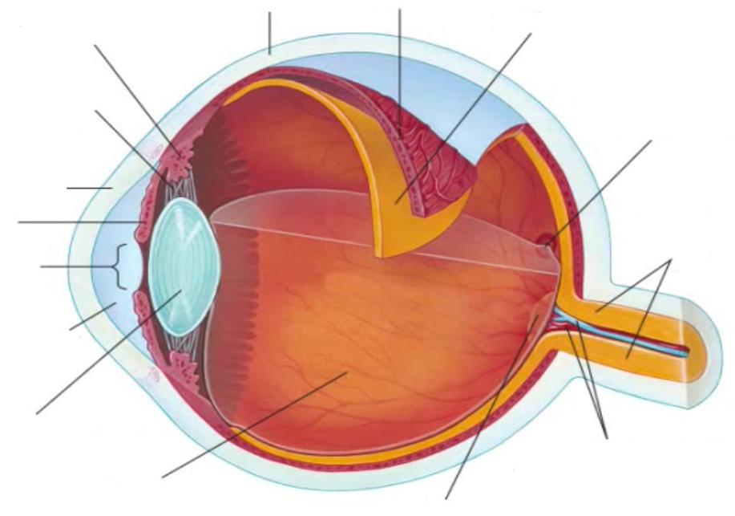
>
> *Extraction note: the source page contains some labels as surrounding page text rather than inside the raster figure; all identified labels are preserved in the notes below.*

> **Figure 13. Basic ocular segment diagram from Prep V6.** The source scan labels the anterior/posterior segments, AC/PC water, nodal-point region, lamina cribrosa, episcleral venous system, trabecular meshwork (TM) and scleral-canal region (SC).
>
> 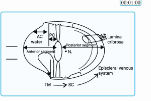

### 1.2 Three coats (tunics) of the eyeball

| Coat | Position/type | Components | Source-linked details |
|---|---|---|---|
| **Fibrous tunic** | Outer | **Cornea + sclera**; junction = **limbus** | Cornea forms anterior **1/6**, sclera posterior **5/6** |
| **Vascular tunic (uvea)** | Middle | **Iris + ciliary body + choroid** | Vascular coat |
| **Nervous tunic** | Inner | **Retina** | Retina is described as derived from **neuroectoderm** |

The limbus is the corneoscleral junction and contains the limbal stem-cell population.

### 1.3 Anterior and posterior segments

- **Anterior segment:** anterior chamber + posterior chamber; contains **aqueous humour**.
  - **Anterior chamber:** between **cornea and iris**.
  - **Posterior chamber:** between **iris and lens**.
- **Posterior segment:** contains **vitreous humour**.
- On the source cross-sectional diagram, the aqueous occupies the anterior segment and the vitreous the posterior segment.
- Prep V6 also describes the whole eye as two segments, with the **anterior segment including the lens and the region anterior to it**, and the **posterior segment behind the lens**.
- The source notes the **nodal point** as the point at which parallel rays are bent by the cornea and lens and focused just behind the lens.
- Corneal contribution to refractive power is emphasized as greater than that of the lens because of the greater curvature of the anterior surface and the refractive-index difference at the **air–water** interface.
- Prep V6 explicitly states that **cornea and lens are avascular** to maintain transparency.

### 1.4 Key spatial landmarks

- **Limbus:** corneoscleral junction; limbal stem-cell zone.
- **Angle of the anterior chamber:** anatomical landmark **below the limbus**; this is the drainage angle.
- **Pars plana:** posterior portion of ciliary body; source material identifies it as a point/site of entry into the vitreous/fundus.
- **Ora serrata:** anterior termination of the retina.
- **Optic disc:** blind spot because it has **no photoreceptors**.
- **Fovea:** area with maximum number of cones and centre of visual field; best image formation.

---

## 2. Fibrous tunic

# 2.1 Cornea

### 2.1.1 General anatomy and properties

- **Anterior 1/6** of the fibrous tunic.
- **Transparent**, although the source notes that it can appear black externally.
- **Convex / converging** surface.
- Corneal refractive power is source-dependent:
  - Edition 8: **+43 to +44 D**.
  - Prep V6: **43–45 D**.
- Source relationship: **curvature ∝ power**.
- One source gives corneal refractive index as approximately **1.37**; Hyperrevision gives **1.376**.
- The cornea is **avascular except at the limbus** (E6.5).
- The source describes corneal nutrition as coming from the **aqueous**, with oxygen supplied from the **air**.
- Source physiology describes the cornea as maintaining relative dehydration through the endothelial barrier/pump, with **Na/K ATPase** specifically identified in E6.5.

> **Figure 2. Corneal layers and thicknesses.** The source diagram identifies the epithelial layer, epithelial basement membrane, Bowman layer, stroma, Dua layer, Descemet membrane and endothelium, with layer thicknesses shown on the figure.
>
> 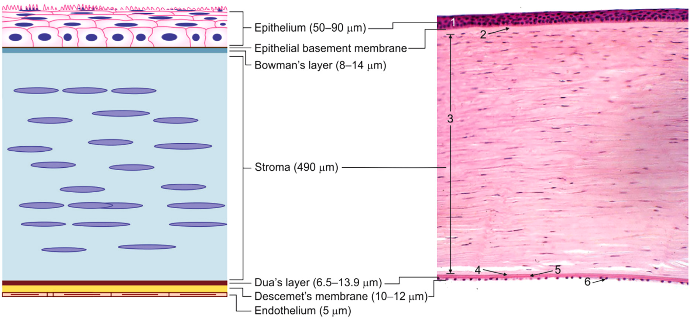

### 2.1.2 Layers of the cornea — anterior → posterior

| Layer | Source details |
|---|---|
| **1. Epithelium** | **Non-keratinized stratified squamous epithelium.** Superficial cells are squamous, with microvilli involved in adhesion of the tear film. Basal cells are columnar, with mitosis and regeneration. The source figure gives an epithelial thickness of roughly **50–90 µm**. |
| **2. Bowman’s layer** | **False basement membrane**, **PAS-negative**, **acellular**. The source emphasizes **no regeneration**, with healing by scar formation and resulting corneal opacity. Figure thickness approximately **8–14 µm**. |
| **3. Stroma** | Made mainly of **collagen (mostly type I)** and **GAGs (mostly keratan sulphate)**. It is the **thickest** corneal layer in the source diagram and is described as among the metabolically active layers. Figure thickness about **490 µm**. |
| **4. Dua’s layer** | Described as the **strongest corneal layer**. Figure thickness approximately **6.5–13.9 µm**. |
| **5. Descemet’s membrane (DM)** | Previously described as the strongest layer; source notes **regeneration +**. **Schwalbe’s line** is the peripheral termination of Descemet’s membrane. Figure thickness approximately **10–12 µm**. |
| **6. Endothelium** | Metabolically active and essential for maintaining **corneal transparency**. Counted by **specular microscopy**. Figure thickness about **5 µm**. |

#### Regeneration-related source details

- **Epithelium:** regenerates from basal cells.
- **Bowman’s layer:** no regeneration; heals by scarring.
- E6.5 also states that **endothelial cells, Bowman’s layer and stroma do not regenerate**, whereas Edition 8 explicitly states **regeneration +** for Descemet’s membrane. The descriptions are retained as stated by the respective sources.

### 2.1.3 Corneal endothelial cell density

Source values differ slightly between editions:

| Source statement | Value/significance |
|---|---|
| Edition 8 | **2400–3000 cells/mm²** = normal; **<2400** = corneal compensation; **<500** = critical point → corneal decompensation → edema → hazy cornea |
| E6.5 | Normal adult about **2500–3000 cells/mm²**; **<500** cannot maintain the dehydrated state → corneal stromal/epithelial hydration and bullous keratopathy |
| Hyperrevision | Adult about **2500–3000 cells/mm²**; source also gives a higher newborn endothelial-cell density, around **5000–6000 cells/mm²**, with decline with age |

### 2.1.4 Corneal innervation and blink reflex

- Sensory supply: **Trigeminal → ophthalmic division → nasociliary nerve**.
- Corneal sensation can be tested with a **cotton wisp**:
  - afferent limb: **CN V**
  - brainstem integration
  - efferent limb: **CN VII** to **orbicularis oculi**.
- Normal corneal sensation therefore produces **blinking**.
- With **corneal anaesthesia**, the source diagram shows absence of blinking; the most common cause listed is **herpes**.

### 2.1.5 Limbus

- **Corneoscleral junction.**
- Contains limbal stem cells.
- Marker listed in Edition 8:
  - **Specific marker:** ABCG2.
  - **Universal marker:** CD34.
- Hyperrevision describes the **Palisades of Vogt** as an arrangement of limbal stem cells that gives rise to corneal epithelium.
- Pterygium is linked in the source to **limbal stem-cell deficiency**, allowing conjunctiva to grow over the cornea; normally conjunctiva covers the sclera rather than the cornea.

### 2.1.6 Corneal clinical-anatomical measurements / landmarks retained from the source

- Normal central corneal thickness by pachymetry: approximately **540 µm / 0.54 mm**.
- Keratometry measures corneal curvature.
- Topography examines the corneal surface with a **Placido disc**.
- These investigation details are retained because they are tied directly to the corneal anatomical surface and measurements.

---

# 2.2 Sclera

- Forms the **posterior 5/6** of the fibrous tunic.
- **Opaque and white**.
- Covered externally by **conjunctiva**.
- The source visual anatomy places the **lamina cribrosa** at the posterior scleral/optic-disc region, where retinal nerve fibres leave the eye to form the optic nerve.
- The sclera has developmental contributions that vary by region: the embryology section below preserves the source distinction between **neural crest-derived sclera** and the **temporal part** attributed to mesoderm.

---

## 3. Vascular tunic (uvea)

The **uvea** is the middle vascular coat and consists of:

1. **Iris**
2. **Ciliary body**
3. **Choroid**

### 3.1 Iris

- Anterior component of the uvea.
- Contains the two intrinsic pupillary muscles:
  - **Sphincter pupillae:** circular muscle → **miosis**; parasympathetic supply.
  - **Dilator pupillae:** radial muscle → **mydriasis**; sympathetic supply.
- The pupil is the central aperture through which light passes into the posterior eye.

> **Figure 8. Pupillary muscle organization.** The source diagram contrasts circular and radial iris muscle activity with pupillary constriction and dilation.
>
> 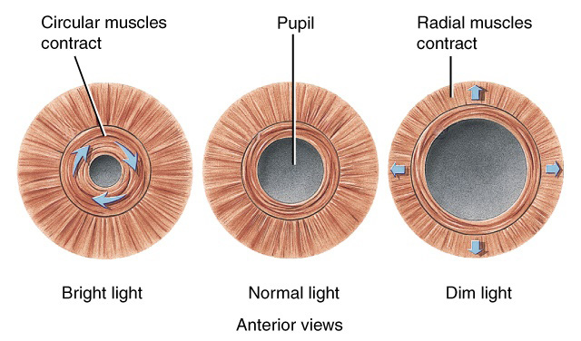

### 3.2 Ciliary body

The ciliary body is divided into:

#### 3.2.1 Pars plicata

- **Anterior** part.
- Contains **ciliary processes/projections**.
- Ciliary processes **secrete aqueous humour**.
- Prep V6 gives a count of roughly **70–75 ciliary processes per eye**.

#### 3.2.2 Pars plana

- **Posterior** part of ciliary body.
- Source descriptions differ:
  - Edition 8: **relatively avascular**, and a point of entry into the fundus/vitreous.
  - E6.5: labels pars plana as **most vascular**.
- Rather than reconciling the discrepancy, both source descriptions are retained here.
- It is repeatedly identified as an important **site for entry into the vitreous**.

### 3.3 Ciliary muscle and accommodation

- The ciliary muscle is an **intrinsic ocular muscle** located in the ciliary body.
- The source describes it as a **circular muscle** that changes lens shape during accommodation.

| Parameter | Near vision | Far vision |
|---|---|---|
| Ciliary muscle | **Contracts**; circle constricts | **Relaxes**; circle expands |
| Zonules (suspensory ligaments) | Become **lax**; tension decreases | Become **taut**; tension increases |
| Lens | Becomes **thicker, rounder, more convex** | Becomes **thinner/flatter** |
| Pupil | Constricts | Dilates |

Source high-yield sequence for near accommodation: **ciliary muscle contracts → ciliary ring narrows → zonules become lax → lens becomes thicker/more convex → refractive power increases**.

### 3.4 Choroid

- **Posteriormost** component of the uvea.
- Described as having **increased vascularity**.
- On fundus examination, the source describes the choroid as appearing **red**.
- Supplies the retinal pigment epithelium, which in turn supports rods and cones.

---

## 4. Anterior chamber and drainage angle

### 4.1 Chambers

- **Anterior chamber:** cornea ↔ iris.
- **Posterior chamber:** iris ↔ lens.
- Both together form the aqueous-containing **anterior segment**.

### 4.2 Angle of the anterior chamber

- The **drainage angle** is located below the limbus.
- The source mnemonic for gonioscopy is:

> **“I Can See Till Schwalbe’s Line”** — structures from deepest to most superficial:
>
> **I** → Iris root  
> **Can** → Ciliary body band  
> **S** → Scleral spur  
> **T** → Trabecular meshwork  
> **S** → Schwalbe’s line

| Angle configuration | Structures visible on gonioscopy |
|---|---|
| **Open angle** | Iris root → ciliary body band → scleral spur → trabecular meshwork → Schwalbe’s line |
| **Angle closure** | Only Schwalbe’s line ± part of trabecular meshwork may be visible because the iris is pushed close to the cornea and hides deeper structures |

> **Figure 4. Anterior chamber angle anatomy.** The source illustration labels the cornea, anterior chamber, iris, lens, posterior chamber and the angle structures, including the ciliary body/process region, trabecular outflow region and scleral venous sinus/canal region.
>
> 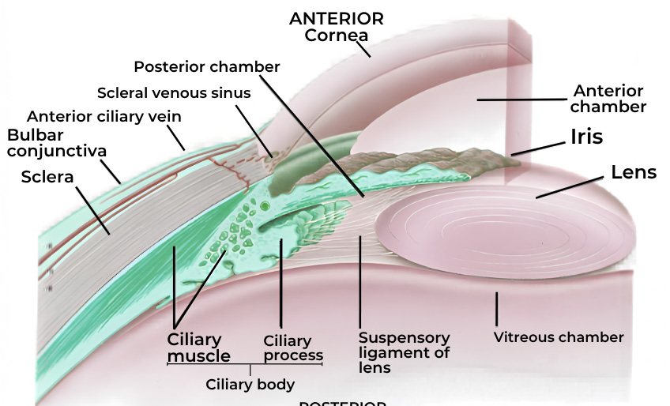

### 4.3 Aqueous production and outflow

- Aqueous is produced mainly by the **non-pigmented ciliary epithelium**.
- The source mentions contributions from **ultrafiltration and diffusion**.
- Source production rate: about **2–3 µL/min**.
- Two major outflow routes are given:
  - **Trabecular/conventional:** about **90%**.
  - **Uveoscleral/unconventional:** about **10%**.

---

## 5. Lens and zonular apparatus

### 5.1 General anatomy

- **Biconvex** lens.
- The **anterior surface is flatter** than the posterior surface.
- Transparent.
- Located behind the iris and suspended by **zonules** from the ciliary body.
- Lens refractive power varies by source:
  - Edition 8: **+16 to +19 D**.
  - Prep V6: **+16 to +17 D**.
- Refractive index values in the sources are around **1.39**, with the centre/nucleus described as having the higher value (Hyperrevision: average 1.39; cortex 1.38; nucleus 1.40).

> **Figure 3. Lens anatomy.** The extracted source figure shows the capsule, anterior epithelium, equatorial proliferative zone, cortex, nucleus, lens fibres and the regional capsule measurements.
>
> 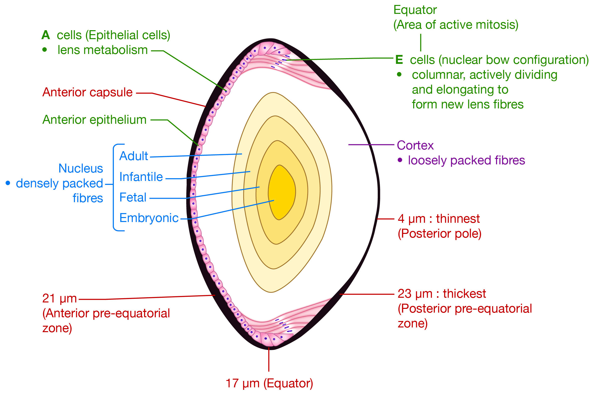

### 5.2 Lens structure

From anterior to posterior, the source material describes:

1. **Capsule**
2. **Anterior lens epithelium**
3. **Cortex**
4. **Nucleus**

Important anatomical points:

- The lens epithelium is a **single layer** on the anterior surface.
- **Equatorial cells** are actively proliferating and elongate to form new lens fibres.
- The source states that **lens fibres are formed throughout life**.
- **Oldest fibres** are in the nucleus; newer/younger fibres are in the cortex.
- The lens is **avascular**.
- The capsule is described in Prep V6 as **elastic**.
- The lens is derived from **surface ectoderm**.

### 5.3 Lens embryology and sutures

- General eye development is said to begin around **day 22 of gestation** in Prep V6.
- Lens development is separately dated from approximately **day 27** in Edition 8.
- The optic vesicle contacts surface ectoderm → **lens placode → lens pit → lens vesicle → lens**.
- The lens therefore develops from **surface ectoderm**, despite its location internally in the mature eye.
- The source identifies the embryonic/fetal lens nucleus and the characteristic sutures:
  - **Anterior suture:** Y-shaped.
  - **Posterior suture:** inverted Y-shaped.

### 5.4 Lens capsule measurements shown in the source figure

The extracted lens diagram labels approximately:

- **Posterior pole:** **4 µm** (thinnest).
- **Anterior pre-equatorial zone:** **21 µm**.
- **Posterior pre-equatorial zone:** **23 µm**.
- **Equator:** **17 µm**.

These measurements are retained exactly from the source figure.

### 5.5 Lens proteins and metabolism — anatomy-linked source details

The source includes the following lens biochemical/anatomical details:

- Approximately **80% water-soluble** proteins and **20% water-insoluble** proteins.
- **α-crystallins:** largest, approximately **600 kDa**; located in lens epithelium; described as heat-shock proteins.
- **β-crystallins:** major component, about **55%**.
- **γ-crystallins** are also listed.
- Urea-soluble cytoskeletal proteins include **vimentin, filensin and phakinin**.
- Urea-insoluble **MIP26 / Aquaporin O** is linked to maintenance of transparency.
- Lens glucose entry: source gives approximately **90% from aqueous** and **10% from vitreous**.
- >80% of glucose is metabolized by **anaerobic glycolysis**; additional pathways include Krebs/HMP metabolism; a small fraction enters the sorbitol pathway.
- The source notes that sorbitol pathway activity becomes important in **hyperglycaemia**.

---

## 6. Vitreous body

- Occupies the **posterior segment** behind the lens.
- Source classifies vitreous into three developmental/anatomical components:

### 6.1 Primary vitreous

- **Embryonic** vitreous.
- Contains hyaloid blood vessels and mesodermal tissue.
- Source associates it with **mesodermal** origin.

### 6.2 Secondary vitreous

- Adult vitreous.
- Mainly composed of **hyaluronic acid + type II collagen**.

### 6.3 Tertiary vitreous

- Associated with the formation of **ciliary zonules / suspensory ligaments**.

### 6.4 Vitreoretinal attachment

- Strongest vitreoretinal attachment is the **vitreous base at the ora serrata**.
- Source gives an approximately **9:1 vitreous:plasma ascorbic ratio**.
- **Bergmeister papilla** is described as a remnant of hyaloid tissue.
- **Persistent hyperplastic primary vitreous** is also described as remnant hyaloid tissue.

> **Figure 15. Vitreous/hyaloid source images.** Source page showing vitreous-related material and the optic-disc/hyaloid-remnant illustration used with the vitreous section.
>
> 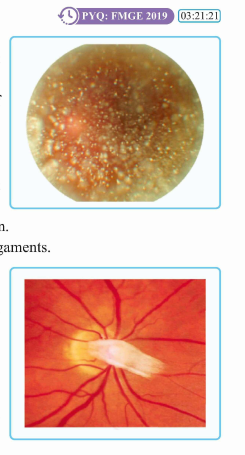

---

## 7. Retina

### 7.1 Gross anatomy

- Retina is the **inner/nervous tunic** of the eye.
- It is **neurosensory** and converts sensory input into neural signals.
- It terminates anteriorly at the **ora serrata**.
- The fundus contains the vitreous, retina and a red-appearing choroid.

### 7.2 Retinal landmarks

- **Optic disc:** approximately **1.5 mm** diameter, described as **vertically oval**; central optic cup and peripheral neuroretinal rim are identified.
- **Optic disc = blind spot:** no rods or cones/photoreceptors.
- **Optic cup:** central portion of the disc.
- **Neuroretinal rim:** peripheral portion surrounding the cup.
- Edition 8 gives a normal **cup:disc ratio of 0.3**.
- **Macula:** temporal to the optic disc; appears relatively avascular on the fundus diagram.
- **Fovea:** maximum cones, centre of visual field and best image; foveal fixation develops by **3–4 months**.
- Hyperrevision gives:
  - **Macula:** 5.5 mm diameter.
  - **Fovea:** 1.5 mm diameter.
  - **Foveola:** 350 µm.
  - **Umbo:** 150 µm, centre of fovea.
  - **Foveal avascular zone:** about 500 µm; source notes that it is visible only on fundus fluorescein angiography.
- **Ora serrata:** anterior termination of retina; source also uses it as a landmark for intravitreal entry, anterior to the ora serrata or approximately **3–4 mm posterior to limbus**, through sclera and pars plana.

> **Figure 6. Fundus anatomy.** Source fundus image showing the optic disc, retinal vessels and macular region.
>
> 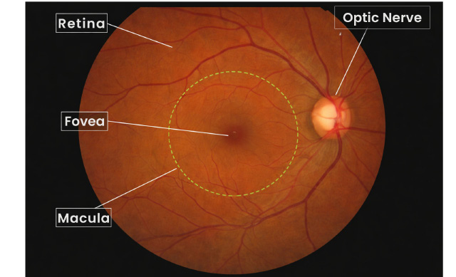

### 7.3 Retinal layers — inside → outside

The combined source descriptions identify the following sequence:

1. **Internal limiting membrane (ILM)**
2. **Nerve fibre layer** — fibres collect to form the optic nerve
3. **Ganglion cell layer** — ganglion cells
4. **Inner plexiform layer (IPL)** — synaptic layer between ganglion and inner nuclear layers
5. **Inner nuclear layer (INL)** — includes bipolar cells, with horizontal and amacrine cells also identified in Hyperrevision
6. **Outer plexiform layer (OPL)**
7. **Outer nuclear layer (ONL)** — nuclei of rods and cones
8. **External limiting membrane (ELM)** — source states it is **not visualized** on routine representation
9. **Photoreceptors** — rods and cones
10. **Retinal pigment epithelium (RPE)** — outermost retinal layer in the source diagrams

A source mnemonic for the inner-to-outer retinal layers is given as **ING (IOP)2**.

- The **subretinal space** is described as the space between the **inner 9 retinal layers and the pigment epithelium**.
- Hyperrevision emphasizes the anatomical light path: **light passes through all retinal layers → reaches the retinal pigment epithelium/photoreceptor region → rods and cones convert the stimulus into an electrical signal**.

> **Figure 5. Retinal histology.** The source diagram shows the layered retina and the path of light through the retinal layers to the retinal pigment epithelium and photoreceptors.
>
> 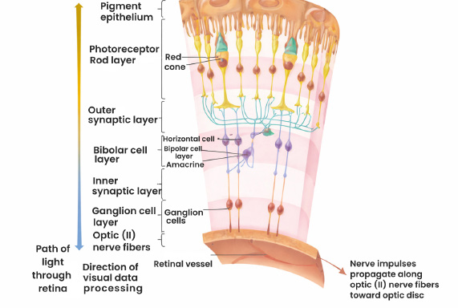

### 7.4 Retinal nuclear and plexiform organization

Hyperrevision groups the retina into **three nuclear layers**:

- **Outer nuclear layer:** nuclei of rods and cones.
- **Inner nuclear layer:** nuclei of intraretinal cells — horizontal cells, bipolar cells and amacrine cells.
- **Ganglion cell layer:** ganglion cells; innermost of the three nuclear layers.

Between the nuclear layers are the plexiform layers:

- **Outer plexiform layer:** between outer and inner nuclear layers.
- **Inner plexiform layer:** between inner nuclear and ganglion-cell layers.

Histological orientation is emphasized: from **choroid/sclera externally**, the first nuclear layer encountered is the **outer nuclear layer**.

### 7.5 Neuronal order

The source identifies:

- **Photoreceptors:** 1st-order neurons.
- **Bipolar cells:** 2nd-order neurons.
- **Ganglion cells:** 3rd-order neurons.
- Ganglion-cell axons collect in the nerve fibre layer and form the **optic nerve**.

### 7.6 Retinal pigment epithelium

- Forms the **outer blood-retinal barrier** in the source diagrams.
- Takes nutrition from the **choroid**.
- Supplies/maintains rods and cones.
- Hyperrevision emphasizes that loss of the RPE results in inability of rods and cones to survive.
- Source embryology: retina is derived from **neuroectoderm**.

### 7.7 Rods and cones — source anatomy

> **Figure 7. Rod and cone anatomy.** The source illustration identifies the photoreceptor outer segment with pigment-containing discs and the inner segment with organelles.
>
> 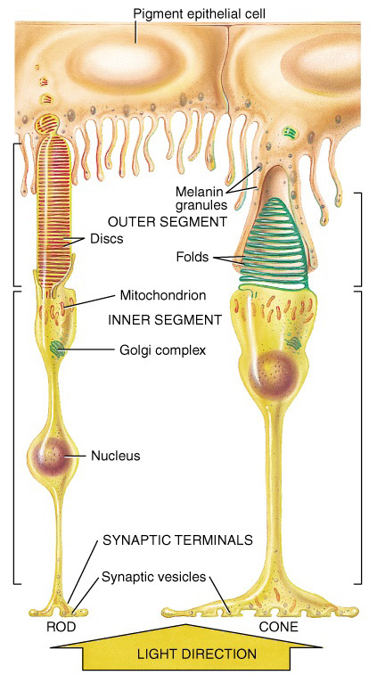

- **Outer segment:** discs containing photopigments and site of phototransduction.
  - Rods: **rhodopsin**.
  - Cones: **photopsin/iodopsin** in the source wording.
- **Inner segment:** nucleus, Golgi complex and mitochondria.
- Hyperrevision describes light reaching the photoreceptors after passing through the retinal layers and striking the RPE/photoreceptor region.

### 7.8 Retinal blood vessels and barriers

The source distinguishes two broad vascular arrangements:

- Vessels in relation to the **outer plexiform/inner nuclear region** run perpendicular to this plane; hemorrhage here is described as **dot/blot** in the source.
- Vessels associated with the **nerve fibre layer** run parallel; hemorrhage here is described as **flame-shaped**.
- The source also refers to:
  - **Outer blood-retinal barrier:** RPE.
  - **Inner blood-retinal barrier:** at the retinal vascular interface, described between the OPL and INL in the source material.
- **Bruch’s membrane:** innermost layer of the choroid, between **choroid and RPE**.

### 7.9 Vessel ratio on the fundus

Hyperrevision gives an artery:vein ratio of **2:3**, with veins described as thicker and carrying darker blood.

---

## 8. Optic nerve and visual pathway — anatomical organization

### 8.1 Optic nerve

- Optic nerve is formed by the **axons of retinal ganglion cells**.
- Prep V6 gives an optic-nerve length of roughly **3.5–5 cm**, with the **intraorbital part** described as the longest component at roughly **25–30 mm**.
- Retinal nerve fibres leave the eye through the **optic disc/lamina cribrosa**.

### 8.2 Core pathway

**Retinal ganglion cell → optic nerve → optic chiasma → optic tract → lateral geniculate body (LGB) → optic radiation → visual cortex.**

Hyperrevision emphasizes that the same nerve fibre runs from the retinal ganglion cell to the **LGB without a synapse before the LGB**; the optic nerve consists of ganglion-cell axons.

### 8.3 Optic chiasma fiber organization

- The source identifies **bilateral nasal retinal fibres** as the fibres that cross at the optic chiasma.
- Temporal fibres remain on the same side.

At the optic-nerve/optic-chiasma junction, the source describes the **anterior knee of von Willebrand**:

- **Superonasal fibres** cross into the opposite optic nerve.
- **Inferonasal fibres** loop into the contralateral optic nerve before entering inferiorly into the contralateral optic tract.
- This organization is used in the source to explain a **junctional scotoma** pattern.

### 8.4 Lateral geniculate body

- The LGB is the **first relay** in the visual pathway in Hyperrevision.
- It has **6 layers**.
- Source organization:
  - **Layers 1, 4, 6:** receive fibres from the **contralateral nasal retina**.
  - **Layers 2, 3, 5:** receive fibres from the **ipsilateral temporal retina**.
- **Magnocellular pathway:** large cells, layers **1–2**; source links this to gross movement/motion.
- **Parvocellular pathway:** layers **3–6**; source links this to colour vision.
- **Koniocellular** cells/layers are linked in the source to **blue colour**.

### 8.5 Optic radiations

Two main source-described bundles:

- **Meyer’s loop:** inferior optic radiation fibres pass through the **temporal lobe**; source links its lesion to contralateral superior homonymous quadrantanopia — **“pie in the sky.”**
- **Baum’s loop:** superior optic radiation fibres pass through the **parietal lobe**; source links its lesion to contralateral inferior homonymous quadrantanopia — **“pie on the floor.”**

### 8.6 Visual cortex

- Majority of visual cortex is supplied by the **posterior cerebral artery (PCA)**.
- A small tip of occipital cortex is supplied by the **middle cerebral artery (MCA)**.
- The source states that the tip of the occipital lobe represents the **macular visual field**.
- Source distinction:
  - PCA involvement affects most visual fibres but can spare macular representation.
  - MCA involvement at the occipital tip is associated in the source with macular blindness.

---

## 9. Blood supply of the eye

The source pathway begins with the **internal carotid artery → ophthalmic artery**.

### 9.1 Main arterial branches relevant to ocular anatomy

| Branch | Source-described supply / relationship |
|---|---|
| **Central retinal artery** | Supplies the **inner 6 layers of retina**; enters with the optic nerve/retinal circulation in the source diagrams |
| **Short posterior ciliary arteries** | Supply **sclera, choroid and outer 4 layers of retina**; travel near the optic nerve |
| **Long posterior ciliary arteries** | Supply **ciliary body, iris and sclera**; travel away from the optic nerve; form/contribute to the **anterior ciliary arteries** |
| **Muscular branches** | Give rise to / contribute to the **anterior ciliary arteries** in the source diagram |

- Prep V6 also mentions a **cilio-retinal artery** as a variant supplying the retina and giving dual blood supply in the individuals in whom it is present.

---

## 10. Extraocular and intrinsic ocular muscles

### 10.1 Numbers

- **Extrinsic muscles:** **7 total** in the Hyperrevision summary → **6** move the eyeball + **1** moves the upper lid (levator palpebrae superioris).
- **Intrinsic muscles:** **3 total** → **2 iris muscles + 1 ciliary muscle**.

### 10.2 Eyeball movements

| Muscle | Primary action | Secondary action | Tertiary action | Nerve |
|---|---|---|---|---|
| **Medial rectus** | Adduction | — | — | **CN III** |
| **Lateral rectus** | Abduction | — | — | **CN VI** |
| **Superior rectus** | Elevation | Intorsion | Adduction | **CN III** |
| **Inferior rectus** | Depression | Extorsion | Adduction | **CN III** |
| **Superior oblique** | Intorsion | Depression | Abduction | **CN IV** |
| **Inferior oblique** | Extorsion | Elevation | Abduction | **CN III** |

Source rule: **LR = CN VI, SO = CN IV, all remaining extraocular muscles = CN III**.

### 10.3 Levator palpebrae superioris

- Uppermost muscle in the source’s external-anatomy diagram.
- Elevates the **upper eyelid**.
- Supplied by **CN III (oculomotor nerve)**.

---

## 11. Orbit

### 11.1 General architecture

- Orbit is described as a **four-walled** bony cavity formed by **7 bones**.
- **Base:** quadrangular.
- **Apex:** conical/triangular.
- Volume: approximately **30 mL** in E6.5.

### 11.2 Orbital walls

- **Medial wall:** thinnest; Hyperrevision specifically identifies the **lamina papyracea of ethmoid** as the thin medial-wall component.
- **Lateral wall:** described in Hyperrevision as the thickest.
- **Floor:** weakest/shortest and clinically associated with the **blow-out fracture**.
- Hyperrevision lists the medial-wall bones with the mnemonic **MALES** = **Maxillary, Lacrimal, Ethmoid, Sphenoid**.

The source also notes that **DCR** removes the **maxillary and lacrimal** components from the medial-wall region.

### 11.3 Cone of muscles and Annulus of Zinn

- Extraocular muscles form a **cone of muscle** within the orbit.
- **Annulus of Zinn** = **common tendinous ring** and origin of the extraocular muscles in the source diagram.

> **Figure 12. Orbital cone / Annulus of Zinn.** Source orbital diagram showing the conical arrangement and relationship of the muscular cone and orbital walls.
>
> 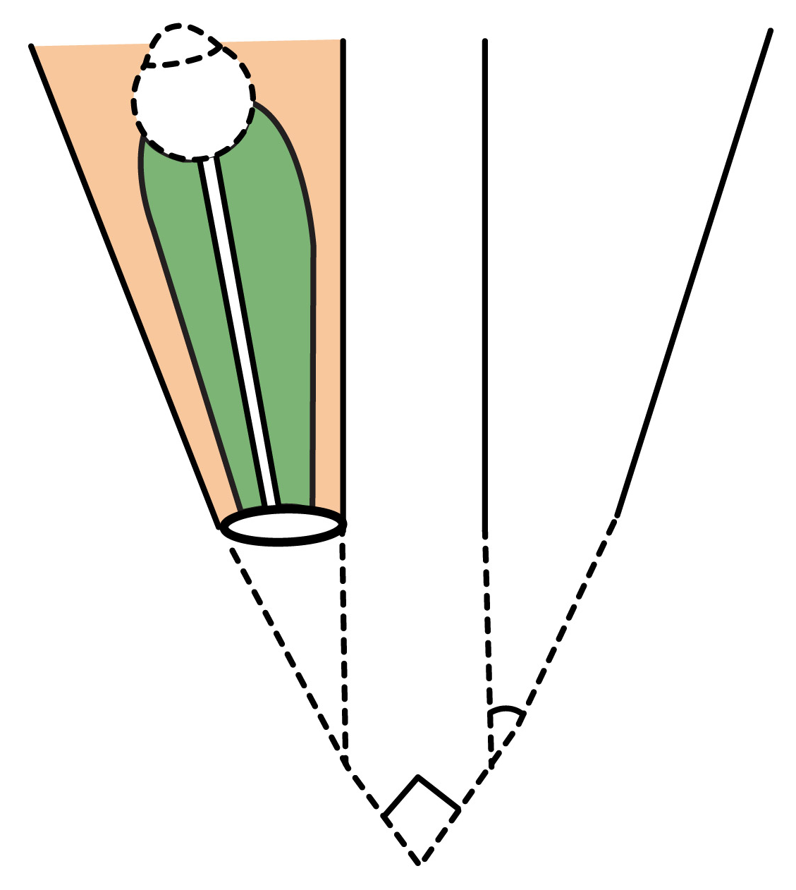

### 11.4 Intraconal and extraconal spaces

- **Retrobulbar local anaesthesia:** **intraconal** space.
- **Peribulbar local anaesthesia:** **extraconal** space; source associates this with fewer complications.

### 11.5 Blow-out fracture

- Weakness of the orbital **floor** is emphasized.
- A blow-out fracture is produced when increased orbital pressure results in fracture of the floor.
- Source diagram/description shows herniation toward the **maxillary sinus** and the **tear-drop sign**.

---

## 12. Eyelids

### 12.1 Eyelid lamellae

The source divides the eyelid into **anterior** and **posterior laminae**, separated by the **grey line**.

| Lamina | Structures |
|---|---|
| **Anterior lamina** | Skin, subcutaneous tissue, muscles |
| **Posterior lamina** | Tarsal plate, palpebral conjunctiva, glands |

### 12.2 Tarsal plates

- Present in the **upper and lower lids**.
- Provide **structural support**.
- Source explicitly states that the tarsal plate is **fibrous tissue, not cartilaginous**.

### 12.3 Eyelid muscles and glands

| Structure | Supply | Main action / role |
|---|---|---|
| **Levator palpebrae superioris** | CN III | Elevates upper eyelid |
| **Müller’s muscle** | Sympathetic fibres | Assists upper-lid elevation |
| **Orbicularis oculi** | CN VII | Closes eyelids |

Posterior lamina glands listed in the source:

- **Meibomian glands**
- **Zeis glands**
- **Moll glands** (sweat gland)
- Source groups the relevant gland types as modified glandular structures and specifically identifies Zeis/Moll relationships in the eyelid section.

### 12.4 Orbital septum

- Extends from **tarsal plate to bone** in both lids.
- Divides the orbital region into:
  - **Preseptal space** → infection = preseptal cellulitis.
  - **Postseptal space** → infection = orbital cellulitis.

> **Figure 9. External anatomy of the eye and eyelid/orbit.** The extracted source illustration shows the eyelid, orbital structures and associated muscles/soft tissues.
>
> 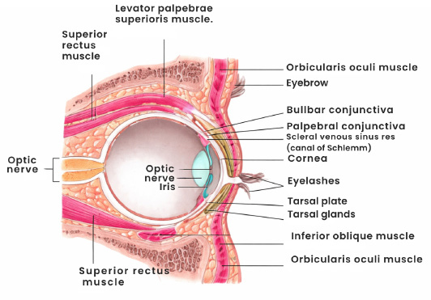

---

## 13. Conjunctiva

### 13.1 General organization

The conjunctiva is a mucous membrane covering the **outer surface of the sclera** and the **inner surface of the eyelids**.

Three anatomical regions:

1. **Bulbar conjunctiva** — lines/covers the sclera.
2. **Palpebral conjunctiva** — lines the eyelids.
3. **Forniceal conjunctiva** — lies between bulbar and palpebral conjunctiva.

### 13.2 Goblet cells and tear film

- Goblet cells are present in the conjunctival epithelium.
- They secrete **mucin**.
- Source states that this mucin forms the **innermost layer of the tear film**.

### 13.3 Lymphatic drainage

- **Medial conjunctiva:** submandibular lymph nodes.
- **Lateral conjunctiva:** preauricular lymph nodes.
- E6.5 notes the conjunctiva as the site of **ocular lymphatic drainage** in its relevant anatomy section.

### 13.4 Relationship to limbus/cornea

- Normally, conjunctiva covers the **sclera**, not the cornea.
- In **pterygium**, source material describes growth of conjunctiva over cornea associated with **limbal stem-cell deficiency**.

---

## 14. Lacrimal apparatus

### 14.1 Functional components and positions

- **Lacrimal gland:** produces tears; located **superolaterally**.
- **Lacrimal sac:** collects tears for drainage; located **inferomedially**.
- The source explicitly warns that **lacrimal gland ≠ lacrimal sac**.

### 14.2 Tear drainage pathway

**Lacrimal gland → tear film across eye surface → upper and lower lacrimal puncta → lacrimal canaliculi → lacrimal sac → nasolacrimal duct → inferior meatus of the nose.**

> **Figure 10. Lacrimal apparatus — anterior view.** Source illustration showing lacrimal gland and the punctal/canalicular drainage apparatus.
>
> 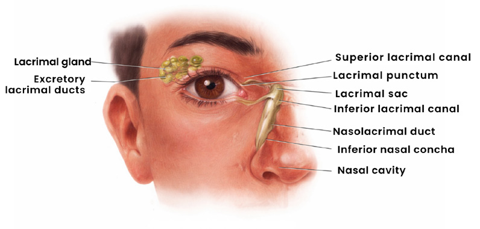

> **Figure 11. Lacrimal drainage measurements.** Source diagram showing the canalicular measurements and drainage pathway.
>
> 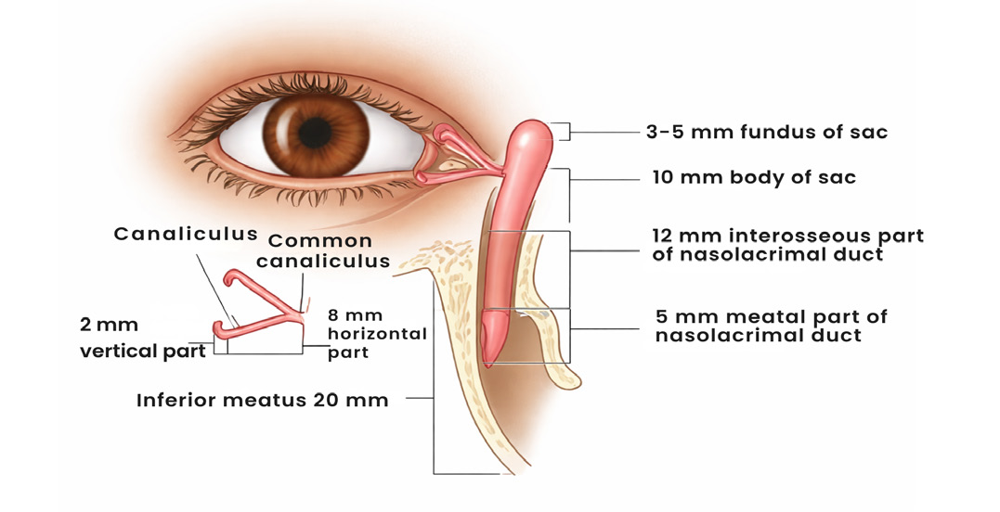

### 14.3 Canalicular dimensions

| Component | Length |
|---|---:|
| Vertical part | **2 mm** |
| Horizontal part | **8 mm** |
| Total canaliculus | **10 mm (1 cm)** |

---

## 15. Ocular developmental anatomy / embryology

### 15.1 Early eye development

- Source states that the eye develops from the **forebrain**.
- **PAX-6** is listed as a key developmental factor.
- General eye development begins around **day 22 of gestation** in Prep V6.
- The **optic vesicle** contacts surface ectoderm and initiates lens development.
- The sequence is:

**Lens placode → lens pit → lens vesicle → lens.**

- Lens development itself is dated to around **day 27** in Edition 8.
- The **choroid fissure** closes around the **6th–7th week**; failure is associated with **coloboma** in the source.

> **Figure 14. Eye embryology.** Source diagrams showing the forebrain/optic grooves, optic vesicle, lens placode, lens pit, lens vesicle and choroid fissure.
>
> 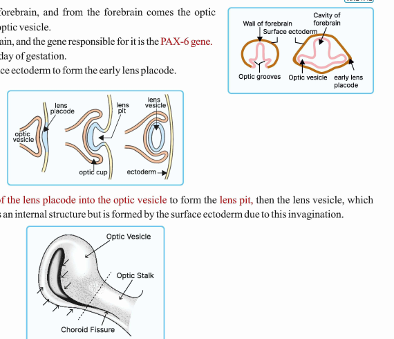

### 15.2 Tissue derivatives — source classification

#### Surface ectoderm — source mnemonic: **SLEEK**

The supplied source explicitly lists these derivatives under SLEEK:

- Skin appendages
- Lens
- Epithelial lining of conjunctiva
- Epithelial lining of cornea

The source prints the mnemonic **SLEEK** but does not separately expand an additional anatomical derivative for the final letter in the listed bullets; no outside expansion has been added.

#### Neuroectoderm — source mnemonic: **STORME**

- **Secondary vitreous**
- **Tertiary vitreous**
- **Optic nerve**
- **Retina**
- **Muscles of pupil:** sphincter + dilator
- **Epithelium of iris and ciliary body**

#### Neural crest

- **Sclera**, except the source’s specified temporal component.
- **Choroid**.
- **Corneal stroma and endothelium**.
- **Trabecular meshwork**.
- **Ciliary muscle**.

#### Mesoderm — source mnemonic: **PSME**

- **Primary vitreous**.
- **Temporal sclera**.
- **Extraocular muscles**.
- **Endothelial lining of blood vessels**.

---

## 16. Integrated spatial flow of the eye

A useful continuous anatomical sequence from anterior to posterior is:

**Cornea → anterior chamber (aqueous) → iris/pupil → posterior chamber (aqueous) → lens → vitreous → retina → choroid → sclera → optic disc/lamina cribrosa → optic nerve.**

The middle coat, **uvea**, runs as **iris → ciliary body → choroid**. The anterior fibrous coat is **cornea**, the posterior fibrous coat is **sclera**, and the junction is **limbus**.

Within the retina, the source sequence is:

**ILM → nerve fibre layer → ganglion cell layer → inner plexiform → inner nuclear → outer plexiform → outer nuclear → external limiting membrane → rods/cones → RPE.**

The neuronal flow is:

**Rods/cones → bipolar cells → ganglion cells → optic nerve → optic chiasma → optic tract → LGB → optic radiation → visual cortex.**

Aqueous flow in source terms is:

**Ciliary processes/non-pigmented ciliary epithelium → posterior chamber → through pupil → anterior chamber → trabecular and uveoscleral outflow pathways.**

Tear flow is:

**Lacrimal gland → ocular surface → puncta → canaliculi → lacrimal sac → nasolacrimal duct → inferior meatus.**

---

## 17. High-yield anatomical measurements and numeric facts

| Structure / parameter | Source value |
|---|---:|
| Eyeball volume | **6 mL** |
| Orbit volume | **30 mL** |
| Axial length | **~24 mm** (Prep V6) |
| Anterior chamber depth | **~2.4–2.5 mm** (Prep V6) |
| Total refractive power of eye | **58–60 D** (Prep V6) |
| Corneal contribution | **Anterior 1/6** of fibrous tunic |
| Scleral contribution | **Posterior 5/6** of fibrous tunic |
| Corneal power | **+43 to +44 D** (Edition 8); **43–45 D** (Prep V6) |
| Lens power | **+16 to +19 D** (Edition 8); **+16 to +17 D** (Prep V6) |
| Central corneal thickness | **~540 µm / 0.54 mm** |
| Normal corneal endothelial cells | **~2400–3000/mm²** (Edition 8); **~2500–3000/mm²** in E6.5/Hyperrevision |
| Critical endothelial density | **<500/mm²** |
| Optic disc diameter | **1.5 mm** |
| Macula diameter | **5.5 mm** |
| Fovea diameter | **1.5 mm** |
| Foveola | **350 µm** |
| Umbo | **150 µm** |
| Foveal avascular zone | **~500 µm** |
| Canaliculus vertical limb | **2 mm** |
| Canaliculus horizontal limb | **8 mm** |
| Total canaliculus | **10 mm / 1 cm** |
| Optic nerve length | **~3.5–5 cm** |
| Intraorbital optic-nerve part | **~25–30 mm** |
| Ciliary processes | **~70–75 per eye** (Prep V6) |
| Foveal fixation | **3–4 months** |

---

## 18. Source-sensitive points that should not be silently “corrected”

These are retained because the supplied PDFs themselves give differing descriptions/values:

1. **Pars plana vascularity:** Edition 8 = relatively avascular; E6.5 = most vascular. Both are preserved above.
2. **Corneal endothelial density:** Edition 8 = 2400–3000/mm² normal; E6.5/Hyperrevision = about 2500–3000/mm² adult. The common critical value **<500/mm²** is retained.
3. **Corneal power:** +43 to +44 D in Edition 8 versus 43–45 D in Prep V6.
4. **Lens power:** +16 to +19 D in Edition 8 versus +16 to +17 D in Prep V6.
5. **Corneal regeneration statements:** the sources differ in their layer-specific wording, especially for Descemet’s membrane versus the stroma/endothelium; the layer-by-layer source statements are preserved rather than harmonized externally.
6. **Basic-anatomy aqueous wording in Prep V6:** the scan states that aqueous is formed by ciliary processes and reaches the pupil from the anterior chamber; other supplied sources describe the posterior/anterior chamber relationships and conventional aqueous pathway separately. The statement is retained as source wording rather than externally corrected.

---

## 19. Visual index

1. `figure_01_eye_cross_section.png` — cross-section of the eyeball.
2. `figure_02_corneal_layers.png` — corneal layers and thicknesses.
3. `figure_03_lens_anatomy.png` — lens anatomy, capsule and fibre organization.
4. `figure_04_anterior_chamber_angle.png` — anterior chamber angle anatomy / gonioscopic landmarks.
5. `figure_05_retinal_layers_histology.png` — retinal layers and histological organization.
6. `figure_06_fundus.png` — fundus, optic disc and macular region.
7. `figure_07_rod_cone_anatomy.png` — rod/cone ultrastructure.
8. `figure_08_pupillary_muscles.png` — sphincter/dilator organization and pupillary response.
9. `figure_09_eyelid_orbit.png` — eyelid and orbital external anatomy.
10. `figure_10_lacrimal_anterior.png` — lacrimal apparatus, anterior view.
11. `figure_11_lacrimal_drainage.png` — lacrimal drainage pathway and canalicular measurements.
12. `figure_12_orbital_cone_annulus.png` — orbital cone and Annulus of Zinn.
13. `figure_13_basic_anatomy_segments.png` — basic anterior/posterior ocular-segment diagram from the scanned Prep V6 source.
14. `figure_14_eye_embryology_optic_vesicle.png` — optic vesicle, lens placode/pit/vesicle and choroid fissure diagrams.
15. `figure_15_vitreous_hyaloid_attachment.png` — vitreous/hyaloid source images.

---

## 20. Completeness check

- **Ophthalmology Prep V6:** the scan-only PDF was processed through rendered pages and OCR, with anatomy-relevant sections identified and incorporated, including basic eye anatomy, corneal/scleral anatomy, anterior chamber/aqueous relationships, lens anatomy, optic nerve/visual pathway anatomy, orbital anatomy, eyelids, conjunctiva, retina, vitreous and embryology.
- **Ophthalmology Revision Edition 8:** anatomy chapters and relevant anatomy sections across basic eye, cornea/sclera, lens, glaucoma/anterior chamber angle, retina, eyelids/orbit and conjunctiva were consolidated.
- **Ophthalmology Revision E6.5:** basic eye anatomy, anterior/posterior segments, ocular blood supply, cornea, lens, retina, optic pathway and embryological/anatomical details were merged.
- **Ophthalmology - Hyperrevision:** ocular coats, anterior chamber angle, fundus measurements, retinal histology, rods/cones, muscles, lacrimal apparatus, orbit, eyelids, conjunctiva, uvea, vitreous and embryology were integrated.
- Repetitive disease-treatment material was intentionally omitted unless it supplied a direct anatomical relationship or landmark.
- Repeated diagrams were not duplicated; the clearest source-derived visuals were selected and placed at the relevant anatomical section.
- No outside source was used to fill missing or disputed material.

