# Glaucoma

## 1. Definition and Core Concept

Glaucoma is an **optic neuropathy characterized by progressive, characteristic optic disc/optic nerve changes with irreversible visual field defects**. Intraocular pressure (IOP) is a major modifiable risk factor, but **IOP may be normal or elevated**; therefore, glaucomatous optic neuropathy can occur even when the measured IOP remains within the normal range.

Normal IOP is given as **10-21 mmHg**; the tonometry section also uses **11-21 mmHg**. Diurnal variation may be up to **5 mmHg**, with higher IOP in the morning associated with higher steroid levels.

The essential glaucoma assessment rests on three elements:
1. **IOP** and its measurement.
2. **Optic nerve head/optic disc structural damage**.
3. **Characteristic visual field loss**.

The structural and functional damage is irreversible once established. The treatment goal is to control the IOP sufficiently to **prevent progression of visual field defects without compromising quality of life**.

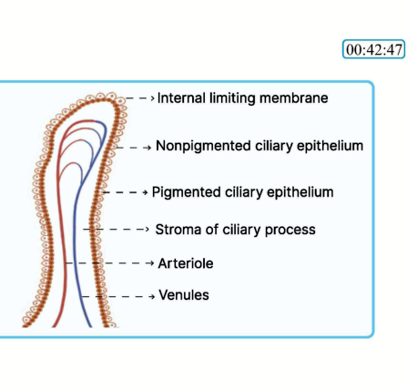
*Figure 1. Ciliary process anatomy showing the non-pigmented ciliary epithelium and related structures involved in aqueous humour production.*

## 2. Classification of Glaucoma

### Broad classification

| Group | Types |
|---|---|
| **Congenital / developmental** | True congenital, infantile, juvenile glaucoma |
| **Acquired** | Primary or secondary |
| **Primary** | Open-angle or angle-closure |
| **Secondary** | Open-angle or angle-closure |

### Congenital, infantile and juvenile forms

- **True congenital:** the child is born with the abnormality.
- **Infantile:** onset from about **3 months to 3 years**.
- **Juvenile:** approximately **3 years to adolescence**.
- **Buphthalmos** is characteristic of congenital/infantile glaucoma because the elastic infantile sclera can stretch in response to raised IOP; the source material emphasizes scleral stretching up to about 3 years of age.

### Acquired glaucoma

- **Primary:** may be open-angle or angle-closure.
- **Secondary:** may be open-angle or angle-closure.

### Open-angle versus angle-closure glaucoma

| Feature | Open-angle glaucoma (OAG) | Angle-closure glaucoma (ACG) |
|---|---|---|
| Iridocorneal angle | Wide / open | Narrow or closed |
| Main pathology | Defective or blocked trabecular meshwork | Anterior displacement of iris with angle closure |
| Anterior chamber | Deep | Shallow |
| Main treatment concepts | Trabeculoplasty, trabeculectomy | Iridotomy / iridectomy; definitive management of the underlying mechanism |

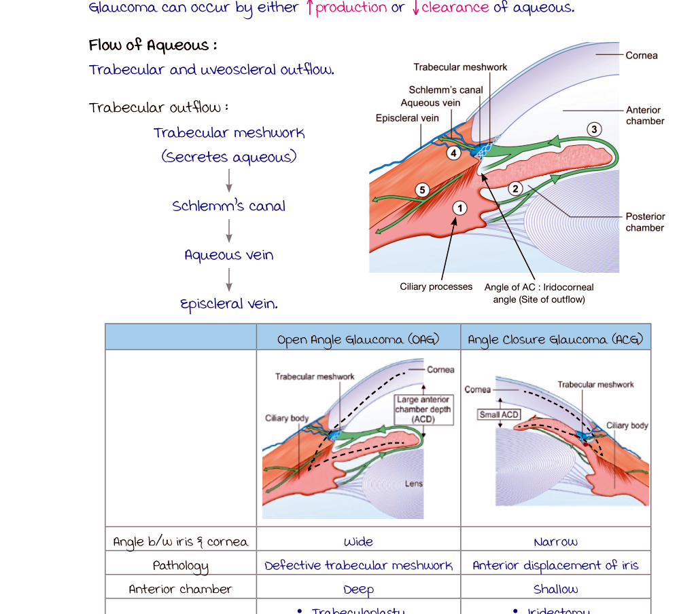
*Figure 2. Comparison of aqueous outflow anatomy and the open-angle versus angle-closure configuration.*

### Ocular hypertension, POAG and normal-tension glaucoma

| Condition | IOP | Optic disc changes | Visual field changes |
|---|---|---|---|
| **Ocular hypertension** | >21 mmHg | Absent | Absent |
| **Primary open-angle glaucoma** | Elevated | Present | Present |
| **Normal-tension glaucoma** | Persistently <21 mmHg | Present | Present |

- **Normal-tension glaucoma:** perfusion factors other than IOP are emphasized as important.

## 3. Risk Factors

### General glaucoma risk factors

- Raised IOP.
- Age >40 years.
- Positive family history.
- High myopia.

### Features predisposing to angle closure

- Small eye / hypermetropia.
- Shallow anterior chamber.
- Narrow angle.
- Female sex is emphasized as a common association.
- Anteriorly placed lens-iris diaphragm.

Hypermetropia predisposes to angle closure because the smaller globe has a shallow anterior chamber and restricted access of aqueous to the trabecular meshwork.

## 4. Aqueous Humour: Production, Circulation and Outflow

### Production

Aqueous humour is produced principally by the **ciliary processes**, especially the **non-pigmented ciliary epithelium**.

Mechanisms of formation:
- **Active secretion:** major contributor; ATP-dependent transport is involved.
- **Ultrafiltration:** minor contribution.
- **Diffusion:** minor contribution.

The material specifically notes sodium and potassium transport with ATP-dependent pumping during secretion.

Rate of aqueous humour formation is approximately **2-3 microlitres/minute**.

A hypersecretory form of glaucoma is described as occurring because of increased aqueous formation, with **epidemic dropsy** given as an association in the source material.

### Circulation

Aqueous is formed in the posterior chamber → passes through the pupil → enters the anterior chamber → drains predominantly through the anterior chamber angle.

### Outflow pathways

There are two major aqueous outflow pathways:

| Pathway | Approximate contribution | Route | IOP dependence | Important drug relationship |
|---|---:|---|---|---|
| **Trabecular / conventional** | ~80-90% (also given as 90%) | Trabecular meshwork → Schlemm's canal → collector/aqueous veins → episcleral veins | IOP-dependent | Pilocarpine, Rho-kinase inhibitors; trabeculoplasty acts here |
| **Uveoscleral / alternate** | ~10-20% (also given as 10%) | Through ciliary body / supraciliary space and sclera | IOP-independent | Prostaglandin analogues increase it |

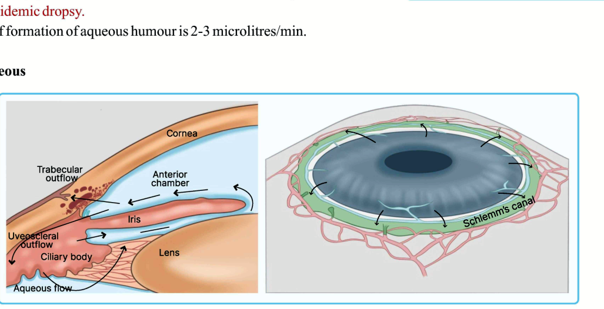
*Figure 3. Trabecular and uveoscleral aqueous outflow pathways.*

### Trabecular outflow pathway

**Trabecular meshwork → Schlemm's canal → aqueous/collector veins → episcleral veins.**

The **iridocorneal angle** is the key anatomical site through which trabecular aqueous outflow occurs.

## 5. Anterior Chamber Angle Anatomy and Gonioscopy

### Structures of the angle

From posterior/deep to anterior/superficial:

1. **Iris root**.
2. **Ciliary body band**.
3. **Scleral spur**.
4. **Trabecular meshwork**.
5. **Schwalbe's line**.

Schwalbe's line is the **peripheral termination of Descemet's membrane**.

On gonioscopy:
- In a **wide open angle**, the deeper structures can be seen through to Schwalbe's line.
- In **angle closure**, only Schwalbe's line with or without part of the trabecular meshwork remains visible because the peripheral iris obscures the deeper angle structures.

### Gonioscopy

Gonioscopy is the **best method for direct assessment of the anterior chamber angle**.

Principle: the normal cornea produces total internal reflection, preventing direct visualization of the angle; the gonioscopic lens alters the optical interface and allows the angle to be seen.

The material gives a **critical angle of the cornea of about 46°**. A gonioscopy lens with a more suitable refractive index overcomes total internal reflection.

Gonioscopy **does not require pupil dilation** and a dilated pupil is listed as a contraindication in the glaucoma sections.

### Types of gonioscopy

| Type | View | Position / setting | Examples |
|---|---|---|---|
| **Direct** | Direct | Patient lying down; useful in surgery | Richardson-Shaffer, Koeppe, Barkan; Swan-Jacob |
| **Indirect** | Mirrored / inverted view | Slit lamp; routine outpatient examination | Goldmann, Zeiss, Posner, Sussman |

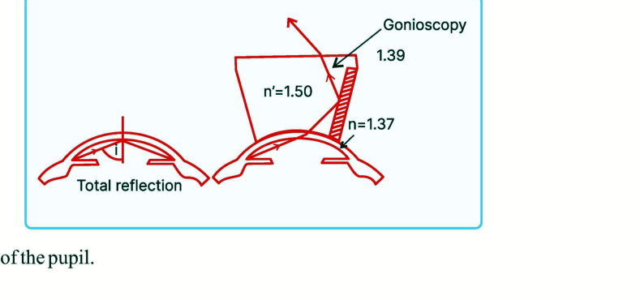
*Figure 4. Optical principle used by gonioscopy to overcome total internal reflection.*

Additional angle investigations:
- **Van Herick's method**.
- **Oblique flashlight test**.
- **Ultrasonic biomicroscopy (UBM)**.
- **Anterior segment OCT (ASOCT)**.

### Van Herick's method

Performed at the slit lamp by comparing peripheral anterior chamber depth (PACD) with corneal thickness (CT).

- **PACD = CT:** angle considered open.
- **PACD < 1/4 CT:** shallow anterior chamber with a closed/closing angle.

### Oblique flashlight test

Shine a torch from the temporal side:
- Nasal iris remains illuminated → angle is open.
- **Eclipse / shadow over the nasal iris** → angle is closed.

## 6. Intraocular Pressure and Tonometry

### Schiotz tonometry

- Indentation tonometer.
- Cornea is indented.
- Less preferred because of variability.
- Readings are affected by scleral rigidity.

### Goldmann applanation tonometry

- **Gold standard** for IOP measurement.
- Based on the **Imbert-Fick law**: pressure = force / area applanated.
- Uses **fluorescein** with **cobalt-blue illumination**.
- Fixed applanation diameter is **3.06 mm**.
- In a **thin cornea**, IOP may be underestimated.
- In a **thick cornea**, IOP may be overestimated.

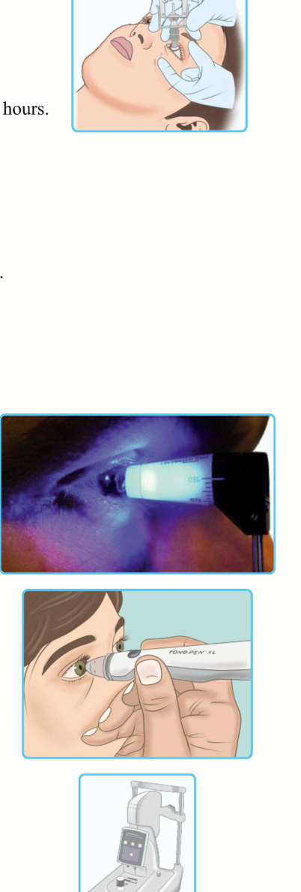
*Figure 5. Tonometry examples used for IOP assessment.*

### Perkins tonometer

- Hand-held applanation tonometer.
- Useful in children, operating theatres and anaesthetized patients, including patients who cannot be positioned at a slit lamp.

### Tonopen

- Portable applanation instrument.
- Used in children and in scarred or irregular corneas.
- Based on the **Mackay-Marg principle**.

### Mackay-Marg

- Choice in irregular, oedematous corneas.

### Pascal tonometer

- Dynamic contour tonometer.
- Reading is described as not depending on central corneal thickness.
- More reliable than Goldmann in the material's comparison.
- Used particularly in post-LASIK cases where a thin cornea may give a falsely low Goldmann reading.

### Rebound tonometry

- Useful for **self-measurement / self-monitoring**.

### Non-contact tonometry

- Air-puff method.
- Used for screening, including screening camps.

### Transpalpebral tonometry

- Instruments include **Diaton** and **Proview**.
- Measurement is obtained through the eyelid and is not commonly used.

### Ocular Response Analyzer

- A non-contact applanation instrument.
- Based on **corneal hysteresis**.

## 7. Optic Nerve Head and Glaucomatous Optic Neuropathy

### Examination of the optic disc

Methods described include:
- **Direct ophthalmoscopy:** approximately 15× magnification; central fundus is visualized; no binocular depth perception.
- **Slit-lamp biomicroscopy with a +90 D lens**.
- **Confocal scanning laser tomography**.
- **Spectral-domain OCT**.

### Glaucomatous cupping

Glaucomatous cupping reflects progressive loss of neural tissue at the optic disc.

Key structural changes:

- **Increased cup-to-disc ratio.**
  - Normal: about **0.3:1**.
  - Suspicious: **>0.5:1**.
  - Difference **>0.2:1 between the two eyes** is suspicious.
- **Neuroretinal rim thinning/loss**, classically emphasizing the inferior rim in the source material.
- **Deepening of the cup** due to loss of nerve fibres.
- The cup tends to become **vertically oval** because early damage involves the arcuate nerve fibres.
- **Laminar dot sign:** holes of the lamina cribrosa become visible as nerve fibres are lost, leaving empty laminar spaces.
- **Nasal shifting of retinal vessels** due to laminar/optic nerve head remodelling.
- **Bayonetting sign:** sharp change or double angulation/kinking of a retinal vessel at the disc margin.
- **Peripapillary atrophy:**
  - Alpha zone is described as specific for glaucoma.
  - Beta zone is also seen in myopia and may appear as a temporal myopic crescent.
- **Loss of retinal nerve fibre striations**.
- **Splinter haemorrhage at the disc margin**.

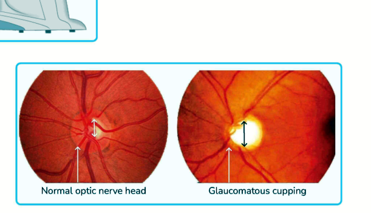
*Figure 6. Comparison of a normal optic nerve head with glaucomatous cupping.*

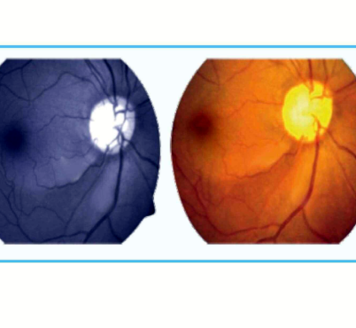
*Figure 7. Clinical appearance illustrating a retinal nerve fibre defect.*

### Lamina cribrosa

Remodelling of the **lamina cribrosa** contributes to changes in optic disc architecture, including deepening of the cup and nasal displacement of vessels.

## 8. Visual Field Defects in Glaucoma

### Normal visual field

The normal visual field is described as **horizontally oval with an inferonasal notch**.

Approximate extents:
- Temporal: **100°**.
- Inferior: **70°**.
- Nasal: **60°**.
- Superior: **50°**.
- Blind spot: approximately **10-20°** from fixation.
- Distance between the fovea and blind spot: about **2 disc diameters / 3 mm**.

### Perimetry

Perimetry is the examination of the visual field.

- A visual field can be represented as a **2-dimensional plot of a 3-dimensional visual field**; the contour line is an **isopter**.
- **Kinetic perimetry:** moving targets; Goldmann perimeter is the classic example.
- **Static perimetry:** stationary targets with threshold testing; examples include **Humphrey Field Analyzer (HFA), Octopus and Dicon**.
- Humphrey automated perimetry is emphasized as the gold-standard clinical method.

### Characteristic glaucomatous field progression

The overall sequence is described as:

**Isopter contraction → peripheral field loss → baring of the blind spot → paracentral scotoma → Seidel's scotoma → Bjerrum/arcuate scotoma → ring/double arcuate scotoma → Roenne's nasal step → central visual loss → temporal island last to be lost.**

Important defects:

| Defect | Key feature |
|---|---|
| **Paracentral scotoma** | Earliest clinically visible/specific defect; lies in the Bjerrum area, with central or superonasal involvement emphasized |
| **Seidel's scotoma** | Comma/sickle-shaped scotoma; joins the blind spot and extends into the arcuate area |
| **Bjerrum / arcuate scotoma** | Arc-shaped defect corresponding to arcuate nerve fibres; arches toward the opposite side |
| **Double arcuate / ring scotoma** | Superior and inferior arcuate defects approach each other, forming a ring-like defect with central vision relatively spared initially |
| **Roenne's nasal step** | Step between superior and inferior arcs due to unequal contraction of the two hemispheres; may be central or peripheral |
| **Temporal island** | Last remaining island of vision before complete field loss |

The **Bjerrum area** encompasses approximately the central **20-30°** of the field.

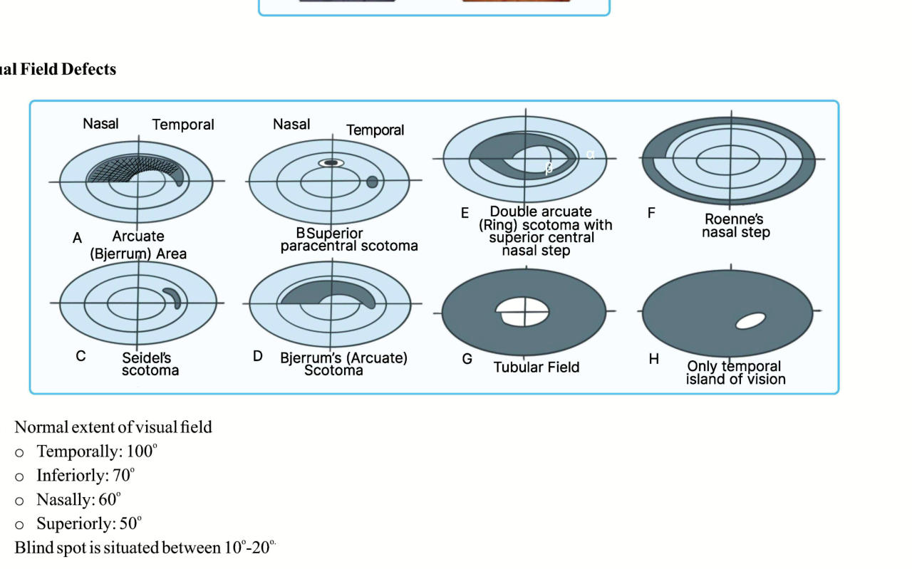
*Figure 8. Progression of glaucomatous visual field defects from arcuate/paracentral loss to advanced field constriction and temporal island vision.*

## 9. Primary Open-Angle Glaucoma (POAG)

POAG is a **chronic** glaucoma with an open anterior chamber angle despite defective trabecular outflow.

### Typical profile

- Usually **>50 years** in the material.
- Family history may be positive.
- Genes listed: **WDR36, optineurin and MYOC (myocilin)**.

### Symptoms described

- Headache.
- Delayed dark adaptation.
- Frequent changes in presbyopic spectacles.

### IOP

- IOP **>21 mmHg**, or a difference of **>5 mmHg between the two eyes**, is highlighted in the POAG section.

### Optic disc findings

- Inferior neuroretinal rim loss.
- Vertical cupping, with **C/D ratio >0.5**.
- Bayonetting sign.
- Laminar dot sign.
- Peripapillary atrophy.

### Visual field changes

The characteristic sequence follows the glaucomatous pattern described above, beginning with subtle arcuate/paracentral defects and progressing through arcuate and nasal-step defects to advanced loss, while the **temporal island is last to be lost**.

## 10. Normal-Tension Glaucoma

- IOP remains **constantly <21 mmHg** in the material.
- Glaucomatous optic disc changes are present.
- Visual field defects are present.
- **Perfusion factors** other than IOP are emphasized as important.

The clinical distinction is therefore structural and functional glaucomatous damage despite an IOP that remains within the quoted normal range.

## 11. Ocular Hypertension

- IOP is raised, **>21 mmHg**.
- Fundus/optic disc is described as normal.
- No visual field defects are present.

This distinguishes ocular hypertension from established glaucomatous optic neuropathy.

## 12. Primary Angle-Closure Disease and Glaucoma

### Angle-closure mechanism

The major mechanism described is **pupillary block**:

1. The pupillary margin contacts the lens.
2. Aqueous flow from posterior to anterior chamber is impeded.
3. Pressure builds posterior to the iris.
4. The peripheral iris is pushed forward, producing **iris bombe**.
5. The iris comes into iridotrabecular-corneal contact.
6. **Peripheral anterior synechiae (PAS)** may form.

Other mechanisms can contribute:
- **Plateau iris**: an anteriorly rotated ciliary body can maintain or cause angle closure despite the absence of a simple pupillary block mechanism.

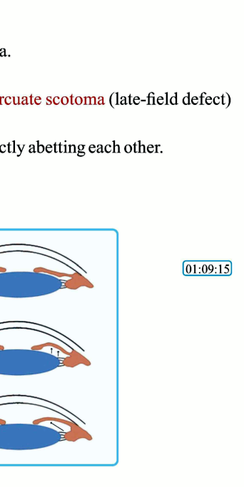
*Figure 9. Schematic progression from pupillary block to iris bombe and iridotrabecular contact.*

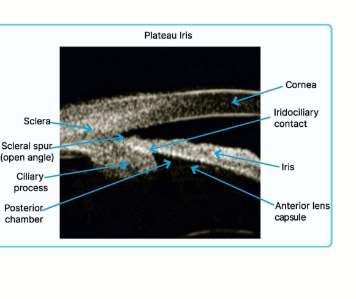
*Figure 10. Plateau iris configuration on anterior segment imaging.*

### Primary angle-closure spectrum

**Primary angle-closure suspect (PACS)**
- Occludable angle involving **≥2 quadrants of iridotrabecular contact**.
- No PAS.
- Normal IOP.

**Primary angle closure (PAC)**
- Occludable/narrow angle.
- PAS may be present.

**Primary angle-closure glaucoma (PACG)**
- Occludable angle.
- PAS.
- High IOP.
- Optic neuropathy.

### Acute primary angle closure

Acute angle closure is an **acute disease** caused by rapid angle obstruction and abrupt IOP elevation.

#### Predisposing factors

- Hypermetropia / small eye.
- Female sex.
- Anteriorly placed lens-iris diaphragm.
- Shallow anterior chamber.
- Narrow angle.

#### Precipitating factors

- Dark environment.
- Prone position.
- Mydriasis.
- Emotional stress.
- **Topiramate** via ciliary-body effusion/mechanism described in the notes.
- Sympathomimetics.

#### IOP

IOP may rapidly rise to **40-60 mmHg**; severe pain with IOP **>40 mmHg** is specifically emphasized.

#### Symptoms

- Severe headache / extreme headache.
- Severe eye pain.
- Painful red eye.
- Photophobia.
- Blepharospasm.
- Vomiting.
- Distorted or hazy vision.
- Halos around lights due to prismatic dispersion from corneal oedema.

#### Signs

- Marked congestion/redness.
- Corneal oedema from very high IOP damaging the endothelium.
- Shallow anterior chamber.
- Closed angle.
- Fixed, mid-dilated, vertically oval pupil.
- **Rock-hard eye** on digital tonometry.
- Eclipse sign: shadow over the nasal iris on oblique flashlight testing.
- Cupping may or may not yet be present.
- PAS may form.

*Figure 11. Schematic progression from pupillary block to iris bombe and iridotrabecular contact during angle closure.*

#### Initial treatment

The described emergency treatment includes:

1. **Supine position**.
2. **IV mannitol** as the drug of choice/emergency osmotic therapy.
3. **Acetazolamide** systemically as indicated.
4. **Pilocarpine eye drops after IOP has fallen**, allowing the iris to move centrally and open the angle.
5. Topical corticosteroids.
6. **10% topical glycerine** is listed among medical measures.
7. Lens extraction may be considered when indicated.

#### Definitive treatment

- **Laser peripheral iridotomy** is the treatment of choice.
- **Nd:YAG laser**.
- Iridotomy is positioned between approximately **11 o'clock and 1 o'clock**.
- The iridotomy equalizes the pressure gradient and bypasses the pupillary block.
- Surgery is an alternative definitive approach when required.
- Prophylactic iridotomy is emphasized for the fellow eye when appropriate.

### Chronic angle-closure glaucoma

- May show many of the clinical features of open-angle glaucoma.
- **Gonioscopy** demonstrates creeping/gradual angle closure.
- **Dark Room Prone Provocative Test (DRPT)** is described, with the patient in a dark room and the IOP difference between the two eyes assessed.
- The test is especially useful in patients who have already undergone peripheral iridotomy.
- An IOP rise after the test is described as supporting **plateau iris**.

### Absolute glaucoma

Absolute glaucoma appears in the angle-closure classification and is also specifically associated with cyclodestructive treatment when IOP must be controlled by reducing aqueous production.

## 13. Secondary Glaucomas

### 13.1 Pigmentary glaucoma

Pigmentary glaucoma is a **secondary open-angle glaucoma**.

Mechanism:
- Iris pigment disperses into the aqueous.
- Pigment accumulates in and blocks the trabecular meshwork.

Typical associations/features:
- **Young myopes**.
- Pigment shedding may be increased with exercise.
- The iris may rub against the suspensory apparatus, producing reverse/pigment dispersion.
- **Krukenberg spindle:** pigment deposition on the corneal endothelium.
- **Sampaolesi line** at the angle.

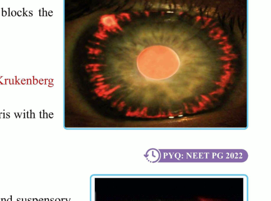
*Figure 12. Clinical appearance associated with pigment dispersion and secondary glaucoma.*

### 13.2 Pseudoexfoliation glaucoma

Pseudoexfoliation is described as the **most common cause of secondary open-angle glaucoma**.

Findings:
- Pseudoexfoliative material is deposited on the anterior lens capsule and at the pupillary margin.
- The anterior lens-capsule deposit is called the **target sign**.
- Pupillary-margin deposits are called **Fnocks** and may make mydriasis difficult.
- **Sampaolesi line** may be seen at the angle.
- The exfoliative material obstructs aqueous drainage through the angle/trabecular meshwork.

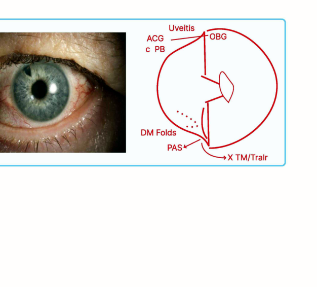
*Figure 13. Posner-Schlossman clinical appearance and schematic relationship of inflammation, angle, and pressure elevation.*

### 13.3 Neovascular glaucoma

Neovascular glaucoma begins with **retinal ischaemia/hypoxia**, which stimulates angiogenic factors, especially **VEGF**.

Important causes listed:
- **Proliferative diabetic retinopathy (PDR)**.
- **Ischaemic central retinal vein occlusion (CRVO)**.

Sequence:
1. Retinal ischaemia stimulates angiogenic factors.
2. New vessels develop on the iris (**rubeosis iridis**).
3. Neovascularization extends into the angle and impairs trabecular drainage.
4. The early stage can present as an **open-angle glaucoma**.
5. Fibrovascular tissue contracts and the angle becomes closed.

Management:
- **Anti-VEGF injection** is described as part of treatment.
- **Pan-retinal photocoagulation (PRP)** is the definitive treatment / treatment of choice for the underlying retinal ischaemia in the material.

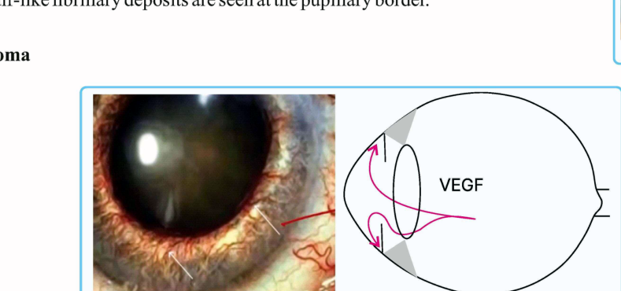
*Figure 14. Rubeosis iridis and VEGF-driven neovascularization in neovascular glaucoma.*

### 13.4 Lens-induced glaucoma

#### Phacomorphic glaucoma

- Usually associated with an **intumescent swollen lens**, particularly in advanced/hypermature cataract.
- Swollen lens pushes the iris forward.
- **Anterior chamber is shallow**.
- Lens is **swollen**.
- The mechanism is therefore largely angle-closure related.

#### Phacolytic glaucoma

- Associated with a **hypermature/Morgagnian cataract**.
- Lens proteins escape through an intact capsule.
- Macrophages engulf the leaked lens protein.
- The protein-loaded macrophages obstruct the trabecular meshwork.
- **Anterior chamber is deep**.
- Lens is **shrunken**.
- Lens capsule remains intact in both phacomorphic and phacolytic glaucoma.

| Feature | Phacomorphic | Phacolytic |
|---|---|---|
| Lens | Swollen/intumescent | Shrunken/hypermature |
| Anterior chamber | Shallow | Deep |
| Main mechanism | Lens pushes iris forward | Lens protein leakage → macrophages → trabecular blockage |

### 13.5 Malignant glaucoma / ciliary block glaucoma

Also called **ciliary block glaucoma**.

Mechanism:
- Usually follows **intraocular surgery**.
- Aqueous is misdirected posteriorly toward the vitreous.
- Vitreous expansion pushes the lens-iris diaphragm forward.
- A very shallow anterior chamber results.

Management described:
- **Atropine** is used here; the source emphasizes this as the glaucoma in which atropine is used and notes that it is contraindicated in the other glaucoma settings described.
- Atropine dilates the ciliary ring and helps relieve the block.
- If the response is inadequate, openings can be created in the **anterior hyaloid membrane** by Nd:YAG laser.
- If this fails, **pars plana vitrectomy** is performed.

### 13.6 Posner-Schlossman syndrome (glaucomatocyclitic crisis)

- Mild anterior uveitis with attacks of raised IOP.
- The glaucoma component predominates.
- Gonioscopy shows an **open angle**.
- Uveitis may promote trabecular obstruction and IOP elevation.

Associations/risk factors listed:
- Young males.
- CMV infection.
- H. pylori infection.
- HLA association.

Treatment:
- Control IOP.
- **Beta blocker** is described as the drug of choice for IOP control.
- Topical steroids are used under antiglaucoma cover.
- Prostaglandin analogues and pilocarpine are contraindicated in the material because of worsening of the inflammatory component.

## 14. Congenital Glaucoma

Congenital glaucoma is a **developmental open-angle glaucoma** caused by abnormal development of the trabecular outflow pathway.

### Pathogenesis

- **Trabeculodysgenesis**.
- **Barkan's membrane** lies in place of a normally developed trabecular meshwork and blocks aqueous outflow.
- Aqueous accumulates, the anterior chamber deepens and the lens is displaced backward.
- The enlarging globe produces **buphthalmos**, megalocornea and corneal oedema.
- Stretching also produces tears in Descemet's membrane, giving **Haab's striae**.

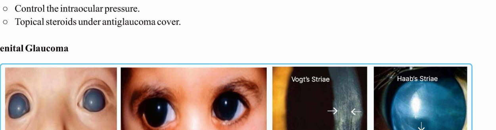
*Figure 15. Clinical photographs demonstrating buphthalmos, corneal oedema and Haab's striae.*

### Clinical features

- **Buphthalmos:** enlarged globe / ox-eye appearance.
- Deep anterior chamber.
- Increased axial length → myopia.
- Enlarged cornea.
- Blue sclera.
- **Corneal oedema / hazy cornea**, emphasized as the **earliest sign**.
- **Haab's striae:** horizontal tears in Descemet's membrane.
- Blepharospasm.
- Photophobia / photosensitivity.
- Lacrimation.

The horizontal corneal diameter for **megalocornea is given as >11.5 mm** in one congenital-glaucoma description; another clinical sign set uses **corneal diameter >13 mm** for the enlarged cornea of buphthalmos.

### Management

Congenital glaucoma is managed primarily by **surgery**; medical treatment is described as temporary/useful until the diagnosis and definitive plan are established.

Procedures:
- **Trabeculotomy + trabeculectomy** are listed as definitive treatment of choice.
- **Goniotomy** is the treatment of choice when the cornea is clear.
- Goniotomy is performed with a **goniotomy knife**.
- A functioning **bleb** indicates a successful filtration procedure and that the fistula is working.

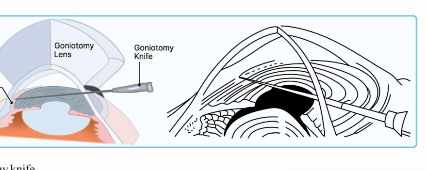
*Figure 16. Goniotomy using a goniotomy lens and knife in congenital glaucoma.*

## 15. Medical Treatment of Glaucoma

### Treatment target

The target IOP is the IOP at which progression of visual field defects is prevented without compromising quality of life.

### Drugs reducing aqueous production

#### Beta-adrenergic blockers

Examples:
- **Timolol** - non-selective beta blocker.
- **Betaxolol** - selective beta blocker.
- **Levobunolol**.

Mechanism:
- **Decrease aqueous humour production**.

Important adverse effects / precautions:
- Heart block.
- Asthma.
- Chronic obstructive pulmonary disease.
- Can mask hypoglycaemia in diabetes.
- Corneal anaesthesia.
- Nasolacrimal duct blockage.
- Blepharoconjunctivitis.

#### Alpha-adrenergic agonists

Examples:
- **Apraclonidine**.
- **Brimonidine**.

Mechanism:
- Apraclonidine: **decreases aqueous formation + increases trabecular outflow**.
- Brimonidine: predominantly **decreases aqueous formation**.

Important effects:
- Alpha agonists are listed as contraindicated in children because of the possibility of apnea, CNS depression, cardiac suppression and even death.
- Apraclonidine: eyelid retraction, mydriasis, follicular conjunctivitis.
- Brimonidine crosses the blood-brain barrier and may cause **drowsiness, depression and apnea**.

#### Carbonic anhydrase inhibitors

Examples:
- **Acetazolamide** - oral/systemic.
- **Brinzolamide** - topical.
- **Dorzolamide** - topical.

Mechanism:
- **Decrease aqueous humour formation**.

Precaution:
- Sulphonamide allergy is listed as a contraindication.

### Drugs increasing aqueous outflow

#### Prostaglandin analogues

Examples:
- **Latanoprost**.
- **Travoprost**.
- **Bimatoprost**.
- **Tafluprost**.
- Unoprostone is included in the mnemonic used in the hyperrevision material.

Mechanism:
- Increase **uveoscleral outflow**.

Latanoprost is described as a **drug of choice / first-line treatment**.

Advantages emphasized:
- Greatest IOP reduction among the listed topical groups.
- Approximately **25-30% efficacy**.
- **Once-daily** dosing.
- Better compliance and memory.
- Skipping a dose is less likely to cause an acute IOP spike.
- Flattens diurnal IOP fluctuation.
- Specifically emphasized as the **drug of choice in normal-tension glaucoma** because of fluctuation control.
- Few systemic adverse effects; effects are mainly local.

Local adverse effects:
- **Eyelash lengthening / hypertrichosis**.
- Periocular or iris hyperpigmentation.
- Ocular hyperaemia.
- Cystoid macular oedema.
- Uveitis.

Contraindications/important cautions listed:
- Uveitis.
- Postoperative states.
- Cystoid macular oedema.
- Risk of herpes simplex reactivation.

#### Miotics

- **Pilocarpine**.
- Increase **trabecular outflow**.
- Adverse effects include brow ache and headache.
- Listed cautions/contraindications include **myopia** because of increased retinal-detachment risk and **uveitis** because inflammation may worsen.
- In acute angle closure, pilocarpine is given **after the IOP has been lowered**, when the iris can be pulled centrally and the angle reopened.

#### Rho-kinase inhibitors

Examples:
- **Netarsudil**.
- **Ripasudil**.

Mechanism:
- Increase **trabecular outflow**.

Adverse effect:
- **Vortex keratopathy / corneal verticillata**.

Vortex keratopathy is also listed with causes other than glaucoma therapy, including chloroquine, amiodarone, tamoxifen, indomethacin and Fabry disease.

### Hyperosmotic agents

- **Mannitol** - intravenous.
- **Glycerol** - oral.
- Urea and isosorbide are also listed among hyperosmotic agents.

Mechanism:
- Dehydrate the vitreous and increase fluid movement away from the eye, reducing IOP.

Important precautions:
- Renal disease.
- Compromised cardiac conditions.

## 16. Laser Treatment

Laser treatment can be used for both open-angle and angle-closure mechanisms, but the target is different:

- **Closed angle → create an opening in the iris** to bypass pupillary block.
- **Open angle → treat the trabecular meshwork** to improve outflow.

### Laser peripheral iridotomy

- Usually **Nd:YAG laser**.
- Creates a hole in the peripheral iris.
- Bypasses pupillary block.
- Allows aqueous to pass directly from posterior to anterior chamber.
- **Indication: angle-closure glaucoma**.
- Common position given: approximately **11 o'clock to 1 o'clock**.
- Also used prophylactically for the fellow eye after an acute attack.

### Laser iridoplasty

- Used for **plateau iris** / persistent angle crowding.

### Laser trabeculoplasty

Indicated in **open-angle glaucoma**.

Mechanism:
- Treatment produces a trabecular response/shrinkage that increases trabecular outflow.

Techniques described:
- **Argon laser trabeculoplasty (ALT)**.
- **Selective laser trabeculoplasty (SLT)** using frequency-doubled Nd:YAG (yellow) laser.
- Diode laser is also listed.

### Cyclodestructive laser treatment

Used particularly in **absolute/refractory glaucoma** when reduction of aqueous production is required.

- **Cyclophotocoagulation** damages the ciliary processes so that less aqueous is formed.
- Can be **transscleral or endoscopic**.
- Cyclotherapy may be performed with **cryotherapy or laser photocoagulation**.
- A diode laser technique is referred to as **diode laser photocoagulation (DLCP)**.

## 17. Surgical Treatment

### Trabeculectomy

- Described as the **best surgery** in the surgical section.
- Creates a controlled drainage pathway to the subconjunctival space.
- Antimetabolites listed:
  - **Mitomycin C**.
  - **5-fluorouracil**.
- The resulting **bleb** is an important clinical sign of a functioning filtration pathway.

### Non-penetrating glaucoma surgery

- **Deep sclerectomy**.
- **Viscocanalostomy**.

### Glaucoma drainage devices / seton procedures

Used in **resistant glaucoma**.

Devices listed include:
- **Express mini-shunt**.
- **Molteno devices**.
- **Ahmed glaucoma valve**.

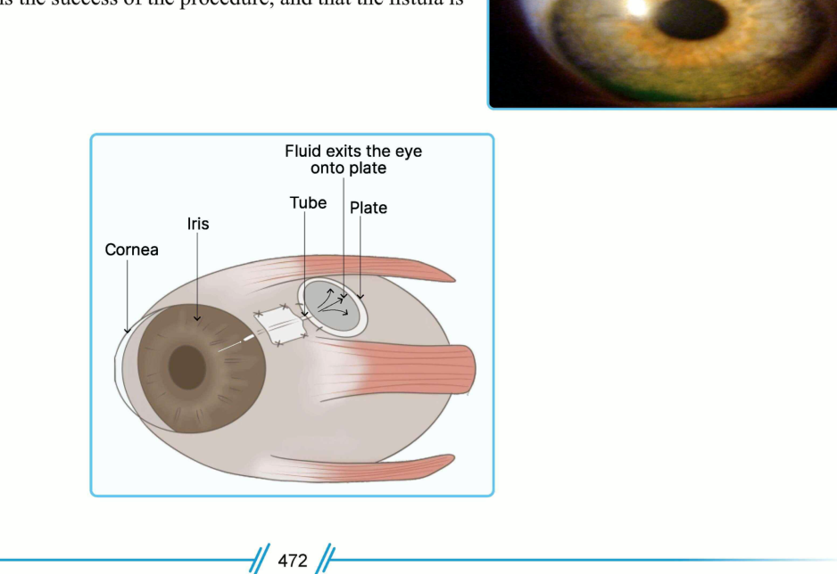
*Figure 17. Ahmed glaucoma valve showing the tube and plate-based drainage pathway.*

### MIGS

**Minimally invasive glaucoma surgery** is included as a surgical option. **iStent** is specifically listed as a smaller drainage device.

## 18. Important Clinical Comparisons

### Ocular hypertension vs POAG vs normal-tension glaucoma

| Feature | Ocular hypertension | POAG | Normal-tension glaucoma |
|---|---|---|---|
| IOP | >21 mmHg | Elevated | Persistently <21 mmHg |
| Optic disc | No glaucomatous change | Glaucomatous change | Glaucomatous change |
| Visual field | Normal | Defect present | Defect present |
| Key concept | Pressure elevation without damage | Pressure-associated glaucomatous optic neuropathy | Glaucomatous damage despite normal-range IOP |

### Open-angle vs angle-closure glaucoma

| Feature | Open-angle | Angle-closure |
|---|---|---|
| Angle | Open | Narrow/closed |
| Main obstruction | Trabecular dysfunction | Iris apposition/displacement |
| Anterior chamber | Deep | Shallow |
| Laser principle | Trabeculoplasty | Iridotomy/iridoplasty |
| Typical congenital/acute relationship | Chronic adult disease common | Acute attacks can occur when the angle closes rapidly |

### Phacomorphic vs phacolytic glaucoma

| Feature | Phacomorphic | Phacolytic |
|---|---|---|
| Lens | Swollen | Shrunken/hypermature |
| Anterior chamber | Shallow | Deep |
| Mechanism | Forward iris displacement/angle crowding | Lens protein + macrophage obstruction of trabecular meshwork |
| Typical cataract | Intumescent | Morgagnian / hypermature |

### Pseudoexfoliation vs pigmentary glaucoma

| Feature | Pseudoexfoliation | Pigmentary |
|---|---|---|
| Mechanism | Exfoliative material obstructs outflow | Iris pigment obstructs trabecular meshwork |
| Key sign | Target sign, Fnocks | Krukenberg spindle |
| Angle sign | Sampaolesi line | Sampaolesi line |
| Typical demographic clue | Secondary open-angle glaucoma | Young myopes |

### Acute angle closure vs malignant glaucoma

| Feature | Acute angle closure | Malignant glaucoma |
|---|---|---|
| Main mechanism | Pupillary block → iris bombe → iridotrabecular contact | Aqueous misdirection toward vitreous / ciliary block |
| Anterior chamber | Shallow | Very shallow |
| Typical setting | Predisposed anatomically, often precipitated by mydriasis | Often after intraocular surgery |
| Key specific treatment | IV mannitol/acetazolamide → pilocarpine after pressure falls → laser iridotomy | Atropine → Nd:YAG anterior hyaloid opening if needed → pars plana vitrectomy if refractory |

## 19. High-Yield Exam Correlations

- **Normal IOP does not exclude glaucoma**: normal-tension glaucoma has optic disc and visual field damage despite IOP <21 mmHg.
- **Ocular hypertension has high IOP without optic disc or visual field damage.**
- **Goldmann applanation tonometry = gold standard**; Imbert-Fick law; fixed diameter 3.06 mm.
- **Thin cornea → falsely low Goldmann reading; thick cornea → falsely high reading.**
- **Van Herick:** PACD = CT → open angle; PACD <1/4 CT → closed/closing angle.
- **Gonioscopy = best angle examination**; it overcomes total internal reflection.
- **Dilated pupil is contraindicated for gonioscopy** in the source material.
- **Closed angle → Nd:YAG laser peripheral iridotomy.**
- **Open angle → trabeculoplasty.**
- **Plateau iris → laser iridoplasty.**
- **Acute angle closure:** IOP can rapidly reach **40-60 mmHg**, with severe pain, corneal oedema, headache, vomiting and a fixed mid-dilated pupil.
- **Emergency drug in acute angle closure:** IV **mannitol**.
- **Pilocarpine in acute angle closure is given after IOP falls**, not at the stage of maximal pressure.
- **Definitive acute angle-closure treatment:** laser iridotomy.
- **Vogt's triad after acute angle closure:**
  - Fixed/mid-dilated pupil with sphincter damage.
  - Iris atrophy.
  - **Glaukomflecken**, an anterior subcapsular lens opacity/deposit.
- **Congenital glaucoma:** buphthalmos + corneal oedema + Haab's striae + blepharospasm/photophobia/lacrimation.
- **Earliest sign of congenital glaucoma:** hazy cornea / corneal oedema.
- **Haab's striae:** horizontal Descemet's membrane tears.
- **Congenital glaucoma is fundamentally surgical** because of trabeculodysgenesis.
- **Pseudoexfoliation:** target sign + Fnocks.
- **Pigmentary glaucoma:** Krukenberg spindle + Sampaolesi line.
- **Neovascular glaucoma:** PDR or ischaemic CRVO → retinal hypoxia/VEGF → rubeosis → angle neovascularization → synechial closure.
- **Malignant glaucoma:** post-intraocular surgery + aqueous misdirection; atropine is specifically used.
- **Phacomorphic:** swollen lens + shallow AC.
- **Phacolytic:** shrunken hypermature/Morgagnian lens + deep AC + macrophage-mediated trabecular obstruction.
- **Normal optic C/D ratio:** about 0.3.
- **Suspicious C/D ratio:** >0.5.
- **Inter-eye C/D asymmetry:** >0.2 is suspicious.
- **Characteristic early glaucomatous field defect:** paracentral scotoma in the Bjerrum area.
- **Seidel's scotoma:** comma/sickle-shaped.
- **Bjerrum scotoma:** arcuate.
- **Roenne:** nasal step.
- **Last remaining field:** temporal island of vision.
- **First-line topical class emphasized:** prostaglandin analogues.
- **Normal-tension glaucoma:** prostaglandin analogues are emphasized because they reduce fluctuation.
- **ROCK inhibitors:** netarsudil/ripasudil → trabecular outflow; vortex keratopathy.
- **Beta blockers:** avoid in asthma/COPD and heart block; may mask hypoglycaemia.
- **Alpha agonists:** brimonidine crosses BBB and can cause drowsiness, depression and apnea.
- **Hyperosmotics:** mannitol IV and glycerol oral; caution in renal/cardiac disease.
- **Trabeculectomy:** major filtration procedure; mitomycin C and 5-FU are listed as adjunctive antimetabolites.
- **Resistant glaucoma:** drainage devices / seton procedures; Ahmed valve and other implants are listed.
- **MIGS:** iStent is specifically included.

## 20. Management Logic

### Open-angle glaucoma

1. Establish the diagnosis using IOP, optic disc/structural assessment and visual field testing.
2. Establish and maintain a **target IOP** intended to stop functional progression.
3. Main medical treatment is topical.
4. **Prostaglandin analogues** increase uveoscleral outflow and are the principal first-line drug group emphasized.
5. Additional aqueous-suppressing drugs include beta blockers, alpha agonists and carbonic anhydrase inhibitors; outflow-modifying options include pilocarpine and Rho-kinase inhibitors.
6. **Laser trabeculoplasty** is used for an open angle.
7. Uncontrolled or resistant disease may require **trabeculectomy, non-penetrating surgery, drainage devices or MIGS**.

### Angle-closure glaucoma

1. Determine whether pupillary block, plateau iris or another mechanism is responsible.
2. Acute attack is an emergency because rapid IOP elevation can cause permanent visual loss.
3. Initial pressure-lowering measures include **IV mannitol, acetazolamide and supportive measures**.
4. **Pilocarpine is added after IOP falls** sufficiently for the iris to respond.
5. **Laser peripheral iridotomy** is the definitive procedure for pupillary block.
6. Persistent plateau iris may require **laser iridoplasty**.
7. The fellow eye may receive prophylactic iridotomy.

### Congenital glaucoma

- Definitive treatment is **surgical**.
- Trabeculotomy/trabeculectomy are emphasized.
- **Goniotomy** is preferred when the cornea is clear.

## 21. Progression and Follow-up Principles

Glaucoma progression is monitored through the same structural and functional domains that define the disease:

- **IOP trend and fluctuation**.
- **Optic disc structural change**, especially increasing cupping, neuroretinal rim loss, laminar changes, vessel changes and peripapillary abnormalities.
- **Retinal nerve fibre abnormalities**, including loss of striations and progressive defects.
- **Visual field progression**, particularly development and enlargement of paracentral, Seidel, arcuate, double-arcuate and nasal-step defects.
- The practical endpoint is preservation of useful visual field without compromising quality of life.

## 22. Compact Revision Tables

### Angle assessment

| Test | Key point |
|---|---|
| **Oblique flashlight** | Nasal eclipse/shadow → closed angle |
| **Van Herick** | PACD = CT → open; PACD <1/4 CT → closed/closing |
| **Gonioscopy** | Best examination; visualizes actual angle anatomy |
| **UBM** | Useful for angle/ciliary body configuration, including plateau iris |
| **ASOCT** | Anterior-segment structural angle imaging |

### Tonometry at a glance

| Instrument | Main use / distinguishing point |
|---|---|
| Schiotz | Indentation; portable; less preferred due to variability |
| Goldmann | Gold standard; Imbert-Fick; 3.06 mm fixed area |
| Perkins | Hand-held applanation; children/OT/anaesthesia |
| Tonopen | Scarred/irregular cornea; children |
| Mackay-Marg | Irregular oedematous cornea |
| Rebound | Self-monitoring |
| Non-contact | Screening, including camps |
| Pascal | Dynamic contour; post-LASIK; less dependent on CCT |
| Ocular Response Analyzer | Corneal hysteresis |
| Transpalpebral | Through eyelid; uncommon |

### Major antiglaucoma drugs

| Class | Examples | Primary action | Key adverse effects / cautions |
|---|---|---|---|
| Prostaglandin analogues | Latanoprost, travoprost, bimatoprost, tafluprost | ↑ Uveoscleral outflow | Hypertrichosis, iris/periocular pigmentation, hyperaemia, CME, uveitis; caution/contraindication in uveitis, postoperative CME and herpes risk |
| Beta blockers | Timolol, betaxolol, levobunolol | ↓ Aqueous production | Asthma/COPD, heart block; masks hypoglycaemia; corneal anaesthesia/NLD blockage/blepharoconjunctivitis |
| Alpha agonists | Apraclonidine, brimonidine | ↓ Aqueous production; apraclonidine also ↑ trabecular outflow | CNS depression; brimonidine drowsiness/depression/apnea; apraclonidine eyelid retraction/mydriasis/follicular conjunctivitis |
| Carbonic anhydrase inhibitors | Acetazolamide, dorzolamide, brinzolamide | ↓ Aqueous production | Sulphonamide allergy |
| Miotic | Pilocarpine | ↑ Trabecular outflow | Brow ache/headache; myopia/retinal-detachment concern; uveitis caution |
| Rho-kinase inhibitors | Netarsudil, ripasudil | ↑ Trabecular outflow | Vortex keratopathy |
| Hyperosmotics | Mannitol, glycerol, urea, isosorbide | Dehydrate vitreous / rapidly lower IOP | Renal disease, compromised cardiac condition |

### Glaucoma procedures

| Procedure | Main indication / mechanism |
|---|---|
| Laser peripheral iridotomy | Pupillary block / angle closure; Nd:YAG creates an iris opening |
| Laser iridoplasty | Plateau iris / persistent angle crowding |
| ALT | Open-angle glaucoma; trabecular photocoagulation |
| SLT | Open-angle glaucoma; selective laser trabeculoplasty with frequency-doubled Nd:YAG |
| Cyclophotocoagulation | Reduce aqueous production by damaging ciliary processes; refractory/absolute glaucoma |
| Trabeculectomy | Filtration surgery; antimetabolites may be used |
| Deep sclerectomy | Non-penetrating surgery |
| Viscocanalostomy | Non-penetrating surgery |
| Drainage device / seton | Resistant glaucoma |
| MIGS / iStent | Minimally invasive drainage approach |
| Goniotomy | Congenital glaucoma, especially with clear cornea |
| Trabeculotomy + trabeculectomy | Congenital glaucoma definitive surgery |

## 23. Core Glaucoma Mental Model

**Glaucoma = characteristic optic neuropathy + irreversible visual field loss.**

**IOP may be raised or normal.**

**Aqueous pathway:** ciliary processes → posterior chamber → pupil → anterior chamber → trabecular meshwork/Schlemm's canal or uveoscleral pathway.

**Open angle:** the angle is anatomically accessible but trabecular drainage is defective → treat the outflow system.

**Closed angle:** the iris blocks the drainage angle → restore access, usually by bypassing pupillary block with iridotomy and addressing the underlying mechanism.

**Optic nerve:** progressive neuroretinal rim loss → increasing vertical cupping → laminar/vessel changes → characteristic arcuate visual field loss.

**Field progression:** paracentral → Seidel → arcuate/Bjerrum → double arcuate/ring → nasal step → central loss → temporal island last.

**Acute angle closure:** high IOP + corneal oedema + painful red eye + headache/vomiting + mid-dilated fixed pupil → **mannitol/pressure lowering followed by iridotomy**.

**Congenital glaucoma:** buphthalmos + corneal oedema/Haab's striae → **surgery**.

**Secondary glaucoma clues:**
- Target sign/Fnocks → pseudoexfoliation.
- Krukenberg spindle → pigment dispersion.
- Rubeosis iridis → neovascular glaucoma.
- Swollen intumescent lens → phacomorphic.
- Shrunken hypermature lens + macrophage obstruction → phacolytic.
- Postoperative shallow chamber + aqueous misdirection → malignant glaucoma.
- Mild uveitis + high IOP + open angle → Posner-Schlossman syndrome.
