# Lens

## 1. Overview and location

The crystalline lens is a transparent, avascular, biconvex optical structure situated behind the iris and pupil. The posterior chamber lies between the iris and the anterior surface of the lens; the vitreous occupies the posterior segment behind the lens. The lens is suspended from the ciliary body by the zonular apparatus.

- **Shape:** Biconvex; the anterior surface is flatter than the posterior surface.
- **Colour:** Transparent.
- **Optical power:** approximately **+16 to +19 D**; some exam tables tabulate the resting lens as **+16 to +17 D**.
- **Average refractive index:** **1.39**.
- **Refractive index distribution:** cortex ≈ **1.38**, nucleus ≈ **1.40**; the central lens reaches approximately **1.40–1.41**.
- **Embryological origin:** surface ectoderm.
- **Lens is avascular** and depends on diffusion for nutrition.

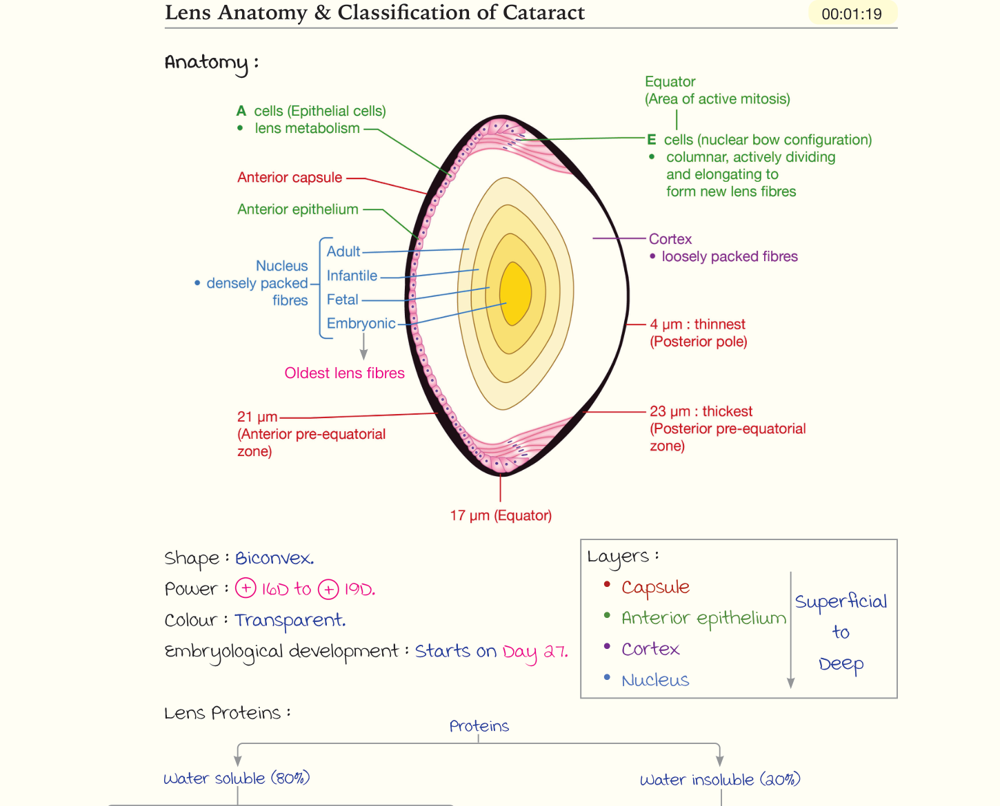

## 2. Gross anatomy and microscopic organization

From superficial to deep, the lens consists of:

1. **Capsule**
2. **Anterior lens epithelium**
3. **Cortex**
4. **Nucleus**

### 2.1 Lens capsule

The lens capsule is a highly elastic covering. Its thickness varies markedly according to location:

| Region | Capsule thickness / feature |
|---|---:|
| Posterior pole | **~4 µm — thinnest** |
| Equator | **~17 µm** |
| Anterior pre-equatorial zone | **~21 µm** |
| Posterior pre-equatorial zone | **~23 µm — thickest** |

The **posterior surface has no epithelium**. The anterior capsule is lined by the anterior lens epithelium.

### 2.2 Lens epithelium

The anterior lens epithelium is a **single layer of epithelial cells**. These cells are metabolically active and are important for lens metabolism.

At the equator, epithelial cells assume a **nuclear bow configuration** and become elongated, actively dividing cells that form new lens fibres. Lens fibre formation therefore continues **throughout life**.

- **Youngest fibres:** peripheral cortical fibres.
- **Oldest fibres:** deepest central fibres.
- New fibres are added at the equator and progressively become incorporated into deeper layers.

### 2.3 Cortex

The cortex contains **more loosely packed lens fibres** and lies external to the nucleus.

### 2.4 Nucleus

The nucleus contains **densely packed fibres** and represents the oldest part of the lens.

The nuclear regions shown in the lens organization include:

- Embryonic nucleus
- Fetal nucleus
- Infantile nucleus
- Adult nucleus

The **fetal nucleus** is associated with the lens sutures.

### 2.5 Lens sutures

There are two characteristic lens sutures:

- **Anterior suture:** erect **Y** configuration.
- **Posterior suture:** inverted **Y** configuration.

## 3. Equator, zonules and ciliary body relationship

The **equator** is the region of active lens growth. Equatorial epithelial cells divide and elongate to form new lens fibres.

The lens is suspended from the ciliary body by the **zonules (suspensory ligaments)**. The zonular apparatus transmits the mechanical effect of the ciliary muscle to the lens and is therefore central to accommodation.

Two anatomical spaces associated with the zonules are important:

- **Canal of Petit:** between the hyaloid/vitreous face and the zonular fibres.
- **Canal of Hannover:** between the zonular fibres themselves, within the suspensory ligament.

## 4. Embryology and development

The lens is derived from **surface ectoderm**.

Lens development begins at approximately **day 27**. The sequence is:

**Optic vesicle contacts surface ectoderm → surface ectoderm thickens → lens placode forms → placode invaginates → lens forms.**

The lens is therefore a surface-ectodermal structure, unlike the retina, optic nerve, iris and ciliary body, which are associated with neuroectodermal development.

### 4.1 Development of lens fibres

- Early lens fibres form the embryonic and fetal nuclear components.
- Subsequent fibres continue to be produced at the equator.
- Lens fibres are therefore produced **throughout life**.
- The oldest fibres remain centrally located; newer fibres are added more peripherally.
- The progressive addition of fibres produces the concentric organization of embryonic, fetal, infantile, adult nucleus and cortex.

## 5. Transparency and optical properties

The normal lens is transparent and contributes substantially to the refractive power of the eye while remaining sufficiently clear to transmit light to the retina.

### 5.1 Refractive properties

| Optical parameter | Value |
|---|---:|
| Lens refractive index, average | **1.39** |
| Cortex refractive index | **~1.38** |
| Nucleus refractive index | **~1.40** |
| Maximum central refractive index | **~1.40–1.41** |
| Lens power | **~+16 to +19 D** |

The refractive index is higher centrally than in the cortex: approximately 1.38 in the cortex and 1.40 in the nucleus, reaching about 1.40–1.41 centrally.

The cornea provides the greatest contribution to the total refractive power of the eye; the lens provides the dynamic component of optical power required for accommodation. In the Listing reduced-eye model, total ocular power is about **58.6 D**; the cornea contributes approximately **+43 to +44 D**, while the lens contributes about **+16 to +19 D**.

### 5.2 Purkinje images

Four Purkinje reflections are produced by the optical surfaces of the eye:

1. Anterior corneal surface
2. Posterior corneal surface
3. Anterior lens surface
4. Posterior lens surface — **inverted**

Loss of the crystalline lens produces aphakia and removes the two lens Purkinje reflections, leaving only the two corneal reflections.

## 6. Lens proteins and biochemistry

Lens transparency depends heavily on the organization and solubility of its proteins.

### 6.1 Protein solubility

Approximately:

- **Water-soluble proteins: 80%**
- **Water-insoluble proteins: 20%**

The major crystallin groups are **α-, β- and γ-crystallins**.

| Protein / group | Important features |
|---|---|
| **α-crystallins** | Largest crystallins; approximately **600 kDa**; found in lens epithelium; function as heat-shock proteins; help prevent denaturation and insolubilization of other crystallins |
| **β-crystallins** | Major portion of crystallins, approximately **55%**; urea-soluble |
| **γ-crystallins** | Major water-soluble crystallin group within the crystallin system |
| **Vimentin, filensin, phakinin** | Cytoskeletal proteins; form/participate in **beaded filaments**; disruption is associated with cataract formation |
| **MIP-26 / Aquaporin-0** | Urea-insoluble membrane protein; helps maintain lens transparency |

### 6.2 Cataract-associated protein changes

With cataract formation:

- **Water-insoluble proteins increase markedly.**
- **Water-soluble proteins decrease markedly.**

Protein insolubilization and disruption of the highly ordered lens fibre/cytoskeletal architecture contribute to loss of optical homogeneity and lens opacity.

## 7. Nutrition, metabolism and water balance

The lens is **avascular**. Nutrients therefore reach the lens by diffusion, predominantly from the aqueous humour.

### 7.1 Nutrient supply

Glucose reaches the lens by diffusion approximately as follows:

- **Aqueous humour: 90%**
- **Vitreous: 10%**

The lens is considered relatively **dehydrated** under normal conditions; excessive hydration is associated with cataract formation.

### 7.2 Glucose metabolism

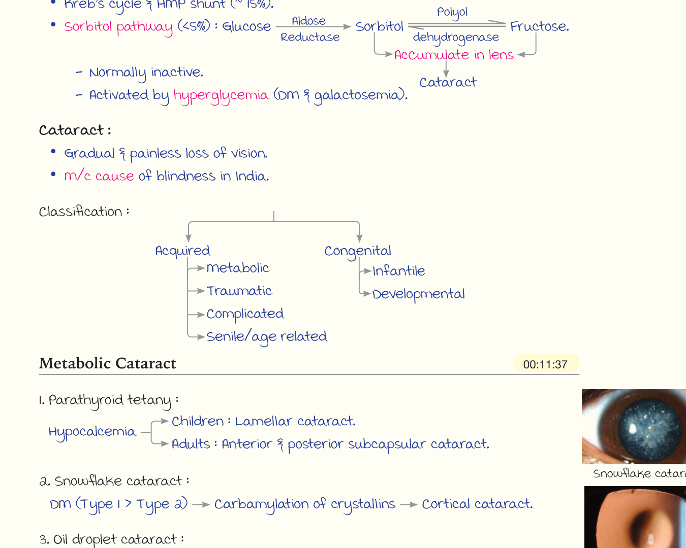

The major metabolic pathway is anaerobic because the lens is avascular.

| Pathway | Approximate contribution |
|---|---:|
| **Anaerobic glycolysis** | **>80%** |
| **Krebs cycle + HMP shunt** | **~15%** |
| **Sorbitol pathway** | **<5%** |

#### Sorbitol pathway

**Glucose → aldose reductase → sorbitol → polyol dehydrogenase → fructose**

The pathway is normally relatively inactive but becomes activated in **hyperglycaemia**, particularly in diabetes, and in **galactosemia**.

Sorbitol accumulation is highly hyperosmotic and promotes water entry into the lens, contributing to lens swelling and cataract formation.

## 8. Accommodation

Accommodation increases the refractive power of the eye for near vision.

### 8.1 Helmholtz mechanism

For **far vision**:

- Ciliary muscle is **relaxed**.
- Ciliary ring is relatively expanded.
- Zonules are **tense**.
- Lens is **thin and relatively flat**, particularly at the anterior surface.
- Lens power is lower.

For **near vision**:

- Ciliary muscle **contracts**.
- Ciliary ring becomes smaller.
- Zonular tension **decreases** and the zonules become slack.
- The elastic lens becomes **thicker and more convex**.
- The anterior surface becomes more curved.
- Lens refractive power **increases**.
- Pupil constriction accompanies near vision.

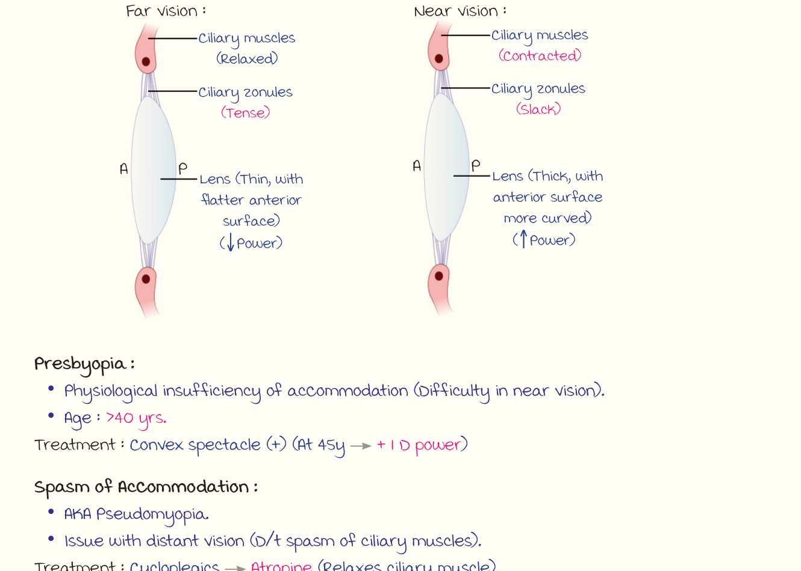

### 8.2 Accommodation sequence

**Ciliary muscle contraction → ciliary ring constriction → zonular relaxation → lens thickening/rounding → increased lens power → near focus.**

This is the **Helmholtz theory of accommodation**.

## 9. Presbyopia and accommodative abnormalities

### Presbyopia

Presbyopia is the **physiological insufficiency of accommodation with age**, producing difficulty with near work.

- Usually clinically evident **after 40 years**.
- Corrected with **convex (+) near spectacles**.
- One exam schedule gives approximately **+1 D at 40 years**, with the required addition increasing by about **0.5 D every 5 years**.
- Maximum accommodative power/addition is approximately **+3 D**.

### Spasm of accommodation

- Also called **pseudomyopia**.
- Persistent ciliary muscle contraction produces excessive accommodation.
- Distant vision becomes blurred and the condition mimics myopia.
- Cycloplegics such as **atropine** relax the ciliary muscle.

### Developmental optical correlation

At birth:

- Axial length ≈ **17 mm**.
- Refractive error ≈ **2–3 D hypermetropia**.
- Emmetropia is generally reached by approximately **5–6 years**.

## 10. Cataract: definition and classification

A **cataract** is a lens opacity that interferes with the optical homogeneity/transparency of the lens and causes progressive visual impairment.

Typical visual loss is **gradual and painless**.

### 10.1 Classification by morphology

- Nuclear
- Cortical
- Anterior polar
- Posterior polar

### 10.2 Classification by maturity

- Immature
- Mature
- Hypermature

### 10.3 Classification by etiology

- Congenital
- Senile/age-related
- Traumatic
- Metabolic
- Radiation-related
- Complicated
- Toxic

## 11. Congenital and developmental cataracts

### 11.1 Blue-dot / cerulean / punctate cataract

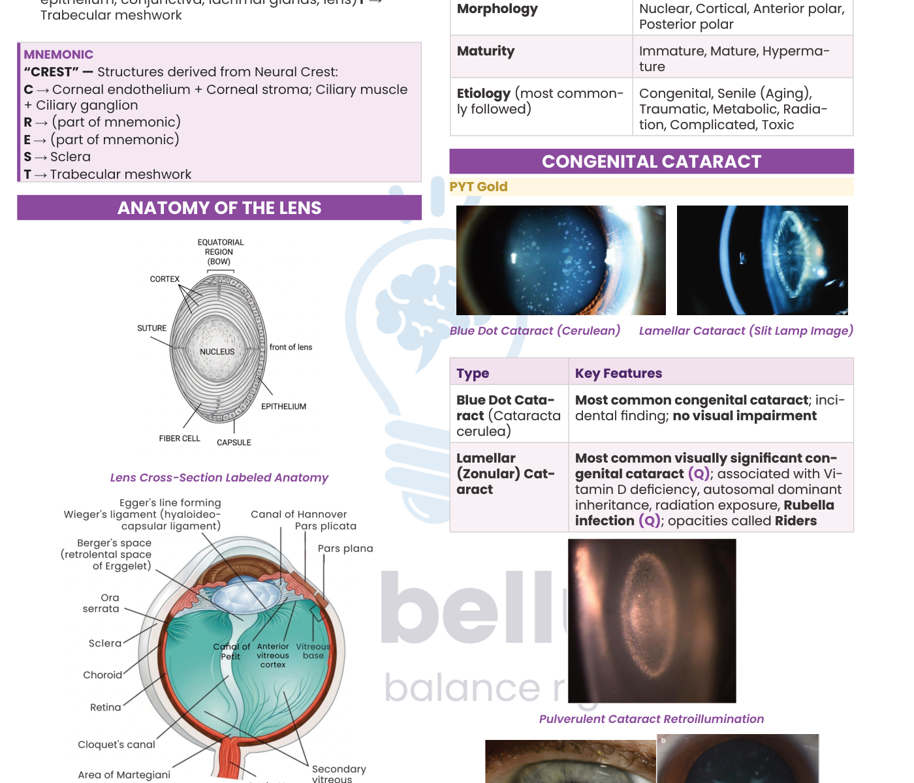

- **Most common congenital cataract**.
- Usually an incidental finding.
- Usually causes little or no visual impairment.
- Associated with **Down syndrome**.

### 11.2 Lamellar / zonular cataract

- **Most common visually significant congenital cataract**.
- Central opacity commonly involves the **fetal nucleus**.
- Characteristic additional spoke-like opacities are called **Riders**.
- Associations include:
  - Vitamin D deficiency
  - Autosomal dominant inheritance
  - Radiation exposure
  - Congenital rubella
- Significant visual deprivation in infancy can produce **stimulus-deprivation amblyopia**.

### 11.3 Pulverulent cataract

- **Cataracta centralis pulverulenta** produces a powdery central opacity.

### 11.4 Polar cataracts

- **Anterior polar cataract:** central opacity at the anterior pole.
- **Posterior polar cataract:** central opacity at the posterior pole.
- Posterior polar cataract may show an **onion-ring/whorled appearance**.
- **Mittendorf dots** may be associated with posterior polar cataract; these represent remnants of the hyaloid artery/tunica vasculosa lentis.
- Posterior polar cataract carries a **high risk of posterior capsular tear during surgery**.

### 11.5 Sutural cataract

- **Anterior suture:** erect Y.
- **Posterior suture:** inverted Y.

## 12. Congenital rubella syndrome and lens involvement

The classic congenital rubella triad is:

1. **Cataract**
2. **Congenital heart defects**
3. **Deafness**

Ocular/systemic findings include:

- **Nuclear pearly cataract** as the common cataract type.
- **Salt-and-pepper fundus** as a characteristic ocular finding.
- **Microphthalmos:** axial length <21 mm; an axial length <19 mm at 1 year is also highlighted.
- **Rubella keratitis** may be associated with an angle anomaly, impaired aqueous drainage and glaucoma.

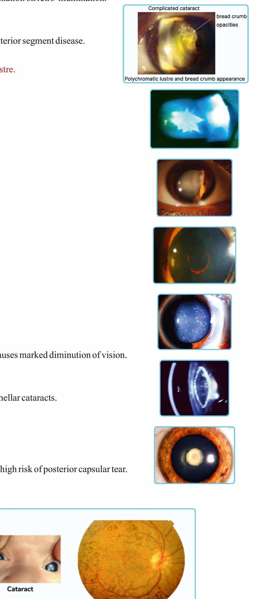

## 13. Infantile cataract: timing and management principle

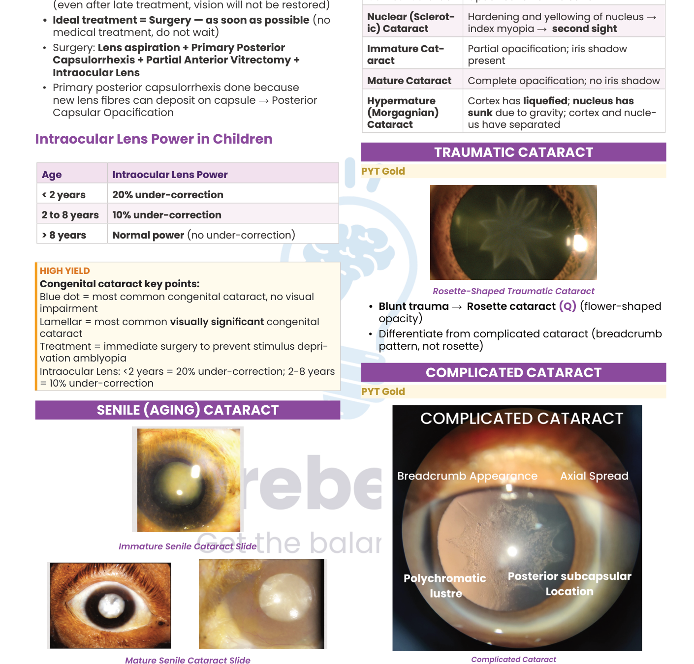

Infantile cataract presenting before 1 year may cause severe visual loss because of disruption of visual development and foveal fixation, resulting in amblyopia.

Developmental cataract presenting after 1 year is associated with less severe visual loss.

The key principle is **early surgery when a congenital/infantile cataract is visually significant**, because delaying treatment can result in permanent stimulus-deprivation amblyopia.

### Cataract surgery in children

The management described is:

- Lens aspiration
- Primary posterior capsulorrhexis
- Partial anterior vitrectomy
- Intraocular lens implantation

Primary posterior capsulorrhexis is performed because new lens fibres can subsequently proliferate/deposit on the posterior capsule and cause posterior capsular opacification.

For paediatric IOL power selection:

| Age | IOL power approach |
|---|---|
| **<2 years** | **20% under-correction** |
| **2–8 years** | **10% under-correction** |
| **>8 years** | Normal calculated power |

## 14. Senile / age-related cataract

Age-related cataract is particularly represented in the **50–70-year** age group, with a mean around **60 years**.

The major morphological types are:

- Nuclear
- Cortical
- Posterior subcapsular
- Anterior subcapsular

### 14.1 Nuclear cataract

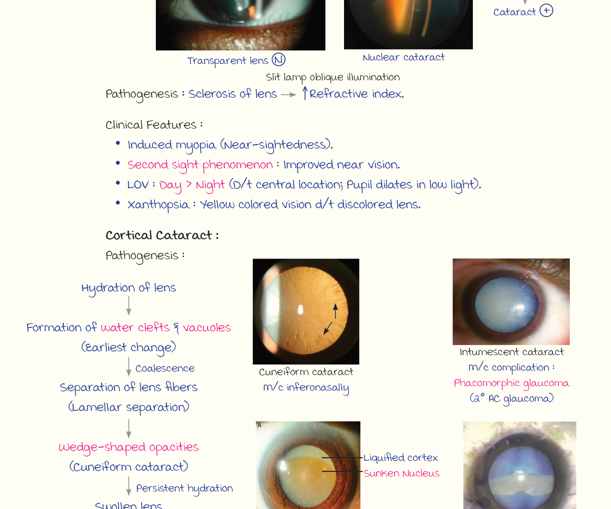

Nuclear cataract is caused by **nuclear sclerosis** with hardening and increased refractive index of the nucleus.

Clinical features:

- **Index myopia** due to increased lens refractive index.
- **Second-sight phenomenon:** previously presbyopic patients may regain useful near vision because of the myopic shift.
- Vision may be worse in daylight and relatively better at night when the pupil dilates, because the central opacity is involved.
- **Xanthopsia:** yellow-coloured vision associated with the discoloured/yellowing nucleus and urochrome pigment.
- Nuclear sclerosis is associated with increased water-insoluble protein and pigment accumulation, including **melanin and urochrome**, producing hardening and increased refractive power.

### 14.2 Cortical cataract

Cortical/cuneiform cataract is associated with **busulfan, steroids and chloroquine**, and can produce marked visual diminution.

Cortical cataract begins with **hydration of the lens** and formation of:

**Water clefts and vacuoles → lamellar separation of lens fibres → wedge-shaped/cuneiform opacities → persistent hydration and coalescence → intumescence → eventual cortical liquefaction.**

Clinical features:

- **Cuneiform cataract:** wedge-shaped cortical opacities, commonly seen inferonasally.
- Visual impairment may be more troublesome at night because of the effect of pupil dilation.
- Progressive hydration may produce an **intumescent cataract**.

### 14.3 Intumescent cataract

- The lens becomes swollen because of hydration.
- The enlarged lens may produce **phacomorphic glaucoma**, a secondary angle-closure glaucoma.
- During continuous curvilinear capsulorrhexis, puncturing a tense swollen capsule can produce a characteristic **horizontal linear tear — the Argentinian flag sign**.

### 14.4 Hypermature / Morgagnian cataract

- The cortex undergoes **liquefaction**.
- The nucleus becomes free within the liquefied cortex and **sinks inferiorly under gravity**.
- Cortex and nucleus become separated.
- The capsule may become wrinkled.
- Leakage of lens proteins can produce **phacolytic glaucoma**.

Phacolytic glaucoma is a secondary **open-angle glaucoma** caused by leakage of lens protein from a hypermature cataract, with protein/macrophage material obstructing the trabecular meshwork.

## 15. Posterior subcapsular cataract

Posterior subcapsular cataract is located beneath the posterior capsule.

Important associations include:

- Myotonic dystrophy
- Neurofibromatosis / neurofibromatosis type 2
- Complicated cataract
- X-ray/radiation exposure
- Galactosemia
- Systemic steroids
- Blunt trauma

Clinical features:

- **Glare** is prominent, particularly difficulty driving at night.
- Visual loss may be disproportionately severe for the amount of visible opacity.
- Near vision is often affected more than distance vision.
- Visual disability may be greater during daytime because of pupillary constriction bringing the central opacity into the visual axis.

**Systemic steroids → cataract; topical steroids → glaucoma** is a useful exam association.

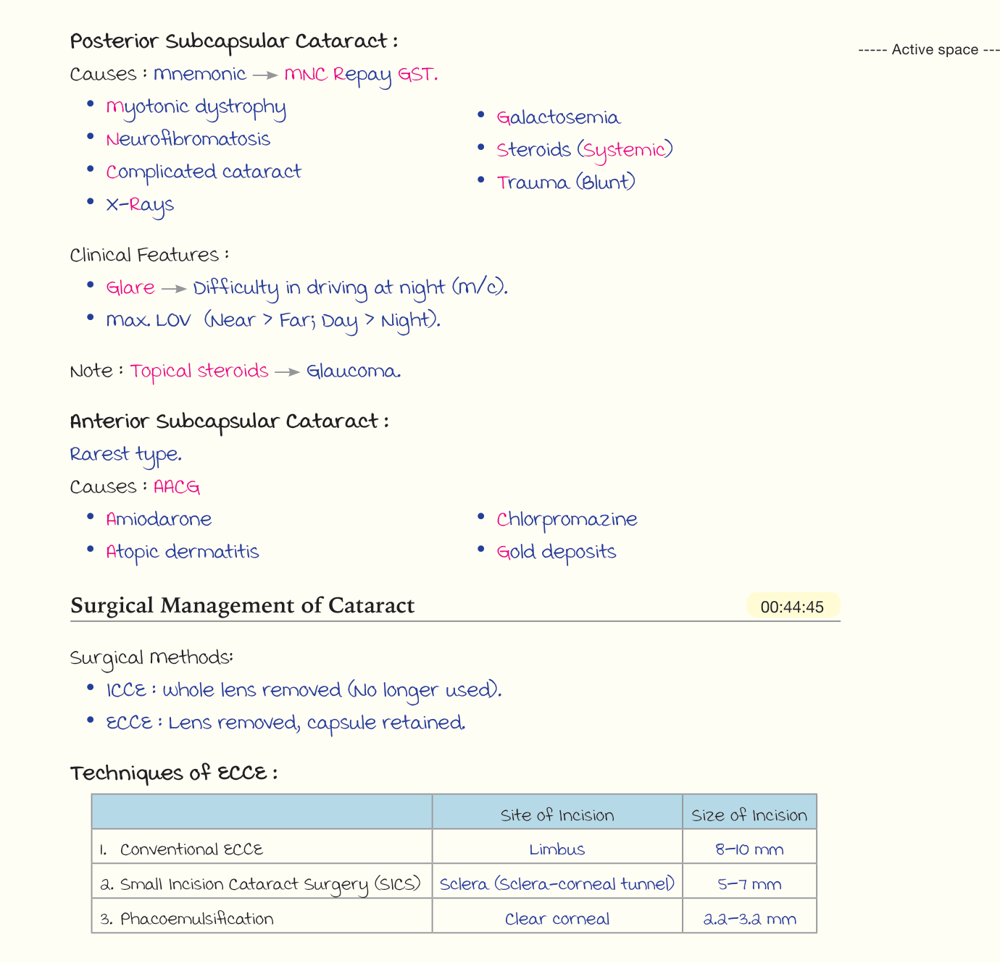

## 16. Anterior subcapsular cataract

Anterior subcapsular cataract is the **rarest** of the major senile cataract patterns.

Important associations:

- **A**miodarone
- **A**topic dermatitis
- **C**hlorpromazine
- **G**old deposits

Acute angle-closure glaucoma can produce **glaukomflecken**, which are anterior subcapsular lens opacities/deposits following an acute pressure rise.

## 17. Complicated cataract

Complicated cataract results from associated intraocular disease.

Important causes include:

- **Uveitis** — commonest cause
- Myopia
- Angle-closure glaucoma
- Retinitis pigmentosa
- Other retinal diseases
- Intraocular tumours
- Endophthalmitis

Typical appearance:

- **Posterior subcapsular location**
- **Breadcrumb appearance**
- **Polychromatic lustre**
- **Axial spread**

## 18. Metabolic cataracts

### 18.1 Hypocalcaemia / parathyroid tetany

Hypocalcaemia may produce cataract.

- Children: **lamellar cataract**.
- Adults: **anterior and posterior subcapsular cataract**.

### 18.2 Diabetic / snowflake cataract

- A presenile/metabolic cataract.
- Also called **snowflake** or **snowstorm cataract**.
- More common with **type 1 diabetes**.
- Cortical cataract pattern.
- Associated with crystallin alteration/carbamylation.
- Sorbitol accumulation contributes to osmotic lens hydration.

Hyperglycaemia can also produce **fluctuating refractive error**, particularly a myopic shift, because lens swelling increases curvature. Hypoglycaemia is associated with a hypermetropic shift as the curvature decreases.

### 18.3 Oil-droplet cataract

- Associated with **galactosemia**.
- Posterior subcapsular appearance.
- Caused by accumulation of galactose and its metabolite **galactitol**.
- Associated with deficiency of **galactose-1-phosphate uridyltransferase (GALT)** or galactokinase in the metabolic pathway.
- It is the **reversible cataract**: treatment of the underlying galactosemia can reverse the lens opacity.

### 18.4 Sunflower cataract

- Associated with **Wilson disease / chalcosis**.
- Produces a sunflower-like copper deposition pattern in the lens.
- Wilson disease may also produce a **Kayser–Fleischer ring** from copper deposition in Descemet’s membrane.

### 18.5 Christmas-tree cataract

- Associated with **myotonic dystrophy**.
- Needle-like, highly coloured/shiny, polychromatic opacities.
- Typically posterior subcapsular.
- Myotonic dystrophy may also have ptosis, low intraocular pressure and pigmentary retinopathy.

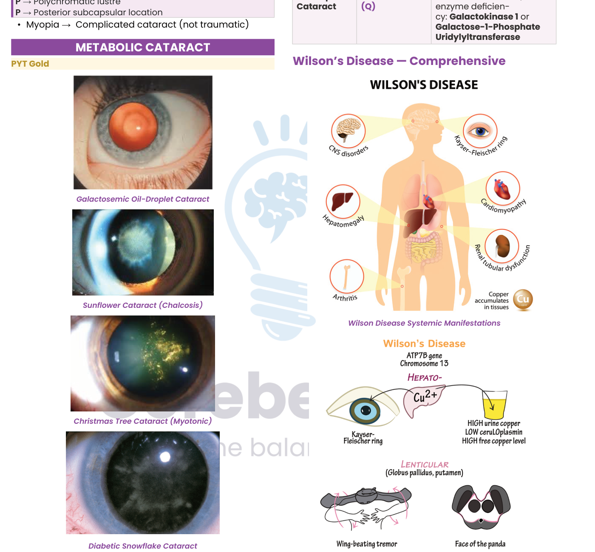

## 19. Traumatic cataract and lens findings after blunt trauma

Blunt trauma can produce characteristic anterior segment and lens findings.

### Lens findings

- **Phacodonesis:** trembling/tremulous lens caused by zonular injury.
- **Rosette-shaped cataract:** flower-shaped opacity, classically following blunt contusion such as a fist or tennis-ball injury.
- The rosette pattern may begin in the posterior cortex.
- **Vossius ring:** ring of iris pigment imprinted on the anterior lens capsule when the pupil strikes the lens during blunt trauma.
- **Ectopia lentis:** subluxation/displacement of the lens following zonular damage.
- **Zonular dialysis:** disruption of zonules leading to lens subluxation.

Associated traumatic signs include:

- Hyphema
- Iridodonesis
- Iridodialysis with a **D-shaped pupil**
- Angle-recession glaucoma
- Retinal detachment
- Commotio retinae/Berlin’s oedema
- Traumatic optic neuropathy

### Other physical causes of lens opacity

| Insult | Lens effect |
|---|---|
| **Infrared radiation** | True exfoliation of lens capsule → **glassblower’s cataract** |
| **Lightning/electric shock** | Anterior capsular lens opacities |
| **Blunt contusion** | Posterior subcapsular/rosette-shaped cataract |
| **X-ray/radiation** | Posterior subcapsular cataract |

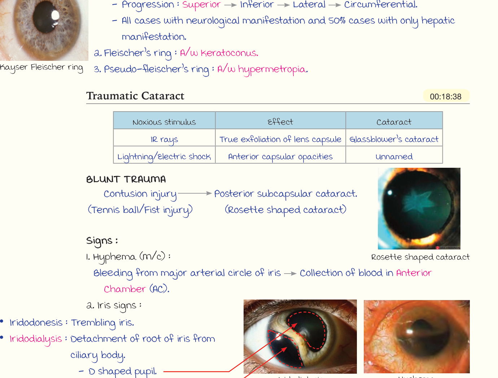

## 20. Ectopia lentis and zonular abnormalities

**Ectopia lentis** is displacement or subluxation of the lens caused by zonular weakness or rupture.

### Causes and direction of displacement

| Cause | Typical displacement |
|---|---|
| **Blunt trauma** | Commonest acquired cause; direction depends on zonular damage |
| **Marfan syndrome** | **Superotemporal** subluxation |
| **Homocystinuria** | **Inferonasal** subluxation |
| **Weill–Marchesani syndrome** | **Anterior / downward-forward** displacement |
| **Ehlers–Danlos syndrome** | Associated with ectopia lentis |
| **Hyperlysinaemia** | Associated with ectopia lentis |
| **Sulfite oxidase deficiency** | Associated with ectopia lentis |

Clinical features include:

- Monocular diplopia.
- Differential refractive power between the displaced and normal portions of the lens.
- A **golden/red crescent** may be visible in the pupillary area when the lens is subluxated.

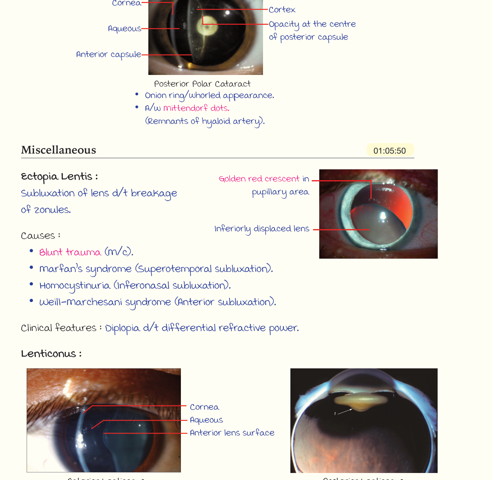

## 21. Lenticonus

Lenticonus is a **congenital abnormality of lens shape** in which the anterior or posterior surface becomes conical.

### Anterior lenticonus

Associated with:

- **Alport syndrome**
- **Spina bifida**
- **Waardenburg syndrome**

### Posterior lenticonus

Associated with:

- **Lowe syndrome / oculocerebrorenal syndrome**

An **oil-globule reflex** may be seen on slit-lamp examination with retroillumination in lenticonus.

## 22. Lens-associated glaucoma

### Phacomorphic glaucoma

Mechanism:

**Intumescent/swollen lens → forward displacement of iris-lens diaphragm → shallow anterior chamber → angle closure → raised IOP.**

Typical lens/anterior chamber combination:

- Lens: **swollen**
- Anterior chamber: **shallow**

### Phacolytic glaucoma

Mechanism:

**Hypermature cataract → liquefaction/lysis of lens proteins → leakage of protein through an intact capsule → macrophage uptake → trabecular meshwork obstruction → secondary open-angle glaucoma.**

Typical combination:

- Lens: **shrunken**
- Anterior chamber: **deep**

Both phacomorphic and phacolytic glaucoma are associated with hypermature cataract and an intact capsule.

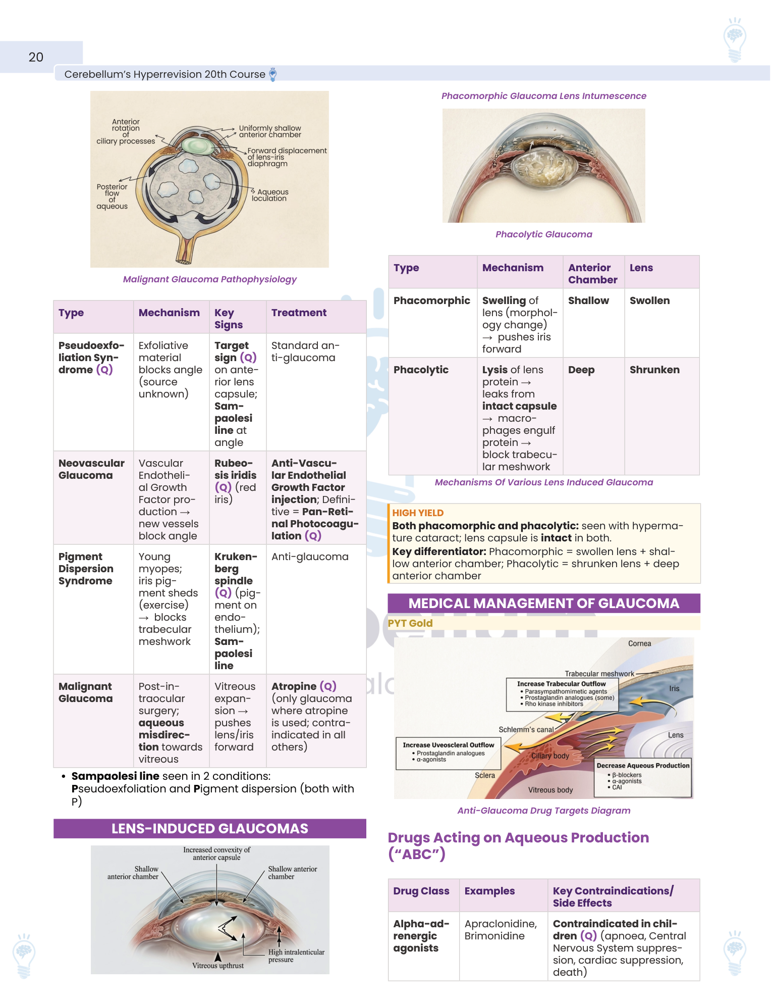

### Glaukomflecken

Following an acute angle-closure glaucoma attack, focal **anterior subcapsular lens opacities** may develop because of the acute pressure/ischemic insult.

### Pseudoexfoliation

Pseudoexfoliative material can deposit on the **anterior lens capsule** and is an important anterior-segment finding associated with glaucoma.

## 23. Clinical examination of the lens and cataract

### 23.1 Visual acuity

Visual acuity is the fundamental functional assessment. Near vision is typically tested at approximately **30–35 cm**.

- Snellen near chart: best near vision **N6**, worst **N36**.
- Jaeger chart: **J1–J7**.

### 23.2 Contrast sensitivity

The **Pelli–Robson chart** is useful because contrast vision may be lost early in cataract.

### 23.3 Slit-lamp examination

Slit-lamp examination evaluates:

- Anterior capsule
- Anterior lens surface
- Cortex
- Nucleus
- Posterior subcapsular region
- Lens position and centration
- Zonular integrity indirectly through signs such as phacodonesis

**Oblique illumination** is used in assessment of lens opacity, particularly senile cataract morphology.

**Retroillumination** is particularly useful for detecting posterior lens opacities and characteristic reflexes, including:

- Posterior polar cataract
- Lenticonus/oil-globule reflex
- Other central lens opacities

### 23.4 Iris shadow

The presence of an **iris shadow** indicates incomplete lens opacity and therefore an **immature cataract**.

- **Immature cataract:** partial lens opacification; iris shadow present.
- **Mature cataract:** complete lens opacification; iris shadow absent.
- **Hypermature cataract:** liquefied cortex with sinking nucleus in the Morgagnian form.

## 24. Cataract surgery

There is no medical treatment that clears an established visually significant cataract; definitive treatment is removal of the opaque lens and optical rehabilitation.

### 24.1 Intracapsular cataract extraction — ICCE

- Entire lens **and entire capsule** are removed.
- Cryoextraction is described as the method used for ICCE.
- Significant lens subluxation, particularly **>9 clock hours**, is an indication.

For congenital cataract, an ideal operative time is **after 1 month**, with surgery performed as soon as feasible to avoid amblyopia.
- It is contraindicated in children because of the relationship between the anterior hyaloid and the lens/capsular apparatus, with risk of vitreoretinal traction and retinal detachment.
- ICCE is no longer routine cataract surgery.

### 24.2 Extracapsular cataract extraction — ECCE

- Lens contents are removed while the capsule is retained.
- Conventional ECCE, SICS and phacoemulsification are forms of extracapsular surgery.

| Procedure | Typical incision site | Typical incision size |
|---|---|---:|
| Conventional ECCE | Limbus | **8–10 mm** |
| SICS | Sclero-corneal tunnel | **~5–7 mm**; another table gives **5–5.5 mm** |
| Phacoemulsification | Clear cornea | **~2.2–3.2 mm**; another table gives **2.75–3.2 mm** |

### 24.3 Phacoemulsification

Principle:

**Piezoelectric crystal in the phaco probe → ultrasonic energy → mechanical to-and-fro motion → nuclear fragmentation.**

Typical sequence:

1. Side-port incision using MVR/15° blade.
2. Trypan-blue staining when required.
3. Continuous curvilinear capsulorrhexis (CCC).
4. Main corneal incision using keratome.
5. Hydrodissection to separate capsule from cortical fibres.
6. Optional hydrodelineation of the nucleus.
7. Nuclear fragmentation with the phaco probe.
8. Irrigation and aspiration.
9. IOL implantation into the capsular bag when suitable.

The phaco probe frequency is approximately **40 kHz**.

Non-foldable IOLs are described as **PMMA (polymethyl methacrylate)**; foldable IOLs are generally made from **silicone, acrylic or hydrogel**. Hydrophobic acrylic is described as having a low likelihood of posterior capsular opacification.

### 24.4 Femtosecond laser-assisted cataract surgery — FLACS

The femtosecond laser is used for:

- Corneal incision
- Capsulotomy/capsulorrhexis
- Lens/nuclear fragmentation

The femtosecond system is described with:

- Pulse duration: approximately **10⁻¹⁵ s**.
- Wavelength: **1054 nm**.
- Principle: **photodisruption**.
- **Nd:glass laser**.

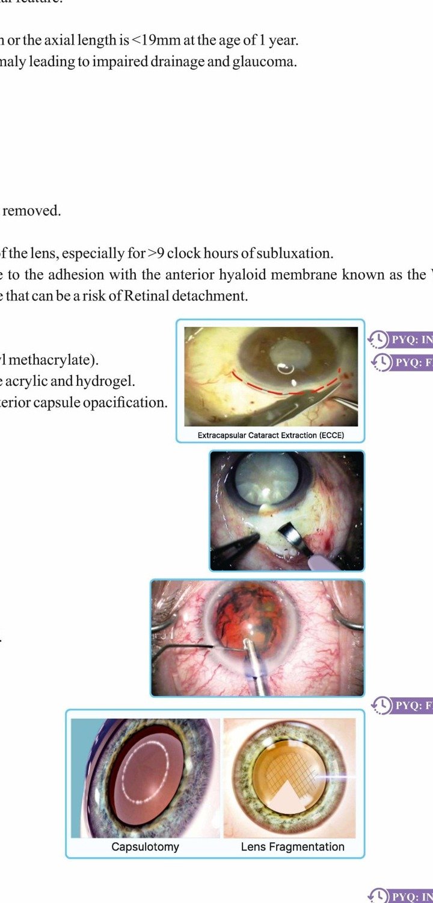

## 25. Intraocular lenses and biometry

### 25.1 IOL types

**Posterior chamber IOL (PCIOL):**

- Placed in the capsular bag.
- Usually has a **C-shaped haptic**.
- Optic provides the refractive correction.

**Anterior chamber IOL (ACIOL):**

- Placed in the anterior chamber when the capsular bag cannot support a posterior chamber lens.
- The ACIOL has an **S-shaped haptic**.
- Iris chafing by an ACIOL can produce **UGH syndrome**.

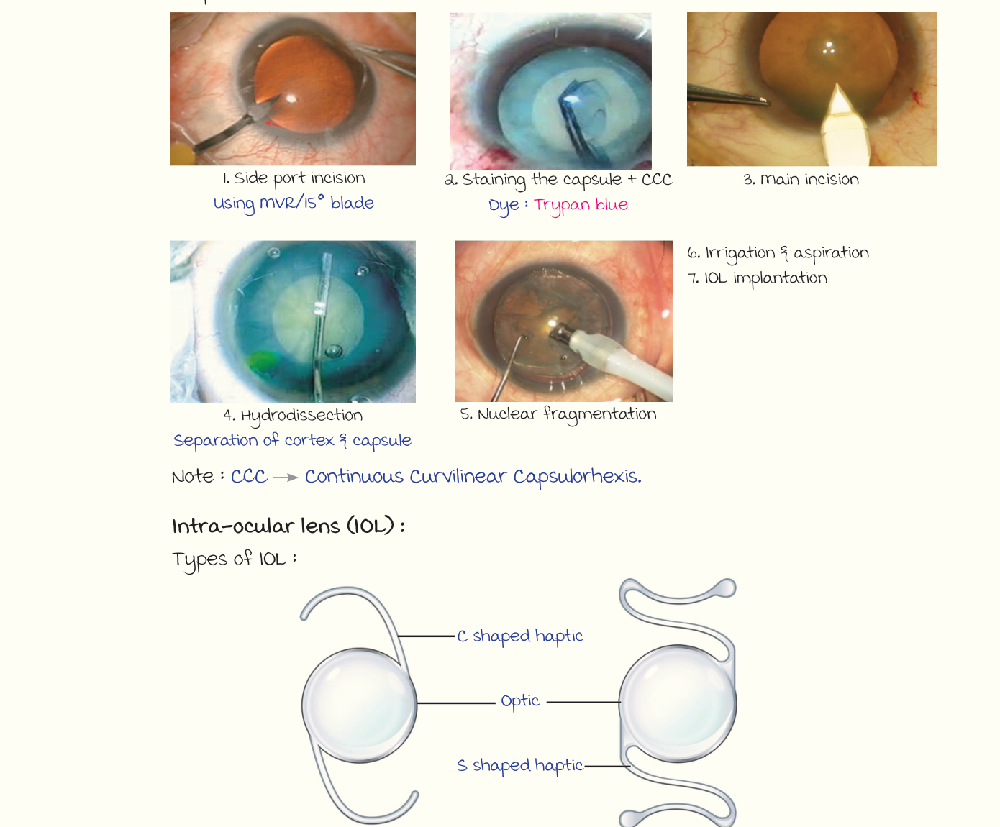

### 25.2 IOL power calculation — biometry

Biometry uses:

1. **Keratometry** — corneal curvature.
2. **A-scan ultrasonography** — axial length.
3. IOL calculation formula.

Normal axial length is approximately **24 mm**.

Important formula associations:

- **SRK-T** — commonly used formula.
- **Hoffer Q** — particularly when axial length is **<22 mm**.
- **Holladay** — particularly when axial length is **>24.5 mm**.
- **Haigis-L** — useful after previous corneal refractive surgery.
- **Hoffer Q** is used for shorter eyes and **SRK/T** for longer eyes.
- The SRK expression is **P = A − 2.5L − 0.9K**, where *L* is axial length, *K* is keratometry and *A* is the constant.

## 26. Complications of cataract surgery

### 26.1 Operative complications

- **Posterior capsular rupture** → vitreous loss; among the most serious operative complications.
- **UGH syndrome** due to iris chafing by an ACIOL.
- Expulsive choroidal haemorrhage.
- Superior rectus injury during bridle-suture placement in SICS/ECCE.
- Descemet membrane detachment.
  - Treatment: **Descemetopexy** by reattachment using an air/gas bubble in the anterior chamber.

### 26.2 Posterior capsular opacification

The **most common long-term/postoperative complication** is posterior capsular opacification (PCO).

It may occur through proliferation/deposition of residual lens epithelial cells and fibres on the posterior capsule. A typical occurrence is around **6–12 months** after surgery.

Forms include:

- **Elschnig pearls** — highlighted as the common form.
- **Soemmering ring**.
- Diffuse posterior capsular opacity.
- Approximately **90% Elschnig pearls** and **10% Soemmering ring** are listed.

Treatment:

- **Nd:YAG laser posterior capsulotomy**.
- Nd:YAG wavelength: **1064 nm**.
- An Abraham lens may be used when performing peripheral laser iridotomy with Nd:YAG.

Hydrophobic acrylic IOLs have a lower likelihood of posterior capsular opacification than other IOL materials.

### 26.3 Other postoperative complications

- Retinal detachment.
- **Irvine–Gass syndrome:** typically around **6–10 weeks** after surgery; cystoid macular oedema is associated with vitreous touch, and bullous keratopathy.
- IOL displacement:
  - **Sunset syndrome:** inferior subluxation.
  - **Sunrise syndrome:** superior subluxation.
  - **Lost lens syndrome:** complete dislocation.
- Toxic anterior segment syndrome (TASS).
- Flat/shallow anterior chamber due to:
  - Wound leak
  - Ciliary/choroidal detachment
  - Pupillary-block glaucoma
  - Malignant glaucoma
- Endophthalmitis.

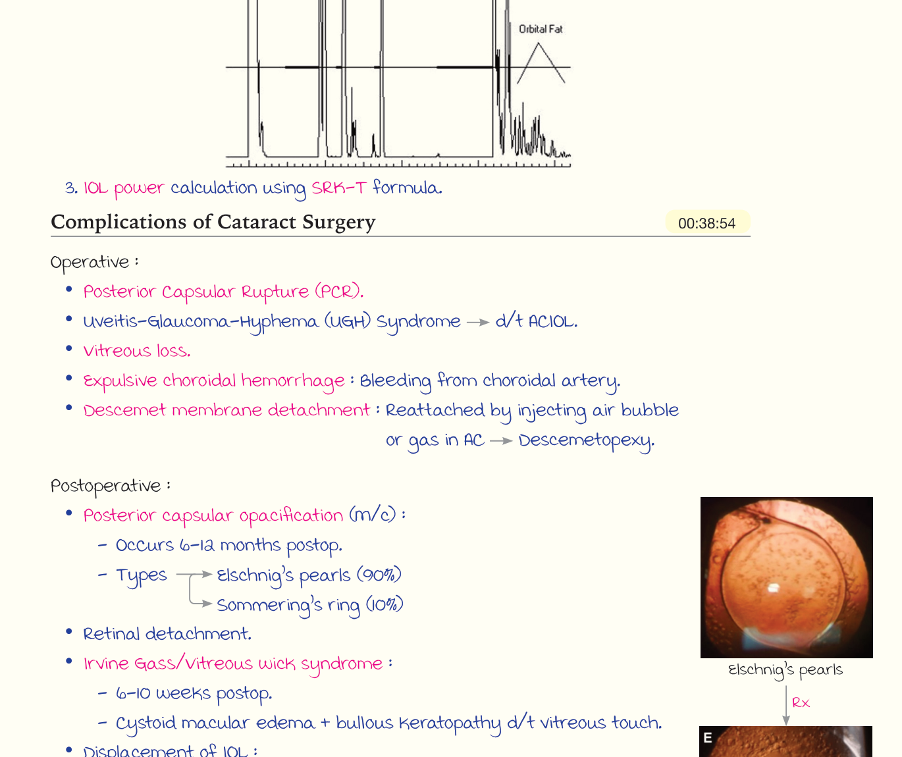

## 27. Postoperative endophthalmitis relevant to lens surgery

Endophthalmitis is a suppurative intraocular infection/inflammation involving all ocular structures except the sclera.

Typical features:

- Pain
- Redness/congestion
- Loss of vision
- Hazy cornea
- Hypopyon
- Vitritis

Organisms highlighted include:

| Setting | Common organism |
|---|---|
| Early postoperative, <7 days | **Coagulase-negative Staphylococcus**, particularly *Staphylococcus epidermidis* |
| Late postoperative, >6 weeks | **Propionibacterium acnes** |
| Traumatic | **Bacillus cereus** |
| Endogenous | **Klebsiella**, **Candida** |

Systemic antibiotics are not the routine primary treatment for postoperative endophthalmitis.

Treatment depends on visual potential:

- **No perception of light:** evisceration.
- **Perception of light only:** immediate pars plana vitrectomy + intravitreal antibiotics + topical fortified antibiotics.
- **Hand movement or better:** vitreous tap/culture + intravitreal antibiotics.

For fungal endophthalmitis, intravitreal **amphotericin B** or **voriconazole** is listed. Systemic antibiotics have no routine role unless endogenous/candidal infection is present.

## 28. Aphakia

**Aphakia** is absence of the natural crystalline lens, most commonly following lens extraction.

### Clinical signs

- **Limbal scar** from previous cataract surgery.
- **Deep anterior chamber** because the iris loses its support from the lens and falls posteriorly.
- **Iridodonesis** — tremulous iris due to loss of lens support.
- **Jet-black pupil** because the crystalline lens is no longer present behind the pupil to reflect light.
- **High hypermetropia** because the eye loses the converging power of the natural lens.
- Small hypermetropic optic disc on fundus examination.
- Only **2 Purkinje images** remain — the two corneal reflections.

### Correction of aphakia

| Method | Approximate image magnification / optical effect | Key point |
|---|---:|---|
| Aphakic spectacles | **~30% magnification** | Least preferred; peripheral prism and other optical problems |
| Contact lens | **~7% magnification** | Better optical result than spectacles but handling may be difficult |
| Posterior chamber IOL | **Minimal magnification** | Preferred; placed in the capsular bag when possible |

Aphakic spectacles can produce:

- Roving-ring scotoma from peripheral prism.
- Jack-in-the-box phenomenon.
- Pin-cushion distortion.
- Chromatic aberration.
- Thick/heavy cosmetic appearance.

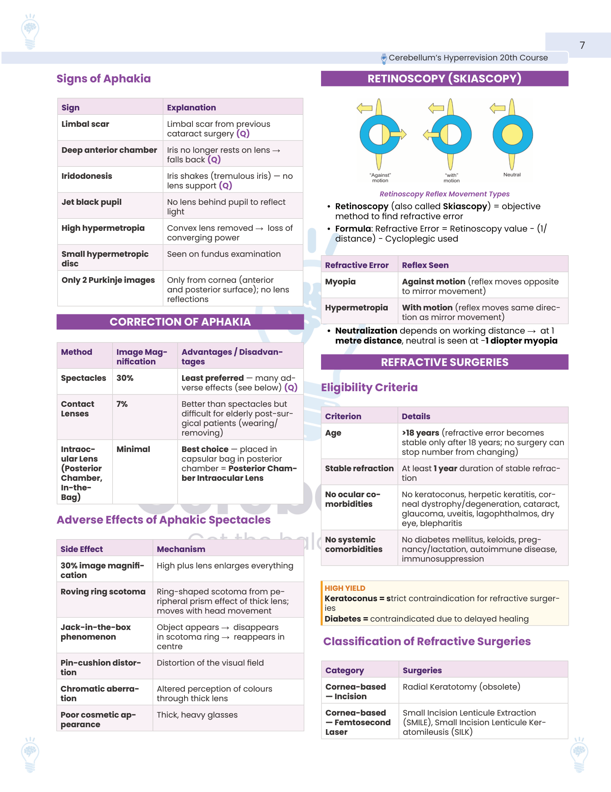

## 29. Phakic intraocular lens

A phakic intraocular lens, such as an **implantable collamer lens (ICL)**, is placed behind the iris and in front of the natural crystalline lens.

- Used for high refractive errors or when corneal laser procedures are unsuitable.
- Minimum anterior chamber depth highlighted for ICL surgery: **2.8 mm**.

## 30. High-yield lens correlations

| Finding | Lens association |
|---|---|
| **Second sight** | Nuclear sclerosis → increased refractive index → index myopia → improved near vision |
| **Rosette cataract** | Blunt trauma |
| **Vossius ring** | Iris pigment imprint on anterior lens capsule after blunt trauma |
| **Phacodonesis** | Zonular injury → trembling lens |
| **Ectopia lentis** | Zonular weakness/rupture → lens subluxation |
| **Superotemporal ectopia lentis** | Marfan syndrome |
| **Inferonasal ectopia lentis** | Homocystinuria |
| **Anterior/downward-forward ectopia lentis** | Weill–Marchesani syndrome |
| **Anterior lenticonus** | Alport, spina bifida, Waardenburg syndrome |
| **Posterior lenticonus** | Lowe syndrome |
| **Blue-dot cataract** | Most common congenital cataract; Down syndrome association highlighted |
| **Lamellar cataract** | Most common visually significant congenital cataract; Riders; vitamin D deficiency/rubella associations |
| **Posterior polar cataract** | Onion-ring/whorled appearance; Mittendorf dots; high posterior capsular tear risk |
| **Snowflake cataract** | Diabetes, especially type 1 |
| **Oil-droplet cataract** | Galactosemia; reversible |
| **Sunflower cataract** | Wilson disease/chalcosis |
| **Christmas-tree cataract** | Myotonic dystrophy |
| **Glassblower’s cataract** | Infrared radiation → true exfoliation of capsule |
| **Glaukomflecken** | Anterior subcapsular lens opacities after acute angle closure |
| **Phacomorphic glaucoma** | Swollen/intumescent lens + shallow anterior chamber |
| **Phacolytic glaucoma** | Hypermature cataract + protein leakage + deep anterior chamber |
| **Elschnig pearls** | Posterior capsular opacification after cataract surgery |
| **Sunset IOL** | Inferior IOL subluxation |
| **Sunrise IOL** | Superior IOL subluxation |
| **Lost lens** | Complete IOL dislocation |

## 31. Integrated lens physiology-to-pathology framework

**Surface ectoderm → lens placode → lens formation → anterior epithelium + capsule + cortex + nucleus → equatorial epithelial proliferation → lifelong addition of lens fibres → progressive central accumulation of older fibres.**

The lens remains transparent through preservation of highly organized fibres, appropriate protein solubility, controlled hydration and refractive-index organization. It is metabolically active despite being avascular and relies predominantly on aqueous-derived glucose, with **>80% anaerobic glycolysis**.

Disruption of these systems produces characteristic patterns:

- **Protein insolubilization** → cataract.
- **Hydration/osmotic injury** → cortical or metabolic cataract patterns.
- **Sorbitol accumulation** → diabetic/galactosemic osmotic lens injury.
- **Nuclear sclerosis** → increased refractive index, index myopia and second sight.
- **Zonular failure** → phacodonesis and ectopia lentis.
- **Capsular/posterior lens opacity** → posterior polar cataract or posterior capsular opacification after surgery.
- **Ciliary muscle–zonular–lens dysfunction** → impaired accommodation or pseudomyopia.
- **Progressive accommodative insufficiency** → presbyopia.

