# Squint (Strabismus)

## 1. Definition and terminology

**Squint (strabismus)** is misalignment of the visual axes of one or both eyes. The deviation may be horizontal, vertical, or torsional.

### Direction of deviation

| Deviation | Direction |
|---|---|
| **Esotropia** | Inward deviation |
| **Exotropia** | Outward deviation |
| **Hypertropia** | Upward deviation |
| **Hypotropia** | Downward deviation |
| **Incyclotropia** | Inward rotation / intorsion |
| **Excyclotropia** | Outward rotation / extorsion |

Incyclotropia and excyclotropia are not usually clinically obvious and are assessed with the **double Maddox rod test**.

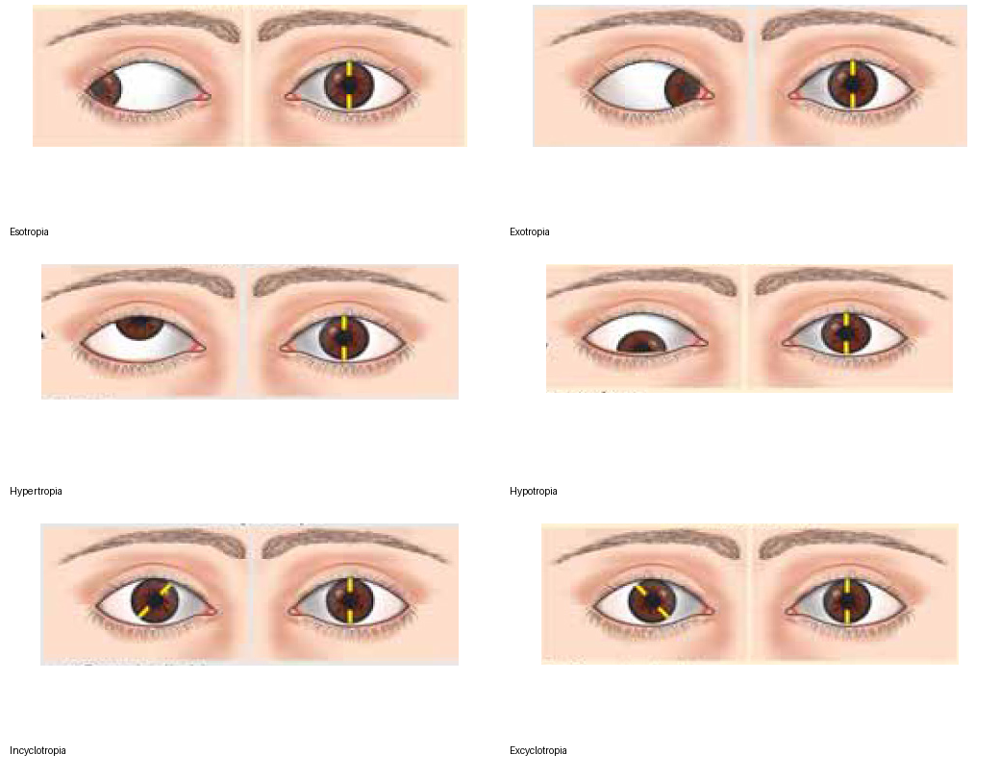

### Pseudostrabismus vs true strabismus

- **Pseudostrabismus:** the eyes appear deviated, but ocular alignment is normal.
- **True strabismus:** a genuine deviation of the visual axes is present.

True strabismus is divided into:
- **Phoria:** latent deviation; appears when binocular fusion is disrupted or under visual stress.
- **Tropia:** manifest deviation; present while the eyes are viewed under ordinary binocular conditions.

---

## 2. Classification of strabismus

### A. According to visibility

| Type | Meaning |
|---|---|
| **Phoria** | Latent deviation |
| **Tropia** | Manifest deviation |

### B. According to constancy of the angle

| Type | Main feature |
|---|---|
| **Comitant squint** | Deviation remains essentially the same in different directions of gaze |
| **Incomitant squint** | Deviation varies with direction of gaze |

In a comitant deviation, the **primary and secondary deviations are equal**. In an incomitant deviation, the **secondary deviation is greater than the primary deviation**, explained by Hering's law.

### C. Paralytic vs restrictive

| Feature | Paralytic | Restrictive |
|---|---|---|
| Basic problem | Weakness/paralysis of an EOM or its nerve supply | Mechanical restriction of ocular movement |
| Typical cause | CN III, IV or VI palsy | Orbital/mechanical restriction; thyroid eye disease, orbital fracture |
| Deviation | Incomitant | Incomitant |
| Forced duction test | Negative | Positive |
| Diplopia | Common | Common |
| Abnormal head posture | Compensatory | May occur |

**Forced duction test (FDT)** is used to distinguish mechanical restriction from paresis: a mechanically restricted eye cannot be passively moved through the restricted field, whereas a paretic eye moves freely when the restriction is removed.

---

## 3. Extraocular muscles and ocular motility

There are **7 extraocular muscles** associated with ocular movement and eyelid elevation:
- 6 muscles move the eyeball.
- Levator palpebrae superioris elevates the upper eyelid.

The six muscles acting on the globe are:
- Superior rectus (SR)
- Inferior rectus (IR)
- Medial rectus (MR)
- Lateral rectus (LR)
- Superior oblique (SO)
- Inferior oblique (IO)

### Nerve supply

- **LR → CN VI**: LR6
- **SO → CN IV**: SO4
- **All other EOMs → CN III**

### Actions of EOMs

| Muscle | Primary action | Secondary action | Tertiary action |
|---|---|---|---|
| **MR** | Adduction | — | — |
| **LR** | Abduction | — | — |
| **SR** | Elevation | Intorsion | Adduction |
| **IR** | Depression | Extorsion | Adduction |
| **SO** | Intorsion | Depression | Abduction |
| **IO** | Extorsion | Elevation | Abduction |

**Clinical rule:**  
- Primary actions of vertical recti and obliques are best demonstrated in **abduction**.
- Secondary vertical actions of the obliques are best demonstrated in **adduction**.

The superior oblique can be clinically assessed by asking the patient to look toward the **tip of the nose**, because depression in adduction is primarily mediated by the superior oblique.

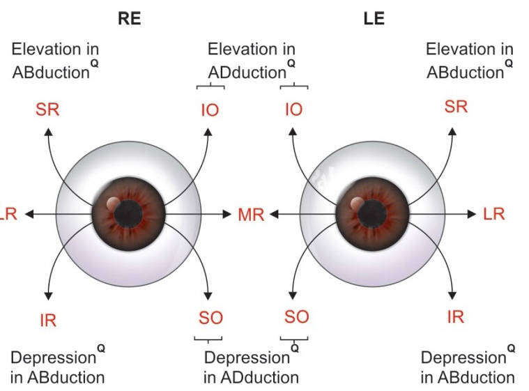

### Axes of the vertical recti and obliques

The visual axis forms an angle of approximately **23° with the axis of the vertical recti**.

- At about **23° abduction**, the vertical recti are aligned with the visual axis and predominantly produce elevation/depression.
- At about **51° adduction**, the oblique muscles are optimally positioned to produce elevation/depression.

---

## 4. Terminology of muscle relationships

### Antagonists
Muscles producing opposite actions in the same eye.

**Example:** right MR and right LR.

### Agonists
Muscles producing the same action in the same eye.

**Example:** right SR and right IO both elevate.

### Yoke muscles / contralateral synergists
One muscle from each eye that acts together to produce a particular **version**, allowing both eyes to move in the same direction.

Examples:
- Right gaze → right LR + left MR
- Left gaze → left LR + right MR
- Dextroelevation → right SR + left IO
- Levodepression → left IR + right SO

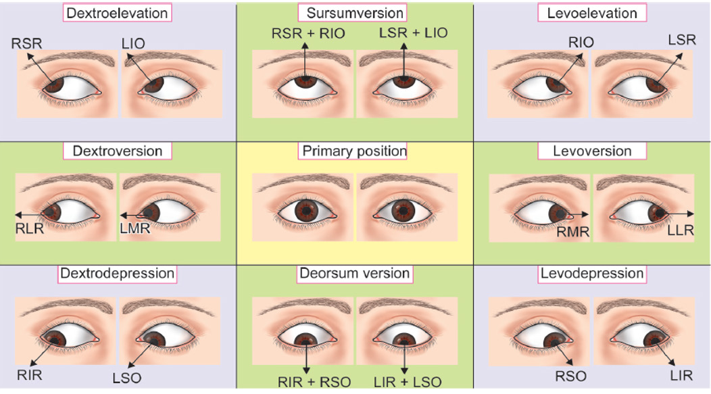

---

## 5. Laws governing binocular motor control

### Hering's law of equal innervation
Equal innervation is supplied to the **yoke muscles** during conjugate eye movements.

### Sherrington's law of reciprocal inhibition
When an agonist contracts, its antagonist in the same eye receives reciprocal inhibition and relaxes.

Failure or disturbance of these coordinated mechanisms can produce strabismus.

---

# 6. Binocular vision and sensory adaptation

Normal binocular vision depends on the two eyes receiving sufficiently similar images and the visual system combining them.

### Grades of binocular single vision

| Grade | Function | Typical test |
|---|---|---|
| **Grade 1** | Simultaneous macular perception | Synoptophore |
| **Grade 2** | Fusion | Synoptophore / Worth 4-dot |
| **Grade 3** | Stereopsis | Synoptophore / Titmus fly |

**Stereopsis** is the perception of depth produced by binocular disparity and represents the highest grade of binocular single vision.

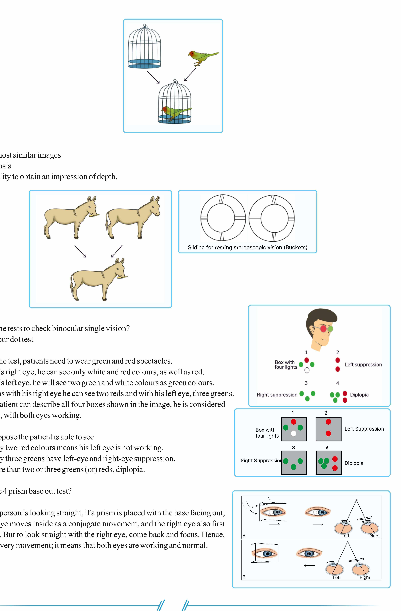

### Synoptophore / amblyoscope
Used to demonstrate and assess binocular single vision and its grades.

### Titmus fly test
Tests **stereopsis (Grade 3 binocular single vision)**. Polarized glasses are used; the wings of the fly appear elevated when stereopsis is perceived.

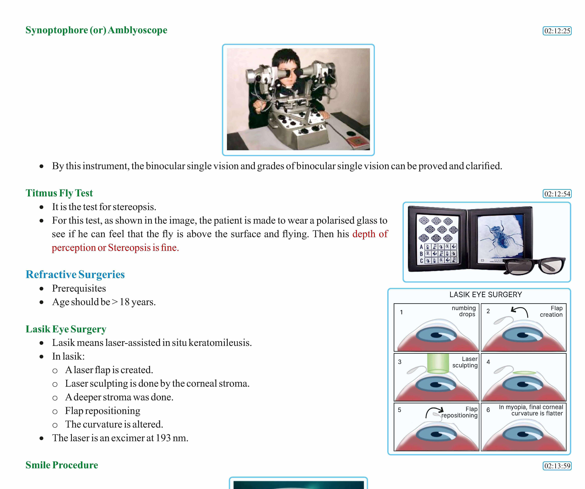

---

## 7. Suppression, abnormal retinal correspondence and amblyopia

A persistent manifest deviation may prevent the brain from receiving two conflicting images by adapting to the misalignment.

### Suppression
The image from the deviated eye is actively suppressed.

- Suppression is an adaptation to **confusion**.
- Persistent suppression can lead to **amblyopia**.

### Anomalous retinal correspondence (ARC)
A sensory adaptation to persistent diplopia in which retinal points other than the normal corresponding points become functionally associated.

- **Harmonious ARC** can maintain binocular single vision despite a manifest deviation.
- **Non-harmonious ARC** is associated with diplopia.

### Strabismic amblyopia
Amblyopia is reduced vision without an identifiable organic cause, associated with persistent abnormal visual input.

Large-angle infantile/childhood strabismus can cause:
**large deviation → suppression of one eye → amblyopia**.

### Occlusion therapy
The material describes occlusion as prevention/treatment of amblyopia:
- Patch the **normal/fixing eye** to stimulate the deviating eye.
- The revision material describes patching the normal eye for a number of days equal to the child's age, followed by patching the deviated eye for 1 day.
- The stated age range for this regimen is up to approximately **6 years**.

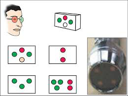

---

# 8. Clinical presentation: comitant vs incomitant strabismus

| Feature | Comitant | Incomitant / paralytic |
|---|---|---|
| Deviation | Same in different gazes | Changes with gaze |
| Typical onset | Usually childhood | Often sudden when acquired |
| Diplopia | Usually absent because of sensory adaptation/suppression | Common |
| Head posture | Usually absent | Compensatory abnormal head posture |
| Primary vs secondary deviation | Equal | Secondary > primary |

A compensatory head posture places the eyes in a position where the deviation and diplopia are reduced.

---

# 9. Examination of a patient with squint

The examination should establish:
- Type and direction of deviation
- Whether the deviation is manifest or latent
- Whether it is comitant or incomitant
- Amount of deviation
- Near vs distance difference
- Ocular motility
- Presence and pattern of diplopia
- Fusional ability
- Sensory status and suppression
- Amblyopia
- Refractive error, especially hypermetropia in suspected accommodative esotropia

### Ocular motility

Eye movements are examined in **all 9 directions of gaze**.

The deviation should be compared in different gaze positions to determine whether it is comitant or incomitant.

### Refraction

Retinoscopy is performed to identify refractive errors, particularly hypermetropia.

**Uncorrected hypermetropia → increased accommodative effort → accommodative convergence → esotropia.**

Mnemonic: **SO HYPER**.

### Fusional vergence

Fusional vergence is assessed using the **RAF ruler** in the provided material.

It measures the additional fusional power required to prevent a manifest esodeviation from appearing.

---

# 10. Hirschberg test

The **Hirschberg corneal light reflex test** estimates ocular deviation from the position of the corneal light reflex.

It uses **Purkinje image 1**, the corneal reflection of the light source.

### Normal

The reflex lies approximately at the centre of the pupil and is symmetric between the two eyes.

### Direction

**DOOR — Deviation Opposite Of Reflection**

- Temporal displacement of the corneal reflex corresponds to **esodeviation**.
- Nasal displacement corresponds to **exodeviation**.
- Inferior displacement corresponds to **hypertropia**.
- Superior displacement corresponds to **hypotropia**.

### Approximate angle estimation

| Reflex position | Approximate deviation |
|---|---:|
| Centre of pupil | 0° |
| Pupillary border | **15° ≈ 30Δ** |
| Mid-iris | **30° ≈ 60Δ** |
| Limbus | **45° ≈ 90Δ** |

A **1 mm displacement** of the corneal reflex corresponds approximately to **7° or about 14–15 prism diopters**.

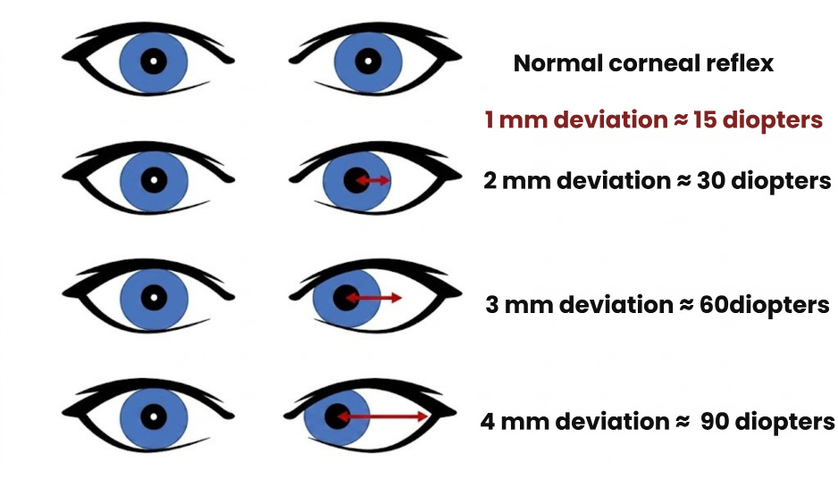

---

# 11. Cover and uncover tests

### Cover test

Used to detect a **tropia (manifest deviation)**.

Technique:
1. Ask the patient to fixate a target.
2. Cover the normal/fixing eye.
3. Observe the previously deviated eye as it takes up fixation.

A refixation movement demonstrates a manifest deviation.

### Uncover test

Used to detect a **phoria (latent deviation)**.

Cover either eye and then uncover it while observing the recovery movement.

**DOOM — Deviation Opposite Of Movement**

The direction in which the eye moves during refixation is opposite to the direction of the deviation.

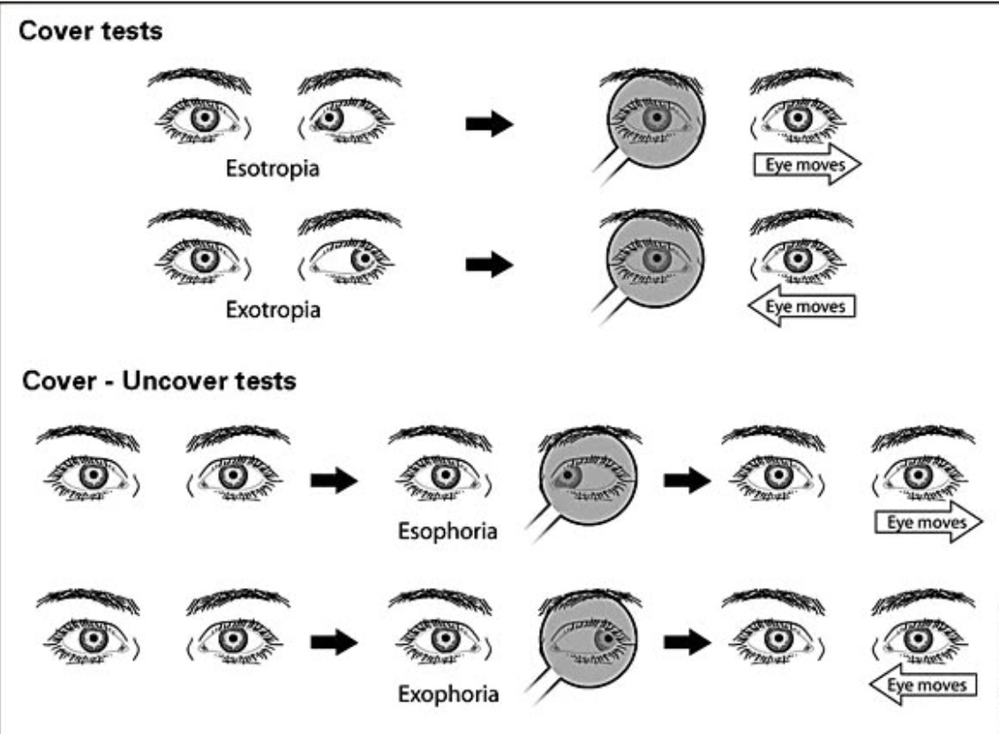

---

# 12. Prism measurements

### Prism bar cover test

The prism bar cover test is the most accurate objective method among the listed tests for quantifying a manifest deviation.

The prism is increased until the deviation is **neutralized and no refixation movement occurs**.

**Modern measurement principle:** the amount of deviation equals the prism power required to neutralize the movement.

### Prism orientation

The prism base is placed **opposite the direction of deviation**.

| Deviation | Neutralizing prism |
|---|---|
| Esotropia | Base-out |
| Exotropia | Base-in |
| Hypertropia | Base-down |
| Hypotropia | Base-up |

Mnemonic: **DOOB — Deviation Opposite Of Base.**

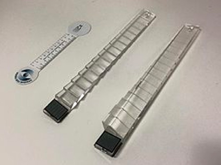

---

# 13. Krimsky test

The **Krimsky test** is a prism-reflection test and is particularly useful when conventional cover testing is difficult, such as in young or poorly cooperative patients.

A prism is placed to neutralize the displaced corneal light reflex. The prism power required to centre the reflex corresponds to the ocular deviation.

The material also describes this as the **prism reflection test**.

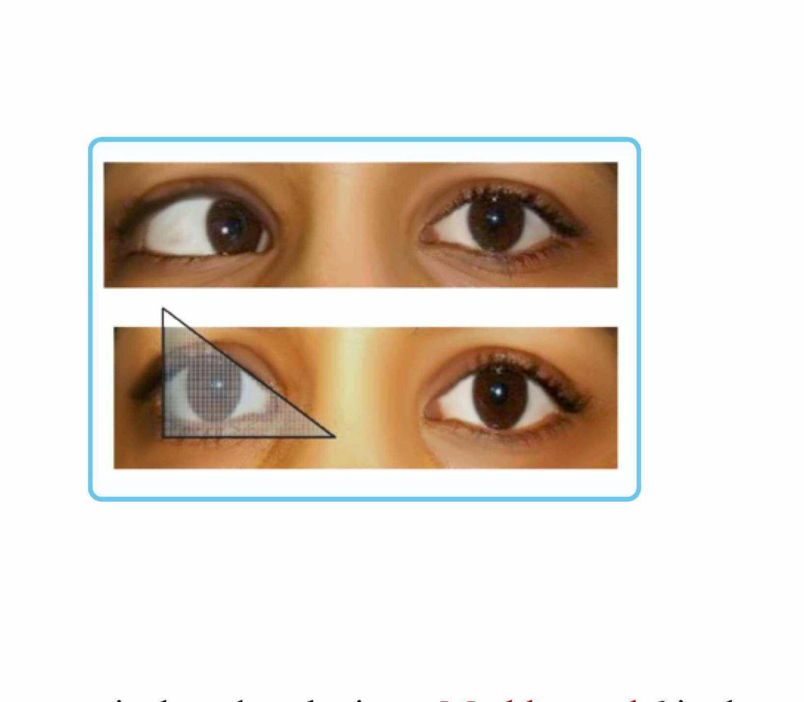

---

# 14. Maddox rod and Maddox wing

### Maddox rod

A red, striated lens dissociates the two eyes so that one eye perceives a line while the other perceives a point.

Uses:
- Detect **phoria**, particularly at distance fixation
- Assess horizontal/vertical alignment
- Assess cyclotropia
- Can be used as a macular function test in the provided material

### Double Maddox rod

Used to quantify **torsional deviation**.

### Maddox wing

Primarily used for near testing in the provided material.

It creates artificial diplopia:
- Arrows in the centre → orthophoria
- Arrows displaced to the right → exophoria / uncrossed diplopia
- Arrows displaced to the left → esophoria / crossed diplopia
- Vertical displacement → hyperphoria

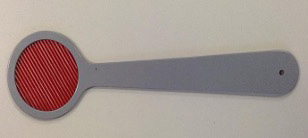

---

# 15. Hess chart

The **Hess chart** is used to chart ocular muscle action and identify:
- Underacting muscle
- Overacting muscle
- Pattern of incomitance
- Paralytic muscle involvement

It is based on dissociation of the two eyes using red-green filters and the haploscopic principle.

The normal charts of the two eyes are approximately similar in size and shape. With paralysis, the field/chart of the affected eye becomes **smaller**.

The Hess chart uses **concave grid lines**; an Amsler grid uses straight lines and is used for macular function.

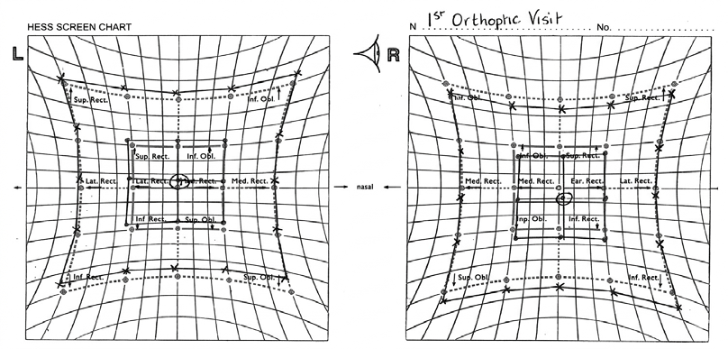

---

# 16. Worth four-dot test

Used to assess:
- Binocular single vision
- Fusion
- Suppression
- Diplopia
- Anomalous retinal correspondence

The test uses:
- **1 red dot**
- **2 green dots**
- **1 white dot**

The patient wears red-green glasses, with the **red filter over the right eye** in the provided setup.

### Responses

| Dots seen | Interpretation |
|---|---|
| **4 dots** | Normal fusion / binocular single vision |
| **2 red dots** | Left-eye suppression |
| **3 green dots** | Right-eye suppression |
| **5 dots** | Diplopia / no fusion |

---

# 17. Diplopia

Diplopia means double vision.

It may be classified as:
- **Horizontal**
- **Vertical**
- **Torsional**
- **Monocular**
- **Binocular**

The material identifies **paralytic squint** as the commonest cause of binocular diplopia.

### Relationship to deviation

- **Exotropia** → crossed diplopia
- **Esotropia** → uncrossed diplopia
- **Vertical squints** → crossed diplopia

---

# 18. Esotropia

**Esotropia** is inward deviation and is described as the commonest presentation of concomitant squint in the provided material.

It is broadly divided into:
1. **Accommodative esotropia**
2. **Non-accommodative esotropia / infantile esotropia**

## Accommodative esotropia

### Refractive accommodative esotropia

- Associated with **hypermetropia**.
- Uncorrected hypermetropia causes increased accommodative effort.
- Accommodation is accompanied by accommodative convergence.
- Excess convergence produces esotropia.
- Deviation is described as **greater at distance than near** in the revision material.
- **Treatment:** full correction of hypermetropia with convex spectacles.

### Non-refractive / high AC/A accommodative esotropia

- Hypermetropia is not the primary factor.
- Refractive error may be normal.
- The important abnormality is an **increased accommodative convergence/accommodation (AC/A) ratio**.
- Esotropia is **greater at near than distance**.
- Near correction with bifocals is used in the provided material.
- Miotic treatment is listed in the revision material: **pilocarpine** and, in another revision, **echothiophate**.

### Mixed accommodative esotropia

- Hypermetropia is present.
- AC/A ratio is also increased.

### Infantile esotropia

The material describes essential infantile esotropia as:
- Large-angle deviation
- Usually appearing around **4–6 months**
- Often **>15°**, approximately **≥30Δ**
- The two eyes are directed toward different objects.
- Persistent large-angle deviation produces suppression and amblyopia.
- Latent nystagmus may appear when one eye is covered.
- Dissociated vertical deviation (DVD) may occur.

**DVD:** when one eye is covered, it may drift upward and outward; the material describes this as a neurological deviation that does not obey Hering's law.

Persistent infantile esotropia requires active management rather than observation alone. Optical correction and amblyopia management are important, and early ocular alignment surgery is commonly used when a significant residual deviation persists, with timing individualized to the child and binocular-development goals.

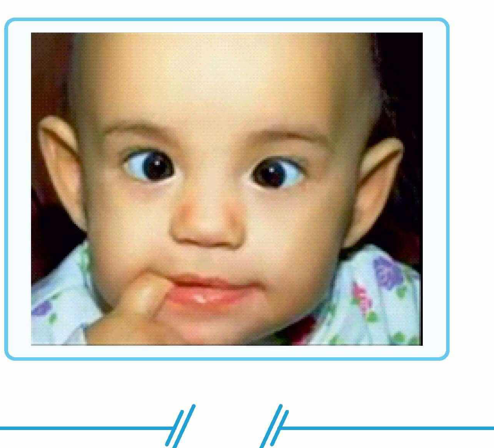

---

# 19. Exotropia

**Exotropia** is outward deviation.

The provided material mainly covers exotropia as:
- A manifest horizontal deviation
- The manifest counterpart of esotropia
- A cause of crossed diplopia
- A deviation measurable by Hirschberg, cover testing and prism methods

**Exophoria** is the latent outward deviation revealed after dissociation.

---

# 20. Vertical and torsional deviations

### Hypertropia
One eye is deviated upward.

### Hypotropia
One eye is deviated downward.

### Incyclotropia
Inward rotation/intorsion.

### Excyclotropia
Outward rotation/extorsion.

Torsional deviations may be difficult to appreciate clinically and are assessed with **double Maddox rods**.

---

# 21. Paralytic strabismus

Paralytic squint results from paralysis of an extraocular muscle, usually due to **CN III, CN IV or CN VI palsy**.

General features:
- Deviation is opposite to the action of the paralyzed muscle.
- The compensatory head posture is directed in the direction that helps compensate for the paralyzed muscle.
- Diplopia is greatest in the direction of action of the affected muscle.
- Deviation is incomitant.

---

## 21.1 Third cranial nerve palsy

CN III supplies:
- Medial rectus
- Superior rectus
- Inferior rectus
- Inferior oblique
- Levator palpebrae superioris
- Sphincter pupillae
- Ciliary muscle

### Clinical features

| Structure/function lost | Finding |
|---|---|
| LPS | **Ptosis** |
| SR + IO | **Hypotropia** |
| MR | **Exotropia** |
| Sphincter pupillae | **Mydriasis / impaired pupillary light reflex** |
| Ciliary muscle | **Loss of accommodation** |
| Unopposed LR + SO | **Down-and-out eye** |
| Diplopia | **Crossed diplopia** |

The material describes observation/"wait and watch" for CN III palsy because the nerve is covered by neurilemma and may regenerate.

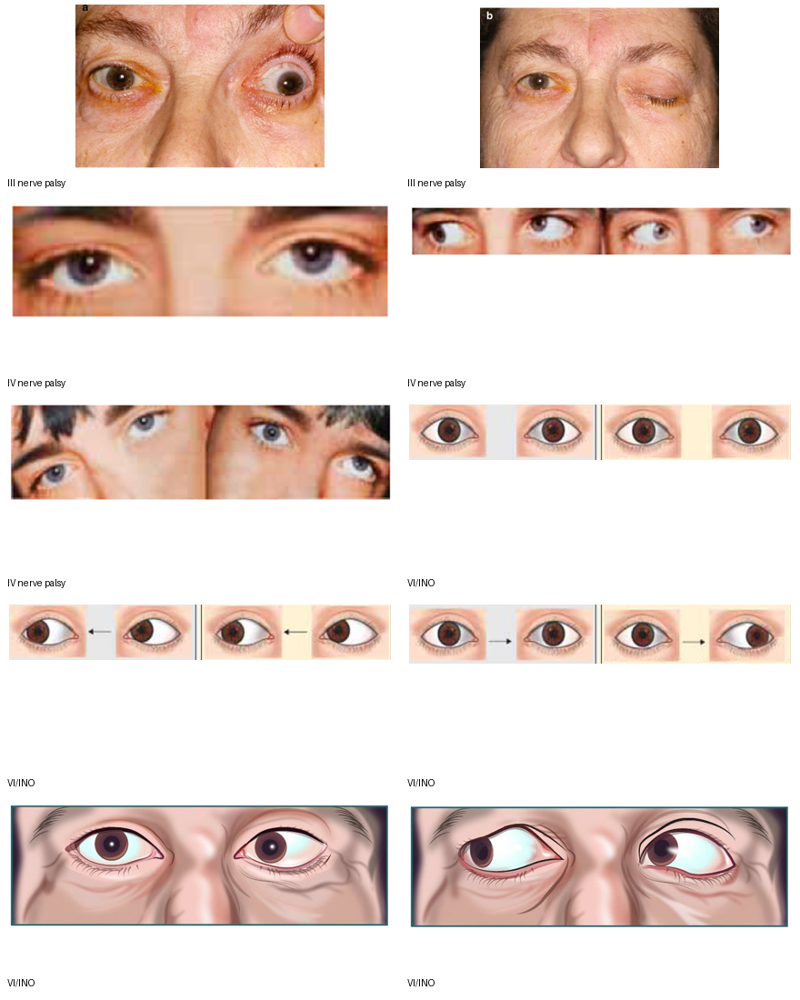

---

## 21.2 Fourth cranial nerve palsy

CN IV supplies the **superior oblique**.

### Findings

- Failure of intorsion
- **Excyclotropia**
- Loss of depression, especially in adduction
- **Hypertropia**
- Hypertropia increases in the appropriate diagnostic gaze and with the characteristic head tilt
- Vertical diplopia, especially on downgaze
- Compensatory **chin depression**
- Compensatory **head tilt toward the opposite side**

### Bielschowsky head-tilt test

The affected eye becomes more hypertropic when the head is tilted toward the side that increases the demand on the affected superior oblique; the provided clinical diagram demonstrates the characteristic change in hypertropia with gaze and head tilt.

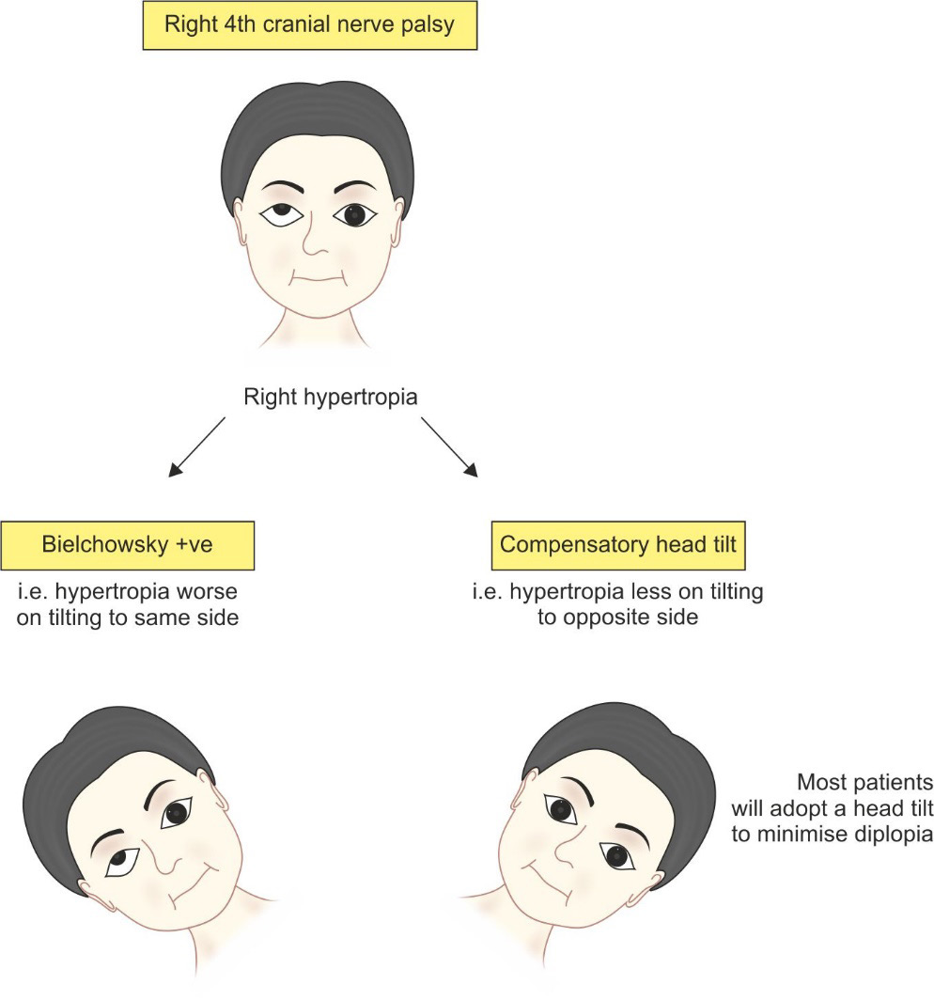

### Parks three-step test

Used to identify the paretic cyclovertical muscle in vertical incomitant strabismus. The material specifically identifies it as the confirmatory test for fourth-nerve palsy.

---

## 21.3 Sixth cranial nerve palsy

CN VI supplies the **lateral rectus**.

### Findings

- Failure of abduction
- **Esotropia** from unopposed medial rectus action
- **Horizontal diplopia**
- **Uncrossed diplopia**
- Diplopia is worse in the direction of the affected lateral rectus
- Compensatory **face turn toward the affected side**

CN VI palsy is described as the **most common ocular motor cranial nerve palsy**.

---

# 22. Internuclear ophthalmoplegia

Internuclear ophthalmoplegia (INO) results from a lesion of the **medial longitudinal fasciculus (MLF)**.

### Horizontal gaze pathway

- Contralateral frontal eye field initiates the movement.
- Ipsilateral PPRF acts as the horizontal gaze centre.
- The ipsilateral sixth nerve nucleus activates the lateral rectus.
- Signals travel through the MLF to the contralateral third nerve nucleus to activate the medial rectus.

### INO findings

- **Failure of adduction on the side of the MLF lesion**
- **Nystagmus of the abducting opposite eye**
- Commonly associated with **multiple sclerosis**, particularly bilateral INO.

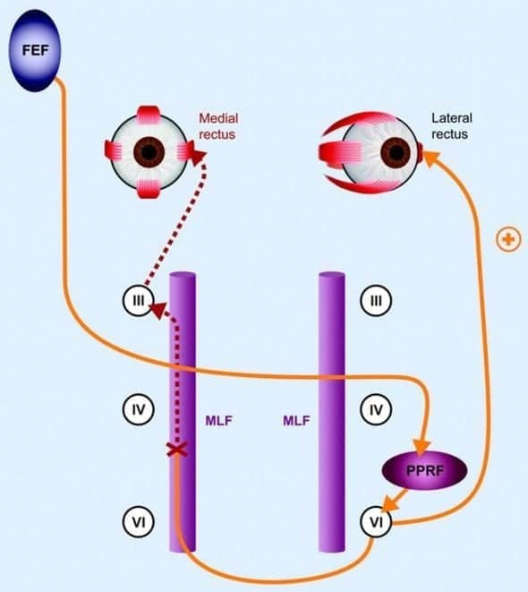

---

# 23. Restrictive strabismus

Restrictive squint is caused by mechanical limitation of ocular movement.

### Forced duction test

- **Positive FDT → restriction**
- **Negative FDT → paresis/paralysis**

Causes highlighted in the material include:
- Orbital fracture
- Thyroid eye disease
- Mechanical restriction

---

# 24. Duane retraction syndrome

Duane retraction syndrome is an incomitant ocular motility disorder characterized by:
- **Globe retraction on attempted adduction**
- Limitation of horizontal movement
- Narrowing/closure of the palpebral fissure during attempted adduction
- More common in females
- Left eye more commonly involved

The described mechanism is congenital dysinnervation with abnormal co-contraction of the medial and lateral recti.

### Types

| Type | Main movement deficit |
|---|---|
| **Type 1** | Failure of abduction |
| **Type 2** | Failure of adduction |
| **Type 3** | Failure of both abduction and adduction |

The characteristic globe retraction occurs particularly during attempted adduction.

---

# 25. Myasthenia gravis as a strabismus mimic

Myasthenia gravis can produce a variable ocular misalignment and mimic almost any pattern of incomitant strabismus.

### Key clinical features

- **Diplopia**
- **Bilateral ptosis**
- Ptosis worsens as the day progresses
- Variable extraocular muscle weakness
- **Cogan lid-twitch sign**

The presence of variable ptosis and/or variable deviation should raise suspicion for ocular myasthenia.

The revision material lists the **Tensilon/edrophonium test** and demonstrates improvement of ptosis after edrophonium. Edrophonium is a pharmacological diagnostic test with important cardiovascular adverse effects and is not the sole modern diagnostic approach; clinical assessment, antibody testing and electrophysiologic testing are used according to the clinical setting.

---

# 26. Differential diagnosis of incomitant strabismus

| Condition | Useful clue |
|---|---|
| **CN III palsy** | Ptosis, exotropia, hypotropia, ± mydriasis |
| **CN IV palsy** | Hypertropia, excyclotorsion, vertical diplopia, abnormal head tilt |
| **CN VI palsy** | Abduction deficit, esotropia, horizontal uncrossed diplopia |
| **INO** | Adduction deficit with abducting-eye nystagmus |
| **Restrictive orbital disease** | Mechanical limitation; FDT positive |
| **Duane syndrome** | Globe retraction with horizontal movement abnormality |
| **Myasthenia gravis** | Variable ptosis/diplopia and variable ocular motility |
| **Pseudostrabismus** | Apparent deviation without true ocular misalignment |

---

# 27. Horizontal gaze control

Horizontal gaze depends on a coordinated pathway involving:

1. **Frontal eye field**
2. **PPRF** — horizontal gaze centre
3. **Ipsilateral sixth nerve nucleus**
4. **Contralateral medial longitudinal fasciculus**
5. **Contralateral third nerve nucleus → medial rectus**

A lesion of the **PPRF** produces an ipsilateral horizontal gaze palsy.

A lesion of the **MLF** produces INO:
- Ipsilateral adduction deficit
- Contralateral abducting nystagmus

The vertical gaze centre is associated with the **riMLF / nucleus of Cajal in the midbrain**.

---

# 28. Management principles

Management is directed toward:
- Establishing clear retinal images
- Correcting refractive error
- Preventing/treating amblyopia
- Improving binocular function
- Reducing diplopia
- Restoring ocular alignment
- Correcting abnormal head posture
- Treating the underlying neurological, muscular or mechanical cause

### Treatment sequence emphasized in the material

1. **Optical correction**
2. **Occlusion therapy** when amblyopia is present
3. **Orthoptic exercises**
4. **Prisms**
5. **Surgical correction**

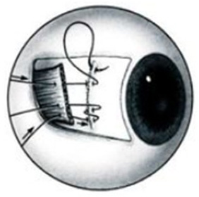

---

## 28.1 Optical treatment

### Accommodative esotropia
- Correct hypermetropia with **convex spectacles**.
- The goal is to reduce accommodative drive and therefore accommodative convergence.
- High AC/A or near-predominant residual esotropia may require a near addition/bifocal strategy.

### Prism
Prisms can neutralize a residual deviation and relieve diplopia in selected patients.

---

## 28.2 Occlusion

Occlusion is primarily used to:
- Prevent or treat amblyopia
- Reduce the visual disadvantage of the deviated/suppressed eye

The supplied revision regimen specifies patching the normal eye for a number of days corresponding to the child's age, followed by one day of patching the deviated eye.

---

## 28.3 Orthoptic exercises

Orthoptic treatment is included as a treatment step for improving binocular function and fusional control.

---

## 28.4 Surgical treatment

Strabismus surgery acts on the extraocular muscles by changing their effective mechanical action.

### Recession

A **weakening procedure**.

The muscle insertion is moved posteriorly, reducing the muscle's effective force.

### Resection

A **strengthening procedure**.

A segment of the muscle is shortened and the muscle is reattached, increasing its effective tension.

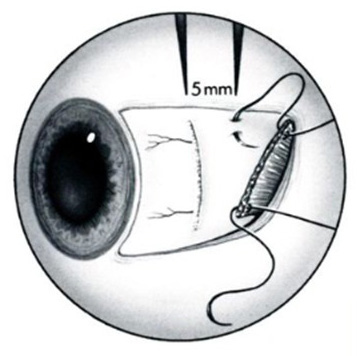

### Surgical timing

- Surgery is considered when significant ocular misalignment persists despite appropriate optical and amblyopia treatment or when alignment is necessary to restore/maintain binocular function.
- Persistent infantile esotropia is generally treated with **early alignment surgery** when significant deviation remains; early alignment supports development of binocular visual function.
- In acquired paralytic strabismus, the underlying cause and stability of the deviation influence timing.
- In CN VI palsy, persistent stable deviation is generally observed before definitive surgery when spontaneous recovery remains possible.
- In incomitant deviations, the surgical plan depends on the specific paretic/restrictive pattern rather than simply treating the primary-position angle.

---

# 29. Important examination patterns

### Esotropia

**Think:** inward deviation → hypermetropia/accommodation → convex correction.

### Exotropia

**Think:** outward deviation → crossed diplopia.

### CN III palsy

**Think:** **ptosis + down-and-out + exotropia + hypotropia ± dilated pupil + loss of accommodation**.

### CN IV palsy

**Think:** **SO palsy → hypertropia + excyclotorsion + defective depression in adduction + head tilt/chin depression**.

### CN VI palsy

**Think:** **LR palsy → abduction deficit → esotropia + uncrossed horizontal diplopia + face turn toward lesion**.

### Restrictive squint

**Think:** **mechanical restriction + positive FDT**.

### Duane syndrome

**Think:** **globe retraction on adduction + narrowed palpebral fissure + horizontal movement limitation**.

### Myasthenia

**Think:** **variable diplopia/ptosis + fatigability + Cogan lid twitch**.

---

# 30. High-yield numerical values

| Value | Significance |
|---|---|
| **9** | Directions of gaze examined |
| **1 mm** | Corneal reflex displacement ≈ 7° or ~14–15Δ |
| **15°** | Approximate deviation at pupillary border |
| **30°** | Approximate deviation at mid-iris |
| **45°** | Approximate deviation at limbus |
| **30Δ** | Approximate deviation corresponding to 15° |
| **60Δ** | Approximate deviation corresponding to 30° |
| **90Δ** | Approximate deviation corresponding to 45° |
| **4–6 months** | Typical onset range described for infantile esotropia |
| **>15° / ≈30Δ** | Large-angle infantile esotropia described in the material |
| **Grade 3 BSV** | Stereopsis |

---

# 31. Rapid revision table

| Condition | Deviation | Key examination clue | Key association |
|---|---|---|---|
| **Phoria** | Latent | Uncover/alternate cover testing | Fusion normally controls it |
| **Tropia** | Manifest | Cover test | Suppression/amblyopia may develop |
| **Comitant squint** | Constant angle | Similar deviation in different gazes | Commonly childhood |
| **Incomitant squint** | Variable angle | Different deviation in different gazes | Paralytic/restrictive |
| **Accommodative esotropia** | Eso | Hypermetropia or high AC/A | Correct refractive/accommodative drive |
| **Infantile esotropia** | Large-angle eso | Early childhood, suppression, latent nystagmus/DVD | Early alignment important |
| **Exotropia** | Exo | Outward deviation | Crossed diplopia |
| **CN III palsy** | Exo + hypo | Ptosis, down-and-out eye | ± mydriasis |
| **CN IV palsy** | Hyper | Bielschowsky/Parks pattern | SO palsy |
| **CN VI palsy** | Eso | Abduction deficit | Face turn toward lesion |
| **Restrictive squint** | Variable | Positive FDT | Orbital/mechanical disease |
| **Duane syndrome** | Variable horizontal | Globe retraction | Congenital dysinnervation |
| **INO** | Variable | Adduction deficit + abducting nystagmus | MLF lesion; MS common |
| **Myasthenia** | Variable | Fatigable ptosis/diplopia | Neuromuscular junction |

---

# 32. One-line test associations

- **Hirschberg** → corneal light reflex → estimates direction and angle.
- **Krimsky** → prism-reflection test.
- **Cover test** → tropia.
- **Uncover test** → phoria.
- **Alternate cover test** → dissociates fusion and reveals total deviation.
- **Prism cover test** → quantifies deviation in prism diopters.
- **Maddox rod** → phoria/dissociation; double Maddox → torsion.
- **Maddox wing** → mainly near phoria testing.
- **Hess chart** → underacting/overacting muscles and incomitance.
- **Lee's screen** → diplopia assessment.
- **Worth four dot** → fusion, suppression, diplopia, ARC.
- **Bagolini striated glasses** → sensory/binocular status.
- **RAF ruler** → fusional vergence.
- **Titmus fly** → Grade 3 BSV / stereopsis.
- **Synoptophore** → grades of binocular single vision.
- **Forced duction test** → mechanical restriction.
- **Double Maddox rod** → cyclodeviation.
- **Parks three-step / Bielschowsky head tilt** → superior oblique palsy.
