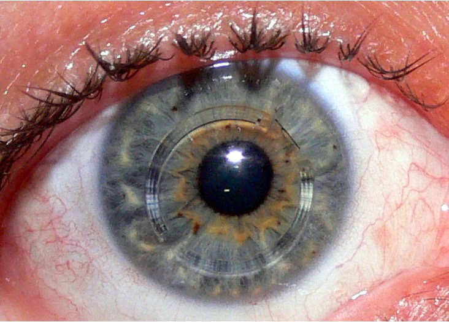

# Cornea and Sclera

## 1. Fibrous coat and general relationships

The **fibrous tunic** is the outer coat of the eyeball. It consists of the **cornea anteriorly** and the **sclera posteriorly**; their junction is the **limbus (corneoscleral junction)**.

- **Cornea:** transparent, convex, anterior **1/6** of the outer coat; it is the most anterior refractive surface.
- **Sclera:** opaque, white, posterior **5/6** of the outer coat; it provides the rigid external support of the globe and is covered externally by bulbar conjunctiva.
- **Limbus:** transition zone between cornea and sclera; it contains the **limbal epithelial stem-cell compartment**.
- The **angle of the anterior chamber** lies just internal to and posterior to the limbus and forms the principal aqueous drainage region.

*Anterior segment showing the cornea, sclera, bulbar conjunctiva, anterior chamber, posterior chamber, ciliary body, scleral venous sinus and adjacent structures.*

The cornea is transparent but can appear black on gross examination because light passes through it into the dark interior of the eye.

---

# 2. Cornea

## General anatomy, dimensions and optical importance

The cornea is a **transparent, avascular, convex** structure that forms the anterior refracting surface of the eye. It contributes more to the optical power of the eye than any other individual refracting surface because the largest refractive-index change occurs at the **air–cornea interface**.

| Feature | Important value / relationship |
|---|---|
| Position | Anterior 1/6 of fibrous tunic |
| Shape | Convex, converging |
| Central thickness | Approximately **540 μm (0.54 mm)**; commonly quoted range about **0.5–0.6 mm** |
| Optical power | Approximately **+43 to +44 D** |
| Refractive index | About **1.376** |
| Anterior corneal surface power | About **+48.8 D** |
| Posterior corneal surface power | About **−5.9 D** |
| Net corneal power | About **+43 to +44 D** |
| Clinical rule | **Greater corneal curvature → greater corneal power** |
| Vascularity | Avascular except at the peripheral limbal transition zone |

The normal cornea is thin enough to remain transparent but strong enough to preserve its curvature. Its transparency depends on the highly ordered arrangement of stromal collagen, controlled hydration of the stroma, an intact epithelium and functioning endothelium.

### Layer thicknesses

Approximate values illustrated in corneal histology are:

- Epithelium: **50–90 μm**
- Bowman’s layer: **8–14 μm**
- Stroma: approximately **490 μm**
- Dua’s layer: approximately **6.5–13.9 μm**
- Descemet’s membrane: approximately **10–12 μm**
- Endothelium: approximately **5 μm**

These are representative layer dimensions rather than additive measurements for every cornea.

*Corneal layers with approximate thicknesses and corresponding histology.*

---

## 3. Corneal layers — anterior to posterior

Modern anatomical description recognizes **six layers**:

1. Epithelium
2. Bowman’s layer
3. Stroma
4. Dua’s layer (pre-Descemet layer)
5. Descemet’s membrane
6. Endothelium

> **Diagram omitted:** Six-layer corneal schematic.
*Six-layer schematic showing the epithelium, Bowman’s layer, stroma, Dua’s layer, Descemet’s membrane and endothelium.*

### 3.1 Epithelium

The corneal epithelium is a **non-keratinized stratified squamous epithelium**.

Its functional organization is important:

- **Superficial cells:** squamous; possess microvilli that help maintain adhesion of the tear film and the smooth optical surface.
- **Basal cells:** columnar; undergo mitosis and provide epithelial regeneration.
- The epithelium can therefore recover from superficial injury much more effectively than the deeper corneal layers.

An isolated epithelial abrasion can heal by epithelial regeneration without leaving a stromal scar. Once deeper layers are involved, the risk of permanent opacity rises sharply.

### 3.2 Bowman’s layer

Bowman’s layer is an **acellular anterior limiting layer** immediately beneath the epithelium. It is often described as a false basement membrane rather than a true cellular basement membrane.

Key features:

- Dense, collagen-rich and acellular.
- Does **not regenerate** after significant injury.
- It is not a true cellular basement membrane; it is an acellular anterior limiting layer and is described as PAS-negative in the histologic characterization used for exam purposes.
- Injury heals by **scar formation**, producing persistent corneal opacity.
- It forms an important mechanical interface between the epithelium and stroma.

### 3.3 Stroma

The stroma accounts for most of corneal thickness and is the **thickest corneal layer**.

It consists predominantly of:

- **Type I collagen** as the major structural collagen.
- Glycosaminoglycans, particularly **keratan sulfate**.
- Keratocytes within an extracellular matrix.

The collagen is arranged into **lamellae with highly ordered orientation**. This regularity is crucial to transparency. Stromal hydration is tightly controlled because excessive hydration disrupts the normal optical organization of collagen and produces corneal haze/edema.

The stroma does not regenerate in the same way as the epithelium; significant stromal injury heals with fibrosis and can produce irregular astigmatism and permanent loss of optical quality.

### 3.4 Dua’s layer (pre-Descemet layer)

Dua’s layer is the strong, acellular layer immediately anterior to Descemet’s membrane and posterior to the deepest stromal lamellae.

- Approximately **10 μm** thick in the original anatomical description, with reported values in the roughly **6.5–14 μm** range.
- Composed predominantly of **type I collagen bundles** arranged in multiple directions.
- It is regarded as a **very strong biomechanical layer** of the cornea.
- Its recognition is particularly important in posterior corneal surgery, deep anterior lamellar keratoplasty and conditions involving deep stromal/Descemet interfaces.

### 3.5 Descemet’s membrane

Descemet’s membrane is the **basement membrane of the corneal endothelium** and is secreted by endothelial cells.

- It lies between Dua’s layer and the endothelium.
- It is strong and relatively resistant to injury.
- It can **regenerate**, unlike Bowman’s layer and the stromal lamellae.
- Peripherally, it terminates as **Schwalbe’s line** at the iridocorneal angle.

Descemet’s membrane is clinically important in **Haab’s striae** of congenital glaucoma and in endothelial keratoplasty.

### 3.6 Endothelium

The corneal endothelium is a **single cell layer** of predominantly **hexagonal cells** lining the posterior surface of the cornea.

It is the principal regulator of corneal deturgescence.

Its functions are:

- Maintains the cornea in a relatively **dehydrated state**.
- Uses the **Na⁺/K⁺-ATPase-dependent pump system** and other ion transport mechanisms to move fluid out of the stroma toward the aqueous.
- Acts as a selective barrier to fluid movement.
- Preserves **corneal transparency**.
- Participates in formation and maintenance of Descemet’s membrane.

Corneal endothelial cells have **very limited proliferative capacity in vivo**. With cell loss, surviving cells enlarge (**polymegathism**) and change shape (**pleomorphism/polymorphism**) to cover the remaining endothelial surface. Progressive cell loss eventually results in failure of stromal deturgescence, corneal edema and loss of transparency.

### Endothelial cell density

| Density / finding | Clinical significance |
|---|---|
| Newborn | Approximately **5000–6000 cells/mm²** |
| Normal adult | Approximately **2400–3000 cells/mm²** |
| Progressive loss below the adult range | Compensation by enlargement and alteration of cell shape |
| **<500 cells/mm²** | Critical exam threshold for severe endothelial failure and corneal decompensation |
| Endothelial failure | Stromal/epithelial edema → hazy cornea; advanced cases may develop bullous keratopathy |

Endothelial cell density and morphology are assessed by **specular microscopy**.

---

# 4. Corneal transparency, metabolism and nutrition

Corneal transparency is maintained by the interaction of several structural and physiological factors:

1. **Avascularity** of the cornea, limiting light scattering by blood vessels.
2. **Regular stromal collagen organization**, with lamellae arranged in a highly ordered manner.
3. **Controlled stromal hydration**, maintained largely by endothelial pump function.
4. An intact epithelial surface and tear film.
5. Absence of stromal fibrosis, significant edema or inflammatory infiltrate.

The cornea is **avascular except at the limbal region**.

Its metabolic requirements are supplied from multiple sources:

- **Oxygen:** chiefly from the atmosphere through the tear film when the eye is open.
- **Nutrients:** mainly from the aqueous humor across the posterior surface; peripheral contributions arise from the limbal circulation.
- The endothelial barrier and pump system continuously regulate water movement and are essential for maintaining optical clarity.

Severe endothelial failure produces:

**Endothelial cell loss → impaired pump function → stromal hydration → corneal edema → epithelial edema/bullae → hazy, optically degraded cornea.**

---

# 5. Corneal sensory innervation and blink reflex

The cornea is one of the most densely innervated tissues in the body.

### Sensory supply

**Trigeminal nerve (CN V) → ophthalmic division (V1) → nasociliary nerve → corneal sensory nerves.**

The nerves enter the cornea from the limbal/peripheral region and form a dense subepithelial plexus before terminating in the superficial corneal layers.

### Corneal reflex

Touching the cornea with a fine cotton wisp produces:

**Afferent:** CN V (trigeminal) → brainstem

**Efferent:** CN VII (facial) → orbicularis oculi → **blink**

*The anterior segment relationship of the cornea to the limbus, sclera and ciliary body.*

Corneal anesthesia can abolish the normal protective blink response. A classic cause is **herpetic corneal disease**. Loss of corneal sensation is also important in neurotrophic keratopathy.

Pain patterns help localize pathology:

- **Herpetic epithelial keratitis:** reduced corneal sensation.
- **Acanthamoeba keratitis:** often normal sensation but **severe pain out of proportion to the visible lesion**, reflecting intense corneal nerve inflammation.

---

# 6. Corneoscleral junction — limbus

The **limbus** is the transition zone where transparent cornea becomes opaque sclera. It is a biologically active region rather than a simple anatomical boundary.

### Limbal stem cells

The limbal epithelium contains the **corneal epithelial stem-cell compartment**, classically associated with the **palisades of Vogt**.

Markers highlighted in the study material include:

- **ABCG2:** specific limbal stem-cell marker
- **CD34:** commonly used broader marker in the described context

Limbal stem-cell failure allows conjunctival epithelium to migrate onto the corneal surface. A clinically important example is **pterygium**, in which conjunctival tissue crosses the limbus and grows over cornea; this can induce astigmatism and impair the visual axis when advanced.

### Other limbal relationships

- The cornea is continuous with the **sclera** at the limbus.
- The **conjunctiva normally covers sclera**, not cornea.
- The **trabecular meshwork** and aqueous drainage apparatus occupy the corneoscleral angle region.
- **Schwalbe’s line** marks the peripheral termination of Descemet’s membrane and is the most anterior structure visible in a standard gonioscopic sequence.

### Limbal lesions

**Limbal dermoid** is a benign congenital choristomatous lesion that may contain mature tissues such as **hair follicles, cilia, bone and other ectodermal/mesodermal elements**.

---

# 7. Iridocorneal angle and its scleral relationships

The angle of the anterior chamber is the space between the peripheral cornea and iris root and is the major conventional pathway for aqueous humor drainage.

From **deep/posterior to superficial/anterior** on gonioscopy:

1. **Iris root**
2. **Ciliary body band**
3. **Scleral spur**
4. **Trabecular meshwork**
5. **Schwalbe’s line**

**Open angle:** all structures can be visualized.

**Angle closure:** the peripheral iris comes into apposition with the trabecular/angle region and deeper structures become hidden; typically only Schwalbe’s line with variable trabecular meshwork remains visible.

The **scleral spur** is the major scleral landmark of the angle and is intimately related to the trabecular meshwork and ciliary muscle. The **scleral venous sinus (Schlemm’s canal)** lies within the corneoscleral outflow region.

The relationship is worth remembering as a continuous anatomical sequence:

**Cornea → limbus → Schwalbe’s line → trabecular meshwork → scleral spur → ciliary body/iris root.**

---

# 8. Sclera

The sclera is the **opaque, white posterior 5/6 of the fibrous tunic**. It forms the principal load-bearing wall of the globe, stabilizes its shape and provides attachment for the extraocular musculature.

## Scleral architecture

The sclera is collagen-rich connective tissue. Its microscopic organization can be described in concentric layers:

1. **Episclera** — superficial vascular connective tissue adjacent to the conjunctiva/Tenon’s tissues.
2. **Scleral stroma proper** — the major dense collagenous layer; collagen bundles are arranged in interlacing and lamellar patterns.
3. **Lamina fusca** — the deep pigmented transition zone adjoining the choroid/suprachoroidal tissue.

The dominant structural collagens are **type I and type III**, with smaller contributions from types V and VI. Proteoglycans and glycosaminoglycans occupy the interfibrillar matrix and influence hydration and biomechanical behavior.

The sclera is essentially **avascular** as a tissue, although it is traversed and supplied by vascular plexuses in the episclera and adjacent tissues. It receives metabolic support from the **choroidal circulation and episcleral/Tenon vascular plexuses**.

## Scleral thickness

Scleral thickness varies substantially by region rather than remaining uniform.

Typical adult measurements are approximately:

| Region | Approximate thickness |
|---|---:|
| Corneoscleral limbus | ~0.5 mm |
| Equator | ~0.4–0.5 mm |
| Posterior pole / near optic nerve | ~0.9–1.0 mm |
| Extraocular muscle insertion region | may be as thin as ~0.3 mm |

The sclera becomes thinner in **axially elongated eyes**, particularly posterior to the equator. This is a major anatomical component of pathologic myopia.

## Attachments and relationships

- Tendons of the **extraocular muscles** insert into the scleral coat.
- Posteriorly, the sclera forms the wall around the **optic nerve head and scleral canal**.
- The **lamina cribrosa** is incorporated into the posterior scleral canal and transmits retinal ganglion-cell axons into the optic nerve.
- At the anterior limbus, the sclera contributes to the structural support of the **trabecular outflow apparatus** and the scleral spur.
- The ciliary muscle has a major mechanical relationship with the scleral spur and therefore with the trabecular meshwork.

## Blood supply

The scleral circulation is derived principally from the ciliary vascular system:

- **Short posterior ciliary arteries:** supply posterior scleral/choroidal regions and adjacent ocular tissues.
- **Long posterior ciliary arteries:** contribute to the iris and ciliary body and give rise to the **anterior ciliary arterial circulation**.
- **Anterior ciliary arteries:** contribute substantially to anterior scleral/episcleral, conjunctival and anterior uveal blood supply.

The sclera therefore remains relatively hypovascular despite being closely associated with richly vascularized episcleral and uveal tissues.

## Innervation

Scleral sensory innervation is carried predominantly by the **ciliary nerves**, especially the long posterior ciliary nerves, with contributions from the short ciliary pathways. These nerves carry sensory and autonomic fibers and enter the globe through the posterior scleral region.

---

# 9. Clinical anatomy of the sclera

## Episcleritis versus scleritis

| Feature | Episcleritis | Scleritis |
|---|---|---|
| Main vascular layer | Superficial episcleral vessels | Deep scleral vessels |
| Colour | Reddish | Bluish/violaceous |
| Pain | Mild/minimal | Deep-seated, severe |
| Phenylephrine | Vessels blanch | Redness persists |
| Typical association | Often idiopathic | Frequently associated with systemic inflammatory disease, especially rheumatoid arthritis |

**Scleromalacia perforans** is a severe form of anterior necrotizing scleritis that can occur **without obvious redness or pain** and can progress to scleral thinning and perforation. It has a strong association with **rheumatoid arthritis**.

> **Diagram omitted:** Scleral inflammatory disease.
*Clinical appearance of severe scleral inflammation with deep violaceous/gray discoloration.*

## Scleral thinning and posterior staphyloma

In **pathological myopia**, progressive axial elongation stretches the fibrous coat:

**Globe elongation → scleral thinning → posterior outpouching (posterior staphyloma).**

Associated posterior segment changes include:

- Temporal myopic crescent from peripapillary atrophy.
- Tigroid/tessellated fundus from chorioretinal stretching and atrophy.
- Lacquer cracks from breaks in Bruch’s membrane.
- Choroidal neovascularization through lacquer cracks.
- Fuchs/Foster-Fuchs spot at the fovea.
- Increased risk of peripheral retinal holes and rhegmatogenous retinal detachment.

The fibrous coat itself is therefore a major determinant of globe shape and axial biomechanics.

### Scleral buckle

A **scleral buckle** is a silicone band placed around the sclera in rhegmatogenous retinal detachment surgery. It indents the globe inward and mechanically supports the retinal break region.

---

# 10. Important corneal findings at the anterior chamber angle

The cornea is closely related to the aqueous drainage apparatus, and several clinically important entities involve the posterior cornea or the corneoscleral angle.

### Congenital glaucoma

Raised intraocular pressure in the developing eye can stretch the globe and cornea. Important corneal findings include:

- **Corneal edema/haze:** an important early sign.
- **Haab’s striae:** characteristic **horizontal breaks/tears in Descemet’s membrane** produced by stretching.
- Progressive enlargement of the globe produces **buphthalmos** and corneal enlargement.

The corneal changes reflect the mechanical relationship between intraocular pressure, Descemet’s membrane, sclera and the growing ocular coat.

### Keratic precipitates

Keratic precipitates are aggregates of inflammatory cells and proteins deposited on the **corneal endothelium**, usually most evident inferiorly.

- **Mutton-fat keratic precipitates:** classically associated with granulomatous uveitis.
- **Fuchs heterochromic uveitis:** typically produces fine stellate, often **diffuse/pan-corneal keratic precipitates**, with little or no posterior synechiae.

---

# 11. Corneal investigations and anatomical measurements

## Pachymetry

**Pachymetry** measures corneal thickness.

- Normal central thickness: approximately **540 μm**.
- Published exam range: approximately **0.5–0.6 mm**.
- Thickness is clinically important when interpreting intraocular pressure measurements and assessing ectatic or edematous corneas.

## Keratometry

**Keratometry** measures corneal curvature and is especially useful for assessing the anterior corneal curvature and astigmatic meridians.

- Corneal curvature is directly related to corneal refractive power.
- In astigmatism, the principal meridians have unequal curvature.
- **Keratoconus:** curvature becomes steeper while pachymetry shows thinning.

## Keratoscopy / Placido disc

Placido-disc examination evaluates corneal surface regularity by observing reflected rings.

## Corneal topography

Topography provides a more comprehensive map of **corneal curvature and surface shape**, and modern systems can combine curvature with thickness data. It is the key investigation for **keratoconus**.

## Specular microscopy

Specular microscopy evaluates the corneal endothelium, providing:

- Cell density
- Cell size variation
- Cell-shape variation
- Hexagonality

It is useful when judging the endothelial reserve of a diseased or donor cornea.

---

# 12. Corneal staining

| Dye | What it highlights | Important use |
|---|---|---|
| **Fluorescein** | Loss of epithelial continuity | Corneal abrasion/ulcer base; Seidel test; Goldmann applanation; tear-film breakup assessment |
| **Rose Bengal** | Devitalized/necrotic epithelium and surface tissue | Ocular-surface disease; ulcer margins; less comfortable because it may sting |
| **Lissamine green** | Damaged/dead surface cells on conjunctiva and cornea | Dry-eye assessment; better tolerated than Rose Bengal |

Fluorescein is applied as an **orange dye** and appears **green under cobalt-blue illumination** where epithelial defects permit dye accumulation.

### Seidel test

A positive **Seidel test** demonstrates leakage of aqueous through a corneal or surgical wound: fluorescein becomes diluted and streams away from the leak.

---

# 13. Corneal opacity

Corneal opacity becomes progressively denser as deeper and larger portions of the cornea are affected.

| Type | Depth / appearance | Typical clinical effect |
|---|---|---|
| **Nebula** | Very superficial, classically **<1/3 thickness** | Iris details remain visible; can produce glare, discomfort and irregular astigmatism |
| **Macula** | Intermediate, approximately **1/3–2/3 thickness** | Iris details become indistinct or partly obscured |
| **Leucoma** | Dense, deep opacity, classically **>2/3/full-thickness** | Iris/pupil details cannot be seen; greatest direct loss of transparency and vision |

A dense stromal scar is especially damaging when it involves the visual axis. Scar tissue can also induce **irregular astigmatism** even when some light continues to pass through.

---

# 14. Corneal ulcers and keratitis

A **corneal ulcer** represents epithelial loss associated with inflammatory infiltration and necrosis of the underlying tissue. Because the cornea is highly innervated and structurally thin, progression can be rapid and perforation can threaten the integrity of the globe.

## Bacterial versus fungal ulcer

| Feature | Bacterial ulcer | Fungal ulcer |
|---|---|---|
| Typical morphology | Solitary ulcer | Main ulcer with **satellite lesions** |
| Margin | Usually well-defined | **Feathery** |
| Hypopyon | Often mobile and sterile | Often **immobile and unsterile** |
| Common association | Contact lenses/trauma | Vegetative trauma |
| Common organism highlighted in the notes | **Pseudomonas** in contact-lens-associated disease; **Pneumococcus** is an important cause in India | **Aspergillus** |
| Clinical course | Can perforate and produce anterior staphyloma | Hyphae may support the tissue architecture despite marked stromal destruction |

### Bacterial ulcer — key anatomy and management principles

- Obtain material by **scraping the ulcer base**.
- Send for **Gram stain and culture**.
- Start appropriate fortified topical antibiotics.
- **Atropine/cycloplegia** can reduce pain from ciliary spasm.
- Corticosteroids should not be started before appropriate infection assessment and antimicrobial treatment.

Important organisms able to penetrate an apparently intact corneal epithelium include:

- *Neisseria gonorrhoeae*
- *Neisseria meningitidis*
- *Haemophilus* species
- *Listeria*
- *Corynebacterium diphtheriae*
- *Shigella*

**Nocardia** may produce a characteristic **wreath/pin-head pattern** ulcer, particularly after traumatic inoculation.

Severe corneal stromal destruction can produce a sloughing **pseudocornea**; perforation may be followed by tissue prolapse, iris adherence to the corneal scar and **anterior staphyloma**.

### Fungal corneal ulcer

Typical features:

- History of **vegetative/plant trauma**
- Dry-looking ulcer
- **Feathery margins**
- **Satellite lesions**
- **Wessely immune ring**
- Thick, relatively immobile, often unsterile hypopyon

A commonly emphasized treatment is **5% natamycin** for filamentous fungal keratitis.

### Herpetic keratitis

**Herpes simplex virus** classically causes:

- Superficial punctate lesions progressing to a **dendritic ulcer**.
- Further untreated progression can produce a **geographic ulcer**.
- Corneal sensation is typically reduced.
- **Topical corticosteroids are contraindicated in active epithelial herpetic keratitis** because they can worsen epithelial viral disease.

Other herpetic corneal syndromes include:

- **Necrotizing stromal keratitis**
- **Disciform keratitis / endotheliitis**
- **Metaherpetic or neurotrophic keratitis** from trigeminal dysfunction → corneal anesthesia → persistent epithelial defect/ulcer

**Herpes zoster ophthalmicus** may involve the cornea and other ocular tissues. **Hutchinson’s sign**—vesicular disease at the tip of the nose—signals a higher risk of ocular involvement.

### Neuroparalytic/exposure keratitis

Facial nerve (CN VII) palsy can reduce orbicularis oculi function, impair blinking and produce **lagophthalmos**. The resulting exposure can cause **exposure keratitis** and a neuroparalytic ulcer pattern. This mechanism is distinct from the trigeminal sensory deficit of neurotrophic keratitis.

### Acanthamoeba keratitis

Strongly associated with:

- **Contact-lens wear**
- Exposure to **contaminated/dirty water**, including swimming or cleaning lenses with tap water

Typical findings:

- **Severe pain out of proportion to the visible lesion**
- **Radial keratoneuritis**
- **Ring infiltrate/abscess**
- Pseudodendritic epithelial lesions

Culture is performed on **non-nutrient agar enriched with *E. coli***.

Commonly emphasized treatment agents include:

- **Polyhexamethylene biguanide (PHMB)**
- **Chlorhexidine**
- **Propamidine** in appropriate settings

---

# 15. Interstitial keratitis and other stromal inflammatory disease

**Interstitial keratitis** involves the **corneal stroma** with relative sparing of the epithelium and endothelium early in the process.

Important associations in the study material include:

- Syphilis
- Tuberculosis
- Leprosy
- Sarcoidosis

**Cogan syndrome** classically combines **interstitial keratitis with sensorineural deafness**.

A **salmon patch** refers to stromal hemorrhage and is described in association with syphilitic interstitial keratitis.

---

# 16. Keratoconus

Keratoconus is an **ectatic disorder of the cornea** in which a normally more regular corneal contour becomes increasingly **conical**, producing irregular refractive power.

### Structural consequences

**Corneal thinning + anterior protrusion → increased/irregular curvature → irregular myopic astigmatism → progressive reduction in visual quality.**

### Investigations

- **Topography:** investigation of choice; maps curvature and surface shape and can assess associated thickness abnormalities.
- **Keratometry:** increased/steeper curvature.
- **Pachymetry:** decreased thickness, particularly in the ectatic region.
- Retinoscopy may show a **scissoring/yawning reflex**.
- Direct ophthalmoscopy may show an **oil-droplet reflex**.

### Signs

- **Vogt’s striae:** vertical stress lines produced by corneal stretching.
- **Munson’s sign:** V-shaped deformation of the lower lid on downgaze.
- **Rizzuti’s sign:** bright/arrowhead-shaped light at the nasal limbus when the cornea is illuminated from the opposite side.
- **Fleischer’s ring:** iron deposition near the base of the cone, predominantly associated with the epithelial region.
- Prominent corneal nerves can become visible because of stromal thinning.

> **Diagram omitted:** Keratoconus and characteristic clinical signs.
*Corneal ectasia with representative keratoconus signs, including Munson’s sign and Fleischer’s ring.*

### Management anatomy

- **Rigid gas-permeable contact lenses:** improve the effective anterior optical surface by providing a smoother refractive interface.
- **Corneal collagen cross-linking (CXL/C3R):** riboflavin with UVA increases collagen cross-linking and is used to **stabilize progressive disease**.
- **Intracorneal ring segments (INTACS):** PMMA segments placed within the stroma can flatten the cornea.
- **Keratoplasty:** used for advanced disease when contact lenses and/or stabilization are insufficient.

*Intracorneal ring segments used to modify corneal shape in ectatic disease.*

---

# 17. Corneal degenerations

## Arcus senilis

Arcus senilis is a **peripheral corneal degeneration caused by lipid deposition**.

- Appears as a peripheral whitish/gray ring.
- Often begins superiorly and inferiorly before becoming circumferential.
- A clear interval between the arcus and limbus is the **lucid interval of Vogt**.
- The opacity remains peripheral and typically does not directly obscure the visual axis.

## Band-shaped keratopathy

This is a **horizontal band of calcium deposition** in the exposed interpalpebral cornea.

- Usually most prominent in the **subepithelial/Bowman region** and may extend into the anterior stroma.
- Can be idiopathic or associated with chronic ocular inflammation, phthisis bulbi and systemic calcium disorders.
- Important associations include chronic uveitis in children, juvenile rheumatoid arthritis, hypercalcemia and sarcoidosis.
- **EDTA chelation** is used to remove the calcium clinically.

> **Diagram omitted:** Band-shaped keratopathy.
*Interpalpebral corneal calcium deposition in band-shaped keratopathy.*

> **Diagram omitted:** Corneal degenerations and opacity patterns.
*Representative arcus/band-shaped degeneration and schematic progression of corneal opacity.*

## Kayser–Fleischer ring

- **Golden-brown peripheral corneal ring** from copper deposition.
- Located in/around **Descemet’s membrane** near the limbus.
- Strongly associated with **Wilson disease**.
- Similar copper deposition can occur in **chalcosis**.
- It is not absolutely pathognomonic for Wilson disease in isolation.

---

# 18. Corneal dystrophies

Corneal dystrophies are classically **hereditary, bilateral, non-inflammatory, progressive corneal opacifying disorders**. They are organized according to the principal corneal layer involved.

## Epithelial dystrophies

Important examples include:

- **Cogan epithelial basement membrane (map-dot-fingerprint) dystrophy** — the commonest epithelial dystrophy emphasized in the material; recurrent corneal erosions are characteristic.
- **Meesmann epithelial dystrophy** — associated with keratin gene mutations.
- **Lisch epithelial dystrophy** — described as autosomal dominant, with occasional X-linked-dominant patterns in the study material.

Other epithelial/anterior limiting layer disorders include **Reis–Bücklers** and **Thiel–Behnke** dystrophies.

## Stromal dystrophies

| Dystrophy | Principal deposit | Stain / feature |
|---|---|---|
| **Macular** | Mucopolysaccharides | **Alcian blue**; autosomal recessive; least common stromal dystrophy |
| **Granular** | Hyaline | **Masson trichrome** |
| **Lattice** | Amyloid | **Congo red**; classically the commonest stromal dystrophy |

Lattice dystrophy should be separated into subtypes: **type 1** is predominantly a localized corneal amyloidosis, whereas **type 2 (Meretoja type)** is associated with systemic amyloidosis.

> **Diagram omitted:** Stromal corneal dystrophies.
*Clinical appearances of macular, granular and lattice stromal dystrophies.*

**Schnyder central crystalline dystrophy** is associated with abnormal corneal lipid metabolism.

## Endothelial dystrophies

### Fuchs endothelial dystrophy

Fuchs dystrophy is a major endothelial disorder characterized by progressive endothelial cell dysfunction and **cornea guttata**.

**Endothelial cell loss → reduced pump function → stromal hydration → corneal edema → progressive loss of transparency → bullous keratopathy.**

**Cornea guttata** consists of wart-like excrescences/irregularities on the posterior corneal surface associated with Descemet’s membrane/endothelial disease.

Other endothelial disorders listed include **posterior polymorphous corneal dystrophy** and **congenital hereditary endothelial dystrophy**.

---

# 19. Corneal transplantation and surgical anatomy

The cornea is commonly transplanted from a **cadaveric donor**. Corneal tissue can be retrieved soon after death and preserved before transplantation.

### Important graft principles

- Donor tissue is selected for adequate endothelial quality because endothelial failure is a major cause of graft dysfunction.
- **Human leukocyte antigen matching is not required.**
- **ABO blood-group matching is not required.**
- **10-0 monofilament nylon** is used for penetrating keratoplasty suturing.
- A common major postoperative issue is **astigmatism**, related to graft geometry and the tension/placement of multiple sutures.
- Donor graft diameter is commonly around **7.5 mm** in the surgical material.
- Adequate donor endothelial density is important; a threshold of roughly **1500–2000 cells/mm² or higher** is commonly used for donor assessment depending on indication and preservation conditions.
- The **cornea is the most commonly transplanted human tissue/organ** in routine transplantation practice.

### Rejection patterns

- **Epithelial rejection:** classically described by **Krachmer spots** in the study material.
- **Endothelial rejection:** **Khodadoust line**.
- Other rejection-associated findings include corneal edema, epithelial inflammatory infiltrates and vascularization.
- **Corticosteroids** are used in management of graft rejection under appropriate specialist supervision.

### Corneal preservation

Approximate preservation options emphasized in the study material include:

| Preservation method | Typical duration |
|---|---:|
| Moist chamber | **24–48 hours** |
| McCarey–Kaufman medium | **2–4 days** |
| Modern organ-culture media | **weeks to months**, depending on system |
| Cryopreservation | Very prolonged storage at approximately **−80°C** in specialized settings |

A donor cornea is ideally harvested promptly after death; a commonly quoted practical window in tropical settings is **within 6 hours**. Endothelial cell adequacy is critical before graft use.

### Types of keratoplasty

| Procedure | Tissue transplanted | Main anatomical concept |
|---|---|---|
| **Penetrating keratoplasty (PK)** | Full-thickness cornea | Entire corneal thickness is replaced |
| **DALK** | Anterior cornea | Host endothelium is retained; reduces endothelial-rejection risk |
| **DSEK / DSAEK** | Endothelium + posterior stroma | Posterior lamellar endothelial graft with a small amount of stroma |
| **DMEK** | Descemet’s membrane + endothelium | Very thin posterior graft; no stromal graft is transferred |

Earlier lamellar terminology also includes superficial anterior lamellar keratoplasty and deep endothelial/lamellar techniques.

> **Diagram omitted:** Keratoplasty tissue planes.
*Comparison of penetrating and lamellar corneal graft planes.*

### Corneal surgical entry points

The cornea and sclera have distinct surgical roles:

- **Conventional ECCE:** limbal incision, approximately **8–10 mm**.
- **SICS:** **sclero-corneal tunnel**, approximately **6 mm**.
- **Phacoemulsification:** clear-corneal incision, commonly **2.2–3.2 mm**.

This reflects the different mechanical properties of the corneal and scleral parts of the fibrous coat.

---

# 20. Other clinically important corneal anatomy

## Trachomatous corneal disease

Chronic trachomatous disease can damage the cornea through **pannus, recurrent inflammation and scarring**. Important limbal findings include **Herbert’s pits**, which represent healed limbal follicles. The major long-term visual threat is corneal scarring and vascularization.

## Vernal keratoconjunctivitis with corneal involvement

Severe vernal disease may produce a **sterile shield ulcer** of the cornea. The limbal manifestation is the **Horner–Trantas spot**, an eosinophilic collection at the limbus; upper-limbal gelatinous thickening may also occur.

## Corneal chemical injury

Chemical injury may cause profound damage to the epithelium, stroma and limbus.

- **Alkali injuries** generally penetrate more deeply than acid injuries because of saponification and tissue penetration.
- **Immediate copious irrigation** is the first intervention; irrigation should begin before definitive treatment.
- Prognosis is strongly influenced by **corneal clarity and limbal ischemia**; a markedly ischemic/white limbus indicates severe limbal injury and poor regenerative potential.

## Corneal foreign body

A metallic **iron foreign body** is a common corneal foreign body. Removal may be performed under slit-lamp magnification after topical anesthesia, using a suitable fine instrument/needle.

## Vitamin A deficiency: ocular-surface progression

Vitamin A deficiency produces a progressive ocular-surface disorder that can culminate in corneal destruction:

**Conjunctival xerosis → Bitot’s spots → corneal xerosis → keratomalacia → corneal scar.**

- **Keratomalacia:** corneal softening from severe nutritional deficiency.
- Extensive corneal melting can leave a dense permanent scar and severe visual loss.

## Pterygium and corneal optics

A pterygium is a triangular conjunctival growth that crosses the limbus onto the cornea. Besides the surface lesion itself, it can alter corneal curvature and produce **astigmatism**, becoming visually significant when it approaches or crosses the pupillary axis.

---

# 21. Cornea in refractive surgery and biomechanics

The air–cornea refractive interface makes the cornea the dominant optical element targeted by refractive surgery.

### Cornea-based refractive procedures

- **Radial keratotomy:** peripheral radial corneal incisions flatten the central cornea and reduce its converging power.
- **PRK:** excimer-laser photoablation removes anterior stromal tissue after epithelial removal.
- **LASIK:** an anterior corneal flap is created and stromal tissue is photoablated beneath it.
- **SMILE:** a stromal lenticule is created and extracted through a small corneal incision.
- **INTACS:** intracorneal stromal ring segments alter corneal curvature.

Corneal anatomy therefore directly determines both **optical power** and the biomechanical response to refractive procedures.

---

# 22. High-yield anatomical relationships

| Relationship | Exam point |
|---|---|
| Fibrous tunic | Cornea anterior 1/6 + sclera posterior 5/6 |
| Junction of cornea and sclera | **Limbus** |
| Limbal epithelial stem-cell compartment | **Palisades of Vogt** |
| Schwalbe’s line | Peripheral termination of **Descemet’s membrane** |
| Gonioscopy order | Iris root → ciliary body band → scleral spur → trabecular meshwork → Schwalbe’s line |
| Strongest corneal layer | **Dua’s layer** |
| Thickest corneal layer | **Stroma** |
| Most metabolically active corneal layer | **Endothelium** |
| Corneal layer that regenerates rapidly | **Epithelium** |
| Corneal layer that does not regenerate | **Bowman’s layer** |
| Corneal endothelial regeneration | Very limited; cell loss is compensated mainly by enlargement/migration of remaining cells |
| Main endothelial pump | **Na⁺/K⁺-ATPase-dependent fluid transport** |
| Main sensory nerve of cornea | **Nasociliary branch of V1** |
| Corneal reflex efferent limb | **CN VII → orbicularis oculi** |
| Normal adult endothelial density | ~**2400–3000 cells/mm²** |
| Critical low endothelial density in exam-oriented teaching | **<500 cells/mm²** |
| Normal central corneal thickness | ~**540 μm** |
| Corneal refractive power | **+43 to +44 D** |
| Main stromal collagen | **Type I** |
| Main stromal GAG highlighted | **Keratan sulfate** |
| Major source of corneal oxygen | **Atmosphere via tear film** |
| Main conventional aqueous outflow region | **Trabecular meshwork / scleral spur / Schlemm canal complex** |
| Sclera | Opaque posterior 5/6, collagen-rich support coat |
| Sclera thickest region | **Posterior pole / near optic nerve** |
| Sclera thinnest normal broad region | **Equatorial region**; very thin at some extraocular muscle insertions |
| Posterior scleral complication of pathological myopia | **Posterior staphyloma** |
| Classic severe painless necrotizing scleral disease in RA | **Scleromalacia perforans** |

---

# 23. Rapid clinical pattern recognition

### Loss of corneal transparency

**Endothelial dysfunction:** edema → hazy cornea → bullous change.

**Stromal scar:** persistent opacity → irregular astigmatism + reduced visual quality.

**Dense central leukoma:** major visual impairment.

### Sensory pattern

**Reduced corneal sensation + dendritic lesion → think HSV.**

**Severe pain out of proportion + radial keratoneuritis/ring infiltrate → think Acanthamoeba.**

**Corneal anesthesia + persistent epithelial defect → think neurotrophic keratopathy.**

### Ectatic pattern

**Steep cornea + thin cornea + irregular myopic astigmatism + topographic asymmetry → keratoconus.**

**Vogt’s striae + Fleischer ring + Munson’s sign + oil-droplet/scissoring reflex → classic keratoconus anatomy.**

### Scleral inflammatory pattern

**Superficial red vessels that blanch + little pain → episcleritis.**

**Deep violaceous congestion + severe pain + failure to blanch → scleritis.**

### Corneal degeneration pattern

**Peripheral lipid ring + lucid interval → arcus senilis.**

**Interpalpebral horizontal calcium band → band-shaped keratopathy.**

**Golden-brown peripheral ring in Descemet’s membrane → Kayser–Fleischer ring.**

---

# 24. Integrated picture to remember

The cornea and sclera are mechanically continuous but functionally specialized parts of the same fibrous coat.

The **cornea** is specialized for **transparency, optical power and precise sensory detection**. Its epithelium provides a renewable surface barrier; Bowman’s layer supplies a tough anterior interface but does not regenerate; the stroma provides most of the structural bulk and optical precision; Dua’s layer reinforces the deep cornea; Descemet’s membrane forms the endothelial basement membrane; and the endothelium maintains the controlled dehydration required for transparency.

The **limbus** is the transition and regenerative zone, carrying epithelial stem-cell function and merging the cornea with the drainage-angle anatomy of the sclera.

The **sclera** is specialized for **strength, shape preservation, muscle attachment and mechanical protection**. Its thickness varies regionally, its collagen architecture bears intraocular and extraocular mechanical loads, and its relationship with the ciliary body, scleral spur, trabecular meshwork and optic nerve makes it central to both anterior-segment fluid dynamics and posterior ocular biomechanics.

Together, the sequence is:

**Transparent optical cornea → regenerative/vascular limbus → opaque load-bearing sclera**, with the **endothelium maintaining transparency posteriorly** and the **sclera maintaining globe geometry posteriorly**.
