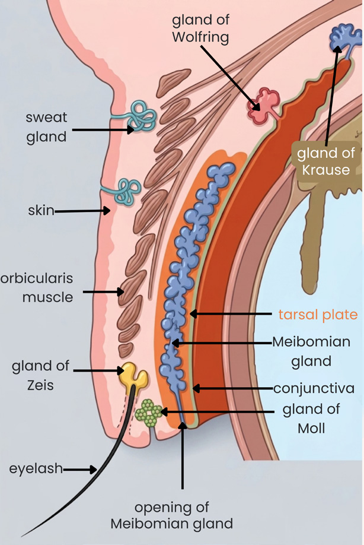
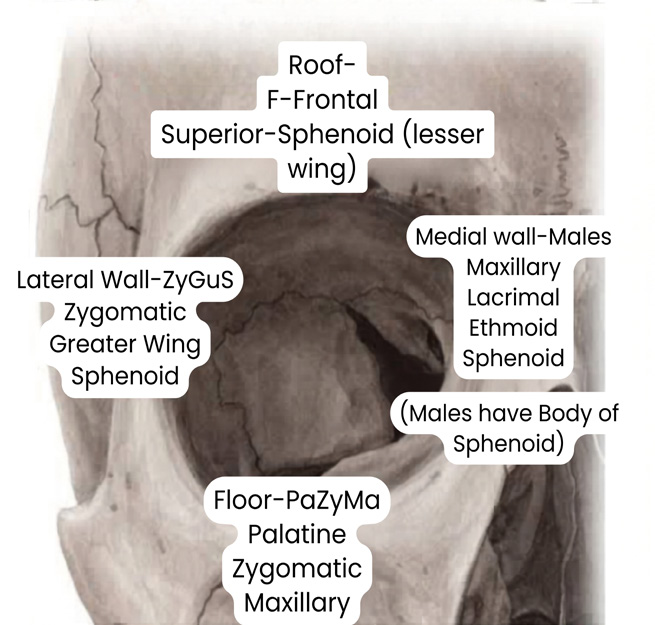
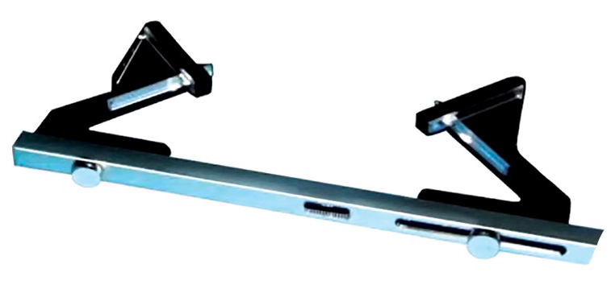
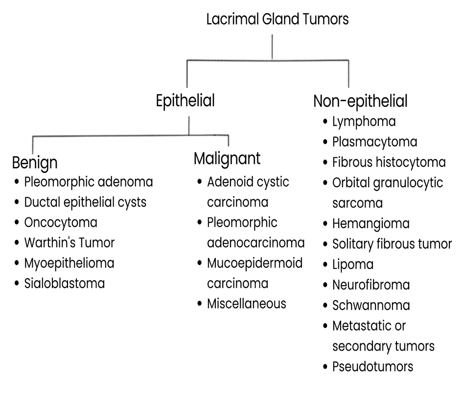

# Eyelids and Orbit

## 1. Overview

The eyelids form a mobile protective covering for the anterior eye and participate in corneal protection, blinking, tear-film maintenance, and the mechanical control of the palpebral aperture. The orbit is a pyramidal/quad­rangular bony cavity containing the globe, extraocular muscles, optic nerve, orbital vessels and nerves, and accessory structures such as the lacrimal gland.

The eyelid is divided by the **gray line** into an **anterior lamella** and a **posterior lamella**.

> **Diagram omitted:** Eyelid lamellae and muscles.
### Eyelid lamellae

| Lamella | Components |
|---|---|
| **Anterior lamella** | Skin, subcutaneous tissue, muscles |
| **Posterior lamella** | Tarsal plate, palpebral conjunctiva, glands |

The **skin of the eyelid is the thinnest skin in the body**. The **tarsal plate is fibrous tissue, not cartilage**, and provides structural support to the lid. Tarsal plates are present in both upper and lower lids.

The **orbital septum** extends from the tarsal plate to the orbital bone in both lids and separates the **preseptal** from the **postseptal** space. Infection anterior to the septum produces **preseptal cellulitis**; infection posterior to it produces **orbital cellulitis**.

### Lymphatic drainage

**Lymphatic drainage** in the eye occurs in the **conjunctiva**:

- **Medial conjunctival drainage → submandibular lymph nodes**
- **Lateral conjunctival drainage → preauricular lymph nodes**

---

# 2. Eyelid Muscles

## Levator palpebrae superioris

- Supplied by **cranial nerve III (oculomotor nerve)**.
- Elevates the upper eyelid.
- Dysfunction produces **ptosis**.

## Müller’s muscle

- Receives **sympathetic nerve fibers**.
- Contributes to upper eyelid elevation.
- Important in ptosis associated with sympathetic dysfunction and in procedures such as the Fasanella–Servat operation.

## Orbicularis oculi

- Supplied by **cranial nerve VII (facial nerve)**.
- Responsible for **eyelid closure**.
- Paralysis causes **lagophthalmos**.

### Blink / corneal reflex

The corneal blink reflex uses:

- **Afferent limb:** CN V, trigeminal nerve, carrying the tactile stimulus from the cornea.
- **Efferent limb:** CN VII, facial nerve, activating orbicularis oculi.

Failure of eyelid closure exposes the cornea and may result in **exposure keratopathy**. In the setting of VII nerve palsy, exposure keratopathy is described as **neuroparalytic keratitis**.

---

# 3. Eyelid Glands

| Gland | Type / location | Clinical relevance |
|---|---|---|
| **Meibomian glands** | Modified sebaceous glands; within the tarsal plate | Chalazion; internal hordeolum; sebaceous cell carcinoma |
| **Glands of Zeis** | Associated with the eyelash root | Hordeolum externum |
| **Glands of Moll** | Modified sweat glands | Located in the lid margin; included among eyelid glands |

The Meibomian glands are arranged vertically; therefore, **chalazion incision is made vertically** so that only one gland is cut rather than several glands.

---

# 4. Eyelid Margin, Eyelashes and Related Structures

The gray line is the division between the anterior and posterior lamellae and is a key landmark in lid anatomy.

### Eyelash disorders

> **Diagram omitted:** Eyelash and lid-margin disorders.
| Disorder | Definition / key feature | Treatment / consequence |
|---|---|---|
| **Trichiasis** | Misdirection of eyelashes inward toward the globe | Epilation; cryotherapy at the lash base. Can produce corneal abrasion/opacity |
| **Distichiasis** | Second row of eyelashes; one row anterior to the gray line and one row posterior to it | Diathermy or cryotherapy (−20°C) |
| **Madarosis** | Loss of eyelashes or eyebrows | Evaluate local and systemic causes |
| **Poliosis** | Greying/discoloration of eyelashes | Associated with chronic blepharitis, VKH syndrome, Waardenburg syndrome |

### Trichiasis: clinical effects

Misdirected eyelashes cause:

- Irritation
- Pain
- Lacrimation
- Blepharospasm
- Punctate epithelial erosions
- Corneal ulcer
- Pannus

**Pseudo-trichiasis** may occur with **entropion**.

### Other lid-margin abnormalities

- **Tylosis:** thickening of the eyelid margin; chronic blepharitis may cause it.
- **Ankyloblepharon:** partial or complete adhesion/fusion of the ciliary edges of the upper and lower eyelids. Treatment is separation/breaking of the adhesion.
- **Symblepharon:** abnormal adhesion/fusion of bulbar and palpebral conjunctiva; can follow burns, chemical injury or surgery. Treatment consists of division of adhesions with conjunctival grafting or mucous membrane grafting.

### Entropion and ectropion

- **Entropion:** inward turning/inversion of the eyelid margin.
- **Ectropion:** outward turning/eversion of the eyelid margin.

---

# 5. Eyelid Inflammation and Infection

## Blepharitis

### Squamous blepharitis

- Inflammation of the eyelid margins.
- Typically affects both eyes and the edges of the eyelids.
- Antibiotic-steroid combinations are used for treatment.

### Ulcerative blepharitis

- Characterized by **matted, hard crusts around the eyelashes**.
- Associated with **staphylococcal infection**.
- Removal of crusts leaves small sores that may ooze or bleed.
- Treatment described: **antibiotic ointment**.

### Chronic blepharitis-related changes

- **Tylosis:** thickened lid margin.
- **Poliosis:** greyish eyelashes.
- **Madarosis:** loss of eyelashes/eyebrows.

Causes of madarosis listed include:

- Local: chronic blepharitis, trachoma, tumours, burns
- Skin disease: psoriasis, generalized alopecia
- Systemic: myxoedema, leprosy
- Following removal: trichotillomania, iatrogenic causes

---

## Hordeolum

### Hordeolum externum (stye)

- **Suppurative inflammation of the gland of Zeis**.
- Commonly associated with **Staphylococcus aureus**.
- Causes a **diffuse painful swelling**.
- Pus points at the **lid margin at the eyelash root**.
- Treatment: **hot compresses**.

### Hordeolum internum

- Involves a **Meibomian gland within the tarsal plate**.
- The gland orifice lies behind the eyelashes.
- Pus points **away from the lid margin**, behind the eyelash line.

## Chalazion

- **Lipogranulomatous inflammation of a Meibomian gland**.
- Typically a **painless, localized/nodular swelling away from the lid margin**.
- Treatment: **incision and curettage**; intralesional **triamcinolone 0.1 mL** is also described.
- Incision is made **vertically** because Meibomian glands are arranged vertically.

> **Diagram omitted:** Hordeolum and chalazion.
### Chalazion vs external hordeolum

| Feature | Chalazion | Hordeolum externum |
|---|---|---|
| Pathology | Lipogranulomatous inflammation of Meibomian gland | Suppurative inflammation of Zeis gland |
| Swelling | Painless, localized/nodular | Painful, more generalized/diffuse |
| Position | Away from lid margin | At eyelash/lid margin |
| Treatment | Incision & curettage ± intralesional triamcinolone | Hot compresses |

---

# 6. Ptosis

**Ptosis** is drooping of the upper eyelid. It may be **congenital or acquired**.

The major mechanisms described are:

- **Neurogenic:** III nerve palsy or Horner syndrome
- **Aponeurotic:** postoperative or involutional/age-related
- **Mechanical:** lid swelling or scarring mechanically pulls the lid down
- **Myogenic:** including myasthenia gravis
- **Congenital ptosis** due to abnormal/malinsertion of the levator

Acquired myogenic causes listed include **myasthenia gravis** and **Lambert–Eaton syndrome**.

The **most common type/feature emphasized is aponeurotic ptosis**.

### Ptosis examination patterns

- **Congenital ptosis:** absent upper eyelid crease, levator malinsertion, and lid lag.
- **Aponeurotic ptosis:** typically a **high lid crease**.
- A patient with a **strong lid-closure tendency after being asked to look up** may not be able to maintain upward gaze on the ptotic side.

> **Diagram omitted:** Lagophthalmos, ptosis and blepharophimosis.
## Congenital ptosis: surgical approach according to levator function

| Severity / levator function | Procedure |
|---|---|
| Mild ptosis + good levator function | **Fasanella–Servat operation** |
| Moderate ptosis + fair levator function | **Levator resection** (Blaskowics/Everbusch) |
| Severe ptosis + poor/atrophic levator function | **Frontalis sling / brow suspension** |

Important operative points:

- Moderate ptosis is described with fair levator function of approximately **2–4 mm**.
- Severe ptosis with poor levator function is **>4 mm**.
- Surgery is described as being performed around **5 years of age**.
- Fasanella–Servat is a **tarsomullerectomy**, with removal of Müller’s muscle and tarsal plate; it was originally described for Horner syndrome.
- A complication of sling surgery is **nocturnal lagophthalmos**, because the lid is attached to the brow.

## Marcus Gunn jaw-winking ptosis

- A **synkinetic ptosis** in which eyelid movement is linked to jaw movement.
- Mouth opening is associated with lid opening; mouth closing with lid closure.
- Caused by **synkinesis between trigeminal and oculomotor pathways**, involving levator and pterygoid muscle activity.
- It is described as a **central phenomenon** and therefore cannot be treated by a purely local correction of the abnormal innervation.
- Treatment described: **levator disinsertion + sling surgery**.

---

# 7. Blepharophimosis Syndrome

**Blepharophimosis syndrome** is described as an **autosomal dominant** condition associated with the **FOXL-2 gene**.

Components:

| Feature | Description |
|---|---|
| **Blepharophimosis** | Horizontal narrowing of the palpebral aperture |
| **Ptosis** | Vertical narrowing / drooping of the upper lid |
| **Telecanthus** | Increased distance between the medial canthi |
| **Epicanthus inversus** | Fold of skin extending from the lower lid toward the upper lid |
| **Congenital lower-lid ectropion** | Also described as a component |

The treatment sequence emphasized is:

1. Correct **telecanthus + epicanthus** first.
2. Perform **ptosis surgery later**.

> **Diagram omitted:** Blepharophimosis syndrome.
---

# 8. Lagophthalmos and Lid Retraction

## Lagophthalmos

- Incomplete or abnormal eyelid closure.
- Orbicularis oculi dysfunction, especially **VII nerve palsy**, is a major cause.
- Can produce **exposure keratopathy**.
- Treatment options described include:
  - **Gold weight/Gold implant** to permit the lid to descend
  - **Tarsorrhaphy**

> **Diagram omitted:** Lagophthalmos, ptosis and blepharophimosis.
## Lid retraction

Lid retraction is a prominent feature of **thyroid eye disease** and widens the palpebral fissure.

- **Dalrymple sign:** lid retraction / widened palpebral fissure.
- **Von Graefe sign:** lid lag on downgaze.
- **Stellwag sign:** reduced blink rate / staring appearance.

---

# 9. Orbital Anatomy

## General architecture

- The orbit has **4 walls** and is described as **quadrilateral/pyramidal** in shape.
- **Orbital capacity:** approximately **30 cc**.
- **Base:** quadrangular.
- **Apex:** triangular/conical.
- The orbit is formed by **7 bones**.

### Walls

| Wall | Key point |
|---|---|
| **Medial wall** | Thinnest; lamina papyracea of the ethmoid is the classic thin component |
| **Lateral wall** | Thickest |
| **Floor** | Shortest and weakest; classically involved in blowout fracture |
| **Roof** | Formed by the superior wall of the orbit; contributes to the orbital apex relationships |

The **posteromedial part of the orbital floor** is specifically identified as its weakest portion.

A mnemonic used for the medial wall bones is **MALES**; the listed bones are **Maxillary, Lacrimal, Ethmoid and Sphenoid**.

### Relationship to dacryocystorhinostomy

Dacryocystorhinostomy (DCR) creates a communication between the lacrimal sac and nasal cavity and removes the **maxillary and lacrimal bones**, the upper two bones emphasized in the medial wall anatomy.

---

# 10. Orbital Apex, Foramina and Annulus of Zinn

The **superior orbital fissure** is described as vertical, whereas the **annulus of Zinn** is horizontal.

- **Optic nerve + ophthalmic artery:** pass through the **optic foramen**.
- Structures passing **outside the annulus of Zinn** include the **lacrimal, frontal and trochlear nerves**.
- Structures passing **inside the annulus** include the **two divisions of the oculomotor nerve, nasociliary nerve and abducens nerve**.

> **Diagram omitted:** Orbit anatomy, foramina and proptosis.
## Intraconal and extraconal spaces

The local anaesthetic relationships are:

- **Retrobulbar block → intraconal space**.
- **Peribulbar block → extraconal space**, associated with fewer complications.

The **muscle cone** is clinically important in thyroid eye disease because enlarged extraocular muscles can compress the optic nerve within this compartment.

---

# 11. Orbital Contents and Extraocular Muscle Relationships

The orbit contains the globe, extraocular muscles, optic nerve, orbital nerves and vessels, orbital connective tissue, and lacrimal structures.

The six extraocular muscles are:

- Superior rectus
- Inferior rectus
- Medial rectus
- Lateral rectus
- Superior oblique
- Inferior oblique

Innervation pattern:

- **CN III** supplies all extraocular muscles except:
  - **Superior oblique → CN IV**
  - **Lateral rectus → CN VI**

For the superior oblique, the mnemonic **SoLID** is:

- **L**ateral rotation/abduction
- **I**ntorsion
- **D**epression

---

# 12. Orbital Nerves and Vascular Relationships

The orbit is closely related to cranial nerves III, IV, V1, V2 and VI, particularly at the apex and cavernous sinus.

The ophthalmic artery arises from the **internal carotid artery** and enters the orbital compartment through the optic foramen.

Key orbital nerve relationships include:

- **V1 (ophthalmic division of trigeminal):** important for corneal sensation and corneal anaesthesia in orbital apex/cavernous sinus disease.
- **VI:** particularly vulnerable in cavernous sinus disease and is repeatedly described as the earliest nerve involved in carotid-cavernous fistula and cavernous sinus thrombosis affecting the opposite eye.

---

# 13. Orbital Septum, Preseptal and Postseptal Spaces

The orbital septum runs from the orbital rim/bone to the tarsal plate and separates:

- **Preseptal space:** infection → preseptal cellulitis.
- **Postseptal space:** infection → orbital cellulitis.

This anatomical relationship is fundamental to distinguishing eyelid infection from a true orbital infection.

> **Diagram omitted:** Preseptal versus orbital cellulitis.
---

# 14. Lacrimal Gland and Lacrimal Sac Relationships

- **Lacrimal gland:** located **superolaterally** in the orbit.
- **Lacrimal sac:** located **inferomedially**.

Because a lacrimal gland mass arises in the superolateral orbit, it produces **non-axial proptosis**, with the globe displaced **downward and inward**.

The lacrimal system and related operations are important orbital relationships:

### Congenital nasolacrimal duct obstruction

| Age / stage | Management |
|---|---|
| **1–6 months** | **Crigler massage**, using hydrostatic pressure to push secretions down the nasolacrimal duct and open the valve of Hasner |
| **>9 months** | Probing |
| **>18–21 months when probing fails** | Surgery; delayed surgery beyond 4 years is described as giving a larger skull and more operating space |

Watering during the **first month of life** is described as pathological and attributed to **ophthalmia neonatorum**, rather than congenital nasolacrimal duct obstruction.

### Dacryocystitis / lacrimal drainage procedures

- **Acute dacryocystitis:** systemic antibiotics + warm compresses ± local incision and drainage if needed.
- **Chronic disease:** repeated syringing → **DCR**.
- **Atrophic lacrimal sac or lacrimal sac tumour:** **dacryocystectomy**.

> **Diagram omitted:** Nasolacrimal duct obstruction and DCR.
---

# 15. Embryologic Correlations Relevant to the Eyelids and Orbit

**Ocular embryology and congenital lid abnormalities** relevant to eyelids and orbit include:

### Ocular developmental timeline

- Eye development begins from the **forebrain**.
- The optic grooves develop into the **optic vesicles**.
- The process begins around the **22nd day of gestation**.
- The optic vesicle contacts surface ectoderm and induces the early **lens placode**.
- Invagination produces the **lens pit** and then the **lens vesicle**.
- The optic stalk contains the **choroid fissure**, which closes around the **6th–7th week**; failure of closure produces **coloboma**.
- **PAX6** is identified as a key gene in eye development.

### Tissue derivatives

**Surface ectoderm – SLEEK**

- Skin appendages
- Lens
- Epithelial lining of conjunctiva
- Epithelium of cornea

**Neuroectoderm – STORME**

- Secondary vitreous
- Tertiary vitreous
- Optic nerve
- Retina
- Iris sphincter and dilator pupillae
- Epithelial lining of iris and ciliary body

**Neural crest**

- Sclera except the temporal part
- Choroid
- Corneal stroma and corneal endothelium
- Trabecular meshwork
- Ciliary muscles

**Mesoderm – PSME**

- Primary vitreous
- Temporal part of sclera
- Extraocular muscles
- Endothelial lining of blood vessels

A clinical photograph of **lid coloboma** is included among the congenital ocular abnormalities.

> **Diagram omitted:** Lid coloboma.
---

# 16. Proptosis / Exophthalmos

**Proptosis** is defined as protrusion of the globe **>21 mm from the lateral orbital rim**. A **difference of >2 mm between the two eyes** is also considered abnormal.

### Measurement

- **Hertel exophthalmometer:** preferred/better option.
- **Luedde exophthalmometer:** easier to use and emphasized for children.

### Proptosis patterns

| Pattern | Important association |
|---|---|
| Increases on bending forward / Valsalva | **Orbital varices**; unilateral, may have a bag-of-worms consistency and phleboliths on MRI |
| Worsens with upper respiratory tract infection | **Orbital lymphangioma** |
| Worsens with crying/straining in children | **Capillary hemangioma** |
| Worsens with crying/straining in infants | **Encephalocele** |
| Pulsatile, bilateral | **Carotid-cavernous fistula** |

### Common causes according to age and laterality

| Population | Unilateral proptosis | Bilateral proptosis |
|---|---|---|
| Adults | Graves disease / thyroid eye disease | Graves disease / thyroid eye disease |
| Children | Orbital cellulitis | Leukemia/AML (chloroma), neuroblastoma |

---

# 17. Thyroid Eye Disease (Graves Ophthalmopathy)

Thyroid eye disease is an **antigen–antibody-mediated orbital disease** in which antibodies attack **orbital fibroblasts**, resulting in:

- Adipogenesis
- Increased hyaluronic acid synthesis
- Extraocular muscle enlargement
- Expansion of orbital contents
- Axial proptosis

> **Diagram omitted:** Thyroid eye disease pathogenesis.
### Core clinical features

- Important cause of **proptosis in adults**.
- Produces **axial proptosis**.
- Can occur in a **euthyroid, hyperthyroid or hypothyroid** patient.
- Disease activity does not simply depend on circulating thyroid hormone level because the pathogenesis is antibody-mediated.
- The course is **progressive in the first year**, with disease becoming stable/permanent in approximately **70%**.
- **Superior limbic keratoconjunctivitis (SLK)** is described as a feature.
- More common in females.

### Upper eyelid signs

| Sign | Finding |
|---|---|
| **Von Graefe sign** | Lid lag on downgaze |
| **Dalrymple sign** | Lid retraction / widened palpebral fissure |
| **Stellwag sign** | Reduced blink rate / staring |

### Extraocular muscle involvement

The classic sequence is:

**I M S Low**

1. **Inferior rectus** — first and most commonly involved
2. **Medial rectus**
3. **Superior rectus**
4. **Lateral rectus** — last in the classic sequence

The myopathy description also identifies the **inferior oblique as the last muscle involved** in the restrictive myopathy section. The muscle belly is involved while the **tendons are not involved**, and the pathology is a **restrictive myopathy due to fibrosis**.

The first defective movement is **elevation**, because of inferior rectus fibrosis.

### Forced duction test

The forced duction test is used to distinguish **palsy from fibrosis/restriction**:

- If the globe can be moved easily with forceps → **palsy** is favored.
- If the globe remains stuck in one position despite force → **fibrosis/restriction** is favored.

The first sign is **lid retraction**.

### Compressive optic neuropathy

- Due to **enlarged extraocular muscles compressing the optic nerve within the muscle cone**.
- This is **compressive optic neuropathy**, not optic neuritis.

### Treatment sequence

- **Steroids**
- **Radiation**
- **Immunosuppressants**
- **Orbital decompression**

Orbital decompression creates additional orbital space by removing orbital wall; it is described when vision is threatened, with papilloedema, or with severe exposure.

> **Diagram omitted:** Thyroid eye disease and orbital cellulitis.
---

# 18. Orbital Cellulitis and Preseptal Cellulitis

## Preseptal vs orbital cellulitis

| Feature | Preseptal cellulitis | Orbital cellulitis |
|---|---|---|
| Location | Anterior to orbital septum | Posterior to orbital septum |
| Proptosis | Absent | Present |
| Ocular movements | Normal | Restricted |
| Vision | Normal | May be affected |
| Systemic symptoms | Usually absent | Usually present |

The orbital cellulitis image/diagram highlights the orbital septum as the anatomical boundary.

Orbital cellulitis is an **ocular emergency** because of the risk of **cavernous sinus thrombosis**.

The listed etiological organisms are:

- Streptococcus
- Staphylococcus aureus
- **Haemophilus** in children

Treatment includes **intravenous antibiotics**, including coverage for aerobic and anaerobic organisms, with intravenous anti-inflammatory therapy.

---

# 19. Cavernous Sinus Thrombosis, Orbital Apex Syndrome and Orbital Cellulitis

These conditions can be separated clinically by the cranial nerves involved, corneal sensation, visual loss and systemic findings.

| Feature | Cavernous sinus thrombosis | Orbital apex syndrome | Orbital cellulitis |
|---|---|---|---|
| Laterality | Starts unilateral, may become bilateral | Usually unilateral | Usually unilateral |
| Cranial nerves emphasized | III, IV, V1, V2, VI | II, III, IV, V1, V2, VI | II, III, IV, VI |
| Ophthalmoplegia | Complete, sequential | Complete, concurrent | Complete |
| Corneal sensation | Lost | Lost | Intact in the comparison table |
| Loss of vision | Absent in the comparison table | Present | Present |
| Mastoid edema | Present | Absent | Absent |
| Fever + headache | Present | Minimal/absent | Present/marked |
| Relative pattern of systemic vs ophthalmic findings | Both together | Ophthalmic > systemic | Systemic > ophthalmic |

### Cavernous sinus thrombosis: key clinical points

- Can follow **orbital cellulitis** or infection in the **danger triangle of the face**.
- Produces **bilateral ocular signs** because the cavernous sinus contains structures serving both sides.
- Cranial nerves involved: **III, IV, V1, V2 and VI**.
- The **sixth nerve is the first nerve to become involved in the opposite eye** and is a danger sign.
- Features include:
  - Fever
  - Headache
  - Photophobia
  - Ophthalmoplegia

### Investigation and management

Investigations listed include:

- CBC
- Culture
- Nasal swab
- Lumbar puncture
- X-ray PNS
- Ultrasonography
- CT scan
- MRI

Treatment includes **intensive antibiotics, anti-inflammatory agents and surgical drainage when necessary**.

### Tolosa–Hunt syndrome

Granulomatous idiopathic inflammation involving the **cavernous sinus**, together with the **superior orbital fissure and orbital apex**, is described as **Tolosa–Hunt syndrome**.

---

# 20. Orbital Tumours and Masses

> **Diagram omitted:** Orbital tumours and vascular lesions.
## Common orbital lesions / examination associations

| Lesion / tumour | Key association |
|---|---|
| **Ductal cyst of lacrimal gland** | Most common cystic orbital lesion |
| **Epidermoid / dermoid** | Most common cystic orbital tumour; also listed as common orbital neoplasm in paediatric age |
| **Rhabdomyosarcoma** | Most common malignant orbital tumour in children |
| **Capillary hemangioma** | Most common orbital/periorbital tumour in children |
| **Cavernous hemangioma** | Most common benign orbital tumour in adults; typically encapsulated and intraconal, producing axial proptosis |
| **B-cell non-Hodgkin lymphoma** | Most common malignant orbital tumour in adults |
| **Pleomorphic adenoma** | Most common intrinsic epithelial lacrimal gland lesion |
| **Neuroblastoma** | Most common orbital metastasis in children; also an important bilateral proptosis association |
| **Plexiform neurofibroma** | Peripheral neural tumour of the orbit; associated with NF1 |

### Optic nerve glioma

- More common in patients with **neurofibromatosis type 1**.
- The pathology emphasized is **pilocytic astrocytoma**.
- CT/MRI demonstrates **fusiform enlargement of the optic nerve**.

### Meningioma

- Described as more common in **middle-aged women**.
- **Opticociliary shunt** (temporal fullness) and **psammoma bodies** are characteristic associations.
- Early optic nerve involvement may present with the signs of optic nerve disease before obvious proptosis; as tumour size increases, the globe may be displaced outward.

### Orbital metastases

- Most common orbital metastasis in children: **neuroblastoma**.
- Major primary sources of orbital metastases are listed as **breast (42%)** and **lung (11%)**, with lung associated with the most deaths in the table.

### Lacrimal gland tumours

A lacrimal gland tumour produces **non-axial proptosis** and globe dystopia **downward and inward** because the lacrimal gland is situated superolaterally.

The most common tumour is **pleomorphic adenoma**.

The most common malignant tumour is **adenoid cystic carcinoma**.

The most dangerous malignant tumour is **adenoid cystic carcinoma**, particularly because of **perineural invasion**.

### Lacrimal gland tumour classification

**Epithelial**

- **Benign:** pleomorphic adenoma, ductal epithelial cysts, oncocytoma, Warthin tumour, myoepithelioma, sialoblastoma
- **Malignant:** adenoid cystic carcinoma, pleomorphic adenocarcinoma, mucoepidermoid carcinoma, miscellaneous malignant tumours

**Non-epithelial**

- Lymphoma
- Plasmacytoma
- Fibrous histiocytoma
- Orbital granulocytic sarcoma
- Hemangioma
- Solitary fibrous tumour
- Lipoma
- Neurofibroma
- Schwannoma
- Metastatic/secondary tumours
- Pseudotumours

---

# 21. Lid Tumours

> **Diagram omitted:** Lid malignancy comparison.
## Benign lid lesions

- **Naevus:** pigmented mole.
- **Dermolipoma / lipodermoid:** upper outer canthus; described mainly as a cosmetic concern and located far from the limbus.
- **Xanthelasma palpebrarum:** yellowish fat deposits associated with **hypercholesterolaemia**.

## Malignant lid tumours

| Tumour | Frequency / features |
|---|---|
| **Basal cell carcinoma** | Most common; approximately **90%** of lid malignancies in the high-yield table. Pearly nodular margin. Medial canthus carries the worst prognosis because of access toward the lacrimal gland/systemic structures. |
| **Squamous cell carcinoma** | Second most common; poorer prognosis than basal cell carcinoma |
| **Sebaceous cell carcinoma** | Least common; arises from Meibomian glands; classically presents as a **recurrent chalazion** and has the worst prognosis among these three |

A **recurrent chalazion in an elderly patient** should therefore raise suspicion for **sebaceous cell carcinoma**.

The lid involvement sequence for basal cell carcinoma is represented by the mnemonic **“I aM SLow”**, described as the same sequence used for the thyroid-eye muscle mnemonic.

---

# 22. Orbital Vascular Lesions

## Orbital varices

- Cause **intermittent proptosis**.
- Proptosis increases on **bending forward or with Valsalva manoeuvre**.
- May have a **bag-of-worms** consistency.
- **Phleboliths** may be seen on MRI.

## Orbital lymphangioma

- Proptosis may increase during an **upper respiratory tract infection**.

## Capillary hemangioma

- Important paediatric orbital/periorbital tumour.
- Proptosis may increase with **crying**.

## Encephalocele

- In infants, proptosis may increase with **crying/straining**.

## Carotid-cavernous fistula

- Classically **bilateral**.
- Produces **pulsatile proptosis**.
- **75%** are described as traumatic.
- **Abducens nerve (CN VI)** is the most commonly involved/earliest affected nerve.
- Investigation of choice: **Digital Subtraction Carotid Angiography (DSCA)**.
- Raised cavernous sinus pressure may affect cranial nerves III, IV, V and VI and may produce ocular neurological symptoms; increased pressure can also contribute to glaucoma and severe venous congestion/retinal venous stasis.

---

# 23. Orbital Trauma: Blowout Fracture

The **floor of the orbit** is the classic site of a blowout fracture and is the weakest/shortest wall. The **posteromedial portion of the floor** is emphasized as particularly weak.

### Mechanism

An object larger than the orbital rim, such as a **tennis ball or fist**, forces the globe posteriorly, increasing intraorbital pressure and fracturing the orbital floor.

> **Diagram omitted:** Blowout fracture CT.
### Clinical and imaging features

- **Herniation of orbital contents into the maxillary sinus**.
- **Tear-drop sign** on X-ray/CT.
- **Infraorbital nerve involvement** → decreased sensation over the cheek.
- **Diplopia**.
- **Enophthalmos**.
- The **inferior rectus / inferior oblique region** is described as the common site of muscle involvement.
- Medial wall fractures may produce **orbital emphysema**.
- The condition may be associated with **double diplopia** and infraorbital anaesthesia.

### Surgical indication described

If there is **no improvement in diplopia and enophthalmos after approximately 10 days of medical treatment**, surgery is indicated because muscle may be entrapped at the fracture site.

---

# 24. Proptosis Differential: Practical Pattern Recognition

| Pattern | Think of |
|---|---|
| Axial proptosis | Thyroid eye disease, intraconal cavernous hemangioma |
| Non-axial proptosis + down-and-in globe displacement | Lacrimal gland mass |
| Intermittent / Valsalva-induced | Orbital varix |
| Increased with URTI | Orbital lymphangioma |
| Increased with crying in a child | Capillary hemangioma |
| Pulsatile + bilateral | Carotid-cavernous fistula |
| Adult, common bilateral cause | Thyroid eye disease |
| Child + acute pain/systemic inflammatory features | Orbital cellulitis |
| Child + bilateral proptosis with haematologic disease | Leukemia / chloroma |
| Child + bilateral proptosis with metastatic pattern | Neuroblastoma |

---

# 25. Clinical Examination and Investigations

## Eyelid examination

### Ptosis

Assess:

- Presence or absence of the **upper eyelid crease**
- **Lid lag**
- **Levator function**, because surgical procedure depends on it

### Proptosis

- **Hertel exophthalmometer**: preferred/better option.
- **Luedde exophthalmometer**: easier to use in children.
- **>21 mm** protrusion or **>2 mm asymmetry** is abnormal.

### Restrictive orbital disease

**Forced duction testing** distinguishes a mechanical restrictive process such as fibrosis from a nerve palsy.

### Orbital and lacrimal imaging / vascular investigation

| Investigation | Major use described |
|---|---|
| **CT** | Orbital fracture, tear-drop sign, optic nerve/orbital pathology, acute orbital evaluation |
| **MRI** | Orbital soft tissue lesions, phleboliths in orbital varices, optic nerve enlargement, muscle involvement |
| **Digital Subtraction Carotid Angiography** | Investigation of choice for carotid-cavernous fistula |
| **Forced duction test** | Palsy vs restrictive fibrosis |
| **CBC, cultures, nasal swab, LP, X-ray PNS, USG, CT, MRI** | Listed in evaluation of cavernous sinus thrombosis in the setting of orbital infection |

---

# 26. Orbital and Eyelid Clinical Correlations

### Oculomotor nerve palsy

Because the levator palpebrae superioris is supplied by CN III, a complete III nerve palsy produces **ptosis** in addition to ocular motor abnormalities.

### Horner syndrome

The combination of these findings is characteristic:

- **Ptosis**
- **Miosis**
- **Anhidrosis**

Enophthalmos is **not a true feature**; the apparent sinking of the eye is related to the palpebral changes.

### Corneal protection

- Corneal sensory input travels via CN V.
- Orbicularis activation travels via CN VII.
- Loss of orbicularis function or blink can cause lagophthalmos and exposure keratopathy.

---

# 27. Quick Comparative Tables for Revision

## Hordeolum vs chalazion

| Feature | Hordeolum | Chalazion |
|---|---|---|
| Nature | Acute suppurative inflammation | Lipogranulomatous inflammation |
| Typical gland | Zeis (external) / Meibomian (internal) | Meibomian |
| Pain | Painful | Painless |
| Margin relation | External: points at margin; internal: away from margin | Away from margin |
| First-line treatment described | Hot compresses | Incision and curettage ± intralesional triamcinolone |

## Preseptal vs orbital cellulitis

| Feature | Preseptal | Orbital |
|---|---|---|
| Septum | Anterior | Posterior |
| Proptosis | Absent | Present |
| Eye movements | Normal | Restricted |
| Vision | Normal | May be affected |
| Systemic symptoms | Usually absent | Usually present |

## Ptosis surgery

| Levator function | Procedure |
|---|---|
| Good | Fasanella–Servat |
| Fair | Levator resection |
| Poor / atrophic | Frontalis sling |

## Major orbital emergencies / syndromes

| Condition | Hallmark |
|---|---|
| **Orbital cellulitis** | Postseptal infection with proptosis, restricted movements and possible visual compromise |
| **Cavernous sinus thrombosis** | Bilateral progression, multiple cranial neuropathies, fever/headache; VI is an early warning sign |
| **Orbital apex syndrome** | Optic nerve involvement with ophthalmoplegia and corneal anaesthesia |
| **Carotid-cavernous fistula** | Bilateral pulsatile proptosis; VI commonly affected; DSCA is the investigation of choice |
| **Blowout fracture** | Floor fracture, tear-drop sign, infraorbital anaesthesia, diplopia, possible enophthalmos |
| **Thyroid eye disease with optic neuropathy** | Muscle enlargement compressing the optic nerve in the muscle cone |

---

# 28. High-Yield Numbers and Facts

- **Orbit capacity:** ~**30 cc**
- **Abnormal proptosis:** **>21 mm** from the lateral orbital rim
- **Asymmetry suggesting proptosis:** **>2 mm** between eyes
- **Congenital ptosis surgery:** described around **5 years of age**
- **Fair levator function:** approximately **2–4 mm** in the congenital ptosis treatment table
- **Poor levator function:** **>4 mm** in the same table
- **Carotid-cavernous fistula:** approximately **75% traumatic**
- **Basal cell carcinoma of the lid:** ~**90%** of lid malignancies in the high-yield table
- **Congenital nasolacrimal duct obstruction:** Crigler massage at **1–6 months**, probing after **>9 months**, surgery after **>18–21 months if probing fails**; surgery may be delayed beyond **4 years** in the described approach
- **Chalazion intralesional steroid:** **triamcinolone 0.1 mL**
- **Choroid fissure closure:** **6th–7th week of gestation**
- **Eye development begins:** approximately **22nd day of gestation**
- **Thyroid eye disease:** described as progressive during the first year and stable/permanent in approximately **70%**

---

# 29. Exam-Oriented Pattern Map

### Eyelid

**Ptosis** → identify the mechanism → check crease + lid lag + levator function → select Fasanella–Servat / levator resection / frontalis sling.

**Lagophthalmos** → think orbicularis/VII nerve → exposure keratopathy → gold implant or tarsorrhaphy.

**Painful swelling at lash root** → external hordeolum → Zeis → S. aureus → hot compress.

**Painless nodular swelling away from margin** → chalazion → Meibomian gland → vertical incision + curettage.

**Recurrent chalazion in elderly** → think **sebaceous cell carcinoma**.

**Inward lashes** → trichiasis → epilation / cryotherapy; chronic irritation can produce corneal damage.

**Second row of lashes** → distichiasis → diathermy / cryotherapy.

### Orbit

**Proptosis** → measure with Hertel/Luedde → determine axial vs non-axial and dynamic vs fixed.

**Axial proptosis + lid retraction + lid lag** → thyroid eye disease.

**Intermittent/Valsalva proptosis** → orbital varix.

**URTI-related increase** → orbital lymphangioma.

**Pulsatile bilateral proptosis** → carotid-cavernous fistula.

**Acute painful proptosis + fever + restricted movements** → orbital cellulitis.

**Proptosis + cranial neuropathies + bilateral progression** → consider cavernous sinus involvement.

**Optic nerve signs + ophthalmoplegia + corneal anaesthesia** → think orbital apex syndrome.

**Trauma + diplopia + infraorbital numbness + tear-drop sign** → blowout fracture.

---

# 30. Consolidated Structural Summary

The eyelid is an anteriorly mobile, skin-lined structure supported posteriorly by a fibrous tarsal plate and palpebral conjunctiva. Its gray line divides the anterior and posterior lamellae. Orbicularis oculi closes the lid, while levator palpebrae superioris and Müller’s muscle contribute to upper-lid elevation. The glands of the lid include Meibomian glands, Zeis glands and Moll glands. The orbital septum separates preseptal eyelid structures from the postseptal orbit, creating the anatomical basis for the distinction between preseptal and orbital cellulitis.

The orbit is a pyramidal/quad­rangular bony cavity of about 30 cc, with a particularly thin medial wall, a short/weak floor and a thick lateral wall. At the apex, the optic nerve and ophthalmic artery traverse the optic foramen, while the superior orbital fissure and annulus of Zinn provide passage for the major orbital cranial nerves. Intraconal and extraconal spaces explain retrobulbar and peribulbar anaesthetic approaches and the muscle cone is clinically important in thyroid eye disease.

Clinically, eyelid disorders are often localized by the relationship of the lesion to the lid margin, eyelashes, tarsal plate and lamellae, whereas orbital disorders are localized by the pattern of proptosis, globe displacement, extraocular movement restriction, visual impairment, sensory loss and cranial nerve involvement. The key orbital clinical patterns are thyroid eye disease, orbital cellulitis, cavernous sinus thrombosis, orbital apex syndrome, vascular orbital lesions, lacrimal gland masses and orbital fractures.
