# Retina

## 1. Retina: overview and anatomical relationships

The retina is the **inner nervous tunic of the eyeball** and is derived from **neuroectoderm**. It converts light into neural signals. The neurosensory retina extends posteriorly from the optic disc toward the anterior retina and terminates at the **ora serrata**.

The posterior segment contains the **vitreous**, **retina**, and **choroid**. The choroid appears red on fundus examination because of its vascularity. Outside the choroid lies the sclera; internally, the retinal pigment epithelium (RPE) forms the outer boundary of the neurosensory retina.

![[Pasted image 20261006125714.jpg]]

![[Pasted image 20261006125714 1.jpg]]

![[Pasted image 20261006125714 2.jpg]]
> **Diagram omitted:** Layers of the retina.
The **subretinal space** lies between the neurosensory retina and the RPE. It corresponds to the plane of separation in retinal detachment and is embryologically weak because the retina and RPE arise from the invaginated optic cup.

### Fundus landmarks

The principal fundus landmarks are:

- **Optic disc** with a central optic cup and surrounding neuroretinal rim.
- **Retinal vessels**: relatively straight on the nasal side and arranged in arcades on the temporal side.
- **Macula/fovea**: temporal to the optic disc; the foveal region is relatively avascular.
- The retina is continuous anteriorly only up to the **ora serrata**.

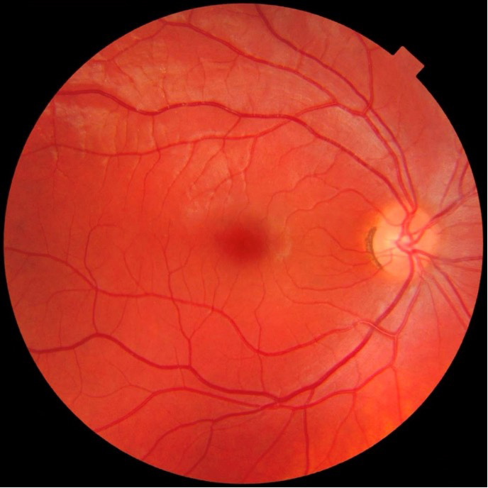
### Macula, fovea, foveola and umbo

The dimensions emphasized in the study material are:

| Structure | Approximate dimension |
|---|---:|
| Macula | **5.5 mm** diameter |
| Fovea | **1.5 mm** diameter |
| Foveola | **350 µm** |
| Umbo | **150 µm**; centre of the fovea |
| Foveal avascular zone | **~500 µm** |

The **fovea** contains the maximum concentration of cones, represents the centre of the visual field, and provides the best image quality. Foveal fixation develops at approximately **3–4 months of age**.

### Optic disc

- Diameter: **1.5 mm**.
- Shape: **vertical oval**.
- Average cup-to-disc ratio in the supplied teaching material: **0.3**.
- The optic disc contains **no rods or cones**, producing the physiological blind spot.
- The **neuroretinal rim** surrounds the optic cup.
- Retinal ganglion-cell axons converge at the disc and continue as the optic nerve.![[Pasted image 20261006130452.jpg]]

### Ora serrata and peripheral retina

The **ora serrata** is the anterior termination of the retina. It is the important landmark for vitreoretinal procedures. Intravitreal access is placed **anterior to the ora serrata**, approximately **3–4 mm posterior to the limbus**, through the sclera and pars plana.

Peripheral retinal pathology is particularly important because peripheral retinal thinning and breaks can initiate rhegmatogenous retinal detachment. Lattice degeneration, peripheral holes, and pathological myopia are important associations.

---

### 2. Microscopic structure of the retina

The retina is arranged as **10 layers**, conventionally described from **inside to outside** as follows:

| No. | Layer                            | Key content / significance                                                                                         |
| --: | -------------------------------- | ------------------------------------------------------------------------------------------------------------------ |
|   1 | Internal limiting membrane (ILM) | Innermost retinal surface; adjacent to vitreous                                                                    |
|   2 | Nerve fibre layer (NFL)          | Ganglion-cell axons; fibres converge to form optic nerve                                                           |
|   3 | Ganglion cell layer (GCL)        | Ganglion cells; third-order neurons                                                                                |
|   4 | Inner plexiform layer (IPL)      | Synaptic interactions involving ganglion cells, amacrine cells and bipolar cells                                   |
|   5 | Inner nuclear layer (INL)        | Bipolar, horizontal, amacrine and Müller-cell nuclei                                                               |
|   6 | Outer plexiform layer (OPL)      | Synapse between photoreceptor axons and bipolar/horizontal-cell dendrites                                          |
|   7 | Outer nuclear layer (ONL)        | Rod and cone nuclei                                                                                                |
|   8 | External limiting membrane (ELM) | Outer retinal boundary; not directly visualised as a discrete layer on routine histology/OCT in the source framing |
|   9 | Photoreceptor layer              | Outer segments of rods and cones                                                                                   |
|  10 | Retinal pigment epithelium (RPE) | Outermost retinal layer; major component of outer blood-retinal barrier                                            |

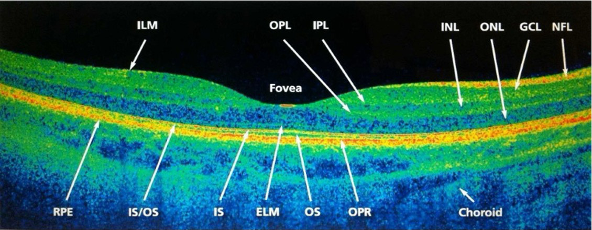
#### Retinal neurons and glial cells

The basic neuronal sequence is:

**Photoreceptor → bipolar cell → ganglion cell → optic nerve**

- **Rods and cones** are first-order neurons.
- **Bipolar cells** are second-order neurons.
- **Ganglion cells** are third-order neurons.
- **Horizontal cells** and **amacrine cells** modify signal processing laterally within the retinal network.
- **Müller cells** are the principal retinal glial cells and support the neurosensory retina.

The **inner nuclear layer** contains the nuclei of bipolar, horizontal and amacrine cells; Müller cells are also present here as the principal supporting glia.

Light traverses the transparent retinal layers before reaching the photoreceptor outer segments, where the photochemical event is initiated. The RPE lies immediately adjacent to the photoreceptor outer segments and is essential for photoreceptor survival and metabolism.

#### Retinal pigment epithelium

The RPE:

- Forms the outer boundary of the neural retina.
- Receives its nutritional support predominantly from the **choroidal circulation** and supports the rods and cones.
- Forms the **outer blood-retinal barrier**.
- Is essential for photoreceptor survival; loss of the RPE results in secondary photoreceptor loss.

The source material specifically links RPE failure with retinitis pigmentosa and with disruption of the outer blood-retinal barrier in central serous retinopathy.

#### Retinal histological vascular pattern

Two clinically important patterns of retinal vessels are described:

1. Vessels in the **outer plexiform/inner nuclear region** are oriented relatively perpendicular to the retinal surface. Hemorrhage at deeper levels gives the **dot-and-blot** pattern.
2. Vessels within the **nerve fibre layer** are oriented parallel to the retinal surface. Superficial hemorrhage in this layer produces **flame-shaped hemorrhage**.

This anatomic relationship explains the classic contrast between the hemorrhagic patterns of diabetes and hypertension.

#### Blood-retinal barrier

The retina has two functionally important components of the blood-retinal barrier.

**Outer blood-retinal barrier**

- Formed principally by the tight barrier function and strong adhesion of the **RPE**.
- Breaks in the outer barrier permit fluid to collect in the subretinal space.
- This mechanism is central to **central serous retinopathy**, in which fluid accumulation produces a shallow serous retinal detachment.

**Inner blood-retinal barrier**

- Located around the retinal microvascular endothelium; in the supplied teaching framework it is associated with the boundary between the OPL and INL.
- Increased vascular permeability causes leakage into the retina and produces **retinal edema**, especially **cystoid macular edema**.

A useful pathological sequence is:

**Barrier failure → leakage → hypoxia/ischemia → further vascular leakage → retinal edema, hemorrhage and exudates → persistent ischemia → VEGF-driven neovascularisation → vitreous hemorrhage / tractional retinal detachment / neovascular glaucoma.**

This sequence underlies the progression of proliferative microangiopathic retinal disease.

#### Bruch membrane

**Bruch membrane** forms the interface between the RPE and choroid. It is particularly important in:

- **Age-related macular degeneration**, where drusen accumulate at the RPE–Bruch interface and neovascular membranes may grow through it.
- **Pathological myopia**, where stretching produces **lacquer cracks**, representing breaks in Bruch membrane.
- **Angioid streaks**, where abnormal Bruch membrane becomes brittle; pseudoxanthoma elasticum is emphasized as the most common association in the study material.

---

## 3. Photoreceptors and retinal physiology

### Rods and cones

| Feature | Rods | Cones |
|---|---|---|
| Principal function | Scotopic / dim-light vision | Photopic / high-acuity and colour vision |
| Major distribution | Peripheral retina | Maximum density at fovea |
| Major disease association in the notes | Retinitis pigmentosa | Macular cone disorders such as Best/Stargardt in the supplied material |
| Photopigment | Rhodopsin | Photopsin / iodopsin |

Each photoreceptor has an **outer segment** and an **inner segment**.

**Outer segment**

- Contains stacks of discs.
- Discs contain visual pigments.
- This is the principal site of phototransduction.

**Inner segment**

- Contains nucleus, mitochondria, Golgi apparatus and other organelles necessary for cellular metabolism.

### Phototransduction

The dark state is a relatively depolarised resting state:

**Darkness → Na⁺ channels remain open → continuous Na⁺ influx → tonic glutamate release.**

In the supplied exam framework, this tonic glutamate release means the bipolar cells are not excited by the photoreceptor in the dark-adapted resting state.

With light:

**11-cis-retinal → all-trans-retinal → closure of Na⁺ channels → decreased/cessation of glutamate release → bipolar-cell excitation.**

> **Diagram omitted:** Phototransduction in dark and light.
### Visual cycle

The rhodopsin photochemical cycle proceeds through light-induced intermediates and ultimately separates the visual chromophore from opsin. All-trans-retinal is metabolically processed and converted back toward **11-cis-retinal**, which regenerates visual pigment and restores photoreceptor responsiveness.

The conceptual sequence is:

**11-cis-retinal → light exposure → all-trans-retinal → retinal pigment regeneration pathway → 11-cis-retinal → renewed photopigment.**

### Dark and light adaptation

Dark adaptation depends on regeneration of visual pigment after bleaching and on recovery of retinal sensitivity. The photostress test is a practical clinical application of this physiology.

**Photostress test**

- The retina is exposed to bright light, producing temporary photopigment bleaching.
- Normal recovery is approximately **30–50 seconds** in the teaching material.
- Delayed recovery indicates macular dysfunction because cone function and photopigment regeneration are impaired at the macula.
- Optic nerve disease may reduce vision while leaving photostress recovery relatively preserved, helping distinguish macular from optic-nerve pathology.

---

## 4. Retinal development and embryology

The general ocular developmental sequence and germ-layer derivatives are maintained canonically in the **Anatomy of the Eye** note.

![[01 anatomy of eye#15. Ocular developmental anatomy / embryology]]

### Retina-specific developmental point

The optic cup gives rise to the neural retina and retinal pigment epithelium. The neural retina derives from the inner layer of the optic cup, while the RPE derives from the outer layer.
## 5. Vitreoretinal interface and vitreous relationships

### Types of vitreous

Three vitreous components are described embryologically:

1. **Primary vitreous**: embryonic, containing hyaloid vessels and mesodermal tissue.
2. **Secondary vitreous**: adult vitreous, composed principally of **hyaluronic acid and type II collagen**.
3. **Tertiary vitreous**: the **ciliary zonules/suspensory ligament system** associated with the lens.

The **vitreous base at the ora serrata** is the strongest attachment of vitreous to retina.

The remnants of the fetal hyaloid system may persist as **Bergmeister papilla**.

The vitreous has a high concentration of **ascorbic acid**; the study material gives a vitreous:plasma ratio of approximately **9:1**, emphasizing its antioxidant role and retinal protection.

### Vitreous opacities and floaters

- **Floaters** are perceived opacities moving within the vitreous.
- **Asteroid bodies / asteroid hyalosis** appear relatively fixed or “stuck” and are composed of calcium and lipid complexes. Asteroid hyalosis is not associated with myopia.
- **Synchysis scintillans** consists of freely mobile cholesterol crystals that appear to fall or settle with gravity.

### Persistent hyperplastic primary vitreous

Persistent hyperplastic primary vitreous represents a remnant of hyaloid tissue. The major problem is amblyopia associated with **microphthalmia**; it is not primarily a calcifying lesion.

---

## 6. Retinal blood supply and circulation

The eye receives arterial blood from the **ophthalmic artery**, a branch of the internal carotid artery.

> **Diagram omitted:** Blood supply of the retina and eye.
### Central retinal artery

The **central retinal artery (CRA)** enters through the optic nerve and supplies the **inner 6 retinal layers**. The retinal circulation therefore nourishes the inner retina.

A **cilioretinal artery**, when present, can provide additional macular blood supply. This can partially preserve central or tunnel-like central visual function in selected central retinal artery occlusions.

### Posterior ciliary circulation

Two major posterior ciliary arterial systems are emphasised:

- **Short posterior ciliary arteries**: supply the **sclera, choroid and outer retinal layers**, travelling close to the optic nerve.
- **Long posterior ciliary arteries**: travel away from the optic nerve and supply the **ciliary body, iris and sclera**; they contribute to the anterior ciliary circulation.

### Choroid

The choroid is highly vascular and is the principal blood supply of the outer retina, particularly the photoreceptor–RPE complex. This explains why retinal circulation is functionally divided between:

- **Inner retina** → central retinal circulation.
- **Outer retina** → choroidal circulation.

---

## 7. Clinical examination and retinal imaging

### Ophthalmoscopy

Ophthalmoscopy is the **first investigation for direct examination of the fundus**.

| Feature | Direct ophthalmoscopy | Indirect ophthalmoscopy |
|---|---|---|
| Image | Erect | Inverted |
| Viewing | Monocular | Binocular / stereoscopic |
| Magnification | ~15× | Lower; ~3× with +20 D and ~5× with +14 D in the supplied material |
| Working distance | Close to the patient's eye, ~5 cm | About arm's length, ~50 cm |
| Condensing lens | Not required | Required, commonly +20 D or +28 D |
| Field | Small; posterior pole | Large peripheral field, extending toward the ora serrata |

The indirect method is particularly useful for **peripheral retinal examination**, retinal tears and retinal detachment.

### Fundus fluorescein angiography (FFA)

Fluorescein is injected intravenously and reaches the retinal vasculature. It remains intravascular unless the blood-retinal barrier is abnormal.

FFA demonstrates:

- Microaneurysms
- Leakage
- Retinal non-perfusion/ischemia
- Neovascularisation
- Macular vascular abnormalities
- Vascular blockage

The normal macula is relatively **dark** on FFA because of the paucity of retinal capillaries and the masking effect of the RPE.

### Indocyanine green angiography

**ICGA** is used to evaluate the **choroidal vasculature**, including collateral and deeper vascular patterns that may be poorly appreciated on conventional fluorescein angiography.

### Optical coherence tomography

**OCT** is a cross-sectional optical imaging technique that demonstrates:

- Individual retinal layers
- Foveal contour
- RPE/outer-retinal structures
- Choroid, where the scan includes it
- Subretinal fluid
- Intraretinal cystoid spaces
- Membrane thickness and surface abnormalities

The OCT fovea appears as a **depressed contour**. The RPE forms the characteristically hyperreflective outer band in the supplied scans.

OCT is particularly important in **macular edema, central serous retinopathy and age-related macular degeneration**.

### B-scan ultrasonography

B-scan is **two-dimensional ocular ultrasonography** and is particularly valuable when the retina cannot be directly visualised because of:

- Dense vitreous hemorrhage
- Mature cataract or other media opacity
- Corneal opacity/scar

A-scan is one-dimensional and is used primarily for axial-length measurement.

On standard ocular ultrasound, the normal vitreous is relatively **anechoic**, while the retina/choroid complex is echogenic. A detached retina appears as a characteristic mobile echogenic membrane.

B-scan can identify:

- Retinal detachment
- Vitreous hemorrhage
- Choroidal masses, including **choroidal melanoma**, which may have a collar-stud/mushroom configuration.

### Electroretinography

**ERG** records the electrical response generated by the retina.

- **a-wave** → mainly photoreceptor activity.
- **b-wave** → mainly bipolar/Müller-cell activity.
- **c-wave** → metabolic response associated with the RPE.

ERG is useful for **photoreceptor and generalized retinal dysfunction**, particularly hereditary retinal dystrophies.

#### Electrooculography

**EOG** records the **standing potential of the outer retina**, reflecting the functional relationship between photoreceptors and the RPE.

The **Arden ratio** is:

**Light peak / dark trough**

The normal ratio is approximately **>1.85 (185%)** in the supplied teaching framework. Reduced values point toward outer-retinal/RPE dysfunction and are classically important in **Best disease**.

---

# 8. Diabetic retinopathy

Diabetic retinopathy is a **retinal microangiopathy**. The major risk determinant is **duration of diabetes**; poor metabolic control and systemic vascular disease further increase risk.

The pathophysiological sequence is dominated by endothelial injury, pericyte loss, blood-retinal barrier failure, retinal ischemia and VEGF-driven neovascularisation.

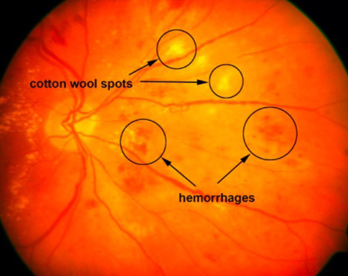
## Risk factors and screening

- **Duration of diabetes**: most important risk factor emphasized.
- Poor glycaemic control / elevated HbA1c.
- Hypertension.
- Nephropathy.
- Pregnancy.

Screening framework in the study material:

| Patient group | First retinal examination |
|---|---|
| Type 1 diabetes | About **5 years after onset/diagnosis** |
| Type 2 diabetes | **At diagnosis** |
| Gestational diabetes | **Fundus assessment during pregnancy; the source teaching framework specifies each trimester** |

## Non-proliferative diabetic retinopathy

The earliest clinically visible lesion is the **microaneurysm**.

Major findings include:

- Microaneurysms
- Dot-and-blot intraretinal hemorrhages
- Flame-shaped hemorrhage may also occur
- Hard exudates: lipid deposits
- Cotton-wool spots: focal retinal nerve-fibre-layer ischemia/axoplasmic stasis
- Intraretinal microvascular abnormalities (**IRMA**)
- Venous beading
- Venous looping
- Venous segmentation / sausage-link appearance
- Macular edema

## ETDRS-style severity: 4–2–1 rule

| Severity | Key retinal findings |
|---|---|
| Mild NPDR | **Microaneurysms only** |
| Moderate NPDR | More extensive hemorrhages/exudates and cotton-wool spots |
| Severe NPDR | Any **one**: hemorrhages/microaneurysms in all 4 quadrants, venous beading in 2 quadrants, or IRMA in 1 quadrant |
| Very severe NPDR | Any **two** of the severe criteria |

The **4–2–1 rule** is one of the most important examination patterns in diabetic retinopathy.

## Proliferative diabetic retinopathy

The hallmark is **neovascularisation**.

- **NVD**: neovascularisation at the disc.
- **NVE**: neovascularisation elsewhere.
- New vessels are fragile and leaky.
- Complications include **vitreous hemorrhage**, fibrovascular proliferation and **tractional retinal detachment**.
- Iris/angle neovascularisation may produce **neovascular glaucoma**.

FFA demonstrates leakage from neovascular complexes and retinal areas of non-perfusion.

## Panretinal photocoagulation

**PRP** is the classic definitive laser treatment for proliferative disease.

Its fundamental effect is reduction of the ischemic retinal drive for VEGF-mediated neovascularisation, thereby reducing the risk of severe visual complications.

The study material associates PRP with **532-nm frequency-doubled Nd:YAG laser** and, in older teaching frameworks, with argon green laser. The source also describes laser as a principal treatment for PDR, with anti-VEGF therapy used in appropriate cases.

## Diabetic macular edema / clinically significant macular edema

Macular edema may occur even in the absence of proliferative retinopathy.

The supplied examination definition emphasises **macular thickening involving the central 500-µm foveal avascular zone**.

OCT shows retinal thickening and cystoid spaces.

**Treatment principles**

- Anti-VEGF therapy is central for center-involving diabetic macular edema.
- Drugs named in the source material include **bevacizumab, ranibizumab, brolucizumab and faricimab**.
- Corticosteroid therapy has a role in selected macular-edema settings.
- Systemic glycaemic and blood-pressure control remains fundamental.

A useful distinction is that **NPDR alone is not synonymous with an indication for anti-VEGF therapy**; anti-VEGF treatment is principally directed at **diabetic macular edema and/or proliferative disease**, depending on the clinical situation.

### FFA appearance

- Microaneurysms: focal hyperfluorescent spots.
- Leakage: increasing late hyperfluorescence.
- Non-perfusion/blocked fluorescence: hypofluorescent areas.
- Neovascular tufts: early hyperfluorescence with late leakage.

---

### 9. Hypertensive retinopathy

Hypertension produces progressive retinal arteriolar narrowing and arteriovenous-crossing abnormalities, followed by retinal hemorrhage, exudation and, in severe disease, optic-disc edema/papilledema.

Normal retinal artery:vein ratio is described as approximately **2:3**; with arteriolar narrowing it may become **1:3**.

#### Arteriovenous crossing signs

| Sign | Finding |
|---|---|
| Salus sign | Deflection / shifting of the vein at the A-V crossing |
| Gunn sign | Venous narrowing or nipping at the crossing |
| Bonnet sign | Banking/curving of the vein |

Hypertensive hemorrhages are classically **flame-shaped** because they occur in the superficial nerve-fibre layer.

#### Keith–Wagener pattern used in the notes

| Grade | Retinal findings |
|---:|---|
| 1 | Arteriolar attenuation; A:V ratio around **1:3** |
| 2 | Salus sign / A-V crossing change |
| 3 | Copper wiring / advanced A-V crossing changes, flame hemorrhages and cotton-wool spots |
| 4 | **Papilledema** with silver wiring / severe vascular sclerosis |

The distinction from diabetic retinopathy is particularly useful:

- **Hypertension → flame hemorrhage** predominates superficially.
- **Diabetes → dot-and-blot hemorrhage** predominates in deeper retinal layers.

---

### 10. Central retinal artery occlusion

**CRAO** presents with **sudden, profound, painless visual loss** and is an ophthalmic and neurologic emergency.

#### Fundus appearance

- Pale, opaque retina from acute ischemic edema.
- **Cherry-red spot at the fovea** because the foveola has very little/no inner retinal tissue, allowing the underlying choroidal circulation to remain relatively visible through the central macula.
- Narrowed retinal arteries.
- **Cattle-tracking/cattle-trucking** appearance of the attenuated arterial circulation.
- If a cilioretinal artery supplies the macula, part of the central field may be relatively spared.

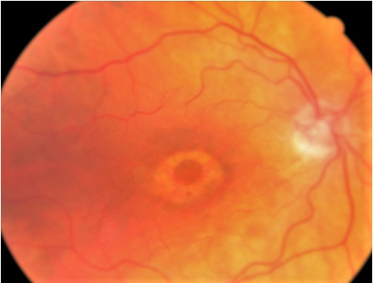
#### Causes

The common clinical mechanism is **thromboembolic/atherothromboembolic retinal arterial occlusion**, with embolic disease and atherosclerotic vascular disease forming the major substrate.

#### Acute management

Immediate management requires **urgent stroke-centre evaluation and systemic vascular assessment**.

Traditional ophthalmic measures listed in the study material include:

- Ocular massage
- Rapid reduction of intraocular pressure using measures such as aqueous aspiration/paracentesis or intravenous mannitol
- Sublingual isosorbide nitrate for vasodilation
- Carbogen has also been described in older emergency algorithms

These historical ocular interventions have not been shown to provide a reliably proven improvement in visual outcome, so they do not replace emergent stroke evaluation.

#### Cherry-red spot differential diagnosis

The important differential pattern includes:

- CRAO
- Berlin edema / commotio retinae after blunt trauma
- Niemann–Pick disease
- Tay–Sachs disease
- GM1 and GM2 gangliosidoses
- Sialidosis and other sphingolipidoses
- Sandhoff disease
- Metachromatic leukodystrophy
- Multiple sulfatase deficiency
- Gaucher disease, particularly the type highlighted in the teaching material

The key imaging concept is that the **transparent foveola contrasts with the surrounding opaque ischemic retina**.

---

### 11. Central and branch retinal vein occlusion

#### CRVO

Retinal venous occlusion causes venous congestion, retinal hemorrhage, edema and variable ischemia.

##### Non-ischemic CRVO

- Relative stasis and venous dilatation
- Increased vascular permeability
- **Macular edema** is an important cause of visual loss

##### Ischemic CRVO

- More severe retinal hypoperfusion
- Marked retinal hemorrhage
- Cotton-wool spots
- Optic-disc edema
- **Tomato-ketchup / blood-and-thunder / tomato-splash fundus**
- Iris neovascularisation (**rubeosis iridis**)
- Risk of **neovascular glaucoma**, classically described as **90–100 day glaucoma**

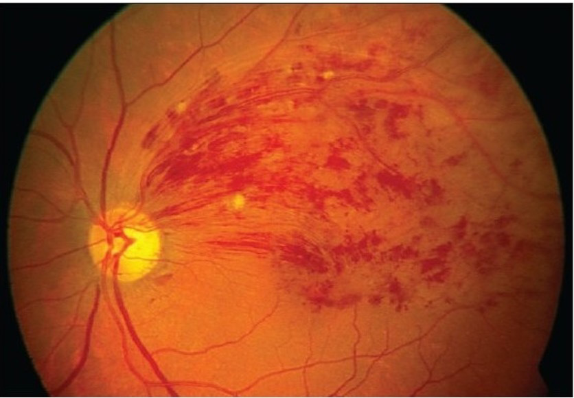
#### Treatment principles

- Treat **macular edema** when present, commonly with intravitreal anti-VEGF therapy; intravitreal corticosteroid therapy is also used in selected patients.
- Ischemic CRVO with anterior-segment neovascularisation requires management of the ischemic drive and **panretinal photocoagulation** when indicated.
- The study material specifically lists intravitreal triamcinolone in non-ischemic disease and PRP in ischemic disease.

#### BRVO

**Branch retinal vein occlusion** usually produces sectoral retinal involvement. The **superotemporal quadrant** is emphasized as the most commonly affected branch distribution.

FFA may show delayed/blocked perfusion, leakage and macular edema.

---

### 12. Retinal vasculitis and posterior inflammatory retinal disease

Retinal vascular inflammation commonly presents as **periphlebitis**, vascular sheathing, hemorrhage, macular edema or vitreous inflammatory cells.

#### Eales disease

Eales disease is an important cause of **recurrent vitreous hemorrhage** in the study material. It belongs to the broader group of retinal vasculopathic/inflammatory disorders and may progress through peripheral retinal ischemia, neovascularisation and vitreous hemorrhage.

#### Sarcoidosis

Sarcoid retinal vasculitis can produce **periphlebitis** with the characteristic **candle-wax dripping** appearance—yellow-white inflammatory sheathing along retinal veins.

#### Toxoplasma retinochoroiditis

- Typically involves the posterior pole, including the foveal or juxtafoveal region.
- Active lesion: **“headlight in the fog”**—a bright retinitis focus with overlying vitreous haze.
- Healed lesion: **punched-out chorioretinal scar**.
- Clindamycin is listed as treatment, with corticosteroid cover because severe inflammatory reactions can accompany organism death.

#### Vogt–Koyanagi–Harada disease

VKH produces **pan-uveitis with exudative retinal detachment**, often with a bullous/serous appearance.

Associated features include:

- Sunset-glow fundus
- Sugiura sign
- Poliosis
- Madarosis
- Vitiligo
- Neurological/meningeal manifestations such as tinnitus, vertigo and meningitic symptoms

Steroids are the major treatment principle.

#### Sympathetic ophthalmia

- Trigger: **penetrating ocular trauma**.
- Mechanism: release of previously sequestered uveal antigens and bilateral granulomatous autoimmune inflammation.
- Bilateral granulomatous pan-uveitis.
- First symptom emphasized: **photophobia**.
- Important fundus/anterior vitreous finding: **retrolental flare**.
- **Dalen–Fuchs nodules** are nodules at the RPE level.
- High-dose corticosteroid therapy is the central treatment principle.
- In a non-salvageable traumatized eye, early enucleation—within about 2 weeks in the teaching material—is described as a preventive strategy.

---

### 13. Macular disorders

The macula is the site of the highest visual acuity and is dominated functionally by cone-mediated vision.

#### Macular function tests

**Amsler grid**

- Patient fixates the central dot.
- Straight lines should remain straight.
- **Metamorphopsia** produces wavy or distorted lines.
- The teaching material uses a **20° visual field** and **400 small squares** as the classic test format.

> **Diagram omitted:** Amsler-grid metamorphopsia.
**Photostress test**

- Delayed photostress recovery supports a macular lesion.
- Relatively normal photostress recovery despite reduced acuity points toward optic-nerve disease.

#### Cystoid macular edema

CME is an accumulation of cyst-like intraretinal fluid spaces, classically in the **outer plexiform layer (Henle layer)** in the supplied teaching framework.

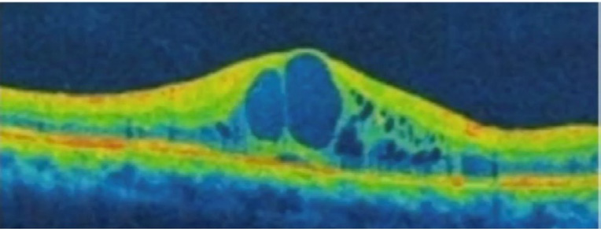
##### Causes / associations — RUN PRIDE

- **R** — Retinitis pigmentosa
- **U** — Uveitis
- **N** — Niacin / nicotine
- **P** — Prostaglandin analogues
- **R** — Retinal vein occlusion
- **I** — Irvine–Gass syndrome
- **D** — Diabetic retinopathy
- **E** — Epinephrine, especially in aphakia

##### Irvine–Gass syndrome

- Pseudophakic CME following cataract surgery.
- Classically described around **6 weeks** after otherwise uncomplicated cataract surgery.
- More common with uveitis and uncontrolled diabetes.

##### Investigations

**OCT**: multiple intraretinal cystoid spaces and retinal thickening.

**FFA**: characteristic **petaloid/flower-petal leakage** because the macular OPL/Henle layer is arranged radially.

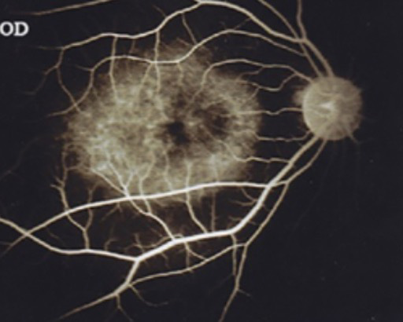
##### Treatment principles

- Topical or periocular **NSAIDs** in appropriate postoperative CME.
- Corticosteroids.
- Intravitreal anti-VEGF in selected etiologies such as diabetic or vascular macular edema.
- Treat the underlying inflammatory or vascular disorder.

#### Central serous retinopathy/chorioretinopathy

Central serous retinopathy (**CSR/CSCR**) is produced by dysfunction of the **RPE/outer blood-retinal barrier**, allowing **subretinal fluid** to accumulate.

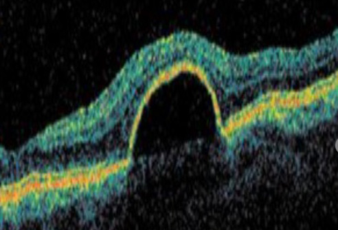
##### Clinical pattern

- Metamorphopsia / distorted central vision.
- Shallow serous detachment at the posterior pole.
- Strong association with **exogenous corticosteroids**.
- Other associations in the teaching material: Cushing syndrome, H. pylori infection, pregnancy and a type-A/stress-prone phenotype.
- Young males are emphasized; the scanned material gives a male:female ratio of approximately **3:1**.

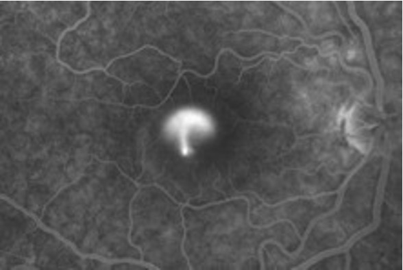
##### Imaging

**OCT**

- Single smooth elevation of the neurosensory retina.
- Subretinal fluid.

**FFA**

- **Ink-blot** pattern.
- **Smoke-stack / smokestack** pattern.
- Umbrella/mushroom descriptions are also used for the focal leak.

> **Diagram omitted:** CSR fundus appearance.
##### Treatment

- Most acute cases are **self-limiting**.
- Remove/avoid precipitating factors, particularly corticosteroids when clinically feasible.
- Persistent or chronic disease may be treated with **photodynamic therapy (verteporfin)**.
- Focal laser photocoagulation can be used for a suitable focal leak.
- Corticosteroids are **contraindicated as treatment for CSR because they may aggravate the disease**.

#### Age-related macular degeneration

ARMD is divided into **dry/non-exudative** and **wet/exudative/neovascular** forms.

##### Dry ARMD

The progression is framed as:

**Early drusen → intermediate disease → late geographic atrophy**.

**Drusen** are yellow/eosinophilic deposits accumulating between the RPE and Bruch membrane.

Later disease may produce **geographic atrophy of the RPE** with corresponding photoreceptor dysfunction and central visual loss.

Management principles in the supplied material include:

- Risk-factor modification.
- Smoking cessation.
- Nutritional antioxidant supplementation in appropriate patients; agents named include **lutein and zeaxanthin** (with astaxanthin also mentioned in the study material).
- Observation in non-neovascular disease.

##### Wet ARMD

Wet disease is characterised by **choroidal neovascularisation (CNV)** and leakage/hemorrhage.

The classic sequence is:

**Bruch membrane/RPE dysfunction → CNV → vascular leakage → subretinal or intraretinal fluid ± hemorrhage → photoreceptor/RPE damage → central visual loss.**

Signs include:

- RPE detachment.
- Subretinal hemorrhage.
- CNV.
- Disciform scarring in advanced lesions.

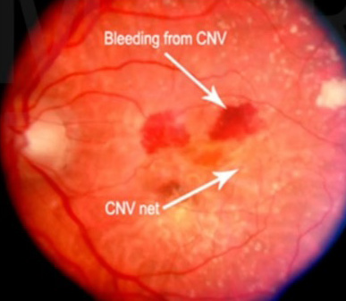
Treatment is predominantly **intravitreal anti-VEGF therapy**. The source lists bevacizumab, ranibizumab, brolucizumab and aflibercept among the agents used.

---

#### 14. Hereditary retinal dystrophies

##### Retinitis pigmentosa

Retinitis pigmentosa is primarily a **rod-cone dystrophy** with progressive rod dysfunction followed by broader photoreceptor loss.

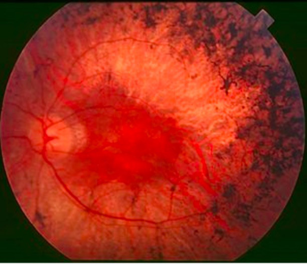
###### Clinical features

- **Nyctalopia** is a classic early symptom because rods are affected first.
- Progressive peripheral visual-field loss.
- **Ring/donut scotoma** in intermediate stages.
- Advanced disease may produce **tubular/tunnel vision**.
- Bilateral disease.

###### Fundus triad

1. **Bony-spicule pigmentation**, predominantly peripheral.
2. **Attenuation of retinal arterioles**.
3. **Waxy pallor of the optic disc**.

###### Inheritance

- Sporadic cases are emphasized as most common overall.
- Among inherited forms, **autosomal recessive** disease is the commonest pattern in the teaching material.
- Autosomal dominant disease is described as having the best prognosis.
- X-linked recessive disease is less common but has the worst prognosis among the listed inheritance patterns.
- No X-linked dominant form is emphasized.

###### Associated syndromes

**Usher syndrome** is highlighted as an important systemic association: retinitis pigmentosa with sensorineural deafness.

Lawrence–Moon–Bardet/Biedl spectrum is also mentioned in association with RP.

###### Inverse retinitis pigmentosa

In inverse RP, the pericentric/central retina is affected first rather than the classical peripheral-predominant pattern.

###### Investigation

ERG demonstrates generalized rod-cone dysfunction with reduction in the a- and b-wave responses; the supplied material emphasises the marked reduction of retinal electrical activity.

Treatment is primarily supportive; genetic counselling is important, and no definitive treatment is presented in the supplied exam notes.

##### Stargardt disease

Stargardt disease is a **juvenile macular dystrophy**, associated classically with **ABCA4** and an **autosomal recessive** inheritance pattern. In the scanned teaching material, visual acuity may fall below **6/60 even in early disease**.

Features emphasized:

- RPE dysfunction with lipofuscin accumulation.
- **Beaten-bronze** macular appearance.
- Progressive central visual loss.
- Central scotoma.
- Reduced colour vision/day-vision difficulty.
- Early visual acuity may already be markedly reduced.

> **Diagram omitted:** Stargardt macular dystrophy and dark choroid pattern.
##### Dark/silent choroid sign

FFA in Stargardt disease shows the classic **dark/silent choroid** because accumulated lipofuscin in the RPE reduces visualization of the underlying choroidal fluorescence.

Fundus autofluorescence is useful because **no intravenous dye is required**; lipofuscin is naturally autofluorescent.

EOG may be abnormal in the teaching material, with a reduced **Arden ratio** compared with the normal value of approximately 1.85.

##### Best vitelliform macular dystrophy

Best disease is an **autosomal dominant** RPE-associated macular dystrophy.

Characteristic stages include:

- **Vitelliform / “egg-yolk” lesion**.
- **Vitelliruptive / “pseudohypopyon” stage**, produced by redistribution of the yellow material.
- Later atrophic change.

> **Diagram omitted:** Best vitelliform lesion.
Typical functional findings:

- Central scotoma.
- **Hemeralopia/day-vision difficulty** in the supplied teaching material.
- **ERG may remain normal**, because the primary abnormality is not diffuse photoreceptor dysfunction.
- **EOG is abnormal**, with an Arden ratio **<1.5** in the source material.

The notes associate the lesion with **lipofuscin** and caution that vitamin A may worsen lipofuscin accumulation in this disease.

---

# 15. Retinal trauma and traumatic retinal changes

Blunt ocular trauma can produce several characteristic retinal appearances.

## Commotio retinae / Berlin edema

- Retinal whitening or a **pale/grey fundus** after blunt trauma.
- Mechanism relates to traumatic disruption and edema of the outer retina/RPE-photoreceptor complex.
- A traumatic **cherry-red spot** can also occur because the foveola lacks the inner retinal layers that become opaque around it.

## Retinal detachment after trauma

Trauma can produce:

- Retinal tears.
- Retinal dialysis or retinal breaks.
- Rhegmatogenous retinal detachment.
- Vitreous hemorrhage.
- Traumatic optic neuropathy with subsequent primary optic atrophy.

## Retinal changes of pathological myopia

Pathological myopia is associated with stretching of the posterior eye and progressive chorioretinal change.

Major findings:

- **Tigroid/tessellated fundus** due to visible choroidal vasculature.
- **Annular/temporal myopic crescent**.
- **Posterior staphyloma**.
- **Lacquer cracks**: breaks in Bruch membrane.
- **Foster-Fuchs/Fuchs spots** at the macula from prior hemorrhage/CNV.
- Chorioretinal atrophy.
- Lattice degeneration and peripheral retinal holes.
- Increased risk of rhegmatogenous retinal detachment.

> **Diagram omitted:** Pathological myopia with lacquer cracks and posterior changes.
---

## 16. Retinal detachment and retinal breaks

Retinal detachment is separation of the **neurosensory retina from the RPE** with fluid collecting in the subretinal space.

Embryologically, this plane is weak because the neuroretina and RPE derive from opposing walls of the optic cup.

### Types of retinal detachment

| Feature | Rhegmatogenous RD | Tractional RD | Exudative/serous RD |
|---|---|---|---|
| Basic mechanism | Full-thickness retinal break + fluid entering subretinal space | Vitreoretinal traction pulls retina off RPE | Fluid accumulates without break or traction |
| Important associations | Myopia, ageing, trauma, retinal degeneration | Diabetes, proliferative retinopathy | Choroidal neoplasm, inflammatory/vascular causes, severe hypertension/preeclampsia-type disease |
| Retinal break | **Present** | Absent | Absent |
| Vitreous syneresis | Usually present | Not primary mechanism | Not primary mechanism |
| Vitreoretinal traction | Contributes to break formation | **Primary mechanism** | Absent |
| Photopsia | **Common** | May occur | Usually absent |
| Floaters | **Common** | Often absent in the classic teaching pattern | Usually absent or less prominent |
| Retinal contour | Convex/mobile | Concave, taut and relatively immobile | Smooth/bullous and mobile |
| Characteristic sign | Shafer/tobacco-dust sign | Fixed retinal folds | **Shifting fluid sign** |
| Typical treatment | Retinopexy / buckle / pneumatic or vitrectomy depending on configuration | Vitrectomy with relief of traction | Treat the underlying cause |

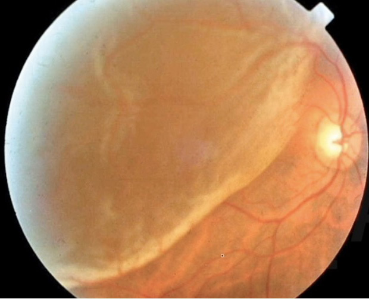
### Rhegmatogenous retinal detachment

The sequence is:

**Vitreous liquefaction (syneresis) + vitreoretinal traction → retinal tear/break → liquefied vitreous enters the subretinal space → retinal separation.**

Symptoms:

- **Photopsia** (flashes), caused by vitreoretinal traction.
- **Floaters**, often due to pigment/retinal debris in the vitreous.
- **Curtain falling over the visual field**.
- Sudden, painless visual loss.

#### Shafer sign

**Shafer sign = tobacco dust/pigment granules in the anterior vitreous**, indicating retinal pigment dispersion and supporting the presence of a retinal break.

A **giant horseshoe tear** is a major retinal break pattern associated with rhegmatogenous detachment.

### Tractional retinal detachment

Tractional detachment is produced by fibrovascular or vitreous contraction pulling the retina away from the RPE.

Typical pattern:

- **Concave configuration**.
- Retina appears taut and relatively immobile.
- Fixed folds may be present.
- Common in advanced proliferative diabetic retinopathy.
- Vitreous hemorrhage may accompany the fibrovascular proliferation.

> **Diagram omitted:** Tractional retinal detachment.
The principal treatment is **pars plana vitrectomy** with removal/release of the tractional membranes; silicone oil may be used when needed for tamponade/support.

### Exudative retinal detachment

There is **no retinal break and no primary traction**.

Fluid accumulates in the subretinal space because of inflammation, vascular permeability, choroidal disease or neoplasia.

Typical features:

- Bullous or convex detachment.
- **Shifting fluid sign**.
- No photopsia in the classic exam pattern.
- Underlying cause should be identified and treated.

> **Diagram omitted:** Exudative retinal detachment.
### Chronicity markers in retinal detachment

Chronic RD may show:

- Retinal atrophy.
- Demarcation lines.
- High-water marks.
- Intraretinal cysts.

OCT demonstrates **subretinal fluid** and separation of the neurosensory retina from the RPE.

### Principles of surgical repair

**Scleral buckle**

A silicone band indents the sclera inward and counteracts the vitreoretinal traction by supporting the area of the retinal break.

**Pneumatic retinopexy**

An expandable intraocular gas bubble (**C3F8 or SF6**) apposes the detached retina to the underlying tissue. The bubble must be positioned appropriately relative to the retinal break.

**Pars plana vitrectomy**

Removes vitreous traction and permits internal retinal manipulation, endolaser and tamponade. Silicone oil can be used in complex cases, especially tractional and recurrent detachments.

#### Silicone oil in the anterior chamber

Because silicone oil is lighter than aqueous, it can move anteriorly and collect in the anterior chamber, producing an **inverse hypopyon/hyperpyon** appearance.

> **Diagram omitted:** Silicone-oil inverse hypopyon.
---

## 17. Vitreous haemorrhage

Vitreous hemorrhage causes acute visual haze, floaters or marked loss of vision. The red reflex may be reduced or absent and the fundus may be difficult or impossible to visualise.

Important causes emphasized are:

- **Diabetic retinopathy** — major overall cause.
- **Blunt trauma** — particularly important in young adults.
- **Eales disease** — recurrent vitreous hemorrhage.
- Other retinal vascular disease.
- Intraocular tumors.
- Sickle-cell disease.

A useful mnemonic is **DEVIS**:

**D** — Diabetes  
**E** — Eales disease  
**V** — Vascular disease  
**I** — Intraocular tumors  
**S** — Sickle-cell disease

B-scan ultrasonography is particularly important when hemorrhage obscures the fundus.

---

## 18. Retinopathy of prematurity

Retinopathy of prematurity (**ROP**) develops because the retinal vasculature is incompletely formed in the premature infant. Oxygen exposure, vascular developmental arrest and subsequent retinal hypoxia can lead to abnormal neovascularisation and fibrovascular traction.

> **Diagram omitted:** ROP zone diagram.
### Risk groups emphasized in the supplied material

- Gestational age **<34 weeks**.
- Birth weight **<1750 g**.
- Infants at **34–36 weeks** with important risk factors such as respiratory distress.

Additional screening timing given in the study material:

- Infants **≥28 weeks and ≥1200 g**: screen after approximately **4 weeks** of chronological age.
- Infants **<28 weeks or <1200 g**: screen within approximately **2–3 weeks**.
- A broader practical rule in the scanned material is to perform the first examination at **4 weeks after birth or at 31–33 weeks postmenstrual age, whichever is later**.

### ROP zones

- **Zone I**: central circle around the optic nerve; approximately **6 mm diameter** in the teaching diagram.
- **Zone II**: extends tangentially from the nasal edge of zone I.
- **Zone III**: temporal residual crescent.

### Staging

| Stage | Finding |
|---:|---|
| 1 | **Demarcation line** between vascularised and avascular/hypoxic retina |
| 2 | **Ridge** develops from the line |
| 3 | **Neovascularisation** / fibrovascular proliferation extends toward the vitreous |
| 4 | **Subtotal retinal detachment** |
| 5 | **Total retinal detachment** |

### Plus disease

Plus disease is severe disease characterised by **arterial and venous tortuosity**, particularly in the posterior retina. It indicates increased disease activity and higher risk of progression.

### Threshold disease

The teaching material gives threshold disease as:

- **Stage 3** disease in **zones I or II**,
- with **plus disease**,
- involving **5 contiguous clock hours or 8 non-contiguous clock hours**.

### Treatment

- **Laser photocoagulation** of the avascular/hypoxic retina is the classic definitive treatment in the supplied teaching framework.
- Diode/red laser around **810 nm** is specifically mentioned.
- Advanced tractional retinal detachment may require **lens-sparing pars plana vitrectomy**.

---

#### 19. Retinal tumors

##### Retinoblastoma

Retinoblastoma is the major pediatric intraocular tumor discussed in the retinal material.

> **Diagram omitted:** Leukocoria in retinoblastoma.
The characteristic presentation is **leukocoria**, the white pupillary reflex. **Strabismus/squint** is the second common presentation.

Other presentations include:

- Pseudohypopyon from tumor cells.
- Uveitis-like inflammation.
- Secondary glaucoma.
- Buphthalmos in advanced disease.
- Orbital inflammatory-appearing presentation in advanced cases.

The typical age at presentation in the scanned material is approximately **18 months**.

##### Genetics

- **RB1 gene** on **chromosome 13q14**.
- Pathogenesis follows the **Knudson two-hit hypothesis**.
- Hereditary disease is associated with a higher risk of bilateral and multifocal tumors and with a predisposition to second malignancies.
- The supplied material describes **trilateral retinoblastoma** as bilateral retinoblastoma with a pineal tumor/pinealoblastoma.
- **Osteosarcoma** is emphasized as the important second malignancy.

##### Histology

> **Diagram omitted:** Retinoblastoma histology.
- **Flexner–Wintersteiner rosettes**: differentiated tumor cells arranged around a central lumen.
- **Homer Wright pseudorosettes**: no true central lumen.
- **Fleurettes** represent photoreceptor differentiation.

##### Spread and investigation

- The principal route of local extension emphasised is **direct spread through the optic nerve**.
- **CT/X-ray** can demonstrate calcification and is used in diagnosis.
- Biopsy demonstrates the characteristic rosettes and fleurettes, although diagnosis and treatment planning are generally based on clinical/imaging findings rather than routine biopsy of an accessible intraocular tumor.
- The supplied exam material describes **enucleation** as the definitive treatment for advanced/unfavourable disease.

##### International grouping described in the teaching material

| Group | Pattern |
|---|---|
| A | Small tumour, <3 mm, away from the macula and optic disc |
| B | Larger or close to disc/foveola but confined to the retina |
| C | Well-defined tumour with limited subretinal or vitreous seeding |
| D | Large/poorly defined tumour with widespread vitreous or subretinal seeding; retinal detachment may occur |
| E | Very large advanced tumour with anterior extension, hemorrhage, glaucoma or other features predicting poor prognosis |

---

# 20. Retinal imaging patterns worth memorising

| Condition | Fundus / FFA / OCT pattern |
|---|---|
| CRAO | Pale retina + cherry-red fovea + narrowed arteries |
| CRVO | Tomato-splash/blood-and-thunder fundus + dilated veins + widespread hemorrhage |
| Diabetic retinopathy | Microaneurysms, dot-blot hemorrhage, hard exudates, cotton-wool spots, IRMA, neovascularisation |
| Hypertensive retinopathy | Arteriolar attenuation, A-V crossing changes, copper/silver wiring, flame hemorrhage; severe disease may have disc edema |
| CME | Multiple intraretinal cystic spaces on OCT; **petaloid** leakage on FFA |
| CSR | Single smooth **subretinal fluid** elevation on OCT; **ink-blot/smoke-stack** leakage on FFA |
| Dry AMD | Drusen → geographic RPE atrophy |
| Wet AMD | CNV, subretinal/intraretinal fluid, hemorrhage, RPE detachment/scarring |
| RP | Bony spicules + arteriolar attenuation + waxy disc pallor |
| Stargardt | Beaten-bronze macula + dark/silent choroid; lipofuscin-associated autofluorescence |
| Best disease | Egg-yolk vitelliform lesion → pseudohypopyon/vitelliruptive stage → atrophy |
| RRD | Grey, elevated mobile retina; retinal break; Shafer sign may be present |
| TRD | Concave, taut, relatively immobile retina; fixed folds |
| Exudative RD | Bullous/convex mobile retina with shifting fluid |
| Retinoblastoma | Leukocoria + calcified intraocular mass on CT/US; rosettes histologically |

---

## 21. High-yield clinical distinctions

### CRAO vs CRVO

| Feature | CRAO | CRVO |
|---|---|---|
| Visual loss | Severe, sudden, painless | Moderate-to-severe, usually painless |
| Main vascular problem | Arterial inflow failure | Venous outflow obstruction |
| Fundus | Pale retina + cherry-red spot | Tomato-splash/blood-and-thunder |
| Vessels | Arteries narrowed | Veins dilated and tortuous |
| Hemorrhage | Usually not the dominant feature | Extensive hemorrhage |
| Cotton-wool spots | May occur with severe ischemia | Common, especially ischemic disease |
| Major complication | Profound permanent visual loss | Neovascularisation / 90–100-day glaucoma |
| Main retinal emergency | Immediate systemic/stroke evaluation | Characterise ischemic status and treat macular edema/neovascularisation |

### CSR vs CME

| Feature | CSR | CME |
|---|---|---|
| Barrier involved | Outer blood-retinal barrier / RPE | Inner retinal vascular barrier |
| Fluid location | **Subretinal** | **Intraretinal cystoid spaces** |
| OCT | Single smooth serous elevation | Multiple cystoid spaces |
| FFA | Ink-blot / smoke-stack / umbrella leak | Petaloid/flower-petal leakage |
| Steroids | **Contraindicated / may worsen** | Often part of treatment in selected settings |

### RRD vs TRD vs exudative RD

| Feature | RRD | TRD | Exudative RD |
|---|---|---|---|
| Break | Yes | No | No |
| Traction | Important | Primary mechanism | No |
| Photopsia | Common | May occur | Usually absent |
| Floaters | Common | Often absent in classic pattern | Usually absent |
| Surface | Convex/mobile | Concave/taut | Bullous/convex, mobile |
| Shifting fluid | No | No | Yes |
| Common association | Myopia/age/trauma | Diabetes | Choroidal/inflammatory/systemic disease |

### ERG vs EOG

| Feature | ERG | EOG |
|---|---|---|
| Records | Retinal electrical response | Standing potential of outer retina |
| Major structures reflected | Photoreceptors, bipolar/Müller, RPE | Photoreceptor–RPE interface |
| Key components | a, b, c waves | Light peak / dark trough |
| Major use | Generalised retinal / photoreceptor dysfunction | RPE/outer retinal dysfunction, classically Best disease |
| Normal value emphasised | — | Arden ratio >1.85 |

### NPDR vs PDR

| Feature | NPDR | PDR |
|---|---|---|
| Hallmark | Microvascular leakage/ischemia without new vessels | **Neovascularisation** |
| Earliest lesion | Microaneurysm | NVD/NVE |
| Major complications | Macular edema, progressive ischemia | Vitreous hemorrhage, tractional RD, neovascular glaucoma |
| Key treatment principle | Systemic risk-factor control ± treatment of DME | PRP ± anti-VEGF and treatment of complications |

---

## 22. Examination pearls and memory hooks

- **Retinal layers, inside → outside:** ILM → NFL → GCL → IPL → INL → OPL → ONL → ELM → rods/cones → RPE.
- **1st-order neuron:** photoreceptor.
- **2nd-order neuron:** bipolar cell.
- **3rd-order neuron:** ganglion cell.
- **Optic disc = blind spot** because it contains no photoreceptors.
- **Fovea = maximum cones + best vision + central fixation.**
- **CRA → inner 6 layers; choroid → outer retina.**
- **RPE = outer blood-retinal barrier.**
- **NFL hemorrhage → flame-shaped.**
- **Deeper retinal hemorrhage → dot-and-blot.**
- **MA = earliest diabetic retinopathy lesion.**
- **4–2–1 rule = severe NPDR.**
- **NVD/NVE = proliferative DR.**
- **PDR → VH → TRD → vision loss.**
- **CRAO = pale retina + cherry-red spot.**
- **CRVO = tomato-splash/blood-and-thunder.**
- **CME = petaloid FFA + cystoid OCT.**
- **CSR = subretinal fluid + smoke-stack/ink-blot; avoid steroids.**
- **Dry AMD = drusen/geographic atrophy.**
- **Wet AMD = CNV + anti-VEGF.**
- **RP = bony spicules + vessel attenuation + waxy disc pallor.**
- **Stargardt = dark/silent choroid.**
- **Best = egg-yolk lesion + abnormal EOG.**
- **RRD = break + flashes + floaters + curtain.**
- **TRD = traction + concave fixed retina.**
- **Exudative RD = shifting fluid.**
- **Shafer sign = tobacco dust = retinal break until proven otherwise.**
- **ROP: 1 line → 2 ridge → 3 vessels → 4 subtotal RD → 5 total RD.**
- **Plus disease = posterior vascular tortuosity.**
- **Retinoblastoma = leukocoria; osteosarcoma = key second malignancy; 13q14/RB1.**

---

## 23. Compact retinal revision map

**ANATOMY**  
Neuroectoderm → 10 retinal layers → photoreceptors/RPE → inner retinal neurons → ganglion-cell axons → optic nerve.

**CIRCULATION**  
CRA → inner retina.  
Choroid/posterior ciliary circulation → outer retina.  
RPE → outer blood-retinal barrier.

**PHYSIOLOGY**  
11-cis-retinal → all-trans-retinal → phototransduction → graded retinal signal → bipolar → ganglion cell.

**VASCULAR DISEASE**  
Diabetes → microangiopathy → leakage + ischemia → edema/hemorrhage → VEGF → NV → VH/TRD.  
Hypertension → arteriolar narrowing → A-V changes → flame hemorrhage → severe disc edema.  
CRAO → pale retina + cherry red.  
CRVO → tomato splash + hemorrhage.

**MACULA**  
CME = intraretinal cysts.  
CSR = subretinal fluid.  
AMD = drusen/geographic atrophy or CNV.  
Best/Stargardt = inherited macular dystrophies.

**PERIPHERY/VITREOUS**  
Vitreous base at ora serrata → traction → tear → RRD.  
Lattice/pathological myopia → retinal breaks → RRD.

**DETACHMENT**  
Rhegmatogenous = break.  
Tractional = pull.  
Exudative = fluid.

**DEVELOPMENT**  
Optic vesicle → optic cup → retina/RPE; choroidal fissure closes by 6–7 weeks; failure → coloboma.

**TUMOUR**  
Retinoblastoma → leukocoria → RB1 13q14 → rosettes → optic-nerve spread.

---
