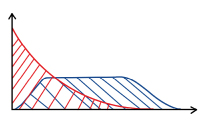
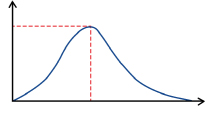
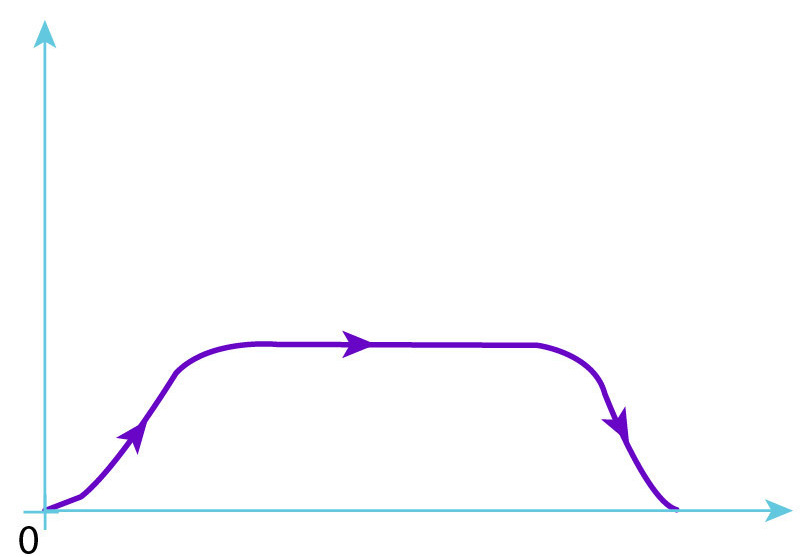
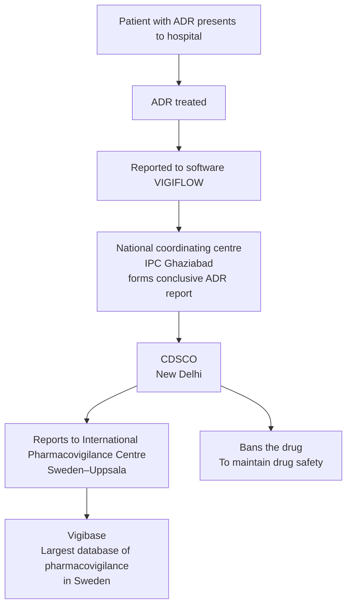

# General Pharmacology

## General Pharmacology : Part 1

### Types of Drugs

#### Orphan drugs

Used for rare diseases → ↓ Profitability.

#### Essential drugs

Meets healthcare needs of the majority of a population.

- Inexpensive.
- Easily available.
- Efficacious.
- Safe.
- Single molecule (Not fixed dose combination).

#### Prescription/legend drugs

Require prescription (Under schedule H).

#### Spurious drugs

Do not produce expected effect as drug component is falsified.

#### Misbranded drugs

Incorrect or missing information on drug label (Produces adequate effect).

#### Adulterated drug

Unwanted additive in drug (Cough syrup : Glycerine contaminated with diethylene glycol → Renal failure).

#### P-drug

- ‘Personal drug’ for any disease.
- STEP criteria to choose P-drug :
  - Safe.
  - Tolerable.
  - Efficacy.
  - ↓ Price.

#### Rational Drug Use

Use of right drug for right disease & patient; at right dose, duration & route with right dispensation & monitoring (“Right price” not included).

### Pharmacokinetics and Pharmacodynamics

#### Pharmacokinetics

Movement of drug through the body (ADME) :

- Absorption.
- Distribution.
- Metabolism.
- Excretion.

#### Pharmacodynamics

Drug induced changes in body via target (DRE : Drug receptor effect).

### Drug Absorption

- M/c mechanism : Passive diffusion.
- ↑ Diffusion : Unionized drug (Same pH of drug and medium) d/t ↑ lipid solubility.
- Maximum absorption Small intestine (Large surface area).

**Pka** : pH where drug 50% ionized & 50% unionized.

#### Oral Absorption

#### Extent and Rate of Absorption

##### Extent of absorption

- Amount of drug absorbed.
- AKA bioavailability (f : Fraction).
- Formula :

$$
\text{Bioavailability} = \frac{AUC_{oral}}{AUC_{IV}}
$$

- Normal range of BA : 0 to 1.
- 100% BA : IV and inhalational gas.
- BA depends on :
  - Bypassing 1st pass metabolism.
  - Absorption.

##### Good oral absorption drugs

Drugs with :

- Small size.
- ↑ Lipid solubility.

##### Poor oral absorption drugs

- Proteins d/t large size.
- Drugs ending with :
  - `-tide` (Octreotide).
  - `-ase` (Asparaginase).
  - `-mab` (Trastuzumab).

##### Rate of absorption

- Amount of drug absorbed per unit of time.
- Determined by $T_{max}$.

- Fastest rate : Inhalational route.

### Role of ATP Binding Cassette (ABC)

- AKA p-glycoprotein (p-GP)/multidrug resistance-1 (MDR-1) pumps.
- Helps in drug efflux.

| Site | Substance excreted by p-GP | Drugs & action on p-GP | Effect of drug |
|---|---|---|---|
| Intestinal cell | Digoxin | Clarithromycin : − Rifampicin : + | Digoxin toxicity Digoxin failure |
| BBB | Loperamide | Quinidine : − | Loperamide induced respiratory depression |
| Hepatocyte | Bile acids | Cyclosporine : − | Cholestasis |
| Tumor cell / bacteria | Anticancer/antibiotics (Cause resistance) | Verapamil : − (Competitive) | Development of resistance |

### Drug Distribution

#### Volume of Distribution (Vd)

**Vd :**

$$
aV_d = \frac{D}{C_0}
$$

- $D$ = Dose of drug via IV route
- $C_0$ = Initial PC (Cmax)

High $V_d$ ≥ 5 L → ↑ Extravascular concentration → tissues/organs (M/c : Adipose tissue).

Low $V_d$ < 5 L → ↑ Intravascular concentration → systemic circulation (plasma).

#### Significance

##### 1. Loading dose (LD)

**i. In IV route :**

$$
D = aV_d \times C_T
$$

$C_T$ = Target PC.

**ii. Other route :**

$$
D \times f = aV_d \times C_T
$$

$$
LD = \frac{aV_d \times C_T}{f}
$$

### Plasma Protein Binding

| Drugs with ↑ Vd (BAD DOC) | Antidote |
|---|---|
| Benzodiazepine | Flumazenil |
| β-blocker | Glucagon |
| Amphetamines | Ammonium chloride |
| Digoxin | Digibind |
| Opioids | Naloxone |
| Organophosphates | Atropine |
| Calcium channel blockers | Calcium gluconate |

#### Proteins

| Albumin (M/c) | Alpha-1-acid glycoprotein |
|---|---|
| Binds to acidic drugs | Binds to basic drugs |
| Aspirin | Opioids |
| Anti-coagulant (Warfarin) | Tricyclic anti-depressants |
| Anti-epileptics / anti-psychotics / anti-depressants | β-blockers |
| Antibiotics (Sulfonamides) | Anti-arrhythmics (Amiodarone/Lidocaine) |

#### Significance

**Hypoalbuminemia d/t :**

1. **↓ Synthesis :**
   - ↓ Drug binding
   - ↑ Free drug
   - ↑ Toxicity.
   - Seen in cirrhosis.

2. **↑ Excretion :**
   - ↑ Drug excretion (Albumin bound)
   - ↑ Failure.
   - Seen in :
     - Nephrotic syndrome.
     - Diabetes mellitus.
     - Chronic kidney disease.

#### Dialysis

- Not effective against high $V_d$ drugs.

### Drug Metabolism

#### Phases

|  | Phase I | Phase II (AKA conjugation) |
|---|---|---|
| **Mechanisms** | Breakdown of drug (D) + addition of functional group (FG) | Conjugate (−ve charged) binds to FG → ionised/water soluble drugs |
| **Reactions** | **ORCHAD :** • Oxidation (M/c) • Reduction • Cyclization • Hydrolysis • Aliphatic and aromatic hydroxylation • Deamination | **GAMS (Mnemonic) :** • Glucuronidation (M/c) • Glycination • Glutathionation • Acetylation • Methylation • Sulfation |
| **Enzyme involved** | CYP450 enzymes : M/c : CYP3A4 | Glucuronyl transferase (GT) : Glucuronidation |
| **Clinical significance** | − | Crigler Najjar syndrome : ↓GT → ↑ Toxicity of: i) Irinotecan ii) Atazanavir |

#### Note: CYP450 enzymes (m/c : CYP3A4)

- **CY** : Cytochrome → Heme protein.
- **P** : Pigments that absorb light of 450 nm wavelength.
- **3** : Family.
- **A** : Sub-family.
- **4** : Gene isoform number.

#### Drug-Enzyme Interaction

|  | Enzyme inducers | Enzyme inhibitors |
|---|---|---|
| **Effect** | Cause drug failure | Cause drug toxicity |
| **Examples** | **Mnemonic : GRAB PC** • Griseofulvin • Rifampicin • Alcohol (Chronic consumption) • Benzopyrene • Phenytoin, Phenobarbital, Primidone • Carbamazepine, Cigarettes | **Mnemonic : QuICK VEG, Dish** • Quinidine • Isoniazid, Protease inhibitors • Cimetidine, Chloramphenicol, Ciprofloxacin • Ketoconazole, Itraconazole, Fluconazole • Valproate • Erythromycin • Grapefruit juice • DEC, Delavirdine, Disulfiram |
| **Important drug interactions** | **Rifampicin :** • OCP failure • C/i in HIV with TB :   - Affects Dolutegravir   - Rx : Double the dose of Dolutegravir or change Rifampicin to Rifabutin | • Erythromycin → Theophylline toxicity • Clarithromycin → Statin toxicity |

### Drugs Metabolised by Plasma Esterase

Quick action of plasma esterase → Short T1/2 of drugs.

**Examples : Plasma Esterase Can Readily Metabolise Short Acting drugs.**

- Procaine, cocaine.
- Esmolol, Landiolol.
- Clevidipine.
- Remifentanil, Remimazolam.
- Mivacurium.
- Succinylcholine.
- Acetylcholine.

### Drug Excretion

- M/c organ : Kidney.
- Differing pH b/w drug & medium → ↑ Ionization → ↑ Water solubility → ↑ Excretion.

#### Significance

**Drug toxicity :**

- Acidic drugs (Aspirin, Phenobarbital) → Alkalinisation of urine with bicarbonate.
- Basic drugs (Amphetamines) → Acidification of urine with ammonium chloride.

#### Mechanisms

- **Tubular secretion (80%)** : Free + plasma protein bound.
- **Filtration (20%)** : Free drug only.

#### Calculations

Aim : Achieve & maintain steady state plasma concentration (SSPC).

**Rate of drug elimination** : Amount of drug excreted per unit of time.

$$
\text{Infusion rate} = \text{Rate of drug elimination}
$$

$$
\text{Rate (in mg/hr)} = PC \times clearance
$$

### Infusion Rate, Maintenance Dose, Half-life and Order of Kinetics

#### Infusion rate (IR)

Amount of drug to be administered per unit of time (∝ Clearance).

$$
IR = \text{Rate of drug elimination} = PC \times clearance
$$

#### Maintenance dose

Dose required to maintain steady state of drug PC (∝ Clearance).

$$
MD = PC \times clearance \times time
$$

#### Half-life

$$
T_{1/2} = \frac{0.693 \times V_d}{clearance}
$$

#### Note: Steady state plasma concentration (SSPC)

- Achieved after 5 $T_{1/2}$s → Start therapeutic drug monitoring (TDM).
- E.g. : $T_{1/2}$ of lithium is 24 hours → TDM on 6th day.

#### Order of kinetics

$$
K_{elimination} = \frac{clearance}{V_d}
$$

|  | Zero order kinetics | First order kinetics |
|---|---|---|
| **Definition** | Constant amount eliminated per hour | Constant proportion eliminated per hour |
| **Effect of ↑ing dose — $T_{1/2}$** | ↑ | Constant |
| **Effect of ↑ing dose — Clearance** | ↓ | Constant |
| **Effect of ↑ing dose — P.C.** | Disproportionate ↑ | Proportionate ↑ |
| **Risk of toxicity on overdosing** | Higher | Lower |
| **Examples** | **Zero ATP Has Made Weak :** • Alcohol • Theophylline, Tolbutamide • Phenytoin • Heparin • Methanol • Warfarin | Most other drugs |

---

## General Pharmacology : Part 2

### Parameters of Pharmacodynamics

Drug binds to receptor → Causes effect.

#### Affinity

- Tendency of a drug to bind to its receptor.
- Marker of dose of drug.

$$
Affinity \propto \frac{1}{Dose}
$$

#### Efficacy

- Maximum effect produced by a drug (Most important factor).
- Marker of effect of drug.

#### Potency

- Relative dose of a drug required to produce particular effect.

$$
Potency \propto \frac{1}{Dose}
$$

### Dose - Response Curve (DRC)

#### Graded DRC

- Individual responses noted.
- Response is graded.
- **Efficacy :** Height of curve (B > A > C).
- **Potency ∝ 1/Dose** (Left shift : A > B > C).
- **Mnemonic : HELP.**
- **Affinity :** Compared only if acting on same receptor (Parallel graph : A > B).

#### Quantal DRC

- Population response noted.
- Response is binary (Yes/No) : E.g. sedation.

**ED50 :**

- Dose required to produce effect in 50% population.
- Marker of potency.

**TD50 :** Dose required to produce toxicity in 50% population.

**LD50 :** Dose required to kill 50% of animals.

> Note : Lethality measured only in animals.

### Therapeutic Index (TI)

- Marker of drug safety (TI ∝ Drug safety).
- In humans :

$$
TI = \frac{TD_{50}}{ED_{50}}
$$

- In animals :

$$
TI = \frac{LD_{50}}{ED_{50}}
$$

- Significance : Small change in dose → Toxicity (Eg : Lithium has ↓ TI).

### Therapeutic Window/Range

More important indicator of toxicity than TI.

**Markers of toxicity :**

- Minimum toxic concentration (Eg : MTC of Li = 1.5 mEq/L)
- Minimum effective concentration (Eg : MEC of Li = 0.6 mEq/L)

### Drug Receptor Interaction

#### Intrinsic efficacy graphs

- Inverse agonist/antagonist (Opposite effect, no effect)
- Antagonist (M/c) (No effect)
- Partial agonist (Submaximal effect)
- Full agonist (Maximal effect)

#### Type of Antagonism

##### Physical/pharmacokinetic antagonism

- Affected by physical binding of antagonist.
- E.g. : Charcoal in alcohol toxicity (Adsorbs alcohol).

##### Chemical antagonism

E.g. :

- Heparin (Negative charge) : Protamine sulphate (Positive charge) → Neutralization.
- Iron : Desferrioxamine (Chelation).

##### Physiological antagonism

- Antagonism at different receptors.
- E.g. :
  - Histamine via H1 → Bronchoconstriction.
  - Adrenaline via β2 → Bronchodilatation.

##### Competitive and non-competitive antagonism

- Competitive antagonism.
- Competitive (Reversible) vs. non-competitive antagonism.

|  | Competitive (Reversible) | Non-competitive |
|---|---|---|
| **Change in graph** | Right shift in DRC | ↓ Height of DRC |
| **Change in reaction** | Vmax : Constant Efficacy : Constant ↑ Km ↓ Potency | ↓ Vmax ↓ Efficacy Km : Constant Potency : Constant |

**Irreversible :**

- Organophosphates.
- Proton pump inhibitors.
- Aspirin.

**Reversible (M/c) :** 99% of drugs.

### Receptors

| Type of receptor         | Sub-types                                                           | Examples                                                                                                                                            |                                                         |
| ------------------------ | ------------------------------------------------------------------- | --------------------------------------------------------------------------------------------------------------------------------------------------- | ------------------------------------------------------- |
| Ligand gated ion channel | —                                                                   | • GABAA • Glutamate (NMDA, AMPA, Kainate) • Nicotinic • 5-HT3                                                                              |                                                         |
| Enzymatic                | Tyrosine kinase receptors                                           | • EGFR (Her-1) • ==Insulin, IGF-1== • ==Toll-like receptors== • VEGFR • ==Her-2==                                                       |                                                         |
| Enzymatic                | Serine/threonine kinase receptors                                   | TGFR                                                                                                                                                |                                                         |
| Enzymatic                | Janus kinase receptors (JAK) : Sub-type of tyrosine kinase receptor | • Cytokine receptors (Eg : Leptin) • ==Prolactin== • ==Growth hormone==                                                                       |                                                         |
| Enzymatic                | ==Guanylyl cyclase== linked receptor                                | ANP & BNP (Vasodilatation)                                                                                                                          |                                                         |
| Nuclear                  | Located in ==nucleus== (TREP)                                       | • ==Thyroid== • Retinoic acid • Retinoid X • ==Estrogen== • ==Progesterone== • ==PPAR== (Peroxisome Proliferator Activated Receptor) |                                                         |
| Nuclear                  | Located in ==cytoplasm==                                            | • Mineralocorticoid • Glucocorticoid • Androgen • Vitamin D                                                                                | Everything being released by/near kidney is Cytoplasmic |

### G-protein coupled receptors (GPCR)
[[02_Autonomic_Nervous_System#G-Protein–Linked Second Messengers|GPCR Receptors of ANS, their Location and function]]
**M/c subunit : α**

| GPCR              | MOA                                                                                                      | Examples                                              | Drugs                                                                                                                  |                                                                                |
| ----------------- | -------------------------------------------------------------------------------------------------------- | ----------------------------------------------------- | ---------------------------------------------------------------------------------------------------------------------- | ------------------------------------------------------------------------------ |
| Gs                | + Adenylate cyclase → ↑ cAMP → Cardiac & skeletal muscles → Contraction; ==Smooth muscles → Relaxation== | β1, β2                                                | —                                                                                                                      | β1, β2 cause ↑ CO and dilate vessels                                           |
| Gq                | + Phospholipase C → ↑ IP3 (2nd messenger) → ↑ Ca²⁺ production → Smooth muscle contraction                | α1, M1, M3                                            | • Oxytocin • Angiotensin                                                                                            | These are stimulatory receptors in a way. remember their function and location |
| Gi/o (Inhibitory) | ↓ cAMP (Gi); ↓ Ca²⁺ (Go); Open K⁺ channels (Gi and Go) → Relaxation                                      | Presynaptic/autoreceptors : M2 (Heart), α2, H3, 5-HT1 | —                                                                                                                      | These are inhibitory as in name                                                |
| G12/13            | + Rho kinase → Smooth muscle contraction                                                                 | —                                                     | **Rho kinase − :** • Fasudil → Angina (Vasodilator) • Netarsudil → Glaucoma • Belumosudil → Immunosuppression |                                                                                |

### Drug Safety

#### Pre-clinical trials

Only on animals.

#### Clinical Trials

- On humans.
- **Investigational New Drug (IND)** : Drug under trial.

#### Phases of a clinical trial

| Phase | Features studied | Target population |
|---|---|---|
| **I** | • Toxicity • Safety • Maximum tolerable dose • Pharmacokinetics, pharmacodynamics | • 20 - 100 healthy volunteers • 1 - 2 years • Open label trial |
| **II** | • Therapeutic exploratory trial/Efficacy trial • Efficacy determined • Dose range/Dose safety • Maximum drug failure | • 100 - 500 patients, unicentric • 2 - 3 years • Randomized control trial (RCT) |
| **III** | • Therapeutic confirmatory trial • Efficacy & safety confirmed • Drug marketed. | • 500 - 3000 patients, multicentric • 3 - 5 years • Drug approved by :   - CDSCO, India   - FDA, USA • RCT/RUCT |
| **IV** | Post marketing surveillance (If ADR is rare/long term) | • Many thousands of pt • No specific duration • Open label |

#### Non-mandatory phases

- **Phase 0 (Microdosing)** : 100 mcg of drug given, bound to radioligand (Assess pharmacokinetics).
- **Phase V (Pharmacoepidemiology)** : Case control study, cohort study etc.

#### Note

- Phase I & phase II done together for toxic drugs like anti-cancer/anti-HIV.
- Patients are taken up directly.
- 20 to 100 patients involved.

### Adverse Drug Reactions

#### Types of ADR

**Mnemonic : ABCDEF.**

| Type | Features | Examples |
|---|---|---|
| **A : Augmented** | • Enhanced effect of drug • Dose dependent | Antihypertensive causing hypotension |
| **B : Bizarre** | • Dose independent | Drug causing hypersensitivity (E.g. : Penicillin) |
| **C : Chronic** | Dose & duration dependent | Steroids HPA suppression, Cushing syndrome |
| **D : Delayed** | Delay in time from exposure to ADR | Drugs causing teratogenicity (E.g. : NTDs d/t Valproate) |
| **E : End-of-use/withdrawal** | D/t stoppage of dose | • Opioid withdrawal • Clonidine withdrawal HTN |
| **F : Failure** | Failure of drug | Enzyme inducers → OCP failure |

### Pharmacovigilance

Sponsored by Govt. of India.

#### Flow of ADR information

### Therapeutic Drug Monitoring

**Principle :** Plasma concentration (PC) correlates to effect/side effect.

#### Indications

1. **Clinical effect not easily quantified** (If quantified TDM not done :
   - Warfarin.
2. **Drugs having low therapeutic index :**
   - Aminoglycosides.
   - Antiepileptics.
   - Lithium.
   - Theophylline.
   - Digoxin.
   - Cyclosporine.
   - Tacrolimus, tricyclic antidepressants.
3. **Drugs with variable metabolism.**
   - E.g. : Metabolised by acetylation.
4. **To check compliance :**
   - E.g. : Antipsychotics.

### Miscellaneous

### Pharmacogenetics

**Mnemonic : A Malignant Gene Causes Very Severe Toxicity.**

#### 1. Acetyl transferase polymorphism

- NAT 1 gene : Fast acetylators (↓ Effect).
- NAT 2 gene : Slow acetylators (↑ Toxicity).

#### 2. Malignant hyperthermia

D/t lignocaine, halothane, succinylcholine (M/c).

#### 3. G-6-PD deficiency associated hemolysis

**Dr. MANIS.**

- Dapsone.
- Methylene blue.
- Antimalarial : Primaquine > Chloroquine > Quinine.
- Nalidixic acid.
- Nitrofurantoin.
- Isoniazid.
- Sulfonamides.

#### 4. Glucuronyl transferase polymorphism

Causing irinotecan toxicity.

#### Drugs metabolized by acetylation

**Mnemonic : HIPS Dance**

- Hydralazine
- Isoniazid
- Procainamide
- Sulfonamides
- Dapsone

All can cause drug induced SLE.

#### 5. CYP450 enzyme polymorphism

- CYP2C19 : Clopidogrel effect.
- CYP2C9 : Variable effects of warfarin.
- CYP2D6 : ↑ Toxicity d/t psychiatric drugs.

#### 6. VKORC1 gene

Variable metabolism of warfarin.

#### 7. Succinylcholine associated prolonged apnea

D/t atypical pseudocholinesterase.

#### 8. Thiopurine methyl transferase polymorphism

Causing toxicity of Azathioprine, 6-Mercaptopurine & 6-Thioguanine.

### Pregnancy Drug Categories

| Drug category | Meaning | Example |
|---|---|---|
| **A > B > C** | Safe + Used in pregnancy | — |
| **D** | Teratogenic risk + Used in pregnancy (Benefit > Risk) | Valproate (Causes neural tube defect) |
| **X** | Teratogenic + Avoided in pregnancy (Risk > Benefit) | Thalidomide (Causes phocomelia) |

### Drug Schedules

| Drug schedule | Features |
|---|---|
| **Schedule G** | Needs medical supervision |
| **Schedule H** | • Needs prescription • “Rx” in black color • “NRx” in red color (Risk of dependence) |
| **Schedule H1 (2013)** | “Rx” in red (Antibiotics) |
| **Schedule X** | • “XRx” in red color • Narcotic and psychotropic drugs : High potential for abuse. • Prescription copy : Retained by retailer for 2 years. • E.g. :   - Amphetamine   - Ketamine   - Methylphenidate |

## First Aid 2025 — Integrated Supplement

### High-Yield Principles

First Aid emphasizes mechanisms and important adverse effects of key drugs rather than obscure derivatives or routine drug selection. Major drug-drug interactions remain important. Associated biochemistry, physiology, and microbiology are useful when studying pharmacology. ANS, CNS, antimicrobial, cardiovascular, and NSAID pharmacology receive strong emphasis, and graph interpretation is testable.

> “Cure sometimes, treat often, and comfort always.” —Hippocrates
>
> “One pill makes you larger, and one pill makes you small.” —Jefferson Airplane, *White Rabbit*
>
> “For the chemistry that works on one patient may not work for the next, because even medicine has its own conditions.” —Suzy Kassem
>
> “Love is the drug I’m thinking of.” —The Bryan Ferry Orchestra

### Drug Effect Modifications

| Term | Definition | Example |
|---|---|---|
| **Additive** | Effect of A + B equals the sum of their individual effects | Aspirin + acetaminophen; 2 + 2 = 4 |
| **Permissive** | A is required for the full effect of B | Cortisol on catecholamine responsiveness |
| **Synergistic** | Effect of A + B is greater than the sum of their individual effects | Clopidogrel + aspirin; 2 + 2 > 4 |
| **Potentiation** | Drug B has no therapeutic action alone but enhances drug A | Carbidopa prevents peripheral levodopa conversion; 2 + 0 > 2 |
| **Antagonistic** | Effect of A + B is less than the sum of their individual effects | Morphine + naloxone; 2 + 2 < 4 |
| **Tachyphylactic** | Acute decrease in response after initial/repeated administration | Repeated oxymetazoline → ↓ response with rebound congestion |

### Enzyme Kinetics

#### Michaelis-Menten kinetics

- **Km** is the substrate concentration needed for an enzyme to reach ½ Vmax and is inversely related to substrate affinity.
- **Vmax** is directly proportional to enzyme concentration.
- Most enzymatic reactions are hyperbolic; a sigmoidal curve usually indicates positive cooperativity in substrate binding (eg, aspartate transcarbamylase).
- `[S]` = substrate concentration; `V` = velocity.

#### Effects of enzyme inhibition

|  | Competitive inhibitor, reversible | Competitive inhibitor, irreversible | Noncompetitive inhibitor |
|---|---|---|---|
| Resembles substrate | Yes | Yes | No |
| Overcome by ↑ [S] | Yes | No | No |
| Binds active site | Yes | Yes | No |
| Effect on Vmax | Unchanged | ↓ | ↓ |
| Effect on Km | ↑ | Unchanged | Unchanged |
| Pharmacodynamic effect | ↓ potency | ↓ efficacy | ↓ efficacy |

#### Lineweaver-Burk plot

- Closer to 0 on the Y-axis → higher Vmax.
- Closer to 0 on the X-axis → higher Km.
- Higher Km → lower affinity.
- Reversible competitive inhibitors and noncompetitive inhibitors have different intersection patterns.
- Competitive inhibitors increase Km.

### Additional Pharmacokinetic Relations

#### Bioavailability

- IV bioavailability = 100%.
- Oral bioavailability is typically <100% because of incomplete absorption and first-pass metabolism.
- AUC-based equation:

$$
F = \frac{AUC_{oral} \times Dose_{IV}}{Dose_{oral} \times AUC_{IV}} \times 100
$$

#### Volume of distribution — compartment model

| Vd | Compartment | Typical drug types |
|---|---|---|
| Low | Intravascular | Large/charged molecules; plasma-protein-bound drugs |
| Medium | Extracellular fluid | Small hydrophilic molecules |
| High | All tissues including fat | Small lipophilic molecules, especially tissue-protein-bound drugs |

Hemodialysis is most effective for drugs with a low Vd.

#### Clearance

$$
CL = \frac{\text{rate of elimination}}{\text{plasma drug concentration}} = V_d \times K_e
$$

Clearance may be impaired with cardiac, hepatic, or renal dysfunction.

#### Half-life and steady state

$$
t_{1/2} = \frac{0.7 \times V_d}{CL}
$$

- First-order elimination reaches steady state after about 4–5 half-lives.
- About 90% of steady state is reached after 3.3 half-lives.
- Time to steady state depends mainly on half-life and is independent of dose and dosing frequency.

| Number of half-lives | 1 | 2 | 3 | 4 |
|---:|---:|---:|---:|---:|
| % remaining | 50% | 25% | 12.5% | 6.25% |

#### Dosage calculations

$$
Loading\ dose = \frac{C_p \times V_d}{F}
$$

$$
Maintenance\ dose = \frac{C_p \times CL \times \tau}{F}
$$

- **Cp** = target plasma concentration.
- **τ** = dosage interval; does not apply to continuous infusions.
- In renal or liver disease, maintenance dose is usually ↓ while loading dose is usually unchanged.

### Drug Metabolism — Additional Points

- Phase I and phase II reactions do not have to occur sequentially.
- Geriatric patients lose **phase I** capacity first.
- Slow acetylators can have ↑ adverse effects with drugs whose metabolism is reduced, classically isoniazid.
- Phase I reactions include reduction, oxidation and hydrolysis.
- Phase II reactions include methylation, glucuronidation, acetylation and sulfation.

### Elimination Kinetics

#### Zero-order elimination

- Constant **amount** of drug eliminated per unit time.
- Plasma concentration falls linearly with time.
- Capacity-limited elimination.
- Examples: phenytoin, ethanol, and aspirin at high/toxic concentrations.

> **PEA** is round, like the “0” in zero-order.

#### First-order elimination

- Constant **fraction** eliminated per unit time.
- Elimination rate is proportional to drug concentration.
- Plasma concentration falls exponentially with time.
- Applies to most drugs.
- Flow-dependent elimination.

### Urine pH and Drug Elimination

- Ionized species are trapped in urine and cleared quickly; neutral forms can be reabsorbed.

#### Weak acids

Examples: phenobarbital, methotrexate and aspirin/salicylates.

$$
RCOOH \rightleftharpoons RCOO^- + H^+
$$

- Treat severe salicylate/weak-acid overdose with **sodium bicarbonate** to alkalinize urine.

#### Weak bases

Examples: tricyclic antidepressants and amphetamines.

$$
RNH_3^+ \rightleftharpoons RNH_2 + H^+
$$

- Weak bases are trapped in acidic environments.
- In severe alkalosis, ammonium chloride may be used to acidify urine.
- TCA toxicity is initially treated with sodium bicarbonate to overcome sodium-channel blockade. This treats cardiac toxicity but does not accelerate elimination.

### pKa

- pKa is the pH at which a weak acid or base is 50% ionized and 50% nonionized.
- Lower pKa → relatively stronger acid.
- Higher pKa → relatively stronger base.

### Efficacy vs Potency

#### Efficacy

- Maximum effect a drug can produce (intrinsic activity).
- Represented by **Emax/y-value**.
- Partial agonists have less efficacy than full agonists.

#### Potency

- Amount of drug needed for a given effect.
- Represented by **EC50/x-value**.
- Left shift → ↓ EC50 → ↑ potency.
- Potency and efficacy are independent.

**EC** = effective concentration.

### Receptor Binding — High-Yield Comparison

| Agonist with | Potency | Efficacy | Key point | Example |
|---|---|---|---|---|
| **Competitive antagonist** | ↓ | Unchanged | Can be overcome by ↑ agonist concentration | Diazepam + flumazenil at GABA-A receptor |
| **Noncompetitive antagonist** | Unchanged | ↓ | Cannot be overcome by ↑ agonist concentration | Norepinephrine + phenoxybenzamine at α-receptors |
| **Partial agonist alone** | Independent | ↓ | Acts at the same site as a full agonist | Morphine vs buprenorphine at μ-opioid receptor |
| **Inverse agonist alone** | Independent | Independent | Binds constitutively active receptor and reduces basal activity | H1 antihistamines such as diphenhydramine |

### Therapeutic Index — Additional Points

**TITE:** Therapeutic Index = TD50 / ED50.

- Higher TI generally indicates a wider safety margin.
- Drugs with lower TI commonly require closer monitoring: warfarin, theophylline, digoxin, antiepileptics and lithium.
- LD50 often replaces TD50 in animal studies.
- **Therapeutic window:** range of drug concentrations that can safely and effectively treat disease.

### Age-Related Changes in Pharmacokinetics

| Process | Age-related change | Consequence |
|---|---|---|
| Absorption | Mostly unaffected | Usually little change |
| Distribution | ↓ total body water; ↑ total body fat | Hydrophilic drugs: ↓ Vd → ↑ concentration; lipophilic drugs: ↑ Vd → ↑ half-life |
| Metabolism | ↓ hepatic mass and blood flow; phase I ↓, phase II relatively preserved | ↓ first-pass metabolism and ↓ hepatic clearance |
| Excretion | ↓ renal mass, blood flow and GFR | ↓ renal clearance |

### Selected Toxicity Treatments and Antidotes

| Toxin / drug | Treatment |
|---|---|
| Acetaminophen | N-acetylcysteine |
| AChE inhibitors / organophosphates | Atropine > pralidoxime |
| Antimuscarinic toxicity | Physostigmine; control hyperthermia |
| Arsenic | Dimercaprol, succimer |
| Benzodiazepines | Flumazenil |
| β-blockers | Atropine, glucagon, saline |
| Carbon monoxide | 100% O₂; hyperbaric O₂ |
| Copper | Penicillamine, trientine |
| Cyanide | Hydroxocobalamin; nitrites + sodium thiosulfate |
| Dabigatran | Idarucizumab |
| Digoxin | Digoxin-specific antibody fragments |
| Direct factor Xa inhibitors | Andexanet alfa |
| Heparin | Protamine sulfate |
| Iron | Deferoxamine, deferasirox, deferiprone |
| Lead | Penicillamine, calcium disodium EDTA, dimercaprol, succimer |
| Mercury | Dimercaprol, succimer |
| Methanol / ethylene glycol | Fomepizole > ethanol; dialysis |
| Methemoglobin | Methylene blue; vitamin C |
| Methotrexate | Leucovorin |
| Opioids | Naloxone |
| Salicylates | Sodium bicarbonate; dialysis |
| TCAs | Sodium bicarbonate |
| Warfarin | Vitamin K; PCC/FFP for immediate reversal |

### Drugs Affecting Pupil Size

- **Mydriasis:** anticholinergics and direct sympathomimetics.
- **Miosis:** sympatholytics/α₂ agonists, opioids except meperidine, parasympathomimetics such as pilocarpine, organophosphates; indirect sympathomimetics such as amphetamines and cocaine can also produce mydriasis.
- Radial muscle contraction is **α1 mediated**.
- Sphincter muscle contraction is **M3 mediated**.

### Cytochrome P-450 Interactions — Selected

| Inducers (+) | Substrates | Inhibitors (−) |
|---|---|---|
| St. John’s wort | Theophylline | Sodium valproate |
| Phenytoin | OCPs | Isoniazid |
| Phenobarbital | Antiepileptics | Cimetidine |
| Modafinil | Warfarin | Ketoconazole |
| Nevirapine | | Fluconazole |
| Rifampin | | Acute alcohol overuse |
| Griseofulvin | | Chloramphenicol |
| Carbamazepine | | Erythromycin / clarithromycin |
| Chronic alcohol overuse | | Sulfonamides |
| | | Ciprofloxacin |
| | | Omeprazole |
| | | Amiodarone |
| | | Ritonavir |
| | | Grapefruit juice |

> The OCPs are anti-war.
>
> SICK FACES come when I am really drinking grapefruit juice.

### Sulfa Drugs — Selected Facts

Sulfonamide-related drugs include sulfonamide antibiotics, sulfasalazine, probenecid, furosemide, acetazolamide, celecoxib, thiazides and sulfonylureas.

Reported reactions include fever, urinary symptoms, Stevens-Johnson syndrome, hemolytic anemia, thrombocytopenia, agranulocytosis, acute interstitial nephritis, urticaria and photosensitivity.

### Drug Names — Selected Suffixes

| Ending | Category | Example |
|---|---|---|
| **-asvir** | NS5A inhibitor | Ledipasvir |
| **-bendazole** | Antiparasitic / antihelminthic | Mebendazole |
| **-buvir** | NS5B inhibitor | Sofosbuvir |
| **-cillin** | Transpeptidase inhibitor | Ampicillin |
| **-conazole** | Ergosterol synthesis inhibitor | Ketoconazole |
| **-cycline** | Protein synthesis inhibitor | Tetracycline |
| **-floxacin** | Fluoroquinolone | Ciprofloxacin |
| **-mivir** | Neuraminidase inhibitor | Oseltamivir |
| **-navir** | Protease inhibitor | Ritonavir |
| **-ovir** | Viral DNA polymerase inhibitor | Acyclovir |
| **-previr** | NS3/4A inhibitor | Grazoprevir |
| **-tegravir** | Integrase inhibitor | Dolutegravir |
| **-thromycin** | Macrolide | Azithromycin |
| **-case** | Recombinant uricase | Rasburicase |
| **-mustine** | Nitrosourea | Carmustine |
| **-platin** | Platinum compound | Cisplatin |
| **-poside** | Topoisomerase II inhibitor | Etoposide |
| **-rubicin** | Anthracycline | Doxorubicin |
| **-taxel** | Taxane | Paclitaxel |
| **-tecan** | Topoisomerase I inhibitor | Irinotecan |
| **-flurane** | Inhaled anesthetic | Sevoflurane |
| **-apine / -idone** | Atypical antipsychotic | Quetiapine / risperidone |
| **-azine** | Typical antipsychotic | Thioridazine |
| **-barbital** | Barbiturate | Phenobarbital |
| **-benazine** | VMAT inhibitor | Tetrabenazine |
| **-caine** | Local anesthetic | Lidocaine |
| **-capone** | COMT inhibitor | Entacapone |
| **-curium / -curonium** | Nondepolarizing NM blocker | Atracurium / pancuronium |
| **-giline** | MAO-B inhibitor | Selegiline |
| **-ipramine / -triptyline** | TCA | Imipramine / amitriptyline |
| **-triptan** | 5-HT1B/1D agonist | Sumatriptan |
| **-zepam / -zolam** | Benzodiazepine | Diazepam / alprazolam |
| **-chol** | Cholinergic agonist | Bethanechol |
| **-olol** | β-blocker | Propranolol |
| **-stigmine** | AChE inhibitor | Neostigmine |
| **-terol** | β2 agonist | Albuterol |
| **-zosin** | α1 blocker | Prazosin |
| **-afil** | PDE-5 inhibitor | Sildenafil |
| **-dipine** | Dihydropyridine Ca²⁺ channel blocker | Amlodipine |
| **-parin** | Low-molecular-weight heparin | Enoxaparin |
| **-plase** | Thrombolytic | Alteplase |
| **-pril** | ACE inhibitor | Captopril |
| **-sartan** | Angiotensin-II receptor blocker | Losartan |
| **-xaban** | Direct factor Xa inhibitor | Apixaban |
| **-gliflozin** | SGLT-2 inhibitor | Dapagliflozin |
| **-glinide** | Meglitinide | Repaglinide |
| **-gliptin** | DPP-4 inhibitor | Sitagliptin |
| **-glitazone** | PPAR-γ activator | Pioglitazone |
| **-glutide** | GLP-1 analog | Liraglutide |
| **-statin** | HMG-CoA reductase inhibitor | Atorvastatin |
| **-caftor** | CFTR modulator | Lumacaftor |
| **-dronate** | Bisphosphonate | Alendronate |
| **-lukast** | CysLT1 receptor blocker | Montelukast |
| **-lutamide** | Androgen receptor inhibitor | Flutamide |
| **-pitant** | NK1 blocker | Aprepitant |
| **-prazole** | Proton pump inhibitor | Omeprazole |
| **-prost** | Prostaglandin analog | Latanoprost |
| **-sentan** | Endothelin receptor antagonist | Bosentan |
| **-setron** | 5-HT3 blocker | Ondansetron |
| **-steride** | 5α-reductase inhibitor | Finasteride |
| **-tadine** | H1 antagonist | Loratadine |
| **-tidine** | H2 antagonist | Cimetidine |
| **-trozole** | Aromatase inhibitor | Anastrozole |
| **-vaptan** | ADH antagonist | Tolvaptan |

### Ingested Seafood Toxins

| Toxin | Source | Key mechanism | Important features | Treatment |
|---|---|---|---|---|
| **Histamine / scombroid** | Spoiled dark-meat fish such as tuna, mahi-mahi, mackerel and bonito | Bacterial histidine decarboxylase converts histidine to histamine | Mimics anaphylaxis: oral burning, flushing, erythema, urticaria, itching; may progress to bronchospasm, angioedema, hypotension | Antihistamines; albuterol ± epinephrine |
| **Tetrodotoxin** | Pufferfish | Blocks fast voltage-gated Na⁺ channels in nerve tissue | Nausea, diarrhea, paresthesias, weakness, dizziness, loss of reflexes | Supportive |
| **Ciguatoxin** | Reef fish such as barracuda, snapper and moray eel | Opens Na⁺ channels → depolarization | Nausea/vomiting/diarrhea, perioral numbness, hot-cold reversal, bradycardia, heart block, hypotension | Supportive |

### Multiorgan Drug Reactions

| Reaction | Important causative agents | Mnemonic / note |
|---|---|---|
| **Antimuscarinic syndrome** | Atropine, TCAs, H1 blockers, antipsychotics | — |
| **Disulfiram-like reaction** | 1st-generation sulfonylureas, procarbazine, certain cephalosporins, griseofulvin, metronidazole | “Sorry pals, can’t go mingle” |

### Additional Source Mnemonics

- **Cytochrome P-450 inducers:** “St. John’s funny funny (phen-phen) mom never refuses greasy carbs and chronic alcohol.”
- **CYP substrates:** “The OCPs are anti-war.”
- **CYP inhibitors:** “SICK FACES come when I am really drinking grapefruit juice.”
- **Sulfa drugs:** “Scary Sulfa Pharm FACTS.”

### Pupil-Size Details

- **Mydriasis:** anticholinergics (eg, atropine, TCAs, tropicamide, scopolamine, antihistamines) and direct sympathomimetics.
- **Miosis:** indirect sympathomimetics can be associated with mydriasis rather than miosis; the source specifically lists amphetamines, cocaine, LSD and meperidine with the mydriatic group. Sympatholytics such as α₂ agonists, opioids except meperidine, parasympathomimetics such as pilocarpine and organophosphates are in the miosis group.
- **Radial muscle contraction:** α1 receptor mediated.
- **Sphincter muscle contraction:** M3 receptor mediated.
