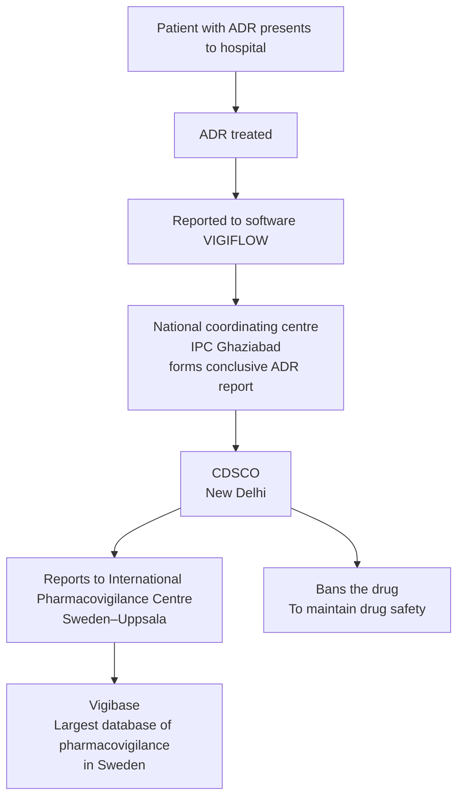

# General Pharmacology

## General Pharmacology : Part 1

### Types of Drugs

#### Orphan drugs

Used for rare diseases → ↓ Profitability.

#### Essential drugs

Meets healthcare needs of the majority of a population.

- Inexpensive.
- Easily available.
- Efficacious.
- Safe.
- Single molecule (Not fixed dose combination).

#### Prescription/legend drugs

Require prescription (Under schedule H).

#### Spurious drugs

Do not produce expected effect as drug component is falsified.

#### Misbranded drugs

Incorrect or missing information on drug label (Produces adequate effect).

#### Adulterated drug

Unwanted additive in drug (Cough syrup : Glycerine contaminated with diethylene glycol → Renal failure).

#### P-drug

- ‘Personal drug’ for any disease.
- STEP criteria to choose P-drug :
  - Safe.
  - Tolerable.
  - Efficacy.
  - ↓ Price.

#### Rational Drug Use

Use of right drug for right disease & patient; at right dose, duration & route with right dispensation & monitoring (“Right price” not included).

### Pharmacokinetics and Pharmacodynamics

#### Pharmacokinetics

Movement of drug through the body (ADME) :

- Absorption.
- Distribution.
- Metabolism.
- Excretion.

#### Pharmacodynamics

Drug induced changes in body via target (DRE : Drug receptor effect).

### Drug Absorption

- M/c mechanism : Passive diffusion.
- ↑ Diffusion : Unionized drug (Same pH of drug and medium) d/t ↑ lipid solubility.
- Maximum absorption Small intestine (Large surface area).

**Pka** : pH where drug 50% ionized & 50% unionized.

#### Oral Absorption

#### Extent and Rate of Absorption

##### Extent of absorption

- Amount of drug absorbed.
- AKA bioavailability (f : Fraction).
- Formula :

$$
\text{Bioavailability} = \frac{AUC_{oral}}{AUC_{IV}}
$$

- Normal range of BA : 0 to 1.
- 100% BA : IV and inhalational gas.
- BA depends on :
  - Bypassing 1st pass metabolism.
  - Absorption.

##### Good oral absorption drugs

Drugs with :

- Small size.
- ↑ Lipid solubility.

##### Poor oral absorption drugs

- Proteins d/t large size.
- Drugs ending with :
  - `-tide` (Octreotide).
  - `-ase` (Asparaginase).
  - `-mab` (Trastuzumab).

##### Rate of absorption

- Amount of drug absorbed per unit of time.
- Determined by $T_{max}$.

- Fastest rate : Inhalational route.

### Role of ATP Binding Cassette (ABC)

- AKA p-glycoprotein (p-GP)/multidrug resistance-1 (MDR-1) pumps.
- Helps in drug efflux.

| Site | Substance excreted by p-GP | Drugs & action on p-GP | Effect of drug |
|---|---|---|---|
| Intestinal cell | Digoxin | Clarithromycin : − Rifampicin : + | Digoxin toxicity Digoxin failure |
| BBB | Loperamide | Quinidine : − | Loperamide induced respiratory depression |
| Hepatocyte | Bile acids | Cyclosporine : − | Cholestasis |
| Tumor cell / bacteria | Anticancer/antibiotics (Cause resistance) | Verapamil : − (Competitive) | Development of resistance |

### Drug Distribution

#### Volume of Distribution (Vd)

**Vd :**

$$
aV_d = \frac{D}{C_0}
$$

- $D$ = Dose of drug via IV route
- $C_0$ = Initial PC (Cmax)

High $V_d$ ≥ 5 L → ↑ Extravascular concentration → tissues/organs (M/c : Adipose tissue).

Low $V_d$ < 5 L → ↑ Intravascular concentration → systemic circulation (plasma).

#### Significance

##### 1. Loading dose (LD)

**i. In IV route :**

$$
D = aV_d \times C_T
$$

$C_T$ = Target PC.

**ii. Other route :**

$$
D \times f = aV_d \times C_T
$$

$$
LD = \frac{aV_d \times C_T}{f}
$$

### Plasma Protein Binding

| Drugs with ↑ Vd (BAD DOC) | Antidote |
|---|---|
| Benzodiazepine | Flumazenil |
| β-blocker | Glucagon |
| Amphetamines | Ammonium chloride |
| Digoxin | Digibind |
| Opioids | Naloxone |
| Organophosphates | Atropine |
| Calcium channel blockers | Calcium gluconate |

#### Proteins

| Albumin (M/c) | Alpha-1-acid glycoprotein |
|---|---|
| Binds to acidic drugs | Binds to basic drugs |
| Aspirin | Opioids |
| Anti-coagulant (Warfarin) | Tricyclic anti-depressants |
| Anti-epileptics / anti-psychotics / anti-depressants | β-blockers |
| Antibiotics (Sulfonamides) | Anti-arrhythmics (Amiodarone/Lidocaine) |

#### Significance

**Hypoalbuminemia d/t :**

1. **↓ Synthesis :**
   - ↓ Drug binding
   - ↑ Free drug
   - ↑ Toxicity.
   - Seen in cirrhosis.

2. **↑ Excretion :**
   - ↑ Drug excretion (Albumin bound)
   - ↑ Failure.
   - Seen in :
     - Nephrotic syndrome.
     - Diabetes mellitus.
     - Chronic kidney disease.

#### Dialysis

- Not effective against high $V_d$ drugs.

### Drug Metabolism

#### Phases

|  | Phase I | Phase II (AKA conjugation) |
|---|---|---|
| **Mechanisms** | Breakdown of drug (D) + addition of functional group (FG) | Conjugate (−ve charged) binds to FG → ionised/water soluble drugs |
| **Reactions** | **ORCHAD :** • Oxidation (M/c) • Reduction • Cyclization • Hydrolysis • Aliphatic and aromatic hydroxylation • Deamination | **GAMS (Mnemonic) :** • Glucuronidation (M/c) • Glycination • Glutathionation • Acetylation • Methylation • Sulfation |
| **Enzyme involved** | CYP450 enzymes : M/c : CYP3A4 | Glucuronyl transferase (GT) : Glucuronidation |
| **Clinical significance** | − | Crigler Najjar syndrome : ↓GT → ↑ Toxicity of: i) Irinotecan ii) Atazanavir |

#### Note: CYP450 enzymes (m/c : CYP3A4)

- **CY** : Cytochrome → Heme protein.
- **P** : Pigments that absorb light of 450 nm wavelength.
- **3** : Family.
- **A** : Sub-family.
- **4** : Gene isoform number.

#### Drug-Enzyme Interaction

|  | Enzyme inducers | Enzyme inhibitors |
|---|---|---|
| **Effect** | Cause drug failure | Cause drug toxicity |
| **Examples** | **Mnemonic : GRAB PC** • Griseofulvin • Rifampicin • Alcohol (Chronic consumption) • Benzopyrene • Phenytoin, Phenobarbital, Primidone • Carbamazepine, Cigarettes | **Mnemonic : QuICK VEG, Dish** • Quinidine • Isoniazid, Protease inhibitors • Cimetidine, Chloramphenicol, Ciprofloxacin • Ketoconazole, Itraconazole, Fluconazole • Valproate • Erythromycin • Grapefruit juice • DEC, Delavirdine, Disulfiram |
| **Important drug interactions** | **Rifampicin :** • OCP failure • C/i in HIV with TB :   - Affects Dolutegravir   - Rx : Double the dose of Dolutegravir or change Rifampicin to Rifabutin | • Erythromycin → Theophylline toxicity • Clarithromycin → Statin toxicity |

### Drugs Metabolised by Plasma Esterase

Quick action of plasma esterase → Short T1/2 of drugs.

**Examples : Plasma Esterase Can Readily Metabolise Short Acting drugs.**

- Procaine, cocaine.
- Esmolol, Landiolol.
- Clevidipine.
- Remifentanil, Remimazolam.
- Mivacurium.
- Succinylcholine.
- Acetylcholine.

### Drug Excretion

- M/c organ : Kidney.
- Differing pH b/w drug & medium → ↑ Ionization → ↑ Water solubility → ↑ Excretion.

#### Significance

**Drug toxicity :**

- Acidic drugs (Aspirin, Phenobarbital) → Alkalinisation of urine with bicarbonate.
- Basic drugs (Amphetamines) → Acidification of urine with ammonium chloride.

#### Mechanisms

- **Tubular secretion (80%)** : Free + plasma protein bound.
- **Filtration (20%)** : Free drug only.

#### Calculations

Aim : Achieve & maintain steady state plasma concentration (SSPC).

**Rate of drug elimination** : Amount of drug excreted per unit of time.

$$
\text{Infusion rate} = \text{Rate of drug elimination}
$$

$$
\text{Rate (in mg/hr)} = PC \times clearance
$$

### Infusion Rate, Maintenance Dose, Half-life and Order of Kinetics

#### Infusion rate (IR)

Amount of drug to be administered per unit of time (∝ Clearance).

$$
IR = \text{Rate of drug elimination} = PC \times clearance
$$

#### Maintenance dose

Dose required to maintain steady state of drug PC (∝ Clearance).

$$
MD = PC \times clearance \times time
$$

#### Half-life

$$
T_{1/2} = \frac{0.693 \times V_d}{clearance}
$$

#### Note: Steady state plasma concentration (SSPC)

- Achieved after 5 $T_{1/2}$s → Start therapeutic drug monitoring (TDM).
- E.g. : $T_{1/2}$ of lithium is 24 hours → TDM on 6th day.

#### Order of kinetics

$$
K_{elimination} = \frac{clearance}{V_d}
$$

|  | Zero order kinetics | First order kinetics |
|---|---|---|
| **Definition** | Constant amount eliminated per hour | Constant proportion eliminated per hour |
| **Effect of ↑ing dose — $T_{1/2}$** | ↑ | Constant |
| **Effect of ↑ing dose — Clearance** | ↓ | Constant |
| **Effect of ↑ing dose — P.C.** | Disproportionate ↑ | Proportionate ↑ |
| **Risk of toxicity on overdosing** | Higher | Lower |
| **Examples** | **Zero ATP Has Made Weak :** • Alcohol • Theophylline, Tolbutamide • Phenytoin • Heparin • Methanol • Warfarin | Most other drugs |

---

## General Pharmacology : Part 2

### Parameters of Pharmacodynamics

Drug binds to receptor → Causes effect.

#### Affinity

- Tendency of a drug to bind to its receptor.
- Marker of dose of drug.

$$
Affinity \propto \frac{1}{Dose}
$$

#### Efficacy

- Maximum effect produced by a drug (Most important factor).
- Marker of effect of drug.

#### Potency

- Relative dose of a drug required to produce particular effect.

$$
Potency \propto \frac{1}{Dose}
$$

### Dose - Response Curve (DRC)

#### Graded DRC

- Individual responses noted.
- Response is graded.
- **Efficacy :** Height of curve (B > A > C).
- **Potency ∝ 1/Dose** (Left shift : A > B > C).
- **Mnemonic : HELP.**
- **Affinity :** Compared only if acting on same receptor (Parallel graph : A > B).

#### Quantal DRC

- Population response noted.
- Response is binary (Yes/No) : E.g. sedation.

**ED50 :**

- Dose required to produce effect in 50% population.
- Marker of potency.

**TD50 :** Dose required to produce toxicity in 50% population.

**LD50 :** Dose required to kill 50% of animals.

> Note : Lethality measured only in animals.

### Therapeutic Index (TI)

- Marker of drug safety (TI ∝ Drug safety).
- In humans :

$$
TI = \frac{TD_{50}}{ED_{50}}
$$

- In animals :

$$
TI = \frac{LD_{50}}{ED_{50}}
$$

- Significance : Small change in dose → Toxicity (Eg : Lithium has ↓ TI).

### Therapeutic Window/Range

More important indicator of toxicity than TI.

**Markers of toxicity :**

- Minimum toxic concentration (Eg : MTC of Li = 1.5 mEq/L)
- Minimum effective concentration (Eg : MEC of Li = 0.6 mEq/L)

### Drug Receptor Interaction

#### Intrinsic efficacy graphs

- Inverse agonist/antagonist (Opposite effect, no effect)
- Antagonist (M/c) (No effect)
- Partial agonist (Submaximal effect)
- Full agonist (Maximal effect)

#### Type of Antagonism

##### Physical/pharmacokinetic antagonism

- Affected by physical binding of antagonist.
- E.g. : Charcoal in alcohol toxicity (Adsorbs alcohol).

##### Chemical antagonism

E.g. :

- Heparin (Negative charge) : Protamine sulphate (Positive charge) → Neutralization.
- Iron : Desferrioxamine (Chelation).

##### Physiological antagonism

- Antagonism at different receptors.
- E.g. :
  - Histamine via H1 → Bronchoconstriction.
  - Adrenaline via β2 → Bronchodilatation.

##### Competitive and non-competitive antagonism

- Competitive antagonism.
- Competitive (Reversible) vs. non-competitive antagonism.

|  | Competitive (Reversible) | Non-competitive |
|---|---|---|
| **Change in graph** | Right shift in DRC | ↓ Height of DRC |
| **Change in reaction** | Vmax : Constant Efficacy : Constant ↑ Km ↓ Potency | ↓ Vmax ↓ Efficacy Km : Constant Potency : Constant |

**Irreversible :**

- Organophosphates.
- Proton pump inhibitors.
- Aspirin.

**Reversible (M/c) :** 99% of drugs.

### Receptors

| Type of receptor | Sub-types | Examples |
|---|---|---|
| Ligand gated ion channel | — | • GABAA • Glutamate (NMDA, AMPA, Kainate) • Nicotinic • 5-HT3 |
| Enzymatic | Tyrosine kinase receptors | • EGFR (Her-1) • Insulin, IGF-1 • Toll-like receptors • VEGFR • Her-2 |
| Enzymatic | Serine/threonine kinase receptors | TGFR |
| Enzymatic | Janus kinase receptors (JAK) : Sub-type of tyrosine kinase receptor | • Cytokine receptors (Eg : Leptin) • Prolactin • Growth hormone |
| Enzymatic | Guanylyl cyclase linked receptor | ANP & BNP (Vasodilatation) |
| Nuclear | Located in nucleus (TREP) | • Thyroid • Retinoic acid • Retinoid X • Estrogen • Progesterone • PPAR (Peroxisome Proliferator Activated Receptor) |
| Nuclear | Located in cytoplasm | • Mineralocorticoid • Glucocorticoid • Androgen • Vitamin D |

### G-protein coupled receptors (GPCR)

**M/c subunit : α**

| GPCR | MOA | Examples | Drugs |
|---|---|---|---|
| Gs | + Adenylate cyclase → ↑ cAMP → Cardiac & skeletal muscles → Contraction; Smooth muscles → Relaxation | β1, β2 | — |
| Gq | + Phospholipase C → ↑ IP3 (2nd messenger) → ↑ Ca²⁺ production → Smooth muscle contraction | α1, M1, M3 | • Oxytocin • Angiotensin |
| Gi/o (Inhibitory) | ↓ cAMP (Gi); ↓ Ca²⁺ (Go); Open K⁺ channels (Gi and Go) → Relaxation | Presynaptic/autoreceptors : M2 (Heart), α2, H3, 5-HT1 | — |
| G12/13 | + Rho kinase → Smooth muscle contraction | — | **Rho kinase − :** • Fasudil → Angina (Vasodilator) • Netarsudil → Glaucoma • Belumosudil → Immunosuppression |

### Drug Safety

#### Pre-clinical trials

Only on animals.

#### Clinical Trials

- On humans.
- **Investigational New Drug (IND)** : Drug under trial.

#### Phases of a clinical trial

| Phase | Features studied | Target population |
|---|---|---|
| **I** | • Toxicity • Safety • Maximum tolerable dose • Pharmacokinetics, pharmacodynamics | • 20 - 100 healthy volunteers • 1 - 2 years • Open label trial |
| **II** | • Therapeutic exploratory trial/Efficacy trial • Efficacy determined • Dose range/Dose safety • Maximum drug failure | • 100 - 500 patients, unicentric • 2 - 3 years • Randomized control trial (RCT) |
| **III** | • Therapeutic confirmatory trial • Efficacy & safety confirmed • Drug marketed. | • 500 - 3000 patients, multicentric • 3 - 5 years • Drug approved by :   - CDSCO, India   - FDA, USA • RCT/RUCT |
| **IV** | Post marketing surveillance (If ADR is rare/long term) | • Many thousands of pt • No specific duration • Open label |

#### Non-mandatory phases

- **Phase 0 (Microdosing)** : 100 mcg of drug given, bound to radioligand (Assess pharmacokinetics).
- **Phase V (Pharmacoepidemiology)** : Case control study, cohort study etc.

#### Note

- Phase I & phase II done together for toxic drugs like anti-cancer/anti-HIV.
- Patients are taken up directly.
- 20 to 100 patients involved.

### Adverse Drug Reactions

#### Types of ADR

**Mnemonic : ABCDEF.**

| Type | Features | Examples |
|---|---|---|
| **A : Augmented** | • Enhanced effect of drug • Dose dependent | Antihypertensive causing hypotension |
| **B : Bizarre** | • Dose independent | Drug causing hypersensitivity (E.g. : Penicillin) |
| **C : Chronic** | Dose & duration dependent | Steroids HPA suppression, Cushing syndrome |
| **D : Delayed** | Delay in time from exposure to ADR | Drugs causing teratogenicity (E.g. : NTDs d/t Valproate) |
| **E : End-of-use/withdrawal** | D/t stoppage of dose | • Opioid withdrawal • Clonidine withdrawal HTN |
| **F : Failure** | Failure of drug | Enzyme inducers → OCP failure |

### Pharmacovigilance

Sponsored by Govt. of India.

#### Flow of ADR information

### Therapeutic Drug Monitoring

**Principle :** Plasma concentration (PC) correlates to effect/side effect.

#### Indications

1. **Clinical effect not easily quantified** (If quantified TDM not done :
   - Warfarin.
2. **Drugs having low therapeutic index :**
   - Aminoglycosides.
   - Antiepileptics.
   - Lithium.
   - Theophylline.
   - Digoxin.
   - Cyclosporine.
   - Tacrolimus, tricyclic antidepressants.
3. **Drugs with variable metabolism.**
   - E.g. : Metabolised by acetylation.
4. **To check compliance :**
   - E.g. : Antipsychotics.

### Miscellaneous

### Pharmacogenetics

**Mnemonic : A Malignant Gene Causes Very Severe Toxicity.**

#### 1. Acetyl transferase polymorphism

- NAT 1 gene : Fast acetylators (↓ Effect).
- NAT 2 gene : Slow acetylators (↑ Toxicity).

#### 2. Malignant hyperthermia

D/t lignocaine, halothane, succinylcholine (M/c).

#### 3. G-6-PD deficiency associated hemolysis

**Dr. MANIS.**

- Dapsone.
- Methylene blue.
- Antimalarial : Primaquine > Chloroquine > Quinine.
- Nalidixic acid.
- Nitrofurantoin.
- Isoniazid.
- Sulfonamides.

#### 4. Glucuronyl transferase polymorphism

Causing irinotecan toxicity.

#### Drugs metabolized by acetylation

**Mnemonic : HIPS Dance**

- Hydralazine
- Isoniazid
- Procainamide
- Sulfonamides
- Dapsone

All can cause drug induced SLE.

#### 5. CYP450 enzyme polymorphism

- CYP2C19 : Clopidogrel effect.
- CYP2C9 : Variable effects of warfarin.
- CYP2D6 : ↑ Toxicity d/t psychiatric drugs.

#### 6. VKORC1 gene

Variable metabolism of warfarin.

#### 7. Succinylcholine associated prolonged apnea

D/t atypical pseudocholinesterase.

#### 8. Thiopurine methyl transferase polymorphism

Causing toxicity of Azathioprine, 6-Mercaptopurine & 6-Thioguanine.

### Pregnancy Drug Categories

| Drug category | Meaning | Example |
|---|---|---|
| **A > B > C** | Safe + Used in pregnancy | — |
| **D** | Teratogenic risk + Used in pregnancy (Benefit > Risk) | Valproate (Causes neural tube defect) |
| **X** | Teratogenic + Avoided in pregnancy (Risk > Benefit) | Thalidomide (Causes phocomelia) |

### Drug Schedules

| Drug schedule | Features |
|---|---|
| **Schedule G** | Needs medical supervision |
| **Schedule H** | • Needs prescription • “Rx” in black color • “NRx” in red color (Risk of dependence) |
| **Schedule H1 (2013)** | “Rx” in red (Antibiotics) |
| **Schedule X** | • “XRx” in red color • Narcotic and psychotropic drugs : High potential for abuse. • Prescription copy : Retained by retailer for 2 years. • E.g. :   - Amphetamine   - Ketamine   - Methylphenidate |
