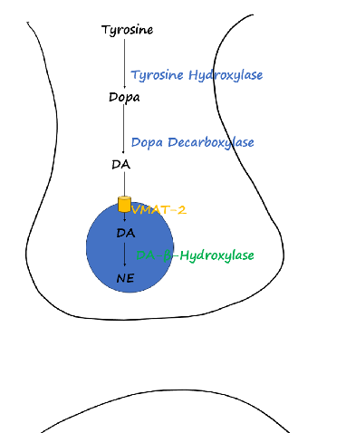
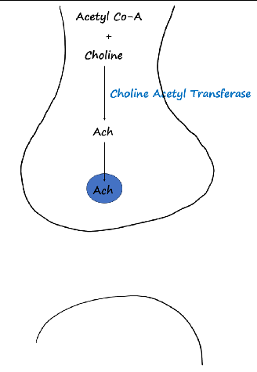
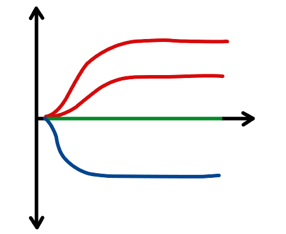
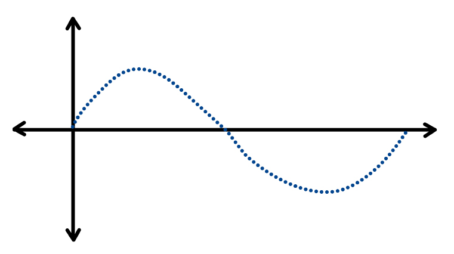
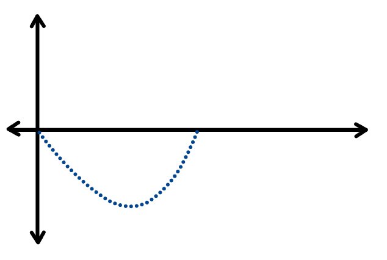
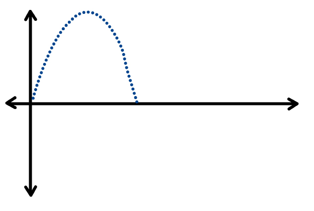

# Drugs Acting on Autonomic Nervous System

## Regulation of ANS

|                      | Parasympathetic NS                | Sympathetic NS                                                                         |
| -------------------- | --------------------------------- | -------------------------------------------------------------------------------------- |
| **Receptors**        | Muscarinic (M/c: M₃) or nicotinic | α or β                                                                                 |
| **Neurotransmitter** | Acetylcholine (ACh)               | Norepinephrine (NE)                                                                    |
| **Exceptions**       | ACh in adrenals & sweat glands    | Dopamine → D₁ in renal blood vessels → vasodilation (diuresis); ACh → PreGanglionic |

## Neurotransmitters of ANS

### Acetylcholine (ACh)
**Drugs ↓ing ACh → neuromuscular toxicity (breathing difficulties).**
#### Acetylcholine Receptors
**Nicotinic ACh receptors** are **ligand-gated channels** with K⁺ efflux and Na⁺ influx; some also permit Ca²⁺ influx.
- **Nₙ** — autonomic ganglia and adrenal medulla.
- **Nₘ** — neuromuscular junction of skeletal muscle.

**Muscarinic ACh receptors** are G-protein-coupled receptors acting through second messengers; M1–M5 occur in the heart, smooth muscle, brain, exocrine glands and cholinergic sympathetic sweat glands.

| Receptor | G-protein | Major Distribution                                                                                                                              | Major functions                                                                                                      | Memory Hook     |
| -------- | --------- | :---------------------------------------------------------------------------------------------------------------------------------------------- | -------------------------------------------------------------------------------------------------------------------- | --------------- |
| **M1**   | Gq        | Brain Enteric Nervous System                                                                                                                 | Higher cognition, enteric activation,  ↑ exocrine secretion                                                    | Nervous tissue  |
| **M2**   | Gi        | Heart (SAN, AVN, Atrial myocardium)                                                                                                             | ↓ HR, AV-node conduction and atrial contractility                                                                    | Heart           |
| **M3**   | Gq        | - Exocrine Glands  - Bronchial Smooth muscles - GI Smooth Muscles - Bladder Detrussor - Eye - Vascular Endothelium (produces NO) | ↑ exocrine secretion, gut peristalsis, bladder contraction, bronchoconstriction, vasodilation, miosis, accommodation | Everything else |

### NE/Dopamine (DA)
#### Illustrations
    

> Tyrosine Hydroxylase → rate limiting step
> VMAT transports DA into vesicles where it is converted into NE

| Receptor                      | G-protein | Major functions                                                          |
| ----------------------------- | --------- | ------------------------------------------------------------------------ |
| **D1**                        | Gs        | Renal vasodilation; direct striatal pathway                              |
| **D2**                        | Gi        | Presynaptic transmitter modulation; indirect striatal pathway            |
| **H1** (Histaminic Receptors) | Gq        | Bronchoconstriction, mucus, vascular permeability/vasodilation, pruritus |
| **H2**                        | Gs        | ↑ gastric acid secretion                                                 |
| **V1** (Vasopressin)          | Gq        | Vascular smooth-muscle contraction                                       |
| **V2**                        | Gs        | ↑ renal water reabsorption via AQP2; ==↑ vWF release==                   |

#### Drugs affecting NE/DA:
- VMAT-2 inhibitors:
  - **Tetrabenazine:** DOC for tics a/w Tourette syndrome; Huntington’s chorea.
  - **Deutetrabenazine, Valbenazine:** DOC for tardive dyskinesia (longer acting).
- Cocaine:
  - ↑DA → binds D₂ receptor → euphoria.
  - ↑NE → presents with hypertensive emergency (Rx: IV nicardipine).
  - **DOC for cocaine dependence:** Bromocriptine (D₂ +).

#### Tissue Distribution of Adrenergic Receptors

| Receptor |     | Major tissues                                                                                                                                                    | Major effects                                                                                              | Memory Hook                                   |
| -------- | --- | ---------------------------------------------------------------------------------------------------------------------------------------------------------------- | ---------------------------------------------------------------------------------------------------------- | --------------------------------------------- |
| **α1**   | Gq  | Visceral Vascular and visceral smooth muscle                                                                                                                     | Vasoconstriction; smooth-muscle contraction                                                                | Decreases function of visceral tissue         |
| **α2**   | Gi  | 1. ==presynaptic terminals== (Decreases neurotransmitter release), 2. Pancreas, 3. salivary glands 4. Platelet surface  5. Ciliary epithelium in eye | ↓ sympathetic outflow,  ↓ insulin,  ↓ lipolysis,  ↑ platelet aggregation,  ==↓ aqueous humor== | The inhibitory/Braking system of SNS          |
| **β1**   | Gs  | Heart, kidney                                                                                                                                                    | ↑ HR and contractility; ↑ renin                                                                            | Increasing cardiac output                     |
| **β2**   | Gs  | Bronchioles, cardiac muscle, liver, arterial smooth muscle, pancreas                                                                                             | Bronchodilation;  ↑ cardiac activity;  glycogenolysis;  vasodilation;  ↑ insulin               | increasing availability of oxygen and glucose |
| **β3**   | Gs  | Adipose Bladder Detrussor                                                                                                                                     | ↑ lipolysis Relaxation of Detrussor                                                                     | increasing availability of fatty acids        |

### G-Protein–Linked Second Messengers
[[01_General_Pharmacology#G-protein coupled receptors (GPCR)|GPCR receptors]]

| Receptor | G-protein | Major functions                                                                                                      |
| -------- | --------- | -------------------------------------------------------------------------------------------------------------------- |
| **α1**   | Gq        | Vascular contraction,  mydriasis,  intestinal/bladder sphincter contraction                                    |
| **α2**   | Gi        | ↓ sympathetic outflow,  ↓ insulin,  ↓ lipolysis,  ↑ platelet aggregation,  ==↓ aqueous humor==           |
| **β1**   | Gs        | ↑ HR, contractility, renin release, lipolysis                                                                        |
| **β2**   | Gs        | Vasodilation, bronchodilation, ↑ insulin/glycogenolysis, tocolysis, ↑ aqueous humor, ↓ K⁺ uptake                     |
| **β3**   | Gs        | ↑ lipolysis, thermogenesis, bladder relaxation                                                                       |
| **M1**   | Gq        | Higher cognition, enteric activation,  ↑ exocrine secretion                                                    |
| **M2**   | Gi        | ↓ HR, AV-node conduction and atrial contractility                                                                    |
| **M3**   | Gq        | ↑ exocrine secretion, gut peristalsis, bladder contraction, bronchoconstriction, vasodilation, miosis, accommodation |
| **D1**   | Gs        | Renal vasodilation; direct striatal pathway                                                                          |
| **D2**   | Gi        | Presynaptic transmitter modulation; indirect striatal pathway                                                        |
| **H1**   | Gq        | Bronchoconstriction, mucus, vascular permeability/vasodilation, pruritus                                             |
| **H2**   | Gs        | ↑ gastric acid secretion                                                                                             |
| **V1**   | Gq        | Vascular smooth-muscle contraction                                                                                   |
| **V2**   | Gs        | ↑ renal water reabsorption via AQP2; ↑ vWF release                                                                   |

### List of Drugs and Receptor
#### Receptor → Drug Master Map

| Receptor  | Important agonists                                                                                                       | Important antagonists                                                                                                                        |
| --------- | ------------------------------------------------------------------------------------------------------------------------ | -------------------------------------------------------------------------------------------------------------------------------------------- |
| **α1**    | **Phenylephrine** (raising BP during Spinal anaesthesia without raising HR),  **midodrine** (used in orthostatic HTN) | **Prazosin** (Decreasing BP, Decreasing blood flow to prostate, *scorpion bite*),  doxazosin,  terazosin,  **tamsulosin** (BPH)     |
| **α2**    | **Clonidine** (HTN, ADHD, Tourette, opioid withdrawal),  **methyldopa** (Gestational HTN)                             | Yohimbine                                                                                                                                    |
| **β1**    | Dobutamine, epinephrine, norepinephrine                                                                                  | Metoprolol,  atenolol (can be used HTN),  bisoprolol,  esmolol                                                                      |
| **β2**    | Epinephrine, isoproterenol                                                                                               | Propranolol, timolol                                                                                                                         |
| **β3**    | Mirabegron, vibegron (used for overactive bladder)                                                                       | —                                                                                                                                            |
| **D1**    | Fenoldopam                                                                                                               | —-                                                                                                                                           |
| **M1–M5** | ACh,  **methacholine** (Bronchial Challenge test),  **bethanechol**,  **pilocarpine** (Glaucoma, Dry mouth)     | ==Atropine==, ==scopolamine== (pay attention they are antimuscarinic)                                                                        |
| **M3**    | **Bethanechol** (Post op/Neurogenic Bladder retention),  **Cevimeline** (Used in xerostomia/dry mouth in Sjögren)     | Solifenacin, darifenacin                                                                                                                     |
| **Nn**    | ACh                                                                                                                      | Hexamethonium, mecamylamine, trimethaphan (they acts on ganglion so act on both sympathetic and parasympathetic → ==Not much clinical use==) |
| **Nm**    | ACh, succinylcholine                                                                                                     | Rocuronium,  vecuronium,  atracurium etc.                                                                                              |

#### 1. Adrenergic Agonists — Sympathomimetics

| Drug                         | Main receptor/action                                 | Important point                                                                                                               |
| ---------------------------- | ---------------------------------------------------- | ----------------------------------------------------------------------------------------------------------------------------- |
| **Epinephrine (Adrenaline)** | **α1, α2, β1, β2, β3 agonist**                       | Anaphylaxis; β2 bronchodilation + α1 vasoconstriction                                                                         |
| **Norepinephrine**           | **α1, α2, β1 agonist**; minimal β2                   | Septic/vasodilatory shock; marked vasoconstriction                                                                            |
| **Isoproterenol**            | **β1 + β2 agonist**                                  | ↑HR + bronchodilation                                                                                                         |
| **Dopamine**                 | **D1 → β1 → α1** with increasing dose                | Dose-dependent receptor effects                                                                                               |
| **Dobutamine**               | Predominantly **β1 agonist**                         | ↑Contractility; cardiogenic shock                                                                                             |
| **Phenylephrine**            | **α1 agonist**                                       | Vasoconstrictor (==Spinal anaesthesia== →  to deal with Hypotension ==without increasing HR==); nasal decongestant; mydriasis |
| **Midodrine**                | **α1 agonist**                                       | Orthostatic hypotension                                                                                                       |
| **Clonidine**                | **α2 agonist** (central)                             | ↓Sympathetic outflow   rebound hypertension if stopped abruptly                                                            |
| **Methyldopa**               | Converted to α-methylnorepinephrine → **α2 agonist** | Hypertension in pregnancy                                                                                                     |
| **Oxymetazoline**            | Mainly **α1 + α2 agonist**                           | Topical nasal decongestant                                                                                                    |
| **Xylometazoline**           | Mainly **α1/α2 agonist**                             | Topical nasal decongestant                                                                                                    |
| **Mirabegron**               | **β3 agonist**                                       | ↑Detrusor relaxation → overactive bladder                                                                                     |
| **Vibegron**                 | **β3 agonist**                                       | Overactive bladder                                                                                                            |
| **Fenoldopam**               | **D1 agonist**                                       | Vasodilation, especially renal                                                                                                |

##### Dopamine receptor relationship

> **Increasing dose → D1 → β1 → α1**

---

#### 2. Indirect & Mixed Sympathomimetics
> Tachyphylaxis: on repeated dosage, decreased action of drug due to depleated stores
> main examples: Ephedrine, Tyramine

| Drug                | Main action/receptor                        | Key point                                                                                                             |
| ------------------- | ------------------------------------------- | --------------------------------------------------------------------------------------------------------------------- |
| **==Amphetamine==** | ↑NE/DA release; indirect sympathomimetic    | CNS stimulant                                                                                                         |
| **Methamphetamine** | ↑NE/DA release                              | Strong CNS stimulant                                                                                                  |
| **==Tyramine==**    | ↑NE release from nerve terminals            | Indirect sympathomimetic  ==Naturally presented in aged cheese, can cause hypertensive crisis if taken with MAOI== |
| **==Ephedrine==**   | **Mixed: direct α/β + indirect NE release** | Tachycardia; decongestant                                                                                             |
| **Pseudoephedrine** | Mixed/direct + indirect sympathomimetic     | Nasal decongestant                                                                                                    |
| **==Cocaine==**     | Blocks **NE reuptake**                      | Local anesthetic + sympathomimetic                                                                                    |

---

#### 3. α-Adrenergic Blockers

| Drug | Receptor blocked | Important point |
|---|---|---|
| **Phenoxybenzamine** | **α1 + α2 irreversible** | Pheochromocytoma |
| **Phentolamine** | **α1 + α2 reversible** | Pheochromocytoma; catecholamine extravasation |
| **Prazosin** | **α1** | HTN; BPH |
| **Terazosin** | **α1** | HTN; BPH |
| **Doxazosin** | **α1** | HTN; BPH |
| **Tamsulosin** | Preferential **α1A** | BPH; less hypotension |
| **Alfuzosin** | Preferential **α1** | BPH |
| **Silodosin** | Highly selective **α1A** | BPH |
| **Yohimbine** | **α2 antagonist** | Classic pharmacology drug |

##### Classic distinction

- **Phenoxybenzamine** → irreversible α-blocker
- **Phentolamine** → reversible α-blocker

---

#### 4. β-Blockers

| Drug            | Receptor                       | Key point                     |
| --------------- | ------------------------------ | ----------------------------- |
| **Propranolol** | **β1 + β2**                    | Nonselective                  |
| **Nadolol**     | **β1 + β2**                    | Nonselective, ==long acting== |
| **Timolol**     | **β1 + β2**                    | ==Glaucoma==                  |
| **Pindolol**    | **β1 + β2** + ISA              | Partial agonist               |
| **==Sotalol==** | **β1 + β2** + K⁺ channel block | Antiarrhythmic                |
| **Metoprolol**  | **β1 selective**               | Cardioselective               |
| **Atenolol**    | **β1 selective**               | Cardioselective               |
| **Bisoprolol**  | **β1 selective**               | ==Highly cardioselective==    |
| **Esmolol**     | **β1 selective**               | ==Ultra-short acting==        |
| **Nebivolol**   | **β1 selective** + ↑NO         | Vasodilating β-blocker        |
| **Acebutolol**  | **β1 selective** + ISA         | Partial agonist               |

> **β1-selectivity is dose-dependent** — at higher doses, β1-selective drugs lose selectivity.

---

#### 5. Mixed α + β Blockers

| Drug               | Receptor/action           | Key point                         |
| ------------------ | ------------------------- | --------------------------------- |
| **==Labetalol==**  | **α1 + β1 + β2 blockade** | Hypertensive emergency; pregnancy |
| **==Carvedilol==** | **α1 + β1 + β2 blockade** | Heart failure                     |
| **Bucindolol**     | β + α1 blockade           | Less commonly tested              |

##### Easy distinction

> **Labetalol → α1 + β blockade**  
> **Carvedilol → α1 + β blockade + heart failure**

---

#### 6. Direct Cholinergic Agonists — Muscarinic

| Drug                | Main receptor     | Important point                            |
| ------------------- | ----------------- | ------------------------------------------ |
| **Acetylcholine**   | **M1–M5 + Nn/Nm** | Rapidly degraded; limited systemic use     |
| **Methacholine**    | Mainly **M**      | ==Bronchial challenge test==               |
| **Bethanechol**     | Mainly **M3**     | ==Urinary retention; postoperative ileus== |
| **Carbachol**       | **M + N**         | Ophthalmology                              |
| **==Pilocarpine==** | **M**             | Glaucoma; xerostomia                       |
| **==Cevimeline==**  | **M3**            | Xerostomia; Sjögren syndrome               |
##### High-yield

> **Bethanechol = bladder + bowel**

#### 7. Acetylcholinesterase Inhibitors — Indirect Cholinomimetic
These increase ACh by inhibiting acetylcholinesterase.
So, act on both nicotinic and muscarinic receptors. but can be affected by drug distribution.

Uses: Myasthenia Gravis and Alzheimer's disease

| Drug                   | Action                                    | Important point                             |
| ---------------------- | ----------------------------------------- | ------------------------------------------- |
| **Edrophonium**        | Reversible AChE inhibitor                 | ==Historical== MG diagnosis                 |
| **==Neostigmine==**    | Reversible AChE inhibitor                 | ==Myasthenia==; reversal of NM blockade     |
| **==Pyridostigmine==** | Reversible AChE inhibitor                 | Long-term ==myasthenia gravis==             |
| **==Physostigmine==**  | Reversible AChE inhibitor; ==enters CNS== | Antimuscarinic toxicity (Atropine toxicity) |
| **==Donepezil==**      | Reversible AChE inhibitor                 | Alzheimer disease                           |
| **==Rivastigmine==**   | Reversible AChE inhibitor                 | Alzheimer/Parkinson dementia                |
| **==Galantamine==**    | Reversible AChE inhibitor                 | Alzheimer disease                           |
| **Echothiophate**      | Irreversible AChE inhibitor               | Rarely used; ophthalmic                     |
| **Organophosphates**   | **Irreversible AChE inhibition**          | Cholinergic toxicity                        |

##### Organophosphate poisoning

> **Atropine + Pralidoxime (2-PAM)**

**Pralidoxime** reactivates phosphorylated AChE before **aging**.

---

#### 8. Muscarinic Antagonists — Antimuscarinics

| Drug                           | Receptor/action                                                         | Important point                                                             |
| ------------------------------ | ----------------------------------------------------------------------- | --------------------------------------------------------------------------- |
| **==Atropine==**               | **M1–M5 antagonist**                                                    | Bradycardia; organophosphate poisoning                                      |
| **==Scopolamine== (Hyoscine)** | **Muscarinic antagonist**                                               | Motion sickness                                                             |
| **==Glycopyrrolate==**         | **Muscarinic antagonist** (LAMA)                                        | ==preoperative use to reduce secretions==. Does not significantly cross BBB |
| **==Ipratropium==**            | Muscarinic antagonist (SAMA)                                            | COPD/asthma                                                                 |
| **==Tiotropium==**             | Muscarinic antagonist (LAMA); relatively M3-selective functional effect | COPD                                                                        |
| **Aclidinium**                 | Muscarinic antagonist (LAMA)                                            | COPD                                                                        |
| **Umeclidinium**               | Muscarinic antagonist (LAMA)                                            | COPD                                                                        |
| **==Tropicamide==**            | Muscarinic antagonist                                                   | Short-acting mydriatic (adults, routine)                                    |
| **==Cyclopentolate==**         | Muscarinic antagonist                                                   | Cycloplegia                                                                 |
| **==Homatropine==**            | Muscarinic antagonist                                                   | Ophthalmic (used in uveitis to reduce spasm and pain)                       |
| **==Oxybutynin==**             | Muscarinic antagonist                                                   | Overactive bladder                                                          |
| **==Solifenacin==**            | Relatively **M3-selective**                                             | Overactive bladder                                                          |
| **Darifenacin**                | **M3-selective**                                                        | Overactive bladder                                                          |
| **Benztropine**                | Muscarinic antagonist                                                   | Parkinson disease                                                           |
| **Trihexyphenidyl**            | Muscarinic antagonist                                                   | Parkinson disease                                                           |
| **Biperiden**                  | Muscarinic antagonist                                                   | Parkinsonism                                                                |

##### High-yield associations

- **Atropine** → systemic antimuscarinic
- **Scopolamine** → motion sickness
- **Ipratropium/Tiotropium** → lungs
- **Tropicamide/Cyclopentolate** → eye
- **Oxybutynin/Solifenacin** → bladder
- **Benztropine/Trihexyphenidyl** → Parkinsonism

---

#### 9. Ganglion Blockers
> No need to memorize them at all

Act on **Nn (neuronal nicotinic) receptors** in autonomic ganglia.

| Drug | Receptor | Key point |
|---|---|---|
| **Hexamethonium** | **Nn antagonist** | Classic ganglion blocker |
| **Mecamylamine** | **Nn antagonist** | Ganglion blocker |
| **Trimethaphan** | **Nn antagonist** | Historical/rare use |

> **Ganglion blocker → blocks both sympathetic AND parasympathetic ganglia.**

#### 10. Neuromuscular Blockers — Nm Receptors

##### Depolarizing

| Drug                    | Receptor/action                            |
| ----------------------- | ------------------------------------------ |
| **==Succinylcholine==** | **Nm agonist** → persistent depolarization |

##### Non-depolarizing

| Drug               | Receptor/action   |
| ------------------ | ----------------- |
| **==Rocuronium==** | **Nm antagonist** |
| **Vecuronium**     | **Nm antagonist** |
| **Atracurium**     | **Nm antagonist** |
| **Cisatracurium**  | **Nm antagonist** |
| **Pancuronium**    | **Nm antagonist** |

#### 12. Absolute High-Yield Drugs for NEET-PG/INI-CET

##### Adrenergic agonists

- Epinephrine
- Norepinephrine
- Dopamine
- Dobutamine
- Isoproterenol
- Phenylephrine
- Clonidine
- Methyldopa
- Dexmedetomidine
- Mirabegron

##### Adrenergic antagonists

- Phenoxybenzamine
- Phentolamine
- Prazosin
- Tamsulosin
- Propranolol
- Metoprolol
- Atenolol
- Esmolol
- Carvedilol
- Labetalol
- Nebivolol

##### Cholinergic agonists

- Bethanechol
- Methacholine
- Pilocarpine
- Cevimeline

##### AChE inhibitors

- Neostigmine
- Pyridostigmine
- Physostigmine
- Organophosphates

##### Antimuscarinics

- Atropine
- Scopolamine
- Glycopyrrolate
- Ipratropium
- Tiotropium
- Tropicamide
- Cyclopentolate
- Oxybutynin
- Solifenacin
- Benztropine

##### Nicotinic drugs

- Hexamethonium
- Succinylcholine
- Rocuronium
- Vecuronium
- Atracurium

---

#### 13. Receptor Functions — Final Rapid Revision

| Receptor | Main physiological effect |
|---|---|
| **α1** | Vasoconstriction, mydriasis, ↑GI/urinary sphincter tone |
| **α2** | ↓NE release, ↓sympathetic outflow, ↓insulin |
| **β1** | ↑Heart rate, ↑contractility, ↑renin |
| **β2** | Bronchodilation, vasodilation, uterine relaxation |
| **β3** | Detrusor relaxation, lipolysis |
| **M1** | CNS, autonomic ganglia, gastric secretion |
| **M2** | ↓Heart rate, ↓AV conduction |
| **M3** | ↑Glandular secretion, smooth-muscle contraction, miosis/accommodation |
| **Nn** | Autonomic ganglia + adrenal medulla |
| **Nm** | Neuromuscular junction |

##### One-line memory

> **α1 = vessels**  
> **α2 = presynaptic/CNS**  
> **β1 = heart + renin**  
> **β2 = lungs + uterus + vessels**  
> **β3 = bladder**  
> **M2 = heart**  
> **M3 = glands + smooth muscle + eye**  
> **Nn = ganglia**  
> **Nm = muscle**
## Systemic ANS Drugs Action

### CNS

| Parasympathomimetic                                               | Parasympatholytic                                                 | Sympathomimetic | Sympatholytic                                                                                  |
| ----------------------------------------------------------------- | ----------------------------------------------------------------- | --------------- | ---------------------------------------------------------------------------------------------- |
| ↑ Cognition                                                       | ↓ Cognition                                                       | —               | Lipid-soluble β-blockers s/e: depression, insomnia, nightmares                                 |
| Donepezil (DOC) in Alzheimer’s disease/dementia                   | Scopolamine: AKA truth serum for narcoanalysis (DOC: thiopentone) | —               | Propanolol: if you are not able to sleep because of anxiety, propanolol is not the best option |
| Physostigmine used in atropine toxicity as both of them cross BBB | Atropine                                                          |                 |                                                                                                |

### Pupil
Ciliary muscles only have M3 receptors. So sympatholytic will not be able to cause their paralysis, that is, cycloplegia.

| Parasympathomimetic                      | Parasympatholytic                                                                                                      | Sympathomimetic          | Sympatholytic              |
| ---------------------------------------- | ---------------------------------------------------------------------------------------------------------------------- | ------------------------ | -------------------------- |
| **Active miosis**                        | **Passive mydriasis**                                                                                                  | **Active mydriasis**     | **Passive miosis**         |
| Pilocarpine (DOC): closed-angle glaucoma | Tropicamide; atropine (1% ointment); homatropine; cyclopentolate                                                       | Phenylephrine; ephedrine | Phenoxybenzamine; prazosin |
|                                          | Ocular fundus exam; uveitis/corneal ulcers → prevent synechiae                                                         |                          |                            |
|                                          | C/i: closed-angle glaucoma → precipitates acute congestive glaucoma                                                    |                          |                            |
|                                          | Cycloplegic function: ↓iridocyclitis pain; refractive error testing: children → 1% atropine, adult → tropicamide drops |                          | No cycloplegic function    |

### Oro-pharyngeal secretions, bronchi, heart and bladder

| Organ/effect | Parasympathomimetic | Parasympatholytic | Sympathomimetic | Sympatholytic |
|---|---|---|---|---|
| **Oropharyngeal secretions** | ↑ | ↓ | — | — |
|  | Pilocarpine; **Cevimeline (DOC)** for xerostomia (Sjogren syndrome/sicca syndrome) | **Glycopyrrolate (DOC)** (does not cross BBB) > atropine as pre-anaesthetic medication (prevents aspiration) | — | — |
| **Bronchi** | Bronchoconstriction | Bronchodilatation (M₃ −) | Bronchodilatation (β₂ +) | Bronchoconstriction |
|  | C/i: bronchial asthma (BA) & COPD | For COPD: tiotropium (DOC); umeclidinium; revefenacin; aclidinium LAMA (BD); ipratropium SAMA (QID) | β₂ agonists (s/e: hyperglycemia): SABA—salbutamol, terbutaline, pirbuterol; LABA—formoterol, salmeterol; vLABA—olodaterol, vilanterol, carmoterol | β-blockers; C/i: bronchial asthma and COPD |
|  |  |  | SABA & formoterol are relievers (fast acting) |  |
| **Heart** | ↓HR; ↓AV conduction | ↑HR; ↑AV conduction | ↑HR; ↑AV conduction; ↑contraction | ↓HR; ↓AV conduction; ↓contraction |
|  |  | Atropine (DOC): AV block, bradycardia (max. 3 mg). Low-dose atropine <0.5 mg → s/e: bradycardia | 1. Epinephrine: bradycardia (in children), cardiac arrest. 2. Dobutamine: acute CHF | β-blockers (DOC): atrial fibrillation/flutter (for rate control); HOCM; aortic dissection |
| **Bladder detrusor** | Contraction (M₃ +) | Relaxation (M₃ −) | Relaxation (β₃ +); bladder sphincter contracts (α₁) | — |

**Abbreviations:** SABA = short acting beta agonist; LABA = long acting beta agonist; vLABA = very long acting beta agonist.

### Bladder detrusor
#### Micturition Control

The pontine micturition center coordinates sympathetic and parasympathetic control of involuntary bladder function.

- ↑ sympathetic activity → ↑ urinary retention.
- ↑ parasympathetic activity → ↑ urine voiding.

| Drug class                              | Mechanism                                         | Clinical application |
| --------------------------------------- | ------------------------------------------------- | -------------------- |
| Muscarinic (M3) agonist (bethanechol)   | M3 activation → detrusor contraction → ↑ emptying | Urinary retention    |
| Muscarinic (M3) antagonist (oxybutynin) | M3 blockade → detrusor relaxation                 | Urgency incontinence |
| β3 agonist (mirabegron)                 | Detrusor relaxation → ↑ bladder capacity          | Urgency incontinence |
| α1 antagonist (tamsulosin)              | Bladder-neck/prostatic smooth-muscle relaxation   | BPH                  |

#### Examples
**Parasympathomimetic:**
- Bethanechol, neostigmine:
  - Post-op urinary retention.
  - Bladder atony/overflow incontinence.

**Parasympatholytic — overactive bladder (urge incontinence):**
- Fesoterodine.
- Darifenacin.
- Oxybutynin.
- Solifenacin.
- Tolterodine.
- Trospium (× BBB).
- S/e: dementia (via M₁); least in darifenacin/solifenacin, trospium.

**Sympathomimetic:**
- Overactive bladder (urge incontinence): **Mirabegron (DOC)** (β₃ agonist).
- Stress incontinence: **Duloxetine** (SNRI: α₁ +).

### Skeletal muscles

| Parasympathomimetic | Parasympatholytic | Sympathomimetic | Sympatholytic |
|---|---|---|---|
| Contraction | Relaxation | Contraction | Relaxation |
| Edrophonium (DOC): Tensilon test for diagnosis of myasthenia gravis (MG); myasthenic vs cholinergic crisis (diagnosis) | NDMR (NM receptor blocker): muscle relaxants | β₂ agonists: tremor (s/e); clenbuterol: performance enhancer (banned) | β-blockers: ↓exercise tolerance (fatigue; avoid in athletes) |
| Neostigmine: Dx & Rx of MG; cobra bite; NDMR reversal | Pre-medication atropine before edrophonium/neostigmine: prevent muscarinic s/e |  |  |
| Pyridostigmine (DOC): management of MG |  |  |  |

### Drug action on blood vessels

|  | Sympathomimetic | Sympatholytic |
|---|---|---|
| **MOA** | Vasoconstriction (α-agonist) | Vasodilation (α-blocker) |
| **Spinal anaesthesia-induced hypotension** | **DOC:** ↓HR → ephedrine; normal HR → phenylephrine | — |
| **Pre-op HTN in pheochromocytoma** | — | **DOC:** phenoxybenzamine (oral α−); followed by β-blocker (prevents arrhythmia) |
| **Postural hypotension** | — | **DOC:** midodrine |
| **Phentolamine (IV)** | — | DOC: cheese reaction; clonidine withdrawal HTN; intra-op HTN in pheochromocytoma |
| **Cardiogenic, septic, neurogenic shock (NGS)** | Norepinephrine IV (DOC); NGS: add atropine (d/t ↓HR) | — |
| **Pheochromocytoma** | Nicardipine: oral → pre-op HTN; IV → intra-op HTN | — |
| **Anaphylactic shock** | Epinephrine (DOC): IM 0.3–0.5 mg (1:1000 dilution) | — |
| **HTN with BPH** | — | α₁−: terazosin, doxazosin, prazosin (DOC: scorpion bite); BPH DOC (α₁a−): tamsulosin, silodosin |
| **Other** | β-blockers: HTN in young age (↓renin) | — |

### Drug action on GIT

|  | Parasympathomimetic | Parasympatholytic |
|---|---|---|
| **MOA** | ↑HCl secretion; ↑contraction | ↓HCl secretion; ↓contraction |
| **Uses** | Neostigmine: gastroparesis; post-operative ileus | Pirenzepine, telenzepine: peptic ulcer disease (not used); antispasmodics: glycopyrrolate, dicyclomine (M/c), scopolamine |

## Side Effects of Drugs

| Drugs | Symptoms | Treatment |
|---|---|---|
| **Cholinergic poisoning** | Miosis: pin-point pupil (M/c); ↑salivation, sweating; involuntary urination/defecation; bradycardia | **OP poisoning:** atropine (DOC) + pralidoxime (most specific; AChE reactivator). Atropine only: carbamate poisoning. Normalised respiratory secretions: most specific. |
| **Anticholinergic poisoning (atropine, datura)** | Mydriasis; dry mouth; urine retention/constipation; tachycardia; hyperthermia, dry skin | **DOC: physostigmine** |
| **β-blockers** | Bronchospasm; bradycardia; insomnia, nightmares; blocks hypoglycemia symptoms; exercise intolerance | **Glucagon** (source of cAMP for the heart) |
| **α-blockers** | Postural hypotension; ejaculation abnormality; floppy iris | — |

## β-blockers

### Cardioselective β-blockers

**Mr. BEAN Cardiologist**

- 2nd > 3rd generation.
- Metoprolol.
- Betaxolol, Bisoprolol.
- Esmolol.
- Atenolol, Acebutolol.
- **Nebivolol:** most cardioselective, antioxidant action +.
- Celiprolol.

### β-blockers with additional properties

1. **α-blockers (vasodilatation):** Carvedilol, Labetalol (M/c).
2. **NO release:** Nebivolol.
3. **Calcium channel blocker:** Carvedilol.

### Important β-blockers

| Key feature | β-blocker |
|---|---|
| Longest acting | Nadolol |
| Shortest acting | Landiolol > esmolol |
| Antioxidant | Nebivolol, Carvedilol |
| Most cardioselective | Nebivolol |
| Partial agonist | Penbutolol, Pindolol, Acebutolol |
| Paralyses cell membrane (sodium channel −) | Propranolol, Metoprolol |

> 3rd generation β-blockers → vasodilation.

## Physiological Effects of Autonomic Drugs

### Effect of Catecholamines on HR

- Isoprenaline (↑↑ HR).
- Epinephrine (↑ HR).
- Dobutamine (normal HR).
- Norepinephrine (reflex bradycardia via vagus).

**Note:** NE with atropine/transplanted heart = ↑HR.

### Dopamine

**Use similar to NE but s/e: ↑↑HR.**

Dose-dependent action (continuous IV infusion):

| Dose (mcg/kg/min) | Effect (Receptor) |
|---|---|
| >0–2 | Diuresis (D₁) |
| >2–10 | ↑Contraction of heart (β₁) |
| >10 | Vasoconstriction (α₁) |

### Effect on Blood Pressure

#### Dale’s phenomenon

**Threshold concentration of epinephrine for α₁ > β₂.**

**Biphasic response:** initial high concentration → ↑BP (α₁ mediated); later low concentration → ↓BP (β₂ mediated).

#### Vasomotor reversal of Dale

- Epinephrine + α-blocker in living system.
- Only ↓BP due to unopposed β₂ action.

#### Vasomotor re-reversal of Dale

- Epinephrine + β-blocker in living system.
- Steep ↑BP due to unopposed α₁ action.

### Epinephrine dilution

| Dilution | Route of administration |
|---|---|
| 1:1000 | S/C; IM; endotracheal |
| 1:10,000 | IV; intraosseous; intracardiac (not used) |
| 1:100,000 | Local vasoconstriction |
| 1:100,000 or 1:200,000 | Local (with lignocaine) |

## Anti-glaucoma Drugs

| Drug | MOA | Use | Side effects & contraindications |
|---|---|---|---|
| **Prostaglandin analogs**: Latanoprost, Bimatoprost | ↑Uveoscleral outflow | DOC: open-angle glaucoma (OAG) | Iris pigmentation, trichomegaly, dry/sandy eyes, cystoid macular edema; C/i: uveitis/herpetic keratitis |
| **β-blockers**: Timolol, metipranolol, levobunolol, carteolol; Betaxolol preferred in asthma/COPD | ↓Aqueous production | 2nd line: open-angle glaucoma | Timolol: NLD obstruction; metipranolol: granulomatous anterior uveitis; C/i: systemic β-blockers (total conduction block) |
| **Epinephrine, dipivefrin** | ↓Aqueous production | Open-angle glaucoma (↓use) | Ocular allergy; black pigmentation of conjunctiva |
| **α₂+**: Apraclonidine, Brimonidine | ↓Aqueous production | Open-angle glaucoma | Apraclonidine: lid retraction, mydriasis, conjunctival blanching; Brimonidine (crosses BBB): apnea in neonates, drowsiness, hypotension |
| **Miotic agents**: Pilocarpine, Physostigmine, Echothiophate, Carbachol | ↑Trabecular outflow | Pilocarpine (DOC): closed-angle glaucoma | Common s/e: brow ache, accommodation spasm, retinal detachment; echothiophate: iris cysts; echothiophate/physostigmine: cataract |
| **Carbonic anhydrase −**: oral/IV acetazolamide; topical brinzolamide | ↓Aqueous production | Acetazolamide: acute congestive glaucoma; Brinzolamide: OAG | — |
| **Rho kinase −**: Netarsudil | ↑Trabecular outflow | Open-angle glaucoma | Conjunctival hyperemia; corneal verticillata (rare) |

## First Aid 2025 — Integrated Supplement

### Noradrenergic and Monoaminergic Drug Targets

Release of norepinephrine is subject to **presynaptic α2-autoreceptor negative feedback**.

**Amphetamine:** enters the presynaptic terminal via NET, enters vesicles through VMAT, displaces NE, reverses NET and increases synaptic NE.

### Cholinomimetic Agents — High-Yield Table

| Drug | Key action | Main application |
|---|---|---|
| **Bethanechol** | Direct muscarinic agonist; resistant to AChE; no nicotinic activity | Urinary retention |
| **Carbachol** | ACh-like and AChE resistant | Intraoperative miosis |
| **Methacholine** | Muscarinic agonist in airways | Bronchial challenge test for asthma |
| **Pilocarpine** | Muscarinic agonist; crosses BBB; stimulates sweat, tears and saliva | Open-/closed-angle glaucoma; xerostomia |
| **Donepezil, rivastigmine, galantamine** | AChE inhibition | Alzheimer disease |
| **Neostigmine** | AChE inhibition; does not cross BBB | Ileus, urinary retention, MG, reversal of NMJ blockade |
| **Pyridostigmine** | AChE inhibition; does not cross BBB | Long-acting treatment of MG |
| **Physostigmine** | AChE inhibition; crosses BBB | Anticholinergic toxicity |

> Bethany, call me to activate your bladder.
>
> Dona Riva forgot the gala.
>
> Pyridostigmine gets rid of myasthenia gravis.
>
> Physostigmine “phyxes” atropine overdose.

### Anticholinesterase Poisoning

Organophosphate insecticides may irreversibly inhibit AChE.

**Muscarinic effects — DUMBBELSS:** diarrhea, urination, miosis, bronchospasm, bradycardia, emesis, lacrimation, sweating, salivation.

- **Atropine** reverses muscarinic effects and crosses the BBB.
- **Nicotinic effects:** neuromuscular blockade.
- **Pralidoxime** reactivates AChE by dephosphorylation if given early; it does not readily cross the BBB.
- Pralidoxime should be coadministered with atropine.
- **CNS effects:** respiratory depression, lethargy, seizures, coma.

### Atropine — High-Yield Adverse Effects

- Eye: mydriasis and cycloplegia.
- Airway: bronchodilation and ↓ secretions.
- Heart: ↑ HR.
- Stomach/gut: ↓ acid secretion and ↓ motility.
- Bladder: ↓ urgency.

> Hot as a hare
> Fast as a fiddle
> Dry as a bone
> Red as a beet
> Blind as a bat
> Mad as a hatter
> Full as a flask

Important complications include acute angle-closure glaucoma, urinary retention with prostatic hyperplasia and hyperthermia in infants.

**Jimson weed (Datura) → gardener’s pupil (mydriasis).**

### Sympathomimetics — High-Yield Table

| Drug                                   | Receptor profile                                 | Main use / effect                                                       |
| -------------------------------------- | ------------------------------------------------ | ----------------------------------------------------------------------- |
| **Albuterol, salmeterol, terbutaline** | β2 > β1                                          | Bronchodilation; terbutaline also for tocolysis                         |
| **Dobutamine**                         | β1 > β2                                          | Inotrope; acute decompensated HF with cardiogenic shock; stress testing |
| **Dopamine**                           | D1 = D2 > β > α                                  | Dose-dependent inotropy/chronotropy/vasoconstriction                    |
| **Epinephrine**                        | β > α                                            | Anaphylaxis, asthma and shock                                           |
| **Fenoldopam**                         | D1                                               | Vasodilator; postoperative or hypertensive crisis; natriuresis          |
| **Isoproterenol**                      | β1 = β2                                          | Electrophysiologic evaluation of tachyarrhythmias                       |
| **Midodrine**                          | α1                                               | Autonomic insufficiency and postural hypotension                        |
| **Mirabegron**                         | β3                                               | Overactive bladder                                                      |
| **Norepinephrine**                     | α1 > α2 > β1                                     | Hypotension and septic shock                                            |
| **Phenylephrine**                      | α1 > α2                                          | Vasoconstriction, mydriasis, decongestant, ischemic priapism            |
| **Amphetamine**                        | Indirect agonist / reuptake inhibitor            | Narcolepsy, ADHD, obesity                                               |
| **Cocaine**                            | Reuptake inhibitor                               | Vasoconstriction and local anesthesia                                   |
| **Ephedrine**                          | Indirect agonist; releases stored catecholamines | Nasal decongestion, urinary incontinence, hypotension                   |

### Physiologic Effects of Sympathomimetics

- **Norepinephrine:** α1-mediated vasoconstriction → ↑ systolic/diastolic pressure → ↑ MAP → reflex bradycardia.
- **Isoproterenol:** little α activity; β2-mediated vasodilation → ↓ MAP with ↑ HR through β1 and reflex activity.
- **Epinephrine + α blockade:** unopposed β2 activity can reverse a net pressor response into a depressor response.
- **Phenylephrine + α blockade:** response is suppressed but not reversed because phenylephrine lacks β agonist activity.

### Sympatholytics and α-Blockers

| Drug / class                                      | Main applications                                                                         | Important adverse effects                                         |
| ------------------------------------------------- | ----------------------------------------------------------------------------------------- | ----------------------------------------------------------------- |
| **Clonidine, guanfacine**                         | Selected hypertensive urgency; ADHD; Tourette syndrome; opioid withdrawal symptom control | CNS depression, bradycardia, hypotension, rebound hypertension    |
| **α-methyldopa**                                  | Hypertension in pregnancy                                                                 | Coombs-positive hemolysis, drug-induced lupus, hyperprolactinemia |
| **Tizanidine**                                    | Relief of spasticity                                                                      | Hypotension, weakness, xerostomia                                 |
| **Phenoxybenzamine**                              | Preoperative pheochromocytoma                                                             | Orthostatic hypotension, reflex tachycardia                       |
| **Phentolamine**                                  | Selected catecholamine excess and norepinephrine extravasation                            | —                                                                 |
| **Prazosin / terazosin / doxazosin / tamsulosin** | BPH; prazosin for PTSD; selected hypertension                                             | First-dose orthostatic hypotension, dizziness, headache           |
| **Mirtazapine**                                   | Depression                                                                                | Sedation, ↑ appetite, ↑ cholesterol                               |

### β-Blockers — Additional Review

| Feature | Examples |
|---|---|
| β1-selective | Atenolol, betaxolol, bisoprolol, esmolol, metoprolol |
| Nonselective | Nadolol, propranolol, timolol |
| α + β blockade | Carvedilol, labetalol |
| β3 / NO-related vascular effect | Nebivolol |

Important applications include angina, glaucoma, chronic heart failure, hypertension, thyroid storm symptom control, HOCM, migraine prevention, post-MI therapy, SVT/AF rate control and prophylaxis against variceal bleeding.

### Autonomic Pathway Notes from First Aid

- Pelvic splanchnic nerves and cranial nerves III, VII, IX and X are parasympathetic components.
- The adrenal medulla is directly innervated by preganglionic sympathetic fibers.
- Sweat glands are part of the sympathetic pathway but are innervated by cholinergic fibers.

### β-Blocker Applications — First Aid Consolidation

| Clinical setting | Key β-blocker point / example |
|---|---|
| **Angina pectoris** | ↓ HR and contractility → ↓ O₂ consumption |
| **Glaucoma** | ↓ aqueous-humor production; timolol |
| **Heart failure** | Blockade of neurohormonal stress → prevents remodeling and ↓ mortality; bisoprolol, carvedilol, metoprolol |
| **Hypertension** | ↓ cardiac output and ↓ renin secretion |
| **Hyperthyroidism / thyroid storm** | Propranolol for symptom control |
| **Hypertrophic cardiomyopathy** | ↓ HR → ↑ filling time and relieves obstruction |
| **Migraine** | Prevention; ↓ nitric oxide signaling |
| **Myocardial infarction** | ↓ O₂ demand short-term; ↓ mortality long-term |
| **SVT / atrial fibrillation** | ↓ AV conduction velocity; class II antiarrhythmic effect |
| **Variceal bleeding** | ↓ hepatic venous pressure gradient; nadolol, propranolol or carvedilol |

Adverse effects include erectile dysfunction, bradycardia/AV block/HF, CNS effects, dyslipidemia, masked hypoglycemia and asthma/COPD exacerbation.
