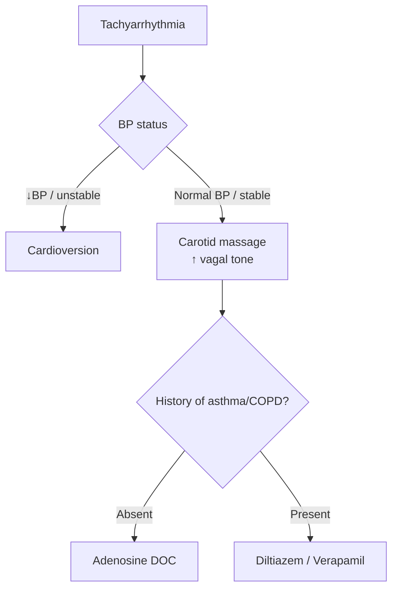
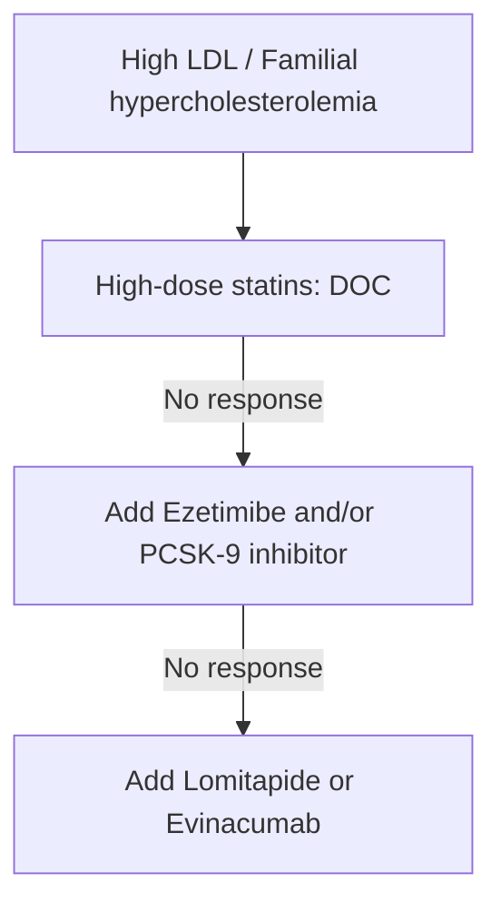

# Drugs Acting on CVS

## Anti-Arrhythmic Drugs

### SVT, PSVT

- Arising from atrium.
- Aim: block AV node (prevent conduction into ventricles).
- Drugs: **ABCD**
  - A: Adenosine
  - B: Beta blocker
  - C: CCB (diltiazem/verapamil)
  - D: Digoxin
- IV drugs:
  - Acute attack.
  - ↓BP.
- DOC:
  - Acute: **Adenosine**.
  - Long-term management: **β-blockers**.

### Management of acute attack



**Adenosine (DOC):**
- IV rapid push.
- Adults: 6 mg.
- Children: 0.1 mg/kg.

### Tachyarrhythmia

- Atrial: SVT, PSVT, atrial fibrillation.
- Ventricular: VF, VT.
- Long QT syndrome, WPW syndrome.

### Bradyarrhythmia

- **DOC: Atropine.**

### Atrial Fibrillation

**Acute attack:**

- Cardioversion ± Ibutilide (IV).

**Chronic management:**

#### Rate

Aim: block AV node (to maintain ventricular rate <100/min).

- β-blocker (DOC).
- CCB (in COPD, asthma).

#### Rhythm

Aim: block myocardial cells generating AP.

- Na⁺ channel −.
- K⁺ channel − → repolarization.
- **Amiodarone (DOC).**

> Adenosine, β-blocker: s/e bronchoconstriction (C/i: asthma).

> Adenosine: s/e atrial fibrillation.

> Digoxin indication: SVT/PSVT + chronic CHF.

### Ventricular Fibrillation & Tachycardia

#### Ventricular tachycardia

Block myocardial cells:

- Na⁺ channel −.
- K⁺ channel −:
  - Amiodarone (DOC).

**Exception:** Digoxin/ischemia-induced V. tach/V. fib → DOC **Lidocaine**.

#### Long QT Syndrome

**Acute attack (Torsades de pointes) management:**

- Congenital & acquired.
- **DOC: MgSO₄.**

**Long-term management:**

- Congenital:
  - DOC: β-blocker.
  - TOC: pacing (ICD).
- Acquired:
  - Avoid QT-prolonging drugs.

#### WPW Syndrome

Anatomical accessory pathway.

- DOC: **Flecainide** (s/e: most arrhythmogenic).
- TOC: radiofrequency ablation.
- A/w atrial fibrillation: IV procainamide.

## Heart Failure Drugs

### Acute CHF

- M/c cause: MI (M/c of LV).

```mermaid
flowchart TD
    A[Acute CHF] --> B[↓ LV contraction]
    B --> C[IV Dobutamine DOC<br/>(maintains normal HR)]
    A --> D[Pulmonary edema]
    D --> E[IV Furosemide DOC]
    E --> F[1st effect: vasodilation<br/>↓ preload]
    F --> G[Followed by diuresis]
    D --> H[Alternative: IV Nitroglycerine]
    A --> I[No response]
    I --> J[BNP analogues]
    J --> K[Nesiritide IV]
```

- PDE-3 −: **Milrinone (inodilator).**
- Pulmonary edema:
  - DOC: IV furosemide.
  - 1st effect: vasodilation (↓preload) followed by diuresis.
  - Alternative: nitroglycerine (IV).
- BNP analogues:
  - Nesiritide (IV).
  - Metabolized by neprilysin (neutral endopeptidase).

### Chronic CHF

**Drugs:**

- For symptomatic management:
  - Furosemide.
  - Digoxin.
- To ↓ mortality: **SHIVA Beta (↓remodelling)**
  - Sacubitril (−NEP).
  - Spironolactone.
  - SGLT-2 − (−gliflozins).
  - Hydralazine + IDN.
  - Ivabradine.
  - Vericiguat (↑cGMP).
  - ACEi/ARB.
  - β-blocker (FDA approved).

### Management of a new case orally

1. Furosemide (symptomatic).
2. ACEi/ARB **or** sacubitril + valsartan (preferred).
3. β-blocker (BCMN):
   - Bisoprolol.
   - Carvedilol.
   - Metoprolol.
   - Nebivolol.

> Start β-blocker after 1 week. FDA approved.

## Hypertension

### Mild to Moderate HTN

**Severe hypertension:**

|  | <55 yr (young) | ≥55 yr (old) |
|---|---|---|
| Pathology | ↑Renin | ↓Renin |
| Drugs | DOC: ACEi/ARB; beta blocker | DOC: CCB (amlodipine); diuretics (thiazides) |

Other listed drugs:

- ACEi/ARB.
- Thiazides (↑Ca²⁺ absorption from tubules).
- CCBs.
- Beta blocker.

### Drugs for HTN with co-morbidities (irrespective of age)

- DM.
- CKD (no edema).
- Nephrotic syndrome.
- Scleroderma.
- Osteoporosis.
- Edema.
- Raynaud’s disease.
- Cyclosporine-induced HTN.
- BPH α−: prazosin.
- Migraine.
- Hyperthyroidism.
- Stable angina.
- Anxiety disorder.
- Essential tremor.

### Resistant hypertension

- Resistant to at least 3 classes of drugs with one being a diuretic (pathology: ↑aldosterone).
- **New drug: Aprocitentan** (endothelin receptor −).
- Add **spironolactone (DOC)**.

### Hypertensive emergency vs urgency

|  | Hypertensive emergency | Hypertensive urgency |
|---|---|---|
| BP | ↑ ≥180/110 mmHg | ↑ ≥180/110 mmHg |
| End-organ damage | + | − |
| Drugs | IV: labetalol (DOC in pregnancy), nicardipine (DOC) | Oral: clonidine (DOC), ACEi/ARB, CCB |

## Anti-anginal Drugs

### Stable & Variant Angina

**Acute angina Rx:** S/L NTG (DOC).

### Long-term management

| Situation | Drugs |
|---|---|
| **Stable (↓preload: venodilation)** | ↓ acute attack: CCB; long-acting nitrates; beta blockers (best). If HR still ↑ → ivabradine; ranolazine; nicorandil; trimetazidine. |
| **↓Mortality** | Statins; aspirin; ACEi/ARB. |
| **Variant (coronary vasodilators)** | DOC: CCB; long-acting nitrates. |

**Side effect:** postural hypotension.

### MOA of selected anti-anginal drugs

| Drug | MOA |
|---|---|
| Ivabradine | Funny channels/IF current — SA node: ↓HR, normal contraction |
| Ranolazine | Late inward Na⁺ channel − |
| Nicorandil | K channel opener (vasodilator) |
| Fasudil | Rho kinase − (vasodilator) |
| Trimetazidine (antimetabolite) | Partial FA oxidase (P-fox) — TG metabolism |

## Side Effects

### Amiodarone

**Mnemonic:** Potassium channel blocker makes liver, nerve and skin toxic.

- Pulmonary fibrosis: C/i in ILD.
- Corneal microdeposits: whorl-like.
- Blue colored skin (ceruloderma): sunscreen.
- Myocarditis.
- Liver toxicity.
- Neuropathy.
- Alpha receptor − causes hypotension.
- Photosensitivity (brown skin): sunscreen.
- Thyroid (Hypo > hyper).


### Other notes

**Amiodarone:**
- Longest acting anti-arrhythmic.
- Not nephrotoxic.

**Anti-arrhythmics causing QT prolongation/Torsades:**

**Class Ia:**
- Quinidine.
- Procainamide.
- Disopyramide.

**Class III:**
- Black: Bretylium.
- D: Dofetilide.
- I: Ibutilide.
- V: Vernakalant.
- A: Amiodarone.
- S: Sotalol.


### Adenosine

**S/e:**
- M/c: flushing and dyspnea (short acting, transient).
- Most important: atrial fibrillation.

**Contraindications:**
- Bronchial asthma/COPD.
- Transplanted heart (no vagus → complete heart block).

### Digoxin

**MOA:** Blocks Na⁺-K⁺ ATPase.

**S/e: mnemonic DIGOXIN**

- Dialysis, defibrillation: C/i.
- Increases K⁺.
- Gynaecomastia.
- Ocular s/e: green halos.
- Xanthopsia: yellow vision.
- Increases risk of arrhythmia:
  - M/c: V. bigeminy.
  - Not seen: atrial flutter, Mobitz type II.
- Nausea/vomiting: m/c & earliest.

**C/i / increased risk of toxicity — mnemonic: KMC in Manipal Rocks**

- ↓K⁺.
- ↓Mg²⁺.
- ↑Ca²⁺ (increase).
- MI.
- Renal failure.

**Other notes:**
- WPW syndrome: AV node − → ↑WPW pathway.
- HOCM: ↑contraction.
- Na⁺ & K⁺ channel −.
- Delay in repolarisation & depolarisation.
- Only K⁺ channel − → delay in repolarisation.

### Digoxin toxicity

- Mild arrhythmia: V. bigeminy → Rx: K⁺.
- Severe arrhythmia: VT, V. fib → **Digibind: antidote**; lidocaine.
- K⁺: C/i.

## RAAS Inhibitors

### ACE inhibitors

- “Pril”: oral.
- Enalaprilat: IV.
- S/e:
  - Dry cough (M/c).
  - Angioedema (↑bradykinin) → tracheostomy.

### Direct renin inhibitor

- **Aliskiren**: renin −.

### ARBs

**Losartan:**
- PPAR-γ + → ↓insulin resistance.
- ↑Uric acid excretion → DOC HTN + gout.
- Thromboxane A₂ − → anti-aggregation.

**Telmisartan:**
- Max. PPAR-γ + → ↓↓insulin resistance.
- DOC: DM + HTN.

### Contraindications / prevention

- Pregnancy.
- B/L renal artery stenosis.
- Prevention: ACEi/ARB C/i with beta blockers (causes total conduction block → asystole).

## Calcium Channel Blockers

- Headache.
- Ankle edema.
- Constipation: verapamil.
- AV block: diltiazem/verapamil.

## Other Drugs

| Drug | Side effect | Use |
|---|---|---|
| Minoxidil | Hirsutism | Topical use: androgenic alopecia |
| Diazoxide | Severe hypotension | DOC: insulinoma |
| Nitroprusside | Cyanide toxicity | Hypertensive emergency |

### Finasteride

- DOC androgenic alopecia: oral 1 mg.
- BPH: 5 mg.

## Hypolipidemic Drugs

### Aim

- **↓LDL:** Avoid atherosclerotic CVD (angina, MI, stroke).
  - Statins (DOC).
  - Bempedoic acid.
  - Ezetimibe.
  - Inclisiran.
  - PCSK-9 −.
  - Bile acid binding resins.
  - Lomitapide.
  - Niacin.
- **↓TG:** Avoid pancreatitis.
  - Fibrates.
  - Icosapent.
  - Omega-3 fatty acid.

### Statins

- Most potent: **Pitavastatin > Rosuvastatin**.
- Ceiling effect DOC (max. ↓LDL).
- Longest acting: Rosuvastatin > Atorvastatin.
- All metabolized by CYP450 except **Pravastatin**.
- DOC in protease inhibitors causing dyslipidemia (enzyme − → statin toxicity).

**MOA:**

- Hypolipidemic effect (HMG-CoA reductase −):
  - ↓LDL, VLDL, TG.
  - ↑HDL, lipoprotein-A.
- Pleiotropic effects (all except ↓LDL):
  - Antiaggregant, anticoagulant.
  - Anti-inflammatory, antioxidant.
  - ↑NO.
  - Plaque stabilization.

**Uses:**
- DOC: type II hyperlipoproteinemia (familial hypercholesterolemia).
- Primary & secondary prophylaxis of MI and stroke (ASCVD).
- Night-time dosing, except:
  - Rosuvastatin.
  - Atorvastatin.

**S/e:**
- Myopathy.
- Hepatotoxicity.
- Insulin resistance.

**C/i:**
- Pregnancy.
- Children <10 yrs.
- Gemfibrozil: − elimination (liver: OATP-1B1 pump).

### Non-statin hypolipidemic drugs

| Drug | MOA | Uses | S/e |
|---|---|---|---|
| **PCSK-9 −:** Evolocumab, Alirocumab | Prevent LDLr degradation → ↓LDL (max), ↓lipoprotein-a | Add on to statins | — |
| **Inclisiran** | ↓PCSK-9 synthesis; small interfering RNA; breaks PCSK-9 mRNA → ↓LDL | Add on to statins | — |
| **Evinacumab** | Blocks angiopoietin-like protein 3 & LPL → ↓LDL, TG | Familial hypercholesterolemia | — |
| **Lomitapide** | Blocks MTP (microsomal triglyceride transport protein) | — | — |
| **Fibrates:** Clofibrate, Fenofibrate, Bezafibrate, Gemfibrozil | PPAR-α +, ↑LPL synthesis → ↓TG, chylomicrons; ↓VLDL | DOC: hypertriglyceridemia; chylomicronemia syndrome; type III hyperlipoproteinemia | Cholelithiasis; myopathy |
| **Icosapent** | ↓TG-rich VLDL synthesis by liver; − platelet aggregation | ↓CVS mortality; hypertriglyceridemia; add on to statins | — |
| **Niacin** (not used) | Max. ↑HDL; ↓hormone-sensitive lipase synthesis; ↓lipoprotein-A | Dyslipidemia with ↓HDL | Hepatotoxicity; insulin resistance; flushing (d/t PG); DOC: aspirin |
| **Bempedoic acid** | Competitive − ATP citrate lyase → ↓cholesterol synthesis; ↓LDL | Add on to statins | — |
| **Bile acid-binding salts:** Cholestyramine, Colestipol, Colesevelam | − enterohepatic circulation of bile acid → ↓LDL | Add on to statins; preferred in pregnancy and children | Hypertriglyceridemia; hyperchloremic acidosis; GI upset; ↓absorption of other drugs and vitamins A, D, E, K; least with colesevelam |

### Ezetimibe

- NPC1L1 receptor (small intestine) −.
- Cholesterol absorption −.
- Add-on to statins.

### Lipoprotein-A

- ↑: Statins.
- ↓: Niacin, PCSK-9 −.

### Management

#### High LDL / Familial hypercholesterolemia

| Clinical situation | Intensity | Regimen |
|---|---|---|
| Without clinical ASCVD & LDL <190 | Moderate intensity | Rosuvastatin 5–10 mg; Atorvastatin 10–20 mg |
| With clinical ASCVD OR LDL >190 | High intensity | Rosuvastatin 20–40 mg; Atorvastatin 40–80 mg |



#### Hypertriglyceridemia

| Risk of ASCVD | TG | Management |
|---|---|---|
| Absent | Moderate (150–499) | Lifestyle modification |
| Absent | Moderate-severe (500–999) | Fibrates |
| Present | Moderate (150–499) | Statins (↓TG, ↓LDL); if no response → add Icosapent (↓ses TG & LDL) |
| Present | TG remains >500 | Fibrates |

## First Aid 2025 — Integrated Supplement

### Phosphodiesterase Inhibitors

Phosphodiesterase (PDE) inhibitors inhibit hydrolysis of cAMP and/or cGMP, increasing cyclic nucleotide signaling.

| Type | Drug(s) | Mechanism | Major uses | Important adverse effects |
|---|---|---|---|---|
| Nonspecific PDE inhibitor | **Theophylline** | ↓ cAMP hydrolysis → ↑ cAMP → bronchodilation | COPD/asthma; rarely used | Tachycardia/arrhythmias, seizures, headache, abdominal pain |
| PDE-5 inhibitor | **Sildenafil, vardenafil, tadalafil, avanafil** | ↓ cGMP hydrolysis → ↑ cGMP → smooth-muscle relaxation and enhanced NO activity | Erectile dysfunction; pulmonary hypertension; tadalafil for BPH | Flushing, headache, dyspepsia, hypotension with nitrates; sildenafil → cyanopsia via PDE-6 inhibition |
| PDE-4 inhibitor | **Roflumilast** | ↑ cAMP in inflammatory/bronchial cells | Severe COPD | Abdominal pain, weight loss, depression, anxiety, insomnia |
| PDE-3 inhibitor | **Milrinone** | In cardiomyocytes: ↑ cAMP → ↑ Ca²⁺ influx; in vascular smooth muscle: ↑ cAMP → MLCK inhibition | Acute decompensated HF with cardiogenic shock | Tachycardia, ventricular arrhythmias, hypotension |
| Platelet-related PDE inhibition | **Cilostazol, dipyridamole** | ↑ platelet cAMP → inhibits aggregation | Intermittent claudication; stroke/TIA prevention; dipyridamole for stress testing | Nausea, headache, flushing, hypotension, abdominal pain |

- Cilostazol is a PDE-3 inhibitor but is often grouped with platelet inhibitors because of its clinical indications.
- Dipyridamole also prevents adenosine reuptake → ↑ extracellular adenosine → vasodilation.

### Drug Reactions — Cardiovascular

| Reaction | Important causative agents / notes |
|---|---|
| Coronary vasospasm | Cocaine, amphetamines, sumatriptan, ergot alkaloids |
| Cutaneous flushing | Vancomycin, adenosine, niacin, Ca²⁺ channel blockers, echinocandins, nitrates |
| Dilated cardiomyopathy | Alcohol, anthracyclines; trastuzumab |
| Peripheral edema | Dihydropyridine Ca²⁺ channel blockers such as amlodipine |
| Torsades de pointes | Methadone, class IA/III antiarrhythmics, macrolides, fluoroquinolones, ziprasidone, TCAs, ondansetron, fluconazole |

**Vancomycin infusion reaction:** histamine-mediated widespread pruritic erythema; infusion-rate dependent. Manage by slowing the infusion and using diphenhydramine.
