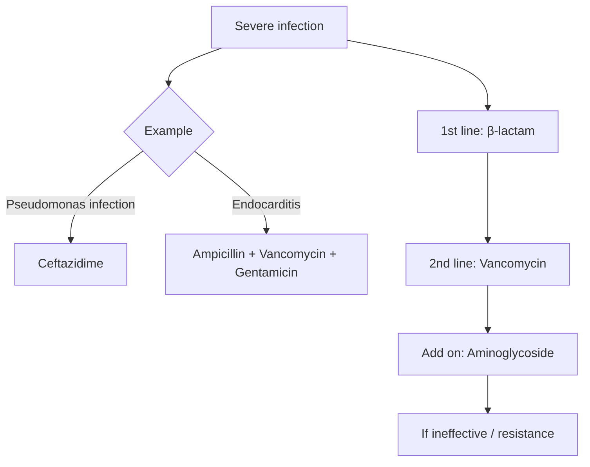
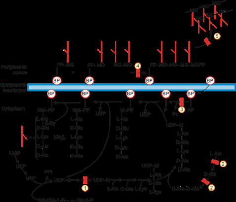

# Antimicrobial Drugs : Part 1

## Classification

### Regimens for some severe infections

- **Cell wall synthesis − (Bactericidal):**
  - Beta lactams:
    - Penicillins
    - Cephalosporins
    - Carbapenems
    - Monobactams
  - Vancomycin (Glycopeptide)
  - Bacitracin
  - Cycloserine
  - Fosfomycin
- **Acting on cell membrane (Bactericidal):**
  - Colistin: Rx of MDR (Gram −ve)
  - Daptomycin (Lipopeptide)
- **Protein synthesis − (Bacteriostatic):**
  - Tetracyclines
  - Macrolides
  - Clindamycin
  - Linezolid
  - Streptogramin
  - Aminoglycosides (Cidal)
- **Antifolate:**
  - Sulfonamides (Static)
  - Cotrimoxazole (Cidal)
- **Fluoroquinolones:**
  - Ciprofloxacin (Bactericidal)
  - Rx: UTI & traveller’s diarrhoea (↑ conc. in urine & stool)

### Some high-yield severe infection regimens

> **VRSA:** Vancomycin is used; if ineffective, linezolid/streptogramin or daptomycin may be used as described in the notes.

> **VRE:** last line for MDR gram-positive infection; daptomycin/linezolid/streptogramin are listed in the notes.

## Cell Wall Synthesis Inhibitors

1. **Fosfomycin:** UDP-G → UDP-M.
2. **Cycloserine:** L-Alanine → D-Alanine.
3. **Bacitracin:** Bactoprenol phosphorylation.
4. **Vancomycin:** Polymerization.
5. **Beta-lactams:** Crosslinking by blocking transpeptidase/PBP.

## β-Lactams

### Penicillins

| Drug | Uses / notes |
|---|---|
| **Benzathine penicillin G** | IM (most commonly used); longest acting (28 days). DOC for mnemonic **SLY GRAM +ve**: Streptococcus, Syphilis, Leptospirosis, Yaws, Gas gangrene, Rat bite fever, Actinomycosis, Meningococcus. |
| **Amoxicillin (oral)** | Respiratory infection; UTI (safe in pregnancy). |
| **Ampicillin (IV)** | Listeria meningitis (DOC). |
| **Piperacillin** | Pseudomonas. |

### Penicillin resistance

- Mediated by **β-lactamases (penicillinase)** produced by Staph.
- Counteracted by altered PBP (**Mec-A gene**).
- Penicillinase-resistant penicillin (PRP): **Methicillin** (− β-lactamase/penicillinase).
- MRSA → **Vancomycin DOC** (− D-alanine).
- VRSA → **Daptomycin DOC**.
- Ineffective → **Linezolid / Streptogramin**.

## Cephalosporins

| Generation / drug | Uses |
|---|---|
| **1st gen: Cefazolin (IV)** | DOC: surgical prophylaxis. |
| **3rd gen: Ceftriaxone (parenteral)** | DOC: typhoid, meningitis (empirical), gonorrhea. |
| **Cefixime** | Typhoid (oral DOC). |
| **Ceftazidime** | Pseudomonas (DOC). |
| **Cefoperazone** | Pseudomonas. |
| **4th gen: Cefepime, Cefpirome** | Pseudomonas, Enterobacter, ESBL (Extended spectrum β-lactamase). |
| **5th gen: Ceftobiprole, Ceftaroline** | MRSA (bind to altered PBP). |

### Carbapenems

- DOC for:
  - ESBL.
  - Enterobacter.
  - Acinetobacter.
  - Serratia.
- Anti-pseudomonal activity +.
- **Imipenem**: metabolised by renal dihydropeptidase.
- **Cilastatin**: prolongs action.

## Protein Synthesis Inhibitors

### Tetracyclines

- **MOA:** Block acceptor site.
- **Mechanism of resistance:** Drug efflux.
- Uses of doxycycline:
  - Oral: mild to moderate infection.
  - IV: severe infection.

### Uses of tetracyclines — mnemonic My Pink RBC

- **Mycoplasma** (STD).
- **Plague prophylaxis.**
- **Rickettsia:** Scrub typhus.
- **Borrelia, Brucella.**
- **Chlamydia** (STD), **Cholera**.

### Contraindications of tetracyclines

- Pregnancy.
- Children.
- Avoid with milk/antacids (TTC chelates Ca²⁺).
- Bone growth defect.

### Tigecycline

- Glycylcycline: derived from Minocycline.
- MOA: blocks acceptor site.
- MOR: drug efflux.
- Route: IV (severe infection).

### Macrolides

| Drug | Uses |
|---|---|
| **Erythromycin** | DOC: pertussis, diphtheria. |
| **Azithromycin** | DOC: Chlamydia, Legionella, Mycoplasma, Campylobacter; Chlamydia and cholera in pregnancy; cholera in children; atypical pneumonia. |

### Clindamycin

**Uses:**

- DOC for toxic shock syndrome (cidal drugs ↑ toxin release).
- Anaerobic infections.

> Rx of anaerobic infection: supradiaphragmatic → clindamycin; infradiaphragmatic → metronidazole.

For endometritis: **Metronidazole + Gentamicin (add-on) > Clindamycin + Gentamicin**.

## Aminoglycosides

- **MOA:** Misreading of mRNA.
- **MOR:**
  1. Enzymatic inactivation (absent in amikacin).
  2. Altered ribosome structure: only seen with streptomycin.
- Monotherapy not effective against:
  - Anaerobes.
  - Typhoid.
- Gentamicin/Streptomycin (IV/IM): DOC for plague & tularemia.
- Oral neomycin: gut sterilization in hepatic encephalopathy.

> **Rifaximin:** DOC for gut sterilization in hepatic encephalopathy; also used for pseudomembranous enterocolitis and traveller’s diarrhea.

## Miscellaneous Antibiotics

### Fidaxomicin

- MOA: − RNA polymerase.
- Route: oral.
- Use: DOC for pseudomembranous enterocolitis.

### Mupirocin–Bacitracin

- Route: topical.
- Use: DOC for staphylococcal nasal carriers.

### Fosfomycin

- Rx of UTI: **3 g single dose**.

### Chloramphenicol

- S/e: **Grey baby syndrome** (when used for respiratory infections in children).

## Anti-Folate Drugs

| Drug | Uses |
|---|---|
| **Sulfadiazine + pyrimethamine** | DOC: toxoplasmosis (teratogenic). |
| **Sulfadiazine (topical)** | DOC: burns. |
| **Cotrimoxazole** | Trimethoprim + sulphamethoxazole (1:5 ratio). DOC for mnemonic **Cautery PINS**: Cystitis, Cyclospora, Cepacia (Burkholderia), Pneumocystis, Isospora, Nocardia, Sarcocyst, Stenotrophomonas. |

> Toxoplasmosis in pregnancy: **Spiramycin**.

## Fluoroquinolones

- **MOA:** − DNA gyrase.

### Ciprofloxacin

- Most commonly used (most active).
- Well concentrated in urine & stool.
- DOC for:
  - Pyelonephritis.
  - Typhoid carriers.
  - Traveller’s diarrhea.
  - Shigella.
  - Contact of meningococcal meningitis (previously DOC: rifampicin).

### Respiratory fluoroquinolones

**Mnemonic: Lungs have Maximum Germs**

- Levofloxacin: maximum oral bioavailability.
- Moxifloxacin.
- Gemifloxacin.

### Moxifloxacin

- Longest T½.
- Maximum QT prolongation → highest risk of torsades de pointes.
- Maximum risk of seizure.
- Highest mycobacterial effect.
- Maximum hepatic excretion:
  - Safe in renal failure.
  - Ineffective for UTI.

## Side Effects

### Tetracyclines

- Mnemonic **Tetra PACKET**:
  - Photosensitivity.
  - Acute renal failure (except doxycycline).
  - Calcium binding (↓ bone growth).
  - Kidney: ↑ urine diabetes insipidus.
  - Esophagitis.
  - Teeth: yellow.
- C/i: pregnancy, children, antacids/milk.

### Aminoglycosides

- Nephrotoxicity.
- Neuromuscular toxicity: reversed by calcium.
- Ototoxicity (outer hair cell: irreversible damage).
- C/i: pregnancy.
  - **Auditory:** amikacin.
  - **Vestibular:** streptomycin (+ minocycline).

### Erythromycin

Mnemonic **Macro SD Card**:

- Motilin receptor + → hypertrophic pyloric stenosis.
- Skeletal muscle weakness.
- Diarrhea.
- Cardiac: QT prolongation.
- Cholestatic jaundice.

### Fluoroquinolones

- Photosensitivity.
- QT prolongation.
- Rash.
- Seizure: d/t displacement of GABA from binding site.
- Tendinitis/tendon rupture: ↑ risk in elderly, renal failure, steroid use.

> Drugs causing QT prolongation: Quinidine, Moxifloxacin, Macrolides.

> Vit D deficiency is not associated with tendon rupture.

### Linezolid

- Bone marrow suppression (↓ platelet count); ↓↓ with tedizolid (but ↑ T½).
- MAO inhibition → cheese reaction.
- Mitochondrial toxicity: optic neuritis, lactic acidosis, myopathy.

### β-lactams

- Pseudomembranous enterocolitis: 3rd gen cephalosporin > amoxicillin.
- Type 1 hypersensitivity: rash, anaphylaxis.
- Type 2 hypersensitivity: hemolysis.
- Disulfiram-like reaction.
- Hypoprothrombinemia.
- Seizures: imipenem.
- Unsafe in renal failure (except cefoperazone; but ineffective in UTI).

### Sulfonamides

Mnemonic **Folic Acid Makes RBC**:

- Fetus: kernicterus after birth.
- Acute intermittent porphyria.
- Methemoglobinemia.
- Rash.
- Bone marrow suppression.
- Crystalluria.

### Vancomycin

- Red man syndrome (d/t histamine).
- Ototoxicity.
- Nephrotoxicity: Matzke nomogram for vancomycin dosing.

### Important cephalosporins associated with disulfiram-like effect / hypoprothrombinemia

- Cefoperazone.
- Moxalactam.
- Cefamandole.
- Cefotetan.
