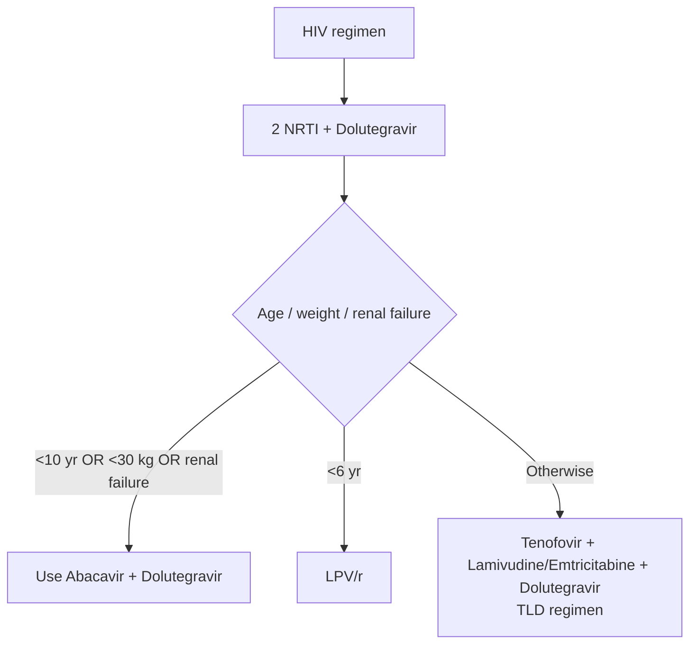
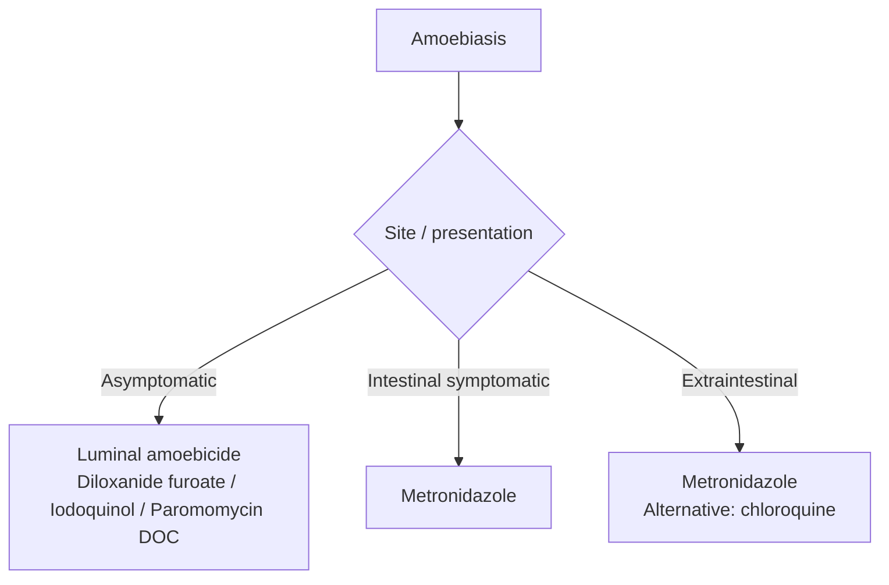

# Antimicrobial Drugs : Part 2

## Non-retroviral Drugs

| Disease / drug                        | DOC / use                               | Side effects / notes                               |
| ------------------------------------- | --------------------------------------- | -------------------------------------------------- |
| **Oral valacyclovir > acyclovir**     | DOC: HSV/VZV                            | —                                                  |
| **Topical acyclovir**                 | Orolabial herpes                        | —                                                  |
| **IV acyclovir**                      | DOC: HSV encephalitis                   | Crystalluria, renal failure                        |
| **Oral valganciclovir > ganciclovir** | DOC: CMV retinitis                      | Bone marrow suppression                            |
| **IV ganciclovir**                    | DOC: CMV pneumonia                      | Bone marrow suppression                            |
| **IV foscarnet**                      | Resistant herpes                        | Electrolyte imbalance: ↓K⁺, ↓Mg, Ca²⁺ ↑/↓, PO₄ ↑/↓ |
| **Intralesional cidofovir**           | DOC: recurrent laryngeal papillomatosis | —                                                  |

### Influenza

- **Oseltamivir (DOC):** neuraminidase −.
- Resistant → inhalational zanamivir.
- Rx: 5 days.
- Prophylaxis: 7 days.
- New drug: **Baloxavir**
  - − RNA polymerase (endonuclease).
  - Oral: Rx and prophylaxis.
  - Single dose.

### Hepatitis B

**Chronic active case (↑ LFT):**

- Tenofovir (DOC), entecavir:
  - No specific duration.
  - Can be used in hepatic decompensation.
- IFN-α:
  - Only 48–52 weeks.
  - Avoided: more toxic.

### Hepatitis C

Direct acting drugs (oral):

- Sofosbuvir: NS5B −.
- Velpatasvir: NS5A −.
- Paritaprevir: protease −.
- IFN-α: S/C.
- Ribavirin: oral.

### RSV

- Inhalational ribavirin.
- Prophylaxis:
  - Palivizumab.
  - Nirsevimab.

## Antiretroviral Drugs

> **Cobicistat:** used as a booster with atazanavir, darunavir, elvitegravir.

### NRTI / NNRTI

| Drug | Key points |
|---|---|
| **Zidovudine** | S/e: bone marrow suppression. |
| **Lamivudine / Emtricitabine** | Derivatives; hence not used together. |
| **Tenofovir** | Nephrotoxic; C/i: renal failure; safety unknown in <10 years / <30 kg. |
| **Nevirapine** | DOC: prevent perinatal HIV transmission in neonates (alternative: zidovudine). |
| **Abacavir** | S/e: SJS a/w HLA-B5701. |

### Entry inhibitors

- Ibalizumab (IV): CD-4 − (HIV-1).
- Maraviroc: CCR5 − (HIV-1 & 2).
- Fostemsavir: gp120 − (HIV-1).
- Enfuvirtide (S/C): gp41 − (fusion −).

### Integrase inhibitors

- Dolutegravir.
- Elvitegravir.

### Protease inhibitors

- Used <6 years:
	- Lopinavir: used as LPV/r = 90% LPV + 10% ritonavir.
- Ritonavir:
	- Most potent enzyme −: CYP3A4 −.
	- Used as booster: − metabolism.
	- Do not boost nelfinavir.
- Atazanavir: no dyslipidemia.
- Indinavir: renal stones.
- Tipranavir: intracranial bleed.

### Antiretroviral regimens

## Antifungal Drugs

| Disease                                             | DOC            | Other drugs / notes                         |
| --------------------------------------------------- | -------------- | ------------------------------------------- |
| Kala-azar                                           | Amphotericin B | —                                           |
| Mucormycosis                                        | Amphotericin B | —                                           |
| Cryptococcal meningitis                             | Amphotericin B | —                                           |
| Candida albicans: mucocutaneous infection (vaginal) | Fluconazole    | Except oral candidiasis                     |
| Vaginal candidiasis (new)                           | Oteseconazole  | Azole; Ibrexafungerp (β-glucan synthase −)  |
| Oral candidiasis                                    | Clotrimazole   | Lozenge                                     |
| Candida non-albicans / systemic                     | Echinocandin   | Caspofungin, micafungin, anidulafungin (IV) |
| Aspergillosis                                       | Voriconazole   | —                                           |
| Skin infection / tinea                              | Sertaconazole  | Topical; anti-pruritic                      |
| Tinea cruris / tinea corporis                       | Itraconazole   | Terbinafine                                 |
| T. capitis / dermatophyte infection                 | Griseofulvin   | Oral with fatty food; resistance noted      |
| Fungal corneal ulcer                                | Natamycin      | —                                           |
| Onychomycosis                                       | Terbinafine    | Tavaborole; efinaconazole solution          |

### Amphotericin B

- IV with 5% dextrose.
- Side effects:
  - Hypokalemia: KCl for prevention.
  - Nephrotoxic:
    - Load patient with 1–2 L NaCl.
    - Combined with liposome.

> Atropine: used in fungal corneal ulcer; prevents synechiae.

## Antihelminthic Drugs

### Nematodes

- DOC: **Albendazole**.
- Roundworm.
- Whipworm.
- Soil transmitted.
- Hookworm.
- Enterobius vermicularis.
- Trichinella spiralis.
- Strongyloides.

### Ivermectin

- O. volvulus.
- Loa loa: DEC.
- Filariasis: **IDA** (ivermectin, DEC, albendazole).
- Dracunculus: metronidazole.

### Cestodes

- Neurocysticercosis:
  - 1st drug: prednisolone (↓ edema).
- Echinococcus.
- Intestinal T. solium.
- T. saginata.
- H. nana.
- D. latum.
- **Praziquantel.**

### Trematodes

- Others flukes: praziquantel.
- Fasciola hepatica: triclabendazole.

## Antiprotozoal Drugs

### Amoebiasis

### Leishmaniasis

- Visceral (Kala azar): IV liposomal amphotericin B.
- Oral: miltefosine; DOC for PKDL.
- Cutaneous: sodium stibogluconate.

### Trypanosomiasis

**American (Chagas disease):**

- Benznidazole.

**African (sleeping sickness):**

- East:
  - Early: suramin (IV).
  - Late: melarsoprol (IV).
- West:
  - Early: pentamidine (IV).
  - Late: eflornithine (IV).
  - Oral: fexinidazole (DOC).

### Babesiosis

- DOC: atovaquone + azithromycin.
- Alternative: quinine + clindamycin.

### Toxoplasmosis

- DOC: sulfadiazine + pyrimethamine.

### Cryptosporidiasis / resistant giardiasis

- Nitazoxanide (PFOR −).

### Giardiasis / amoebiasis / anaerobes / trichomoniasis / tetanus / bacterial vaginosis

- **Metronidazole**.
- S/e: disulfiram-like reaction.

## Antimalarial Drugs

### Severe falciparum malaria

- DOC: **IV artesunate** (48 hrs continuous infusion).

### Drugs contraindicated in pregnancy

- Primaquine.
- Tafenoquine.
- ACT (C/i in 1st trimester).
- Tetracycline.
- Doxycycline.

### Uncomplicated malaria

| Setting                                      | Regimen                                                                                                                                        |
| -------------------------------------------- | ---------------------------------------------------------------------------------------------------------------------------------------------- |
| **P. vivax**                                 | DOC: chloroquine × 3 days  + primaquine × 14 days OR tafenoquine once.                                                                      |
| **P. falciparum / resistant P. vivax (ACT)** | Artesunate + sulfadoxine + pyrimethamine;  artemether + lumefantrine (North-east India);  alternative: quinine + tetra/doxy/clindamycin. |
| **Uncomplicated malaria in pregnancy**       | Chloroquine; 1st trimester: quinine + clindamycin; 2nd/3rd trimester: ACT.                                                                     |

### Prophylaxis

- <6 weeks: doxycycline 100 mg/day.
	- Start 2 days before.
	- Duration of travel.
- ≥6 weeks: mefloquine 250 mg/week.
	- Start 2 weeks before.
	- Continue for 4 weeks after travel ends.

## Antitubercular Drugs

### First-line drugs

| | Isoniazid (H) | Rifampicin (R) | Pyrazinamide (Z) | Ethambutol (E) |
|---|---|---|---|---|
| **MOA** | Activated by catalase peroxidase; − mycolic acid synthesis | − RNA polymerase | — | — |
| **Action** | Cidal | Cidal (max.) | Cidal | Static |
| **Target type** | Replicating | Non-replicating/persisters | Replicating | Replicating |
| **Localization** | Intra + extracellular | Intracellular | Intracellular | Extracellular |
| **Excretion** | Liver | Liver (max.) — safest in RF | Liver | Kidney — C/i in RF |

### Side effects

| Drug | Important side effects / treatment |
|---|---|
| **Isoniazid** | ↓GABA → euphoria, hallucination, psychosis; ↓heme → anemia; treatment: Vit. B6; toxicity: seizure → IV pyridoxine (1 g for 1 g isoniazid; max 5 g). |
| **Rifampicin** | Red-orange urine; respiratory symptoms (flu-like); permanently stop: purpura (↓platelet), pulmonary syndrome. |
| **Pyrazinamide** | Most hepatotoxic: Z > H > R; hyperuricemia; hip joint pain (arthralgia). |
| **Ethambutol** | Optic neuritis; red-green color blindness (green > red). |

### New drugs for TB

| Drug            | MOA                                     | Notes / side effects             |
| --------------- | --------------------------------------- | -------------------------------- |
| **Bedaquiline** | − ATP synthase                          | QT prolongation; C/i: arrhythmia |
| **Delamanid**   | Nitroimidazole: free-radical production | —                                |
| **Pretomanid**  | − mycolic acid synthesis                | —                                |

- Bedaquiline: bactericidal; taken with food (↑ absorption).
- Pharmacokinetics:
  - Sequestered in tissues.
  - T½: 165 days.
  - Dosing is intermittent: 3 days/week.
  - Safe in pregnancy.
  - Highly plasma protein bound.
  - Metabolised by CYP3A4; rifampicin (enzyme inducer) ↓ its effectivity.
  - Delamanid is metabolised by albumin; C/i: albumin <2.8 mg/dL.

## Antileprosy Drugs

### 1st line

- Rifampicin: most cidal.
- Dapsone: static; most common side effect = haemolysis in G6PD deficiency.
- Clofazimine: side effects = skin pigmentation, ichthyosis.

### 2nd line

- Minocycline.
- Clarithromycin — static.
- Fluoroquinolones (cidal):
  - Moxifloxacin.
  - Ofloxacin.
