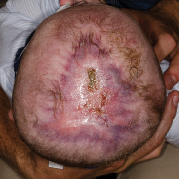

# Drugs Acting on Endocrine System

## Antidiabetic Drugs

### Based on mechanism of action

#### ↑ Insulin Release

**Sulfonylureas:**

- Glyburide.
- Gliclazide.

**Meglitinides:**

- Repaglinide.
- Nateglinide.

**GLP-1 agonists:**

- Liraglutide (S/C, OD).
- Semaglutide (S/C once weekly / oral OD).
- DOC for obesity.
- S/e: nausea, vomiting, gastroparesis.

**DPP-4 inhibitors (oral):**

- Sitagliptin.
- Saxagliptin.
- Linagliptin: hepatic excretion; safe in renal failure.

#### ↓ Insulin Resistance

- MOA: stimulation of PPAR-γ.
- Drugs: **Pioglitazone, Rosiglitazone** (last line).
- S/e:
  - Hepatotoxic.
  - Stimulation of ENaC → retention of Na⁺ & H₂O → edema, CHF, weight gain.
  - Bladder cancer.
  - Bone: fractures in females.
  - Macular edema.
- S/e: weight gain d/t ↑ adipocytes.

> S/e of hypoglycemia: **Insulin (maximum) > Sulfonylureas.**

#### ↓ Hepatic Glucose Production

- MOA: activates AMPK.
- Drug: **Metformin.**

**Uses:**

- DOC for Type II DM.
- PCOS: induces ovulation (preferred drugs: letrozole, clomiphene).
- MASH (metabolic syndrome associated steatohepatitis).

**S/e:**

- Lactic acidosis.
- ↓ Vit. B12.
- Diarrhoea.

**C/i of metformin:**

- Elderly.
- Hepatic/renal failure.
- Chronic alcoholic.
- Severe lung disease.

#### ↑ Urinary Glucose Excretion

- SGLT-2 inhibitors:
  - Canagliflozin.
  - Dapagliflozin.
  - Empagliflozin.
- SGLT-1 & 2 inhibitor: **Sotagliflozin**.
- Use: chronic CHF.
- S/e:
  - D/t ↑ glycosuria: UTI, vaginal candidiasis.
  - D/t loss of Na⁺ & H₂O: hypotension, dehydration.

#### ↓ Intestinal Glucose Absorption

- Acarbose.
- Voglibose.
- Miglitol.
- MOA: α-glucosidase inhibitor (↓ starch & disaccharide breakdown).
- S/e:
  - Flatulence.
  - Diarrhoea.

## Insulin

| Duration                      | Insulin / features                                                                                                                                                                                  | Side effects / notes                                                                                     |
| ----------------------------- | --------------------------------------------------------------------------------------------------------------------------------------------------------------------------------------------------- | -------------------------------------------------------------------------------------------------------- |
| **Shortest & fastest acting** | Afrezza (inhalational); taken before food; use: post-prandial hyperglycemia (PPH)                                                                                                                   | Cough; ↑ risk of lung cancer; C/i in asthma, smokers                                                     |
| **Short acting**              | Route: S/C (most common site: abdomen); use: PPH.   ==Regular==: slow acting (60 min before food).   Glulisine, ==Aspart==, ==Lispro== are fast acting monomerics (15 min before food). | Hypoglycemia (↑ risk with short acting); hypokalemia; lipodystrophy (prevent by rotating injection site) |
| **Intermediate acting**       | Route: S/C; use: maintenance.   ==NPH== (cloudy white);   ==Lente== (30% short acting semilente/ powder + 70% long acting ultralente/ crystal); frequency: BD/TDS                       | —                                                                                                        |
| **Long acting**               | Route: S/C; use: maintenance.   ==Glargine==: white crystals on combining with other insulin;   Detemir;   ==Degludec==: longest acting; frequency: OD/BD                         | —                                                                                                        |

## Amylin Analog

- **Pramlintide.**
- Use: Type I & II DM for PPH (delays gastric emptying).
- S/e: nausea, vomiting, weight loss.

## Miscellaneous Drugs

- Colesevelam.
- Bromocriptine.

## Updates in Diabetes Mellitus

### Tirzepatide

- MOA: GLP-1 (glucagon-like peptide) + GIP agonist (glucose-dependent insulinotropic peptide).
- Route: S/C.
- Uses: DM, obesity (more effective than semaglutide).
- S/e: nausea, vomiting, gastroparesis.

### Teduglutide

- MOA: GLP-2 agonist.
- Use: treatment of malabsorption associated with short bowel syndrome.

### Drugs ↓ CV mortality

1. Metformin.
2. GLP-1 agonist.
3. SGLT-2 inhibitors.

### ↓ Risk of ESRD

1. GLP-1 agonist.
2. SGLT-2 inhibitor.
3. Finerenone (aldosterone antagonist).

## GnRH Related Drugs

- **GnRH agonists:** Goserelin, Buserelin, Nafarelin, Leuprolide.
- **GnRH antagonists:** Ganirelix, Abarelix, Cetrorelix, Elagolix.

### Dosing, uses & side effects

GnRH agonists produce different effects when dosed intermittently vs continuously.

| | GnRH agonists (intermittent) | GnRH agonists (continuous) / GnRH antagonists |
|---|---|---|
| **MOA** | ↑ LH/FSH | ↓ LH/FSH (↓ estrogen/testosterone) |
| **Uses** | Infertility (anovulation/oligospermia); delayed puberty | ↓ estrogen: ER +ve breast Ca, endometrial fibrosis, endometriosis. ↓ testosterone: prostate cancer (Goserelin DOC), precocious puberty |

## Drugs for Contraception

### Regular contraception

| Drug | MOA |
|---|---|
| **Combined OCPs** | − Ovulation |
| **Mini pills / POP** | ↑ cervical mucus viscosity; ↓ sperm penetration; − blastocyst implantation |
| **Mifepristone** | Blastocyst detachment |

### Emergency contraception

| Drug | Dose |
|---|---|
| **Levonorgestrel (DOC)** | 1.5 mg, 1 tab within 3 days |
| **Ulipristal** | SPRM (selective progesterone receptor modulator), 30 mg, 1 tab within 5 days |

## Growth Hormone Related Drugs

### GH analogs

- Somatrem / Somatropin.
- Uses: dwarfism:
  - Turner’s syndrome.
  - Prader Willi syndrome.
  - Noonan syndrome.
- Mnemonic **CHILDReN**:
  - Carpal tunnel syndrome.
  - Hyperglycemia.
  - ICT is raised.
  - Leukemia.
  - Diabetes.
  - C/i:
    - Retinopathy in DM.
    - Neoplasia.

### GH releasing hormone (GHRH analog)

- Sermorelin.
- Macimorelin.
- Tesamorelin.
- Uses:
  - Diagnosis of dwarfism.
  - AIDS-related lipodystrophy (Tesamorelin).

### Somatostatin analogs

- Octreotide LAR.
- Lanreotide.
- Pasireotide.
- Route: S/C.
- DOC for:
  - Acromegaly.
  - Secretory diarrhea.
  - Glucagonoma / VIPoma / somatostatinoma.
- Other uses:
  - Thyrotrope adenoma.
  - Acute variceal bleeding.
- S/e: hypothyroidism, gall stones.

### GH receptor antagonist

- **Pegvisomant:** drug resistant acromegaly.
- S/e: ↑ size of pituitary adenoma.
- Monitor: MRI.

## Mecasermin

- MOA: IGF-1 analog.
- Use: dwarfism d/t selective IGF-1 deficiency.

## Drugs Used in Osteoporosis

| Drug | MOA / uses | Side effects |
|---|---|---|
| **Bisphosphonates**: Alendronate, Risedronate, Zoledronate, Pamidronate | − farnesyl pyrophosphate synthase; induce apoptosis of osteoclast; block ruffled border synthesis. Uses: osteoporosis (alendronate ×5 yrs); Paget’s disease / hypercalcemia of malignancy (zoledronate). | Hypocalcemia (maximum); esophagitis (oral drugs); osteonecrosis of jaw; femoral chalk-stick fracture. Prevention of esophagitis: full glass of water + empty stomach + avoid lying down for 30 min. |
| **Denosumab** | Blocks RANK ligand. | Osteonecrosis of jaw; femoral fractures; hypocalcemia. |
| **Raloxifene** | SERM; post-menopausal osteoporosis with ↑ risk of breast cancer. | Hot flashes; thrombosis; hypocalcemia. |
| **Calcitonin** (not preferred) | Inhibits resorption; Paget’s; prophylaxis of osteoporosis. | Liver cancer; breast cancer; hypocalcemia. |
| **Teriparatide / Abaloparatide** | Teriparatide = PTH analog; Abaloparatide = PTHRP analog. Stimulate osteoblast-mediated formation. S/C; use: bisphosphonate-induced fracture. | Hypotension; osteosarcoma; C/i in Paget’s disease. |
| **Romosozumab** | Blocks sclerostin; ↓ bone resorption + ↑ bone formation. | — |
| **Strontium ranelate** | ↓ bone resorption + ↑ bone formation; use: osteoporosis. | — |

> Zoledronate ×3 yrs is noted in the source; also seen with tamoxifen.

## Steroid Hormone Related Drugs

> Triamcinolone, dexamethasone & betamethasone are **pure glucocorticoids** and have no effect on BP.

| Drug | GC potency | MC potency | Half-life | Uses / notes |
|---|---:|---:|---|---|
| **Hydrocortisone** | ↑×1 | ↑×1 | 8–12 h | Similar to cortisol; DOC for replacement in Addison’s disease and congenital adrenal hyperplasia (CAH). |
| **Prednisone/Prednisolone** | ↑×4 | ↑×0.8 | 12–36 h | ↓ inflammation; ↓ immunity. |
| **Methylprednisolone** | ↑×5 | ↑×0.8 | 12–36 h | — |
| **Triamcinolone** | ↑×5 | 0 | 12–36 h | Pure glucocorticoid. |
| **Dexamethasone / Betamethasone** | ↑×30 | 0 | 36–72 h | Surfactant maturation; CAH pregnancy. |

## Thyroid Related Drugs

### Hyperthyroidism

| Drug | MOA | Uses | Side effects |
|---|---|---|---|
| **Propylthiouracil** | Inhibits thyroid peroxidase → formation of T3, T4; also inhibits peripheral conversion | DOC: hyperthyroidism in 1st trimester; thyroid storm | Hepatotoxic |
| **Carbimazole / Methimazole** | Inhibits thyroid peroxidase | DOC overall & 2nd/3rd trimester | Teratogenic: choanal/esophageal atresia; cutis aplasia |
| **Potassium iodide / Lugol’s iodine** | − thiol endopeptidase; ↓ thyroid size; ↓ vasculogenesis; − T3/T4 release | Pre-operative preparation of thyroid gland: make firm & ↓ bleeding | — |
| **Radioactive iodide (I¹³¹)** | Destroys follicular cells by β & γ rays | Thyroid cancer; recurrent Graves’ disease; hyperthyroidism in elderly; secondary cancer | Permanent hypothyroidism; C/i: pregnancy |

> First drug given in thyroid storm (to prevent AF): **Propranolol**.

- Propranolol, propylthiouracil, amiodarone, steroids inhibit peripheral conversion of T4 to T3.

### Hypothyroidism

| Drug | MOA | Uses | Side effects |
|---|---|---|---|
| **Levothyroxine** | T4 salt; long acting | Oral on empty stomach: DOC replacement; thyroid cancer (↓ TSH). IV: myxedema coma. | Osteoporosis; atrial fibrillation; thyrotoxicosis symptoms. ↓ dose if pre-existing arrhythmia. |
| **Liothyronine** | T3 salt | Oral: T3 before radioactive iodine treatment in thyroid cancer. IV: myxedema coma (T4 + T3). | — |

## First Aid 2025 — Endocrine / Reproductive Drug Reactions

| Reaction | Important causative agents / notes |
|---|---|
| **Adrenocortical insufficiency** | Chronic exogenous glucocorticoids; abrupt withdrawal may precipitate adrenal crisis |
| **Diabetes insipidus** | Lithium, demeclocycline |
| **Gynecomastia** | Ketoconazole, cimetidine, spironolactone, GnRH analogs/antagonists, androgen-receptor inhibitors, 5α-reductase inhibitors |
| **Hot flashes** | SERMs such as tamoxifen, clomiphene and raloxifene |
| **Hyperglycemia** | Tacrolimus, protease inhibitors, niacin, HCTZ, glucocorticoids |
| **Hyperprolactinemia** | Typical/selected atypical antipsychotics, metoclopramide, methyldopa, verapamil; may present with hypogonadism and galactorrhea |
| **Hyperthyroidism** | Amiodarone, iodine, lithium |
| **Hypothyroidism** | Amiodarone, lithium |
| **SIADH** | Carbamazepine, cyclophosphamide, SSRIs |

### Selected Endocrine Drug Name Suffixes

| Ending | Category | Example |
|---|---|---|
| **-gliflozin** | SGLT-2 inhibitor | Dapagliflozin |
| **-glinide** | Meglitinide | Repaglinide |
| **-gliptin** | DPP-4 inhibitor | Sitagliptin |
| **-glitazone** | PPAR-γ activator | Pioglitazone |
| **-glutide** | GLP-1 analog | Liraglutide |
| **-lutamide** | Androgen-receptor inhibitor | Flutamide |
| **-trozole** | Aromatase inhibitor | Anastrozole |
| **-dronate** | Bisphosphonate | Alendronate |

### Biologic / Anticancer Naming — Endocrine-Relevant Examples

- **-steride** → 5α-reductase inhibitor → finasteride.
- **-vaptan** → ADH antagonist → tolvaptan.

### First Aid Source Mnemonics — Endocrine Toxicities

- **Hyperglycemia:** “The people need High glucose.”
- **SIADH:** “Can’t Concentrate Serum Sodium.”
- **Hypothyroidism:** “I am lethargic.”
