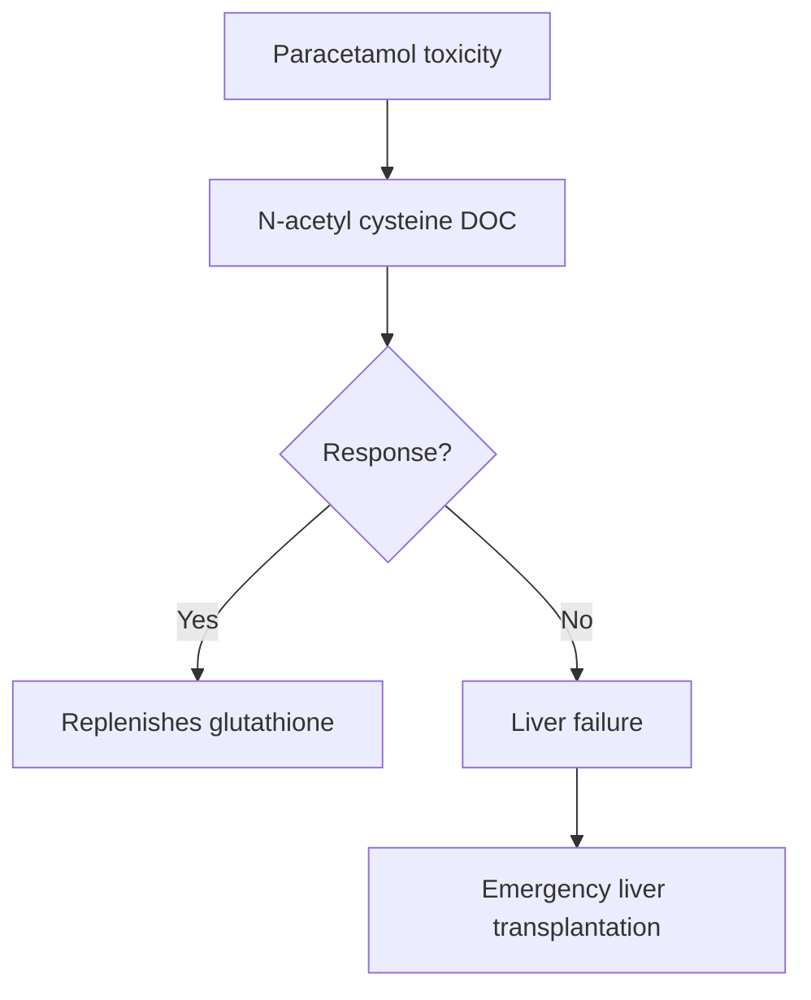
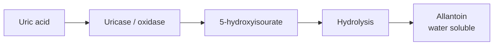

# Autacoids

## Antihistaminics

### H1 Blockers

| First generation | Second generation |
|---|---|
| Crosses BBB (sedating) | Does not cross BBB (non-sedating) |
| C/i in elderly, children, drivers/pilots | — |

### First-generation drugs and uses

- Muscarinic −:
  - Promethazine.
  - Diphenhydramine.
  - Dimenhydrinate.
  - Uses:
    - EPS (acute dystonia, Parkinsonism).
    - Motion sickness.
- **Dicyclomine:** DOC for morning sickness.
- **Chlorpheniramine:** least sedative 1st-generation drug; Rx of cough (daytime use).
- **Doxepin:** currently under TCA.
- **Cyproheptadine:** currently under 5-HT2 −.
- Hydroxyzine.

### Second-generation drugs

- Cetirizine:
  - Metabolite of hydroxyzine.
  - Most sedative 2nd-generation drug.
- Levocetirizine: more potent.
- Astemizole.
- Terfenadine.
- Fexofenadine: overall least sedative (daytime use).
- Loratadine; desloratadine (more potent).
- Rupatadine: additional anti-inflammatory effect.
- Topical antihistaminics:
  - Olopatadine.
  - Levocabastine.
  - Ketotifen.
  - **Azelastine (preferred):** intranasal spray for allergic rhinitis.

> Astemizole and terfenadine cause QT prolongation and are banned.

## Motion Sickness

1. **Scopolamine:** DOC; transdermal patch applied the night before travel.
2. Promethazine / diphenhydramine / dimenhydrinate:
   - Oral tablet.
   - 1 hour before travel.
   - Highly sedative.

> DOC for allergic rhinitis: **Intranasal steroids (Fluticasone).**

## NSAIDs

### Acetaminophen (Paracetamol)

- Use: analgesic & antipyretic effect.
- Side effect: hepatotoxic (most common cause of poisoning worldwide).
- ↑ risk in chronic alcoholics / fasting.
- Histopathology: centrilobular necrosis + periportal sparing.
- Cause: metabolite NAPQI depletes glutathione.
- Toxic dose:
  - >150–250 mg/kg or >10 g: hepatotoxic.
  - >20 g: fatal.

### Treatment of paracetamol toxicity

### Aspirin

**Dose-dependent effects:**

- 50–325 mg OD: anti-aggregant.
- 325–650 mg SOS: antipyretic/analgesic.
- 3–4 g/day (divided): anti-inflammatory; e.g. RA (aspirin analgesic of choice).

**Side effects:**

- Reye’s syndrome (hepatic encephalopathy): C/i in viral fever in children.
- ↑ uric acid: C/i in gout.

### NSAID notes

- **Indomethacin:**
  - DOC for acute gout.
  - Closure of patent ductus arteriosus (PDA).
- **Ibuprofen:** DOC for closure of PDA in India.
- **Piroxicam:** long acting; chronic pain.
- **Nimesulide:** hepatotoxic; C/i in children <12 years.
- **Ketorolac:** post-operative pain; eye pain for ocular pain.

### Selective COX-2 inhibitors

- ↑ risk of myocardial infarction: not preferred.
- Celecoxib, etoricoxib: 3rd line for pain and inflammation.
- Parecoxib: post-operative pain.
- Lumiracoxib: hepatotoxic (banned).
- Valdecoxib, rofecoxib: ↑ risk of MI (banned).

### Aspirin / salicylate toxicity management

- Bicarbonates: antidote of choice.
- If pulmonary edema develops: dialysis.

## Prostaglandin Analogs

| Prostaglandin | Drug | Uses |
|---|---|---|
| **E1** | Misoprostol | Abortion (+ mifepristone); NSAID-induced gastric ulcer; maintain patency of ductus arteriosus. |
| **E1** | Alprostadil | Maintain patency of ductus arteriosus; erectile dysfunction. |
| **E2** | Dinoprostone | Cervical ripening (DOC); PPH. |
| **F2α** | Carboprost | PPH. |
| **—** | Latanoprost / bimatoprost | Open-angle glaucoma. |
| **I2** | Epoprostenol (synthetic), Iloprost, Beraprost, Treprostinil, Selexipag (receptor agonist) | Pulmonary HTN. |

### Pulmonary hypertension — Rx

- Stage II/III:
  - Endothelin −: Bosentan, ambrisentan (DOC).
  - Alternative: PDE-5 − (Sildenafil); CCB.
- Stage IV: **Epoprostenol (DOC).**
- PPH: **Oxytocin DOC.**

## Disease Modifying Anti-Rheumatoid Drugs (DMARDs)

| Conventional DMARDs | Biological DMARDs | Targeted DMARDs |
|---|---|---|
| Methotrexate (DOC): ↑ adenosine; long-term s/e: cirrhosis (rheumatic/psoriatic arthritis) | Parenteral: IL-1 − (anakinra); CD-20 − (rituximab); TNF-α − (infliximab, certolizumab, adalimumab, golimumab, etanercept); IL-6 − (sarilumab, tocilizumab); CD-80/86 − (abatacept) | Last-line: JAK inhibitors; oral: baricitinib, upadacitinib, tofacitinib |
| Hydroxychloroquine | — | — |
| Sulfasalazine | — | — |
| Cyclophosphamide | — | — |
| Immunomodulators: azathioprine, cyclosporine, mycophenolate mofetil, leflunomide | — | — |

**Mnemonic for TNF-α inhibitors: IN CAGE**

- Infliximab.
- Certolizumab.
- Adalimumab.
- Golimumab.
- Etanercept.

## Anti-gout Drugs

### Acute gout

- DOC: **Indomethacin**.
- Alternative: **Colchicine** — microtubules − chemotaxis.

### Chronic gout

**Aim: ↓ uric acid (UA).**

#### Xanthine oxidase inhibitors

- MOA: − UA synthesis.
- Allopurinol (DOC).
- Oxypurinol (if SJS with allopurinol).
- Febuxostat (most effective).
- Side effects:
  - Xanthine stones.
  - Stevens-Johnson syndrome (HLA-B5801).
  - Acute gout (prophylaxis with indomethacin).

#### Uricosuric drugs

- MOA: ↑ UA excretion.
- Sulfinpyrazone.
- Probenecid.
- Benzbromarone.
- Lesinurad: only as add-on.
- S/e: urate stones.

#### Uricase analogs

- Pegloticase: last line; monotherapy or add-on to allopurinol; effective in renal failure.
- Rasburicase: used in tumor lysis syndrome.
