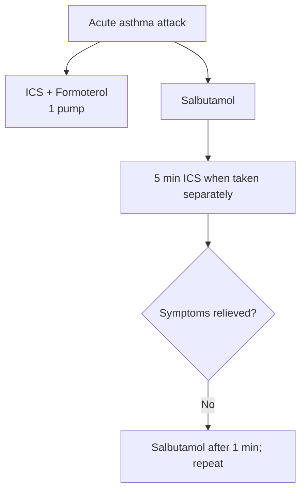
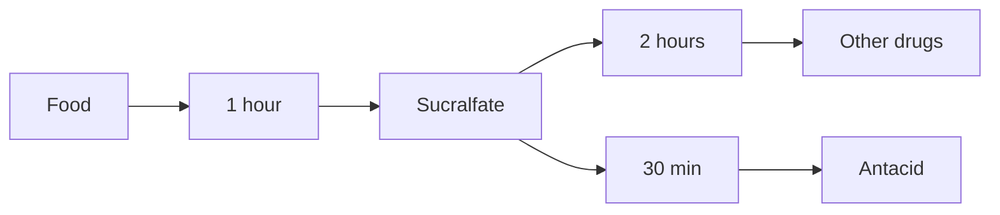
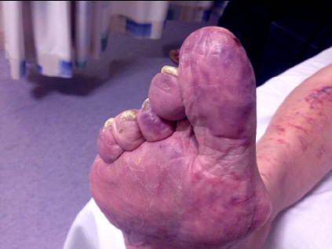

# Drugs Acting on RS, GIT and Blood

## Antiasthmatic Drugs

| Drugs | MOA / Use | Side effects / notes |
|---|---|---|
| **β2 agonists** | Bronchodilation | — |
| **Anticholinergics** | See Drugs Acting on Autonomic Nervous System | — |
| **Methylxanthines: Theophylline, Aminophylline** | Bronchodilation: adenosine A1 −; PDE-3 > 4 −. Anti-inflammatory: PDE-4 −; histone deacetylase + (similar to steroids); ↑ IL-10. | Adenosine A1 −: seizure, arrhythmia, diuresis. PDE-4 −: GI symptoms, headache. |
| **Inhaled corticosteroids (ICS)** | Fluticasone (most potent), mometasone, ciclesonide, beclomethasone. DOC for persistent BA. TOC for intermittent BA: ICS + formoterol as reliever. | Hoarseness of voice (most common); oropharyngeal candidiasis (most severe). |
| **Systemic steroids** | Acute exacerbation of BA: ↑ β2 receptor density in bronchi → ↑ agonist effect. | — |
| **Zileuton** | LOX − | Hepatotoxic |
| **Montelukast** | LT C4/D4 − | — |
| **Cromolyn sodium, Nedocromil** | Mast cell stabilizers | — |
| **Omalizumab** | Anti-IgE; severe persistent asthma | Not effective in atopic dermatitis (d/t ↑↑ IgE) |
| **Reslizumab, Mepolizumab** | Anti-IL-5 | — |
| **Benralizumab** | Anti-IL-5 receptor | Severe eosinophilic asthma |
| **Dupilumab** | Anti-IL-4 receptor | — |

> **Soft steroids:** prodrugs activated in the lungs → ↓ risk of oral candidiasis.

### Acute asthma attack

### New drugs in COPD

- Roflumilast: PDE-4 −.
- Ensifentrine: PDE-3 & PDE-4 −.

## Antitussives

### Dry cough — centrally acting agents

#### Opioids

- Mild–moderate:
  - Codeine.
  - Pholcodine.
  - Hydrocodone.
- Severe (e.g. bronchial Ca):
  - Methadone.
  - Morphine.

#### Non-opioids

- Dextromethorphan (most common): NMDA −; s/e: hallucinations (↑ risk of abuse).
- Diphenhydramine (antihistaminic).
- Noscapine.
- Levopropoxyphene: opioid derivatives; no opioid action.

### Productive cough

- Expectorant: **Guaifenesin**.
  - MOA: irritation of gastric mucosa → vagal + bronchial → expectoration of mucus.
- Mucolytics: liquify mucus.
  - N-acetyl cysteine: breaks disulfide bond.
  - Ambroxol / bromhexine: depolymerize mucopolysaccharide.
- Management: syrup guaifenesin + ambroxol/bromhexine + salbutamol + menthol.

## Drugs Used in Peptic Ulcer Disease (PUD)

**Aim: ulcer healing.**

| Drug | MOA | Uses | Side effects / notes |
|---|---|---|---|
| **Misoprostol** | Gastroprotective | NSAID-induced gastric ulcer (most specific) | Abdominal cramps |
| **Sucralfate** | In acidic pH: polymerizes → sticky & viscous → coats ulcer | PUD; rectal ulcer | Constipation; gastric bezoars; ↓ absorption of other drugs |
| **Bismuth subsalicylate / subcitrate** | Gastroprotective | H. pylori; traveller’s diarrhoea | Constipation; black discoloration of stool & tongue |
| **Antacids: Al & Mg salts** | Neutralise acid | Dyspepsia (most common); PUD; GERD | Al: constipation; Mg: diarrhea; combined: ↓ absorption of other drugs |
| **PPIs: Omeprazole, Esomeprazole, Pantoprazole, Lansoprazole, Rabeprazole** | − food-induced acid secretion; irreversible inhibition; taken 30 min before food | PUD; GERD; Zollinger–Ellison; H. pylori; Barrett’s esophagus (lifelong Rx) | GI upset; pneumonia; pseudomembranous enterocolitis; deficiency of iron/Ca/Vit B12; osteoporosis (hip fracture) |
| **Vonoprazan** | Potassium-competitive acid blocker (PCAB); ↓ basal + food-induced acid; with/without food | H. pylori − | — |
| **H2 blockers: Cimetidine, Ranitidine, Famotidine** | ↓ basal acid secretion | DOC: prophylaxis of aspiration pneumonia in post-op patients | Cimetidine: impotence, gynaecomastia, galactorrhoea |

### Sucralfate spacing

## Prokinetics

| Drug / class | Uses | Side effects / notes |
|---|---|---|
| **D2 antagonists: Metoclopramide** | GERD; anti-emetics | EPS: acute dystonia; hyperprolactinemia |
| **Domperidone** | Prokinetic / anti-emetic | No EPS |
| **5-HT4 agonists**: Mosapride, Itopride, Prucalopride | GERD; constipation | Cisapride, tegaserod: ↑ QT; banned |
| **Motilin receptor agonists**: Erythromycin, Mitemcinal | Gastroparesis | — |
| **CCK1/A receptor antagonist**: Dexloxiglumide | — | — |

## Antiemetics

### Chemotherapy-induced nausea/vomiting

| Group | Drugs | Notes |
|---|---|---|
| **5-HT3 antagonists (DOC)** | Ondansetron (shortest); Palonosetron (longest, most potent) | Other uses: post-op vomiting, radiation-induced vomiting |
| **NK1R antagonists** | Aprepitant, Rolapitant, Netupitant | Longer acting |
| **CBR1 agonists** | Dronabinol, Nabilone | S/e: hypotension, blood-shot eyes |
| **Others** | Dexamethasone; Metoclopramide; Olanzapine | — |

> DOC for morning sickness: **Doxylamine**.

## Laxatives

| Category | Drugs / examples | Notes |
|---|---|---|
| **Osmotic** | Mannitol; PEG; NaPO₄ | Mannitol: 2nd line for constipation (flatulence & cost); hepatic encephalopathy; PEG DOC: IBS + constipation; NaPO₄ for bowel preparation |
| **Stimulant** | Bisacodyl; senna; cascara | Low-grade inflammation of large intestine → ↑ contraction; effect after 6–8 h; max 10 days; s/e: atonic colon; senna: melanosis coli, urine discoloration |
| **Chloride secretory agents** | Lubiprostone; Linaclotide | Lubiprostone: type II chloride channels +; Linaclotide: guanylate cyclase + → ↑ cGMP + CFTR |
| **5-HT4 agonists** | Mosapride; Prucalopride | — |
| **Tenapanor** | Na⁺/proton exchanger − | — |
| **Stool softeners** | Docusate sodium; docusate calcium | Least effective |
| **Prebiotics** | Methylcellulose; psyllium husk; bran | Dietary fibers |

## Anti-Diarrhoeal Agents

### Secretory diarrhoea

- **Octreotide: DOC.**

### Non-secretory diarrhoea (for IBS)

- **Loperamide (DOC):** opioid.
- **5-HT3 antagonist:** Alosetron.
  - In females.
  - S/e: ischemic colitis.

### Probiotics

- Lactobacillus.
- Saccharomyces.
- B. clausii.

### Biliary diarrhoea

Bile acid-binding resins:

- Colesevelam.
- Colestipol.
- Cholestyramine.

## Antiaggregants

| MOA / target | Drug(s) | Uses | Side effects / notes |
|---|---|---|---|
| COX-1 inhibitor → ↓TXA2 synthesis | Aspirin | Primary prophylaxis: MI, stroke | Bleeding |
| PAR-1 blocker | Vorapaxar | Primary prophylaxis of MI | Intracranial bleed; C/i in cerebrovascular disease: stroke, TIA |
| GP IIb-IIIa blockers | Abciximab; Tirofiban; Eptifibatide | PCI in MI; unstable angina | Bleeding; thrombocytopenia |
| ADP/P2Y12 irreversible | Clopidogrel (most commonly used); Ticlopidine; Prasugrel (most potent) | Primary prophylaxis: MI, stroke; prasugrel: PCI in MI | Clopidogrel: 2nd line d/t CYP2C19 polymorphism in some population; ticlopidine toxic; prasugrel: intracranial bleed / C/i in stroke, TIA |
| ADP/P2Y12 reversible | Cangrelor (adenosine analog, IV, short acting); Ticagrelor (oral, long acting) | PCI in MI; prophylaxis of MI & stroke; acute coronary syndrome | — |

## Anticoagulants

### Direct thrombin inhibitors (DTI)

| Class / drug | Antidote | Coagulation monitoring | Uses |
|---|---|---|---|
| **DOAC — Dabigatran** | Idarucizumab | Not required | DVT Rx; DOC for prophylaxis of DVT (long term) and thrombosis in non-valvular AF (native valve) |
| **Oral Xa inhibitors — Apixaban, Edoxaban, Rivaroxaban** | Andexanet alfa | Not required | DVT / thromboembolism indications |
| **Warfarin** | 4-factor prothrombin complex > FFP; vitamin K (improves outcome) | PT/INR | Rx & prophylaxis of DVT; DOC for thrombosis prophylaxis in valvular AF (mechanical valve) and non-valvular AF with severe mitral stenosis (<1.5 cm²) |

### Warfarin mechanism

- Blocks VKOR.
- ↓ factors II, VII (1st to ↓), IX, X, protein C (2nd to ↓) & S.

### Side effects of warfarin

- Skin necrosis: d/t rapid ↓ in protein C > S.
- Purple toe.
- Teratogenic:
  - Mid-facial hypoplasia (flat nose).
  - Stippled epiphyseal calcification.
  - CNS defects.

> Drugs that do not require monitoring: DOAC, LMWH, fondaparinux.

> Drugs requiring monitoring: warfarin (PT/INR), parenteral direct thrombin inhibitors, UFH.

### Parenteral direct thrombin inhibitors

- Argatroban.
- Desirudin.
- Bivalirudin.
- Lepirudin.
- Monitoring: aPTT.
- Use: heparin-induced thrombocytopenia (HIT).

### Heparins and fondaparinux

| Feature | UFH | LMWH (enoxaparin, tinzaparin) | Fondaparinux |
|---|---|---|---|
| Size | Large | Small | Smallest |
| Action | Factor Xa = IIa | Factor Xa > IIa | Factor Xa only |
| Risk of HIT | High | Low | Absent |
| Route | S/C: prophylaxis; IV: Rx | S/C: prophylaxis & Rx | S/C |
| T½ | Short | Long acting | Long acting |
| Excretion | Absent (cleared by macrophages) | Unchanged in urine | Unchanged in urine |
| Renal failure | Used | C/i | C/i |
| Antidote | Protamine sulphate | — | — |
| Monitoring | aPTT | Not required | Not required |
| Uses | — | DOC for post-op prophylaxis of DVT | Rx of thrombosis: DVT, pulmonary embolism; DOC for Rx of HIT d/t UFH/LMWH: argatroban |

## Fibrinolytics / Thrombolytics

### Physiology

- Plasminogen → tissue plasminogen activator (tPA) → plasmin.
- Plasmin breaks fibrin (in plasma & clots).

### Drugs

- tPA analogs:
  - Alteplase.
  - Reteplase.
  - Tenecteplase: most clot specific (breaks fibrin in clot > plasma).
- Streptokinase: older drug.

**Uses / notes:**

- Use: STEMI.
- C/i: NSTEMI (d/t bleeding risk > benefit).
- S/e: bleeding.
- DOC for bleeding: tranexamic acid > epsilon-aminocaproic acid (EACA).

## Hematopoietic Agents

- **G-CSF:** granulocyte-colony stimulating factor.
- **GM-CSF:** granulocyte monocyte-colony stimulating factor.

| Lineage | Drugs | Uses | Side effects |
|---|---|---|---|
| **Erythropoiesis** | Epoetin alpha; Darbepoetin | Anemia d/t CRF, chemotherapy, zidovudine, dialysis, pure red cell aplasia | Hypertension; thrombosis |
| | | Iron deficiency | — |
| **Granulopoiesis** | G-CSF analogs: Lenograstim, Filgrastim, Lipegfilgrastim (long acting) | Neutropenia; HIV; chemotherapy cycle | Bone pain |
| | GM-CSF analog: Sargamostim | — | — |
| **Thrombopoiesis** | IL-11 analog: Oprelevekin | Chemotherapy-induced thrombocytopenia | — |
| | Thrombopoietin agonists: Eltrombopag, Romiplostim | Immune thrombocytopenic purpura (ITP) | — |
| | Newer: Lusutrombopag, Avatrombopag | ↓ risk of bleeding in patients with liver cirrhosis prior to planned procedures | Given once |
