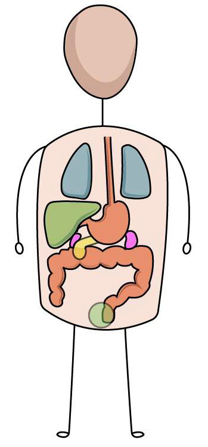
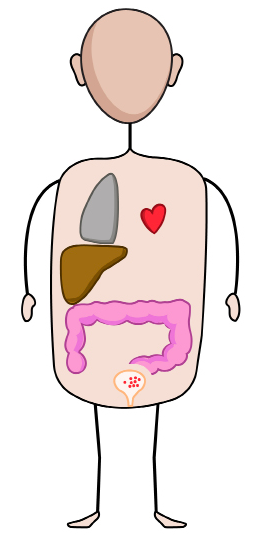
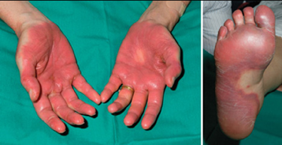
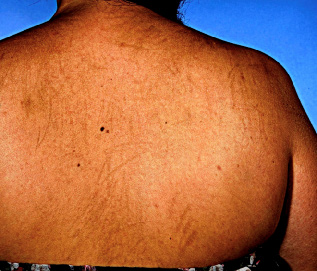

# Immunomodulators and Anticancer Drugs

## Immunosuppressants

| Drug / class | MOA | Uses | Side effects / notes |
|---|---|---|---|
| **Cyclosporine / Tacrolimus** | Calcineurin inhibitors → ↓ transcription of IL-2 | 1st line drugs post transplantation (GVHD) | Tacrolimus > cyclosporine: nephrotoxicity, neurotoxicity, hyperkalemia, hypertension, hepatotoxicity, hyperglycemia. Cyclosporine: hirsutism, gingival hyperplasia, hyperlipidemia, hyperuricemia. |
| **Everolimus / Sirolimus** | mTOR inhibitors | 2nd line drugs | Hypokalemia |
| **Azathioprine** | Prodrug of 6-mercaptopurine | — | Bone marrow suppression; hepatotoxicity |
| **Belatacept** | CD-80/86 inhibitor | — | — |
| **Alemtuzumab** | CD-52 inhibitor | — | — |
| **Belumosudil** | Rho kinase inhibitor | — | — |
| **Thalidomide / Lenalidomide** | Anti-inflammatory; anti-angiogenic; anti-neoplastic; immunosuppressant | Rheumatoid arthritis; multiple myeloma; GVHD | Phocomelia: d/t cereblon & tubulins block; block vasculogenesis → ↑ free radicals → block fetal organ development |
| **Basiliximab** | Blocks IL-2 receptor/CD-25 | Prophylaxis of acute graft rejection | — |
| **Mycophenolate mofetil** | Blocks inosine monophosphate (IMP) dehydrogenase | 1st line immunosuppressant | GI upset |
| **Leflunomide** | Blocks dihydroorotate dehydrogenase (inhibits pyrimidine synthesis) | — | Bone marrow suppression; hepatotoxic |
| **Muromonab** | Blocks CD-3 | Rx of acute graft rejection | Rebound hypertension |

> Azathioprine/6-mercaptopurine + allopurinol (xanthine oxidase −; metabolized by XO) → **decrease dose of azathioprine/6-mercaptopurine by 75%.**

> **Abatacept:** Rx of rheumatoid arthritis.

## Solid Tumors

| Cancer | DOC / regimen / add-on |
|---|---|
| **Choriocarcinoma** | Methotrexate (DOC). |
| **Ectopic pregnancy** | Methotrexate (DOC). |
| **Osteosarcoma** | Methotrexate (DOC). |
| **Brain tumor** | Temozolomide. |
| **Lung Ca** | Cisplatin. |
| **Hepatocellular Ca** | Sorafenib. |
| **Pancreatic Ca** | Gemcitabine. |
| **Renal cell Ca** | Pembrolizumab. |
| **Anal Ca** | 5-FU + IV Mitomycin C. |
| **Urogenital Ca** | DOC: Cisplatin. |
| **Uterine / ovarian Ca** | Paclitaxel. |
| **Bladder Ca** | Gemcitabine. |
| **Cervix Ca** | Cisplatin (only). |
| **Testicular Ca** | BEP: Bleomycin + etoposide + cisplatin. |
| **Prostate Ca** | Goserelin (exception). |
| **Head & neck Ca** | Cisplatin. |
| **Gastric / upper GI / esophageal Ca** | Cisplatin. |
| **Colorectal Ca (lower GI)** | Folinic acid + 5-FU + oxaliplatin / irinotecan → FOLFOX / FOLFIRI regimen. |

### Mitomycin C

- IV: anal Ca.
- Intravesical: bladder Ca.
- Topical: prevent laryngotracheal stenosis / post-nasal surgery synechiae.

## Breast Cancer

### ER +ve

- Pre-menopausal: **Tamoxifen**.
- Post-menopausal: **Letrozole**.

### HER-2 +ve

- DOC: **Trastuzumab**.
- Pertuzumab.
- Lapatinib.
- Neratinib.

### BRCA +ve

- **Olaparib:** PARP −.

### Resistance / relapse

- **Palbociclib:** CDK-4,6 −.

## Leukemia

| Leukemia | Regimen / drugs |
|---|---|
| **ALL** | VPAD regimen: vincristine, prednisolone, asparaginase, daunorubicin. |
| **AML** | Cytarabine + daunorubicin / idarubicin + gilteritinib/midostaurin if FLT3 mutation. |
| **CLL** | Fludarabine + cyclophosphamide + rituximab. |
| **CML** | BCR-ABL tyrosine kinase −. 1st gen: imatinib (DOC); 2nd gen: dasatinib, nilotinib, bosutinib; 3rd gen: ponatinib. Asciminib: BCR-ABL TK − (allosteric site −). Omacetaxine: BCR-ABL protein −. IFN-α. |
| **Hairy cell leukemia** | Cladribine (DOC). |
| **Promyelocytic leukemia** | Retinoic acid (DOC); arsenic trioxide. |

> GIST: **Imatinib DOC.**

## Sickle Cell Disease

- **Hydroxyurea DOC.**
- MOA: ↑ HbF.
- S/e: painful leg ulcers.

## Side Effects and Antidotes of Anti-Cancer Drugs

| Toxicity / side effect | Drug(s) / association | Management / antidote |
|---|---|---|
| **SIADH** | Vincristine | — |
| **Ototoxicity** | Cisplatin | — |
| **Max. nausea, vomiting** | Cisplatin | — |
| **Nephrotoxicity** | Cisplatin | NaCl + mannitol |
| **Cardiotoxicity** | Doxorubicin; Daunorubicin; Trastuzumab | Dexrazoxane for anthracyclines |
| **Hemorrhagic cystitis** | Ifosfamide > Cyclophosphamide | Mesna |
| **Bone marrow suppression** | Pemetrexed > Methotrexate | Folinic acid (leucovorin) > folic acid + inj. Vit B12 |
| **Cataract** | Tamoxifen | — |
| **Pulmonary fibrosis** | Bleomycin > Busulfan | — |
| **Hepatotoxicity** | 6-Mercaptopurine; 6-Thioguanine; Methotrexate | — |
| **Diarrhea** | Irinotecan | Loperamide for delayed diarrhea |
| **Hand and foot syndrome** | Capecitabine > 5-FU | Vit B6 |
| **Bleomycin: flagellate dermatitis** | Bleomycin | — |
| **Hyperuricemia d/t tumor lysis syndrome** | — | Allopurinol (solid tumors); Rasburicase (leukemias) |
| **Neutropenia** | — | Lipegfilgrastim |
| **Thrombocytopenia** | — | Oprelvekin |
| **Anemia** | — | Darbepoetin |

## Miscellaneous Anti-Cancer Drugs

### Nomenclature of monoclonal antibodies

- **Trastuzumab** — `tu/tum`: tumor.
- **Abciximab** — `c/ci`: circulation.
- **Bezlotoxumab** — `tox`: toxin (C. difficile).
- **Palivizumab:** virus.
- **Infliximab** — `li/lim`: lymphocyte (R.A).
- **Erenumab** — `n/ne`: neurology.
- **Raxibacumab** — `bac`: bacteria (anthrax).
- **Denosumab** — `os`: osteoporosis.

### Kinase inhibitors

1. **Imatinib:** BCR-ABL TK −.
2. **Gilteritinib:** FLT3 kinase − (AML).
3. **Dabrafenib:** BRAF −.
4. **Cobimetinib:** MEK 1/2 −.
5. **Idelalisib:** PI-3K − (leukemia).
6. **Ibrutinib:** Bruton’s TK − (B-cell lymphomas).

- **Asparaginase:** leukemia.
- **Olaparib:** poly-ADP ribose polymerase (PARP) −; for breast Ca.
- **Palbociclib:** CD-4/6 −.
- **Bortezomib:** proteasome −; DOC for multiple myeloma along with lenalidomide + dexamethasone.
- Melanoma.

## Lymphoma

### Immune-checkpoint inhibitors

#### PD-1 −

- Retifanlimab.
- Nivolumab: Hodgkin’s lymphoma.
- Dostarlimab.
- Cemiplimab.
- Pembrolizumab: uterine Ca.

#### PDL-1 −

- Durvalumab.
- Avelumab.
- Atezolizumab.

#### CTLA4 −

- Ipilimumab.

### Hodgkin lymphoma

**ABVD regimen:**

- Adriamycin.
- Bleomycin.
- Vinblastine.
- Dacarbazine.

### Non-Hodgkin lymphoma

**High grade: R-CHOP regimen**

- Rituximab.
- Cyclophosphamide.
- Hydroxydaunorubicin.
- Oncovin (Vincristine).
- Prednisolone.

**Low grade:** FCR regimen.
