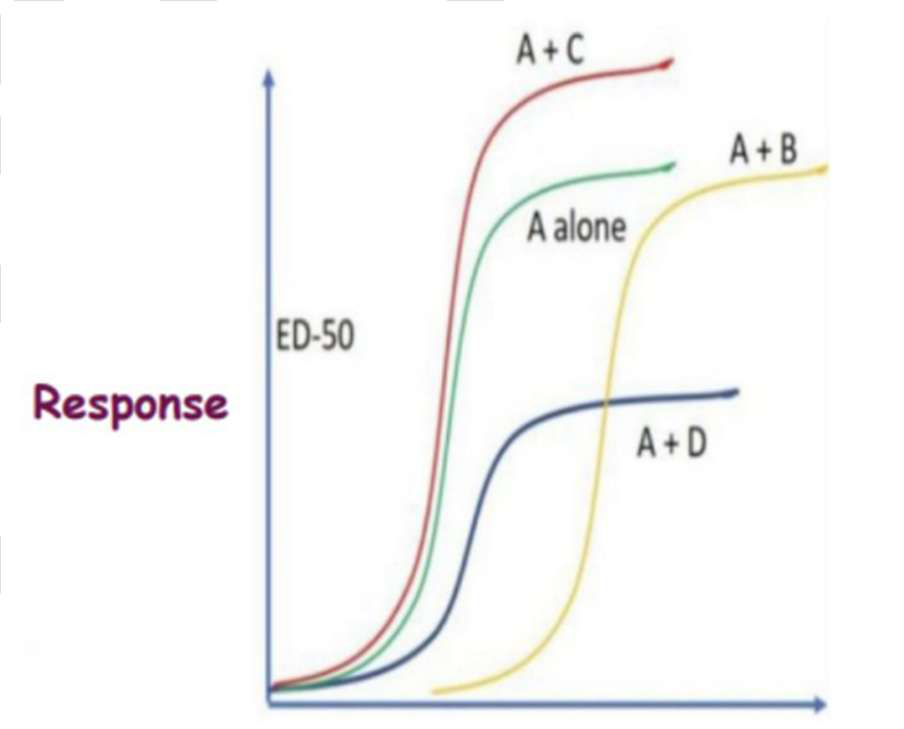

# Pharmacology Part 1 - Test & Discussion

> **Answer extraction note:** Answers are transcribed from the filled bubbles on the supplied answer sheet. The initial phone-number grid was excluded from the question answers. Questions with no filled bubble are recorded as **Not marked**.

## Emergency, Toxicology & Autonomic Pharmacology

### Question 1

A patient is in persistent ventricular fibrillation (VF) despite two shocks and high- quality CPR. You have already administered one dose of epinephrine. Which antiarrhythmic is preferred for the first dose?

- a. Atropine 1mg
- b. Amiodarone 300mg
- c. Lidocaine 1.5mg/kg
- d. Adenosine 6mg

#### My answer
**B** - Amiodarone 300mg

#### Discussion

### Question 2

A 72-year-old patient with septic shock is being managed in the ICU. Despite adequate fluid resuscitation with IV crystalloids, the patient's mean arterial pressure (MAP) remains at 58 mmHg with a heart rate of 160 bpm. Which of the following vasopressors would be most appropriate to initiate in this specific scenario to achieve a target MAP of 65 mmHg?

- a. Norepinephrine
- b. Epinephrine
- c. Dopamine
- d. Vasopressin

#### My answer
**D** - Vasopressin

#### Discussion

### Question 3

A 62-year-old male is brought to the Emergency Department in severe respiratory distress with diffuse urticaria and profound hypotension (BP 68/34 mmHg) shortly after a bee sting. He has a significant past medical history of chronic heart failure and atrial fibrillation, for which he takes carvedilol. He was administered three doses of intramuscular (IM) epinephrine (0.5 mg each), initiated on high-flow oxygen, and given 2 litres of IV crystalloid boluses. Despite these interventions, the patient remains hypotensive (BP 72/38 mmHg) and has developed significant wheezing. Which of the following is the most appropriate next pharmacological intervention?

- a. Administer IV Diphenhydramine 50 mg
- b. Start a Norepinephrine infusion
- c. Administer IV Glucagon 1-5 mg
- d. Administer IV Methylprednisolone 125 mg

#### My answer
**D** - Administer IV Methylprednisolone 125 mg

#### Discussion

### Question 4

A 9-year-old boy is brought to a rural health centre in Maharashtra 2 hours after being stung by an Indian red scorpion (Mesobuthus tamulus). He is sweating profusely and has cold extremities. His vital signs are: BP 150/110 mmHg, HR 140 bpm, and respiratory rate 34/min. Bilateral fine crepitations are heard in the lower lung zones, and he has persistent, painful priapism and pulmonary edema. Which of the following is the most appropriate first-line pharmacological management to prevent worsening of myocardial damage and resolve pulmonary edema?

- a. Administer IV Furosemide (Lasix) 1 mg/kg
- b. Administer oral prazosin 30 mcg/kg
- c. Administer IV Atropine 0.6 mg
- d. Administer IV Nitroprusside immediately

#### My answer
**B** - Administer oral prazosin 30 mcg/kg

#### Discussion

### Question 5

A 22-year-old female with a history of severe peanut allergy presents to her primary care physician and is advised to use epinephrine nasal spray 2 mg by herself whenever needed. According to current guidelines for epinephrine nasal spray, which of the following instructions is correct?

- a. If symptoms do not improve after the first dose, a second dose should be administered in the opposite nostril after 5 minutes.
- b. The patient should be instructed to sniff deeply during administration to ensure the medication reaches the upper nasal cavity.
- c. If the patient has a common cold with nasal congestion, the spray is contraindicated, and an intramuscular auto-injector must be used instead.
- d. In the absence of clinical improvement, a second dose may be administered in the same nostril using a new device starting 5 minutes after the first dose.

#### My answer
**A** - If symptoms do not improve after the first dose, a second dose should be administered in the opposite nostril after 5 minutes.

#### Discussion

### Question 6

Which of the following drugs can worsen myasthenia gravis? 1. Phenytoin 2. Meropenem 3. Quinidine 4. Digene Antacids Select the correct answer:

- a. 1 and 3 only
- b. 1 and 2 only
- c. 1, 2, 3, 4
- d. 1 only

#### My answer
Not marked

#### Discussion

### Question 7

A patient presents with acute glaucoma and a red eye. The Intraocular pressure is 38 mmHg. Anterior chamber examination shows aqueous flare and keratic precipitates. Which of the following medications should not be given?

- a. Timolol
- b. Mannitol
- c. Acetazolamide
- d. Latanoprost

#### My answer
Not marked

#### Discussion

### Question 8

A 45-year-old agricultural worker is being treated for severe organophosphate poisoning. He has received 30 mg of atropine over the past hour. His heart rate has increased to 110/min, and his pupils are now mid-dilated; however, he remains hypoxic (SpO2 88%) with persistent, profuse bronchial secretions and diffuse crackles on lung auscultation. He subsequently develops generalized tonic-clonic seizures. Which of the following is the most appropriate next step in his pharmacological management?

- a. Continue escalating atropine doses until the heart rate reaches 140 bpm.
- b. Administer diazepam 10 mg IV and continue Atropine titration until the lungs are clear.
- c. Start a glycopyrrolate infusion as it crosses the blood-brain barrier more effectively than Atropine to stop seizures.
- d. Administer magnesium sulfate to stabilize the neuromuscular junction and stop the seizures.

#### My answer
**B** - Administer diazepam 10 mg IV and continue Atropine titration until the lungs are clear.

#### Discussion

## CNS, Autonomic & Urogenital Pharmacology

### Question 9

A 10-year-old boy is brought to the clinic by his parents for persistent inattention, hyperactivity, and impulsivity that significantly interfere with his school performance. After a thorough evaluation, he is diagnosed with ADHD. He also has a motor tic disorder and a strong family history of substance use disorder. His parents are concerned about the potential for addiction and worsening of his tics. Which of the following medications is the most appropriate first-line choice for this patient?

- a. Methylphenidate
- b. Atomoxetine
- c. Dexamfetamine
- d. Modafinil

#### My answer
Not marked

#### Discussion

### Question 10

A 50-year-old patient has been taking clonidine 0.3 mg twice daily for the past 2 years and suddenly discontinues the medication. Within 24 hours, he presented to the emergency department with a blood pressure of 220/130 mmHg, tremors, and palpitations. Which of the following best describes the cellular mechanism responsible for this rebound hypertensive crisis?

- a. Rapid up-regulation of beta receptors in the heart leading to increased stroke volume.
- b. Chronic down-regulation of central alpha 2 receptors, resulting in a massive release of norepinephrine when the drug is removed.
- c. Immediate activation of the renin- angiotensin-aldosterone system (RAAS) due to decreased renal perfusion.
- d. Displacement of stored norepinephrine from presynaptic vesicles into the synaptic cleft by the drug's metabolites.

#### My answer
**B** - Chronic down-regulation of central alpha 2 receptors, resulting in a massive release of norepinephrine when the drug is removed.

#### Discussion

### Question 11

A 35-year-old patient with a known history of COPD undergoes orthopaedic surgery. Postoperatively, he develops urinary retention. Which of the following is the most appropriate drug to manage this condition?

- a. Neostigmine
- b. Bethanechol
- c. Tamsulosin
- d. Imipramine

#### My answer
**B** - Bethanechol

#### Discussion

### Question 12

A 68-year-old woman presents with a 6- month history of a sudden, overwhelming urge to urinate that she cannot suppress, often resulting in urine leakage before she can reach the bathroom. She also wakes up 3-4 times per night to void. She has a history of Sjögren's syndrome and chronic constipation. Which of the following is the most appropriate drug therapy?

- a. Oxybutynin
- b. Mirabegron
- c. Duloxetine
- d. Topical Estrogen

#### My answer
**A** - Oxybutynin

#### Discussion

### Question 13

Beta-blockers should be avoided in all of the following conditions EXCEPT:

- a. Glaucoma
- b. Variant angina
- c. Bronchial asthma
- d. Diabetes

#### My answer
**A** - Glaucoma

#### Discussion

### Question 14

A 70-year-old man with a history of hypertension and chronic kidney disease presents with bothersome lower urinary tract symptoms (LUTS), including weak urinary stream, urgency, and nocturia. He has a significantly enlarged prostate and is scheduled for cataract surgery in 2 months. The physician wants to initiate a drug that provides rapid symptomatic relief while minimizing the risk of complications during cataract surgery. Which of the following is the most appropriate choice?

- a. Tamsulosin
- b. Finasteride
- c. Alfuzosin
- d. Terazosin

#### My answer
**D** - Terazosin

#### Discussion

## Cardiovascular & Renal Pharmacology

### Question 15

A 62-year-old patient with type 2 diabetes mellitus and chronic kidney disease (CKD) stage 3a with an albumin-to-creatinine ratio of 450 mg/g is being evaluated for pharmacological therapy to slow the progression of kidney disease and reduce cardiovascular mortality. Which of the following drug classes is NOT considered one of the established "four pillars" of pharmacological management of diabetic kidney disease?

- a. SGLT2 Inhibitors
- b. Non-steroidal mineralocorticoid receptor antagonists
- c. Loop diuretics
- d. GLP-1 Receptor Agonists

#### My answer
**C** - Loop diuretics

#### Discussion

### Question 16

A person at an altitude of 3,000 m presents with breathlessness and pulmonary edema. Which of the following should NOT be used in the management of this condition?

- a. Oxygen supplementation
- b. Dexamethasone
- c. Tadalafil
- d. Nifedipine

#### My answer
**C** - Tadalafil

#### Discussion

### Question 17

A 65-year-old woman with chronic heart failure with reduced ejection fraction (HFrEF) (LVEF 25%) presents for follow-up. She is currently receiving enalapril 10 mg twice daily, carvedilol, and spironolactone. Despite this therapy, she remains symptomatic (NYHA class II), and her NT-proBNP level remains elevated. The physician decides to switch her from the ACE inhibitor enalapril to the angiotensin receptor-neprilysin inhibitor (ARNI) sacubitril/valsartan. Which of the following is the most critical step to ensure patient safety during this transition?

- a. Start the ARNI immediately after the last dose of enalapril to prevent a gap in therapy.
- b. Observe a gap of 36 hours between the last dose of Enalapril and the first dose of ARNI.
- c. Discontinue the carvedilol for 48 hours because ARNI and beta-blockers carry a high risk of synergistic bradycardia.
- d. Pre-treat the patient with a high dose of IV fluids to prevent ARNI-induced pulmonary edema.

#### My answer
**C** - Discontinue the carvedilol for 48 hours because ARNI and beta-blockers carry a high risk of synergistic bradycardia.

#### Discussion

### Question 18

Which of the following drugs is most effective for the treatment of hypernatremia?

- a. Terlipressin
- b. Desmopressin
- c. Tolvaptan
- d. Demeclocycline

#### My answer
**B** - Desmopressin

#### Discussion

### Question 19

A 45-year-old male with a history of congestive heart failure (CHF) is brought to the emergency department following a motor vehicle accident. He has a significant head injury, and an urgent CT scan reveals cerebral edema with a midline shift. The neurosurgeon recommends immediate administration of mannitol to reduce intracranial pressure. However, on examination, the patient has bilateral lung crackles, distended neck veins, and an oxygen saturation of 88% on room air. Which of the following is the most critical contraindication to administering Mannitol in this patient?

- a. Active intracranial bleeding
- b. Pre-existing pulmonary edema
- c. Severe hypovolemia
- d. History of closed-angle glaucoma

#### My answer
**D** - History of closed-angle glaucoma

#### Discussion

### Question 20

A 65-year-old woman has been taking an antihypertensive drug for the past year. Over the last 3 months, she has developed severe, watery diarrhea (6-8 episodes/day), significant weight loss, and malnutrition. A small-intestinal biopsy shows villous atrophy, but serology for celiac disease is negative. Her symptoms do not improve with a gluten-free diet. Which of the following drugs is most likely responsible?

- a. Olmesartan
- b. Losartan
- c. Candesartan
- d. Telmisartan

#### My answer
Not marked

#### Discussion

### Question 21

Which of the following pharmacokinetic/pharmacodynamic (PK/PD) statements regarding ARBs is incorrect?

- a. Telmisartan undergoes exclusive hepatic clearance
- b. Irbesartan undergoes combined hepatic and renal clearance
- c. Losartan is an antagonist of TxA2 receptor and attenuates platelet aggregation
- d. Candesartan is not used in mild to moderate hepatic insufficiency but is used in renal insufficiency

#### My answer
Not marked

#### Discussion

### Question 22

A 55-year-old female is admitted to the neuro-ICU after a confirmed subarachnoid haemorrhage (SAH) due to a ruptured berry aneurysm. She is scheduled for oral nimodipine every 4 hours. Which of the following is the primary clinical rationale for using nimodipine in this patient?

- a. It has a higher affinity for peripheral L- type calcium channels, reducing systemic blood pressure.
- b. Its high lipophilicity allows it to cross the blood-brain barrier and specifically reduce delayed cerebral ischemia (DCI) caused by cerebral vasospasm.
- c. It is the only dihydropyridine that can be safely administered intravenously to achieve rapid neuroprotection.
- d. It acts as an anticoagulant, preventing microthrombi formation in the cerebral vasculature.

#### My answer
Not marked

#### Discussion

### Question 23

Which of the following antianginal drugs is a late sodium current inhibitor and also possesses antiarrhythmic properties?

- a. Ranolazine
- b. Fasudil
- c. Trimetazidine
- d. Ivabradine

#### My answer
**D** - Ivabradine

#### Discussion

### Question 24

A 60-year-old patient develops ventricular tachycardia following an acute myocardial infarction (MI). The physician selects an antiarrhythmic drug that preferentially binds to inactivated sodium channels in depolarized and ischemic myocardial tissue, with relatively little effect on normal myocardium. Which of the following drugs is preferred for ventricular arrhythmias associated with acute myocardial ischemia?

- a. Flecainide
- b. Lidocaine
- c. Verapamil
- d. Propranolol

#### My answer
**B** - Lidocaine

#### Discussion

### Question 25

Which phase of the cardiac action potential is primarily prolonged by amiodarone to produce its Class III antiarrhythmic effect?

- a. Phase 0
- b. Phase 2
- c. Phase 3
- d. Phase 4

#### My answer
**C** - Phase 3

#### Discussion

### Question 26

A 65-year-old patient with heart failure with reduced ejection fraction (HFrEF; LVEF 35%) and type 2 diabetes mellitus is already receiving an ACE inhibitor and a beta-blocker. Despite treatment, he continues to experience occasional shortness of breath. The physician adds empagliflozin to his regimen. What is the primary benefit of adding this class of drug (SGLT2 inhibitor) in heart failure management?

- a. It provides rapid relief of pulmonary edema by acting as a high-potency loop diuretic.
- b. It increases myocardial contractility more effectively than digoxin.
- c. It significantly reduces the risk of heart failure hospitalization and cardiovascular death.
- d. It prevents the development of drug- induced cough associated with ACE inhibitors.

#### My answer
**A** - It provides rapid relief of pulmonary edema by acting as a high-potency loop diuretic.

#### Discussion

### Question 27

Which of the following best describes the mechanism of action of sotatercept in the treatment of pulmonary artery hypertension?

- a. It acts as a potent vasodilator by directly stimulating the soluble guanylate cyclase (sGC) pathway.
- b. It is an activin receptor ligand trap that restores the balance between pro- proliferative and anti-proliferative signalling in the pulmonary vasculature.
- c. It is a selective prostacyclin receptor agonist that primarily increases intracellular cyclic AMP.
- d. It inhibits the endothelin-1 receptor to prevent acute vasoconstriction of the pulmonary arterioles

#### My answer
Not marked

#### Discussion

### Question 28

Which of the following is an irrational combination regimen for the treatment of pulmonary artery hypertension?

- a. Ambrisentan with tadalafil
- b. Tadalafil with riociguat
- c. Ambrisentan with riociguat
- d. Selexipag + ambrisentan + tadalafil

#### My answer
Not marked

#### Discussion

### Question 29

A 62-year-old patient remains hypertensive (155/95 mmHg) despite strict adherence to a triple-therapy regimen consisting of maximum tolerated doses of an ACE inhibitor, a long-acting calcium channel blocker, and a thiazide-like diuretic. After excluding secondary causes and "white-coat" hypertension, which of the following is not the part of the next step in pharmacological management according to current guidelines?

- a. Baxdrostat
- b. Spironolactone
- c. Aprocitentan
- d. Propranolol

#### My answer
**D** - Propranolol

#### Discussion

### Question 30

A 30-year-old pregnant female at 28 weeks gestation is diagnosed with gestational hypertension (BP 155/100 mmHg). She has a well-documented history of bronchial asthma with multiple hospitalizations. The physician decides against using Labetalol. Which of the following is the most appropriate first-line oral alternative for this patient?

- a. Atenolol
- b. Nifedipine
- c. Propranolol
- d. Enalapril

#### My answer
**B** - Nifedipine

#### Discussion

### Question 31

A 62-year-old male is rushed to the emergency department with severe chest pain, diaphoresis, and profound shortness of breath. His blood pressure is 220/125 mmHg and his heart rate is 110 bpm. On auscultation, there are bilateral crackles in the lower half of both lungs, and an ECG shows ST-segment depression in the lateral leads, indicating myocardial ischemia. An urgent bedside echocardiogram reveals left ventricular (LV) dysfunction with a reduced ejection fraction. Which of the following intravenous drug combinations is the preferred treatment for managing this patient's hypertensive crisis?

- a. Nicardipine plus Nitroglycerin
- b. Labetalol plus Nitroglycerin
- c. Nicardipine plus Esmolol
- d. Sodium Nitroprusside

#### My answer
**B** - Labetalol plus Nitroglycerin

#### Discussion

### Question 32

A 65-year-old patient with CKD stage 4 (serum creatinine 3.5 mg/dL) has BP 160/100 mmHg. There is no proteinuria or edema. Which of the following is the best initial antihypertensive choice?

- a. Enalapril
- b. Amlodipine
- c. Atenolol
- d. Furosemide

#### My answer
**A** - Enalapril

#### Discussion

## Respiratory Pharmacology & Toxicology

### Question 33

A new combination of codeine and dextromethorphan is being marketed as an antitussive. Which of the following is correct?

- a. Should not be used as it is irrational
- b. Can be used as both have different mechanisms of action
- c. Should not be used due to addiction potential
- d. Can be used to treat cough effectively

#### My answer
**C** - Should not be used due to addiction potential

#### Discussion

### Question 34

A 65-year-old male with severe COPD (GOLD Stage 4) has been on maximal "Triple Therapy" (Inhaled Steroid + LABA + LAMA) for two years. Despite perfect adherence, he has suffered three severe exacerbations requiring hospitalization in the last year. His most recent lab work shows a blood eosinophil count of 350 cells/microL. Which of the following is the most appropriate biologic to add to his regimen?

- a. Omalizumab
- b. Tezepelumab
- c. Dupilumab
- d. Mepolizumab

#### My answer
Not marked

#### Discussion

### Question 35

A 70-year-old patient is being treated for an acute exacerbation of COPD with an intravenous aminophylline infusion. He suddenly develops multifocal atrial tachycardia (MAT) and several episodes of ventricular tachycardia. Which cellular mechanism is primarily responsible for theophylline-induced cardiac arrhythmias at toxic concentrations?

- a. Direct activation of the vagus nerve leading to paradoxical tachycardia.
- b. Inhibition of adenosine (A1) receptors
- c. Activation of the sodium potassium ATPase pump leading to increased intracytoplasmic calcium.
- d. Blockade of L-type calcium channels in the sinoatrial node

#### My answer
**A** - Direct activation of the vagus nerve leading to paradoxical tachycardia.

#### Discussion

### Question 36

Which of the following medications is a dipeptidyl peptidase 1 (DPP-1) inhibitor given for treatment of non-cystic fibrosis bronchiectasis?

- a. Olodaterol
- b. Brensocatib
- c. Lumacaftor
- d. Tezepelumab

#### My answer
Not marked

#### Discussion

### Question 37

Which of the following drugs is NOT useful in the treatment of pulmonary fibrosis?

- a. Neradomilast
- b. Nintedanib
- c. Roflumilast
- d. Pirfinedone

#### My answer
Not marked

#### Discussion

### Question 38

During a local outbreak in a northern Indian state, several children aged 1-4 years are brought to a pediatric emergency department with a common presentation of sudden-onset anuria and vomiting. All children had recently been treated for minor upper respiratory tract infections with a specific brand of locally manufactured cough syrup. Which of the following compounds, used as an illegal and toxic substitute for glycerin in the cough syrup, is responsible for the above presentation?

- a. Propylene Glycol
- b. Diethylene Glycol
- c. Polyethylene Glycol
- d. Ethylhexyl glycerin

#### My answer
Not marked

#### Discussion

## General Pharmacology & Clinical Trials

### Question 39

The extent of absorption of a drug primarily depends on which of the following pharmacokinetic parameters?

- a. Tmax
- b. Cmax
- c. AUC
- d. Vd

#### My answer
**B** - Cmax

#### Discussion

### Question 40

The dose of a drug depends on all of the following EXCEPT:

- a. Plasma concentration required to achieve
- b. Volume of distribution in the body
- c. Surface area of the body
- d. Half-life of the drug

#### My answer
**D** - Half-life of the drug

#### Discussion

### Question 41

Which of the following G-protein subtypes activates adenylyl cyclase, leading to an increase in intracellular cAMP levels?

- a. G alpha S
- b. G alpha i
- c. G alpha q/0
- d. G alpha 12

#### My answer
**A** - G alpha S

#### Discussion

### Question 42

Which of the following describes the most significant pharmacological concern when co- administering SSRI with tamoxifen?

- a. They increase the serum concentration of tamoxifen, leading to severe hepatotoxicity.
- b. They inhibit the conversion of tamoxifen into its most active metabolite
- c. They compete for estrogen receptors in breast tissue, causing a direct pharmacodynamic antagonism.
- d. They accelerate the renal clearance of tamoxifen, requiring a significant dose increase of the chemotherapeutic agent.

#### My answer
**B** - They inhibit the conversion of tamoxifen into its most active metabolite

#### Discussion

### Question 43

A 70-year-old male is admitted to the Intensive Care Unit (ICU) with life-threatening ventricular arrhythmias. The clinical team decides to initiate an intravenous Amiodarone infusion. To achieve a rapid therapeutic effect, they must first administer a Loading Dose. The following parameters are known for this patient: ● Target Plasma Concentration = 2.0 mg/litre ● Volume of Distribution= 70 Litre/kg ● Patient Weight: 70 kg Calculate the required loading Dose (LD) for this patient to achieve the target plasma concentration immediately.

- a. 140 mg
- b. 4900 mg
- c. 9800 mg
- d. 14000 mg

#### My answer
**C** - 9800 mg

#### Discussion

### Question 44

A clinical pharmacologist is comparing two experimental drugs. Drug A is eliminated at a rate proportional to its plasma concentration, while Drug B is eliminated at a constant rate of 10 mg per hour, regardless of how much drug is in the system. Which of the following statements correctly identifies the pharmacokinetic properties of these two drugs?

- a. Drug A has a variable half-life that increases as the dose increases.
- b. Drug B follows First-order kinetics and will reach steady state after 4 to 5 half- lives.
- c. Drug A maintains a constant half-life, meaning the time required to reduce the plasma concentration by 50% remains the same.
- d. Drug B is safer to dose because its elimination rate speeds up as the plasma concentration rises.

#### My answer
**C** - Drug A maintains a constant half-life, meaning the time required to reduce the plasma concentration by 50% remains the same.

#### Discussion

### Question 45

Phase II clinical trials are primarily conducted to assess which of the following?

- a. Dose
- b. Safety
- c. Pharmacokinetics
- d. Efficacy

#### My answer
**D** - Efficacy

#### Discussion

## GI, Hepatology & Immunopharmacology

### Question 46

Which of the following drugs, when administered concomitantly with loperamide, best explains the development of sedation and drowsiness, despite loperamide typically having minimal central nervous system (CNS) effects?

- a. Azithromycin
- b. Ciprofloxacin
- c. Clarithromycin
- d. Ceftriaxone

#### My answer
**C** - Clarithromycin

#### Discussion

### Question 47

A 52-year-old patient with obesity and type 2 diabetes is diagnosed with MASH (Metabolic Dysfunction-Associated Steatohepatitis) and moderate liver fibrosis (Stage F2). Which of the following medications is currently approved for reducing liver fibrosis in this patient?

- a. Ursodeoxycholic acid
- b. Resmetirom
- c. Metformin
- d. Ezetimibe

#### My answer
Not marked

#### Discussion

### Question 48

Which of the following is used in the treatment for chemotherapy-induced diarrhoea (CID) that remains refractory after 24-48 hours of high-dose loperamide?

- a. Bismuth subsalicylate
- b. Octreotide
- c. Atropine
- d. Diphenoxylate

#### My answer
**D** - Diphenoxylate

#### Discussion

### Question 49

Which of the following is NOT a property of vonoprazan compared with proton pump inhibitors (PPIs)?

- a. Faster onset
- b. Better efficacy in erosive esophagitis
- c. Can be taken irrespective of food intake
- d. Risk of achlorhydria is more

#### My answer
**C** - Can be taken irrespective of food intake

#### Discussion

### Question 50

A 45-year-old female with a long history of poorly controlled Type 2 Diabetes presents with persistent bloating, early satiety, and vomiting of undigested food several hours after eating. A gastric emptying study confirms a diagnosis of diabetic gastroparesis. The physician considers prescribing a prokinetic agent but is concerned about the patient's history of anxiety and a family history of movement disorders. Which of the following drugs is avoided in this patient?

- a. Metoclopramide
- b. Domperidone
- c. Erythromycin
- d. Prucalopride

#### My answer
**B** - Domperidone

#### Discussion

### Question 51

Which of the following DMARDs is associated with an increased risk of herpes zoster (shingles) infection?

- a. Tocilizumab
- b. Adalimumab
- c. Tofacitinib
- d. Leflunomide

#### My answer
Not marked

#### Discussion

### Question 52

Which of the following most accurately describes the mechanism of paracetamol- induced hepatotoxicity and the role of its antidote?

- a. Hepatotoxicity is caused by the direct binding of paracetamol to mitochondrial membranes; N- acetylcysteine (NAC) works by increasing renal excretion of the parent drug.
- b. Toxicity results from the accumulation of NAPQI, which is normally detoxified by glutathione; NAC acts as a precursor to replenish glutathione and can directly conjugate NAPQI.
- c. Severe liver damage occurs due to the saturation of the CYP2E1 pathway; NAC works by shifting metabolism back toward the safer glucuronidation and sulfation pathways.
- d. The toxic metabolite, NAPQI, causes centrilobular necrosis by inhibiting the sodium potassium ATPase pump; NAC reverses this inhibition and stabilizes the cellular membrane.

#### My answer
**B** - Toxicity results from the accumulation of NAPQI, which is normally detoxified by glutathione; NAC acts as a precursor to replenish glutathione and can directly conjugate NAPQI.

#### Discussion

## Rheumatology, Respiratory & Immunology

### Question 53

Which of the following statements about colchicine is true?

- a. Causes neutrophil metaphase arrest
- b. Stops WBC migration to the site of inflammation
- c. Can be given along with urate-lowering drugs
- d. All of the above

#### My answer
Not marked

#### Discussion

### Question 54

A 45-year-old male with highly aggressive Burkitt lymphoma is admitted for his first cycle of chemotherapy. His baseline investigations reveal a serum uric acid level of 11.2 mg/dL and a serum creatinine level of 2.4 mg/dL. Which of the following medications is the most appropriate choice for this patient?

- a. Allopurinol
- b. Febuxostat
- c. Rasburicase
- d. Probenecid

#### My answer
Not marked

#### Discussion

### Question 55

Which of the following is not a side effect of ergot derivatives?

- a. Gangrene
- b. Valvular damage
- c. Vomiting
- d. Depression

#### My answer
**B** - Valvular damage

#### Discussion

### Question 56

All are side effects of salbutamol except:

- a. Hyperglycemia
- b. Hyperkalemia
- c. Pulmonary vasodilation
- d. Tachycardia

#### My answer
**A** - Hyperglycemia

#### Discussion

### Question 57

A 28-year-old male with moderate ulcerative colitis is started on a new drug after failing mesalamine therapy. Before initiating treatment, the physician performs an ECG to assess for conduction abnormalities and a fundoscopic examination to rule out macular edema. Which of the following drugs is most likely to be started?

- a. Ozanimod
- b. Upadacitinib
- c. Risankizumab
- d. Vedolizumab

#### My answer
Not marked

#### Discussion

## Integrated Pharmacology: PK/PD, CVS & ANS

### Question 58

ASSERTION: Non-paroxysmal supraventricular tachycardia (non-PSVT) is the classical arrhythmia caused by digoxin. REASON: Digoxin has vagomimetic property and leads to variable to complete heart block. Which of the following is correct?

- a. Both assertion and reason are true, and reason is the correct explanation of the assertion.
- b. Both assertion and reason are true, but reason is not the correct explanation of the assertion.
- c. Assertion is true, but reason is false.
- d. Assertion is false, but reason is true.

#### My answer
Not marked

#### Discussion

### Question 59

Assertion: Steady state concentration is independent of half life. Reason: Steady state concentration depends directly on dose and inversely on dosing interval. Which of the following is correct?

- a. Both assertion and reason are true, and reason is the correct explanation of the assertion.
- b. Both assertion and reason are true, but reason is not the correct explanation of the assertion.
- c. Assertion is true, but reason is false.
- d. Assertion is false, but reason is true

#### My answer
**B** - Both assertion and reason are true, but reason is not the correct explanation of the assertion.

#### Discussion

### Question 60

Assertion: Thiazides are associated with increased risk of nephrolithiasis Reason: Potassium citrate is given along with thiazide to prevent kidney stone formation Which of the following is correct?

- a. Both assertion and reason are true, and reason is the correct explanation of the assertion.
- b. Both assertion and reason are true, but reason is not the correct explanation of the assertion.
- c. Assertion is true, but reason is false.
- d. Assertion is false, but reason is true.

#### My answer
**D** - Assertion is false, but reason is true.

#### Discussion

### Question 61

A patient with atrial fibrillation is planned to be started on digoxin therapy. Digoxin has a long half-life of approximately 40 hours. Which is not the appropriate interpretation of this half-life?

- a. Its volume of distribution (Vd) is very large
- b. Its plasma clearance is low
- c. It must always be administered as a loading dose
- d. The maintenance dose should be repeated every 1.5 days

#### My answer
**D** - The maintenance dose should be repeated every 1.5 days

#### Discussion

### Question 62

Which of the following is the most effective drug for controlling early onset emesis?

- a. Dexamethasone
- b. Palonosetron
- c. Dronabinol
- d. Aprepitant

#### My answer
Not marked

#### Discussion

### Question 63

Which of the following is the best drug for managing hypertensive crisis in both the pre- operative and intra-operative period of management of pheochromocytoma?

- a. Phentolamine
- b. Nicardipine
- c. Phenoxybenzamine
- d. Sodium nitroprusside

#### My answer
**C** - Phenoxybenzamine

#### Discussion

### Question 64

Match the following drug toxicities with their appropriate antidotes: Select the correct answer from the given below code:

| Column A | Column B |
|---|---|
| 1. TCA | a. Fomepizole |
| 2. Methanol | b. Esmolol |
| 3. Lithium | c. Alkaline diuresis |
| 4. Theophylline | d. Hemodialysis |
| 5. Methotrexate | e. Sodium bicarbonate |

- a. 1-a / 2-b / 3-c / 4- d / 5-e
- b. 1-d / 2-c / 3-e / 4- b / 5-a
- c. 1-e / 2-a / 3-d / 4- b / 5-c
- d. 1-b / 2-d / 3-a / 4- c / 5-e

#### My answer
**C** - 1-e / 2-a / 3-d / 4- b / 5-c

#### Discussion

### Question 65

Match the following parameters with their graphical representation on a log dose- response curve (DRC): Select the correct answer from the given below code:

| Column A | Column B |
|---|---|
| 1. Drug efficacy | a. Therapeutic index |
| 2. Drug toxicity risk | b. Y axis |
| 3. Drug potency | c. X axis |
| 4. Drug safety | d. Right shift |
| 5. Competitive block | e. Slope of DRC |

- a. 1-a / 2-b / 3-c / 4- d / 5-e
- b. 1-b / 2-e / 3-c / 4- a / 5-d
- c. 1-e / 2-a / 3-d / 4- b / 5-c
- d. 1-b / 2-d / 3-a / 4- c / 5-e

#### My answer
**B** - 1-b / 2-e / 3-c / 4- a / 5-d

#### Discussion

### Question 66

If A represents acetylcholine (ACh), what does C represent?

- a. Bethanechol
- b. Physostigmine
- c. Atropine
- d. Adrenaline

#### My answer
**B** - Physostigmine

#### Discussion

## Respiratory, Neurology, Endocrine & Miscellaneous

### Question 67

A 28-year-old male with a known history of bronchial asthma presents for a follow-up. He currently uses a low-dose ICS-formoterol as needed for symptom relief. However, over the past month, he reports using his inhaler 4-5 days a week, and he has been awakened by wheezing twice in the last fortnight. He has no history of severe exacerbations requiring hospitalization. What is the most appropriate next step in his management?

- a. Continue current as-needed low-dose ICS-formoterol but add Tiotropium.
- b. Switch to a regimen using daily low- dose ICS-formoterol
- c. Add a Leukotriene Receptor Antagonist (Montelukast) and continue as-needed SABA.
- d. Advance to medium-dose ICS maintenance monotherapy

#### My answer
**B** - Switch to a regimen using daily low- dose ICS-formoterol

#### Discussion

### Question 68

Match the following drugs with their respective schedules: Select the correct answer from the given below code:

| Column A | Column B |
|---|---|
| 1. Cisplatin | a. Schedule X |
| 2. Morphine | b. Schedule C |
| 3. Drugs for veterinary use | c. Schedule G |
| 4. Insulin | d. Schedule Z |

- a. 1-a / 2-b / 3-c / 4- d
- b. 1-d / 2-c / 3-b / 4- a
- c. 1-b / 2-d / 3-a / 4- c
- d. 1-c / 2-a / 3-d / 4- b

#### My answer
**D** - 1-c / 2-a / 3-d / 4- b

#### Discussion

### Question 69

A 32-year-old woman with migraine was started on sumatriptan. She now presents with chest tightness, tachycardia, and anxiety after taking the medication. She has no comorbidities or family history of coronary artery disease. Which of the following is the most appropriate drug for prophylactic management of migraine in this patient?

- a. Propranolol
- b. Topiramate
- c. Naratriptan
- d. Ergotamine

#### My answer
**A** - Propranolol

#### Discussion

### Question 70

Which of the following statements regarding Atogepant is true?

- a. It causes vasoconstriction
- b. It is a CGRP 1/2 partial agonist
- c. It is administered via the nasal route
- d. It is used daily for prophylaxis of migraine treatment

#### My answer
Not marked

#### Discussion

### Question 71

Which of the following statements regarding Finerenone is false?

- a. It causes less hyperkalemia than spironolactone
- b. It is cardioprotective
- c. It accumulates in the kidney
- d. It is a high-efficacy antihypertensive drug

#### My answer
Not marked

#### Discussion

### Question 72

Which of the following chemical compounds acts through membranous receptors with tyrosine kinase activity?

- a. Leptin
- b. Baricitinib
- c. Filgrastim
- d. Erlotinib

#### My answer
**A** - Leptin

#### Discussion
