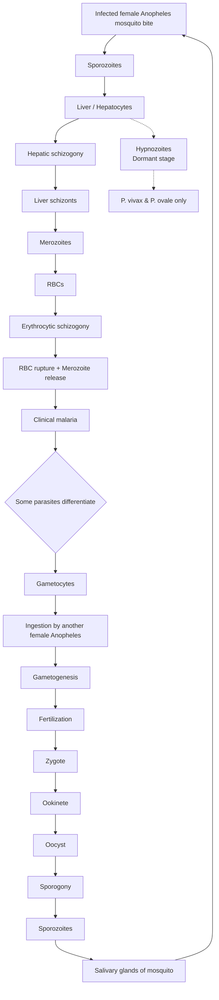

# Antimicrobials Part 2 — Comprehensive, Topic-Organized Study Notes

# Mycobacterial Infections

### TB overview, first-line therapy

#### 1. MYCOBACTERIAL INFECTIONS

##### 1.1 Tuberculosis (TB)
**Basic facts**
- **Causative organism:** *Mycobacterium tuberculosis*.
- **Treatment:** Anti-tubercular therapy (ATT).
- **Indian programme:** National Tuberculosis Elimination Programme (NTEP).

##### 1.2 Anti-TB drugs: core classification

> **India / NTEP:** The drug-susceptible TB regimen below is the Indian programme anchor.

**First-line drugs for drug-susceptible TB**

| Drug         | Symbol | High-yield pharmacological point                                                                                      |
| ------------ | ------ | --------------------------------------------------------------------------------------------------------------------- |
| Isoniazid    | **H**  | ==Prodrug==; inhibits mycolic-acid synthesis after activation by KatG                                                 |
| Rifampicin   | **R**  | Inhibits bacterial DNA-dependent RNA polymerase;==strong CYP/P-gp inducer==                                           |
| Pyrazinamide | **Z**  | ==Prodrug==; active against intracellular/slowly replicating organisms; important hepatotoxicity + ==hyperuricaemia== |
| Ethambutol   | **E**  | Inhibits arabinosyl transferase; **bacteriostatic**; ==optic toxicity==                                               |

- HRZE are given orally.
- **Streptomycin (S)** is no longer a routine first-line drug for drug-susceptible TB, but injectable aminoglycosides retain selected specialist roles.
**Standard Indian drug-susceptible TB regimen**
- **Intensive phase:**
	- 2 months: **HRZE**
- **Continuation phase:**
	- 4 months: **HRE** Indian programme regimen represented by NACO source used for HIV-TB tables.


#### 3. INDIVIDUAL FIRST-LINE ANTI-TB DRUGS
##### 3.1 Isoniazid (H)

###### Mechanism of action
- **Prodrug** requiring activation within the mycobacterium.
- Activated mainly by mycobacterial ==**catalase-peroxidase (KatG)**==.
- Active metabolites ==inhibit **mycolic-acid synthesis**==, an essential component mycobacterial cell envelope.
![[12_Antimicrobials_Part_2_cleaned 2026-10-02 11.09.02.excalidraw]]
###### Resistance
- **katG mutation →** reduce activation of isoniazid.
- **inhA mutation** → Isoniazid and ethionamide not able to inhibit it now
- **inhA promoter mutation** → more inhA to inhibit → less effectiveness of drug → **give high dose INH**
###### Drug properties
- Undergoes **acetylation** liver.
- Acetylator phenotype influences drug exposure.
- Isoniazid ==inhibits several hepatic CYP enzymes== and therefore has clinically relevant interactions.
**Acetylator phenotypes**

| Phenotype       | Pharmacokinetics                          | High-yield implication                                         |
| --------------- | ----------------------------------------- | -------------------------------------------------------------- |
| Fast acetylator | More rapid acetylation and lower exposure | May have lower plasma concentrations                           |
| Slow acetylator | Slower acetylation and higher exposure    | Higher risk of dose-related toxicity, especially neurotoxicity |
###### Adverse Effects
**Neurotoxicity**
**Peripheral neuropathy** is the classic adverse effect.
**Prevention/treatment:** **Pyridoxine (vitamin B6)**.
Risk is increased in settings such as malnutrition, diabetes, HIV infection, pregnancy and pre-existing neuropathy.

**Hepatotoxicity**
- Isoniazid can cause clinically important drug-induced liver injury.
- It is one major hepatotoxic drugs in ATT.

**Exam mnemonic retained from : “INH”**
- **I** - “Insanity” → neuropsychiatric toxicity (e.g. hallucinations/abnormal thoughts in severe toxicity)
- **N** - Neurotoxicity → peripheral neuropathy
- **H** - Hepatotoxicity

Drug interactions
- Isoniazid can inhibit hepatic drug metabolism through CYP inhibition.
- This may increase exposure to selected co-administered medicines.

##### 3.2 Rifampicin (R)
###### Mechanism of action
- Inhibits the **beta subunit of bacterial DNA-dependent ==RNA polymerase**.==
- Resistance is strongly associated with mutations in **rpoB**.

**Major pharmacokinetic property**
**Potent inducer of drug-metabolizing enzymes and transporters**, including:
- CYP3A4 and other CYP enzymes
- P-glycoprotein (P-gp)
- UGT enzymes
This can markedly reduce concentrations of many co-administered drugs.

###### **Important interactions**

| Co-administered drug | Effect of rifampicin | Clinical consequence |
|---|---|---|
| Combined oral hormonal contraceptives | Increased metabolism | Reduced contraceptive effectiveness |
| Warfarin | Increased metabolism | Reduced anticoagulant effect; INR may fall |
| Digoxin | Can increase transporter-mediated elimination | Reduced exposure/effect in some patients |
| Many antiretrovirals | Enzyme/transporter induction | Reduced antiretroviral exposure; regimen-specific adjustment needed |
| Dolutegravir | Reduced exposure via enzyme/transporter induction | DTG dose adjustment required during rifampicin therapy |

> [!note] **Rifampicin + dolutegravir: India-specific high-yield rule**
>NACO's guideline for patients receiving rifampicin-containing ATT uses **dolutegravir 50 mg twice daily** rather than once daily during rifampicin co-administration, with the additional DTG dose continued through ATT and for **2 weeks after rifampicin is stopped**.

###### Administration
- Oral rifampicin is generally taken on an **empty stomach** because food reduces absorption.
**Body-fluid discoloration**
- Can cause **orange-red discoloration of urine and other body fluids**.
- This is generally harmless and should be explained to patients.
###### Important severe adverse effects
- Hepatotoxicity
- Hypersensitivity reactions
- Drug interactions due to enzyme/transport induction
###### **Rifamycin derivatives**

| Drug        | High-yield use/property                                                                                   |
| ----------- | --------------------------------------------------------------------------------------------------------- |
| Rifapentine | Long-acting rifamycin used in selected ==TB preventive-treatment== and TB regimens                            |
| Rifabutin   | Less potent CYP induction than rifampicin; ==useful for selected drug-interaction scenarios==                 |
| Rifaximin   | ==Poorly absorbed; acts mainly gut==; used for hepatic encephalopathy and selected intestinal indications |

**Rifaximin: retained associations**
Since it is poorly absorbed, it can be used as a local antibiotic for gut in cases of:
- Hepatic encephalopathy
- Traveler's diarrhea in appropriate indications
- Irritable bowel syndrome with diarrhea in appropriate indications

##### 3.3 Pyrazinamide (Z)
###### Mechanism
- **Prodrug**, converted to **pyrazinoic acid** by mycobacterial pyrazinamidase.
- Active against ==intracellular and relatively dormant/slow-growing organisms== 
- Interferes with membrane energetics and related cellular processes.
###### Major toxicity
- **Hepatotoxicity**
- ==**Hyperuricaemia**== → arthralgia and possible gout

> [!note] **High-yield gout association**
>- ==**Pyrazinamide** is the strongest TB-drug association with hyperuricaemia/gout.==
>- **Ethambutol** can also increase uric acid.

**Continuation phase**
- omission of pyrazinamide with its hepatotoxicity.
- In a standard 6-month drug-susceptible regimen, Z is used during the initial 2 months and generally not continued continuation phase.

##### 3.4 Ethambutol (E)
###### Mechanism
- Inhibits **arabinosyl transferase**.
- Decreases synthesis of **arabinogalactan**, an important mycobacterial cell-wall component.
- Result: impaired ==mycobacterial cell-wall synthesis==.

**Classification**
- **Bacteriostatic**.
- Among the classic HRZE drugs, it is the major drug remembered as bacteriostatic.

**Major adverse effect: ocular toxicity**
- **Optic neuritis**
- Impaired red-green colour discrimination
- Reduced visual acuity at clinically important toxicity levels

#### 4. STERILIZING ACTIVITY IN TB
drugs that retain activity against dormant or slowly replicating bacilli.
- **Rifampicin**
- **Pyrazinamide**
- **Bedaquiline**

#### 5. ANTI-TB DRUG SAFETY IN ORGAN DYSFUNCTION
##### mnemonic: “HRZES”
- **HRZ** - major hepatotoxic concern.
- **ZES** - major renal-elimination/toxicity considerations simplified teaching rule.
##### TB with liver disease
- Stop HRZ when significant hepatotoxicity is suspected.
- Particularly stop/reconsider pyrazinamide because it is strongly hepatotoxic.
- Use a liver-sparing regimen containing agents such as streptomycin, levofloxacin and ethambutol while specialist/programme guidance is followed.

### Drug Resistance TB 

#### 9. SECOND-LINE TB Drugs
##### 2.2 Second-line / Group-A drugs
**Group A — highly effective drugs**
	**Mnemonic from : BELL**
	- **B** - Bedaquiline
	- **L** - Linezolid
	- **L** - Levofloxacin or moxifloxacin

**Other important drugs**
- Clofazimine
- Cycloserine
- ==Delamanid==
- ==Pretomanid==
- ==Ethionamide==
- Thioacetazone

##### 9.1 Bedaquiline
###### Mechanism
- Inhibits **mycobacterial ATP synthase**.
- Reduces energy production.
**Adverse effect**
- **QT prolongation** is the classic exam association.
###### Mnemonic
“BED” → reduced energy/ATP.

##### 9.2 Linezolid
**Mechanism**
Protein Synthesis inhibition → 50s Ribosome

**Mnemonic:** POST
- **P** - Peripheral neuropathy
- **O** - Optic neuritis
- **S** - ==Serotonin syndrome== risk because linezolid is a reversible, nonselective MAO inhibitor
- **T** - ==Thrombocytopenia== / ==bone-marrow suppression==

**Additional high-yield point**
Risk increases with prolonged therapy; complete blood-count monitoring and neurological/visual assessment are important in prolonged TB courses.

##### 9.3 Fluoroquinolones
Examples:
- Levofloxacin
- Moxifloxacin
These are major drugs in modern DR-TB regimens.

##### 9.4 Clofazimine
###### Important properties
- Used in leprosy and in selected DR-TB regimens.
- Can produce **brown/gray skin hyperpigmentation** due to tissue deposition.
- QT prolongation is also clinically relevant, especially when combined with other QT-prolonging drugs.
**association**
- Cross-resistance may occur with other DR-TB drugs, including bedaquiline, in resistant strains.
##### 9.5 Cycloserine
###### Mechanism
Inhibits enzymes involved in peptidoglycan synthesis, classically:
- **Alanine racemase**
- **D-alanine-D-alanine ligase**
**CNS toxicity**
- Depression
- Psychosis
- Seizures may occur
- Suicidal behaviour risk is clinically important in severe neuropsychiatric toxicity

##### 9.6 Delamanid and ==pretomanid==
###### Mnemonic
the “-manid” / “-nanid” sound to associate these drugs with **mycolic-acid-related cell-wall inhibition**.
###### High-yield point
Both drugs can contribute to **QT prolongation**, particularly in combination regimens where multiple QT-prolonging agents are present.
**Pretomanid: eligibility caveats**
- Not to be used in:
	- younger patients,
	- pregnancy,
	- breastfeeding.

##### 9.7 Ethionamide
###### Mechanism
- Inhibits mycolic-acid synthesis.
- Structurally/pharmacologically resembles isoniazid in important aspects.
**High-yield adverse effects**
- Gastrointestinal intolerance
- Hepatotoxicity
- **Hypothyroidism / goitre** due to antithyroid effects, especially when combined with PAS
- Neuropsychiatric adverse effects may occur
**Erectile dysfunction**
The mnemonic “ETH” associates ethionamide with erectile dysfunction and thyroid effects. The thyroid association is the more established exam pearl.

##### 9.8 Thioacetazone
- Older bacteriostatic TB drug.
- Historically important in HIV-associated TB because of severe hypersensitivity and rash risk.
- **Avoid in HIV infection** because of serious adverse reactions.

#### 2. DRUG-RESISTANT TB regimens
##### 2.1 Definitions

###### MDR/RR-TB
- **RR-TB:** Rifampicin-resistant TB ± resistance to other drugs.
- **MDR-TB:** Resistance to **Isoniazid (H) + Rifampicin (R)**.

###### Pre-XDR-TB
- MDR/RR-TB + **fluoroquinolone resistance**.

###### XDR-TB
- MDR/RR-TB + **FQ resistance + resistance to bedaquiline or linezolid (Group A drugs)

##### 2. Isoniazid-resistant TB
###### H mono/poly-drug resistance
- If **Rifampicin remains susceptible**:
  - **Lfx + R + E + Z**
  - **6 months**
- Can be extended to **9 months** in selected situations:
  - Extensive disease
  - Significant comorbidity
  - Severe extrapulmonary TB
  - Persistent smear positivity at month 4

> **Exam pearl:** H-resistant TB ≠ MDR-TB if rifampicin is still susceptible.

---

##### 3. MDR/RR-TB — Short 6-month regimen

###### BPaLM

**BPaLM = Bedaquiline + Pretomanid + Linezolid + Moxifloxacin**

- Preferred short regimen for eligible **MDR/RR-TB patients ≥14 years**.
- **Duration:** 6 months / 26 weeks.
- Can be extended to **9 months** in selected cases, especially with linezolid toxicity requiring dose reduction.

###### Important point about FQ resistance
- Current **NTEP:** BPaLM can be used **irrespective of FQ resistance**.
- **Moxifloxacin is retained** in the NTEP BPaLM regimen even with FQ resistance.

> **Memory:** **B-Pa-L-M → 6 months**

---

##### 4. MDR/RR-TB — 9–11 month regimen

###### When used
- Patient is **not eligible for BPaLM** but meets criteria for the shorter oral regimen.
- Generally requires **absence of FQ resistance** and no major resistance/contraindication to the regimen drugs.

###### Regimen
- **Initial phase:**  
  **Lzd + Lfx + Cfz + Z + E + high-dose H**
- Followed by continuation therapy with:
  **Lfx + Cfz + Z + E**
- **Bedaquiline** is also incorporated for the specified initial/extended period according to NTEP protocol.

###### Duration
- Usually **9 months**
- May extend to **11 months** depending on treatment response and intensive-phase extension.

> **Exam trap:** Older regimens commonly show **ethionamide**.  
> Current NTEP regimen uses **linezolid instead of ethionamide** in the initial phase.

---

##### 5. Longer oral regimen

###### When used
- Cannot use BPaLM or the 9–11 month regimen.
- Extensive resistance, intolerance, contraindications, or other clinical situations requiring individualized therapy.

###### Core regimen
- **Bdq + Lfx + Lzd + Cfz + Cs**
- Modify according to resistance pattern and drug intolerance.

###### Duration
- **18–20 months**
- **XDR-TB → usually 20 months** in the NTEP framework.

> Modern NTEP regimens are predominantly **all-oral**; injectables are no longer the routine backbone.

---

##### 6. Special situations

###### Pregnancy / Breastfeeding
- **Pretomanid is avoided/not recommended** in pregnancy and breastfeeding.
- Therefore, standard **BPaLM is not used**.
- An appropriate **Lzd-containing shorter regimen** may be used when eligible.
- **Second-line injectable aminoglycosides are avoided in pregnancy** because of fetal ototoxicity.

###### Age <14 years
- Standard **BPaLM protocol is for ≥14 years**.
- Younger children require an appropriate pediatric DR-TB regimen.

---

##### 7. NEET-PG / INI-CET — Must Remember

###### Resistance → regimen

| Resistance pattern | Key regimen | Duration |
|---|---|---|
| **H-resistant, R-sensitive** | **Lfx + R + E + Z** | **6 months** |
| **MDR/RR-TB, eligible ≥14 y** | **BPaLM** | **6 months** |
| **MDR/RR-TB, BPaLM unsuitable but short-regimen eligible** | **9–11 month oral regimen** | **9–11 months** |
| **Complex resistance / short regimens unsuitable** | **Longer oral regimen** | **18–20 months** |
| **XDR-TB** | Longer individualized oral regimen | **~20 months** |

###### Highest-yield facts

- **MDR = H + R resistance**
- **BPaLM = Bdq + Pa + Lzd + Mfx**
- **BPaLM = 6 months**
- Current NTEP uses **BPaLM in eligible patients ≥14 years**.
- **H-resistant ≠ MDR** if rifampicin remains sensitive.
- Older 9-month regimens may show **ethionamide**; current NTEP uses **linezolid** in the initial phase.
- **Pregnancy/breastfeeding → avoid pretomanid-containing BPaLM.**
- **Injectables are not routine backbone** of modern DR-TB regimens.
### TB clinical situations, HIV & prevention

#### 6. SPECIAL CLINICAL SITUATIONS IN TB

##### 6.1 TB with gout / hyperuricaemia
- Pyrazinamide and ethambutol can increase uric acid.
- If gout develops, **do not automatically stop ATT solely because of gout**.
- Add appropriate urate-lowering/symptomatic management when clinically indicated.
> Drug-induced liver injury is a fundamentally different safety problem from uncomplicated asymptomatic hyperuricaemia and should not be conflated with it.

##### 6.2 TB in pregnancy

> **India / NTEP:** The Indian programme-specific pregnancy point is identified below.

**Teaching point**
- Intensive phase: HRZE for 2 months.
- Continuation phase: HR only.
- The **HR-only continuation statement should not be used as a general pregnancy rule**.
- Ethambutol and, in many guidelines/programmes, pyrazinamide can be used during pregnancy when indicated.
- In India, the NACO HIV-TB table continues to use the standard daily ATT framework **2HRZE + 4HRE** for drug-sensitive TB in patients receiving rifampicin-containing ATT.
Pyrazinamide use in pregnancy may be individualized in some guidelines, but pregnancy by itself does **not** mean that ethambutol and pyrazinamide must simply be removed from therapy.

##### 6.3 Corticosteroids in TB
**Mechanistic benefit**
- Anti-inflammatory effect
- Reduce edema
- Reduce inflammatory tissue injury and some long-term fibrotic complications
**Strongest indication: tuberculous meningitis**
- **Dexamethasone or prednisolone** is recommended as adjunctive corticosteroid therapy in TB meningitis.
- Typical taper: approximately **6-8 weeks**, according to guideline/regimen.
**Pericardial TB**
- Corticosteroids **may** be used; this is a conditional rather than universal recommendation.
**Pleural TB and other forms**
- Steroids are not automatically mandatory in every non-meningeal TB manifestation.
> “Steroids are mandatory for pleural TB and every other TB variety” is too broad.

**Intestinal TB**
The labels intestinal TB as an “absolute contraindication” to corticosteroids because of concern about impaired tissue healing/perforation.
> **Correction:** This is **not** an appropriate universal rule. Steroid use in abdominal/intestinal TB is case-specific and should be based on the actual indication, complications and specialist guidance.

#### 7. TB AND HIV CO-INFECTION

> **India / NTEP + WHO context:** Separate the international timing framework from the India-specific NACO/NTEP drug-interaction instruction.

##### Important principle
TB and HIV should both be treated, but ART is **not** simply “forbidden until ATT is finished.”

##### Timing of ART
A high-yield WHO framework is:
- **CD4 ≤50 cells/mm3:** start ART within about **2 weeks** of starting TB treatment in most patients.
- **Higher CD4 counts:** start ART within **8 weeks** in general.
- **TB meningitis:** ART timing is individualized and commonly delayed relative to uncomplicated pulmonary TB because early immune recovery may worsen CNS inflammation.

##### Why the delay can matter
Starting ART causes immune recovery. A rapid inflammatory response against existing TB antigen can produce **immune reconstitution inflammatory syndrome (IRIS)**.

##### Rifampicin interaction with DTG
As above:
- Rifampicin induces metabolism/transport.
- NACO recommends **DTG 50 mg twice daily** during rifampicin-containing ATT, with the extra dose continued for **2 weeks after rifampicin is stopped**.

#### 8. TB PREVENTIVE TREATMENT (TPT)

> **WHO / Global context:** Regimens explicitly introduced as WHO options are international guidance. They should not be assumed to be NTEP programme regimens without an Indian guideline reference.

isoniazid, rifampicin, isoniazid-rifampicin and isoniazid-rifapentine combinations.

##### Current WHO preventive-treatment options include
- **3HP:** weekly isoniazid + rifapentine for 3 months
- **1HP:** daily isoniazid + rifapentine for 1 month in eligible populations
- **3HR:** daily isoniazid + rifampicin for 3 months
- **4R:** daily rifampicin for 4 months
- Longer isoniazid regimens in selected settings
- **6 months levofloxacin** for selected contacts exposed to MDR-TB

##### High-risk groups
- People with HIV
- Immunocompromised people
- Selected contacts/latent TB infection groups
- Newborns/infants of mothers with TB, according to the applicable neonatal TB protocol
> **India / NTEP principle:** TPT should be offered only after active TB has been excluded and according to the applicable risk group and regimen criteria.


### Leprosy & leprosy reactions

#### 10. LEPROSY

##### 10.1 Basic facts
- **Causative organism:** *Mycobacterium leprae*.
- **Treatment:** multidrug therapy (MDT).
- **Indian programme:** National Leprosy Eradication Programme (NLEP).

##### 10.2 Current classification used by India
**Paucibacillary (PB)**
- **1-5 skin lesions**
- No demonstrated nerve involvement revised simplified operational classification
- Slit-skin smear negative
**Multibacillary (MB)**
- **>5 skin lesions**, or
- one or more nerve involved, or
- bacilli demonstrated on slit-skin smear

##### 10.3 Standard 3-drug MDT
Current WHO and India's revised NLEP protocol use the same three drugs for both PB and MB disease:
- Rifampicin
- Dapsone
- Clofazimine

###### Duration
- **PB:** 6 months
- **MB:** 12 months

##### 10.4 NLEP dosage table
**Adults and children/adolescents**

| Group | Rifampicin | Dapsone | Clofazimine | Duration |
|---|---:|---:|---:|---:|
| Adults / age >=15 y | 600 mg once monthly, supervised | 100 mg daily | 300 mg once monthly + 50 mg daily | PB 6 mo; MB 12 mo |
| 10-14 y | 450 mg once monthly | 50 mg daily | 150 mg once monthly + 50 mg on alternate days | PB 6 mo; MB 12 mo |
| <10 y or <40 kg | 10 mg/kg once monthly | 2 mg/kg daily | 100 mg once monthly + 50 mg twice weekly | PB 6 mo; MB 12 mo |

> This table matches the **revised Indian NLEP protocol implemented nationally from 1 April 2025** and is therefore one places where the original remains useful and current.

**Supervised vs unsupervised pattern**
- **Rifampicin:** monthly supervised dose
- **Dapsone:** daily self-administered dose
- **Clofazimine:** monthly supervised pulse + daily dose

##### 10.5 Dapsone

###### Mechanism
- Sulfone antimicrobial.
- Inhibits **dihydropteroate synthase (DHPS)** → blocks bacterial folate synthesis.

###### Uses
- Major component of leprosy MDT.
- Historically/common teaching: treatment of **dermatitis herpetiformis**.
**Important adverse effects**
- **Hemolytic anaemia**
- **Methemoglobinaemia**
- Agranulocytosis is rare but serious
**G6PD deficiency**
- Important risk factor for clinically significant haemolysis.
**Acedapsone**
**acedapsone (AC dapsone)** as a long-acting injectable formulation administered at extended intervals. This is a historical pharmacology point and is not a standard modern substitute for routine MDT.

#### 11. LEPRA REACTIONS

##### 11.1 Type 1 reaction — reversal reaction
- Classically associated with a **cell-mediated/type IV hypersensitivity pattern**.
- Often occurs in borderline disease.
- Can threaten nerve function.
**Treatment**
- **Continue MDT** unless a specific drug reaction requires modification.
- **Prednisolone/corticosteroids** are the main treatment when there is clinically significant neuritis or inflammation.

##### 11.2 Type 2 reaction — erythema nodosum leprosum (ENL)
- Classically associated with an **immune-complex/type III hypersensitivity pattern**.
- May be systemic and severe.
**Treatment**
- Corticosteroids are widely used.
- **Thalidomide** is an important treatment for severe/refractory ENL in appropriate patients under strict teratogenicity controls.
- Thalidomide is **contraindicated in pregnancy**.
**Exam mnemonic from**
- Type 1: **1 + 4 = 5** → type IV hypersensitivity
- Type 2: **2 + 3 = 5** → type III hypersensitivity
These are teaching mnemonics, not complete immunological descriptions.

# Antifungal Drugs

### Antifungal targets & major classes

#### 12. ANTIFUNGAL DRUGS

##### 12.1 Fungal cell structure: high-yield map
- **Cell wall:** beta-glucan and other polysaccharides
- **Cell membrane:** ergosterol
**Main target sites**
![[12_Antimicrobials_Part_2_cleaned 2026-10-02 09.24.28.excalidraw|100%]]
1. Fungal cell wall
	- beta-1,3-glucan synthesis → Echinocandins
2. Fungal membrane
	- ergosterol binding / pore formation → Amphotericin B
	- squalene epoxidase → Terbinafine
	- 14-alpha-demethylase → Azoles
3. Fungal nucleic acid metabolism
	- 5-flucytosine → converted to 5-FU; inhibits DNA/RNA-related synthesis
4. Fungal microtubules
	- Griseofulvin
5. Fungal translation
	 - Tavaborole (leucyl-tRNA synthetase inhibitor)

#### 13. ECHINOCANDINS
Examples:
- Caspofungin
- Micafungin
- Anidulafungin

##### Suffix
**“-fungin”**

##### Mechanism
- Inhibit **beta-1,3-D-glucan synthase**.
- Damage the integrity fungal cell wall.

##### Clinical use
- Particularly important for **invasive candidiasis/candidemia**.
- Have activity against *Aspergillus*, but are not preferred as primary monotherapy for invasive aspergillosis.

##### Current clinical correction
>
> **Current interpretation:** Echinocandins are a major initial treatment class for invasive candidiasis; for invasive aspergillosis, **voriconazole** is a standard primary therapy, with liposomal amphotericin B or isavuconazole among major alternatives. Echinocandins may be used in selected combination/salvage scenarios.

#### 14. ERGOSTEROL SYNTHESIS PATHWAY
```text
Squalene
 |
 | Squalene epoxidase <-- Terbinafine

 v
Lanosterol
 |
 | 14-alpha-demethylase (CYP51) <-- Azoles

 v
Ergosterol
 |

 v
Fungal cell membrane
```

#### 15. TERBINAFINE

##### Mechanism
- Inhibits **squalene epoxidase**.
- Blocks conversion of squalene toward lanosterol/ergosterol.
- Accumulation of squalene plus ergosterol depletion damages fungal cells.

##### Major use
- **Onychomycosis**, particularly dermatophyte nail disease.
- Oral terbinafine is a major first-line systemic option for dermatophyte onychomycosis.

#### 16. AZOLES

##### 16.1 General mechanism
- Inhibit fungal **14-alpha-demethylase (CYP51)**.
- ==Reduce conversion of lanosterol to ergosterol.==
	- And that is why it inhibits steroid metabolism
- Result: impaired fungal cell membrane synthesis/function.
**Important examples**
- Ketoconazole
- Fluconazole
- Itraconazole
- Voriconazole
- Posaconazole
- Isavuconazole

##### 16.2 Ketoconazole
**Major toxicity / interaction teaching**
Systemic ketoconazole ==strongly inhibits CYP-mediated steroid and drug metabolism.==
Consequences include:
- Increased exposure to susceptible co-administered drugs
- Hepatotoxicity
- Reduced androgen synthesis → ==decreased testosterone==
- Reduced adrenal steroid synthesis at systemic toxic/excess exposure
- **Gynecomastia** and other endocrine effects

**Drug interactions**
theophylline and warfarin as examples of increased toxicity/exposure through CYP inhibition.

**Important current clinical note**
- Systemic/oral ketoconazole has a much more restricted role than older pharmacology notes may imply because of hepatotoxicity and endocrine toxicity.
- **Topical ketoconazole** remains widely used for dermatological indications such as seborrhoeic dermatitis/dandruff.

##### 16.3 Azole elimination
> “All azoles are excreted in bile except fluconazole” 

- **Fluconazole** is predominantly renally eliminated and is the clearest high-yield renal-excretion exception; 
- The other azoles have mixed hepatic/biliary and metabolic elimination patterns.

##### 16.4 Individual azoles

| Drug          | High-yield association                                                                                                       |
| ------------- | ---------------------------------------------------------------------------------------------------------------------------- |
| Clotrimazole  | Vaginal/topical azole; commonly used for vulvovaginal candidiasis                                                            |
| Ciclopirox    | Topical antifungal; can be used for dermatophyte nail disease in lacquer formulations                                        |
| Ketoconazole  | Topical shampoo; dandruff/seborrhoeic dermatitis; oral use restricted because of toxicity                                    |
| Voriconazole  | ==Visual disturbances; QT prolongation==; major first-line therapy for ==invasive aspergillosis==                            |
| Isavuconazole | Broad-spectrum triazole; useful for invasive mould disease & ==mucormycosis==; ==**shortens QT rather than prolonging it**== |


#### 17. AMPHOTERICIN B

##### Mechanism
- Polyene antifungal.
- Binds **ergosterol** in fungal cell membranes.
- Creates transmembrane pores → leakage of intracellular contents → fungal cell death.

##### Key properties
- **Fungicidal**
- Usually administered **IV** for invasive systemic disease.
- Conventional amphotericin B deoxycholate is more nephrotoxic and infusion-toxic than lipid formulations.
**Administration compatibility**
- Conventionally prepared in **5% dextrose**.
- Avoid mixing in normal saline because of compatibility/precipitation issues.

##### Major indications
**Mucormycosis**
- **Liposomal amphotericin B (L-AmB)** is a principal first-line systemic treatment, usually together with urgent surgical management when appropriate.
**Cryptococcal meningitis**
- Liposomal amphotericin B ==plus **flucytosine**== is a key induction regimen where available and appropriate, followed by oral azole consolidation/maintenance according to the clinical setting.
**Kala-azar / visceral leishmaniasis**
- Liposomal amphotericin B is the first-line drug current Indian kala-azar programme pathway.

##### 17.1 Adverse effects
- **Infusion reactionsfever, chills, rigors, headache, nausea
- **Nephrotoxicity**
- Hypokalaemia
- Hypomagnesaemia
- Anaemia
**Formulations**

| Formulation | Relative toxicity | Key point |
|---|---|---|
| Conventional amphotericin B deoxycholate | Highest nephrotoxicity/infusion toxicity | Older preparation |
| Lipid-associated formulations | Lower toxicity | Better tolerated, higher cost |
| Liposomal amphotericin B | Generally least nephrotoxic among common systemic AmB formulations | Preferred in many serious infections when available |

### Important Uses of antifungals
#### 18. INVASIVE FUNGAL INFECTIONS: ORGANISM-DRUG MAP
##### 18.1 Invasive candidiasis / candidemia
**Current first-line principle**
**==Echinocandin==** is a standard initial therapy in most non-neutropenic adults with candidemia.
Selected stable patients with susceptible isolates may receive ==fluconazole== as an alternative or step-down agent.
**correction**
- The “==amphotericin B as first-choice induction for all yeast-like fungi==” is too broad.
- Amphotericin B remains highly important for cryptococcosis and selected resistant/severe infections, but **candidemia is generally started with an echinocandin** unless specific factors favour another agent.

##### 18.2 Cryptococcosis
- *Cryptococcus* is a **yeast**.
- For cryptococcal meningitis, an amphotericin B + ==flucytosine==-based induction regimen is a key high-efficacy approach where available.
- ==Fluconazole== has an important role in subsequent ==consolidation/maintenance== therapy.

##### 18.3 Dimorphic fungi
Examples include:
- Histoplasma
- Blastomyces
- Sporothrix
- Paracoccidioides
- Coccidioides
> Coccidioides should not be grouped as an ordinary “yeast-like fungus.” It has a distinctive mould/spherule morphology and belongs among dimorphic/mould-type systemic mycoses for pharmacological teaching purposes.

**Typical treatment pattern**
- Severe disease: often an amphotericin formulation initially.
- Step-down/maintenance: commonly an ==azole== such as ==itraconazole== depending on organism and syndrome.

##### 18.4 Invasive aspergillosis
**First-line association**
**Voriconazole** is a classic primary treatment.
**Alternatives**
- Isavuconazole
- Liposomal amphotericin B
**High-yield negative association**
- ==Voriconazole== is **not active against mucormycosis as an effective first-line therapy**.

##### 18.5 Mucormycosis

###### Treatment
1. **Urgent surgical debridement** when anatomically appropriate.
2. **Liposomal amphotericin B** as the principal first-line systemic antifungal.
3. ==Posaconazole== or ==isavuconazole== may be used as step-down/salvage options in appropriate patients.

#### 20. ANTIFUNGAL USE IN PREGNANCY

##### High-yield principle
- **Amphotericin B** is the preferred systemic antifungal for many serious fungal infections during pregnancy.
- Systemic azoles have important pregnancy-related safety concerns and should not be treated as a single homogeneous “absolutely contraindicated” class for every route/indication.
- Topical azoles are commonly used for some superficial/vaginal infections when appropriate.
> “Only amphotericin B can be given in pregnancy; all azoles are contraindicated” is too absolute. The clinically correct distinction is **systemic vs topical exposure, dose, trimester, indication and specific azole**.

### Other antifungal targets

#### 21. OTHER ANTIFUNGAL TARGETS

##### 21.1 Flucytosine (5-FC)

###### Mechanism
- Converted by fungal cytosine deaminase to **5-fluorouracil (5-FU)**.
- Interferes with pyrimidine metabolism and inhibits fungal DNA/RNA synthesis.
**Major use**
- Particularly important in **cryptococcal meningitis**, usually in combination with amphotericin B during induction.
**High-yield adverse effects**
- Bone-marrow suppression
- Hepatotoxicity

##### 21.2 Tavaborole

###### Mechanism
- Inhibits **leucyl-tRNA synthetase**.
- Blocks fungal protein synthesis/translation.

###### Use
- Topical treatment of **onychomycosis**.

##### 21.3 Griseofulvin

###### Mechanism
- Interferes with fungal microtubules/mitotic spindle function.
**Classic use**
- **Tinea capitis**.

##### 21.4 Topical antifungals
**Whitfield ointment**
Contains:
- Benzoic acid
- Salicylic acid
Classical use:
- **Tinea pedis** and selected superficial dermatophyte infections.
**Nail lacquers**
Examples:
- Ciclopirox
- Amorolfine
- Tavaborole (topical solution rather than traditional lacquer in some formulations)
Useful mainly in selected **onychomycosis** cases.

# Anthelmintic Drugs

### Helminth classification, drug map & mass treatment

#### 22. ANTIHELMINTHIC DRUGS

##### 22.1 Worm classification
**Cestodes (tapeworms)**
Examples:
- *Taenia solium* - pork tapeworm
- *Taenia saginata* - beef tapeworm
- *Hymenolepis nana* - dwarf tapeworm
- *Diphyllobothrium latum* - fish tapeworm
**Trematodes (flukes)**
Examples:
- *Paragonimus westermani* - lung fluke
- *Schistosoma* species - blood flukes
**Nematodes (roundworms)**
Examples:
- *Ascaris*
- Hookworms: *Necator* and *Ancylostoma*
- *Enterobius vermicularis* - pinworm
- *Trichuris trichiura* - whipworm

##### 22.2 High-yield drug map

| Parasite/infection | Classic first-line association |
|---|---|
| Most cestodes | **Praziquantel** |
| Most trematodes | **Praziquantel** |
| Echinococcosis (hydatid disease) | **Albendazole** |
| Neurocysticercosis | **Albendazole** or praziquantel depending on cyst burden/location; corticosteroids and seizure control often also required |
| Fasciola hepatica | **Triclabendazole** |
| Strongyloidiasis | **Ivermectin** |
| Onchocerciasis | **Ivermectin** |
| Lymphatic filariasis | **DEC** in programme-appropriate settings; drug combinations depend on elimination strategy |
| Loa loa | **DEC** in appropriate patients with expert assessment |
| Common intestinal soil-transmitted helminths | **Albendazole or mebendazole** |

**rule retained**
“Praziquantel for most cestodes and trematodes” is a useful broad rule, but memorize the major exceptions above.

#### 23. MASS DEWORMING

##### Programme drugs
- Albendazole
- Mebendazole

##### WHO preventive-chemotherapy dose pearl
- **Albendazole:** 400 mg single dose for most children in deworming programmes; **200 mg** is used for children around 12-23 months in standard WHO age-based programmes.
- **Mebendazole:** **500 mg single dose** is the standard preventive-chemotherapy regimen used in many WHO school-based mass-deworming programmes.
> The statement “mebendazole 100 mg” is not the standard WHO mass-deworming dose. A 100 mg dose is used in certain therapeutic schedules, but **500 mg single dose** is the classic preventive-chemotherapy dose.

##### Age principle
WHO deworming policies commonly include children from about **12 months of age**, with age-specific dosing. The exact programme cut-off and formulation should be followed locally.
> Do not interpret a single simplified “no deworming <1 year” rule as universal for every clinical helminth infection; programme preventive chemotherapy and individual treatment are different contexts.

### Ivermectin & key individual antihelminthics

#### 24. LEVAMISOLE

##### Use
- Classic antihelminthic association: **Ascariasis**.

##### Special property
- **Immunomodulatory / immunostimulant** effects.

##### Current clinical note
Levamisole has a much smaller modern therapeutic role than its historical examination prominence.

#### 25. IVERMECTIN

##### Uses
- Strongyloidiasis
- Onchocerciasis
- Scabies
- Other susceptible ectoparasitic/helminthic infections

##### Scabies
**Topical options**
- **Permethrin 5% cream** - standard high-yield first-line topical therapy
- Benzyl benzoate
- Crotamiton in selected settings
- Sulfur in selected settings
**Oral ivermectin**
- Highly effective for scabies, particularly useful in severe/crusted disease and outbreaks when repeated dosing is appropriate.
- **Avoid in pregnancy and in children <15 kg** because safety is not established in these groups.
> The is broadly correct that permethrin is an important overall first-line topical therapy, but “safe in pregnancy and all children” should be interpreted carefully by individual drug and age. WHO specifically advises against oral ivermectin in pregnancy and <15 kg.

# Antiviral Drugs

### HIV entry, replication & RT inhibitors

#### 26. ANTIVIRAL DRUGS — HIV

##### 26.1 HIV structure and entry
Important structural components diagram:
- Envelope glycoproteins **gp120** and **gp41**
- Capsid
- Viral RNA genome

###### Entry sequence
1. Viral attachment to **CD4**
2. Co-receptor interaction, often **CCR5** or CXCR4
3. Fusion/entry
4. Reverse transcription
5. Integration
6. Viral protein synthesis/assembly
7. Protease-mediated maturation

#### 27. HIV ENTRY / ATTACHMENT / CAPSId INHIBITORS

| Target | Drug | High-yield mechanism |
|---|---|---|
| gp41 fusion | **Enfuvirtide** | Blocks fusion of viral envelope with host-cell membrane |
| gp120 attachment | **Fostemsavir** | Prodrug of temsavir; inhibits attachment to host CD4 |
| Capsid | **Lenacapavir** | Capsid inhibitor acting at multiple stages of HIV replication |
| CD4 post-attachment | **Ibalizumab** | Monoclonal antibody against CD4; blocks post-attachment entry events |
| CCR5 | **Maraviroc** | CCR5 antagonist; effective only for CCR5-tropic HIV |

##### Mnemonics
- **-mab** → monoclonal antibody: ibalizumab
- **-viro / -vir** patterns are not sufficiently specific to identify HIV classes reliably.

#### 28. HIV REPLICATION CYCLE: “RIP”
- **R** - Reverse transcriptase
- **I** - Integrase
- **P** - Protease

##### Reverse transcription
```text
HIV single-stranded RNA
 |
 | Reverse transcriptase

 v
DNA intermediate
 |
 | Integrase

 v
Integrated proviral DNA
 |
 | Transcription / translation

 v
Viral proteins / polyproteins
 |
 | Protease cleavage

 v
Mature infectious virions
```

#### 29. REVERSE TRANSCRIPTASE INHIBITORS (RTIs)

##### 29.1 NRTIs
**Nucleoside reverse transcriptase inhibitors** require intracellular phosphorylation/activation and inhibit reverse transcriptase by chain termination.
**mnemonic:** DAZZLES**
- **D** - Didanosine
- **A** - Abacavir
- **Z** - Zidovudine
- **Z/L/E/S** - historically remembered group including lamivudine, emtricitabine, stavudine
**Important modern examples**
- Abacavir
- Zidovudine
- Lamivudine
- Emtricitabine
- Didanosine (historical/rare use)
- Stavudine (largely historical because of toxicity)
**High-yield toxicities**
**Didanosine**
- **Pancreatitis** is the classic toxicity.
- Peripheral neuropathy can also occur.
**Zidovudine (ZDV/AZT)**
- **Bone-marrow suppression**
- Anaemia
- Neutropenia
- Myopathy
- Lipoatrophy with prolonged exposure
> The “Hb <9 g/dL = contraindicated” is a programme/clinical threshold rather than a universal pharmacological absolute contraindication.

##### 29.2 Nucleotide RT inhibitor: Tenofovir
**Forms**
- TDF = tenofovir disoproxil fumarate
- TAF = tenofovir alafenamide
**Toxicity: particularly relevant to TDF**
- Renal tubular toxicity
- **Fanconi syndrome**
- Phosphate wasting
- Reduced bone mineral density / osteomalacia risk
**Fanconi pathway**
```text
TDF tubular toxicity
 |

 +-- phosphate wasting
 |

 +-- proximal renal tubular dysfunction
 v
Bone mineralization impairment
 |

 +-- osteomalacia in adults
 +-- rickets in children
```
> Tenofovir is **not universally contraindicated in all children**. TDF and/or TAF have paediatric uses in age/weight-appropriate patients. The decision depends on the formulation, renal function, age/weight and current HIV programme guidance.
> Renal impairment generally calls for formulation-specific dose adjustment or selection of an alternative agent rather than the blanket rule “tenofovir is contraindicated in renal failure.”

#### 30. NON-NUCLEOSIDE REVERSE TRANSCRIPTASE INHIBITORS (NNRTIs)
Examples:
- Nevirapine
- Efavirenz
- Etravirine
- Rilpivirine
- Doravirine

##### Mechanism
Bind an allosteric site on HIV reverse transcriptase and inhibit enzyme function without requiring phosphorylation.

##### High-yield adverse effects
**Nevirapine**
- **Hepatotoxicity**
- Rash
- Severe cutaneous reactions including SJS/TEN can occur**Efavirenz**
- CNS adverse effects: vivid dreams, dizziness, insomnia, neuropsychiatric symptoms
- Rash possible
> “All NNRTIs cause SJS” is too absolute, and the “-vir” naming pattern is not a reliable pharmacological classification rule.

### Integrase, protease & treatment strategy

#### 31. INTEGRASE STRAND TRANSFER INHIBITORS (INSTIs)

##### Suffix
**“-gravir”**
Examples:
- Dolutegravir
- Bictegravir
- Cabotegravir
- Raltegravir

##### Mechanism
- Inhibit integration of viral DNA into host-cell DNA.

##### Dolutegravir + rifampicin
- Rifampicin induces metabolism/transport pathways.
- NACO: **DTG 50 mg twice daily** during rifampicin-containing ATT and for 2 weeks afterward.
> It is not correct to say that all integrase inhibitors are simply “degraded by CYP3A4” or that all require the same interaction adjustment. Dolutegravir, bictegravir and raltegravir have different metabolic pathways.

#### 32. PROTEASE INHIBITORS (PIs)

##### Suffix
**“-navir”**
Examples:
- Darunavir
- Lopinavir
- Atazanavir
- Indinavir
- Saquinavir
- Ritonavir
- Tipranavir

##### Mechanism
- Inhibit HIV protease.
- Prevent cleavage of viral polyproteins into mature structural and enzymatic proteins.
- Result: release of immature/noninfectious virions.

##### 32.1 High-yield individual adverse effects

| PI | / exam association |
|---|---|
| Indinavir | **Renal stones / crystalluria** |
| Saquinavir | **QT prolongation** |
| Atazanavir | Indirect hyperbilirubinaemia / jaundice |
| Tipranavir | Bleeding risk; hepatotoxicity; intracranial haemorrhage warning in historical prescribing data |
| Ritonavir | **Potent CYP3A inhibitor**; used mainly as a pharmacokinetic booster rather than as a core PI in many modern regimens |

**PI class adverse effects**
Older PIs are associated with:
- Dyslipidaemia
- Insulin resistance/diabetes
- Body-fat redistribution/lipodystrophy
These adverse effects are less dominant with newer agents than with older PI regimens.

#### 33. LIPODYSTROPHY AND HIV
- Obesity/body-fat redistribution
- Breast hypertrophy
- Diabetes
- Dyslipidaemia

##### Pharmacological perspective
HIV-associated lipodystrophy is multifactorial and is not simply an effect of “eating fatty food.”

##### Important correction
**Semaglutide is an anti-obesity/antidiabetic GLP-1 receptor agonist, but it is not appropriately described as a drug specifically approved because of protease-inhibitor-associated HIV lipodystrophy.** It may be clinically used to manage obesity according to its approved indication, but that is different from an HIV-lipodystrophy-specific drug indication.

##### Historical drug
- **Tesamorelin** is a GHRH analogue that has a specific role in reducing excess visceral abdominal fat in adults with HIV-associated lipodystrophy in jurisdictions where it is approved.

#### 34. BOOSTED PROTEASE INHIBITORS

##### Concept
**Ritonavir** and **cobicistat** inhibit metabolism/transport of selected antiretroviral drugs and are used at low doses as pharmacokinetic boosters.

##### Purpose
- Increase plasma concentration
- Increase drug exposure
- Permit convenient dosing / maintain target concentrations

##### Examples
- Lopinavir + ritonavir
- Darunavir + ritonavir or cobicistat
> Modern ART increasingly favours integrase-inhibitor-based regimens; boosted PI regimens remain important in selected treatment situations, resistance scenarios and specialist contexts.

#### 35. HIV TREATMENT IN INDIA

##### NACP / NACO principles
- **Universal treatmentART is offered to people with HIV according to programme eligibility rather than waiting for an arbitrary low CD4 threshold.
- **Combination ARTtreatment uses multiple active drugs, usually as fixed-dose combinations where possible.

##### TLD regimen
**TLD = Tenofovir + Lamivudine + Dolutegravir**
NACO 2021 used TLD as the preferred first-line regimen in eligible adults/adolescents and also specifies the rifampicin interaction strategy with additional DTG dosing.
> **Current paediatric correction:** Do not memorize The blanket rule “<10 years = cannot use tenofovir; <6 years = cannot use dolutegravir because of SJS.” Modern paediatric HIV practice uses age- and weight-appropriate dolutegravir and tenofovir formulations in children, with current national guidance determining the exact regimen.

### PEP, PrEP & HIV-exposed infants

#### 36. HIV POST-EXPOSURE PROPHYLAXIS (PEP)

##### Occupational exposure
Examples:
- Needlestick injury
- Blood exposure to mucosa/non-intact skin

###### Timing
**Start as soon as possible.**
- Ideally within **24 hours**.
- **Do not start later than 72 hours** after exposure if PEP is otherwise indicated.

###### Duration
- **28 days**.
**Regimen principle**
A **3-drug** regimen is preferred in current WHO guidance.
The Indian programme commonly uses a tenofovir + lamivudine + dolutegravir-based approach when appropriate.
> “Must be started within 2 hours” is too restrictive. Two hours is excellent, but current guidance emphasizes immediate initiation and an upper limit of **72 hours**.

#### 37. HIV PRE-EXPOSURE PROPHYLAXIS (PrEP)

##### Core concept
PrEP is given before potential HIV exposure to prevent acquisition.

##### Oral options
- Tenofovir + emtricitabine
- Tenofovir + lamivudine in programme-accepted settings

##### Long-acting options
- **Cabotegravir long-acting:** generally every 2 months after the appropriate initiation schedule.
- **Lenacapavir:** WHO-recommended additional long-acting PrEP option, administered **twice yearly**.

##### Current prevention principle
- PrEP is offered based on **risk of HIV acquisition**, not merely on membership in a particular identity category.
- MSM, sex workers and injection-drug users as classic high-risk populations; these are examples of populations with elevated exposure risk rather than a complete modern definition of who may benefit.

#### 38. HIV-EXPOSED INFANTS: NACO 2021 HIGH-YIELD TABLE

##### Low-risk infant
Definition in NACO 2021:
- Maternal viral load **<1000 copies/mL**, measured after 32 weeks of pregnancy up to delivery.
Prophylaxis:
- **Nevirapine syrup** (or zidovudine in specified situations)
- From birth to **6 weeks**

##### High-risk infant
Examples:
- Mother not on ART
- Maternal viral load not measured after 32 weeks through delivery
- Maternal viral load not suppressed
- Newly diagnosed maternal HIV close to delivery
Prophylaxis:
- **Nevirapine + zidovudine** dual prophylaxis
- **6 weeks** if exclusive replacement feeding
- **12 weeks** if exclusive breastfeeding, per NACO 2021 table
> National infant-feeding and prophylaxis protocols are periodically updated. Use the current NACO/paediatric HIV guideline when making clinical decisions.

### Hepatitis viruses

#### 39. HEPATITIS B VIRUS (HBV)

##### High-yield drugs
- **Tenofovir**
- **Entecavir**
These are high-barrier nucleos(t)ide analogues and key first-line agents for chronic HBV in current guideline frameworks.

##### Lamivudine
- Potent antiviral activity but has a **low genetic barrier to resistance** when used as HBV monotherapy over prolonged periods.
- Therefore it is not preferred as a universal first-line long-term HBV monotherapy agent.
> “Lamivudine = second-line drug” is an oversimplification. Current HBV guidance emphasizes the clinical situation and strongly favours high-barrier agents such as tenofovir or entecavir in most patients requiring treatment.

#### 40. HEPATITIS C VIRUS (HCV)

##### 40.1 Direct-acting antiviral (DAA) classes
**NS3/4A protease inhibitors**
Suffix:
**“-previr”**
Examples :
- Simeprevir (largely historical)
- Boceprevir (historical)
- Grazoprevir
- Paritaprevir
- Voxilaprevir
**NS5A inhibitors**
Suffix:
**“-asvir”**
Examples:
- Ledipasvir
- Ombitasvir
- Velpatasvir
- Elbasvir
- Daclatasvir
**NS5B polymerase inhibitors**
Suffix:
**“-buvir”**
Examples:
- **Sofosbuvir**

##### 40.2 Current treatment concept
**Pangenotypic direct-acting antivirals** are now standard curative therapy for most people with chronic HCV.
Important examples:
- Sofosbuvir + velpatasvir
- Sofosbuvir + daclatasvir
- Glecaprevir + pibrentasvir
**Cure rates**
Modern DAA regimens achieve **very high sustained virological response rates**, generally >95% in many uncomplicated treatment populations.
> “Sofosbuvir + velpatasvir = almost 100% cure” is a useful exam shorthand, but real-world cure rates depend on genotype, cirrhosis, prior treatment, adherence and other factors.

**Ribavirin**
- No longer the routine “second-line drug” for uncomplicated HCV.
- Retains a role in selected difficult-to-treat or special circumstances.
**Interferon-alpha**
- A historical cornerstone of hepatitis C treatment.
- **Interferon-free DAA therapy has replaced interferon for routine chronic HCV treatment.**
> Interferon-alpha should not be presented as the common modern treatment for chronic HCV.

### Respiratory & herpesviruses

#### 41. RESPIRATORY SYNCYTIAL VIRUS (RSV)

##### Clinical relevance
- Causes bronchiolitis and pneumonia.
- Premature infants and young infants are at increased risk of severe disease.

##### Ribavirin
**aerosolized ribavirin** as treatment.
> **Current update:** RSV has **no routinely recommended specific antiviral treatment for uncomplicated disease**; supportive care is the mainstay. Aerosolized ribavirin has a limited specialist role in selected severe/high-risk cases rather than being routine bronchiolitis therapy.

##### Prevention: historical vs current
- Palivizumab for high-risk infants
Current WHO prevention options:
- **Maternal RSVpreF vaccine** during pregnancy in settings where available and recommended
- **Nirsevimab**, a long-acting monoclonal antibody for infants
- Some jurisdictions also have other long-acting monoclonal antibody options.
> **Correction:** Palivizumab is a historically important exam drug, but current RSV prevention has moved toward **nirsevimab and maternal vaccination**.

#### 42. INFLUENZA VIRUS

##### 42.1 Types named
- Swine influenza: **A(H1N1)pdm09**
- Avian influenza examples: **H5N1** and other highly pathogenic avian influenza subtypes

##### 42.2 M2 ion-channel inhibitors
Examples:
- Amantadine
- Rimantadine

###### Mechanism
Block the influenza A M2 proton channel and interfere with uncoating/entry-related steps.
**Current status**
- Resistance among circulating seasonal influenza A viruses is **very high**.
- They are **not recommended for treatment of current seasonal influenza viruses**.
> **Exam pearl:** Amantadine is also an anti-Parkinsonian drug because it increases dopaminergic activity through multiple mechanisms.

##### 42.3 Neuraminidase inhibitors
**Suffix**
**“-mivir”**

| Drug | Route |
|---|---|
| Oseltamivir | Oral |
| Zanamivir | Inhaled |
| Peramivir | IV |

###### Mechanism
- Inhibit **neuraminidase**.
- Reduce release/spread of newly formed virions from infected respiratory cells.
**Current addition: Baloxavir**
- Oral **cap-dependent endonuclease inhibitor**.
- Distinct mechanism from neuraminidase inhibitors.
- Used in selected influenza treatment settings.

#### 43. HERPESVIRUS GROUP

##### 43.1 Major viruses and classic drugs

| Virus | Classic first-line association |
|---|---|
| HSV-1 | Acyclovir / valacyclovir / famciclovir |
| HSV-2 | Acyclovir / valacyclovir / famciclovir |
| VZV | Acyclovir / valacyclovir |
| CMV | Ganciclovir / valganciclovir |

**HSV/VZV mechanism**
Acyclovir-class drugs inhibit **viral DNA polymerase** after phosphorylation, with selective activation in infected cells for acyclovir-like drugs.

##### 43.2 Acyclovir congeners
- Valacyclovir = prodrug with improved oral bioavailability
- Famciclovir = oral prodrug related to penciclovir
- Penciclovir
**Classic clinical use**
- HSV infections
- Varicella-zoster infections
**Important adverse effect**
- **Nephrotoxicity**, especially with IV acyclovir if hydration is poor or crystals precipitate in renal tubules.

#### 44. CMV DRUGS

##### Ganciclovir
- Anti-CMV guanosine analogue.
- Causes **bone-marrow suppression**, especially neutropenia and anaemia.

##### Valganciclovir
- Oral prodrug of ganciclovir.

##### Foscarnet
- Pyrophosphate analogue.
- Useful for resistant CMV/HSV where viral thymidine kinase or related activation pathways make acyclovir/ganciclovir ineffective.
- Important toxicity: **nephrotoxicity and electrolyte abnormalities**.

##### Cidofovir
- Nucleotide analogue with antiviral activity independent of viral kinase activation.
- Used for selected resistant DNA-virus infections.
- Major toxicity: **nephrotoxicity**.
> Cidofovir is not a general “drug of choice for papillomavirus.” Topical cidofovir may be used **off-label** for selected HPV lesions, but standard management of HPV depends on the lesion and is not simply “cidofovir = DOC.”

##### Intravitreal therapy
intravitreal ganciclovir for **CMV retinitis**.
Current practice usually combines effective systemic anti-CMV therapy with local therapy only in selected situations, depending on lesion severity and response.

#### 45. BELL'S PALSY

##### Main treatment principle
- **Corticosteroids** are the main proven therapy when started promptly, typically within 72 hours of symptom onset.

##### Antiviral therapy
- An acyclovir-like antiviral may be added in selected severe cases, but the benefit is smaller and less consistent than that of corticosteroids.
> “Give steroid for nerve protection, then add acyclovir to kill the virus” is a useful conceptual summary, but the actual evidence-based decision is more nuanced and treatment is time-sensitive.

# Antiprotozoal Drugs

## Malaria foundations, life cycle & cure concepts

### 46. Malaria Pathogen
##### Species
five medically important *Plasmodium* species:
- *P. falciparum*
- *P. vivax*
- *P. ovale*
- *P. malariae*
- *P. knowlesi*
**Vector**
- Female **Anopheles** mosquito.
**Indian programme**
The refers to the historical NVBDCP name; the current programme is **National Center for Vector Borne Diseases Control (NCVBDC)** under the Ministry of Health & Family Welfare.

##### MALARIA LIFE CYCLE


###### Hypnozoites
- Present in **P. vivax** and **P. ovale**.
- Dormant liver forms can reactivate and cause **relapse**.

###### P. falciparum
- Does **not** form hypnozoites.
- Therefore there is no hypnozoite-mediated relapse requiring radical cure same way as vivax/ovale.

### 48. MALARIA CURE CONCEPTS

| Term                                            | Target                                                             |
| ----------------------------------------------- | ------------------------------------------------------------------ |
| Causal prophylaxis                              | Liver schizogony / pre-erythrocytic stages                         |
| Clinical cure                                   | Erythrocytic blood stages causing disease                          |
| Radical cure                                    | Dormant hypnozoites of vivax/ovale                                 |
| Transmission-blocking / gametocytocidal therapy | Gametocytes, especially important for reducing onward transmission |

##### Primaquine
- Active against **vivax/ovale hypnozoites**.
- Also has gametocytocidal activity and is used in India as a transmission-blocking dose in falciparum treatment.
- **Does not reliably treat the acute erythrocytic phase by itself.**

##### Tafenoquine
- Long-acting analogue with **radical-cure activity** against vivax hypnozoites in suitable patients.
- Requires appropriate G6PD assessment before use.

### Antimalarial Drugs — Classification
#### 1. By Stage of Parasite Acted Upon
##### Blood Schizonticides
###### Drugs
- ==Chloroquine==
- Amodiaquine
- ==Quinine / Quinidine==
- ==Mefloquine== (used in prophylaxis)
- ==Lumefantrine==
- Piperaquine
- ==Artemisinin derivatives==
- Atovaquone
- ==Sulfadoxine + Pyrimethamine==
###### Key Point
- Kill **erythrocytic forms** → treat **clinical malaria**
##### Tissue Schizonticides & Hypnozoiticides
###### Drugs
- Primaquine
- Tafenoquine
###### Key Point
- Act on **hepatic forms
- Eradicate dormant **hypnozoites**
- Used for radical cure of *P. vivax* and *P. ovale*
##### Gametocides
###### Drugs
- **Primaquine**
###### Key Point
- Particularly important against *P. falciparum* gametocytes
##### Sporontocides
###### Drugs
- Primaquine
- Artemisinin derivatives
###### Key Point
- Act on parasite development in the **mosquito**
---
#### 2. By Drug Class
##### Quinoline / Related Drugs
###### 4-Aminoquinolines
- Chloroquine
- Amodiaquine
###### Quinoline Methanols
- Quinine
- Quinidine
- Mefloquine
###### Arylamino Alcohol
- Lumefantrine
###### 8-Aminoquinolines
- Primaquine
- Tafenoquine
##### Artemisinin Derivatives
###### Drugs
- Artemisinin
- Artesunate
- Artemether
- Dihydroartemisinin
###### Key Point
- Usually used as **ACTs (Artemisinin-based Combination Therapy)**
##### Antifolates
###### DHFR Inhibitors
- Pyrimethamine
- Proguanil
###### DHPS Inhibitor
- Sulfadoxine
###### Combination
- Sulfadoxine + Pyrimethamine (SP)
##### Hydroxynaphthoquinone
###### Drug
- Atovaquone
###### Combination
- Atovaquone + Proguanil
##### Antibiotics
###### Drugs
- Doxycycline
- Tetracycline
- Clindamycin
###### Key Point
- Mainly **adjuncts**
- Slow acting → not preferred as rapid monotherapy
---
#### 3. High-Yield Exam Anchors
##### Chloroquine
###### Key Point
- *P. vivax*: generally useful where sensitive
- *P. falciparum*: resistance is widespread
##### Falciparum Malaria
###### Key Point
- **ACT** is the major treatment strategy for uncomplicated chloroquine-resistant falciparum malaria
##### Severe Malaria
###### Drug of Choice
- **IV Artesunate**
##### Vivax / Ovale Radical Cure
###### Regimen Principle
- Blood schizonticide **+ Primaquine/Tafenoquine**
- Eliminates hepatic **hypnozoites**
##### Gametocytes of P. falciparum
###### Drug
- **Primaquine**
##### G6PD Deficiency
###### Avoid / Contraindicated
- **Primaquine**
- **Tafenoquine**
##### Hypnozoites
###### Key Point
- **Only clinically important hypnozoiticides: Primaquine + Tafenoquine**
## Malaria treatment & pregnancy/travel prophylaxis

### 49. UNCOMPLICATED P. VIVAX / P. OVALE

##### Clinical cure
- **Chloroquine** where the parasite remains chloroquine-sensitive.
- Usually 3-day regimen.

##### Radical cure
- **Primaquine** for 14 days in traditional Indian regimens.
- Aim: eradicate hypnozoites and prevent relapse.

##### Key contraindication
- Primaquine is contraindicated in **pregnancy** because of fetal risk and inability to safely establish fetal G6PD status.
- It is also contraindicated in significant **G6PD deficiency** because of haemolysis risk.

### 50. UNCOMPLICATED P. FALCIPARUM

##### Core regimen concept
- Use an **artemisinin-based combination therapy (ACT)**.
- Add a single gametocytocidal dose of primaquine Indian programme when indicated and not contraindicated.

##### India: national programme regimen
- **Most of India outside the North-East:** artesunate + sulfadoxine-pyrimethamine (AS+SP)
- **North-Eastern states:** artemether + lumefantrine (AL)
##### No radical cure for falciparum
- No hypnozoite stage → no 14-day hypnozoite-eradication regimen.
- Primaquine is used in a transmission-blocking role, not as the treatment that clears the acute blood-stage infection.

### 51. SEVERE / COMPLICATED MALARIA

Drug of choice: **IV artesunate**.

##### Important points
- Severe malaria can be caused by **P. falciparum** and also, less commonly, by severe *P. vivax*.
- Do not delay parenteral treatment when severe malaria is suspected.
- After clinical improvement, complete an effective oral ACT course as specified by the treatment guideline.

### 52. MALARIA IN PREGNANCY

##### 52.1 Primaquine
- **Contraindicated in pregnancy**.

##### 52.2 P. vivax / P. ovale
- **Chloroquine** can be used for acute blood-stage treatment when sensitive.
- Radical cure with primaquine/tafenoquine is deferred until after pregnancy and appropriate G6PD evaluation.

##### 52.3 P. falciparum
**Current WHO update**
For **uncomplicated P. falciparum first trimester**, WHO now prefers **artemether-lumefantrine** rather than the old universal “quinine + clindamycin” teaching.

**Severe malaria in pregnancy**
- **Parenteral artesunate is the treatment of choice in all trimesters.**


### 53. TRAVELER'S MALARIA PROPHYLAXIS
The simplifies prophylaxis into:
- Chloroquine for chloroquine-sensitive areas
- Mefloquine weekly or doxycycline daily for chloroquine-resistant areas
- Continue for a period after return, depending on the drug

##### Current clinical principle
Choice of chemoprophylaxis depends on:
- Destination and resistance pattern
- Species risk
- Duration of travel
- Traveller age
- Pregnancy status
- Comorbidities
- Drug interactions
Therefore, The fixed “endemic country = mefloquine/doxycycline” rule is useful only as an examination simplification.

## Antimalarial drug profiles & toxicities

#### 54. CHLOROQUINE

##### High distribution volume
a very high apparent volume of distribution, reflecting extensive tissue uptake.

##### Main clinical associations
- Chloroquine-sensitive malaria
- Historical/in selected use against extraintestinal amoebiasis
- Anti-inflammatory/immunomodulatory action used in some rheumatological disorders

##### Caution about the “MALARIAS” mnemonic
The mnemonic includes:
- Malaria
- Amoebic liver abscess
- Lepra reaction
- Autoimmune hemolytic anaemia
- Rheumatoid arthritis
- ITP
- Atopic/photodermatitis
- SLE
> **Correction:** Chloroquine is not a universal treatment for “any autoimmune disease.” **Hydroxychloroquine** is more commonly used in many chronic autoimmune diseases, while chloroquine has a more limited role because of toxicity and pharmacokinetic considerations.

##### Adverse effects
**CNS**
- Headache
- Dizziness
- Rare seizures/psychosis at toxic exposure
**Eye**
- **Retinopathy / bull's-eye maculopathy** with chronic exposure
- Corneal/vortex keratopathy
**Ear**
- Tinnitus
- Rare hearing disturbance
**Heart**
- QT prolongation
- Conduction abnormalities at toxic exposure

##### Vortex keratopathy
a similar corneal deposition phenomenon with **amiodarone**.

#### 55. COMPARATIVE ANTIMALARIAL TOXICITIES

| Drug | High-yield toxicity/association |
|---|---|
| Mefloquine | Neuropsychiatric adverse effects, vivid dreams, anxiety, psychosis; seizures are rare but important |
| Quinine | **Cinchonismtinnitus, headache, nausea, visual disturbance; can cause hypoglycaemia and QT prolongation |
| Lumefantrine | QT prolongation risk |
| Primaquine | **Haemolysis in G6PD deficiency** |
| Tafenoquine | Haemolysis risk in G6PD deficiency; requires G6PD assessment |

> Quinine is not classically memorized as a routine “G6PD-contraindicated antimalarial” same way as primaquine/tafenoquine. The crucial G6PD association is with the **8-aminoquinolines**.

#### 56. ARTEMISININ GROUP
Examples:
- Artesunate
- Artemether
- Arteether
- Other artemisinin derivatives

##### Source
- *Artemisia annua*

##### Pharmacology
- Very rapid parasite clearance.
- Forms free radicals/oxidative damage parasite after activation involving heme/iron.
- Always combined with a longer-acting partner drug for uncomplicated falciparum treatment to reduce treatment failure and resistance.

##### Major exam rule
**Never use oral artemisinin monotherapy for uncomplicated malaria.**

##### Current safety note
Artemisinin derivatives are no longer considered categorically forbidden in first-trimester pregnancy. WHO now recommends **artemether-lumefantrine** as the preferred treatment for uncomplicated falciparum first trimester.

#### 57. QUININE

##### Source
- Cinchona bark.

##### Cinchonism
- Tinnitus
- Hearing disturbance
- Headache
- Nausea/vomiting
- Visual symptoms

##### Other important toxicity
- **Hypoglycaemia**, especially in severe malaria and pregnancy.
- QT prolongation
- Thrombocytopenia can occur in some settings.
Historically, quinine-containing regimens had a much larger role than they do with modern ACTs, except where specifically indicated.

## Other protozoal diseases

#### 58. AMEBIASIS

##### Causative organism
***Entamoeba histolytica***
**Transmission**
- Feco-oral transmission
- Contaminated food/water

##### 58.1 Life-cycle-based pharmacology
```text
Cyst ingestion
 |

 v
Intestinal lumen
 |
 | Luminal colonization

 v
Trophozoite
 |

 +→ intestinal invasion → amoebic dysentery
 |

 +→ portal spread → amoebic liver abscess
```
**Main treatment concept**
For **invasive intestinal disease or liver abscess
1. Give a **tissue-active nitroimidazole** such as metronidazole or tinidazole.
2. Follow with a **luminal amebicide** to eradicate residual intraluminal cysts.
**Luminal agents**
- **Paromomycin**
- Iodoquinol
- Diloxanide furoate
**Important exam pearl**
A tissue-active agent alone is **not enough** for invasive amebiasis because luminal cyst carriage may persist.
**Amoebic liver abscess**
- Metronidazole/tinidazole is a principal tissue-active treatment.
- A luminal agent is usually added afterward to eradicate intestinal colonization.
> Chloroquine is a historical/adjunctive option in some older teaching materials, but it is **not the core modern treatment** for amoebic liver abscess. The key modern concept is a tissue-active nitroimidazole followed by a luminal amebicide.

#### 59. KALA-AZAR / VISCERAL LEISHMANIASIS

##### Causative organism
***Leishmania donovani*** complex Indian setting.
**Diagnosis**
**rK39 rapid diagnostic testing**, widely Indian kala-azar programme.

##### 59.1 Current Indian treatment
**Drug of choice**
**Liposomal amphotericin B**
- **10 mg/kg IV as a single dose** is the key Indian programme regimen.
**Other anti-leishmanial drugs**
- Amphotericin B formulations
- Miltefosine
- Paromomycin
- Sodium stibogluconate
**Miltefosine**
- **Oral** anti-leishmanial drug.
- Historically important because it was the major oral option for visceral leishmaniasis.
- **Contraindicated in pregnancy**.
**Sodium stibogluconate**
- Pentavalent antimonial.
- Resistance has reduced its role substantially Indian subcontinent.
> The exact “LAMPAS efficacy ranking” is an exam mnemonic rather than a current treatment algorithm. Current Indian programme policy places **liposomal amphotericin B** at the centre of kala-azar treatment.

#### 60. POST-KALA-AZAR DERMAL LEISHMANIASIS (PKDL)

##### Clinical concept
- Dermal sequel/manifestation following visceral leishmaniasis.

##### Current India association
- **Oral miltefosine for about 12 weeks**, with dose adjusted to age/weight according to programme guidance.

#### 61. TRYPANOSOMIASIS

##### Two major disease groups
**African trypanosomiasis (sleeping sickness)**
- *Trypanosoma brucei gambiense*
- *Trypanosoma brucei rhodesiense*
**American trypanosomiasis (Chagas disease)**
- *Trypanosoma cruzi*

##### 61.1 Gambiense HAT
**First-stage disease**
- **Pentamidine** remains a major treatment option.
- **Fexinidazole** can treat first-stage disease and, in eligible patients, non-severe second-stage disease.
**Second-stage disease**
- **NECT:** nifurtimox + eflornithine is an important regimen.
- Fexinidazole is now an oral option in selected non-severe CNS disease, according to WHO eligibility rules.
> **Current update:** fexinidazole “kills both stages of West African trypanosomiasis.” The modern qualification is that it is used for **first-stage and non-severe second-stage gambiense HAT in eligible patients**.

##### 61.2 Rhodesiense HAT
Historical exam associations:
- Suramin → first stage
- Melarsoprol → second stage
**Major current change**
WHO has expanded the recommendation for **fexinidazole** to rhodesiense HAT as first-line therapy for appropriate disease, reducing the need to rely on older, more toxic suramin/melarsoprol pathways in eligible patients.

##### 61.3 Chagas disease
**Drug of choice**
- **Benznidazole**
Nifurtimox is another important treatment option.

#### 62. PNEUMOCYSTIS JIROVECII PNEUMONIA (PJP/PCP)

##### Clinical association
- Opportunistic pneumonia in advanced HIV and other immunocompromised states.
- Classic HIV threshold for primary prophylaxis: **CD4 <200 cells/mm3**.

##### 62.1 Primary prophylaxis
**Drug of choice**
**Trimethoprim-sulfamethoxazole (TMP-SMX)**
Typical adult prophylaxis examples:
- 1 DS tablet daily, or
- 1 SS tablet daily
**Alternatives**
- Dapsone-based regimens
- Atovaquone
- **Aerosolized pentamidine** in selected patients
- IV pentamidine in selected circumstances
> Pentamidine is not merely a “drug for resistant cases.” It is an established **alternative prophylaxis/treatment option** for patients who cannot use TMP-SMX, though TMP-SMX remains preferred.

# Rapid Revision & High-Yield Tables

### High-yield tables & master recall list

#### 63. HIGH-YIELD TABLES FOR RAPID REVISION

##### 63.1 TB drug → mechanism → toxicity

| Drug | Mechanism | Signature toxicity |
|---|---|---|
| Isoniazid | Inhibits mycolic-acid synthesis after KatG activation | Hepatotoxicity, peripheral neuropathy |
| Rifampicin | Inhibits DNA-dependent RNA polymerase | Hepatotoxicity, enzyme induction, orange-red body fluids |
| Pyrazinamide | Pyrazinoic-acid prodrug; intracellular activity | Hepatotoxicity, hyperuricaemia/gout |
| Ethambutol | Inhibits arabinosyl transferase | Optic neuritis, red-green colour discrimination loss |
| Bedaquiline | ATP synthase inhibitor | QT prolongation |
| Linezolid | 50S initiation complex inhibitor | Myelosuppression, neuropathy, serotonin syndrome |
| Clofazimine | Membrane/oxidative mechanisms in mycobacteria | Brown skin pigmentation, QT risk |
| Cycloserine | Alanine racemase + D-Ala-D-Ala ligase inhibition | Psychosis/depression/seizures |
| Ethionamide | Mycolic-acid synthesis inhibition | GI toxicity, hypothyroidism/goitre |

##### 63.2 Antifungal drug → target → hallmark

| Drug/class | Target | Hallmark |
|---|---|---|
| Echinocandins | Beta-1,3-glucan synthase | Cell-wall inhibition; candidemia |
| Amphotericin B | Ergosterol binding/pore formation | Nephrotoxicity + infusion reactions |
| Terbinafine | Squalene epoxidase | Onychomycosis |
| Azoles | CYP51 / 14-alpha-demethylase | Ergosterol depletion, drug interactions |
| 5-Flucytosine | Converted to 5-FU | Bone marrow toxicity; cryptococcosis combination therapy |
| Griseofulvin | Fungal microtubules | Tinea capitis |
| Tavaborole | Leucyl-tRNA synthetase | Topical onychomycosis |

##### 63.3 Antiviral suffixes / targets

| Pattern | Drug class | Examples |
|---|---|---|
| -gravir | Integrase inhibitors | Dolutegravir, bictegravir, cabotegravir |
| -navir | Protease inhibitors | Darunavir, atazanavir, ritonavir |
| -mivir | Neuraminidase inhibitors | Oseltamivir, zanamivir, peramivir |
| -previr | HCV NS3/4A protease inhibitors | Grazoprevir, voxilaprevir |
| -asvir | HCV NS5A inhibitors | Ledipasvir, velpatasvir, daclatasvir |
| -buvir | HCV NS5B inhibitors | Sofosbuvir |

> Naming suffixes are useful examination mnemonics, not substitutes for knowing the actual mechanism.

1. **Azole table:** the row labelled “Ketoconazole” with visual defects + QT prolongation corresponds to **voriconazole**.
2. **Isavuconazole:** QT prolongation; correct association is **QT shortening**.
3. **Pyrazinamide:** mechanism is not best stated as “inhibits protein synthesis”; remember conversion to pyrazinoic acid and disruption of mycobacterial membrane energetics/metabolism.
4. **Coccidioides:** not a conventional yeast; belongs with systemic mould/dimorphic fungi.
5. **Rifampicin + BBB:** P-gp does not mean rifampicin “cannot enter the BBB.” CNS penetration is limited/variable but clinically relevant in TB meningitis.
6. **Rifabutin:** has **less CYP induction** than rifampicin; it does not have literally zero induction activity.
1. **XDR-TB definition:** FQ resistance + resistance to at least one of bedaquiline or linezolid, not necessarily all Group-A drugs.
2. **DR-TB treatment:** current WHO guidance includes the newer 6-month **BDLLfxC / BDLLfx / BDLC** pathway in addition to BPaLM/BPaL for eligible patients.
3. **TB in pregnancy:** pregnancy is not a reason to automatically omit ethambutol/pyrazinamide from treatment; regimen selection is guideline-based.
4. **TB/HIV:** ART should generally begin during TB therapy; timing depends on CD4 and disease site rather than a universal 2-8 week “gap.”
5. **TB corticosteroids:** strongly indicated in TB meningitis; pericardial use is conditional; universal use for pleural/other TB is not supported.
6. **TB preventive treatment:** modern options include 3HP, 1HP, 3HR, 4R and selected 6Lfx for MDR contacts.
7. **Leprosy:** India's revised NLEP protocol (effective 1 April 2025) uses rifampicin + dapsone + clofazimine for **both PB and MB** cases, with 6 vs 12 months duration.
8. **Invasive candidiasis:** echinocandins are standard initial therapy for candidemia in many adults; amphotericin B is not the universal first-choice antifungal for every invasive yeast infection.
9. **Azole pregnancy rule:** “all azoles absolutely contraindicated” is too broad; systemic exposure, agent and indication matter.
10. **Mass deworming:** WHO preventive chemotherapy commonly uses albendazole 400 mg or mebendazole 500 mg single dose; The 100 mg mebendazole mass-deworming dose is not the standard WHO preventive dose.
11. **Scabies:** oral ivermectin should not be used in pregnancy or children <15 kg; permethrin 5% is a major topical first-line option.
12. **HIV PEP:** start ASAP, ideally within 24 h, and no later than 72 h; provide 28 days; 3 drugs are preferred.
13. **HIV PrEP:** WHO added twice-yearly injectable **lenacapavir** in 2025; CAB-LA and oral tenofovir-based PrEP remain important.
14. **HIV paediatrics:** blanket contraindication rules for tenofovir <10 y or dolutegravir <6 y are outdated; modern paediatric formulations are age/weight based.
15. **HBV:** tenofovir and entecavir remain key first-line oral therapies; lamivudine is limited by resistance and is not simply “the standard second line.”
16. **HCV:** pangenotypic DAAs are the modern standard; interferon and routine ribavirin are historical/selected-use therapies rather than the general first line.
17. **RSV:** current prevention centres on maternal RSV vaccine and long-acting monoclonal antibodies such as nirsevimab; palivizumab is a historical high-yield exam drug.
18. **Influenza:** M2 blockers are not recommended against circulating seasonal influenza because resistance is extremely high; neuraminidase inhibitors remain important, and baloxavir is an additional mechanism.
19. **Malaria pregnancy:** artemether-lumefantrine is preferred for uncomplicated falciparum malaria first trimester by current WHO guidance; parenteral artesunate is recommended for severe malaria in all trimesters.
20. **Amoebiasis:** invasive disease requires a tissue-active agent followed by a luminal amebicide; chloroquine is not the central modern treatment for amoebic liver abscess.
21. **Kala-azar:** India's key first-line regimen is liposomal amphotericin B 10 mg/kg IV single dose.
22. **African trypanosomiasis:** fexinidazole now has a broader role, including eligible non-severe second-stage gambiense disease and expanded rhodesiense recommendations.
23. **PJP:** TMP-SMX remains preferred; pentamidine is an established alternative, not solely a “resistant case” drug.

#### 65. MASTER HIGH-YIELD “DON'T CONFUSE” LIST

| Confusion | Correct association |
|---|---|
| Isoniazid resistance | **KatG** activation defect is classic |
| Rifampicin resistance | **rpoB** mutation |
| Rifampicin | **CYP/P-gp inducer** |
| Isoniazid | CYP inhibition + B6 deficiency neuropathy |
| Pyrazinamide | Hyperuricaemia + hepatotoxicity |
| Ethambutol | Optic neuritis / red-green colour defect |
| Bedaquiline | QT prolongation |
| Linezolid | Thrombocytopenia + neuropathy + serotonin syndrome |
| Clofazimine | Brown skin pigmentation |
| Cycloserine | Psychosis / depression |
| Terbinafine | Squalene epoxidase |
| Azoles | 14-alpha-demethylase |
| Amphotericin B | Ergosterol pore formation |
| Echinocandins | Beta-glucan synthase |
| Griseofulvin | Microtubules |
| Flucytosine | 5-FU pathway |
| Praziquantel | Most cestodes + trematodes |
| Albendazole | Hydatid cyst / many nematodes / neurocysticercosis contexts |
| Triclabendazole | Fasciola |
| Ivermectin | Strongyloides / Onchocerca / scabies |
| DEC | Lymphatic filariasis / Loa loa (selected settings) |
| Enfuvirtide | gp41 fusion inhibitor |
| Fostemsavir | gp120 attachment inhibitor |
| Maraviroc | CCR5 antagonist |
| Ibalizumab | CD4 post-attachment monoclonal antibody |
| Lenacapavir | Capsid inhibitor |
| NRTIs | Reverse transcriptase chain termination |
| NNRTIs | Allosteric RT inhibition |
| INSTIs | Integration block; “-gravir” |
| PIs | Polyprotein cleavage block; “-navir” |
| Oseltamivir | Oral neuraminidase inhibitor |
| Zanamivir | Inhaled neuraminidase inhibitor |
| Peramivir | IV neuraminidase inhibitor |
| Acyclovir | HSV/VZV |
| Ganciclovir | CMV |
| Foscarnet | Resistant herpesviruses |
| Chloroquine | Blood-stage therapy for sensitive malaria |
| Primaquine | Hypnozoites + gametocytocidal activity |
| Tafenoquine | Long-acting vivax radical cure |
| Artesunate | **Severe malaria - all trimesters** |
| Quinine | Cinchonism + hypoglycaemia |
| Metronidazole | Tissue-active amoebicide |
| Paromomycin | Luminal amebicide |
| L-AmB | Kala-azar and serious mould disease |
| Benznidazole | Chagas disease |
| TMP-SMX | PJP prophylaxis/treatment |
